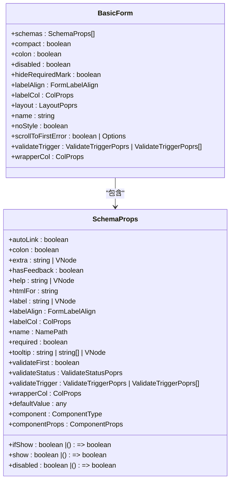
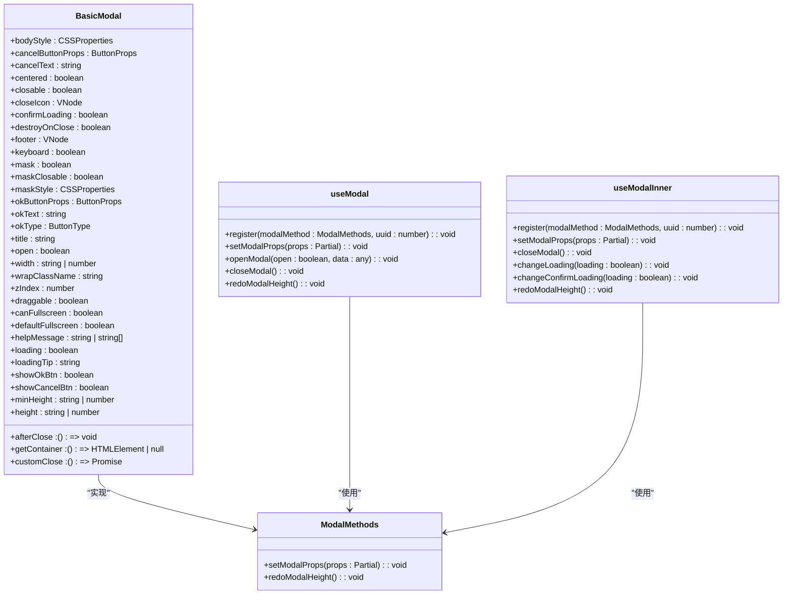
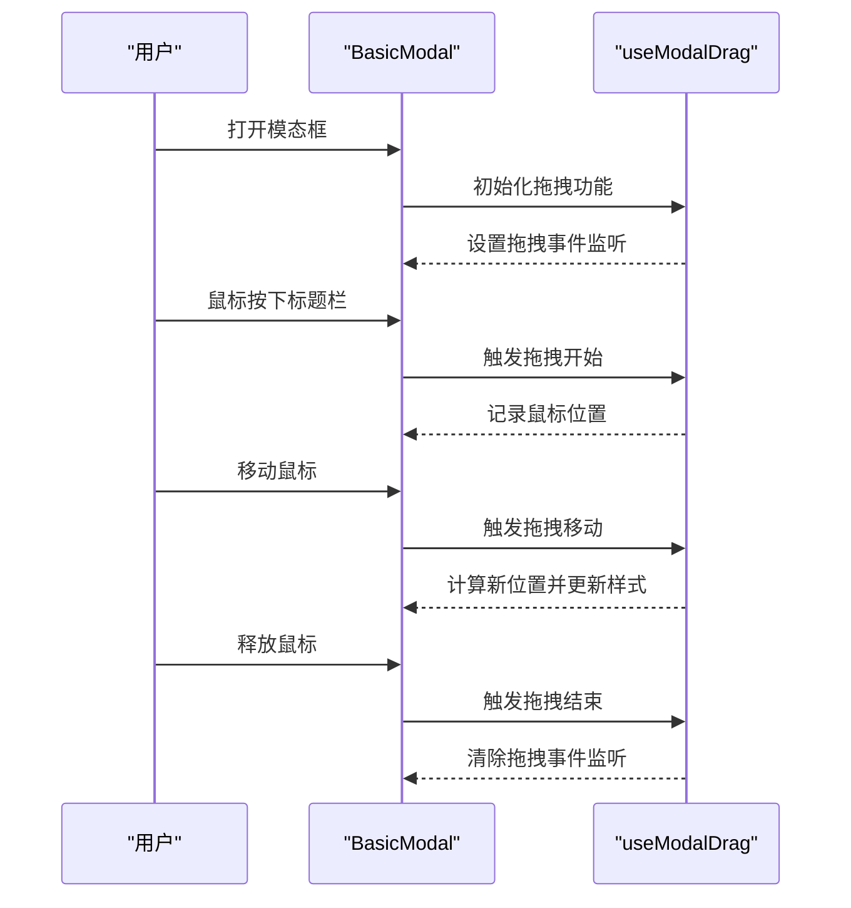
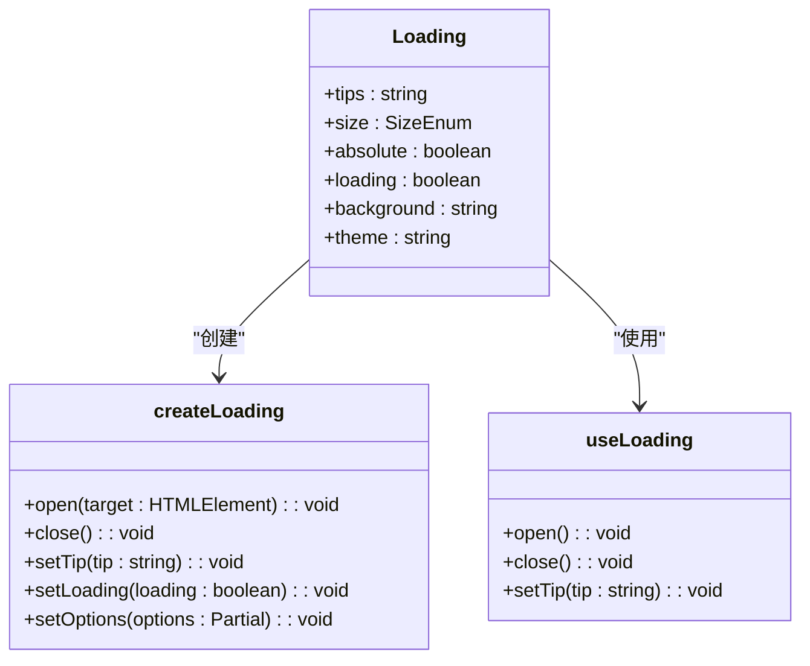
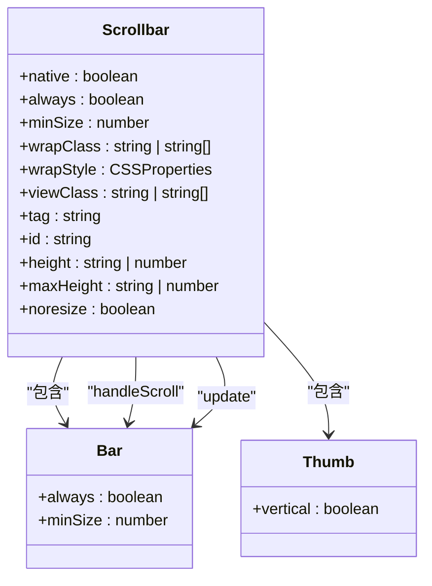

# UI组件库

<cite>
**本文档引用的文件**
- [BasicForm.vue](file://src/components/Form/src/BasicForm.vue)
- [useForm.ts](file://src/components/Form/src/hooks/useForm.ts)
- [props.ts](file://src/components/Form/src/props.ts)
- [BasicModal.vue](file://src/components/Modal/src/BasicModal.vue)
- [props.ts](file://src/components/Modal/src/props.ts)
- [useModal.ts](file://src/components/Modal/src/hooks/useModal.ts)
- [useModalDrag.ts](file://src/components/Modal/src/hooks/useModalDrag.ts)
- [useModalFullScreen.ts](file://src/components/Modal/src/hooks/useModalFullScreen.ts)
- [Loading.vue](file://src/components/Loading/src/Loading.vue)
- [createLoading.ts](file://src/components/Loading/src/createLoading.ts)
- [useLoading.ts](file://src/components/Loading/src/useLoading.ts)
- [Scrollbar.vue](file://src/components/Scrollbar/src/Scrollbar.vue)
- [Icon.vue](file://src/components/Icon/Icon.vue)
</cite>

## 目录
1. [简介](#简介)
2. [核心组件](#核心组件)
3. [表单组件](#表单组件)
4. [模态框组件](#模态框组件)
5. [加载组件](#加载组件)
6. [滚动条组件](#滚动条组件)
7. [图标组件](#图标组件)

## 简介
本文档系统性地文档化项目中封装的可复用UI组件，重点关注`BasicForm`、`BasicModal`、`Loading`、`Scrollbar`和`Icon`等核心组件。这些组件基于Ant Design Vue构建，提供了增强的功能和一致的用户体验。

## 核心组件
本节详细说明项目中封装的核心UI组件，包括其设计目的、使用场景和API接口。每个组件都经过精心设计，以提供一致的用户体验和易于使用的API。

## 表单组件
`BasicForm`组件通过`useForm` Hook实现表单的便捷创建与验证，提供了一种声明式的表单构建方式。



**图表来源**
- [BasicForm.vue](file://src/components/Form/src/BasicForm.vue#L1-L54)
- [props.ts](file://src/components/Form/src/props.ts#L1-L44)
- [types/props.ts](file://src/components/Form/src/types/props.ts#L1-L109)

**章节来源**
- [BasicForm.vue](file://src/components/Form/src/BasicForm.vue#L1-L54)
- [props.ts](file://src/components/Form/src/props.ts#L1-L44)

### useForm Hook
`useForm` Hook为表单组件提供了便捷的创建和验证功能，通过组合式API的方式简化了表单的使用。

**章节来源**
- [useForm.ts](file://src/components/Form/src/hooks/useForm.ts#L1-L2)

## 模态框组件
`BasicModal`组件提供了丰富的功能，包括打开/关闭控制、拖拽功能和全屏模式，为用户提供灵活的模态框交互体验。



**图表来源**
- [BasicModal.vue](file://src/components/Modal/src/BasicModal.vue#L1-L168)
- [props.ts](file://src/components/Modal/src/props.ts#L1-L84)
- [useModal.ts](file://src/components/Modal/src/hooks/useModal.ts#L1-L164)

**章节来源**
- [BasicModal.vue](file://src/components/Modal/src/BasicModal.vue#L1-L168)
- [props.ts](file://src/components/Modal/src/props.ts#L1-L84)

### 拖拽功能
`useModalDrag` Hook实现了模态框的拖拽功能，允许用户通过拖拽标题栏来移动模态框位置。



**图表来源**
- [useModalDrag.ts](file://src/components/Modal/src/hooks/useModalDrag.ts#L1-L121)
- [BasicModal.vue](file://src/components/Modal/src/BasicModal.vue#L120)

**章节来源**
- [useModalDrag.ts](file://src/components/Modal/src/hooks/useModalDrag.ts#L1-L121)

### 全屏模式
`useModalFullScreen` Hook提供了模态框的全屏切换功能，允许用户通过点击按钮切换全屏模式。

**章节来源**
- [useModalFullScreen.ts](file://src/components/Modal/src/hooks/useModalFullScreen.ts)

## 加载组件
`Loading`组件提供了两种使用模式：指令式和组件式，满足不同场景下的加载状态展示需求。



**图表来源**
- [Loading.vue](file://src/components/Loading/src/Loading.vue#L1-L59)
- [createLoading.ts](file://src/components/Loading/src/createLoading.ts#L1-L76)
- [useLoading.ts](file://src/components/Loading/src/useLoading.ts#L1-L32)

**章节来源**
- [Loading.vue](file://src/components/Loading/src/Loading.vue#L1-L59)
- [createLoading.ts](file://src/components/Loading/src/createLoading.ts#L1-L76)
- [useLoading.ts](file://src/components/Loading/src/useLoading.ts#L1-L32)

### 组件式使用
组件式使用方式通过在模板中直接使用`Loading`组件来展示加载状态。

**章节来源**
- [Loading.vue](file://src/components/Loading/src/Loading.vue#L1-L59)

### 指令式使用
指令式使用方式通过`createLoading`函数或`useLoading` Hook来动态创建和控制加载状态。

**章节来源**
- [createLoading.ts](file://src/components/Loading/src/createLoading.ts#L1-L76)
- [useLoading.ts](file://src/components/Loading/src/useLoading.ts#L1-L32)

## 滚动条组件
`Scrollbar`组件通过自定义滚动条样式，替代原生滚动条以获得更一致的视觉效果，特别是在不同操作系统和浏览器之间。



**图表来源**
- [Scrollbar.vue](file://src/components/Scrollbar/src/Scrollbar.vue#L1-L141)
- [Bar.vue](file://src/components/Scrollbar/src/Bar.vue)
- [Thumb.vue](file://src/components/Scrollbar/src/Thumb.vue)

**章节来源**
- [Scrollbar.vue](file://src/components/Scrollbar/src/Scrollbar.vue#L1-L141)

## 图标组件
`Icon`组件封装了@iconify/vue库，提供了统一的图标使用方式，并与项目主题系统集成。

```mermaid
classDiagram
class Icon {
+icon : string
+color : string
+size : number | string
+spin : boolean
+prefix : string
}
Icon --> "@iconify/vue" : "使用"
```

**图表来源**
- [Icon.vue](file://src/components/Icon/Icon.vue#L1-L64)

**章节来源**
- [Icon.vue](file://src/components/Icon/Icon.vue#L1-L64)