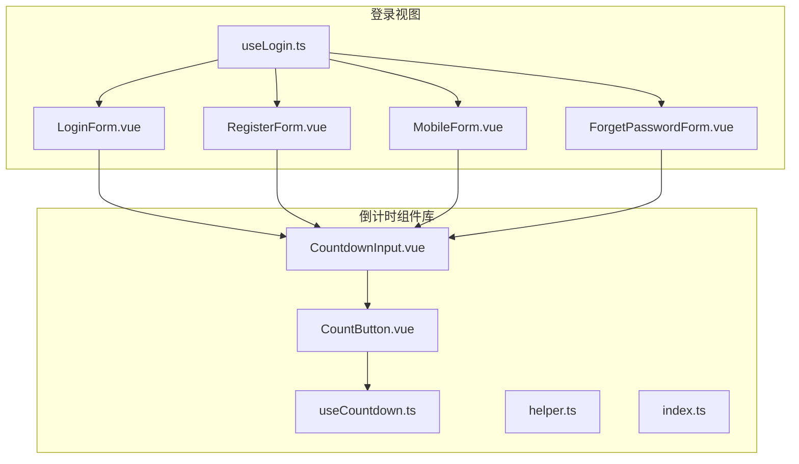
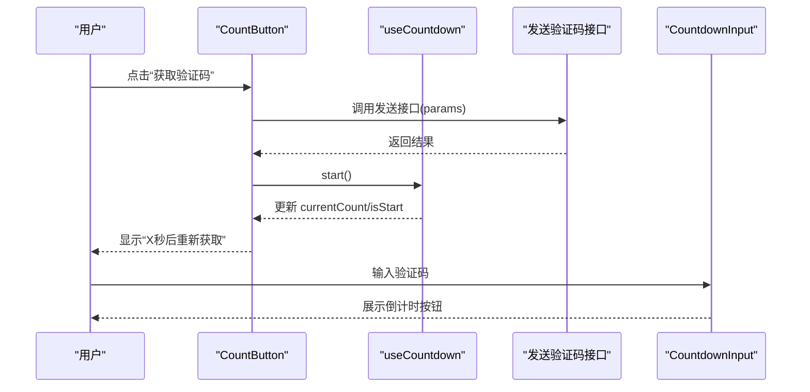
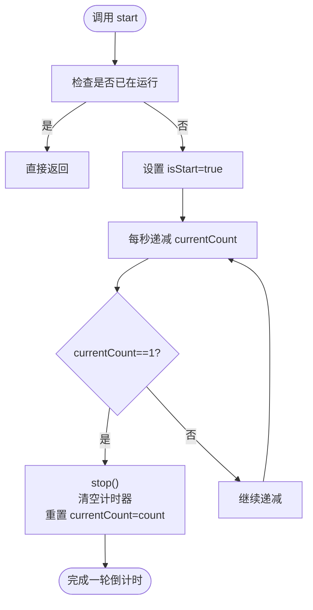
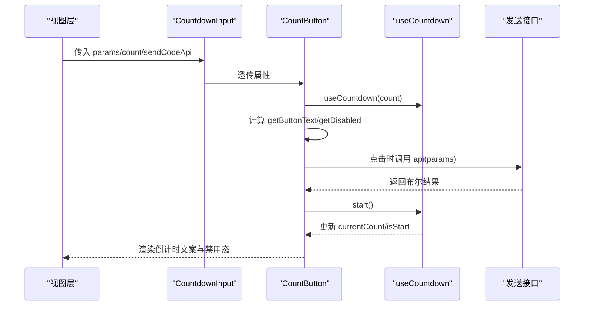
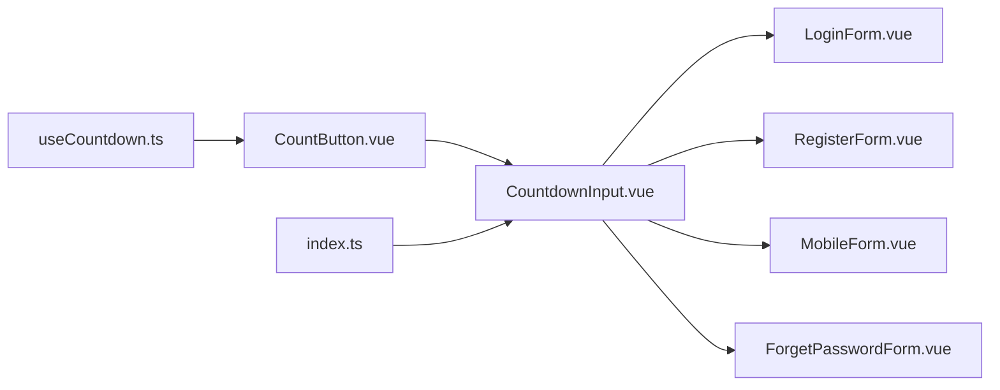

# 倒计时组件

<cite>
**本文引用的文件**
- [useCountdown.ts](file://src/components/Countdown/src/useCountdown.ts)
- [CountButton.vue](file://src/components/Countdown/src/CountButton.vue)
- [CountdownInput.vue](file://src/components/Countdown/src/CountdownInput.vue)
- [helper.ts](file://src/components/Countdown/src/helper.ts)
- [index.ts](file://src/components/Countdown/index.ts)
- [LoginForm.vue](file://src/views/system/login/components/LoginForm.vue)
- [RegisterForm.vue](file://src/views/system/login/components/RegisterForm.vue)
- [MobileForm.vue](file://src/views/system/login/components/MobileForm.vue)
- [ForgetPasswordForm.vue](file://src/views/system/login/components/ForgetPasswordForm.vue)
- [useLogin.ts](file://src/views/system/login/useLogin.ts)
</cite>

## 目录
1. [简介](#简介)
2. [项目结构](#项目结构)
3. [核心组件](#核心组件)
4. [架构总览](#架构总览)
5. [详细组件分析](#详细组件分析)
6. [依赖关系分析](#依赖关系分析)
7. [性能考量](#性能考量)
8. [故障排查指南](#故障排查指南)
9. [结论](#结论)
10. [附录](#附录)

## 简介
本文件系统性地文档化了倒计时功能组件的设计与实现，重点覆盖以下内容：
- useCountdown Hook 的状态管理与生命周期控制（开始、暂停、重置、重启、清理）
- CountButton 组件如何集成倒计时以支持“验证码发送”场景（展示剩余秒数、禁用点击、触发发送接口）
- CountdownInput 组件的使用场景（限时输入框），以及与 CountButton 的组合方式
- helper.ts 中的格式化工具函数（将毫秒或秒转换为 mm:ss 等格式）
- 在登录/注册流程中的完整使用示例与时间结束后的回调处理建议

## 项目结构
倒计时相关代码集中在 src/components/Countdown 目录下，包含 Hook、按钮组件、输入框组件与格式化工具；同时在登录视图中通过 CountdownInput 实现短信验证码输入。

图表来源
- [useCountdown.ts](file://src/components/Countdown/src/useCountdown.ts#L1-L55)
- [CountButton.vue](file://src/components/Countdown/src/CountButton.vue#L1-L55)
- [CountdownInput.vue](file://src/components/Countdown/src/CountdownInput.vue#L1-L57)
- [helper.ts](file://src/components/Countdown/src/helper.ts#L1-L106)
- [index.ts](file://src/components/Countdown/index.ts#L1-L4)
- [LoginForm.vue](file://src/views/system/login/components/LoginForm.vue#L1-L81)
- [RegisterForm.vue](file://src/views/system/login/components/RegisterForm.vue#L1-L68)
- [MobileForm.vue](file://src/views/system/login/components/MobileForm.vue#L1-L44)
- [ForgetPasswordForm.vue](file://src/views/system/login/components/ForgetPasswordForm.vue#L1-L49)
- [useLogin.ts](file://src/views/system/login/useLogin.ts#L1-L41)

章节来源
- [index.ts](file://src/components/Countdown/index.ts#L1-L4)

## 核心组件
- useCountdown：提供倒计时核心状态与控制方法，包括 start、stop、reset、restart、clear，以及当前剩余秒数 currentCount 与是否开始 isStart。
- CountButton：基于 Ant Design Vue Button 的二次封装，内置倒计时显示与禁用逻辑，可选传入发送验证码接口并在成功后自动启动倒计时。
- CountdownInput：基于 Ant Design Vue Input 的二次封装，提供 addonAfter 插槽放置 CountButton，形成“输入框+发送验证码”的一体化组件。
- helper.ts：提供时间格式化工具（padZero、parseTimeData、parseFormat、isSameSecond、_simpleTick）。

章节来源
- [useCountdown.ts](file://src/components/Countdown/src/useCountdown.ts#L1-L55)
- [CountButton.vue](file://src/components/Countdown/src/CountButton.vue#L1-L55)
- [CountdownInput.vue](file://src/components/Countdown/src/CountdownInput.vue#L1-L57)
- [helper.ts](file://src/components/Countdown/src/helper.ts#L1-L106)

## 架构总览
倒计时组件采用“Hook + 组合式组件”的设计模式：
- useCountdown 提供纯逻辑的状态与计时器管理
- CountButton 作为 UI 控件，消费 useCountdown 并封装交互（禁用、文案、点击事件）
- CountdownInput 作为容器组件，将输入框与 CountButton 组合，便于在表单中复用
- helper.ts 提供通用的时间格式化能力，可在需要时用于更复杂的倒计时显示

图表来源
- [CountButton.vue](file://src/components/Countdown/src/CountButton.vue#L1-L55)
- [useCountdown.ts](file://src/components/Countdown/src/useCountdown.ts#L1-L55)

## 详细组件分析

### useCountdown Hook
- 设计要点
  - 使用 ref 维护当前剩余秒数 currentCount 与是否开始 isStart
  - 使用 setInterval 实现每秒递减，到达 1 秒时自动停止并重置到初始值
  - 提供 stop/clear/reset/restart 等方法，确保在组件卸载时清理计时器
- 状态流转
  - start -> isStart=true，进入每秒递减循环
  - 当 currentCount 降至 1 时 stop，随后恢复为初始值
  - reset 清空计时并停止
  - restart 先 reset 再 start
- 生命周期
  - 在组件卸载时调用 reset，避免内存泄漏

图表来源
- [useCountdown.ts](file://src/components/Countdown/src/useCountdown.ts#L1-L55)

章节来源
- [useCountdown.ts](file://src/components/Countdown/src/useCountdown.ts#L1-L55)

### CountButton 组件
- 功能特性
  - 接收 count、disabled、params、api 等属性
  - 通过 useCountdown 消费倒计时状态
  - 文案根据 isStart 与 currentCount 动态变化
  - 禁用条件：props.disabled 为真、倒计时进行中、或 params 为空
  - 点击时若提供 api，则先调用接口，成功后再启动倒计时
- 与 CountdownInput 的协作
  - CountdownInput 将 CountButton 放置于 addonAfter 插槽，形成“输入框+按钮”的组合
- 参数与行为
  - 当 params 变化且为 null/undefined 时，重置倒计时，避免状态错乱

图表来源
- [CountButton.vue](file://src/components/Countdown/src/CountButton.vue#L1-L55)
- [CountdownInput.vue](file://src/components/Countdown/src/CountdownInput.vue#L1-L57)
- [useCountdown.ts](file://src/components/Countdown/src/useCountdown.ts#L1-L55)

章节来源
- [CountButton.vue](file://src/components/Countdown/src/CountButton.vue#L1-L55)

### CountdownInput 组件
- 使用场景
  - 适用于需要“输入验证码并发送”的表单场景，如登录、注册、重置密码等
- 组合方式
  - 通过 addonAfter 插槽嵌入 CountButton，形成一体化输入控件
  - 支持 v-model:value 双向绑定，内部转发 update:value 与 change 事件
- 样式与插槽
  - 通过 buildClass 生成前缀类名，对 addonAfter 进行样式微调
  - 保留其他插槽，便于扩展更多自定义内容

章节来源
- [CountdownInput.vue](file://src/components/Countdown/src/CountdownInput.vue#L1-L57)

### helper.ts 格式化函数
- padZero：将数字按指定长度补零，支持前置或后置补零
- parseTimeData：将毫秒转换为天/时/分/秒/毫秒的对象
- parseFormat：根据格式模板（如 HH:mm:ss:SSS）输出字符串，支持 DD、HH、mm、ss、SSS 占位符
- isSameSecond：判断两个时间戳是否落在同一秒
- _simpleTick：创建短间隔定时器（约 30ms），可用于高频更新的轻量场景

章节来源
- [helper.ts](file://src/components/Countdown/src/helper.ts#L1-L106)

## 依赖关系分析
- 组件间依赖
  - CountButton 依赖 useCountdown
  - CountdownInput 依赖 CountButton
  - 登录视图组件（LoginForm、RegisterForm、MobileForm、ForgetPasswordForm）依赖 CountdownInput
- 导出与入口
  - Countdown 组件库通过 index.ts 导出 CountdownInput，便于外部按需引入

图表来源
- [useCountdown.ts](file://src/components/Countdown/src/useCountdown.ts#L1-L55)
- [CountButton.vue](file://src/components/Countdown/src/CountButton.vue#L1-L55)
- [CountdownInput.vue](file://src/components/Countdown/src/CountdownInput.vue#L1-L57)
- [LoginForm.vue](file://src/views/system/login/components/LoginForm.vue#L1-L81)
- [RegisterForm.vue](file://src/views/system/login/components/RegisterForm.vue#L1-L68)
- [MobileForm.vue](file://src/views/system/login/components/MobileForm.vue#L1-L44)
- [ForgetPasswordForm.vue](file://src/views/system/login/components/ForgetPasswordForm.vue#L1-L49)
- [index.ts](file://src/components/Countdown/index.ts#L1-L4)

章节来源
- [index.ts](file://src/components/Countdown/index.ts#L1-L4)

## 性能考量
- 计时器管理
  - 建议在组件卸载时调用 reset，避免未清理的定时器导致内存泄漏
- 事件与渲染
  - CountButton 仅在 isStart/currentCount 变化时更新文案，减少不必要的渲染
  - CountdownInput 通过计算属性与 v-model 双向绑定，避免额外状态同步开销
- 接口调用
  - 发送验证码接口应尽量幂等且快速，避免阻塞倒计时启动
- 格式化开销
  - helper.ts 的格式化函数为纯计算，复杂度低；在高频刷新场景建议缓存中间结果

## 故障排查指南
- 倒计时不启动
  - 检查 props.disabled 是否为 true
  - 检查 params 是否为空，CountButton 会在 params 为 null/undefined 时重置倒计时
  - 确认未重复调用 start，useCountdown 已内置防重复启动保护
- 倒计时结束后无法再次点击
  - 确认发送接口返回值为真值，才能触发 start
  - 若无接口，直接调用 start 即可
- 文案未更新
  - 确保 currentCount/isStart 的响应式更新生效
  - 检查父组件是否正确传递 count 与 params
- 卸载后内存泄漏
  - 确保组件卸载时未手动持有定时器引用，useCountdown 已在卸载时自动 reset

章节来源
- [CountButton.vue](file://src/components/Countdown/src/CountButton.vue#L1-L55)
- [useCountdown.ts](file://src/components/Countdown/src/useCountdown.ts#L1-L55)

## 结论
倒计时组件通过 useCountdown 提供简洁可靠的计时逻辑，配合 CountButton 与 CountdownInput 实现“验证码发送+输入框”的常见业务场景。helper.ts 提供了灵活的时间格式化能力，便于扩展更丰富的倒计时展示形式。整体设计遵循组合式组件理念，易于在登录/注册等多处场景复用。

## 附录

### 在登录/注册流程中的使用示例与回调建议
- RegisterForm（注册）
  - 使用 CountdownInput 绑定验证码字段，通过 v-model:value 双向绑定
  - 通过 computed 的 params 将手机号作为发送验证码的必要参数
  - 发送接口成功后自动启动倒计时，按钮禁用直至倒计时结束
  - 参考路径
    - [RegisterForm.vue](file://src/views/system/login/components/RegisterForm.vue#L1-L68)
    - [CountdownInput.vue](file://src/components/Countdown/src/CountdownInput.vue#L1-L57)
    - [CountButton.vue](file://src/components/Countdown/src/CountButton.vue#L1-L55)
- MobileForm（手机登录）
  - 同样使用 CountdownInput，参数由手机号驱动
  - 参考路径
    - [MobileForm.vue](file://src/views/system/login/components/MobileForm.vue#L1-L44)
- ForgetPasswordForm（重置密码）
  - 与注册类似，但表单字段包含账户与手机号
  - 参考路径
    - [ForgetPasswordForm.vue](file://src/views/system/login/components/ForgetPasswordForm.vue#L1-L49)
- 登录状态切换
  - useLogin 提供登录状态枚举与切换逻辑，便于在不同表单之间切换
  - 参考路径
    - [useLogin.ts](file://src/views/system/login/useLogin.ts#L1-L41)

### 时间结束后的回调处理建议
- 倒计时结束即自动停止并重置 currentCount，此时按钮可再次点击
- 若需在倒计时结束时执行特定逻辑（如提示、刷新页面），可在父组件监听 CountButton 的状态变化或通过事件向上抛出
- 对于需要精确秒级感知的场景，可结合 helper.ts 的 isSameSecond 辅助判断

章节来源
- [CountButton.vue](file://src/components/Countdown/src/CountButton.vue#L1-L55)
- [useCountdown.ts](file://src/components/Countdown/src/useCountdown.ts#L1-L55)
- [helper.ts](file://src/components/Countdown/src/helper.ts#L1-L106)