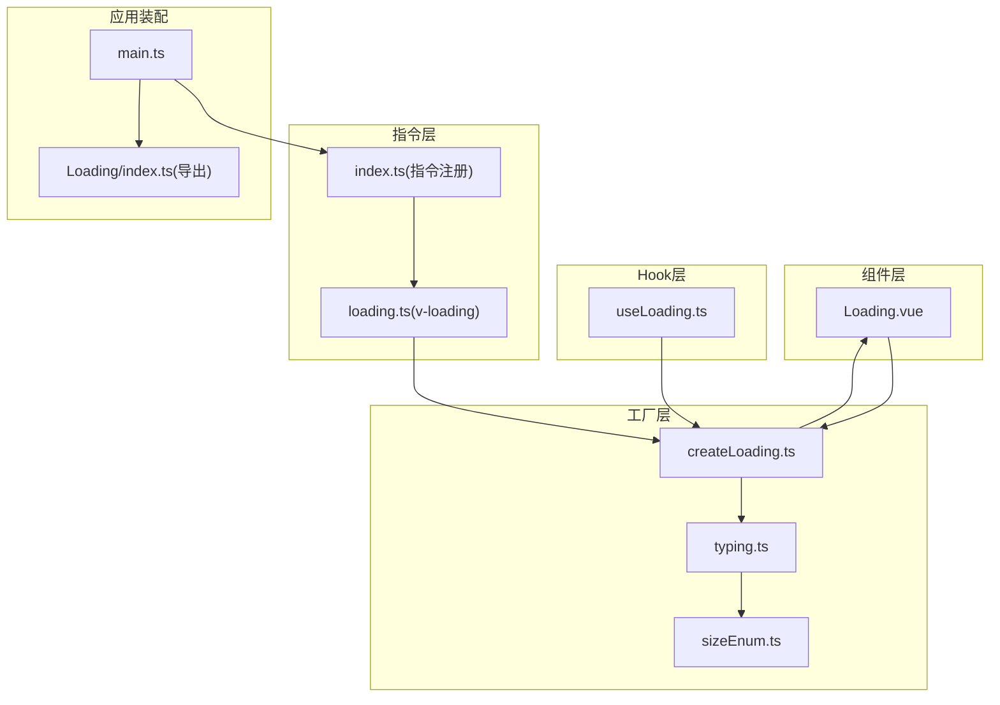
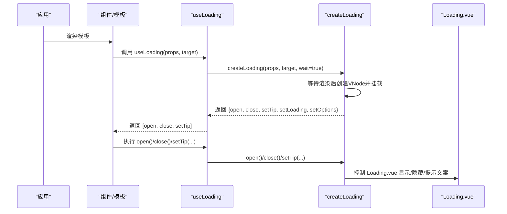
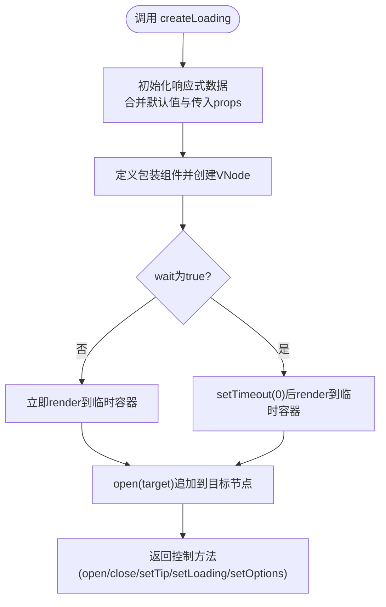
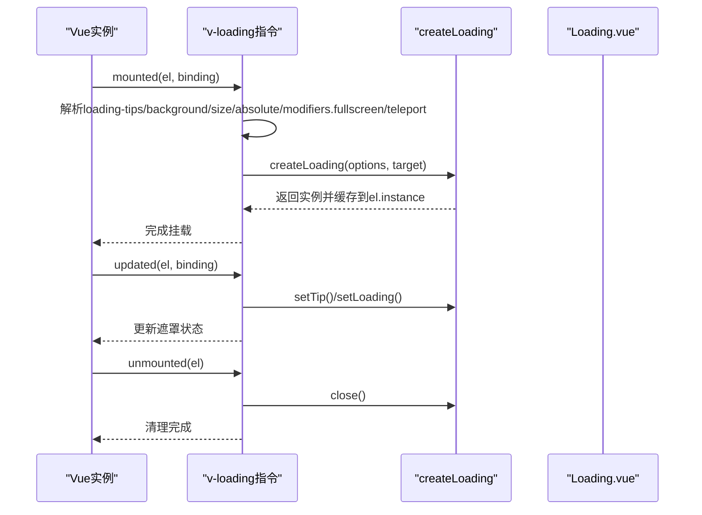
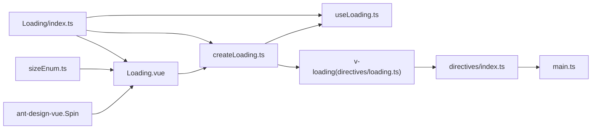

# 加载组件

<cite>
**本文引用的文件列表**
- [Loading.vue](file://src/components/Loading/src/Loading.vue)
- [createLoading.ts](file://src/components/Loading/src/createLoading.ts)
- [useLoading.ts](file://src/components/Loading/src/useLoading.ts)
- [typing.ts](file://src/components/Loading/src/typing.ts)
- [sizeEnum.ts](file://src/enums/sizeEnum.ts)
- [loading.ts](file://src/directives/loading.ts)
- [index.ts（指令入口）](file://src/directives/index.ts)
- [index.ts（Loading导出）](file://src/components/Loading/index.ts)
- [ModalWrapper.vue](file://src/components/Modal/src/components/ModalWrapper.vue)
- [main.ts](file://src/main.ts)
</cite>

## 目录
1. [简介](#简介)
2. [项目结构](#项目结构)
3. [核心组件](#核心组件)
4. [架构总览](#架构总览)
5. [详细组件分析](#详细组件分析)
6. [依赖关系分析](#依赖关系分析)
7. [性能考量](#性能考量)
8. [故障排查指南](#故障排查指南)
9. [结论](#结论)
10. [附录](#附录)

## 简介
本文件系统性地文档化加载组件的双重使用模式：
- 作为 Vue 组件嵌入模板中，支持全屏或容器内加载状态。
- 通过编程方式创建加载实例，常用于异步操作的包裹。
- 在组合式 API 中便捷地管理加载状态的 Hook。
- 基于指令 v-loading 的实现原理，动态监听 DOM 并插入加载遮罩。

同时提供在表单提交、数据请求等场景下的加载状态管理最佳实践与参考路径。

## 项目结构
加载能力由以下模块协同实现：
- 组件层：Loading.vue 提供基础 UI 展示。
- 工厂层：createLoading.ts 提供动态创建与控制接口。
- Hook 层：useLoading.ts 封装组合式 API 的便捷调用。
- 指令层：v-loading 指令基于 createLoading 实现 DOM 级别的自动挂载与卸载。
- 导出与注册：Loading/index.ts 汇总导出；directives/index.ts 注册全局指令；main.ts 完成应用级装配。

图表来源
- [Loading.vue](file://src/components/Loading/src/Loading.vue#L1-L59)
- [createLoading.ts](file://src/components/Loading/src/createLoading.ts#L1-L76)
- [typing.ts](file://src/components/Loading/src/typing.ts#L1-L11)
- [sizeEnum.ts](file://src/enums/sizeEnum.ts#L1-L6)
- [useLoading.ts](file://src/components/Loading/src/useLoading.ts#L1-L32)
- [loading.ts](file://src/directives/loading.ts#L1-L46)
- [index.ts（指令入口）](file://src/directives/index.ts#L1-L11)
- [index.ts（Loading导出）](file://src/components/Loading/index.ts#L1-L6)
- [main.ts](file://src/main.ts#L1-L29)

章节来源
- [Loading.vue](file://src/components/Loading/src/Loading.vue#L1-L59)
- [createLoading.ts](file://src/components/Loading/src/createLoading.ts#L1-L76)
- [useLoading.ts](file://src/components/Loading/src/useLoading.ts#L1-L32)
- [loading.ts](file://src/directives/loading.ts#L1-L46)
- [index.ts（指令入口）](file://src/directives/index.ts#L1-L11)
- [index.ts（Loading导出）](file://src/components/Loading/index.ts#L1-L6)
- [main.ts](file://src/main.ts#L1-L29)

## 核心组件
- Loading.vue：提供全屏/容器内加载遮罩的 UI 基础，支持主题、尺寸、背景色、提示文案等配置。
- createLoading：动态创建 Loading 实例，返回 open/close/setTip/setLoading/setOptions 等方法，支持等待渲染与目标节点挂载。
- useLoading：在组合式 API 中封装 createLoading，返回 [open, close, setTip] 三元组，便于在 setup 中直接使用。
- v-loading 指令：基于 createLoading 自动监听绑定元素，按需插入/更新/移除加载遮罩，支持修饰符 fullscreen 与属性 loading-tips、loading-background、loading-size、loading-teleport 等。

章节来源
- [Loading.vue](file://src/components/Loading/src/Loading.vue#L1-L59)
- [createLoading.ts](file://src/components/Loading/src/createLoading.ts#L1-L76)
- [useLoading.ts](file://src/components/Loading/src/useLoading.ts#L1-L32)
- [loading.ts](file://src/directives/loading.ts#L1-L46)
- [typing.ts](file://src/components/Loading/src/typing.ts#L1-L11)
- [sizeEnum.ts](file://src/enums/sizeEnum.ts#L1-L6)

## 架构总览
从“组件-工厂-Hook-指令”四层解耦，形成统一的加载状态管理能力：
- 组件层仅负责展示，不关心生命周期与挂载细节。
- 工厂层抽象出可复用的实例化与控制逻辑。
- Hook 层面向组合式 API，屏蔽等待渲染与目标节点等复杂性。
- 指令层面向模板，自动完成 DOM 级别的挂载与更新。

图表来源
- [useLoading.ts](file://src/components/Loading/src/useLoading.ts#L1-L32)
- [createLoading.ts](file://src/components/Loading/src/createLoading.ts#L1-L76)
- [Loading.vue](file://src/components/Loading/src/Loading.vue#L1-L59)

## 详细组件分析

### 组件 Loading.vue
- 功能要点
  - 支持全屏与绝对定位两种模式，通过 absolute 属性切换。
  - 主题适配深色模式，根据 data-theme 切换背景色。
  - 接收 tips、size、absolute、loading、background、theme 等属性。
- 关键点
  - v-show 控制显隐，避免不必要的销毁重建。
  - 通过类名与样式实现全屏覆盖与层级控制。
  - 与 ant-design-vue 的 Spin 组合，统一加载图标体验。

章节来源
- [Loading.vue](file://src/components/Loading/src/Loading.vue#L1-L59)

### 工厂 createLoading
- 功能要点
  - 动态创建 Loading 组件实例，返回 open/close/setTip/setLoading/setOptions 方法。
  - 支持 wait 参数，在 setup 中使用时需等待渲染。
  - 可指定目标节点 target，默认挂载至 document.body 或传入的容器。
- 关键流程
  - 使用 reactive 合并默认值与用户传入 props。
  - 通过 defineComponent + createVNode 包裹 Loading，再 render 到临时容器。
  - open 将实例元素追加到目标节点；close 移除实例元素。
  - setOptions 支持动态合并配置项。

图表来源
- [createLoading.ts](file://src/components/Loading/src/createLoading.ts#L1-L76)

章节来源
- [createLoading.ts](file://src/components/Loading/src/createLoading.ts#L1-L76)
- [typing.ts](file://src/components/Loading/src/typing.ts#L1-L11)

### Hook useLoading
- 功能要点
  - 在组合式 API 中简化 createLoading 的调用，返回 [open, close, setTip]。
  - 默认 target 为 document.body，wait 设为 true，避免在 setup 中提前渲染。
- 使用建议
  - 在 onMounted 之后再执行 open，确保 DOM 可用。
  - 在异步任务结束时调用 close，及时释放资源。

章节来源
- [useLoading.ts](file://src/components/Loading/src/useLoading.ts#L1-L32)
- [createLoading.ts](file://src/components/Loading/src/createLoading.ts#L1-L76)

### 指令 v-loading
- 功能要点
  - mounted：读取绑定元素上的 loading-tips、loading-background、loading-size、loading-teleport、loading-absolute 等属性，以及 fullscreen 修饰符，调用 createLoading 创建实例并缓存到 el.instance。
  - updated：当绑定值变化时，同步更新提示文案与 loading 状态。
  - unmounted：清理实例，关闭遮罩。
- 关键行为
  - fullscreen 修饰符与 loading-absolute 属性共同决定是否全屏遮罩。
  - teleport 属性存在时，将遮罩挂载到 document.body，避免被容器裁剪。
- 注册与使用
  - directives/index.ts 中导出 setupLoadingDirective(app)，main.ts 中调用 setupGlobDirectives(app) 完成全局注册。
  - 模板中直接使用 v-loading="loading"，并在容器上设置 loading-tips 等属性。

图表来源
- [loading.ts](file://src/directives/loading.ts#L1-L46)
- [createLoading.ts](file://src/components/Loading/src/createLoading.ts#L1-L76)
- [index.ts（指令入口）](file://src/directives/index.ts#L1-L11)
- [main.ts](file://src/main.ts#L1-L29)

章节来源
- [loading.ts](file://src/directives/loading.ts#L1-L46)
- [index.ts（指令入口）](file://src/directives/index.ts#L1-L11)
- [main.ts](file://src/main.ts#L1-L29)

### 类型与枚举
- LoadingProps：定义 tips、size、absolute、loading、background、theme 等字段。
- SizeEnum：提供 default/small/large 三种尺寸枚举，配合 Loading.vue 的 size 属性使用。

章节来源
- [typing.ts](file://src/components/Loading/src/typing.ts#L1-L11)
- [sizeEnum.ts](file://src/enums/sizeEnum.ts#L1-L6)

### 实际示例与最佳实践
- 表单提交
  - 在提交按钮点击后，调用 useLoading 打开遮罩，提交完成后关闭遮罩。
  - 可通过 setTip 动态更新提示文案，如“校验中...”、“保存中...”。
  - 参考路径：[useLoading.ts](file://src/components/Loading/src/useLoading.ts#L1-L32)
- 数据请求
  - 在发起网络请求前调用 useLoading 打开遮罩，请求结束后关闭遮罩。
  - 对于长耗时请求，结合指令 v-loading 在容器内显示局部遮罩，避免全屏遮罩影响其他区域。
  - 参考路径：[loading.ts](file://src/directives/loading.ts#L1-L46)
- 弹窗内容
  - 在弹窗内容容器上使用 v-loading，结合 loading-tips 设置提示文案，实现局部加载状态管理。
  - 参考路径：[ModalWrapper.vue](file://src/components/Modal/src/components/ModalWrapper.vue#L1-L128)

章节来源
- [useLoading.ts](file://src/components/Loading/src/useLoading.ts#L1-L32)
- [loading.ts](file://src/directives/loading.ts#L1-L46)
- [ModalWrapper.vue](file://src/components/Modal/src/components/ModalWrapper.vue#L1-L128)

## 依赖关系分析
- 组件依赖
  - Loading.vue 依赖 ant-design-vue 的 Spin 组件与 sizeEnum 枚举。
  - createLoading.ts 依赖 Loading.vue 与 LoadingProps 类型。
  - useLoading.ts 依赖 createLoading.ts。
  - v-loading 指令依赖 createLoading.ts。
- 应用装配
  - main.ts 调用 setupGlobDirectives(app) 注册全局指令。
  - Loading/index.ts 汇总导出 Loading、createLoading、useLoading，便于外部按需引入。

图表来源
- [Loading.vue](file://src/components/Loading/src/Loading.vue#L1-L59)
- [createLoading.ts](file://src/components/Loading/src/createLoading.ts#L1-L76)
- [useLoading.ts](file://src/components/Loading/src/useLoading.ts#L1-L32)
- [loading.ts](file://src/directives/loading.ts#L1-L46)
- [index.ts（指令入口）](file://src/directives/index.ts#L1-L11)
- [index.ts（Loading导出）](file://src/components/Loading/index.ts#L1-L6)
- [main.ts](file://src/main.ts#L1-L29)

章节来源
- [Loading.vue](file://src/components/Loading/src/Loading.vue#L1-L59)
- [createLoading.ts](file://src/components/Loading/src/createLoading.ts#L1-L76)
- [useLoading.ts](file://src/components/Loading/src/useLoading.ts#L1-L32)
- [loading.ts](file://src/directives/loading.ts#L1-L46)
- [index.ts（指令入口）](file://src/directives/index.ts#L1-L11)
- [index.ts（Loading导出）](file://src/components/Loading/index.ts#L1-L6)
- [main.ts](file://src/main.ts#L1-L29)

## 性能考量
- 避免在 setup 中过早渲染：useLoading 默认 wait=true，确保在合适的生命周期阶段渲染，减少不必要的 DOM 操作。
- 局部遮罩优先：在容器内使用 v-loading 可避免全屏遮罩带来的整体布局抖动。
- 及时清理：在组件卸载或异步任务结束时调用 close，释放 DOM 节点，降低内存占用。
- 文案与尺寸：合理设置 tips 与 size，避免频繁变更触发重绘。

## 故障排查指南
- 指令未生效
  - 检查是否在 main.ts 中调用了 setupGlobDirectives(app) 完成全局注册。
  - 确认模板中正确使用 v-loading="loading"，并设置了 loading-tips 等属性。
  - 参考路径：[main.ts](file://src/main.ts#L1-L29)、[index.ts（指令入口）](file://src/directives/index.ts#L1-L11)、[loading.ts](file://src/directives/loading.ts#L1-L46)
- 遮罩未显示
  - 确认 binding.value 为真值，updated 阶段会据此更新 loading 状态。
  - 若使用 fullscreen 修饰符，请确认 loading-absolute 属性未冲突。
  - 参考路径：[loading.ts](file://src/directives/loading.ts#L1-L46)
- 遮罩无法关闭
  - 确保在 unmounted 钩子中调用了 close，或在业务逻辑中主动调用 close。
  - 参考路径：[loading.ts](file://src/directives/loading.ts#L1-L46)
- 全屏遮罩覆盖异常
  - 检查容器是否有 overflow 或 transform 导致遮罩被裁剪，必要时使用 loading-teleport="body"。
  - 参考路径：[loading.ts](file://src/directives/loading.ts#L1-L46)

章节来源
- [main.ts](file://src/main.ts#L1-L29)
- [index.ts（指令入口）](file://src/directives/index.ts#L1-L11)
- [loading.ts](file://src/directives/loading.ts#L1-L46)

## 结论
加载组件通过“组件-工厂-Hook-指令”四层架构，提供了灵活且一致的加载状态管理能力：
- 组件层专注展示，指令层自动挂载，工厂层统一控制，Hook 层简化组合式 API 使用。
- 在表单提交、数据请求、弹窗内容等场景下，既能使用 v-loading 实现模板级自动化，也能通过 useLoading 精准控制生命周期与目标节点。
- 建议优先在容器内使用局部遮罩，结合 useLoading 管理异步任务，确保用户体验与性能平衡。

## 附录
- 导出入口
  - Loading/index.ts 汇总导出 Loading、createLoading、useLoading，便于按需引入与二次封装。
  - 参考路径：[index.ts（Loading导出）](file://src/components/Loading/index.ts#L1-L6)
- 指令注册
  - directives/index.ts 提供 setupLoadingDirective(app)，main.ts 中调用 setupGlobDirectives(app) 完成全局注册。
  - 参考路径：[index.ts（指令入口）](file://src/directives/index.ts#L1-L11)、[main.ts](file://src/main.ts#L1-L29)