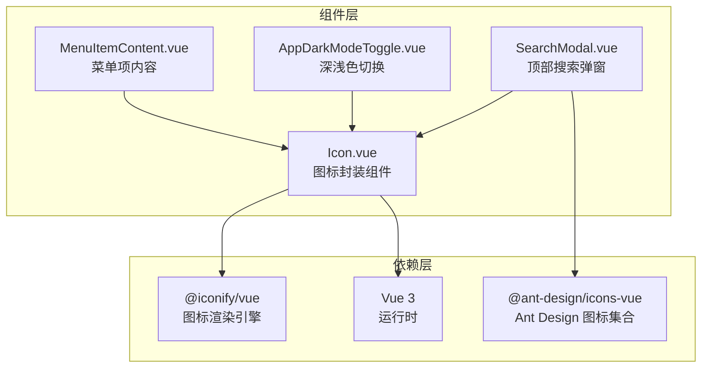
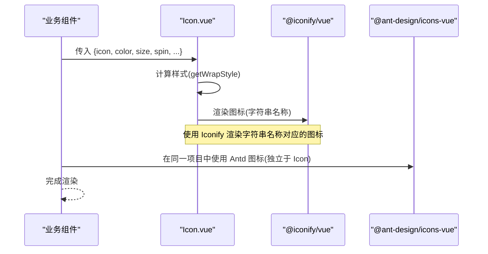
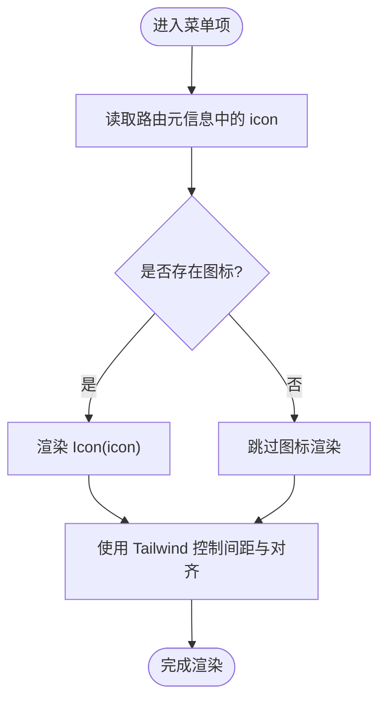
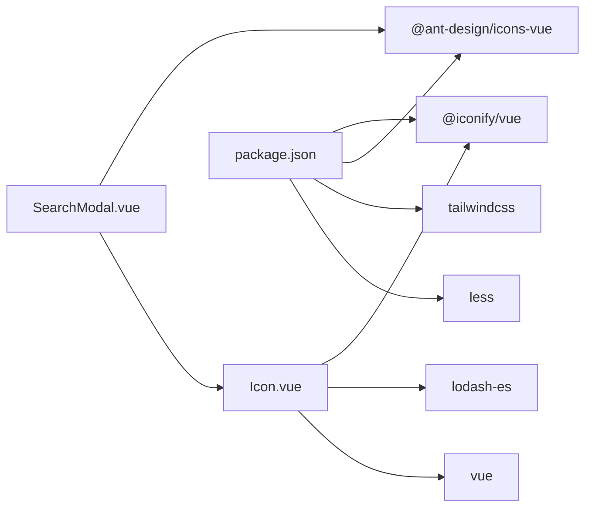

# 图标组件

<cite>
**本文引用的文件**
- [Icon.vue](file://src/components/Icon/Icon.vue)
- [MenuItemContent.vue](file://src/layouts/sider/components/MenuItemContent.vue)
- [AppDarkModeToggle.vue](file://src/components/Application/AppDarkModeToggle.vue)
- [SearchModal.vue](file://src/layouts/header/components/search/SearchModal.vue)
- [package.json](file://package.json)
- [tailwind.config.js](file://tailwind.config.js)
- [tailwind.less](file://src/assets/less/tailwind.less)
</cite>

## 目录
1. [简介](#简介)
2. [项目结构](#项目结构)
3. [核心组件](#核心组件)
4. [架构总览](#架构总览)
5. [详细组件分析](#详细组件分析)
6. [依赖关系分析](#依赖关系分析)
7. [性能考量](#性能考量)
8. [故障排查指南](#故障排查指南)
9. [结论](#结论)
10. [附录](#附录)

## 简介
本文件系统性文档化图标组件的集成与使用方式。该组件是对 @iconify/vue 的轻量级封装，旨在：
- 统一图标引入与渲染方式，简化通过字符串名称动态渲染对应图标的流程；
- 提供尺寸、颜色、旋转等常用属性，便于在不同场景下快速适配；
- 与 Tailwind CSS 类协同工作，提升样式组合灵活性；
- 支持在按钮、菜单项、标签等常见 UI 场景中进行最佳实践示范；
- 为后续扩展（自定义 SVG 或第三方图标库）提供参考路径。

## 项目结构
图标组件位于通用组件目录下，同时在多个业务组件中被复用，体现其作为基础能力的定位。

图表来源
- [Icon.vue](file://src/components/Icon/Icon.vue#L1-L63)
- [MenuItemContent.vue](file://src/layouts/sider/components/MenuItemContent.vue#L1-L32)
- [AppDarkModeToggle.vue](file://src/components/Application/AppDarkModeToggle.vue#L1-L35)
- [SearchModal.vue](file://src/layouts/header/components/search/SearchModal.vue#L1-L63)
- [package.json](file://package.json#L17-L59)

章节来源
- [Icon.vue](file://src/components/Icon/Icon.vue#L1-L63)
- [MenuItemContent.vue](file://src/layouts/sider/components/MenuItemContent.vue#L1-L32)
- [AppDarkModeToggle.vue](file://src/components/Application/AppDarkModeToggle.vue#L1-L35)
- [SearchModal.vue](file://src/layouts/header/components/search/SearchModal.vue#L1-L63)
- [package.json](file://package.json#L17-L59)

## 核心组件
- 组件名称：Icon
- 作用：基于 @iconify/vue 渲染图标；支持通过字符串名称动态渲染；提供尺寸、颜色、旋转等属性；默认禁用缓存以避免图标更新不及时问题；支持透传类名与样式，便于与 Tailwind CSS 协同。

关键特性与行为
- 动态渲染：通过字符串名称（含可选前缀）驱动图标渲染。
- 属性支持：icon、color、size、spin、prefix。
- 样式策略：统一通过内联样式设置字号与颜色；默认 display 为 inline-flex；支持 spin 旋转动画。
- 缓存策略：全局禁用 Iconify 缓存，确保图标更新即时生效。
- 类名透传：继承父组件类名，便于与 Tailwind CSS 组合使用。

章节来源
- [Icon.vue](file://src/components/Icon/Icon.vue#L1-L63)

## 架构总览
图标组件的调用链路如下：业务组件通过引入 Icon 组件并在模板中传入 icon 字符串，Icon 内部委托给 @iconify/vue 的 Icon 组件完成渲染；同时，Icon 可与 Ant Design 的图标库在同一项目中共存。

图表来源
- [Icon.vue](file://src/components/Icon/Icon.vue#L1-L63)
- [SearchModal.vue](file://src/layouts/header/components/search/SearchModal.vue#L66-L73)
- [package.json](file://package.json#L17-L59)

## 详细组件分析

### 组件属性与行为
- 属性定义
  - icon: 字符串，用于指定图标名称（可带前缀），默认为空字符串。
  - color: 字符串，用于设置图标颜色，默认为空字符串。
  - size: 数字或字符串，用于设置图标尺寸，默认为 "16px"；当为数字时自动转为像素值。
  - spin: 布尔值，是否启用旋转动画，默认 false。
  - prefix: 字符串，图标前缀（用于命名空间区分），默认为空字符串。
- 样式计算
  - 将 size 转换为字符串形式（若为数字则加 px）；
  - 返回包含 fontSize、color、display 的样式对象；
  - 默认 display 为 inline-flex，保证与文本基线对齐。
- 动画与类名
  - 当 spin 为真时，附加旋转类名，触发内置旋转动画；
  - 透传父组件类名，便于与 Tailwind CSS 组合使用。

章节来源
- [Icon.vue](file://src/components/Icon/Icon.vue#L12-L37)

### 动态渲染机制
- 名称解析：组件接收字符串形式的图标标识，内部交由 @iconify/vue 解析并渲染对应 SVG。
- 前缀支持：可通过 prefix 与 icon 组合形成完整标识，便于区分不同来源的图标集。
- 缓存策略：全局禁用 Iconify 缓存，避免本地缓存导致图标更新延迟。

章节来源
- [Icon.vue](file://src/components/Icon/Icon.vue#L1-L24)

### 与 Tailwind CSS 的协作
- 类名透传：Icon 继承父组件类名，可在模板中直接叠加 Tailwind 工具类（如 text-*、mr-*、p-* 等）。
- 文本对齐：默认 display 为 inline-flex，天然适配行内元素的垂直居中对齐。
- 实践建议：优先通过类名控制间距与尺寸，通过属性控制颜色与旋转，保持样式与逻辑分离。

章节来源
- [Icon.vue](file://src/components/Icon/Icon.vue#L1-L11)
- [tailwind.less](file://src/assets/less/tailwind.less#L1-L4)
- [tailwind.config.js](file://tailwind.config.js#L1-L20)

### 典型使用场景与最佳实践

#### 在菜单项中使用
- 场景：菜单项左侧显示图标，标题右侧显示文字。
- 实践要点：
  - 通过路由元信息传递图标名称；
  - 使用 Icon 组件渲染图标，结合 Tailwind 控制间距与对齐；
  - 折叠状态下仅显示图标，标题隐藏。

图表来源
- [MenuItemContent.vue](file://src/layouts/sider/components/MenuItemContent.vue#L1-L31)

章节来源
- [MenuItemContent.vue](file://src/layouts/sider/components/MenuItemContent.vue#L1-L31)

#### 在开关组件中使用
- 场景：深浅色切换开关的左右状态分别显示不同图标。
- 实践要点：
  - 在 Switch 的插槽中使用 Icon 组件；
  - 通过 icon 属性传入不同图标名称；
  - 可叠加 Tailwind 工具类控制尺寸与颜色。

章节来源
- [AppDarkModeToggle.vue](file://src/components/Application/AppDarkModeToggle.vue#L1-L35)

#### 在搜索弹窗中使用
- 场景：搜索结果列表项中展示图标与标题，底部操作区展示快捷键图标。
- 实践要点：
  - 列表项中通过 Icon 渲染 item.icon；
  - 底部区域使用 Ant Design 图标与 Icon 组合；
  - 使用 Tailwind 控制布局与视觉层级。

章节来源
- [SearchModal.vue](file://src/layouts/header/components/search/SearchModal.vue#L1-L63)

### 扩展与自定义
- 自定义 SVG 图标
  - 可将自定义 SVG 作为图标资源接入 Iconify，再通过字符串名称在 Icon 中渲染；
  - 或者在业务组件中直接使用原生 SVG，按需与 Icon 的样式体系对齐。
- 第三方图标库
  - 项目已引入 @ant-design/icons-vue，可在同一项目中与 Icon 并行使用；
  - 对于 Antd 图标，直接使用其导出的组件即可；对于 Iconify 图标，使用 Icon 组件传入字符串名称。

章节来源
- [package.json](file://package.json#L17-L59)
- [SearchModal.vue](file://src/layouts/header/components/search/SearchModal.vue#L66-L73)

## 依赖关系分析
- 组件依赖
  - @iconify/vue：负责将字符串名称解析为 SVG 并渲染；
  - lodash-es：提供类型判断工具；
  - Vue 3：组件运行时。
- 项目依赖
  - @ant-design/icons-vue：提供 Ant Design 图标集合；
  - tailwindcss：提供样式工具类；
  - less：样式预处理。

图表来源
- [Icon.vue](file://src/components/Icon/Icon.vue#L1-L24)
- [SearchModal.vue](file://src/layouts/header/components/search/SearchModal.vue#L66-L73)
- [package.json](file://package.json#L17-L59)

章节来源
- [Icon.vue](file://src/components/Icon/Icon.vue#L1-L24)
- [SearchModal.vue](file://src/layouts/header/components/search/SearchModal.vue#L66-L73)
- [package.json](file://package.json#L17-L59)

## 性能考量
- 缓存策略：组件初始化即禁用 Iconify 缓存，避免本地存储占用与图标更新延迟，但可能增加网络请求频率。可根据业务需求评估是否需要缓存策略调整。
- 渲染开销：Icon 组件仅做样式计算与透传，渲染开销极低；大量使用时建议避免重复渲染相同图标，可通过组件缓存或数据层去重。
- 样式合并：优先使用类名控制尺寸与间距，减少内联样式的频繁变更，有助于浏览器渲染优化。

章节来源
- [Icon.vue](file://src/components/Icon/Icon.vue#L22-L37)

## 故障排查指南
- 图标不显示
  - 检查 icon 字符串是否正确（含前缀与命名空间）；
  - 确认网络环境可访问 Iconify 资源；
  - 若使用了前缀，请确保 prefix 与 icon 组合符合预期。
- 图标颜色或尺寸异常
  - 检查 color 与 size 属性传入值；
  - 确认未被外层样式覆盖（如 Tailwind 工具类）。
- 旋转动画无效
  - 确认 spin 属性为真；
  - 检查样式是否被覆盖。
- 图标更新不生效
  - 组件已禁用缓存，若仍不生效，检查网络与 CDN 配置。

章节来源
- [Icon.vue](file://src/components/Icon/Icon.vue#L12-L37)

## 结论
Icon 组件通过轻量封装 @iconify/vue，提供了简洁一致的图标使用体验：以字符串名称驱动动态渲染、统一的尺寸与颜色控制、与 Tailwind CSS 的无缝协作，以及完善的旋转动画支持。在菜单、开关、搜索等常见场景中，Icon 能显著降低图标引入与维护成本。对于自定义与第三方图标库，项目已具备良好兼容性，可按需扩展。

## 附录
- 使用示例位置
  - 菜单项图标：参见 [MenuItemContent.vue](file://src/layouts/sider/components/MenuItemContent.vue#L1-L31)
  - 开关图标：参见 [AppDarkModeToggle.vue](file://src/components/Application/AppDarkModeToggle.vue#L1-L35)
  - 搜索弹窗图标：参见 [SearchModal.vue](file://src/layouts/header/components/search/SearchModal.vue#L1-L63)
- 依赖声明：参见 [package.json](file://package.json#L17-L59)
- Tailwind 配置：参见 [tailwind.config.js](file://tailwind.config.js#L1-L20)，样式入口：参见 [tailwind.less](file://src/assets/less/tailwind.less#L1-L4)