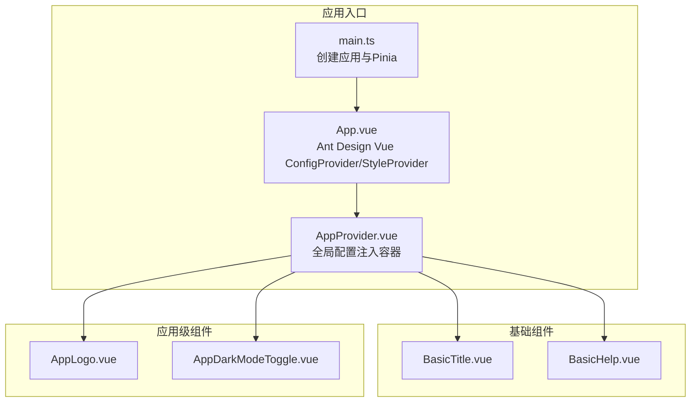
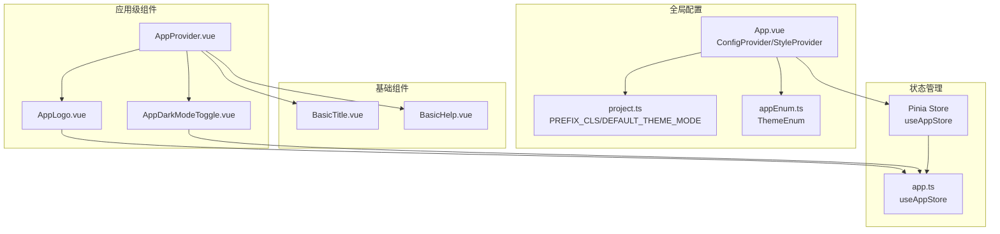
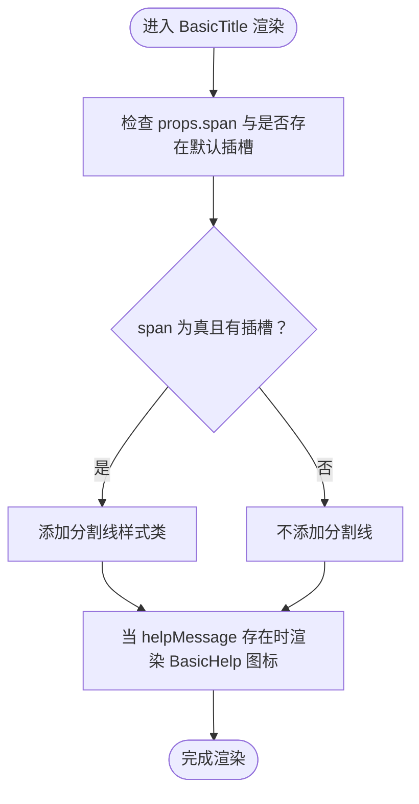
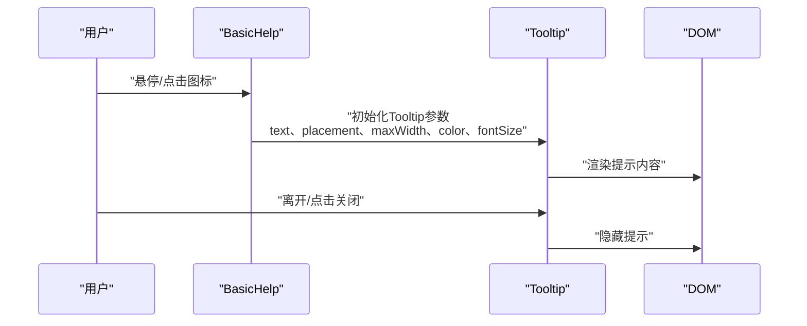
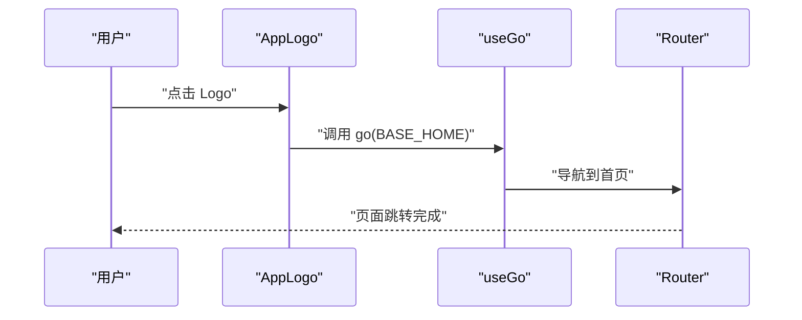
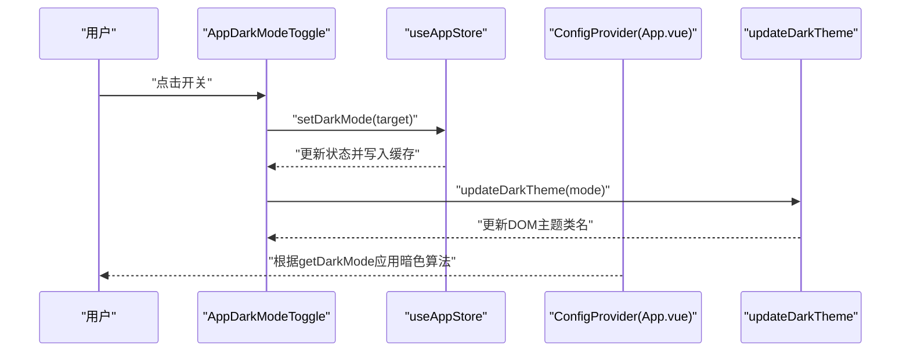
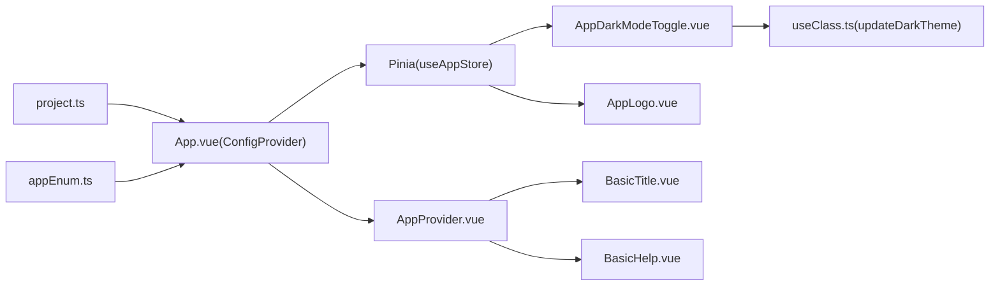

# 基础组件

<cite>
**本文引用的文件**
- [BasicTitle.vue](file://src/components/Basic/BasicTitle.vue)
- [BasicHelp.vue](file://src/components/Basic/BasicHelp.vue)
- [AppLogo.vue](file://src/components/Application/AppLogo.vue)
- [AppDarkModeToggle.vue](file://src/components/Application/AppDarkModeToggle.vue)
- [AppProvider.vue](file://src/components/Application/AppProvider.vue)
- [useClass.ts](file://src/hooks/useClass.ts)
- [appEnum.ts](file://src/enums/appEnum.ts)
- [app.ts](file://src/stores/modules/app.ts)
- [project.ts](file://src/config/project.ts)
- [index.vue（布局侧边栏）](file://src/layouts/sider/index.vue)
- [App.vue](file://src/App.vue)
- [main.ts](file://src/main.ts)
</cite>

## 目录
1. [简介](#简介)
2. [项目结构](#项目结构)
3. [核心组件](#核心组件)
4. [架构总览](#架构总览)
5. [详细组件分析](#详细组件分析)
6. [依赖关系分析](#依赖关系分析)
7. [性能考量](#性能考量)
8. [故障排查指南](#故障排查指南)
9. [结论](#结论)
10. [附录](#附录)

## 简介
本章节系统性地文档化项目中的基础UI组件，重点覆盖以下组件：
- BasicTitle：页面标题的标准化封装，支持多种尺寸与样式变体，内置帮助提示图标集成。
- BasicHelp：帮助提示图标，支持Tooltip提示内容的灵活配置。
- AppLogo：布局中的品牌标识组件，具备响应式设计与点击跳转能力。
- AppDarkModeToggle：与Pinia状态管理集成的主题切换开关，支持本地持久化。
- AppProvider：全局配置注入容器，承载前缀类名等全局配置。

同时，说明这些组件在布局中的实际使用方式，并解释它们如何通过AppProvider与Ant Design Vue的ConfigProvider进行全局配置注入。

## 项目结构
基础组件位于 src/components/Basic 与 src/components/Application 下，分别承担“通用基础”和“应用级布局”的职责；主题与全局配置由App.vue中的ConfigProvider与AppProvider共同完成注入。

图表来源
- [main.ts](file://src/main.ts#L1-L29)
- [App.vue](file://src/App.vue#L1-L42)
- [AppProvider.vue](file://src/components/Application/AppProvider.vue#L1-L21)
- [BasicTitle.vue](file://src/components/Basic/BasicTitle.vue#L1-L51)
- [BasicHelp.vue](file://src/components/Basic/BasicHelp.vue#L1-L70)
- [AppLogo.vue](file://src/components/Application/AppLogo.vue#L1-L64)
- [AppDarkModeToggle.vue](file://src/components/Application/AppDarkModeToggle.vue#L1-L35)

章节来源
- [main.ts](file://src/main.ts#L1-L29)
- [App.vue](file://src/App.vue#L1-L42)
- [AppProvider.vue](file://src/components/Application/AppProvider.vue#L1-L21)

## 核心组件
本节对四个基础组件进行逐项说明，包括功能定位、属性定义、插槽使用、样式与交互行为，并给出在布局中的典型使用示例路径。

- BasicTitle
  - 功能：页面标题的标准化封装，支持是否加粗、是否显示左侧分割线、内嵌帮助提示图标。
  - 关键属性：helpMessage（提示文本或数组）、normal（是否加粗）、span（是否显示分割线）。
  - 插槽：默认插槽用于放置标题文本；内部自动渲染BasicHelp图标。
  - 样式：基于buildClass生成前缀类名，支持“加粗”“显示分割线”两类样式变体。
  - 使用示例路径：[BasicTitle.vue](file://src/components/Basic/BasicTitle.vue#L1-L51)

- BasicHelp
  - 功能：帮助提示图标，支持Tooltip弹层内容的灵活配置（文本、最大宽度、位置、序号、文字颜色、字号）。
  - 关键属性：text（字符串或数组）、placement（Tooltip位置）、maxWidth、showIndex、color、fontSize。
  - 插槽：默认插槽可自定义图标；未提供时使用默认图标。
  - 样式：基于buildClass生成前缀类名，Tooltip外层容器有额外样式类名。
  - 使用示例路径：[BasicHelp.vue](file://src/components/Basic/BasicHelp.vue#L1-L70)

- AppLogo
  - 功能：布局中的品牌标识组件，支持主题（dark/light）、是否显示标题、收缩状态下标题显示策略。
  - 关键属性：theme（主题）、showTitle（是否显示标题）、alwaysShowTitle（收缩时是否显示标题）。
  - 行为：点击触发跳转至首页；标题与图片根据站点信息动态渲染。
  - 样式：响应式标题透明度与可见性控制，支持light/dark主题下的文字颜色差异。
  - 使用示例路径：[AppLogo.vue](file://src/components/Application/AppLogo.vue#L1-L64)，布局集成参考：[index.vue（布局侧边栏）](file://src/layouts/sider/index.vue#L1-L18)

- AppDarkModeToggle
  - 功能：主题切换开关，与Pinia状态管理集成，支持本地持久化。
  - 关键属性：无（通过计算属性读取当前模式）。
  - 行为：点击切换到目标模式，更新DOM主题类名，写入Pinia与本地缓存。
  - 使用示例路径：[AppDarkModeToggle.vue](file://src/components/Application/AppDarkModeToggle.vue#L1-L35)

- AppProvider
  - 功能：全局配置注入容器，承载prefixCls等全局配置，向子树提供统一命名空间。
  - 关键属性：prefixCls（默认来自项目配置）。
  - 使用：通常包裹应用根节点或布局容器，确保子组件类名前缀一致。
  - 使用示例路径：[AppProvider.vue](file://src/components/Application/AppProvider.vue#L1-L21)

章节来源
- [BasicTitle.vue](file://src/components/Basic/BasicTitle.vue#L1-L51)
- [BasicHelp.vue](file://src/components/Basic/BasicHelp.vue#L1-L70)
- [AppLogo.vue](file://src/components/Application/AppLogo.vue#L1-L64)
- [AppDarkModeToggle.vue](file://src/components/Application/AppDarkModeToggle.vue#L1-L35)
- [AppProvider.vue](file://src/components/Application/AppProvider.vue#L1-L21)
- [index.vue（布局侧边栏）](file://src/layouts/sider/index.vue#L1-L18)

## 架构总览
下图展示了基础组件与全局配置、状态管理之间的关系，以及在布局中的集成方式。

图表来源
- [App.vue](file://src/App.vue#L1-L42)
- [project.ts](file://src/config/project.ts#L1-L39)
- [appEnum.ts](file://src/enums/appEnum.ts#L1-L23)
- [app.ts](file://src/stores/modules/app.ts#L1-L76)
- [AppProvider.vue](file://src/components/Application/AppProvider.vue#L1-L21)
- [BasicTitle.vue](file://src/components/Basic/BasicTitle.vue#L1-L51)
- [BasicHelp.vue](file://src/components/Basic/BasicHelp.vue#L1-L70)
- [AppLogo.vue](file://src/components/Application/AppLogo.vue#L1-L64)
- [AppDarkModeToggle.vue](file://src/components/Application/AppDarkModeToggle.vue#L1-L35)

## 详细组件分析

### BasicTitle 组件分析
- 设计要点
  - 通过buildClass生成统一前缀类名，保证样式一致性。
  - 内置BasicHelp图标，当helpMessage存在时自动渲染，支持字符串或数组形式的提示内容。
  - 支持normal与span两个样式变体：normal控制字体粗细，span控制是否显示左侧分割线。
- Props与插槽
  - Props：helpMessage（提示文本或数组）、normal（是否加粗）、span（是否显示分割线）。
  - 插槽：默认插槽用于放置标题文本。
- 样式与交互
  - 基于Tailwind类名组合，支持hover、选中禁用等通用语义。
  - 分割线通过伪元素实现，仅在存在默认插槽且span为true时生效。
- 实际使用示例路径
  - 在页面中直接使用，标题文本放入默认插槽，如需帮助提示则设置helpMessage。
  - 示例路径：[BasicTitle.vue](file://src/components/Basic/BasicTitle.vue#L1-L51)

图表来源
- [BasicTitle.vue](file://src/components/Basic/BasicTitle.vue#L1-L51)

章节来源
- [BasicTitle.vue](file://src/components/Basic/BasicTitle.vue#L1-L51)

### BasicHelp 组件分析
- 设计要点
  - 基于Ant Design Vue Tooltip实现提示弹层，支持placement、maxWidth、color、fontSize等配置。
  - 支持text为字符串或数组两种输入，内部统一转换为数组渲染。
  - 支持showIndex控制是否显示序号，便于多段提示内容的编号展示。
- Props与插槽
  - Props：text（提示文本或数组）、placement（Tooltip位置）、maxWidth、showIndex、color、fontSize。
  - 插槽：默认插槽可自定义图标；未提供时使用默认图标。
- 样式与交互
  - 前缀类名统一由buildClass生成，Tooltip外层容器有额外样式类名，避免样式冲突。
  - 点击图标触发Tooltip显示，鼠标移出后隐藏。
- 实际使用示例路径
  - 在BasicTitle中作为内嵌图标使用，也可独立使用。
  - 示例路径：[BasicHelp.vue](file://src/components/Basic/BasicHelp.vue#L1-L70)

图表来源
- [BasicHelp.vue](file://src/components/Basic/BasicHelp.vue#L1-L70)

章节来源
- [BasicHelp.vue](file://src/components/Basic/BasicHelp.vue#L1-L70)

### AppLogo 组件分析
- 设计要点
  - 支持theme（dark/light）与是否显示标题（showTitle/alwaysShowTitle）的配置。
  - 点击Logo触发跳转至首页（BASE_HOME），使用useGo路由跳转工具。
  - 标题与Logo来源于站点信息（siteInfo），若为空则回退到环境变量中的应用标题。
- Props与行为
  - Props：theme、showTitle、alwaysShowTitle。
  - 行为：点击事件调用go(PageEnum.BASE_HOME)。
- 样式与响应式
  - 标题在移动端（xs）下默认隐藏，可通过alwaysShowTitle控制。
  - light/dark主题下标题文字颜色不同，提升对比度。
- 实际使用示例路径
  - 在布局侧边栏中直接引入并传入collapsed状态，实现折叠时的标题显示策略。
  - 示例路径：[AppLogo.vue](file://src/components/Application/AppLogo.vue#L1-L64)，布局集成参考：[index.vue（布局侧边栏）](file://src/layouts/sider/index.vue#L1-L18)

图表来源
- [AppLogo.vue](file://src/components/Application/AppLogo.vue#L1-L64)
- [index.vue（布局侧边栏）](file://src/layouts/sider/index.vue#L1-L18)

章节来源
- [AppLogo.vue](file://src/components/Application/AppLogo.vue#L1-L64)
- [index.vue（布局侧边栏）](file://src/layouts/sider/index.vue#L1-L18)

### AppDarkModeToggle 组件分析
- 设计要点
  - 与Pinia状态管理集成，读取当前主题模式并提供切换能力。
  - 切换时通过updateDarkTheme更新DOM上的data-theme与dark类名，实现主题切换。
  - 主题模式持久化到本地缓存，重启后仍保持上次选择。
- 与Pinia的交互
  - 计算属性getDarkMode从useAppStore.getDarkMode读取当前模式。
  - actions.setDarkMode写入Pinia并同步到本地缓存。
- 与全局配置的关系
  - App.vue的ConfigProvider根据getDarkMode动态启用暗色算法，实现整体主题风格切换。
- 实际使用示例路径
  - 在布局头部区域引入，作为用户手动切换主题的入口。
  - 示例路径：[AppDarkModeToggle.vue](file://src/components/Application/AppDarkModeToggle.vue#L1-L35)

图表来源
- [AppDarkModeToggle.vue](file://src/components/Application/AppDarkModeToggle.vue#L1-L35)
- [app.ts](file://src/stores/modules/app.ts#L1-L76)
- [useClass.ts](file://src/hooks/useClass.ts#L1-L110)
- [App.vue](file://src/App.vue#L1-L42)

章节来源
- [AppDarkModeToggle.vue](file://src/components/Application/AppDarkModeToggle.vue#L1-L35)
- [app.ts](file://src/stores/modules/app.ts#L1-L76)
- [useClass.ts](file://src/hooks/useClass.ts#L1-L110)
- [App.vue](file://src/App.vue#L1-L42)

### AppProvider 组件分析
- 设计要点
  - 作为全局配置注入容器，接收prefixCls并向下传递，确保所有子组件类名前缀一致。
  - 通过useAppStore读取全局状态，为子组件提供统一的命名空间与上下文。
- 与Ant Design Vue的集成
  - App.vue的ConfigProvider通过prefix-cls将PREFIX_CLS注入到Ant Design Vue组件体系，使组件样式与项目命名规范一致。
- 实际使用示例路径
  - 在应用入口处包裹整个应用，确保全局样式与组件命名一致。
  - 示例路径：[AppProvider.vue](file://src/components/Application/AppProvider.vue#L1-L21)

章节来源
- [AppProvider.vue](file://src/components/Application/AppProvider.vue#L1-L21)
- [App.vue](file://src/App.vue#L1-L42)
- [project.ts](file://src/config/project.ts#L1-L39)

## 依赖关系分析
- 组件间依赖
  - BasicTitle 依赖 BasicHelp 作为内嵌帮助图标。
  - AppLogo 依赖 useAppStore 获取站点信息，依赖 useGo 进行页面跳转。
  - AppDarkModeToggle 依赖 useAppStore 读取/写入主题模式，依赖 updateDarkTheme 更新DOM主题。
- 外部依赖
  - Ant Design Vue 的 Tooltip、Switch、ConfigProvider、StyleProvider。
  - Pinia 状态管理。
  - lodash-es 的类型判断工具。
- 全局配置链路
  - project.ts 提供PREFIX_CLS与默认主题。
  - appEnum.ts 定义主题枚举。
  - App.vue 的ConfigProvider将prefix-cls与主题配置注入全局。
  - AppProvider负责承载prefixCls等全局配置。

图表来源
- [project.ts](file://src/config/project.ts#L1-L39)
- [appEnum.ts](file://src/enums/appEnum.ts#L1-L23)
- [App.vue](file://src/App.vue#L1-L42)
- [app.ts](file://src/stores/modules/app.ts#L1-L76)
- [AppProvider.vue](file://src/components/Application/AppProvider.vue#L1-L21)
- [BasicTitle.vue](file://src/components/Basic/BasicTitle.vue#L1-L51)
- [BasicHelp.vue](file://src/components/Basic/BasicHelp.vue#L1-L70)
- [AppLogo.vue](file://src/components/Application/AppLogo.vue#L1-L64)
- [AppDarkModeToggle.vue](file://src/components/Application/AppDarkModeToggle.vue#L1-L35)
- [useClass.ts](file://src/hooks/useClass.ts#L1-L110)

章节来源
- [project.ts](file://src/config/project.ts#L1-L39)
- [appEnum.ts](file://src/enums/appEnum.ts#L1-L23)
- [App.vue](file://src/App.vue#L1-L42)
- [app.ts](file://src/stores/modules/app.ts#L1-L76)
- [AppProvider.vue](file://src/components/Application/AppProvider.vue#L1-L21)
- [BasicTitle.vue](file://src/components/Basic/BasicTitle.vue#L1-L51)
- [BasicHelp.vue](file://src/components/Basic/BasicHelp.vue#L1-L70)
- [AppLogo.vue](file://src/components/Application/AppLogo.vue#L1-L64)
- [AppDarkModeToggle.vue](file://src/components/Application/AppDarkModeToggle.vue#L1-L35)
- [useClass.ts](file://src/hooks/useClass.ts#L1-L110)

## 性能考量
- 组件渲染
  - BasicTitle与BasicHelp均为轻量组件，建议在频繁渲染场景中避免不必要的重渲染，可通过父组件合理拆分与缓存props。
- 主题切换
  - AppDarkModeToggle通过updateDarkTheme更新DOM类名，避免全量重绘；建议在高频切换场景下减少不必要的重复调用。
- 全局配置
  - AppProvider与ConfigProvider的prefix-cls注入为一次性配置，无需频繁变更；建议在应用启动阶段完成初始化。

## 故障排查指南
- BasicTitle未显示分割线
  - 检查props.span是否为true，且默认插槽是否存在内容。
  - 参考路径：[BasicTitle.vue](file://src/components/Basic/BasicTitle.vue#L1-L51)
- BasicHelp未显示提示内容
  - 确认props.text为字符串或数组，且onMounted时已正确赋值到titles。
  - 参考路径：[BasicHelp.vue](file://src/components/Basic/BasicHelp.vue#L1-L70)
- AppLogo点击无效
  - 检查useGo是否可用，确认PageEnum.BASE_HOME是否正确。
  - 参考路径：[AppLogo.vue](file://src/components/Application/AppLogo.vue#L1-L64)
- 主题切换不生效
  - 检查useAppStore.getDarkMode返回值与updateDarkTheme是否被调用，确认App.vue的ConfigProvider是否正确应用暗色算法。
  - 参考路径：[AppDarkModeToggle.vue](file://src/components/Application/AppDarkModeToggle.vue#L1-L35)，[App.vue](file://src/App.vue#L1-L42)，[useClass.ts](file://src/hooks/useClass.ts#L1-L110)

章节来源
- [BasicTitle.vue](file://src/components/Basic/BasicTitle.vue#L1-L51)
- [BasicHelp.vue](file://src/components/Basic/BasicHelp.vue#L1-L70)
- [AppLogo.vue](file://src/components/Application/AppLogo.vue#L1-L64)
- [AppDarkModeToggle.vue](file://src/components/Application/AppDarkModeToggle.vue#L1-L35)
- [App.vue](file://src/App.vue#L1-L42)
- [useClass.ts](file://src/hooks/useClass.ts#L1-L110)

## 结论
上述基础组件围绕“统一命名空间、可复用、可配置”的设计理念构建，配合AppProvider与App.vue的全局配置注入，形成了一套清晰、稳定的基础UI组件体系。BasicTitle与BasicHelp提供了页面标题与帮助提示的一致化体验；AppLogo与AppDarkModeToggle完善了布局与主题切换的用户体验；通过Pinia与本地缓存实现了主题状态的持久化。建议在业务组件中优先使用这些基础组件，以降低耦合、提升一致性与可维护性。

## 附录
- 布局集成示例路径
  - 侧边栏中引入AppLogo：[index.vue（布局侧边栏）](file://src/layouts/sider/index.vue#L1-L18)
- 全局配置与主题注入路径
  - 应用入口与全局配置：[App.vue](file://src/App.vue#L1-L42)
  - 项目基础配置：[project.ts](file://src/config/project.ts#L1-L39)
  - 主题枚举：[appEnum.ts](file://src/enums/appEnum.ts#L1-L23)
  - 状态管理：[app.ts](file://src/stores/modules/app.ts#L1-L76)