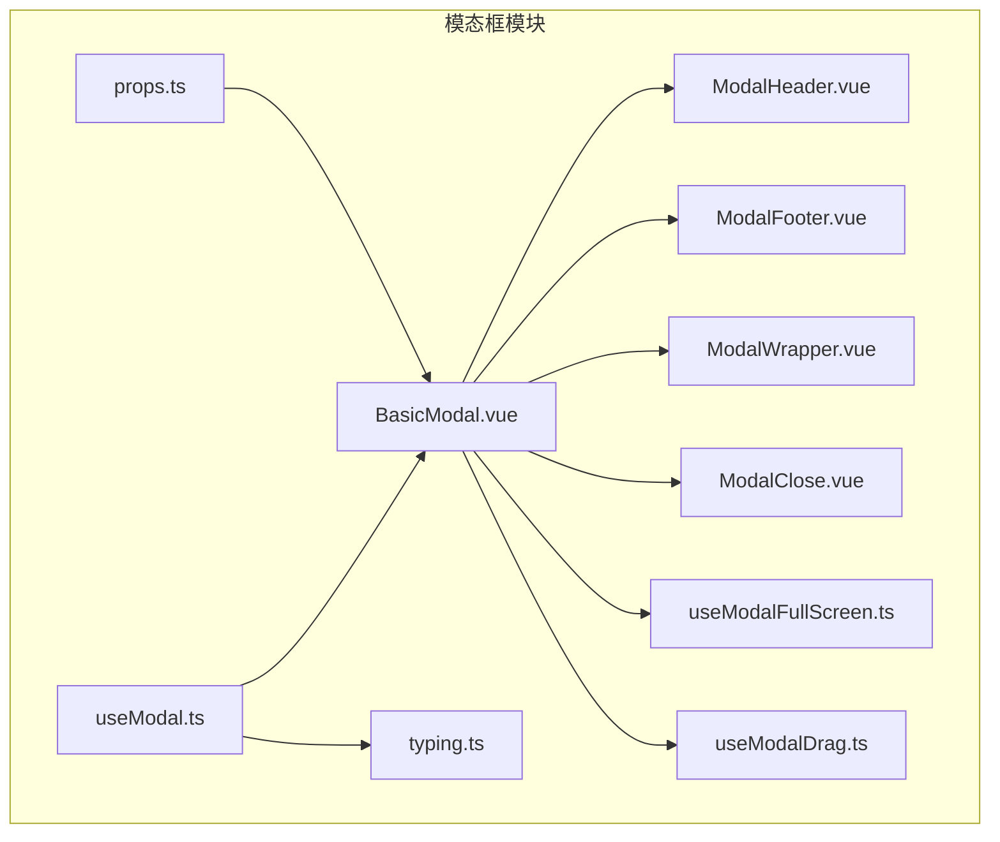
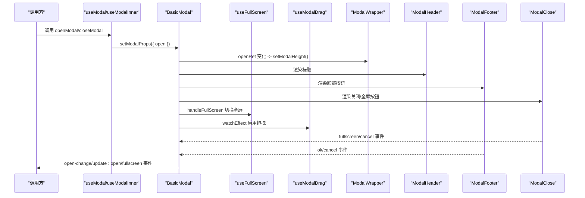
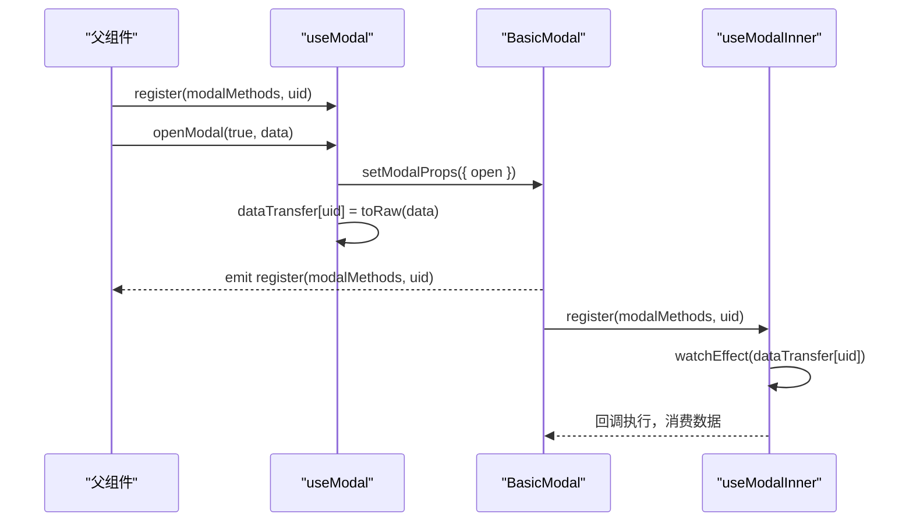
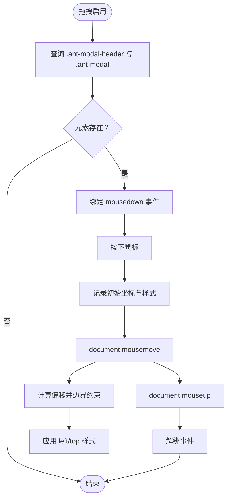
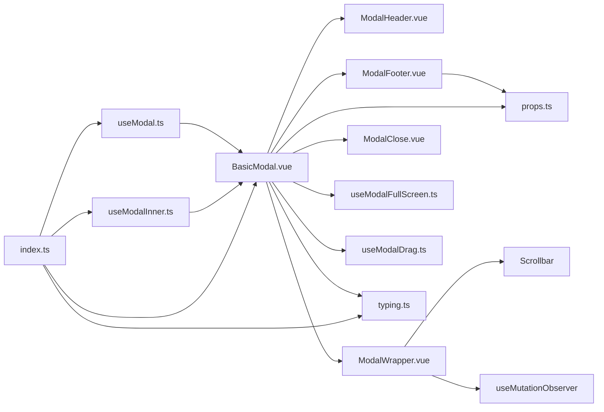

# 模态框组件

<cite>
**本文引用的文件**
- [BasicModal.vue](file://src/components/Modal/src/BasicModal.vue)
- [useModal.ts](file://src/components/Modal/src/hooks/useModal.ts)
- [useModalDrag.ts](file://src/components/Modal/src/hooks/useModalDrag.ts)
- [useModalFullScreen.ts](file://src/components/Modal/src/hooks/useModalFullScreen.ts)
- [ModalHeader.vue](file://src/components/Modal/src/components/ModalHeader.vue)
- [ModalFooter.vue](file://src/components/Modal/src/components/ModalFooter.vue)
- [ModalWrapper.vue](file://src/components/Modal/src/components/ModalWrapper.vue)
- [ModalClose.vue](file://src/components/Modal/src/components/ModalClose.vue)
- [props.ts](file://src/components/Modal/src/props.ts)
- [typing.ts](file://src/components/Modal/src/typing.ts)
- [index.ts](file://src/components/Modal/index.ts)
</cite>

## 目录
1. [简介](#简介)
2. [项目结构](#项目结构)
3. [核心组件](#核心组件)
4. [架构总览](#架构总览)
5. [详细组件分析](#详细组件分析)
6. [依赖关系分析](#依赖关系分析)
7. [性能考量](#性能考量)
8. [故障排查指南](#故障排查指南)
9. [结论](#结论)
10. [附录](#附录)

## 简介
本文件系统性地文档化了基于 Ant Design Vue 的模态框组件体系，重点围绕核心组件 BasicModal 展开，说明其对 Ant Design Vue Modal 的封装与增强，包括拖拽、全屏、自定义页头页脚等高级特性；同时深入解析 useModal 与 useModalInner 两个 Hook 的职责边界与使用场景，剖析 useModalDrag 的拖拽实现细节（事件监听、位置计算、边界限制），以及 useModalFullScreen 的全屏状态管理机制。最后给出 ModalHeader、ModalFooter 等子组件的定制化能力，并提供可操作的示例路径，帮助读者快速创建可拖拽的编辑弹窗与全屏查看模式。

## 项目结构
该模态框模块采用“核心组件 + 子组件 + Hooks”的分层组织方式：
- 核心组件 BasicModal：负责整体外观、行为与事件桥接，组合子组件与 Hooks。
- 子组件：ModalHeader、ModalFooter、ModalWrapper、ModalClose，分别承担标题、底部按钮、内容包裹与滚动、关闭/全屏控制。
- Hooks：useModal、useModalInner、useModalDrag、useModalFullScreen，分别提供外部/内部注册、拖拽、全屏状态管理。
- 类型与属性：typing.ts、props.ts 定义对外接口与默认参数。

图表来源
- [BasicModal.vue](file://src/components/Modal/src/BasicModal.vue#L1-L168)
- [ModalHeader.vue](file://src/components/Modal/src/components/ModalHeader.vue#L1-L19)
- [ModalFooter.vue](file://src/components/Modal/src/components/ModalFooter.vue#L1-L27)
- [ModalWrapper.vue](file://src/components/Modal/src/components/ModalWrapper.vue#L1-L128)
- [ModalClose.vue](file://src/components/Modal/src/components/ModalClose.vue#L1-L91)
- [useModal.ts](file://src/components/Modal/src/hooks/useModal.ts#L1-L164)
- [useModalDrag.ts](file://src/components/Modal/src/hooks/useModalDrag.ts#L1-L121)
- [useModalFullScreen.ts](file://src/components/Modal/src/hooks/useModalFullScreen.ts#L1-L20)
- [typing.ts](file://src/components/Modal/src/typing.ts#L1-L131)
- [props.ts](file://src/components/Modal/src/props.ts#L1-L84)

章节来源
- [index.ts](file://src/components/Modal/index.ts#L1-L11)

## 核心组件
- BasicModal：作为对外统一入口，负责：
  - 将 Ant Design Vue 的 Modal 包装为更易用的组件，提供可选的页头、页脚、关闭按钮、全屏按钮等。
  - 通过计算属性合并属性，动态注入 wrapClassName 以支持全屏样式。
  - 在 open 变化时触发高度重算与事件派发。
  - 通过 useModalDrag 启用拖拽，通过 useFullScreen 管理全屏状态。
  - 暴露 setModalProps 与 redoModalHeight 方法供外部或内部调用。

关键实现要点
- 事件桥接：将关闭、全屏、高度变化等事件向上抛出，便于业务层订阅。
- 属性合并：getBindValue 计算绑定值，按全屏状态剔除部分属性，避免冲突。
- 生命周期：在注册时回传实例方法，确保 useModal/useModalInner 能够调用。

章节来源
- [BasicModal.vue](file://src/components/Modal/src/BasicModal.vue#L1-L168)
- [props.ts](file://src/components/Modal/src/props.ts#L1-L84)
- [typing.ts](file://src/components/Modal/src/typing.ts#L1-L131)

## 架构总览
BasicModal 作为中枢，协调各子组件与 Hooks 的协作流程如下：

图表来源
- [BasicModal.vue](file://src/components/Modal/src/BasicModal.vue#L1-L168)
- [useModal.ts](file://src/components/Modal/src/hooks/useModal.ts#L1-L164)
- [useModalFullScreen.ts](file://src/components/Modal/src/hooks/useModalFullScreen.ts#L1-L20)
- [useModalDrag.ts](file://src/components/Modal/src/hooks/useModalDrag.ts#L1-L121)
- [ModalWrapper.vue](file://src/components/Modal/src/components/ModalWrapper.vue#L1-L128)
- [ModalHeader.vue](file://src/components/Modal/src/components/ModalHeader.vue#L1-L19)
- [ModalFooter.vue](file://src/components/Modal/src/components/ModalFooter.vue#L1-L27)
- [ModalClose.vue](file://src/components/Modal/src/components/ModalClose.vue#L1-L91)

## 详细组件分析

### BasicModal 组件
- 功能定位：对外统一的模态框入口，封装 Ant Design Vue Modal 并扩展拖拽、全屏、自定义页头页脚等能力。
- 关键点：
  - 通过 getBindValue 合并属性，按全屏状态剔除 title/height 等属性，避免与全屏样式冲突。
  - open 变化时触发 redoModalHeight，保证内容区域高度正确。
  - 通过 useFullScreen 管理全屏状态，通过 useModalDrag 启用拖拽。
  - 暴露 setModalProps 与 redoModalHeight，供外部或内部调用。

章节来源
- [BasicModal.vue](file://src/components/Modal/src/BasicModal.vue#L1-L168)

### useModal 与 useModalInner Hook
- useModal（外部注册）：
  - 作用：为外部组件提供打开/关闭弹窗的能力，并支持向弹窗内部传递数据。
  - 数据通道：通过 dataTransfer 以组件 uid 为键存储数据，避免深拷贝导致的数据丢失问题；使用 toRaw 保持原始引用。
  - 生命周期：在组件卸载时清理数据与引用。
- useModalInner（内部注册）：
  - 作用：为 BasicModal 内部组件提供设置属性、关闭弹窗、切换加载状态等能力。
  - 通信：通过 watchEffect 监听 dataTransfer 中对应 uid 的数据，回调在 nextTick 中执行，确保 DOM 已更新。

图表来源
- [useModal.ts](file://src/components/Modal/src/hooks/useModal.ts#L1-L164)
- [typing.ts](file://src/components/Modal/src/typing.ts#L1-L131)

章节来源
- [useModal.ts](file://src/components/Modal/src/hooks/useModal.ts#L1-L164)
- [typing.ts](file://src/components/Modal/src/typing.ts#L1-L131)

### useModalDrag 拖拽实现
- 监听时机：在 open 且 draggable 为真时，watchEffect 下次 tick 后执行 handleDrag。
- 触发元素：基于前缀类名查找 .ant-modal-header 作为拖拽手柄，移动 .ant-modal 容器。
- 事件链路：mousedown -> document.onmousemove 计算位移并限制边界 -> document.onmouseup 清理事件。
- 边界限制：依据屏幕尺寸与当前 modal 的宽高，计算左右上下最大偏移量，防止超出可视区。
- 销毁策略：destroyOnClose 为真时，每次拖拽初始化都会重新绑定，避免残留事件。

图表来源
- [useModalDrag.ts](file://src/components/Modal/src/hooks/useModalDrag.ts#L1-L121)

章节来源
- [useModalDrag.ts](file://src/components/Modal/src/hooks/useModalDrag.ts#L1-L121)

### useModalFullScreen 全屏状态管理
- 状态：fullScreenRef 保存当前全屏状态。
- 切换：handleFullScreen 阻止默认与冒泡，翻转 fullScreenRef。
- 影响：BasicModal 基于 fullScreenRef 动态调整 wrapClassName 与属性剔除，实现全屏渲染。

章节来源
- [useModalFullScreen.ts](file://src/components/Modal/src/hooks/useModalFullScreen.ts#L1-L20)
- [BasicModal.vue](file://src/components/Modal/src/BasicModal.vue#L1-L168)

### 子组件：ModalHeader、ModalFooter、ModalWrapper、ModalClose
- ModalHeader：
  - 接收 title 与 helpMessage，配合 BasicTitle 实现带帮助提示的标题。
- ModalFooter：
  - 默认渲染取消/确认按钮，支持自定义按钮文案与 props；暴露 cancel/ok 事件。
- ModalWrapper：
  - 负责内容区域滚动与高度计算，支持 loading、最小高度、固定高度、全屏模式下的高度适配。
  - 通过 MutationObserver 监听内容变化，自动重算高度；在 mounted 时计算扩展高度并上报。
- ModalClose：
  - 条件渲染全屏/还原与关闭按钮，触发 fullscreen/cancel 事件。

章节来源
- [ModalHeader.vue](file://src/components/Modal/src/components/ModalHeader.vue#L1-L19)
- [ModalFooter.vue](file://src/components/Modal/src/components/ModalFooter.vue#L1-L27)
- [ModalWrapper.vue](file://src/components/Modal/src/components/ModalWrapper.vue#L1-L128)
- [ModalClose.vue](file://src/components/Modal/src/components/ModalClose.vue#L1-L91)

## 依赖关系分析
- 组件间依赖：
  - BasicModal 依赖 ModalHeader、ModalFooter、ModalWrapper、ModalClose、useFullScreen、useModalDrag。
  - ModalFooter 依赖 props.ts 中的基础属性定义。
  - ModalWrapper 依赖 Scrollbar 组件与 useMutationObserver。
- 类型与属性：
  - typing.ts 定义 ModalMethods、useModalMethods、useInnerMethods 等接口。
  - props.ts 定义默认属性与扩展属性（如 draggable、canFullscreen、defaultFullscreen、helpMessage、loading、loadingTip、customClose、minHeight、height 等）。
- 导出入口：
  - index.ts 暴露 BasicModal、useModal、useModalInner 与 typing。

图表来源
- [BasicModal.vue](file://src/components/Modal/src/BasicModal.vue#L1-L168)
- [ModalHeader.vue](file://src/components/Modal/src/components/ModalHeader.vue#L1-L19)
- [ModalFooter.vue](file://src/components/Modal/src/components/ModalFooter.vue#L1-L27)
- [ModalWrapper.vue](file://src/components/Modal/src/components/ModalWrapper.vue#L1-L128)
- [ModalClose.vue](file://src/components/Modal/src/components/ModalClose.vue#L1-L91)
- [useModal.ts](file://src/components/Modal/src/hooks/useModal.ts#L1-L164)
- [useModalDrag.ts](file://src/components/Modal/src/hooks/useModalDrag.ts#L1-L121)
- [useModalFullScreen.ts](file://src/components/Modal/src/hooks/useModalFullScreen.ts#L1-L20)
- [typing.ts](file://src/components/Modal/src/typing.ts#L1-L131)
- [props.ts](file://src/components/Modal/src/props.ts#L1-L84)
- [index.ts](file://src/components/Modal/index.ts#L1-L11)

章节来源
- [index.ts](file://src/components/Modal/index.ts#L1-L11)
- [typing.ts](file://src/components/Modal/src/typing.ts#L1-L131)
- [props.ts](file://src/components/Modal/src/props.ts#L1-L84)

## 性能考量
- 拖拽事件：
  - 仅在 open 且 draggable 为真时启用，减少不必要事件绑定。
  - 通过 destroyOnClose 控制拖拽初始化频率，避免重复绑定。
- 高度计算：
  - ModalWrapper 使用 MutationObserver 监听内容变化，避免频繁手动刷新。
  - 全屏模式下直接按可视区高度计算，减少复杂布局测量。
- 事件处理：
  - 全屏切换与拖拽均在 nextTick 或事件回调中进行，确保 DOM 状态稳定后再执行计算。

[本节为通用建议，无需列出具体文件来源]

## 故障排查指南
- useModal 未注册错误
  - 现象：调用 setModalProps/openModal/closeModal 抛出“未注册”错误。
  - 排查：确认在父组件中先调用 register，再调用 openModal；确保在 setup 中使用。
- 拖拽无效
  - 现象：无法拖拽或拖拽后弹窗消失。
  - 排查：检查 draggable 是否为 true；确认 .ant-modal-header 存在；检查 destroyOnClose 是否导致拖拽初始化被覆盖。
- 全屏切换异常
  - 现象：点击全屏按钮无反应或样式错乱。
  - 排查：确认 canFullscreen 为 true；检查 fullScreenRef 是否被外部修改；确认 wrapClassName 的拼接逻辑生效。
- 高度计算不准确
  - 现象：内容溢出或出现多余滚动条。
  - 排查：确认 ModalWrapper 的 open、minHeight、height 参数；检查内容是否在 mounted 后发生变更；确认 MutationObserver 是否正常工作。

章节来源
- [useModal.ts](file://src/components/Modal/src/hooks/useModal.ts#L1-L164)
- [useModalDrag.ts](file://src/components/Modal/src/hooks/useModalDrag.ts#L1-L121)
- [useModalFullScreen.ts](file://src/components/Modal/src/hooks/useModalFullScreen.ts#L1-L20)
- [ModalWrapper.vue](file://src/components/Modal/src/components/ModalWrapper.vue#L1-L128)

## 结论
该模态框组件体系以 BasicModal 为核心，结合子组件与 Hooks，实现了对 Ant Design Vue Modal 的轻量增强与扩展。通过 useModal/useModalInner 提供外部与内部双向通信能力，通过 useModalDrag 与 useModalFullScreen 实现拖拽与全屏体验，通过 ModalHeader/ModalFooter/ModalWrapper/ModalClose 提供灵活的页头页脚与内容区域控制。整体设计遵循低耦合、高内聚原则，具备良好的可维护性与扩展性。

[本节为总结性内容，无需列出具体文件来源]

## 附录

### API 一览（核心）
- BasicModal
  - 属性：继承 Ant Design Vue Modal 的常用属性，并新增 draggable、canFullscreen、defaultFullscreen、helpMessage、loading、loadingTip、customClose、minHeight、height 等。
  - 事件：cancel、ok、open-change、update:open、fullscreen、height-change。
  - 方法：setModalProps(props)、redoModalHeight()。
- useModal/useModalInner
  - useModal：register、openModal(open?, data?)、closeModal()、setModalProps(props)、redoModalHeight()。
  - useModalInner：register、closeModal()、changeLoading(loading)、changeConfirmLoading(loading)、setModalProps(props)、redoModalHeight()。
- useModalDrag
  - 参数：context.open、context.draggable、context.destroyOnClose。
- useModalFullScreen
  - 返回：fullScreenRef、handleFullScreen(e)。

章节来源
- [props.ts](file://src/components/Modal/src/props.ts#L1-L84)
- [typing.ts](file://src/components/Modal/src/typing.ts#L1-L131)
- [useModal.ts](file://src/components/Modal/src/hooks/useModal.ts#L1-L164)
- [useModalDrag.ts](file://src/components/Modal/src/hooks/useModalDrag.ts#L1-L121)
- [useModalFullScreen.ts](file://src/components/Modal/src/hooks/useModalFullScreen.ts#L1-L20)

### 示例路径（创建可拖拽编辑弹窗与全屏查看模式）
- 创建可拖拽编辑弹窗
  - 步骤：在父组件中使用 useModal 注册并打开弹窗，BasicModal 开启 draggable；在弹窗内部使用 useModalInner 切换 loading 状态与关闭弹窗。
  - 参考路径：
    - [useModal.ts](file://src/components/Modal/src/hooks/useModal.ts#L1-L164)
    - [BasicModal.vue](file://src/components/Modal/src/BasicModal.vue#L1-L168)
    - [ModalWrapper.vue](file://src/components/Modal/src/components/ModalWrapper.vue#L1-L128)
- 创建全屏查看模式
  - 步骤：在 BasicModal 上开启 defaultFullscreen 或通过 ModalClose 触发 fullscreen 事件；在全屏状态下，标题与高度属性会被剔除以适配全屏布局。
  - 参考路径：
    - [useModalFullScreen.ts](file://src/components/Modal/src/hooks/useModalFullScreen.ts#L1-L20)
    - [ModalClose.vue](file://src/components/Modal/src/components/ModalClose.vue#L1-L91)
    - [BasicModal.vue](file://src/components/Modal/src/BasicModal.vue#L1-L168)