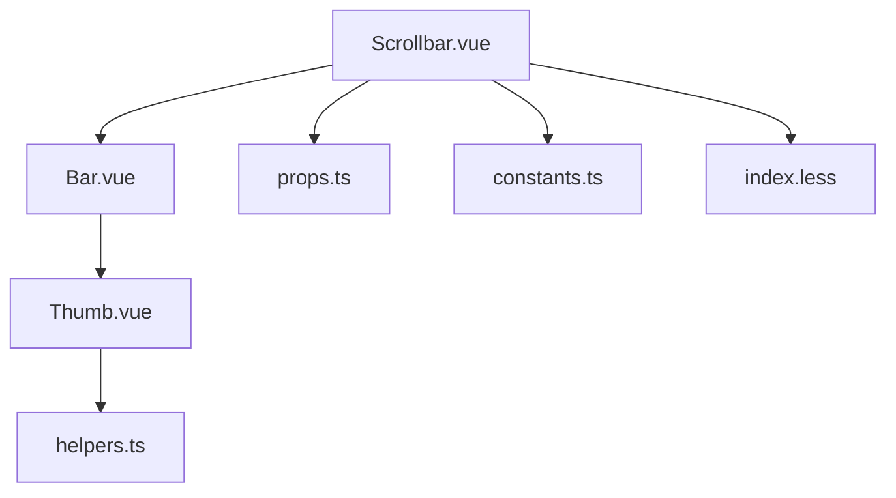
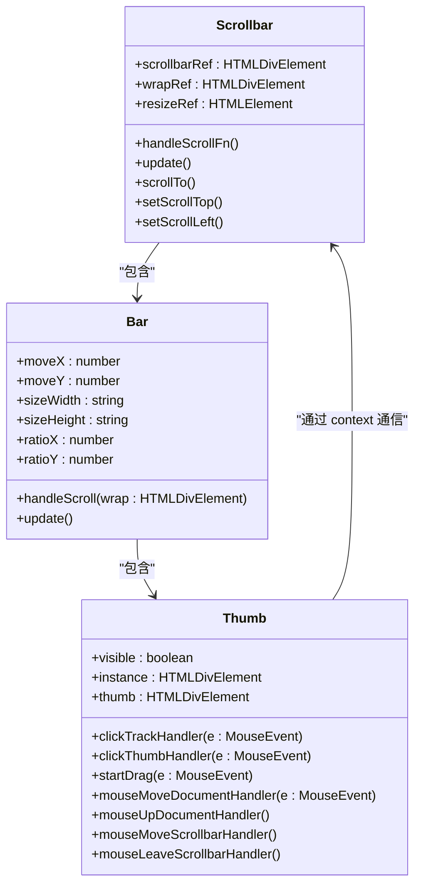
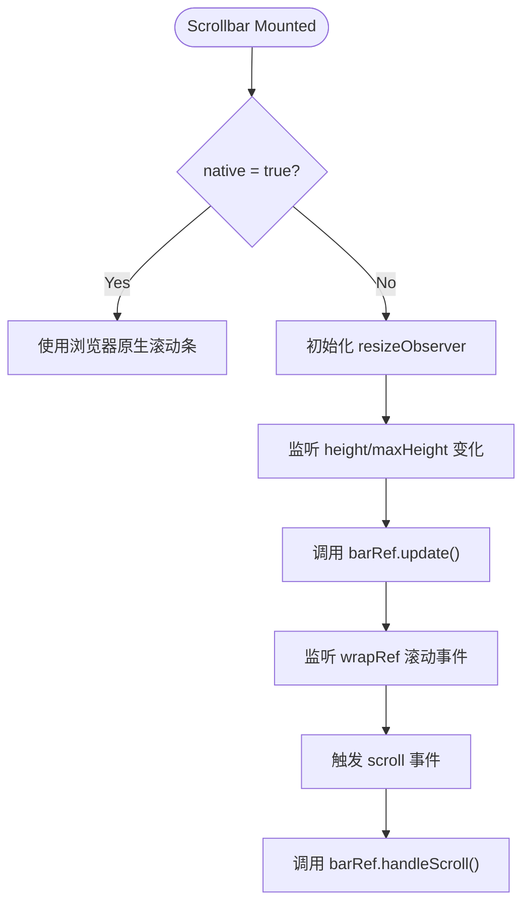
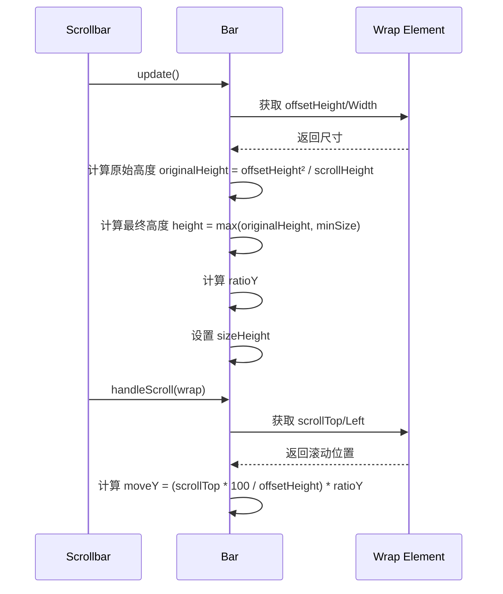
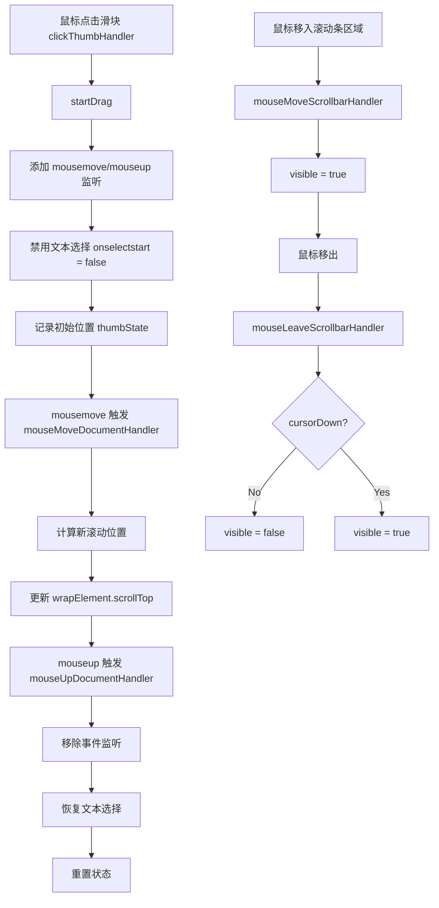

# 滚动条组件

<cite>
**本文档引用的文件**  
- [Scrollbar.vue](file://src/components/Scrollbar/src/Scrollbar.vue)
- [Bar.vue](file://src/components/Scrollbar/src/Bar.vue)
- [Thumb.vue](file://src/components/Scrollbar/src/Thumb.vue)
- [constants.ts](file://src/components/Scrollbar/src/constants.ts)
- [helpers.ts](file://src/components/Scrollbar/src/helpers.ts)
- [props.ts](file://src/components/Scrollbar/src/props.ts)
- [index.less](file://src/components/Scrollbar/src/index.less)
</cite>

## 目录
1. [简介](#简介)
2. [项目结构](#项目结构)
3. [核心组件](#核心组件)
4. [架构概述](#架构概述)
5. [详细组件分析](#详细组件分析)
6. [依赖分析](#依赖分析)
7. [性能考虑](#性能考虑)
8. [故障排除指南](#故障排除指南)
9. [结论](#结论)

## 简介
`Scrollbar` 组件是一个自定义滚动条实现，旨在替代浏览器原生滚动条，提供更美观且跨平台一致的滚动体验。该组件通过监听容器的滚动事件，动态更新滑块位置和尺寸，并支持多种配置选项，如始终显示或悬停时显示滚动条。它由多个子组件构成，包括 `Bar` 和 `Thumb`，分别代表滚动条轨道和滑块。

## 项目结构
`Scrollbar` 组件位于 `src/components/Scrollbar/` 目录下，采用模块化设计，包含主要的 Vue 组件、样式文件、常量定义和工具函数。



**Diagram sources**
- [Scrollbar.vue](file://src/components/Scrollbar/src/Scrollbar.vue#L1-L141)
- [Bar.vue](file://src/components/Scrollbar/src/Bar.vue#L1-L61)
- [Thumb.vue](file://src/components/Scrollbar/src/Thumb.vue#L1-L174)
- [helpers.ts](file://src/components/Scrollbar/src/helpers.ts#L1-L23)
- [constants.ts](file://src/components/Scrollbar/src/constants.ts#L1-L9)
- [index.less](file://src/components/Scrollbar/src/index.less#L1-L47)

**Section sources**
- [Scrollbar.vue](file://src/components/Scrollbar/src/Scrollbar.vue#L1-L141)
- [Bar.vue](file://src/components/Scrollbar/src/Bar.vue#L1-L61)
- [Thumb.vue](file://src/components/Scrollbar/src/Thumb.vue#L1-L174)

## 核心组件
`Scrollbar` 组件的核心由三个主要部分组成：`Scrollbar.vue` 作为主容器，`Bar.vue` 表示滚动条轨道，`Thumb.vue` 表示可拖动的滑块。组件通过 `provide/inject` 机制共享上下文，并利用 `useResizeObserver` 和原生事件监听实现响应式更新。

**Section sources**
- [Scrollbar.vue](file://src/components/Scrollbar/src/Scrollbar.vue#L1-L141)
- [Bar.vue](file://src/components/Scrollbar/src/Bar.vue#L1-L61)
- [Thumb.vue](file://src/components/Scrollbar/src/Thumb.vue#L1-L174)

## 架构概述
该组件采用分层架构，`Scrollbar` 负责整体布局和事件监听，`Bar` 计算并渲染水平和垂直滚动条，`Thumb` 处理用户交互（点击、拖拽）。通过 `props` 配置行为，如是否始终显示、最小尺寸等，并通过 `emits` 向外传递滚动事件。



**Diagram sources**
- [Scrollbar.vue](file://src/components/Scrollbar/src/Scrollbar.vue#L1-L141)
- [Bar.vue](file://src/components/Scrollbar/src/Bar.vue#L1-L61)
- [Thumb.vue](file://src/components/Scrollbar/src/Thumb.vue#L1-L174)

## 详细组件分析

### Scrollbar 组件分析
`Scrollbar` 是根组件，负责包裹内容区域并监听滚动事件。它通过 `wrapRef` 上的 `@scroll` 事件触发 `handleScrollFn`，进而通知 `Bar` 组件更新滑块位置。组件支持高度和最大高度的动态设置，并通过 `noresize` 属性优化性能。



**Diagram sources**
- [Scrollbar.vue](file://src/components/Scrollbar/src/Scrollbar.vue#L1-L141)

**Section sources**
- [Scrollbar.vue](file://src/components/Scrollbar/src/Scrollbar.vue#L1-L141)

### Bar 组件分析
`Bar` 组件负责渲染水平和垂直两个方向的滚动条轨道，并通过 `Thumb` 子组件显示滑块。它根据容器的 `offsetHeight/Width` 和 `scrollHeight/Width` 计算滑块尺寸和比例，并通过 `ratioX/Y` 控制滑块移动的映射关系。



**Diagram sources**
- [Bar.vue](file://src/components/Scrollbar/src/Bar.vue#L1-L61)

**Section sources**
- [Bar.vue](file://src/components/Scrollbar/src/Bar.vue#L1-L61)

### Thumb 组件分析
`Thumb` 组件实现滑块的交互逻辑，包括点击轨道跳转、拖拽滑块、鼠标悬停显示/隐藏等。它通过 `BAR_MAP` 工具对象统一处理水平和垂直方向的逻辑，并使用 `document` 级事件监听实现拖拽过程。



**Diagram sources**
- [Thumb.vue](file://src/components/Scrollbar/src/Thumb.vue#L1-L174)
- [helpers.ts](file://src/components/Scrollbar/src/helpers.ts#L1-L23)

**Section sources**
- [Thumb.vue](file://src/components/Scrollbar/src/Thumb.vue#L1-L174)
- [helpers.ts](file://src/components/Scrollbar/src/helpers.ts#L1-L23)

## 依赖分析
`Scrollbar` 组件依赖多个外部库和内部模块，通过合理的依赖管理实现功能解耦。

```mermaid
graph LR
Scrollbar --> Vue
Scrollbar --> lodash-es
Scrollbar --> @vueuse/core
Scrollbar --> useClass
Bar --> constants
Thumb --> constants
Thumb --> helpers
Thumb --> @vueuse/core
All --> index.less
```

**Diagram sources**
- [Scrollbar.vue](file://src/components/Scrollbar/src/Scrollbar.vue#L16-L21)
- [Bar.vue](file://src/components/Scrollbar/src/Bar.vue#L9-L11)
- [Thumb.vue](file://src/components/Scrollbar/src/Thumb.vue#L10-L14)
- [helpers.ts](file://src/components/Scrollbar/src/helpers.ts#L1-L23)
- [constants.ts](file://src/components/Scrollbar/src/constants.ts#L1-L9)
- [index.less](file://src/components/Scrollbar/src/index.less#L1-L47)

**Section sources**
- [Scrollbar.vue](file://src/components/Scrollbar/src/Scrollbar.vue#L16-L21)
- [Bar.vue](file://src/components/Scrollbar/src/Bar.vue#L9-L11)
- [Thumb.vue](file://src/components/Scrollbar/src/Thumb.vue#L10-L14)
- [helpers.ts](file://src/components/Scrollbar/src/helpers.ts#L1-L23)
- [constants.ts](file://src/components/Scrollbar/src/constants.ts#L1-L9)

## 性能考虑
组件通过 `noresize` 属性控制是否监听容器尺寸变化，避免不必要的重绘。`useResizeObserver` 和 `useEventListener` 的使用确保了资源的正确释放。滑块的显示/隐藏通过 `Transition` 组件实现平滑动画，同时通过 `cursorLeave` 状态防止鼠标移出时立即隐藏。

## 故障排除指南
- **滚动条不显示**：检查 `native` 属性是否为 `false`，确认容器内容是否超出可视区域。
- **滑块无法拖动**：确保 `props.always` 或鼠标悬停触发 `visible` 状态。
- **点击轨道无效**：检查 `clickTrackHandler` 中的偏移计算逻辑，确认 `bar` 映射正确。
- **样式错乱**：确认 `index.less` 已正确导入，`prefixCls` 生成的类名无冲突。

**Section sources**
- [Scrollbar.vue](file://src/components/Scrollbar/src/Scrollbar.vue#L3-L141)
- [Bar.vue](file://src/components/Scrollbar/src/Bar.vue#L1-L61)
- [Thumb.vue](file://src/components/Scrollbar/src/Thumb.vue#L1-L174)
- [index.less](file://src/components/Scrollbar/src/index.less#L1-L47)

## 结论
`Scrollbar` 组件通过模块化设计和 Vue 3 的响应式系统，实现了功能完整且性能优良的自定义滚动条。其清晰的组件划分、合理的事件处理机制和灵活的配置选项，使其能够轻松集成到各种 UI 场景中，提供一致的用户体验。