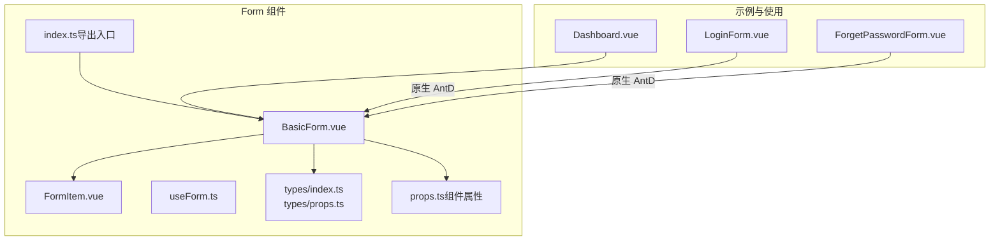
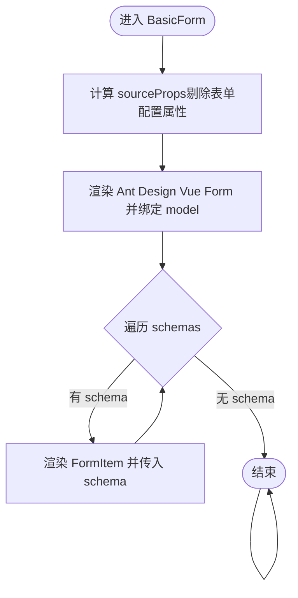
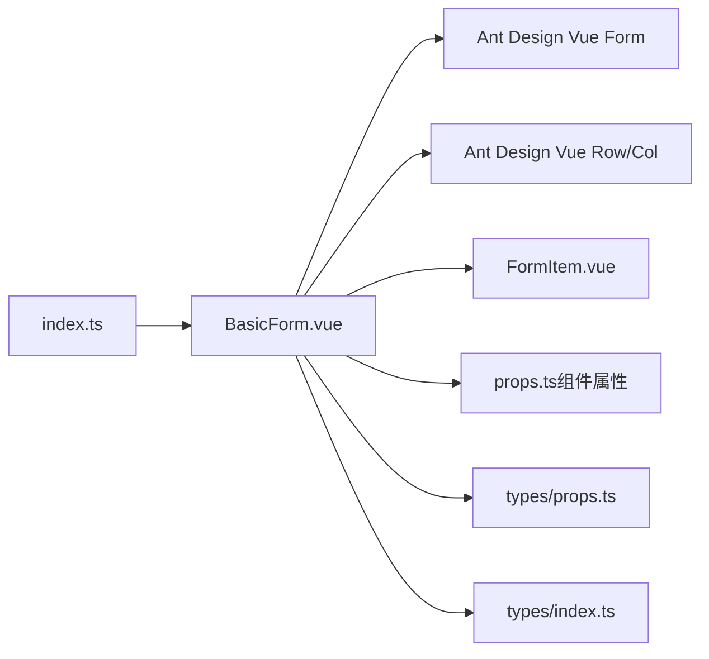

# 表单组件

<cite>
**本文引用的文件列表**
- [BasicForm.vue](file://src/components/Form/src/BasicForm.vue)
- [FormItem.vue](file://src/components/Form/src/components/FormItem.vue)
- [useForm.ts](file://src/components/Form/src/hooks/useForm.ts)
- [index.ts](file://src/components/Form/src/types/index.ts)
- [props.ts（类型定义）](file://src/components/Form/src/types/props.ts)
- [props.ts（组件属性）](file://src/components/Form/src/props.ts)
- [Form 组件导出入口](file://src/components/Form/index.ts)
- [Dashboard.vue 示例](file://src/views/dashboard/Dashboard.vue)
- [LoginForm.vue 登录表单示例](file://src/views/system/login/components/LoginForm.vue)
- [ForgetPasswordForm.vue 忘记密码表单示例](file://src/views/system/login/components/ForgetPasswordForm.vue)
</cite>

## 目录
1. [简介](#简介)
2. [项目结构](#项目结构)
3. [核心组件](#核心组件)
4. [架构总览](#架构总览)
5. [详细组件分析](#详细组件分析)
6. [依赖关系分析](#依赖关系分析)
7. [性能考量](#性能考量)
8. [故障排查指南](#故障排查指南)
9. [结论](#结论)
10. [附录](#附录)

## 简介
本文件系统性地文档化了本仓库中的表单组件体系，重点围绕以下目标展开：
- 解析 BasicForm 如何通过 schemas 动态生成表单结构，如何与 Ant Design Vue 表单控件无缝集成。
- 说明 FormItem 作为基础表单项的封装现状与扩展方向。
- 深入讲解 useForm Hook 的设计意图与 API 使用场景（当前实现为空，后续可扩展）。
- 解释表单布局配置（grid、col）的实现机制与 schemas 中的列配置。
- 提供搜索表单与复杂表单的构建示例路径，以及与 Modal 组件结合的最佳实践。

## 项目结构
表单组件位于 src/components/Form 目录下，采用“按功能分层”的组织方式：
- src/components/Form/src：Form 组件源码
  - BasicForm.vue：表单容器，负责动态渲染与布局
  - components/FormItem.vue：基础表单项封装（当前为占位）
  - hooks/useForm.ts：组合式 Hook（当前为空实现）
  - types/：类型定义
    - index.ts：Ant Design Vue 组件类型映射
    - props.ts：FormProps、SchemaProps 等类型
  - props.ts：BasicForm 的默认属性与合并逻辑
  - index.ts：对外导出入口
- 示例与使用：
  - src/views/dashboard/Dashboard.vue：展示 BasicForm 的基本用法
  - src/views/system/login/components/LoginForm.vue、ForgetPasswordForm.vue：展示原生 Ant Design Vue 表单的使用方式

图表来源
- [BasicForm.vue](file://src/components/Form/src/BasicForm.vue#L1-L54)
- [FormItem.vue](file://src/components/Form/src/components/FormItem.vue#L1-L18)
- [useForm.ts](file://src/components/Form/src/hooks/useForm.ts#L1-L2)
- [index.ts](file://src/components/Form/src/types/index.ts#L1-L40)
- [props.ts（类型定义）](file://src/components/Form/src/types/props.ts#L1-L109)
- [props.ts（组件属性）](file://src/components/Form/src/props.ts#L1-L44)
- [Form 组件导出入口](file://src/components/Form/index.ts#L1-L5)
- [Dashboard.vue 示例](file://src/views/dashboard/Dashboard.vue#L1-L12)
- [LoginForm.vue 登录表单示例](file://src/views/system/login/components/LoginForm.vue#L1-L81)
- [ForgetPasswordForm.vue 忘记密码表单示例](file://src/views/system/login/components/ForgetPasswordForm.vue#L1-L49)

章节来源
- [BasicForm.vue](file://src/components/Form/src/BasicForm.vue#L1-L54)
- [props.ts（组件属性）](file://src/components/Form/src/props.ts#L1-L44)
- [props.ts（类型定义）](file://src/components/Form/src/types/props.ts#L1-L109)
- [index.ts](file://src/components/Form/src/types/index.ts#L1-L40)
- [Form 组件导出入口](file://src/components/Form/index.ts#L1-L5)

## 核心组件
- BasicForm：基于 Ant Design Vue Form 的表单容器，通过 schemas 动态渲染表单项，支持布局与样式控制。
- FormItem：基础表单项封装（当前为占位），用于承载单个 schema 的渲染与交互。
- useForm：组合式 Hook（当前为空实现），未来可扩展为统一的表单状态管理与 API（如 setProps、setFieldsValue、getFieldsValue 等）。
- 类型系统：AntdComponentProps 映射 Ant Design Vue 组件，SchemaProps 描述表单项配置，FormProps 描述表单整体配置。

章节来源
- [BasicForm.vue](file://src/components/Form/src/BasicForm.vue#L1-L54)
- [FormItem.vue](file://src/components/Form/src/components/FormItem.vue#L1-L18)
- [useForm.ts](file://src/components/Form/src/hooks/useForm.ts#L1-L2)
- [index.ts](file://src/components/Form/src/types/index.ts#L1-L40)
- [props.ts（类型定义）](file://src/components/Form/src/types/props.ts#L1-L109)

## 架构总览
BasicForm 通过 props.schemas 驱动渲染，内部以 Row 包裹多个 FormItem，每个 FormItem 接收一个 schema 并决定如何渲染对应的 Ant Design Vue 控件。BasicForm 将除自身表单配置以外的属性透传给 Ant Design Vue 的 Form 组件，从而保持与原生 API 的一致性和兼容性。

```mermaid
sequenceDiagram
participant U as "调用方"
participant BF as "BasicForm.vue"
participant FI as "FormItem.vue"
participant AV as "Ant Design Vue Form/控件"
U->>BF : 传入 { schemas, ...FormProps }
BF->>BF : 计算 sourceProps排除表单配置属性
BF->>AV : 渲染 <a-form v-bind="sourceProps" : model="formModel">
BF->>FI : 逐个渲染 <form-item v-for="schema in schemas" : schema="schema"/>
FI->>AV : 根据 schema.component 渲染对应控件
AV-->>U : 触发 submit/finish 等事件
```

图表来源
- [BasicForm.vue](file://src/components/Form/src/BasicForm.vue#L1-L54)
- [FormItem.vue](file://src/components/Form/src/components/FormItem.vue#L1-L18)

## 详细组件分析

### BasicForm 组件
- 功能要点
  - 通过 props.schemas 动态生成表单项。
  - 将非表单配置属性透传给 Ant Design Vue 的 Form 组件，确保与原生 API 一致。
  - 支持紧凑模式 compact 的样式控制。
  - 内部维护 formModel 作为 v-model 的数据源。
  - 提供 register、submit 等事件钩子。
- 关键实现点
  - sourceProps 计算：从组件 props 中剔除表单配置属性，仅保留 Ant Design Vue Form 所需的属性。
  - getSchema 计算：从 props.schemas 获取 schema 列表。
  - getFormClass 计算：根据 compact 属性动态拼接类名。
  - 事件处理：预留回车事件处理入口（当前为空逻辑）。

图表来源
- [BasicForm.vue](file://src/components/Form/src/BasicForm.vue#L1-L54)

章节来源
- [BasicForm.vue](file://src/components/Form/src/BasicForm.vue#L1-L54)
- [props.ts（组件属性）](file://src/components/Form/src/props.ts#L1-L44)

### FormItem 组件
- 当前状态
  - 仅为占位，接收 schema 并输出调试信息。
- 扩展方向
  - 根据 schema.component 渲染对应 Ant Design Vue 控件。
  - 处理 schema 的 label、required、tooltip、help、validateStatus 等展示与校验信息。
  - 支持 schema.wrapperCol、labelCol 等布局配置。
  - 支持 schema.ifShow/show/disabled 等动态控制。

章节来源
- [FormItem.vue](file://src/components/Form/src/components/FormItem.vue#L1-L18)

### useForm Hook
- 当前状态
  - 空实现，未暴露任何 API。
- 设计建议（基于 BasicForm 与 SchemaProps 的能力）
  - setProps：动态更新 BasicForm 的表单配置（如 layout、labelAlign、schemas 等）。
  - setFieldsValue：设置表单字段值（与 BasicForm 的 formModel 对应）。
  - getFieldsValue：读取表单字段值。
  - validate/validateFields：触发校验或指定字段校验。
  - resetFields：重置表单或指定字段。
  - getSchema/setSchema：读取/更新 schemas，实现动态表单结构变更。

章节来源
- [useForm.ts](file://src/components/Form/src/hooks/useForm.ts#L1-L2)
- [props.ts（类型定义）](file://src/components/Form/src/types/props.ts#L1-L109)

### 类型系统与布局配置
- AntdComponentProps
  - 通过类型映射 Ant Design Vue 的常用控件（Input、Select、DatePicker 等），为 schema.component 提供类型安全。
- SchemaProps
  - 描述单个表单项的配置，包含 name、label、component、componentProps、required、ifShow、show、disabled、wrapperCol、labelCol、validateStatus、validateTrigger 等。
- FormProps
  - 描述表单整体配置，包含 layout、labelAlign、labelCol、wrapperCol、validateTrigger、schemas、compact 等。
- 布局配置机制
  - Row/Col：BasicForm 内部使用 Row 包裹，FormItem 可通过 schema.wrapperCol/labelCol 实现栅格化布局。
  - ColProps：支持 span、offset、order、push、pull、响应式断点（xs/sm/md/lg/xl/xxl）等。

章节来源
- [index.ts](file://src/components/Form/src/types/index.ts#L1-L40)
- [props.ts（类型定义）](file://src/components/Form/src/types/props.ts#L1-L109)
- [props.ts（组件属性）](file://src/components/Form/src/props.ts#L1-L44)

### 示例与最佳实践

#### 搜索表单构建（基于 BasicForm）
- 步骤
  - 在父组件中定义 schemas，例如包含 Input、Select、DatePicker 等控件。
  - 在模板中引入 BasicForm，并绑定 :schemas。
  - 通过 emit 的 submit 事件获取表单数据，进行查询。
- 示例路径
  - [Dashboard.vue 示例](file://src/views/dashboard/Dashboard.vue#L1-L12)

章节来源
- [Dashboard.vue 示例](file://src/views/dashboard/Dashboard.vue#L1-L12)

#### 复杂表单构建（基于原生 Ant Design Vue）
- 步骤
  - 使用 Form、FormItem、Input、Select 等原生组件。
  - 通过 :model 与 :rules 绑定数据与校验规则。
  - 使用 Row/Col 实现栅格化布局。
- 示例路径
  - [LoginForm.vue 登录表单示例](file://src/views/system/login/components/LoginForm.vue#L1-L81)
  - [ForgetPasswordForm.vue 忘记密码表单示例](file://src/views/system/login/components/ForgetPasswordForm.vue#L1-L49)

章节来源
- [LoginForm.vue 登录表单示例](file://src/views/system/login/components/LoginForm.vue#L1-L81)
- [ForgetPasswordForm.vue 忘记密码表单示例](file://src/views/system/login/components/ForgetPasswordForm.vue#L1-L49)

#### 与 Modal 组件结合的最佳实践
- 建议
  - 在 Modal 内部使用 BasicForm 或原生 Ant Design Vue 表单。
  - 通过 Modal 的 visible 控制表单弹窗的显示与隐藏。
  - 使用 useForm（未来实现）统一管理表单状态与校验，避免在多处重复处理。
  - 使用 emit 的 submit 事件在确认按钮中触发提交逻辑，结合 loading 状态提升用户体验。
- 注意
  - Modal 打开时再挂载表单，关闭时重置表单，避免内存泄漏与状态残留。

## 依赖关系分析
- BasicForm 依赖
  - Ant Design Vue Form/Row/Col：用于表单渲染与布局。
  - FormItem：用于承载单个 schema 的渲染。
  - props.ts（组件属性）：提供默认属性与合并逻辑。
  - types/props.ts：提供 SchemaProps/FormProps 类型约束。
  - types/index.ts：提供 AntdComponentProps 类型映射。
- 导出入口
  - index.ts 导出 BasicForm 与类型，便于外部统一导入。

图表来源
- [BasicForm.vue](file://src/components/Form/src/BasicForm.vue#L1-L54)
- [FormItem.vue](file://src/components/Form/src/components/FormItem.vue#L1-L18)
- [props.ts（组件属性）](file://src/components/Form/src/props.ts#L1-L44)
- [props.ts（类型定义）](file://src/components/Form/src/types/props.ts#L1-L109)
- [index.ts](file://src/components/Form/src/types/index.ts#L1-L40)
- [Form 组件导出入口](file://src/components/Form/index.ts#L1-L5)

章节来源
- [BasicForm.vue](file://src/components/Form/src/BasicForm.vue#L1-L54)
- [Form 组件导出入口](file://src/components/Form/index.ts#L1-L5)

## 性能考量
- 动态渲染
  - 通过 computed 计算 sourceProps 与 getSchema，减少不必要的重渲染。
  - 使用 v-for 渲染 schema，建议为每个 schema 提供稳定 key（schema.name）。
- 数据绑定
  - formModel 作为 v-model 的数据源，建议在大型表单中按需更新，避免全量深拷贝。
- 校验策略
  - 合理设置 validateTrigger，避免频繁触发校验导致性能下降。
- 布局优化
  - 使用 Row/Col 进行栅格化布局，减少复杂嵌套层级。

## 故障排查指南
- 表单无法渲染
  - 检查 props.schemas 是否正确传入，且每个 schema.name 唯一。
  - 确认 schema.component 是否在 AntdComponentProps 中存在映射。
- 校验无效
  - 检查 validateTrigger 配置是否合理。
  - 确认 required 与 rules 的一致性。
- 布局错乱
  - 检查 schema.wrapperCol/labelCol 的 span/offset 配置。
  - 确认 Row/Col 的 gutter 与响应式断点设置。
- 事件未触发
  - 确认 BasicForm 的 submit 事件监听是否正确绑定。
  - 检查原生表单的 html-type="submit" 与 finish 事件。

## 结论
本仓库的表单体系以 BasicForm 为核心，通过 schemas 驱动动态表单生成，并与 Ant Design Vue 表单控件深度集成。FormItem 当前为占位实现，具备良好的扩展空间；useForm Hook 当前为空实现，建议在未来补充统一的状态管理与 API。通过合理的类型定义与布局配置，能够快速构建搜索表单与复杂业务表单，并与 Modal 等组件协同工作。

## 附录
- API 一览（基于现有类型与组件）
  - BasicForm
    - 属性：layout、labelAlign、labelCol、wrapperCol、validateTrigger、schemas、compact 等
    - 事件：register、submit
  - FormItem
    - 属性：schema（包含 name、label、component、componentProps、required、ifShow、show、disabled、wrapperCol、labelCol、validateStatus、validateTrigger 等）
  - useForm（待实现）
    - 建议 API：setProps、setFieldsValue、getFieldsValue、validate/validateFields、resetFields、getSchema/setSchema