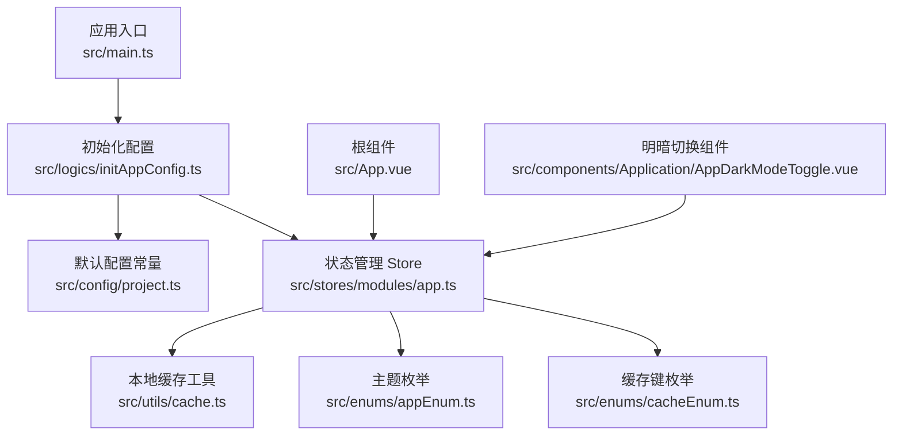
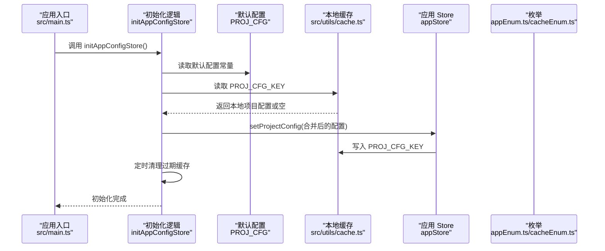
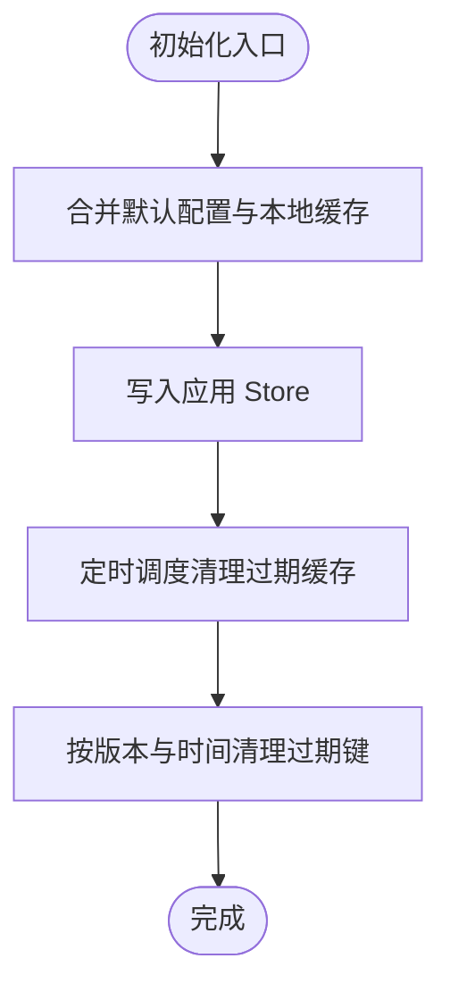
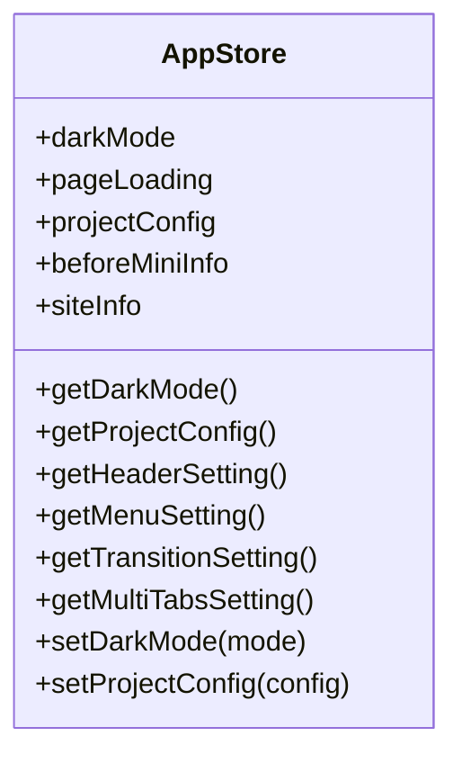
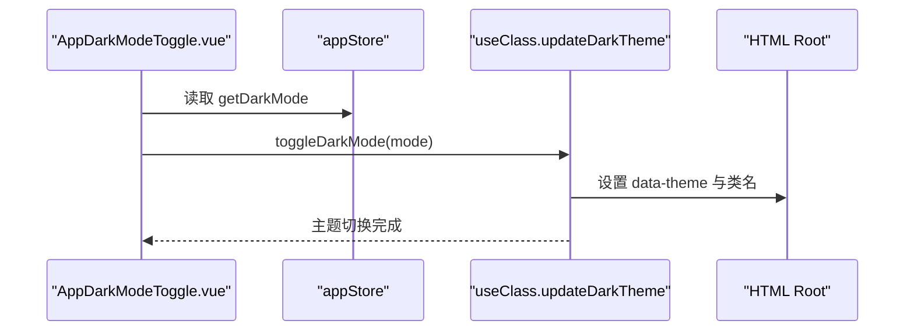
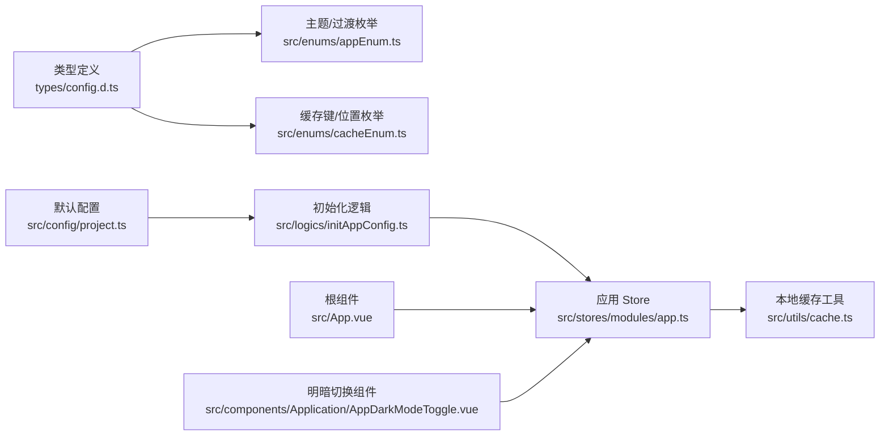

# 主题与配置

<cite>
**本文引用的文件**
- [src/config/project.ts](file://src/config/project.ts)
- [src/logics/initAppConfig.ts](file://src/logics/initAppConfig.ts)
- [src/stores/modules/app.ts](file://src/stores/modules/app.ts)
- [src/components/Application/AppDarkModeToggle.vue](file://src/components/Application/AppDarkModeToggle.vue)
- [src/App.vue](file://src/App.vue)
- [src/main.ts](file://src/main.ts)
- [src/utils/cache.ts](file://src/utils/cache.ts)
- [src/enums/appEnum.ts](file://src/enums/appEnum.ts)
- [src/enums/cacheEnum.ts](file://src/enums/cacheEnum.ts)
- [types/config.d.ts](file://types/config.d.ts)
</cite>

## 目录
1. [简介](#简介)
2. [项目结构](#项目结构)
3. [核心组件](#核心组件)
4. [架构总览](#架构总览)
5. [详细组件分析](#详细组件分析)
6. [依赖关系分析](#依赖关系分析)
7. [性能考量](#性能考量)
8. [故障排查指南](#故障排查指南)
9. [结论](#结论)
10. [附录：自定义配置指南](#附录自定义配置指南)

## 简介
本文件围绕项目的“主题系统”与“全局配置机制”，从默认配置常量 PROJ_CFG 出发，系统性梳理应用启动时的配置加载流程、状态管理与本地持久化策略，并结合明暗模式切换组件，给出开发者自定义主题色与布局配置的实践路径。目标是让非专业读者也能理解配置如何工作，同时为工程师提供可操作的扩展建议。

## 项目结构
本项目采用“配置常量 + 应用初始化逻辑 + Pinia 状态 + 组件交互”的分层设计：
- 配置常量层：集中定义默认主题、主色调、缓存策略等
- 初始化层：应用启动时合并默认配置与本地缓存，注入到状态管理
- 状态层：Pinia Store 提供配置读取与写入接口，并负责持久化
- 视图层：组件通过 Store 读取配置，触发动作更新配置并同步本地存储

图表来源
- [src/main.ts](file://src/main.ts#L1-L29)
- [src/logics/initAppConfig.ts](file://src/logics/initAppConfig.ts#L1-L54)
- [src/config/project.ts](file://src/config/project.ts#L1-L39)
- [src/stores/modules/app.ts](file://src/stores/modules/app.ts#L1-L76)
- [src/utils/cache.ts](file://src/utils/cache.ts#L1-L138)
- [src/enums/appEnum.ts](file://src/enums/appEnum.ts#L1-L23)
- [src/enums/cacheEnum.ts](file://src/enums/cacheEnum.ts#L1-L17)
- [src/App.vue](file://src/App.vue#L1-L42)
- [src/components/Application/AppDarkModeToggle.vue](file://src/components/Application/AppDarkModeToggle.vue#L1-L35)

章节来源
- [src/main.ts](file://src/main.ts#L1-L29)
- [src/logics/initAppConfig.ts](file://src/logics/initAppConfig.ts#L1-L54)
- [src/config/project.ts](file://src/config/project.ts#L1-L39)
- [src/stores/modules/app.ts](file://src/stores/modules/app.ts#L1-L76)
- [src/utils/cache.ts](file://src/utils/cache.ts#L1-L138)
- [src/enums/appEnum.ts](file://src/enums/appEnum.ts#L1-L23)
- [src/enums/cacheEnum.ts](file://src/enums/cacheEnum.ts#L1-L17)
- [src/App.vue](file://src/App.vue#L1-L42)
- [src/components/Application/AppDarkModeToggle.vue](file://src/components/Application/AppDarkModeToggle.vue#L1-L35)

## 核心组件
- 默认配置常量 PROJ_CFG：定义主题模式、主色调、各子配置（头部、菜单、过渡、多标签）的初始形态
- 初始化逻辑 initAppConfigStore：合并默认配置与本地缓存，写入 Store，并清理过期缓存
- 应用 Store（appStore）：提供 setProjectConfig、setDarkMode 等动作，负责状态与本地存储同步
- 明暗切换组件 AppDarkModeToggle：绑定 Store 的明暗状态，调用主题更新钩子
- 根组件 App.vue：消费 Store 中的主题与颜色，向 UI 组件库提供主题配置

章节来源
- [src/config/project.ts](file://src/config/project.ts#L1-L39)
- [src/logics/initAppConfig.ts](file://src/logics/initAppConfig.ts#L1-L54)
- [src/stores/modules/app.ts](file://src/stores/modules/app.ts#L1-L76)
- [src/components/Application/AppDarkModeToggle.vue](file://src/components/Application/AppDarkModeToggle.vue#L1-L35)
- [src/App.vue](file://src/App.vue#L1-L42)

## 架构总览
下面的序列图展示了应用启动时配置加载与持久化的端到端流程：

图表来源
- [src/main.ts](file://src/main.ts#L1-L29)
- [src/logics/initAppConfig.ts](file://src/logics/initAppConfig.ts#L1-L54)
- [src/config/project.ts](file://src/config/project.ts#L1-L39)
- [src/stores/modules/app.ts](file://src/stores/modules/app.ts#L1-L76)
- [src/utils/cache.ts](file://src/utils/cache.ts#L1-L138)
- [src/enums/appEnum.ts](file://src/enums/appEnum.ts#L1-L23)
- [src/enums/cacheEnum.ts](file://src/enums/cacheEnum.ts#L1-L17)

## 详细组件分析

### 默认配置常量 PROJ_CFG
- 主题模式：默认浅色
- 主色调：默认主色
- 各子配置：头部、菜单、过渡、多标签的初始结构
- 缓存策略：默认缓存位置、默认缓存时间

章节来源
- [src/config/project.ts](file://src/config/project.ts#L1-L39)
- [types/config.d.ts](file://types/config.d.ts#L92-L106)

### 初始化逻辑 initAppConfigStore
- 合并策略：将默认配置与本地缓存进行深度合并，确保用户自定义项优先
- 写入 Store：一次性注入完整配置
- 清理过期缓存：按版本号与创建时间判断，删除过期键

图表来源
- [src/logics/initAppConfig.ts](file://src/logics/initAppConfig.ts#L1-L54)
- [src/utils/cache.ts](file://src/utils/cache.ts#L1-L138)
- [src/config/project.ts](file://src/config/project.ts#L1-L39)

章节来源
- [src/logics/initAppConfig.ts](file://src/logics/initAppConfig.ts#L1-L54)

### 应用 Store（appStore）
- 状态字段：darkMode、pageLoading、projectConfig、beforeMiniInfo、siteInfo
- Getter：提供主题模式、项目配置及各子配置的便捷访问
- Action：
  - setDarkMode：更新明暗状态并持久化
  - setProjectConfig：合并新配置并持久化

图表来源
- [src/stores/modules/app.ts](file://src/stores/modules/app.ts#L1-L76)
- [src/utils/cache.ts](file://src/utils/cache.ts#L1-L138)
- [src/enums/cacheEnum.ts](file://src/enums/cacheEnum.ts#L1-L17)

章节来源
- [src/stores/modules/app.ts](file://src/stores/modules/app.ts#L1-L76)

### 明暗切换组件 AppDarkModeToggle
- 数据绑定：从 Store 读取当前主题模式
- 交互行为：点击切换明/暗模式，调用主题更新钩子
- 视觉反馈：根据主题模式显示不同图标

图表来源
- [src/components/Application/AppDarkModeToggle.vue](file://src/components/Application/AppDarkModeToggle.vue#L1-L35)
- [src/stores/modules/app.ts](file://src/stores/modules/app.ts#L1-L76)
- [src/hooks/useClass.ts](file://src/hooks/useClass.ts#L1-L110)

章节来源
- [src/components/Application/AppDarkModeToggle.vue](file://src/components/Application/AppDarkModeToggle.vue#L1-L35)
- [src/hooks/useClass.ts](file://src/hooks/useClass.ts#L1-L110)

### 根组件 App.vue 的主题消费
- 从 Store 读取主题模式与主色调
- 向 UI 组件库提供主题配置（含主色与算法）

章节来源
- [src/App.vue](file://src/App.vue#L1-L42)
- [src/stores/modules/app.ts](file://src/stores/modules/app.ts#L1-L76)

## 依赖关系分析
- 配置模型：ProjectConfig 与各子配置接口定义于类型声明文件
- 枚举依赖：主题枚举、路由过渡枚举、缓存键与位置枚举
- 工具依赖：本地缓存工具封装了统一的键空间与版本管理
- 初始化依赖：入口文件在挂载前调用初始化逻辑

图表来源
- [types/config.d.ts](file://types/config.d.ts#L1-L106)
- [src/enums/appEnum.ts](file://src/enums/appEnum.ts#L1-L23)
- [src/enums/cacheEnum.ts](file://src/enums/cacheEnum.ts#L1-L17)
- [src/config/project.ts](file://src/config/project.ts#L1-L39)
- [src/logics/initAppConfig.ts](file://src/logics/initAppConfig.ts#L1-L54)
- [src/stores/modules/app.ts](file://src/stores/modules/app.ts#L1-L76)
- [src/utils/cache.ts](file://src/utils/cache.ts#L1-L138)
- [src/App.vue](file://src/App.vue#L1-L42)
- [src/components/Application/AppDarkModeToggle.vue](file://src/components/Application/AppDarkModeToggle.vue#L1-L35)

章节来源
- [types/config.d.ts](file://types/config.d.ts#L1-L106)
- [src/enums/appEnum.ts](file://src/enums/appEnum.ts#L1-L23)
- [src/enums/cacheEnum.ts](file://src/enums/cacheEnum.ts#L1-L17)
- [src/config/project.ts](file://src/config/project.ts#L1-L39)
- [src/logics/initAppConfig.ts](file://src/logics/initAppConfig.ts#L1-L54)
- [src/stores/modules/app.ts](file://src/stores/modules/app.ts#L1-L76)
- [src/utils/cache.ts](file://src/utils/cache.ts#L1-L138)
- [src/App.vue](file://src/App.vue#L1-L42)
- [src/components/Application/AppDarkModeToggle.vue](file://src/components/Application/AppDarkModeToggle.vue#L1-L35)

## 性能考量
- 合并策略：使用深合并减少重复写入，避免频繁触发响应式更新
- 缓存清理：定时清理过期键，降低存储膨胀与读取开销
- 主题切换：仅更新根节点属性与类名，避免全量重绘
- 配置粒度：按需读取子配置 getter，避免不必要的计算

## 故障排查指南
- 配置未生效
  - 检查初始化是否执行：确认入口文件调用了初始化逻辑
  - 检查本地缓存键是否存在：确认 PROJ_CFG_KEY 是否正确写入
  - 检查合并顺序：本地缓存优先级高于默认配置
- 明暗模式不持久
  - 检查 APP_DARK_MODE_KEY 是否写入成功
  - 检查主题更新钩子是否正确设置 data-theme 与类名
- 缓存异常
  - 检查版本号与键命名规则
  - 检查缓存位置（localStorage/sessionStorage）是否符合预期

章节来源
- [src/main.ts](file://src/main.ts#L1-L29)
- [src/logics/initAppConfig.ts](file://src/logics/initAppConfig.ts#L1-L54)
- [src/stores/modules/app.ts](file://src/stores/modules/app.ts#L1-L76)
- [src/utils/cache.ts](file://src/utils/cache.ts#L1-L138)
- [src/hooks/useClass.ts](file://src/hooks/useClass.ts#L1-L110)

## 结论
本项目通过“默认配置常量 + 初始化合并 + Store 动作 + 本地缓存”的闭环，实现了主题与全局配置的稳定加载与持久化。明暗切换组件与根组件共同完成了从状态到视图的映射。开发者可在不影响默认配置的前提下，通过 Store 动作扩展或覆盖配置，并借助本地缓存实现跨会话的记忆。

## 附录：自定义配置指南
- 修改主色调
  - 在默认配置常量中调整主色调值
  - 或在运行时通过 Store 的 setProjectConfig 动作更新 themeColor 字段
- 切换明暗模式
  - 使用 AppDarkModeToggle 组件或调用 setDarkMode 动作
  - 主题切换会同步更新根节点属性与类名
- 调整布局设置
  - 通过 setProjectConfig 动作更新 headerSetting、menuSetting、transitionSetting、multiTabsSetting 等子配置
  - 子配置接口定义见类型声明文件
- 缓存策略
  - 默认缓存位置与时间可通过默认配置常量调整
  - 本地缓存工具提供统一键空间与版本管理

章节来源
- [src/config/project.ts](file://src/config/project.ts#L1-L39)
- [src/stores/modules/app.ts](file://src/stores/modules/app.ts#L1-L76)
- [src/components/Application/AppDarkModeToggle.vue](file://src/components/Application/AppDarkModeToggle.vue#L1-L35)
- [src/App.vue](file://src/App.vue#L1-L42)
- [types/config.d.ts](file://types/config.d.ts#L1-L106)