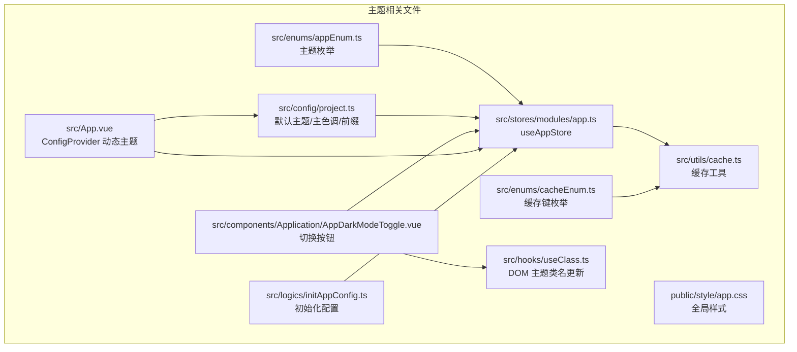
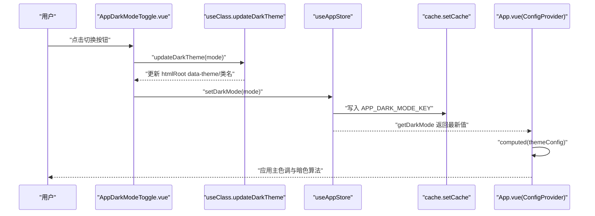
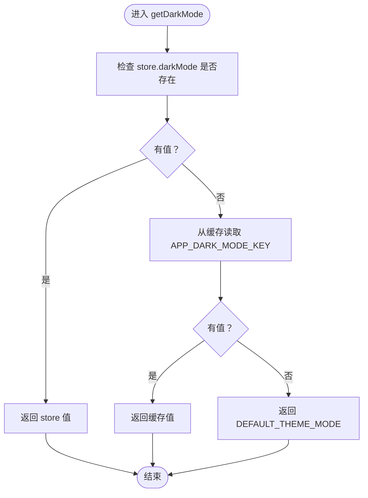
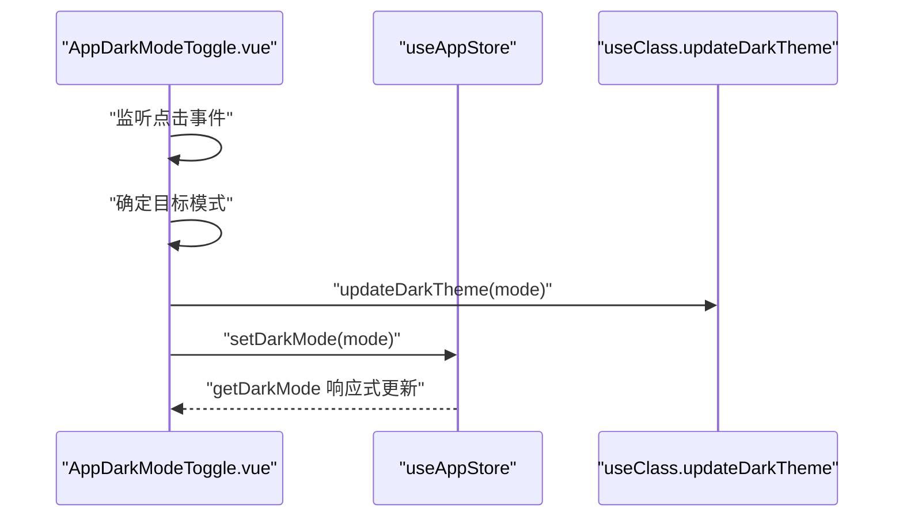
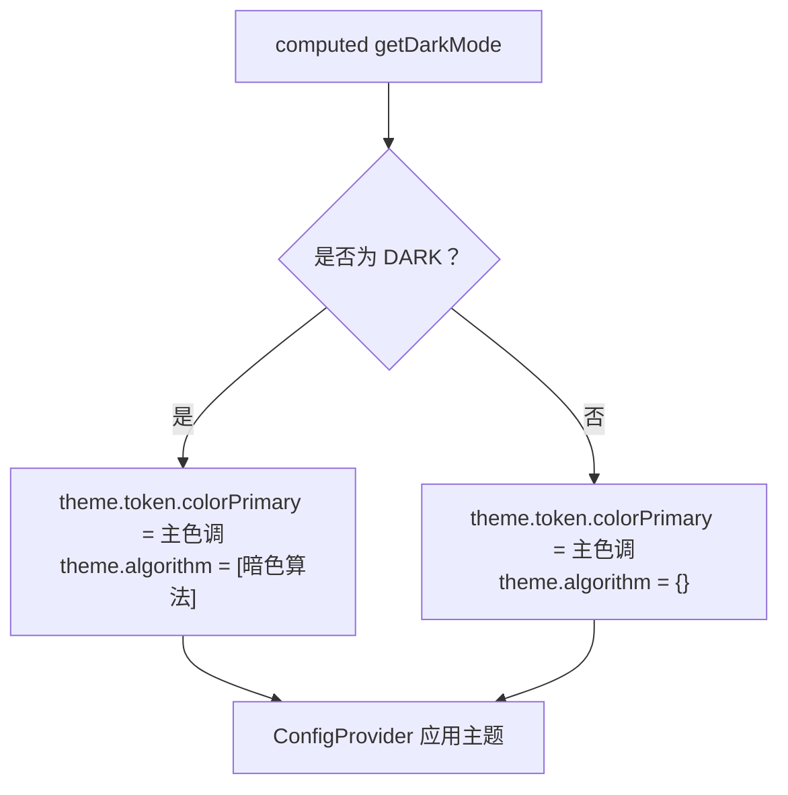
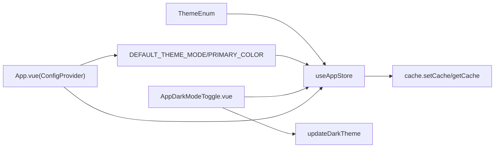

# 主题切换

<cite>
**本文引用的文件列表**
- [src/enums/appEnum.ts](file://src/enums/appEnum.ts)
- [src/stores/modules/app.ts](file://src/stores/modules/app.ts)
- [src/components/Application/AppDarkModeToggle.vue](file://src/components/Application/AppDarkModeToggle.vue)
- [src/App.vue](file://src/App.vue)
- [src/config/project.ts](file://src/config/project.ts)
- [src/hooks/useClass.ts](file://src/hooks/useClass.ts)
- [src/utils/cache.ts](file://src/utils/cache.ts)
- [src/enums/cacheEnum.ts](file://src/enums/cacheEnum.ts)
- [src/logics/initAppConfig.ts](file://src/logics/initAppConfig.ts)
- [public/style/app.css](file://public/style/app.css)
</cite>

## 目录
1. [简介](#简介)
2. [项目结构](#项目结构)
3. [核心组件](#核心组件)
4. [架构总览](#架构总览)
5. [详细组件分析](#详细组件分析)
6. [依赖关系分析](#依赖关系分析)
7. [性能考量](#性能考量)
8. [故障排查指南](#故障排查指南)
9. [结论](#结论)
10. [附录：自定义与扩展指南](#附录自定义与扩展指南)

## 简介
本文件围绕项目的主题切换功能展开，重点覆盖明暗模式的实现机制。从枚举定义、Pinia 状态管理、UI 组件交互、Ant Design Vue ConfigProvider 的动态主题应用，到与 localStorage 的持久化同步，形成完整的技术路径说明。同时提供扩展指南，帮助开发者添加新主题模式、自定义主色调、集成系统级暗色偏好等高级用法。

## 项目结构
主题切换涉及的关键文件分布如下：
- 枚举与常量：定义主题模式枚举、默认主题、主色调、缓存键等
- Pinia Store：集中管理主题状态、持久化写入
- UI 组件：提供明暗切换按钮，驱动主题状态变更
- 应用根组件：通过 Ant Design Vue ConfigProvider 动态应用主题
- 工具函数：负责 DOM 上的主题类名更新与缓存读写

图表来源
- [src/enums/appEnum.ts](file://src/enums/appEnum.ts#L1-L23)
- [src/config/project.ts](file://src/config/project.ts#L1-L39)
- [src/stores/modules/app.ts](file://src/stores/modules/app.ts#L1-L76)
- [src/utils/cache.ts](file://src/utils/cache.ts#L1-L138)
- [src/enums/cacheEnum.ts](file://src/enums/cacheEnum.ts#L1-L17)
- [src/hooks/useClass.ts](file://src/hooks/useClass.ts#L1-L110)
- [src/components/Application/AppDarkModeToggle.vue](file://src/components/Application/AppDarkModeToggle.vue#L1-L35)
- [src/App.vue](file://src/App.vue#L1-L42)
- [src/logics/initAppConfig.ts](file://src/logics/initAppConfig.ts#L1-L54)
- [public/style/app.css](file://public/style/app.css#L1-L117)

章节来源
- [src/enums/appEnum.ts](file://src/enums/appEnum.ts#L1-L23)
- [src/config/project.ts](file://src/config/project.ts#L1-L39)
- [src/stores/modules/app.ts](file://src/stores/modules/app.ts#L1-L76)
- [src/utils/cache.ts](file://src/utils/cache.ts#L1-L138)
- [src/enums/cacheEnum.ts](file://src/enums/cacheEnum.ts#L1-L17)
- [src/hooks/useClass.ts](file://src/hooks/useClass.ts#L1-L110)
- [src/components/Application/AppDarkModeToggle.vue](file://src/components/Application/AppDarkModeToggle.vue#L1-L35)
- [src/App.vue](file://src/App.vue#L1-L42)
- [src/logics/initAppConfig.ts](file://src/logics/initAppConfig.ts#L1-L54)
- [public/style/app.css](file://public/style/app.css#L1-L117)

## 核心组件
- 主题枚举：在枚举中定义了 LIGHT 与 DARK 两种模式，作为状态的合法取值。
- 默认主题与主色调：项目默认主题为 LIGHT，主色调常量定义于配置文件。
- Pinia Store：集中维护 darkMode 状态，提供 setDarkMode/getDarkMode；getDarkMode 同时回退到缓存与默认值。
- 缓存工具：封装 localStorage/sessionStorage 的统一读写，使用统一的缓存键。
- DOM 主题类名更新：通过更新 htmlRoot 的 data-theme 与类名，配合 CSS 实现明暗样式切换。
- UI 切换按钮：基于 Ant Design Vue Switch，绑定 getDarkMode 计算属性，点击后调用更新函数。
- ConfigProvider 主题应用：根据 getDarkMode 条件应用暗色算法与主色调 token。

章节来源
- [src/enums/appEnum.ts](file://src/enums/appEnum.ts#L1-L23)
- [src/config/project.ts](file://src/config/project.ts#L1-L39)
- [src/stores/modules/app.ts](file://src/stores/modules/app.ts#L1-L76)
- [src/utils/cache.ts](file://src/utils/cache.ts#L1-L138)
- [src/hooks/useClass.ts](file://src/hooks/useClass.ts#L1-L110)
- [src/components/Application/AppDarkModeToggle.vue](file://src/components/Application/AppDarkModeToggle.vue#L1-L35)
- [src/App.vue](file://src/App.vue#L1-L42)

## 架构总览
主题切换的端到端流程如下：
- 用户在 UI 中点击切换按钮，触发事件回调
- 事件回调调用 DOM 主题更新函数，更新 htmlRoot 的 data-theme 与类名
- 同步写入 Pinia Store 的 darkMode，并持久化到缓存
- 应用根组件通过 computed 读取 darkMode，动态构造 ConfigProvider 的 theme 配置
- ConfigProvider 将主色调与暗色算法注入到组件树，完成主题渲染

图表来源
- [src/components/Application/AppDarkModeToggle.vue](file://src/components/Application/AppDarkModeToggle.vue#L1-L35)
- [src/hooks/useClass.ts](file://src/hooks/useClass.ts#L1-L110)
- [src/stores/modules/app.ts](file://src/stores/modules/app.ts#L1-L76)
- [src/utils/cache.ts](file://src/utils/cache.ts#L1-L138)
- [src/App.vue](file://src/App.vue#L1-L42)

## 详细组件分析

### 主题枚举与默认配置
- 枚举定义了 LIGHT/DARK 两种模式，作为状态的合法取值，避免魔法字符串。
- 默认主题与主色调分别在配置文件中定义，确保首次加载与回退策略一致。
- 缓存键枚举集中管理 APP_DARK_MODE_KEY，便于统一维护。

章节来源
- [src/enums/appEnum.ts](file://src/enums/appEnum.ts#L1-L23)
- [src/config/project.ts](file://src/config/project.ts#L1-L39)
- [src/enums/cacheEnum.ts](file://src/enums/cacheEnum.ts#L1-L17)

### Pinia 状态管理：useAppStore
- 状态字段：darkMode、pageLoading、projectConfig、beforeMiniInfo、siteInfo。
- Getter：
  - getDarkMode：优先返回 store 内部状态，否则回退到缓存，再回退到默认主题。
- Action：
  - setDarkMode：设置 darkMode 并写入缓存键 APP_DARK_MODE_KEY。
  - setProjectConfig：合并项目配置并持久化。
- 与缓存的耦合：通过统一的缓存工具读写，保证跨刷新一致性。

图表来源
- [src/stores/modules/app.ts](file://src/stores/modules/app.ts#L1-L76)
- [src/utils/cache.ts](file://src/utils/cache.ts#L1-L138)
- [src/config/project.ts](file://src/config/project.ts#L1-L39)

章节来源
- [src/stores/modules/app.ts](file://src/stores/modules/app.ts#L1-L76)
- [src/utils/cache.ts](file://src/utils/cache.ts#L1-L138)
- [src/config/project.ts](file://src/config/project.ts#L1-L39)

### UI 切换按钮：AppDarkModeToggle.vue
- 绑定 Switch 的 checked 与 checkedValue/unCheckedValue，以 ThemeEnum 的值作为开关状态。
- 计算属性 getDarkMode 来源 useAppStore.getDarkMode，实现双向响应。
- 点击事件 toggleDarkMode：根据传入值选择 LIGHT/DARK，最终调用 updateDarkTheme 更新 DOM 主题类名。

图表来源
- [src/components/Application/AppDarkModeToggle.vue](file://src/components/Application/AppDarkModeToggle.vue#L1-L35)
- [src/hooks/useClass.ts](file://src/hooks/useClass.ts#L1-L110)
- [src/stores/modules/app.ts](file://src/stores/modules/app.ts#L1-L76)

章节来源
- [src/components/Application/AppDarkModeToggle.vue](file://src/components/Application/AppDarkModeToggle.vue#L1-L35)
- [src/hooks/useClass.ts](file://src/hooks/useClass.ts#L1-L110)
- [src/stores/modules/app.ts](file://src/stores/modules/app.ts#L1-L76)

### 应用根组件：App.vue 与 ConfigProvider
- 通过 computed 读取 getDarkMode 与 getProjectConfig.themeColor，构造 ThemeConfig。
- 当模式为 DARK 时，注入暗色算法；否则为空对象，不启用暗色算法。
- 将 ConfigProvider 的 theme 绑定到 computed 结果，从而影响整个组件树的样式。

图表来源
- [src/App.vue](file://src/App.vue#L1-L42)
- [src/config/project.ts](file://src/config/project.ts#L1-L39)

章节来源
- [src/App.vue](file://src/App.vue#L1-L42)
- [src/config/project.ts](file://src/config/project.ts#L1-L39)

### DOM 主题类名更新：useClass.ts
- updateDarkTheme：根据模式更新 htmlRoot 的 data-theme 属性与类名，确保 CSS 能够识别当前主题。
- hasClass/addClass/removeClass：兼容性处理，避免直接使用 classList 导致的浏览器差异问题。

章节来源
- [src/hooks/useClass.ts](file://src/hooks/useClass.ts#L1-L110)

### 缓存与持久化：cache.ts 与 cacheEnum.ts
- setCache/getCache：统一写入与读取缓存，使用 APP_DARK_MODE_KEY 作为键。
- 缓存键枚举：集中管理所有缓存键，避免散落的字符串。
- 初始化配置：initAppConfigStore 在应用启动时合并默认配置与缓存配置，保证主题与项目配置的一致性。

章节来源
- [src/utils/cache.ts](file://src/utils/cache.ts#L1-L138)
- [src/enums/cacheEnum.ts](file://src/enums/cacheEnum.ts#L1-L17)
- [src/logics/initAppConfig.ts](file://src/logics/initAppConfig.ts#L1-L54)

## 依赖关系分析
- 枚举与配置：ThemeEnum 与 DEFAULT_THEME_MODE、PRIMARY_COLOR 为全局常量，被 Store 与 App.vue 使用。
- Store 与缓存：Store 的 setDarkMode 与 getDarkMode 与缓存工具强耦合，确保跨刷新一致性。
- UI 与 Store：AppDarkModeToggle.vue 通过 Pinia 读取与写入 darkMode，形成单向数据流。
- 根组件与 UI：App.vue 的 themeConfig 依赖于 Store 的 getDarkMode，形成响应式联动。
- DOM 与 UI：AppDarkModeToggle.vue 通过 updateDarkTheme 直接更新 DOM，提升即时反馈。

图表来源
- [src/enums/appEnum.ts](file://src/enums/appEnum.ts#L1-L23)
- [src/config/project.ts](file://src/config/project.ts#L1-L39)
- [src/stores/modules/app.ts](file://src/stores/modules/app.ts#L1-L76)
- [src/utils/cache.ts](file://src/utils/cache.ts#L1-L138)
- [src/components/Application/AppDarkModeToggle.vue](file://src/components/Application/AppDarkModeToggle.vue#L1-L35)
- [src/hooks/useClass.ts](file://src/hooks/useClass.ts#L1-L110)
- [src/App.vue](file://src/App.vue#L1-L42)

章节来源
- [src/enums/appEnum.ts](file://src/enums/appEnum.ts#L1-L23)
- [src/config/project.ts](file://src/config/project.ts#L1-L39)
- [src/stores/modules/app.ts](file://src/stores/modules/app.ts#L1-L76)
- [src/utils/cache.ts](file://src/utils/cache.ts#L1-L138)
- [src/components/Application/AppDarkModeToggle.vue](file://src/components/Application/AppDarkModeToggle.vue#L1-L35)
- [src/hooks/useClass.ts](file://src/hooks/useClass.ts#L1-L110)
- [src/App.vue](file://src/App.vue#L1-L42)

## 性能考量
- 响应式最小化：仅在 getDarkMode 或 themeColor 变化时触发 ConfigProvider 重新计算，避免不必要的重渲染。
- DOM 更新轻量：updateDarkTheme 仅更新 htmlRoot 的 data-theme 与类名，开销极小。
- 缓存命中：getDarkMode 优先从内存状态读取，其次缓存，最后默认值，减少 IO 开销。
- 初始化合并：initAppConfigStore 在启动阶段一次性合并配置，避免运行时频繁读取缓存。
- 暗色算法按需应用：仅在 DARK 模式下启用暗色算法，避免非必要算法开销。

[本节为通用性能建议，不直接分析具体文件]

## 故障排查指南
- 切换无效或闪烁
  - 检查 AppDarkModeToggle.vue 的点击事件是否正确调用 updateDarkTheme 与 setDarkMode。
  - 确认 htmlRoot 是否存在且可访问，updateDarkTheme 是否成功写入 data-theme 与类名。
- 主题未持久化
  - 检查 setCache 是否被调用，以及 APP_DARK_MODE_KEY 对应的缓存项是否存在。
  - 确认 DEFAULT_THEME_MODE 与缓存键是否匹配预期。
- 暗色算法未生效
  - 确认 getDarkMode 返回值为 ThemeEnum.DARK，且 themeConfig 的 algorithm 字段被正确注入。
  - 检查 ConfigProvider 的 theme 绑定是否正确。
- 启动时主题不一致
  - 确认 initAppConfigStore 是否在应用启动时执行，且 getDarkMode 的回退链路正常。

章节来源
- [src/components/Application/AppDarkModeToggle.vue](file://src/components/Application/AppDarkModeToggle.vue#L1-L35)
- [src/hooks/useClass.ts](file://src/hooks/useClass.ts#L1-L110)
- [src/stores/modules/app.ts](file://src/stores/modules/app.ts#L1-L76)
- [src/utils/cache.ts](file://src/utils/cache.ts#L1-L138)
- [src/App.vue](file://src/App.vue#L1-L42)
- [src/logics/initAppConfig.ts](file://src/logics/initAppConfig.ts#L1-L54)

## 结论
本项目采用“UI 交互 -> DOM 类名更新 -> Pinia 状态 -> ConfigProvider 动态主题”的清晰路径实现主题切换。通过枚举约束、默认值回退、缓存持久化与按需算法应用，既保证了易用性，也兼顾了性能与一致性。开发者可在现有基础上轻松扩展新主题模式与自定义主色调。

[本节为总结性内容，不直接分析具体文件]

## 附录：自定义与扩展指南

### 如何添加新的主题模式
- 在枚举中新增模式值，例如新增 ThemeEnum.HALF_DARK。
- 在配置文件中为 DEFAULT_THEME_MODE 设定合理默认值。
- 在 UI 组件中扩展 Switch 的 checkedValue/unCheckedValue，使其能识别新枚举值。
- 在 App.vue 的 themeConfig 中增加对新模式的判断分支，决定是否应用特定算法或 token。

章节来源
- [src/enums/appEnum.ts](file://src/enums/appEnum.ts#L1-L23)
- [src/config/project.ts](file://src/config/project.ts#L1-L39)
- [src/App.vue](file://src/App.vue#L1-L42)

### 如何修改主题色变量
- 修改 PRIMARY_COLOR 常量，即可改变 ConfigProvider 的 colorPrimary。
- 若需要按模式动态变化，可在 themeConfig 中根据 getDarkMode 返回值选择不同色值。
- 注意：Ant Design Vue 的 token 支持多层级覆盖，可结合组件库文档进行更细粒度定制。

章节来源
- [src/config/project.ts](file://src/config/project.ts#L1-L39)
- [src/App.vue](file://src/App.vue#L1-L42)

### 如何集成系统级暗色模式偏好
- 可通过 window.matchMedia 监听 prefers-color-scheme，自动设置 Store 的 darkMode。
- 在应用启动时读取系统偏好并写入 Store，随后通过 getDarkMode 的回退链路保持一致性。
- 注意：此方案会与用户手动切换产生冲突，建议提供“跟随系统”选项并明确优先级策略。

[本节为概念性扩展建议，不直接分析具体文件]

### 性能优化建议
- 将主题切换事件与 DOM 更新解耦，避免在高频点击场景中重复写入缓存。
- 对 ConfigProvider 的 theme 计算结果进行浅比较，减少不必要的重渲染。
- 对缓存读写进行批量处理，避免频繁 IO。

[本节为通用性能建议，不直接分析具体文件]