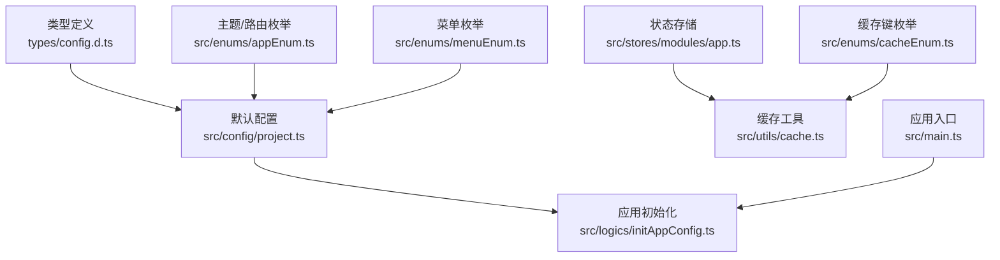
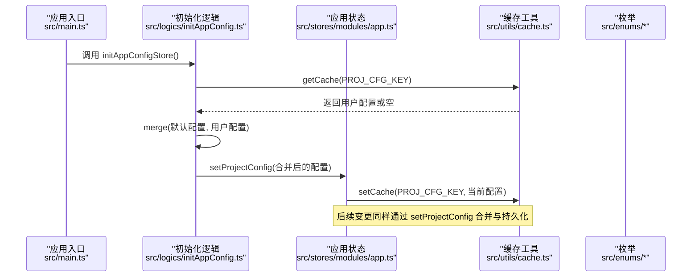
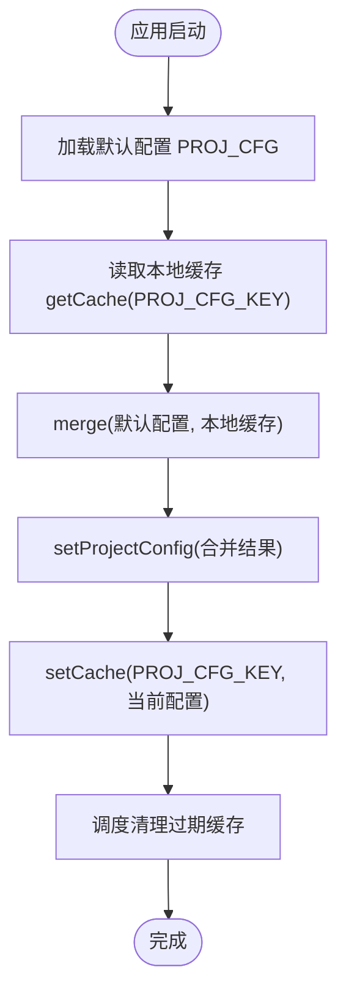
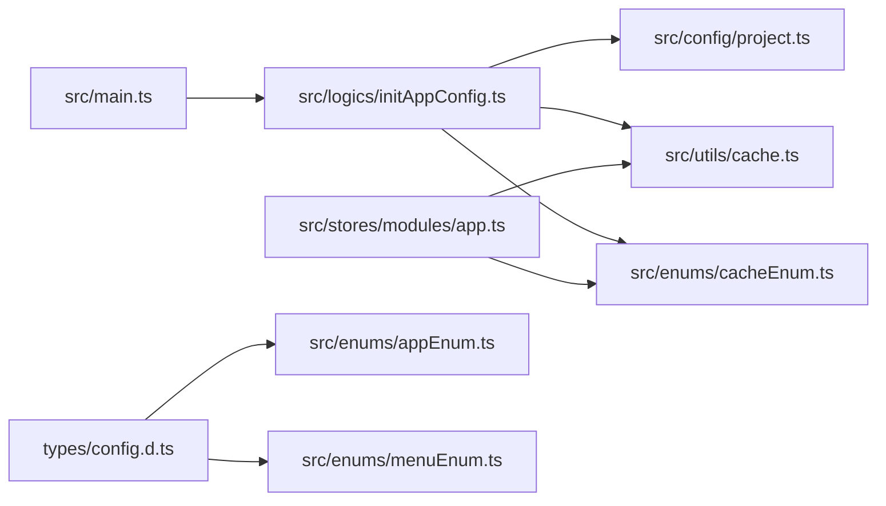

# 配置管理

<cite>
**本文引用的文件**
- [src/config/project.ts](file://src/config/project.ts)
- [types/config.d.ts](file://types/config.d.ts)
- [src/logics/initAppConfig.ts](file://src/logics/initAppConfig.ts)
- [src/stores/modules/app.ts](file://src/stores/modules/app.ts)
- [src/utils/cache.ts](file://src/utils/cache.ts)
- [src/enums/cacheEnum.ts](file://src/enums/cacheEnum.ts)
- [src/enums/appEnum.ts](file://src/enums/appEnum.ts)
- [src/enums/menuEnum.ts](file://src/enums/menuEnum.ts)
- [src/main.ts](file://src/main.ts)
</cite>

## 目录
1. [简介](#简介)
2. [项目结构](#项目结构)
3. [核心组件](#核心组件)
4. [架构总览](#架构总览)
5. [详细组件分析](#详细组件分析)
6. [依赖关系分析](#依赖关系分析)
7. [性能考量](#性能考量)
8. [故障排查指南](#故障排查指南)
9. [结论](#结论)
10. [附录：扩展与自定义指南](#附录扩展与自定义指南)

## 简介
本文件系统性地文档化项目的全局配置管理系统，围绕以下关键点展开：
- 从默认配置常量 PROJ_CFG 出发，解释主题模式、主色调、头部设置、菜单设置、过渡动画设置、多标签页设置等结构与含义。
- 深入解析 ProjectConfig 及其子接口（HeaderSetting、MenuSetting、TransitionSetting、MultiTabsSetting）的数据类型与业务语义。
- 阐述 initAppConfigStore 如何在应用启动时合并默认配置与本地缓存配置，并通过 useAppStore.setProjectConfig 初始化应用状态。
- 解释配置持久化机制，包括缓存键 CacheTypeEnum.PROJ_CFG_KEY 的使用与 setCache 的调用。
- 提供扩展与自定义配置的实践指导，包括修改默认主题色、调整布局参数、配置缓存策略等，并解释配置合并逻辑（lodash-es 的 merge）的工作原理。

## 项目结构
配置系统由“默认配置”“类型定义”“应用初始化”“状态存储”“缓存工具”“枚举”六部分组成，形成“默认配置 + 用户缓存”的合并闭环，并通过 Pinia Store 统一对外暴露。

图表来源
- [src/config/project.ts](file://src/config/project.ts#L1-L39)
- [types/config.d.ts](file://types/config.d.ts#L1-L106)
- [src/logics/initAppConfig.ts](file://src/logics/initAppConfig.ts#L1-L54)
- [src/stores/modules/app.ts](file://src/stores/modules/app.ts#L1-L76)
- [src/utils/cache.ts](file://src/utils/cache.ts#L1-L138)
- [src/enums/cacheEnum.ts](file://src/enums/cacheEnum.ts#L1-L17)
- [src/enums/appEnum.ts](file://src/enums/appEnum.ts#L1-L23)
- [src/enums/menuEnum.ts](file://src/enums/menuEnum.ts#L1-L40)
- [src/main.ts](file://src/main.ts#L1-L29)

章节来源
- [src/config/project.ts](file://src/config/project.ts#L1-L39)
- [types/config.d.ts](file://types/config.d.ts#L1-L106)
- [src/logics/initAppConfig.ts](file://src/logics/initAppConfig.ts#L1-L54)
- [src/stores/modules/app.ts](file://src/stores/modules/app.ts#L1-L76)
- [src/utils/cache.ts](file://src/utils/cache.ts#L1-L138)
- [src/enums/cacheEnum.ts](file://src/enums/cacheEnum.ts#L1-L17)
- [src/enums/appEnum.ts](file://src/enums/appEnum.ts#L1-L23)
- [src/enums/menuEnum.ts](file://src/enums/menuEnum.ts#L1-L40)
- [src/main.ts](file://src/main.ts#L1-L29)

## 核心组件
- 默认配置常量 PROJ_CFG：集中定义主题模式、主色调、以及空的头部/菜单/过渡/多标签页配置对象，作为应用启动时的基线。
- 类型定义 ProjectConfig 及子接口：以强类型约束配置结构，明确各字段的业务含义与取值范围。
- 应用初始化 initAppConfigStore：读取本地缓存并合并默认配置，再写入 Pinia Store。
- 状态存储 useAppStore：提供 setProjectConfig 动作，负责合并与持久化配置。
- 缓存工具 setCache/getCache：封装统一的缓存读写与版本清理逻辑。
- 枚举：ThemeEnum、RouterTransitionEnum、MenuModeEnum、MenuTypeEnum、TriggerEnum、MixSidebarTriggerEnum 等，为配置提供规范化的取值。

章节来源
- [src/config/project.ts](file://src/config/project.ts#L1-L39)
- [types/config.d.ts](file://types/config.d.ts#L1-L106)
- [src/logics/initAppConfig.ts](file://src/logics/initAppConfig.ts#L1-L54)
- [src/stores/modules/app.ts](file://src/stores/modules/app.ts#L1-L76)
- [src/utils/cache.ts](file://src/utils/cache.ts#L1-L138)
- [src/enums/cacheEnum.ts](file://src/enums/cacheEnum.ts#L1-L17)
- [src/enums/appEnum.ts](file://src/enums/appEnum.ts#L1-L23)
- [src/enums/menuEnum.ts](file://src/enums/menuEnum.ts#L1-L40)

## 架构总览
配置系统采用“默认配置 + 本地缓存”的合并策略，在应用启动阶段完成初始化；运行期间通过 Pinia Store 统一访问与持久化。

图表来源
- [src/main.ts](file://src/main.ts#L1-L29)
- [src/logics/initAppConfig.ts](file://src/logics/initAppConfig.ts#L1-L54)
- [src/stores/modules/app.ts](file://src/stores/modules/app.ts#L1-L76)
- [src/utils/cache.ts](file://src/utils/cache.ts#L1-L138)
- [src/enums/cacheEnum.ts](file://src/enums/cacheEnum.ts#L1-L17)

## 详细组件分析

### 默认配置 PROJ_CFG 与主题/颜色/缓存策略
- 主题模式：使用 ThemeEnum.LIGHT 作为默认主题。
- 主色调：PRIMARY_COLOR 定义主色调，PROJ_CFG 中 themeColor 使用该值。
- 缓存策略：DEFAULT_CACHE_TIME 定义默认缓存有效期；CACHE_LOCATION 指定默认缓存位置（LOCAL/SESSION）。
- 前缀与键：PREFIX_CLS 用于生成缓存键前缀，PROJ_CFG_KEY 用于项目配置缓存键。

章节来源
- [src/config/project.ts](file://src/config/project.ts#L1-L39)
- [src/enums/appEnum.ts](file://src/enums/appEnum.ts#L1-L23)
- [src/enums/cacheEnum.ts](file://src/enums/cacheEnum.ts#L1-L17)

### 类型定义 ProjectConfig 及子接口
- ProjectConfig：顶层配置对象，包含 theme、themeColor、headerSetting、menuSetting、transitionSetting、multiTabsSetting。
- HeaderSetting：头部背景色、固定、显隐、主题、全屏/锁屏/帮助/通知/搜索等按钮开关。
- MenuSetting：菜单背景色、固定、折叠、侧边隐藏、拖拽、显隐、分类菜单、菜单宽度、模式/类型、主题、对齐、触发器、手风琴、切换页面关闭混合菜单、折叠标题、混合菜单触发方式、固定等。
- TransitionSetting：切换动画开关、基本过渡效果、页面加载动画、顶部进度条。
- MultiTabsSetting：多标签页缓存、显隐、快捷操作、拖拽、刷新/折叠按钮、自动折叠。

章节来源
- [types/config.d.ts](file://types/config.d.ts#L1-L106)
- [src/enums/appEnum.ts](file://src/enums/appEnum.ts#L1-L23)
- [src/enums/menuEnum.ts](file://src/enums/menuEnum.ts#L1-L40)

### 应用初始化流程 initAppConfigStore
- 合并策略：使用 lodash-es 的 merge 将默认配置与本地缓存配置进行深合并，确保用户配置覆盖默认值。
- 写入状态：调用 useAppStore.setProjectConfig 将合并后的配置写入 Pinia Store。
- 清理过期缓存：在微任务后执行 clearObsoleteStorage，按版本号与创建时间清理过期缓存。

图表来源
- [src/logics/initAppConfig.ts](file://src/logics/initAppConfig.ts#L1-L54)
- [src/stores/modules/app.ts](file://src/stores/modules/app.ts#L1-L76)
- [src/utils/cache.ts](file://src/utils/cache.ts#L1-L138)

章节来源
- [src/logics/initAppConfig.ts](file://src/logics/initAppConfig.ts#L1-L54)
- [src/stores/modules/app.ts](file://src/stores/modules/app.ts#L1-L76)

### 状态存储 useAppStore 的配置合并与持久化
- setProjectConfig：先与现有配置进行 merge，再通过 setCache 将最新配置写回缓存。
- Getter：提供 getHeaderSetting、getMenuSetting、getTransitionSetting、getMultiTabsSetting 等便捷访问器，若无配置则返回空对象以避免空指针。

章节来源
- [src/stores/modules/app.ts](file://src/stores/modules/app.ts#L1-L76)
- [src/utils/cache.ts](file://src/utils/cache.ts#L1-L138)
- [src/enums/cacheEnum.ts](file://src/enums/cacheEnum.ts#L1-L17)

### 缓存工具与键空间
- setCache/getCache：统一的缓存读写接口，内部以 generateCaheKey 生成带版本号的键，避免跨版本冲突。
- CacheType：缓存数据结构包含 version、data、createTime，支持 resetCache 重置创建时间。
- 过期清理：clearObsoleteStorage 按版本号与创建时间判断过期并删除。

章节来源
- [src/utils/cache.ts](file://src/utils/cache.ts#L1-L138)
- [src/enums/cacheEnum.ts](file://src/enums/cacheEnum.ts#L1-L17)
- [src/logics/initAppConfig.ts](file://src/logics/initAppConfig.ts#L1-L54)

### 配置合并逻辑（lodash-es merge）
- 行为特征：对对象进行深合并，优先使用用户提供配置，缺失项回退到默认配置。
- 在初始化与运行时均使用 merge，保证配置一致性与可扩展性。

章节来源
- [src/logics/initAppConfig.ts](file://src/logics/initAppConfig.ts#L1-L54)
- [src/stores/modules/app.ts](file://src/stores/modules/app.ts#L1-L76)

## 依赖关系分析
- 入口依赖：main.ts 依赖 initAppConfigStore 完成配置初始化。
- 初始化依赖：initAppConfig.ts 依赖 PROJ_CFG、CacheTypeEnum、getCache、merge。
- 存储依赖：app.ts 依赖 CacheTypeEnum、setCache、merge。
- 类型依赖：config.d.ts 依赖 appEnum.ts 与 menuEnum.ts 的枚举类型。
- 缓存依赖：cache.ts 依赖 CacheTypeEnum、CacheLocationEnum、package.json 版本号与 PREFIX_CLS。

图表来源
- [src/main.ts](file://src/main.ts#L1-L29)
- [src/logics/initAppConfig.ts](file://src/logics/initAppConfig.ts#L1-L54)
- [src/config/project.ts](file://src/config/project.ts#L1-L39)
- [src/stores/modules/app.ts](file://src/stores/modules/app.ts#L1-L76)
- [src/utils/cache.ts](file://src/utils/cache.ts#L1-L138)
- [src/enums/cacheEnum.ts](file://src/enums/cacheEnum.ts#L1-L17)
- [types/config.d.ts](file://types/config.d.ts#L1-L106)
- [src/enums/appEnum.ts](file://src/enums/appEnum.ts#L1-L23)
- [src/enums/menuEnum.ts](file://src/enums/menuEnum.ts#L1-L40)

章节来源
- [src/main.ts](file://src/main.ts#L1-L29)
- [src/logics/initAppConfig.ts](file://src/logics/initAppConfig.ts#L1-L54)
- [src/stores/modules/app.ts](file://src/stores/modules/app.ts#L1-L76)
- [src/utils/cache.ts](file://src/utils/cache.ts#L1-L138)
- [src/enums/cacheEnum.ts](file://src/enums/cacheEnum.ts#L1-L17)
- [types/config.d.ts](file://types/config.d.ts#L1-L106)
- [src/enums/appEnum.ts](file://src/enums/appEnum.ts#L1-L23)
- [src/enums/menuEnum.ts](file://src/enums/menuEnum.ts#L1-L40)

## 性能考量
- 合并成本：merge 为深合并，建议仅在必要时调用（如初始化与用户变更时），避免频繁深度遍历。
- 缓存命中：getCache/setCache 通过统一键空间与版本号减少跨版本冲突，提升缓存命中率。
- 清理时机：clearObsoleteStorage 放置于微任务后执行，避免阻塞主线程初始化。
- 存储位置：根据 CACHE_LOCATION 选择 localStorage 或 sessionStorage，平衡持久性与安全性。

## 故障排查指南
- 配置未生效
  - 检查是否在初始化后调用了 setProjectConfig 并持久化成功。
  - 确认本地缓存键 PROJ_CFG_KEY 是否存在且未被清理。
- 配置被重置
  - 检查版本号是否变化导致 clearObsoleteStorage 删除了旧缓存。
  - 检查 DEFAULT_CACHE_TIME 是否过短导致缓存过期。
- 合并异常
  - 确保传入的配置对象结构与 ProjectConfig 对应，避免类型不匹配导致合并失败。
  - 若出现字段覆盖问题，检查本地缓存中的字段是否与默认配置冲突。

章节来源
- [src/logics/initAppConfig.ts](file://src/logics/initAppConfig.ts#L1-L54)
- [src/stores/modules/app.ts](file://src/stores/modules/app.ts#L1-L76)
- [src/utils/cache.ts](file://src/utils/cache.ts#L1-L138)

## 结论
本配置系统通过“默认配置 + 本地缓存”的合并策略，结合 Pinia Store 与统一缓存工具，实现了灵活、可扩展且持久化的全局配置管理。开发者可在不影响默认行为的前提下，通过本地缓存覆盖任意配置项；同时，版本与时间维度的清理机制保障了长期使用的稳定性。

## 附录：扩展与自定义指南
- 修改默认主题色
  - 步骤：在默认配置中更新 themeColor 字段，或在本地缓存中覆盖该字段。
  - 影响：影响主题色系渲染，适用于品牌定制。
  - 参考路径：[src/config/project.ts](file://src/config/project.ts#L1-L39)、[src/stores/modules/app.ts](file://src/stores/modules/app.ts#L1-L76)
- 调整头部设置
  - 可配置项：bgColor、fixed、show、theme、showFullScreen、useLockPage、showDoc、showNotice、showSearch。
  - 示例：在本地缓存中添加 headerSetting 并设置 show=true。
  - 参考路径：[types/config.d.ts](file://types/config.d.ts#L1-L106)、[src/stores/modules/app.ts](file://src/stores/modules/app.ts#L1-L76)
- 调整菜单设置
  - 可配置项：bgColor、fixed、collapsed、menuWidth、mode、type、theme、topMenuAlign、trigger、accordion、collapsedShowTitle、mixSideTrigger、mixSideFixed 等。
  - 示例：在本地缓存中设置 menuSetting.collapsed=true 实现默认折叠。
  - 参考路径：[types/config.d.ts](file://types/config.d.ts#L1-L106)、[src/enums/menuEnum.ts](file://src/enums/menuEnum.ts#L1-L40)
- 调整过渡动画设置
  - 可配置项：enable、basicTransition、openPageLoading、openNProgress。
  - 示例：在本地缓存中设置 openPageLoading=false 关闭页面加载动画。
  - 参考路径：[types/config.d.ts](file://types/config.d.ts#L1-L106)、[src/enums/appEnum.ts](file://src/enums/appEnum.ts#L1-L23)
- 配置多标签页设置
  - 可配置项：cache、show、showQuick、canDrag、showRedo、showFold、autoCollapse。
  - 示例：在本地缓存中设置 show=true 显示多标签页。
  - 参考路径：[types/config.d.ts](file://types/config.d.ts#L1-L106)
- 配置缓存策略
  - 更改默认缓存位置：在默认配置中修改 CACHE_LOCATION。
  - 更改默认缓存有效期：在默认配置中修改 DEFAULT_CACHE_TIME。
  - 参考路径：[src/config/project.ts](file://src/config/project.ts#L1-L39)、[src/utils/cache.ts](file://src/utils/cache.ts#L1-L138)
- 配置合并逻辑说明
  - 使用 lodash-es 的 merge 实现深合并，优先使用用户提供配置，缺失项回退到默认配置。
  - 参考路径：[src/logics/initAppConfig.ts](file://src/logics/initAppConfig.ts#L1-L54)、[src/stores/modules/app.ts](file://src/stores/modules/app.ts#L1-L76)