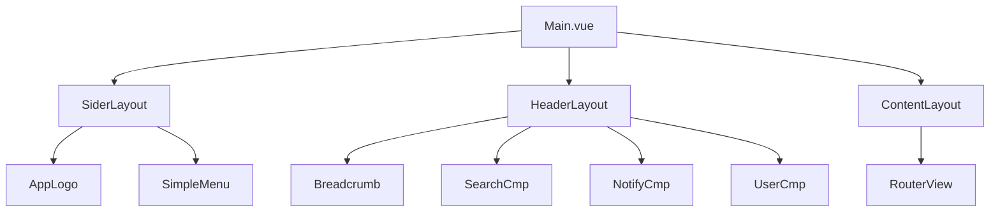
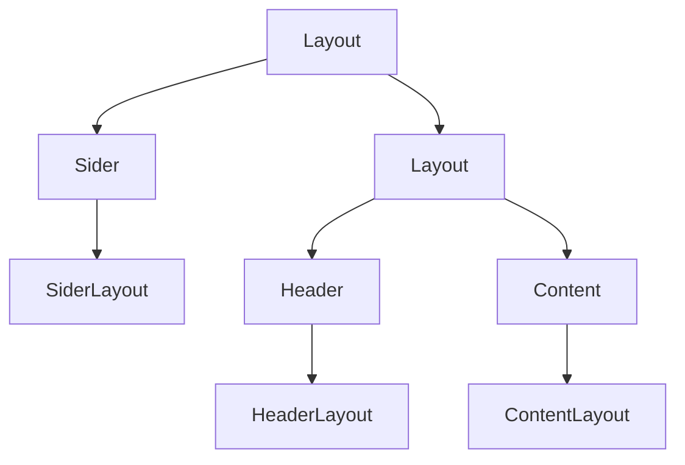
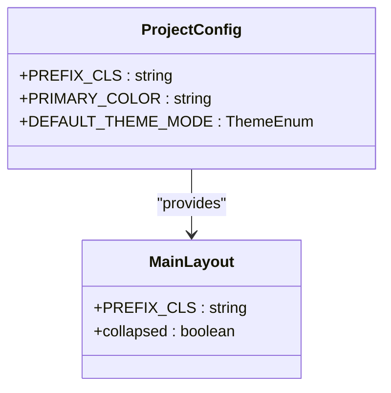
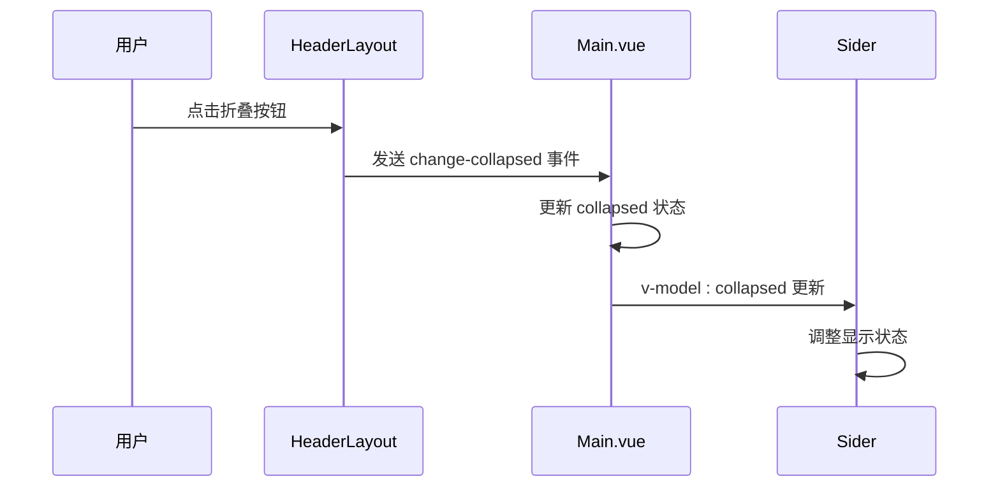
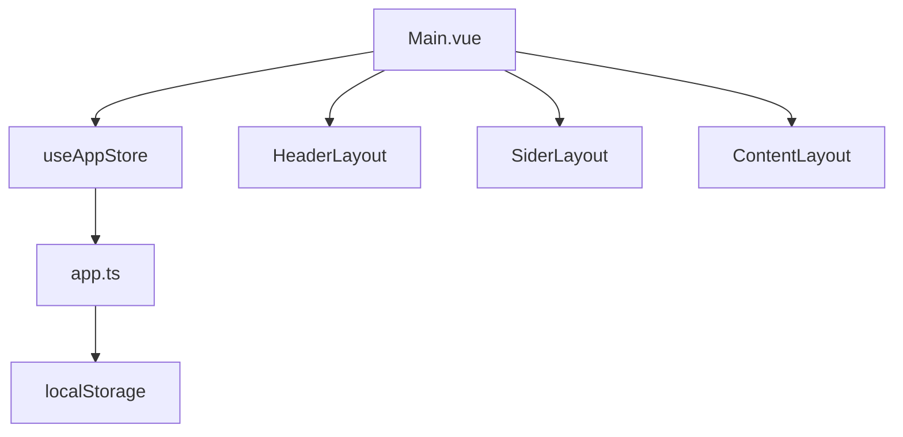
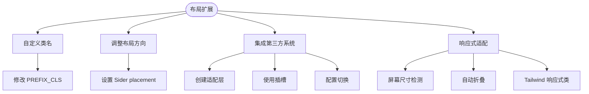
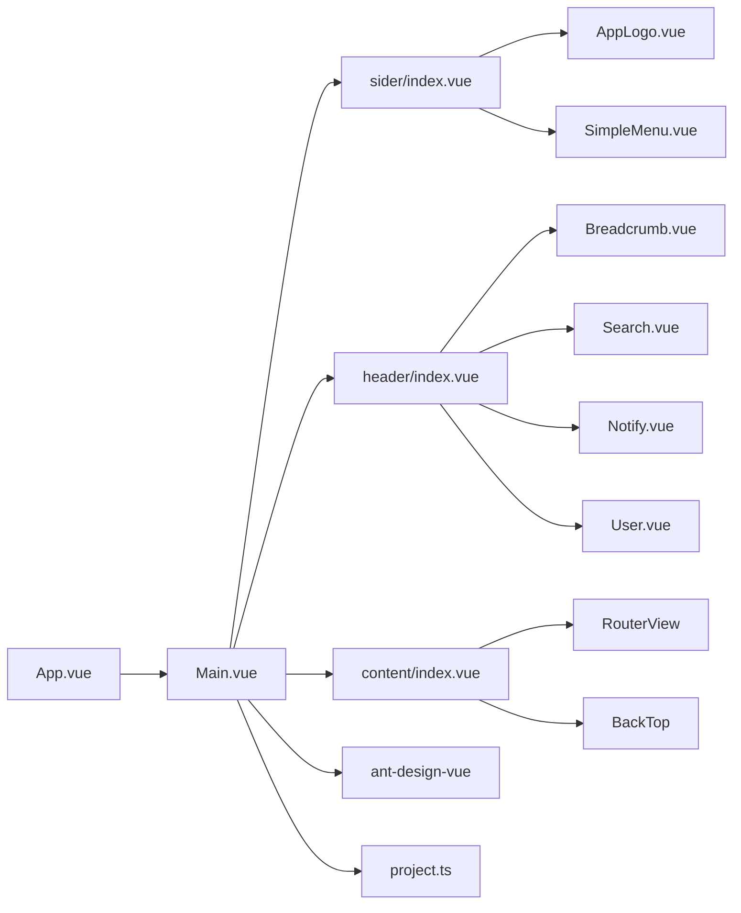

# 主布局

<cite>
**本文档中引用的文件**  
- [Main.vue](file://src/layouts/Main.vue)
- [project.ts](file://src/config/project.ts)
- [sider/index.vue](file://src/layouts/sider/index.vue)
- [header/index.vue](file://src/layouts/header/index.vue)
- [content/index.vue](file://src/layouts/content/index.vue)
- [app.ts](file://src/stores/modules/app.ts)
- [constant.ts](file://src/router/constant.ts)
</cite>

## 目录
1. [主布局概述](#主布局概述)
2. [核心组件结构](#核心组件结构)
3. [布局实现机制](#布局实现机制)
4. [样式作用域与类名前缀](#样式作用域与类名前缀)
5. [侧边栏展开/收起状态管理](#侧边栏展开收起状态管理)
6. [响应式行为与状态集成](#响应式行为与状态集成)
7. [布局扩展方式](#布局扩展方式)
8. [依赖关系图](#依赖关系图)

## 主布局概述

`Main.vue` 作为整个中后台应用的主布局容器组件，基于 Ant Design Vue 的 `Layout` 组件构建了标准的三栏式布局结构。该布局由侧边栏（Sider）、头部（Header）和内容区（Content）三个核心部分组成，形成了典型的中后台管理系统界面框架。

该组件通过组合式 API 实现了灵活的状态管理和组件通信，同时利用项目级配置实现了样式隔离和主题统一。布局结构清晰，职责分明，为后续功能模块的嵌套和扩展提供了良好的基础架构。

**Section sources**
- [Main.vue](file://src/layouts/Main.vue#L1-L43)

## 核心组件结构

主布局组件通过导入三个子布局组件来构建完整的页面结构：
- `SiderLayout`：负责侧边栏区域的渲染，包含应用 Logo 和菜单系统
- `HeaderLayout`：负责顶部导航区域的渲染，包含面包屑、搜索、通知和个人信息等元素
- `ContentLayout`：负责主要内容区域的渲染，承载路由视图和页面内容

这些组件通过 `Layout` 组件的嵌套关系组织在一起，形成清晰的视觉层次和功能分区。



**Diagram sources**
- [Main.vue](file://src/layouts/Main.vue#L1-L43)
- [sider/index.vue](file://src/layouts/sider/index.vue#L1-L18)
- [header/index.vue](file://src/layouts/header/index.vue#L1-L42)
- [content/index.vue](file://src/layouts/content/index.vue#L1-L54)

**Section sources**
- [sider/index.vue](file://src/layouts/sider/index.vue#L1-L18)
- [header/index.vue](file://src/layouts/header/index.vue#L1-L42)
- [content/index.vue](file://src/layouts/content/index.vue#L1-L54)

## 布局实现机制

主布局采用 Ant Design Vue 的 `Layout` 组件体系构建，通过以下方式实现标准的中后台页面结构：

1. 外层 `Layout` 容器包含一个可折叠的 `Sider` 和一个主 `Layout`
2. `Sider` 组件包含侧边栏内容，支持折叠功能
3. 主 `Layout` 包含 `Header` 和 `Content` 两个子组件
4. `Header` 显示顶部导航，`Content` 承载页面主要内容

这种嵌套结构遵循了 Ant Design Vue 的布局规范，确保了布局的一致性和可维护性。组件通过 `v-model:collapsed` 双向绑定管理侧边栏的展开状态，并通过事件机制实现组件间的通信。



**Diagram sources**
- [Main.vue](file://src/layouts/Main.vue#L1-L43)

**Section sources**
- [Main.vue](file://src/layouts/Main.vue#L1-L43)

## 样式作用域与类名前缀

`PREFIX_CLS` 在样式作用域中扮演着关键角色，它定义了项目的统一类名前缀，用于避免样式冲突并实现样式隔离。

在项目配置文件中，`PREFIX_CLS` 被定义为 "voir"：

```typescript
export const PREFIX_CLS = "voir"
```

该前缀在布局组件中被广泛使用：
- 作为组件类名的前缀（如 `voir-default-layout`）
- 在样式定义中创建作用域（如 `.@{prefix-cls}-default-layout`）
- 确保样式只影响当前项目的组件

这种方式实现了样式的作用域隔离，防止了全局样式污染，同时也便于样式的维护和主题的统一管理。



**Diagram sources**
- [project.ts](file://src/config/project.ts#L1-L38)
- [Main.vue](file://src/layouts/Main.vue#L1-L43)

**Section sources**
- [project.ts](file://src/config/project.ts#L1-L38)
- [Main.vue](file://src/layouts/Main.vue#L1-L43)

## 侧边栏展开收起状态管理

侧边栏的展开与收起状态通过 `collapsed` 响应式变量进行管理：

1. 在 `Main.vue` 中，`collapsed` 被定义为一个 `ref<boolean>`，初始值为 `false`（展开状态）
2. `Sider` 组件通过 `v-model:collapsed` 与该状态进行双向绑定
3. `HeaderLayout` 组件通过 `@change-collapsed` 事件接收状态变更请求
4. 当用户点击折叠按钮时，`HeaderLayout` 触发事件，`Main.vue` 更新 `collapsed` 状态

这种状态管理方式实现了组件间的解耦，同时保持了状态的一致性。状态变更会自动反映在 UI 上，Ant Design Vue 的 `Sider` 组件会根据 `collapsed` 的值自动调整宽度和显示效果。



**Diagram sources**
- [Main.vue](file://src/layouts/Main.vue#L1-L43)
- [header/index.vue](file://src/layouts/header/index.vue#L1-L42)

**Section sources**
- [Main.vue](file://src/layouts/Main.vue#L1-L43)
- [header/index.vue](file://src/layouts/header/index.vue#L1-L42)

## 响应式行为与状态集成

主布局组件与 Pinia 状态管理进行了集成，虽然当前 `collapsed` 状态在组件内部管理，但项目整体的状态管理架构为布局状态的持久化提供了基础。

在 `app.ts` 中，Pinia store 管理了应用的全局状态，包括主题模式、项目配置等：

```typescript
export const useAppStore = defineStore("app", {
  state: (): AppState => ({
    darkMode: undefined,
    pageLoading: false,
    projectConfig: {},
    beforeMiniInfo: {},
    siteInfo: null,
  }),
  // ...
})
```

未来可以将 `collapsed` 状态迁移到 Pinia store 中，实现状态的持久化和跨组件共享。通过将布局状态与全局状态管理集成，可以实现：
- 用户偏好记忆（记住上次的折叠状态）
- 多组件状态同步
- 状态持久化（通过 localStorage）



**Diagram sources**
- [Main.vue](file://src/layouts/Main.vue#L1-L43)
- [app.ts](file://src/stores/modules/app.ts#L1-L76)

**Section sources**
- [app.ts](file://src/stores/modules/app.ts#L1-L76)

## 布局扩展方式

主布局组件提供了多种扩展方式，以适应不同的需求场景：

### 自定义类名
可以通过修改 `PREFIX_CLS` 配置来改变所有组件的类名前缀，实现样式的定制化。

### 调整布局方向
虽然当前是侧边栏在左的标准布局，但可以通过调整 `Sider` 的 `placement` 属性来改变布局方向。

### 集成其他布局系统
当前布局基于 Ant Design Vue，但可以通过以下方式集成其他第三方布局系统：
1. 创建适配层组件
2. 使用插槽机制替换默认组件
3. 通过配置项动态切换布局方案

### 响应式适配
虽然当前代码中没有显式的媒体查询，但可以通过以下方式实现响应式：
- 在 `HeaderLayout` 中添加屏幕尺寸检测
- 在小屏幕上自动折叠侧边栏
- 使用 Tailwind CSS 的响应式类（如 `md:w-64`）



**Diagram sources**
- [Main.vue](file://src/layouts/Main.vue#L1-L43)
- [project.ts](file://src/config/project.ts#L1-L38)

**Section sources**
- [Main.vue](file://src/layouts/Main.vue#L1-L43)
- [project.ts](file://src/config/project.ts#L1-L38)

## 依赖关系图

主布局组件的依赖关系清晰，体现了良好的模块化设计：



**Diagram sources**
- [Main.vue](file://src/layouts/Main.vue#L1-L43)
- [App.vue](file://src/App.vue#L1-L41)
- [constant.ts](file://src/router/constant.ts#L1-L53)

**Section sources**
- [Main.vue](file://src/layouts/Main.vue#L1-L43)
- [App.vue](file://src/App.vue#L1-L41)
- [constant.ts](file://src/router/constant.ts#L1-L53)