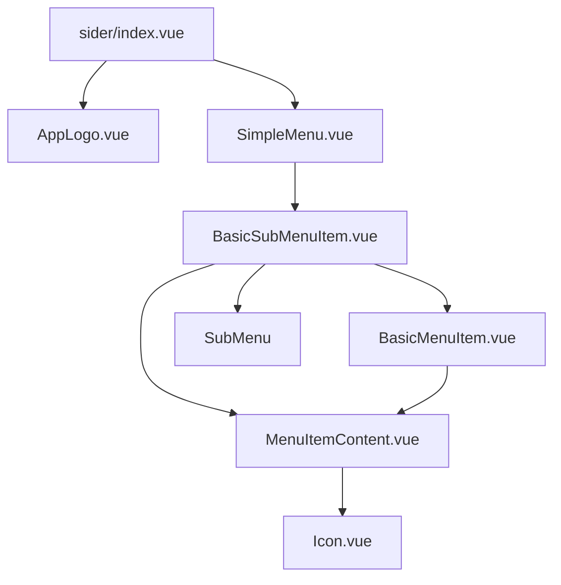
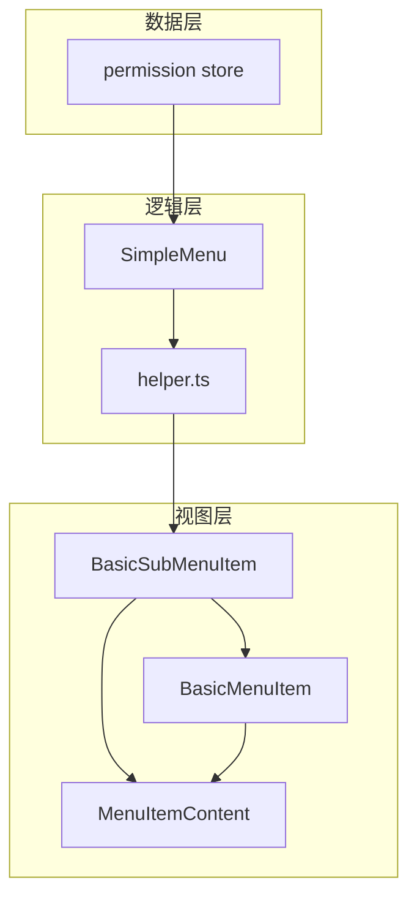
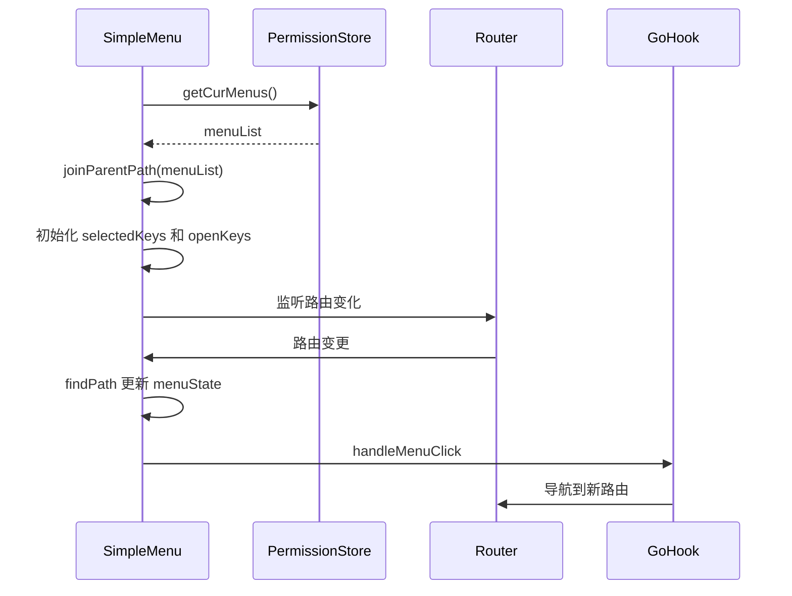
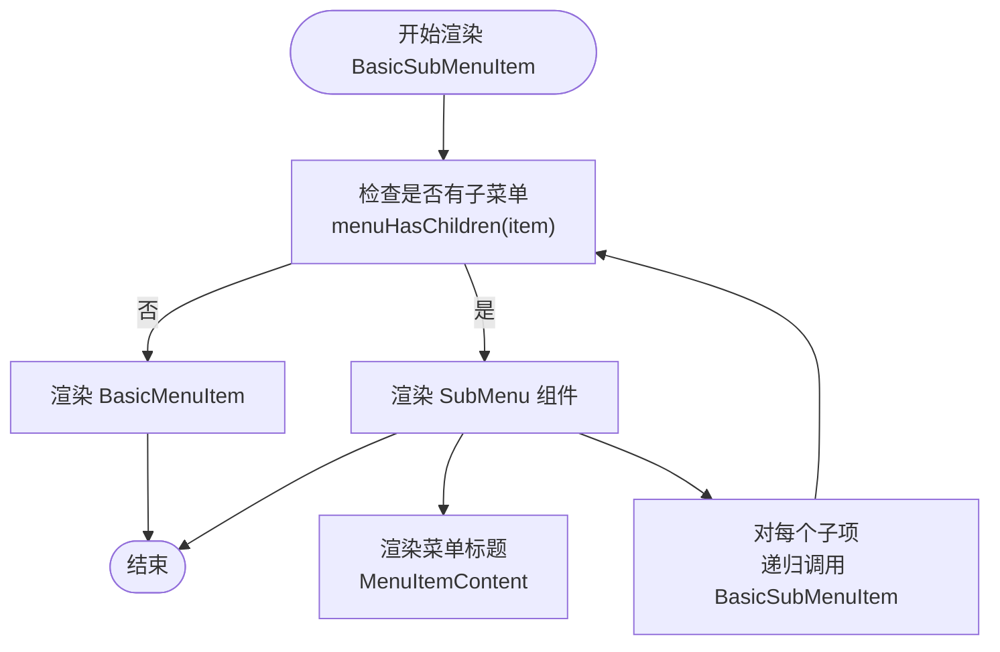
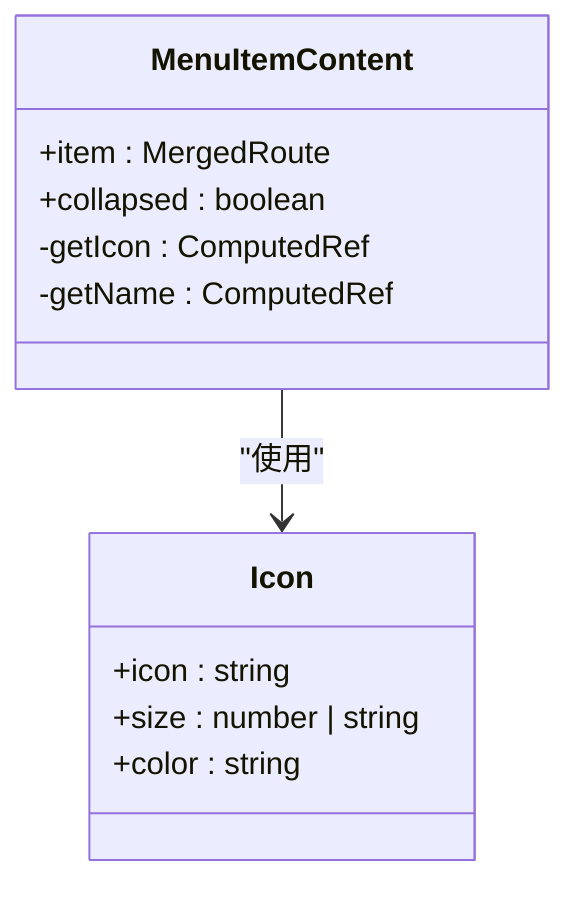
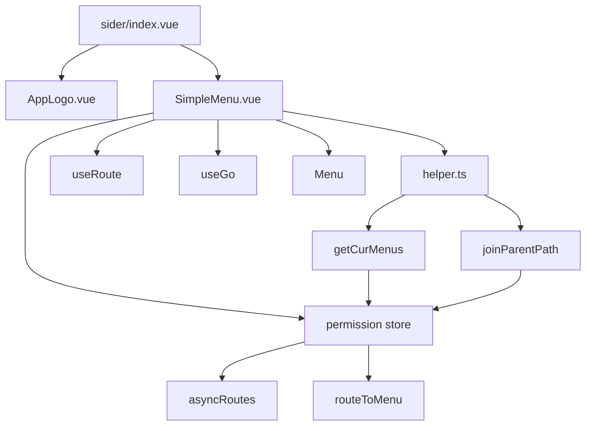

# 侧边栏布局

<cite>
**本文档中引用的文件**   
- [sider/index.vue](file://src/layouts/sider/index.vue)
- [sider/components/SimpleMenu.vue](file://src/layouts/sider/components/SimpleMenu.vue)
- [sider/components/BasicSubMenuItem.vue](file://src/layouts/sider/components/BasicSubMenuItem.vue)
- [sider/components/BasicMenuItem.vue](file://src/layouts/sider/components/BasicMenuItem.vue)
- [sider/components/MenuItemContent.vue](file://src/layouts/sider/components/MenuItemContent.vue)
- [sider/helper.ts](file://src/layouts/sider/helper.ts)
- [sider/types.ts](file://src/layouts/sider/types.ts)
- [stores/modules/permission.ts](file://src/stores/modules/permission.ts)
- [router/menuHelper.ts](file://src/router/menuHelper.ts)
- [router/routes.ts](file://src/router/routes.ts)
- [config/project.ts](file://src/config/project.ts)
- [components/Icon/Icon.vue](file://src/components/Icon/Icon.vue)
- [layouts/Main.vue](file://src/layouts/Main.vue)
</cite>

## 目录
1. [简介](#简介)
2. [项目结构](#项目结构)
3. [核心组件](#核心组件)
4. [架构概述](#架构概述)
5. [详细组件分析](#详细组件分析)
6. [依赖分析](#依赖分析)
7. [性能考虑](#性能考虑)
8. [故障排除指南](#故障排除指南)
9. [结论](#结论)

## 简介
`侧边栏布局`组件是应用中用于展示导航菜单的核心容器，主要负责渲染多级菜单结构、处理菜单折叠状态、高亮当前选中项以及权限过滤。该组件通过与`permission` store集成，动态获取并渲染用户权限范围内的菜单项。其设计采用递归渲染机制，支持无限层级的菜单嵌套，并通过`collapsed`属性控制菜单的显示模式（图标+文字 或 仅图标）。本文档将全面阐述其内部实现机制与配置选项。

## 项目结构
`侧边栏布局`组件位于`src/layouts/sider/`目录下，采用模块化设计，由多个子组件协同工作。主组件`index.vue`负责整体布局，`SimpleMenu.vue`处理菜单逻辑，`BasicSubMenuItem.vue`和`BasicMenuItem.vue`分别处理有子菜单和无子菜单的菜单项，`MenuItemContent.vue`则负责菜单项内容的渲染。

**Diagram sources**
- [sider/index.vue](file://src/layouts/sider/index.vue#L1-L18)
- [sider/components/SimpleMenu.vue](file://src/layouts/sider/components/SimpleMenu.vue#L1-L63)
- [sider/components/BasicSubMenuItem.vue](file://src/layouts/sider/components/BasicSubMenuItem.vue#L1-L38)

**Section sources**
- [sider/index.vue](file://src/layouts/sider/index.vue#L1-L18)
- [sider/components/SimpleMenu.vue](file://src/layouts/sider/components/SimpleMenu.vue#L1-L63)

## 核心组件
`侧边栏布局`的核心功能由`SimpleMenu.vue`和`BasicSubMenuItem.vue`等组件共同实现。`SimpleMenu.vue`从`permission` store中获取菜单数据，并初始化菜单状态（选中项、展开项）。`BasicSubMenuItem.vue`通过递归调用自身来渲染多级菜单结构，实现了菜单的无限层级支持。

**Section sources**
- [sider/components/SimpleMenu.vue](file://src/layouts/sider/components/SimpleMenu.vue#L1-L63)
- [sider/components/BasicSubMenuItem.vue](file://src/layouts/sider/components/BasicSubMenuItem.vue#L1-L38)

## 架构概述
`侧边栏布局`的架构遵循清晰的分层模式：数据层（`permission` store）、逻辑层（`SimpleMenu`和`helper`函数）、视图层（`BasicSubMenuItem`、`BasicMenuItem`等）。

**Diagram sources**
- [stores/modules/permission.ts](file://src/stores/modules/permission.ts#L1-L67)
- [sider/components/SimpleMenu.vue](file://src/layouts/sider/components/SimpleMenu.vue#L1-L63)
- [sider/helper.ts](file://src/layouts/sider/helper.ts#L1-L35)

## 详细组件分析

### 主容器分析
`index.vue`作为侧边栏的主容器，其职责是提供一个结构化的布局框架。它引入了`AppLogo`组件用于展示应用标识，并将`SimpleMenu`作为核心菜单渲染器。通过`collapsed`属性，它将折叠状态传递给所有子组件，确保整个侧边栏的显示模式保持一致。

**Section sources**
- [sider/index.vue](file://src/layouts/sider/index.vue#L1-L18)

### 菜单逻辑分析
`SimpleMenu.vue`是菜单功能的核心。它通过`usePermissionStoreWithOut()`从`permission` store中获取`menuList`，并使用`joinParentPath()`辅助函数处理路由路径。组件内部维护`menuState`响应式对象来跟踪选中和展开的菜单项，并通过`handleOpenChange`和`handleMenuClick`事件处理器来更新状态和导航。

**Diagram sources**
- [sider/components/SimpleMenu.vue](file://src/layouts/sider/components/SimpleMenu.vue#L1-L63)
- [sider/helper.ts](file://src/layouts/sider/helper.ts#L1-L35)
- [hooks/usePage.ts](file://src/hooks/usePage.ts)
- [router/index.ts](file://src/router/index.ts)

**Section sources**
- [sider/components/SimpleMenu.vue](file://src/layouts/sider/components/SimpleMenu.vue#L1-L63)
- [sider/helper.ts](file://src/layouts/sider/helper.ts#L1-L35)

### 递归渲染分析
`BasicSubMenuItem.vue`是实现递归渲染的关键。它通过`menuHasChildren`函数判断当前菜单项是否有子项。如果无子项，则渲染`BasicMenuItem`；如果有子项，则渲染`SubMenu`，并在其内部再次递归调用`BasicSubMenuItem`来渲染子菜单。这种设计使得组件能够优雅地处理任意深度的菜单结构。

**Diagram sources**
- [sider/components/BasicSubMenuItem.vue](file://src/layouts/sider/components/BasicSubMenuItem.vue#L1-L38)
- [sider/components/BasicMenuItem.vue](file://src/layouts/sider/components/BasicMenuItem.vue#L1-L23)

**Section sources**
- [sider/components/BasicSubMenuItem.vue](file://src/layouts/sider/components/BasicSubMenuItem.vue#L1-L38)

### 内容渲染分析
`MenuItemContent.vue`负责菜单项的视觉呈现。它根据`collapsed`属性决定是否显示文字。当`collapsed`为`true`时，仅显示图标；为`false`时，同时显示图标和文字。图标通过`Icon`组件渲染，其`icon`值从`item.meta.icon`获取，实现了动态图标渲染。

**Diagram sources**
- [sider/components/MenuItemContent.vue](file://src/layouts/sider/components/MenuItemContent.vue#L1-L32)
- [components/Icon/Icon.vue](file://src/components/Icon/Icon.vue#L1-L64)

**Section sources**
- [sider/components/MenuItemContent.vue](file://src/layouts/sider/components/MenuItemContent.vue#L1-L32)

## 依赖分析
`侧边栏布局`组件依赖于多个外部模块和内部工具函数。

**Diagram sources**
- [sider/index.vue](file://src/layouts/sider/index.vue#L1-L18)
- [sider/components/SimpleMenu.vue](file://src/layouts/sider/components/SimpleMenu.vue#L1-L63)
- [sider/helper.ts](file://src/layouts/sider/helper.ts#L1-L35)
- [stores/modules/permission.ts](file://src/stores/modules/permission.ts#L1-L67)
- [router/menuHelper.ts](file://src/router/menuHelper.ts#L1-L123)

**Section sources**
- [sider/index.vue](file://src/layouts/sider/index.vue#L1-L18)
- [sider/components/SimpleMenu.vue](file://src/layouts/sider/components/SimpleMenu.vue#L1-L63)
- [sider/helper.ts](file://src/layouts/sider/helper.ts#L1-L35)
- [stores/modules/permission.ts](file://src/stores/modules/permission.ts#L1-L67)

## 性能考虑
`侧边栏布局`在性能方面做了以下优化：
1. **路径预处理**：`joinParentPath`函数在组件初始化时一次性处理所有菜单项的完整路径，避免了在渲染时进行重复计算。
2. **响应式状态管理**：使用`reactive`管理`menuState`，确保只有相关状态变化时才会触发视图更新。
3. **权限过滤**：在`permission` store的`buildRoutesAction`中完成权限过滤，保证传递给菜单组件的数据已经是过滤后的结果，减少了运行时的计算开销。

## 故障排除指南
当遇到菜单不显示或显示异常时，请检查以下几点：
1. **权限数据**：确认`permission` store中的`menuList`是否已正确加载。可通过`usePermissionStore().getMenuList`在控制台中检查。
2. **路由配置**：检查`router/routes.ts`中的路由配置，确保`meta`字段包含正确的`title`和`icon`。
3. **折叠状态**：确认`collapsed`属性的传递是否正确，特别是在`Main.vue`中通过`v-model:collapsed`绑定时。
4. **图标资源**：如果图标不显示，检查`Icon`组件的`icon`属性值是否正确，以及项目是否已正确配置图标库。

**Section sources**
- [stores/modules/permission.ts](file://src/stores/modules/permission.ts#L1-L67)
- [router/routes.ts](file://src/router/routes.ts#L1-L27)
- [layouts/Main.vue](file://src/layouts/Main.vue#L1-L44)
- [components/Icon/Icon.vue](file://src/components/Icon/Icon.vue#L1-L64)

## 结论
`侧边栏布局`是一个功能完整、设计精良的导航菜单组件。它通过清晰的组件分层、递归渲染机制和与状态管理的深度集成，实现了灵活、可扩展的菜单系统。其对权限控制、动态图标和折叠状态的支持，使其能够满足复杂应用的需求。开发者可以基于此组件轻松定制和扩展，以适应不同的项目要求。