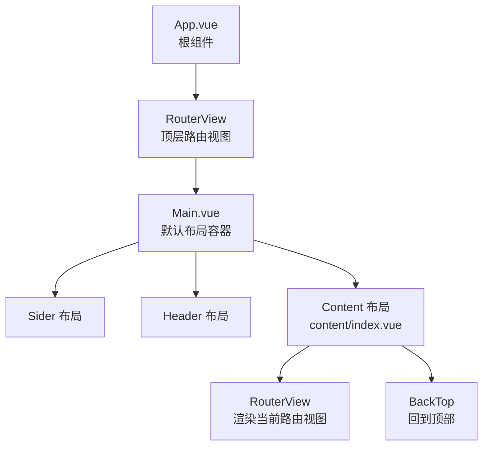
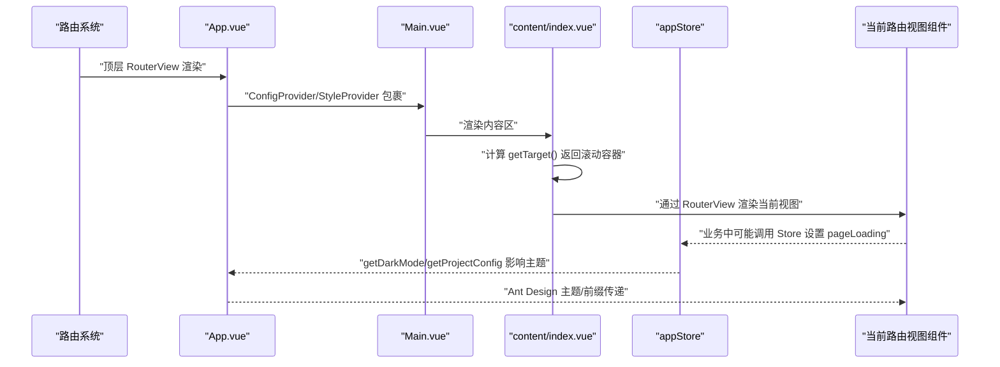
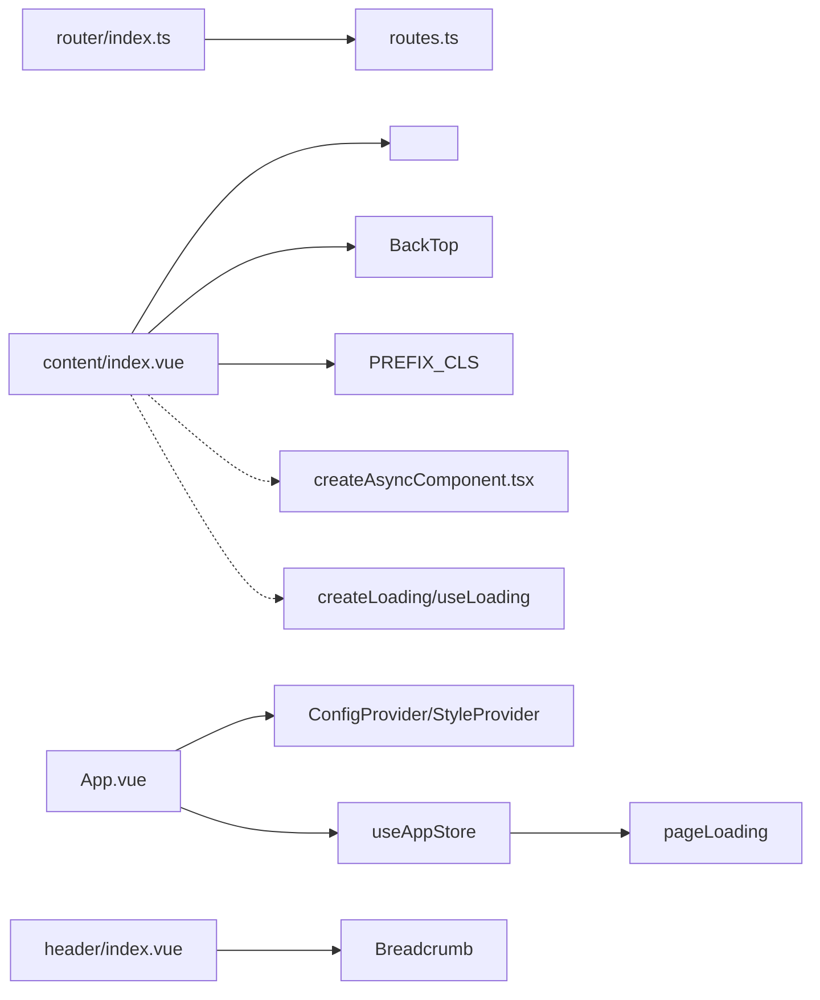

# 内容区布局

<cite>
**本文引用的文件**
- [src/layouts/content/index.vue](file://src/layouts/content/index.vue)
- [src/layouts/Main.vue](file://src/layouts/Main.vue)
- [src/App.vue](file://src/App.vue)
- [src/router/index.ts](file://src/router/index.ts)
- [src/router/routes.ts](file://src/router/routes.ts)
- [src/stores/modules/app.ts](file://src/stores/modules/app.ts)
- [src/config/project.ts](file://src/config/project.ts)
- [src/layouts/header/index.vue](file://src/layouts/header/index.vue)
- [src/utils/createAsyncComponent.tsx](file://src/utils/createAsyncComponent.tsx)
- [src/components/Loading/src/createLoading.ts](file://src/components/Loading/src/createLoading.ts)
- [src/components/Loading/src/useLoading.ts](file://src/components/Loading/src/useLoading.ts)
- [src/directives/loading.ts](file://src/directives/loading.ts)
- [types/config.d.ts](file://types/config.d.ts)
</cite>

## 目录
1. [简介](#简介)
2. [项目结构](#项目结构)
3. [核心组件](#核心组件)
4. [架构总览](#架构总览)
5. [详细组件分析](#详细组件分析)
6. [依赖关系分析](#依赖关系分析)
7. [性能考量](#性能考量)
8. [故障排查指南](#故障排查指南)
9. [结论](#结论)
10. [附录：扩展指南](#附录扩展指南)

## 简介
本文件聚焦于内容区布局组件 content/index.vue 的设计与实现，阐述其如何包裹 <router-view /> 渲染当前路由对应的视图组件，并说明其与路由系统、应用状态（appStore）、全局加载状态的集成方式。同时，文档覆盖内容区的滚动行为、内边距与类名约定、过渡动画、以及与全局 Loading 的协作关系，并提供扩展建议，包括自定义页头、嵌入面包屑、以及内容区懒加载策略。

## 项目结构
内容区位于布局层，作为主布局 Main.vue 的一个子区域，负责承载路由视图并提供滚动与缓存能力。整体结构如下：

图表来源
- [src/App.vue](file://src/App.vue#L1-L42)
- [src/layouts/Main.vue](file://src/layouts/Main.vue#L1-L44)
- [src/layouts/content/index.vue](file://src/layouts/content/index.vue#L1-L54)

章节来源
- [src/layouts/Main.vue](file://src/layouts/Main.vue#L1-L44)
- [src/App.vue](file://src/App.vue#L1-L42)

## 核心组件
- 内容区组件 content/index.vue：负责渲染当前路由视图、提供滚动容器、支持 KeepAlive 缓存开关、提供回到顶部能力。
- 应用状态 appStore：提供页面加载状态 pageLoading 的读取与设置，用于控制全局 Loading。
- 路由系统：提供路由注册、白名单、滚动行为等；内容区通过 <router-view> 渲染对应视图。
- 全局 Loading：通过 createLoading/useLoading/v-loading 指令提供加载态展示与挂载目标控制。

章节来源
- [src/layouts/content/index.vue](file://src/layouts/content/index.vue#L1-L54)
- [src/stores/modules/app.ts](file://src/stores/modules/app.ts#L1-L76)
- [src/router/index.ts](file://src/router/index.ts#L1-L39)
- [src/components/Loading/src/createLoading.ts](file://src/components/Loading/src/createLoading.ts#L1-L75)
- [src/components/Loading/src/useLoading.ts](file://src/components/Loading/src/useLoading.ts#L1-L31)
- [src/directives/loading.ts](file://src/directives/loading.ts#L1-L45)

## 架构总览
内容区与路由、状态、UI Provider 的交互关系如下：

图表来源
- [src/router/index.ts](file://src/router/index.ts#L1-L39)
- [src/App.vue](file://src/App.vue#L1-L42)
- [src/layouts/Main.vue](file://src/layouts/Main.vue#L1-L44)
- [src/layouts/content/index.vue](file://src/layouts/content/index.vue#L1-L54)
- [src/stores/modules/app.ts](file://src/stores/modules/app.ts#L1-L76)

## 详细组件分析

### 内容区组件 content/index.vue 设计要点
- 容器与滚动
  - 使用类名前缀与固定高度，容器具备滚动能力，便于在不同视图间平滑滚动。
  - 提供 getTarget() 方法返回滚动容器元素，供 BackTop 组件定位滚动目标。
- 视图渲染
  - 通过 <router-view> 的插槽形式接收 { Component, route }，根据路由 fullPath 作为 key，确保路由切换时组件正确重建。
  - 提供 KeepAlive 缓存开关与缓存列表占位，当前实现中缓存开关为关闭状态，缓存列表为空数组。
- 过渡动画
  - 模板注释中保留了 fade-slide 的过渡配置，但当前未启用；样式文件中提供了过渡动画类，可按需启用。
- 回到顶部
  - 引入 ant-design-vue 的 BackTop 组件，并通过 getTarget() 指定滚动容器，实现点击回到顶部。

章节来源
- [src/layouts/content/index.vue](file://src/layouts/content/index.vue#L1-L54)

### 与路由系统的集成
- 路由注册与白名单
  - 路由采用 createWebHashHistory，scrollBehavior 固定滚动至顶部，避免页面跳转后滚动位置影响。
  - 白名单用于重置路由时保留静态路由，移除动态添加的路由。
- 路由模块化
  - routes.ts 通过 import.meta.glob 动态导入模块化路由，形成 asyncRoutes/baseRoutes。
- 内容区渲染
  - Main.vue 中 Content 区域直接渲染 content/index.vue，后者内部再渲染 <router-view>，形成“内容区承载视图”的层级关系。

章节来源
- [src/router/index.ts](file://src/router/index.ts#L1-L39)
- [src/router/routes.ts](file://src/router/routes.ts#L1-L27)
- [src/layouts/Main.vue](file://src/layouts/Main.vue#L1-L44)

### 与 appStore 的状态同步
- 页面加载状态
  - appStore 提供 pageLoading 字段与 setPageLoading 动作，可用于控制全局 Loading 的显示。
  - 在内容区中，可通过业务组件在导航守卫或页面生命周期中调用 appStore.setPageLoading(...) 控制加载态。
- 主题与配置
  - App.vue 通过 useAppStore 计算主题配置（颜色、算法），并与 ConfigProvider/StyleProvider 一起向下传递，影响内容区及视图组件的视觉表现。

章节来源
- [src/stores/modules/app.ts](file://src/stores/modules/app.ts#L1-L76)
- [src/App.vue](file://src/App.vue#L1-L42)

### 滚动行为与容器约定
- 滚动容器
  - 内容区容器类名由项目前缀与组件名称组合，getTarget() 返回该容器元素，BackTop 以此为目标进行滚动。
- 路由滚动
  - 路由 scrollBehavior 固定滚动至顶部，避免跨页面滚动位置残留。
- 视图重建
  - 通过给 <component :is="Component" :key="route.fullPath"> 提供唯一 key，确保路径变化时视图重建，避免缓存导致的滚动位置错乱。

章节来源
- [src/layouts/content/index.vue](file://src/layouts/content/index.vue#L1-L54)
- [src/router/index.ts](file://src/router/index.ts#L1-L39)

### 全局加载状态集成
- Loading 组件体系
  - createLoading 提供动态创建 Loading 实例的能力，支持 open/close/setTip/setLoading/setOptions。
  - useLoading 是基于 createLoading 的 Hook，便于在组件中快速控制加载态。
  - v-loading 指令封装了 Loading 的挂载与更新逻辑，支持绝对定位、全屏模式、提示文案等。
- 与内容区的结合
  - 内容区本身未直接使用全局 Loading，但业务视图可在需要时通过上述 Loading 能力对内容区或特定区块进行加载态展示。
  - appStore 的 pageLoading 可用于控制全局 Loading 的显示，配合路由切换或业务请求流程。

章节来源
- [src/components/Loading/src/createLoading.ts](file://src/components/Loading/src/createLoading.ts#L1-L75)
- [src/components/Loading/src/useLoading.ts](file://src/components/Loading/src/useLoading.ts#L1-L31)
- [src/directives/loading.ts](file://src/directives/loading.ts#L1-L45)
- [src/stores/modules/app.ts](file://src/stores/modules/app.ts#L1-L76)

### 多标签页（Tab）与缓存策略
- 当前实现
  - 内容区的 KeepAlive 缓存开关为关闭，缓存列表为空，因此不参与多标签页缓存。
- 配置与类型
  - 类型定义中包含 MultiTabsSetting，描述多标签页的显示、缓存、拖拽、刷新等能力，为后续扩展预留接口。
- 扩展建议
  - 若需启用多标签页缓存，可在内容区开启 openCache 并实现 getCaches，将需要缓存的路由名称加入 include 列表。
  - 结合 appStore 的多标签页配置与路由元信息，实现标签页的增删与缓存策略。

章节来源
- [src/layouts/content/index.vue](file://src/layouts/content/index.vue#L1-L54)
- [types/config.d.ts](file://types/config.d.ts#L62-L102)

### 过渡动画与类名约定
- 过渡动画
  - 模板中保留了 fade-slide 的过渡注释，样式文件中提供了 enter/leave 的动画类，可按需启用。
- 类名约定
  - 通过 PREFIX_CLS 与组件名组合生成容器类名，保证命名空间一致性，避免样式冲突。

章节来源
- [src/layouts/content/index.vue](file://src/layouts/content/index.vue#L1-L54)
- [src/config/project.ts](file://src/config/project.ts#L1-L39)

### 与头部与面包屑的关系
- 头部组件包含面包屑组件，内容区与头部通过布局容器分层，内容区专注于视图渲染与滚动。
- 若需在内容区内嵌入面包屑，可参考头部中的 Breadcrumb 组件引入方式，在内容区模板中引入并渲染。

章节来源
- [src/layouts/header/index.vue](file://src/layouts/header/index.vue#L1-L42)

### 懒加载策略
- 异步组件加载器
  - createAsyncComponent 提供异步组件加载器，支持延迟、loading 组件、错误重试等能力，适合在内容区按需加载大型视图。
- 内容区内的懒加载
  - 可在视图组件中使用 createAsyncComponent 对复杂区块进行懒加载，减少首屏体积。
- 全局懒加载
  - 路由层面也可结合异步组件实现页面级懒加载，降低初始包体。

章节来源
- [src/utils/createAsyncComponent.tsx](file://src/utils/createAsyncComponent.tsx#L1-L63)

## 依赖关系分析

图表来源
- [src/layouts/content/index.vue](file://src/layouts/content/index.vue#L1-L54)
- [src/router/index.ts](file://src/router/index.ts#L1-L39)
- [src/router/routes.ts](file://src/router/routes.ts#L1-L27)
- [src/App.vue](file://src/App.vue#L1-L42)
- [src/stores/modules/app.ts](file://src/stores/modules/app.ts#L1-L76)
- [src/layouts/header/index.vue](file://src/layouts/header/index.vue#L1-L42)
- [src/utils/createAsyncComponent.tsx](file://src/utils/createAsyncComponent.tsx#L1-L63)
- [src/components/Loading/src/createLoading.ts](file://src/components/Loading/src/createLoading.ts#L1-L75)
- [src/components/Loading/src/useLoading.ts](file://src/components/Loading/src/useLoading.ts#L1-L31)

## 性能考量
- KeepAlive 缓存
  - 当前内容区未启用缓存，避免不必要的内存占用；若启用，需谨慎选择缓存范围，防止状态污染与内存泄漏。
- 滚动与重建
  - 通过路由 fullPath 作为 key，确保视图重建，避免缓存导致的滚动位置错乱。
- 异步加载
  - 使用 createAsyncComponent 对大组件进行懒加载，减少首屏资源压力。
- 全局 Loading
  - 合理使用 appStore.pageLoading 与 Loading 组件，避免过度显示导致用户体验下降。

## 故障排查指南
- 回到顶部无效
  - 检查 getTarget() 返回的容器元素是否存在且可滚动。
- 视图不更新或状态残留
  - 确认 <component :is="Component" :key="route.fullPath"> 的 key 是否随路由变化而变化。
- 缓存导致滚动位置错乱
  - 若启用 KeepAlive，请确保仅缓存必要的视图，并在离开时清理状态。
- 全局 Loading 不显示
  - 检查业务中是否正确调用 appStore.setPageLoading(...)，并确认 App.vue 中的主题/Provider 配置未被覆盖。

章节来源
- [src/layouts/content/index.vue](file://src/layouts/content/index.vue#L1-L54)
- [src/stores/modules/app.ts](file://src/stores/modules/app.ts#L1-L76)
- [src/App.vue](file://src/App.vue#L1-L42)

## 结论
content/index.vue 作为内容承载区，承担了路由视图渲染、滚动容器、回到顶部与过渡动画的基础职责。当前实现简洁明确，未启用 KeepAlive 缓存，有利于降低复杂度与内存占用。与路由系统、应用状态、UI Provider 协同良好，为后续扩展多标签页、全局 Loading、懒加载等能力提供了清晰的接入点。

## 附录：扩展指南
- 添加自定义页头
  - 在内容区模板中引入自定义页头组件，或在视图组件内自行渲染，注意与头部导航的间距与层级关系。
- 嵌入面包屑
  - 可参考头部的 Breadcrumb 组件引入方式，在内容区渲染面包屑，提升导航体验。
- 实现内容区懒加载策略
  - 使用 createAsyncComponent 对大型视图进行懒加载，结合路由异步组件实现页面级懒加载。
- 启用多标签页与缓存
  - 在内容区开启 openCache 并实现 getCaches，将需要缓存的路由名称加入 include 列表；结合 appStore 的多标签页配置完善标签页管理。
- 全局 Loading 集成
  - 在业务中通过 appStore.setPageLoading(...) 控制全局 Loading，或在视图中使用 createLoading/useLoading 对局部区块进行加载态展示。

章节来源
- [src/utils/createAsyncComponent.tsx](file://src/utils/createAsyncComponent.tsx#L1-L63)
- [src/components/Loading/src/createLoading.ts](file://src/components/Loading/src/createLoading.ts#L1-L75)
- [src/components/Loading/src/useLoading.ts](file://src/components/Loading/src/useLoading.ts#L1-L31)
- [src/stores/modules/app.ts](file://src/stores/modules/app.ts#L1-L76)
- [types/config.d.ts](file://types/config.d.ts#L62-L102)