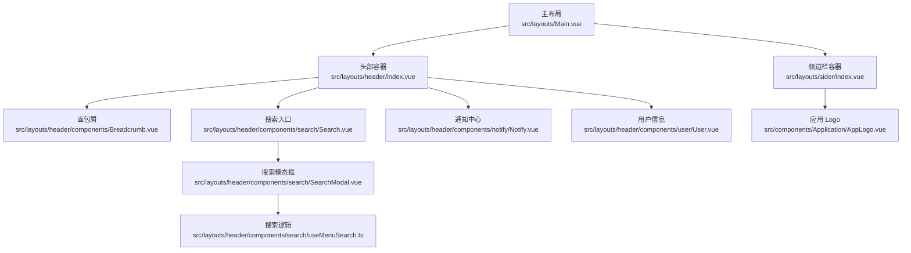
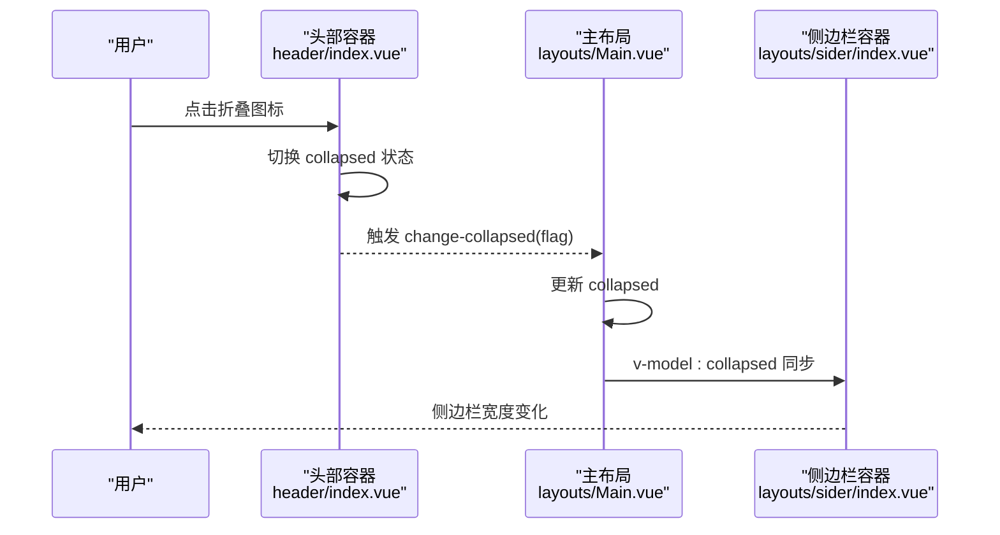
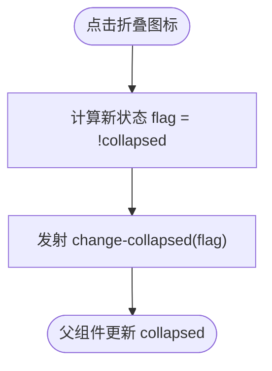
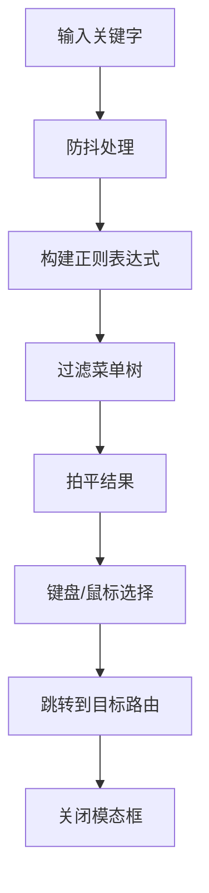
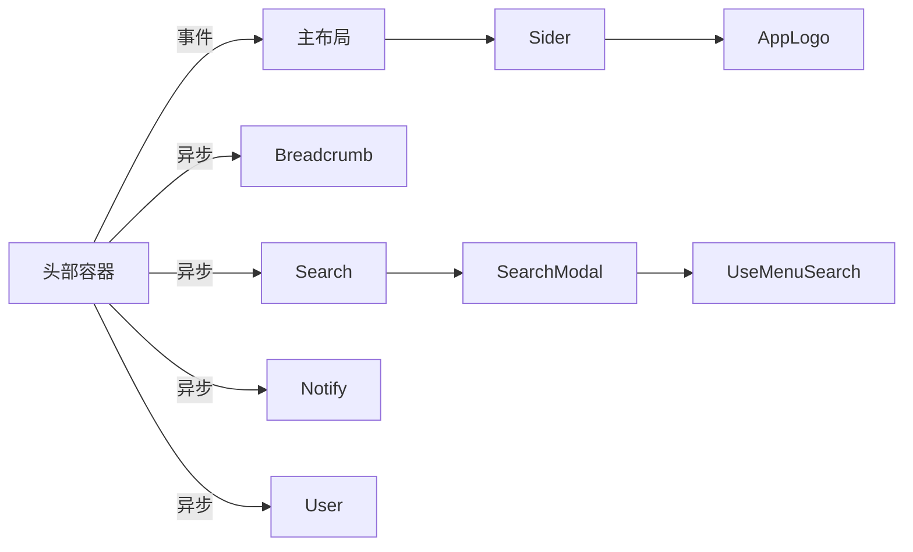

# 头部布局

<cite>
**本文引用的文件列表**
- [src/layouts/header/index.vue](file://src/layouts/header/index.vue)
- [src/layouts/header/components/Breadcrumb.vue](file://src/layouts/header/components/Breadcrumb.vue)
- [src/layouts/header/components/notify/Notify.vue](file://src/layouts/header/components/notify/Notify.vue)
- [src/layouts/header/components/search/Search.vue](file://src/layouts/header/components/search/Search.vue)
- [src/layouts/header/components/search/SearchModal.vue](file://src/layouts/header/components/search/SearchModal.vue)
- [src/layouts/header/components/search/useMenuSearch.ts](file://src/layouts/header/components/search/useMenuSearch.ts)
- [src/layouts/header/components/user/User.vue](file://src/layouts/header/components/user/User.vue)
- [src/layouts/Main.vue](file://src/layouts/Main.vue)
- [src/layouts/sider/index.vue](file://src/layouts/sider/index.vue)
- [src/components/Application/AppLogo.vue](file://src/components/Application/AppLogo.vue)
- [src/config/project.ts](file://src/config/project.ts)
- [src/assets/less/tailwind.less](file://src/assets/less/tailwind.less)
- [postcss.config.js](file://postcss.config.js)
- [.browserslistrc](file://.browserslistrc)
</cite>

## 目录
1. [简介](#简介)
2. [项目结构](#项目结构)
3. [核心组件](#核心组件)
4. [架构总览](#架构总览)
5. [详细组件分析](#详细组件分析)
6. [依赖关系分析](#依赖关系分析)
7. [性能考量](#性能考量)
8. [故障排查指南](#故障排查指南)
9. [结论](#结论)
10. [附录](#附录)

## 简介
本文件聚焦于页面顶部导航区域的头部布局组件，系统性解析其结构、职责与交互流程。重点覆盖：
- 与主布局的协作：通过“折叠侧边栏”事件实现双向通信
- 子组件集成：面包屑、通知中心、搜索框、用户信息
- 响应式设计策略：在小屏幕下的适配行为
- 定制化方案：隐藏模块、替换品牌 Logo、新增操作按钮

## 项目结构
头部布局位于布局层的顶部区域，采用分层组织：头部容器负责布局与事件转发；子组件按功能拆分，使用异步加载提升首屏性能；主布局通过 v-model 绑定侧边栏折叠状态，形成清晰的父子通信链路。

图表来源
- [src/layouts/Main.vue](file://src/layouts/Main.vue#L1-L44)
- [src/layouts/header/index.vue](file://src/layouts/header/index.vue#L1-L42)
- [src/layouts/header/components/Breadcrumb.vue](file://src/layouts/header/components/Breadcrumb.vue#L1-L33)
- [src/layouts/header/components/search/Search.vue](file://src/layouts/header/components/search/Search.vue#L1-L22)
- [src/layouts/header/components/search/SearchModal.vue](file://src/layouts/header/components/search/SearchModal.vue#L1-L165)
- [src/layouts/header/components/search/useMenuSearch.ts](file://src/layouts/header/components/search/useMenuSearch.ts#L1-L240)
- [src/layouts/sider/index.vue](file://src/layouts/sider/index.vue#L1-L18)
- [src/components/Application/AppLogo.vue](file://src/components/Application/AppLogo.vue#L1-L64)

章节来源
- [src/layouts/Main.vue](file://src/layouts/Main.vue#L1-L44)
- [src/layouts/header/index.vue](file://src/layouts/header/index.vue#L1-L42)

## 核心组件
- 头部容器：负责布局排版、图标点击触发侧边栏折叠事件、异步加载子组件
- 面包屑：基于路由生成层级导航，支持最后一级纯文本展示
- 通知中心：气泡提示与下拉内容占位，便于扩展消息中心
- 搜索框：点击触发搜索模态框，内置键盘快捷键与结果高亮
- 用户信息：下拉菜单承载常用操作，预留退出登录等动作

章节来源
- [src/layouts/header/index.vue](file://src/layouts/header/index.vue#L1-L42)
- [src/layouts/header/components/Breadcrumb.vue](file://src/layouts/header/components/Breadcrumb.vue#L1-L33)
- [src/layouts/header/components/notify/Notify.vue](file://src/layouts/header/components/notify/Notify.vue#L1-L19)
- [src/layouts/header/components/search/Search.vue](file://src/layouts/header/components/search/Search.vue#L1-L22)
- [src/layouts/header/components/user/User.vue](file://src/layouts/header/components/user/User.vue#L1-L33)

## 架构总览
头部与主布局之间通过事件实现解耦：头部发出“折叠状态变更”事件，主布局接收并同步到侧边栏的 v-model，从而实现对侧边栏折叠状态的控制。

图表来源
- [src/layouts/header/index.vue](file://src/layouts/header/index.vue#L30-L41)
- [src/layouts/Main.vue](file://src/layouts/Main.vue#L1-L44)
- [src/layouts/sider/index.vue](file://src/layouts/sider/index.vue#L1-L18)

## 详细组件分析

### 头部容器（header/index.vue）
- 结构职责
  - 左侧：折叠图标与面包屑区域
  - 右侧：搜索、通知、用户信息三列布局
- 交互机制
  - 图标点击切换 collapsed，并向父组件广播 change-collapsed 事件
  - 使用异步组件加载子组件，降低首屏渲染压力
- 事件通信
  - 接收父组件传入的 collapsed 状态
  - 发射 change-collapsed(flag) 供父组件更新

图表来源
- [src/layouts/header/index.vue](file://src/layouts/header/index.vue#L30-L41)

章节来源
- [src/layouts/header/index.vue](file://src/layouts/header/index.vue#L1-L42)

### 面包屑（Breadcrumb.vue）
- 功能要点
  - 基于路由动态生成层级导航
  - 最后一级显示为纯文本，其余项渲染为可点击链接
  - 使用统一前缀类名，便于主题化与样式隔离
- 数据结构
  - routes 为只读计算属性，当前返回空数组，实际业务可通过路由元信息填充

章节来源
- [src/layouts/header/components/Breadcrumb.vue](file://src/layouts/header/components/Breadcrumb.vue#L1-L33)
- [src/config/project.ts](file://src/config/project.ts#L1-L39)

### 通知中心（Notify.vue）
- 功能要点
  - 气泡触发器，点击展开下拉内容
  - 使用统一前缀类名，便于主题化与样式隔离
- 扩展建议
  - 下拉内容可替换为消息列表、未读计数、设置入口等

章节来源
- [src/layouts/header/components/notify/Notify.vue](file://src/layouts/header/components/notify/Notify.vue#L1-L19)
- [src/config/project.ts](file://src/config/project.ts#L1-L39)

### 搜索框（Search.vue）
- 功能要点
  - 点击触发搜索模态框显示
  - 内置可见性状态 visible，用于控制模态框开关
  - 使用统一前缀类名，便于主题化与样式隔离
- 交互细节
  - 点击外部区域可关闭模态框
  - 支持键盘事件：Enter 确认、上下箭头切换、Esc 关闭

章节来源
- [src/layouts/header/components/search/Search.vue](file://src/layouts/header/components/search/Search.vue#L1-L22)
- [src/layouts/header/components/search/SearchModal.vue](file://src/layouts/header/components/search/SearchModal.vue#L1-L165)
- [src/layouts/header/components/search/useMenuSearch.ts](file://src/layouts/header/components/search/useMenuSearch.ts#L1-L240)
- [src/config/project.ts](file://src/config/project.ts#L1-L39)

### 用户信息（User.vue）
- 功能要点
  - 下拉菜单承载常用操作项
  - 提供帮助文档、修改密码、退出登录等入口
- 扩展建议
  - 可接入权限控制，根据角色显示不同菜单项
  - 可增加头像、昵称、在线状态等信息

章节来源
- [src/layouts/header/components/user/User.vue](file://src/layouts/header/components/user/User.vue#L1-L33)

### 搜索逻辑（useMenuSearch.ts）
- 核心能力
  - 菜单树拍平与过滤，支持模糊匹配与正则规则
  - 键盘导航：上下箭头切换、Enter 跳转、Esc 关闭
  - 自动滚动至可视区域，优化长列表体验
- 性能优化
  - 输入防抖，减少高频输入带来的计算压力
  - 仅在挂载时构建菜单树，避免重复计算

图表来源
- [src/layouts/header/components/search/useMenuSearch.ts](file://src/layouts/header/components/search/useMenuSearch.ts#L1-L240)

章节来源
- [src/layouts/header/components/search/useMenuSearch.ts](file://src/layouts/header/components/search/useMenuSearch.ts#L1-L240)

### 侧边栏与 Logo（sider/index.vue、AppLogo.vue）
- 侧边栏容器
  - 接收 collapsed 并传递给子组件
  - 作为 Logo 与菜单的承载容器
- 应用 Logo
  - 支持主题切换、点击回到首页
  - 在收缩状态下可控制标题显隐

章节来源
- [src/layouts/sider/index.vue](file://src/layouts/sider/index.vue#L1-L18)
- [src/components/Application/AppLogo.vue](file://src/components/Application/AppLogo.vue#L1-L64)

## 依赖关系分析
- 组件耦合
  - 头部容器与主布局通过事件耦合，保持低耦合高内聚
  - 子组件均通过异步加载，避免阻塞首屏
- 外部依赖
  - Ant Design Vue 组件库提供图标、弹窗、下拉、菜单等基础 UI
  - VueUse 提供键盘事件与滚动监听等工具函数
- 样式体系
  - Tailwind CSS 与 Less 混合使用，统一前缀类名确保样式隔离
  - 浏览器兼容性配置与 PostCSS 插件保证跨浏览器一致性

图表来源
- [src/layouts/header/index.vue](file://src/layouts/header/index.vue#L1-L42)
- [src/layouts/Main.vue](file://src/layouts/Main.vue#L1-L44)
- [src/layouts/header/components/search/SearchModal.vue](file://src/layouts/header/components/search/SearchModal.vue#L1-L165)
- [src/layouts/header/components/search/useMenuSearch.ts](file://src/layouts/header/components/search/useMenuSearch.ts#L1-L240)
- [src/layouts/sider/index.vue](file://src/layouts/sider/index.vue#L1-L18)
- [src/components/Application/AppLogo.vue](file://src/components/Application/AppLogo.vue#L1-L64)

章节来源
- [src/layouts/header/index.vue](file://src/layouts/header/index.vue#L1-L42)
- [src/layouts/Main.vue](file://src/layouts/Main.vue#L1-L44)
- [src/assets/less/tailwind.less](file://src/assets/less/tailwind.less#L1-L5)
- [postcss.config.js](file://postcss.config.js#L1-L13)
- [.browserslistrc](file://.browserslistrc#L1-L4)

## 性能考量
- 异步组件加载
  - 头部子组件通过异步导入，减少首屏资源体积，提升加载速度
- 输入防抖
  - 搜索逻辑对输入事件进行防抖，降低频繁计算带来的性能损耗
- 滚动优化
  - 选中项超出可视区域时自动滚动，避免长列表滚动卡顿
- 样式隔离
  - 统一前缀类名与 Less 样式，避免全局样式冲突，减少重绘重排

章节来源
- [src/layouts/header/index.vue](file://src/layouts/header/index.vue#L20-L30)
- [src/layouts/header/components/search/useMenuSearch.ts](file://src/layouts/header/components/search/useMenuSearch.ts#L78-L95)
- [src/layouts/header/components/search/SearchModal.vue](file://src/layouts/header/components/search/SearchModal.vue#L108-L128)

## 故障排查指南
- 折叠事件无效
  - 确认父组件已监听 change-collapsed 并更新 collapsed
  - 检查 v-model:collapsed 是否正确绑定到侧边栏
- 搜索无结果
  - 确认菜单树已构建完成（onBeforeMount 中初始化）
  - 检查关键字正则是否正确生成
- 键盘事件不生效
  - 确认模态框可见且事件绑定在正确容器上
  - 检查浏览器兼容性与键盘事件目标元素
- 样式异常
  - 检查 Tailwind 与 Less 的编译顺序
  - 确认前缀类名一致，避免样式覆盖

章节来源
- [src/layouts/Main.vue](file://src/layouts/Main.vue#L1-L44)
- [src/layouts/header/components/search/useMenuSearch.ts](file://src/layouts/header/components/search/useMenuSearch.ts#L90-L107)
- [src/layouts/header/components/search/SearchModal.vue](file://src/layouts/header/components/search/SearchModal.vue#L112-L127)
- [src/assets/less/tailwind.less](file://src/assets/less/tailwind.less#L1-L5)
- [.browserslistrc](file://.browserslistrc#L1-L4)

## 结论
头部布局通过清晰的职责划分与事件驱动的通信方式，实现了与主布局的松耦合协作。子组件采用异步加载与工具函数增强用户体验，整体具备良好的可扩展性与可维护性。响应式方面依托 Tailwind 与 Less 的混合体系，结合浏览器兼容性配置，能够满足多端适配需求。

## 附录

### 响应式设计策略
- 移动优先
  - 使用 Tailwind 实用类进行断点控制，配合 Less 样式微调
  - 在小屏幕下优先保证导航区域的可点击区域与可读性
- 交互优化
  - 搜索模态框在移动端采用全屏遮罩与大号输入框，提升可用性
  - 键盘快捷键在移动端通过虚拟键盘与手势结合优化操作
- 兼容性
  - 浏览器列表配置确保主流现代浏览器的稳定运行
  - PostCSS 插件链路保障样式在不同环境下的一致表现

章节来源
- [src/assets/less/tailwind.less](file://src/assets/less/tailwind.less#L1-L5)
- [postcss.config.js](file://postcss.config.js#L1-L13)
- [.browserslistrc](file://.browserslistrc#L1-L4)

### 定制化方案
- 隐藏特定模块
  - 在头部容器中移除对应子组件的渲染节点，或通过条件渲染控制显示
  - 对应路径参考：[src/layouts/header/index.vue](file://src/layouts/header/index.vue#L1-L42)
- 替换品牌 Logo
  - 修改 AppLogo 组件的图片与标题来源，或通过应用配置注入站点信息
  - 对应路径参考：[src/components/Application/AppLogo.vue](file://src/components/Application/AppLogo.vue#L1-L64)
- 添加新的操作按钮
  - 在头部右侧区域插入新的按钮组件，并通过事件与业务逻辑对接
  - 对应路径参考：[src/layouts/header/index.vue](file://src/layouts/header/index.vue#L1-L42)