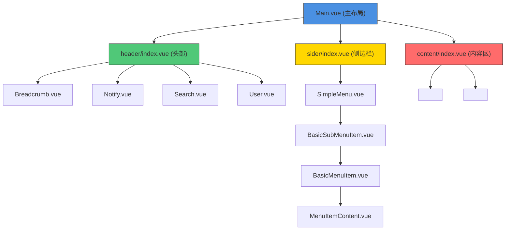
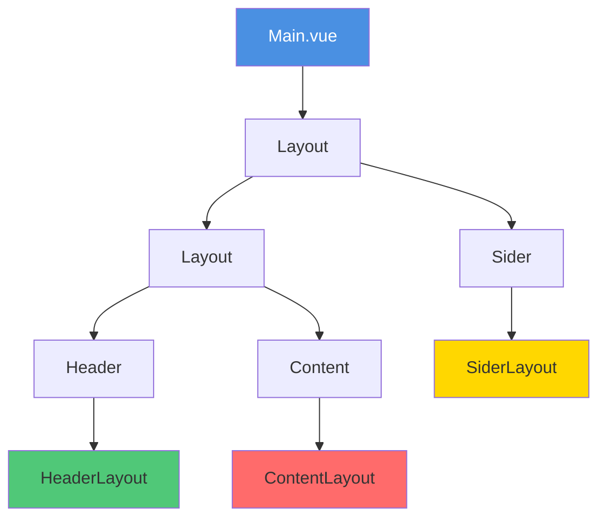
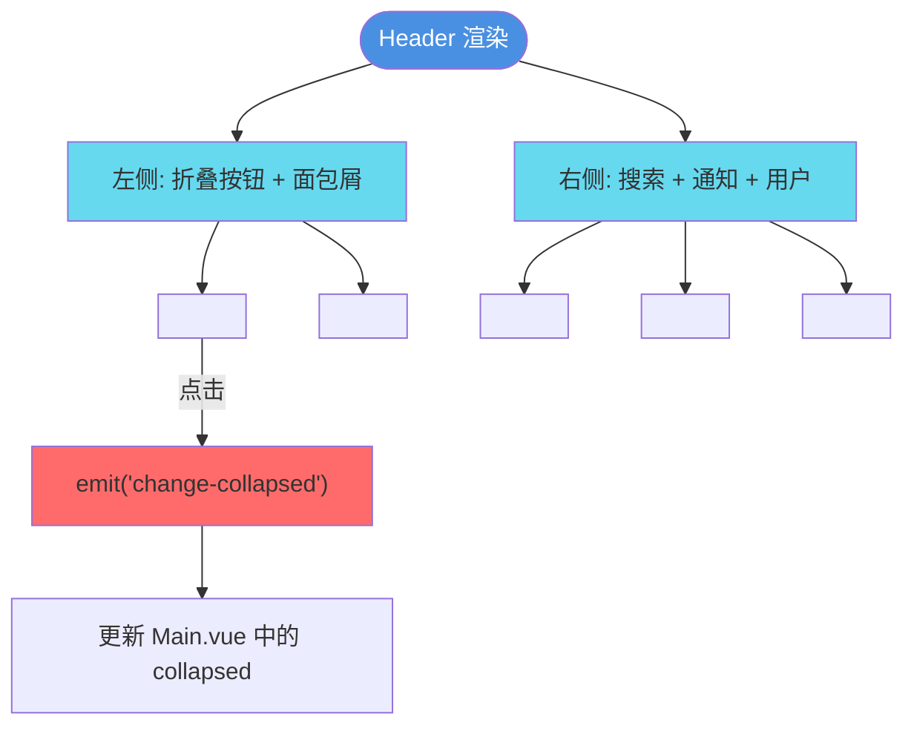
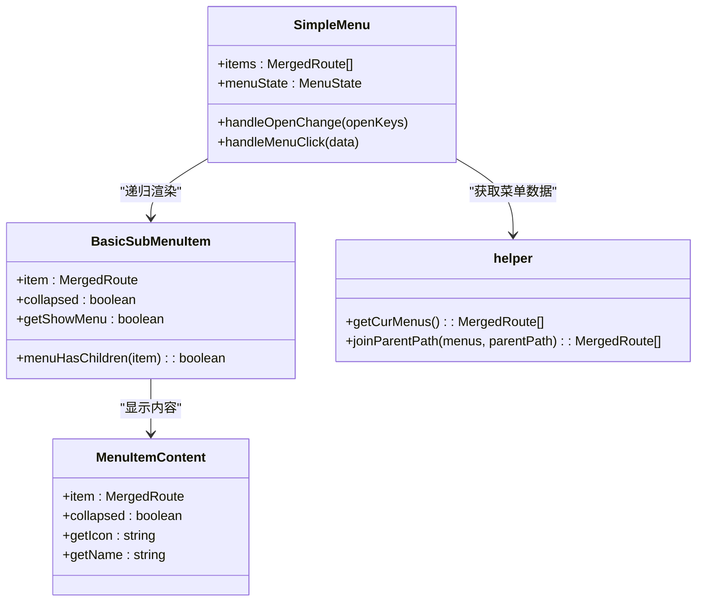
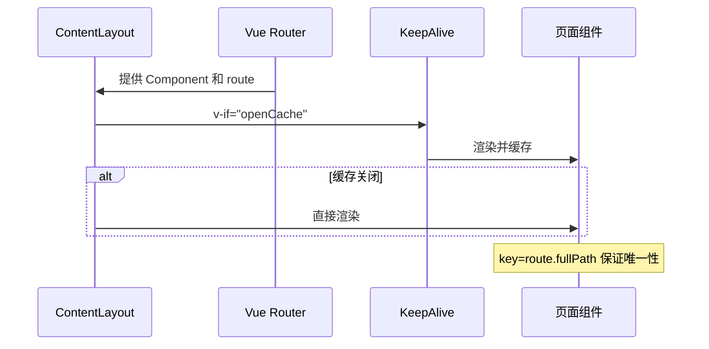

# 布局系统

<cite>
**本文档引用文件**  
- [Main.vue](file://src/layouts/Main.vue)
- [header/index.vue](file://src/layouts/header/index.vue)
- [sider/index.vue](file://src/layouts/sider/index.vue)
- [content/index.vue](file://src/layouts/content/index.vue)
- [sider/components/SimpleMenu.vue](file://src/layouts/sider/components/SimpleMenu.vue)
- [sider/helper.ts](file://src/layouts/sider/helper.ts)
- [header/components/Breadcrumb.vue](file://src/layouts/header/components/Breadcrumb.vue)
- [header/components/notify/Notify.vue](file://src/layouts/header/components/notify/Notify.vue)
- [header/components/search/Search.vue](file://src/layouts/header/components/search/Search.vue)
- [header/components/user/User.vue](file://src/layouts/header/components/user/User.vue)
- [sider/components/BasicSubMenuItem.vue](file://src/layouts/sider/components/BasicSubMenuItem.vue)
- [sider/components/MenuItemContent.vue](file://src/layouts/sider/components/MenuItemContent.vue)
- [stores/modules/app.ts](file://src/stores/modules/app.ts)
- [router/menuHelper.ts](file://src/router/menuHelper.ts)
</cite>

## 目录
1. [简介](#简介)
2. [项目结构](#项目结构)
3. [核心布局组件](#核心布局组件)
4. [整体架构概述](#整体架构概述)
5. [详细组件分析](#详细组件分析)
6. [依赖关系分析](#依赖关系分析)
7. [性能与缓存机制](#性能与缓存机制)
8. [定制化配置方法](#定制化配置方法)
9. [结论](#结论)

## 简介
本文档详细描述了基于 `Main.vue` 入口的中后台页面布局系统。该系统采用标准的三栏式结构，由 `header`（头部）、`sider`（侧边栏）和 `content`（内容区）三大核心组件构成，结合 Ant Design Vue 的 Layout 组件实现响应式布局，并通过 Pinia 状态管理、Vue Router 路由系统和递归菜单渲染机制，构建出功能完整、可扩展性强的前端架构。

## 项目结构
本项目采用模块化设计，布局相关代码集中于 `src/layouts/` 目录下，各子目录职责清晰：

- `layouts/Main.vue`：主入口组件，组合 header、sider 和 content
- `layouts/header/`：包含头部功能组件（面包屑、搜索、通知、用户信息）
- `layouts/sider/`：侧边栏逻辑与菜单渲染组件
- `layouts/content/`：页面内容承载区域，支持路由视图与缓存
- `stores/modules/app.ts`：应用级状态管理，控制布局行为
- `router/menuHelper.ts`：路由与菜单转换工具



**图示来源**  
- [Main.vue](file://src/layouts/Main.vue)
- [header/index.vue](file://src/layouts/header/index.vue)
- [sider/index.vue](file://src/layouts/sider/index.vue)
- [content/index.vue](file://src/layouts/content/index.vue)

**本节来源**  
- [Main.vue](file://src/layouts/Main.vue)
- [src/layouts/](file://src/layouts/)

## 核心布局组件
系统以 `Main.vue` 为根组件，通过 Ant Design Vue 的 `Layout` 组件构建基础结构。`Sider` 用于展示导航菜单，`Header` 承载操作与状态信息，`Content` 区域则动态加载页面内容。三者通过响应式数据 `collapsed` 实现联动折叠，确保用户体验一致性。

**本节来源**  
- [Main.vue](file://src/layouts/Main.vue#L2-L27)

## 整体架构概述
整个布局系统遵循“单一入口、组件化组合”的设计原则。`Main.vue` 作为容器，注入三个核心子布局组件，并通过 `ref` 管理侧边栏的展开/收起状态。样式通过 `PREFIX_CLS` 变量实现命名空间隔离，避免全局污染。



**图示来源**  
- [Main.vue](file://src/layouts/Main.vue#L2-L9)

**本节来源**  
- [Main.vue](file://src/layouts/Main.vue#L1-L44)

## 详细组件分析

### 头部组件分析
`HeaderLayout` 组件采用左右分栏布局，左侧包含折叠按钮与面包屑导航，右侧集成搜索、通知和用户信息下拉菜单。通过异步加载（`createAsyncComponent`）提升首屏性能，仅在用户交互时加载非关键组件。

#### 功能区域说明
- **折叠按钮**：点击切换侧边栏展开状态，通过 `@change-collapsed` 事件同步至父组件
- **面包屑导航**：展示当前页面路径，支持点击跳转
- **搜索框**：触发全局页面检索模态框
- **通知中心**：气泡弹出式消息提醒
- **用户信息**：下拉菜单提供帮助文档、修改密码、退出登录等功能



**图示来源**  
- [header/index.vue](file://src/layouts/header/index.vue#L2-L14)
- [header/components/Breadcrumb.vue](file://src/layouts/header/components/Breadcrumb.vue)
- [header/components/search/Search.vue](file://src/layouts/header/components/search/Search.vue)
- [header/components/notify/Notify.vue](file://src/layouts/header/components/notify/Notify.vue)
- [header/components/user/User.vue](file://src/layouts/header/components/user/User.vue)

**本节来源**  
- [header/index.vue](file://src/layouts/header/index.vue#L1-L42)

### 侧边栏组件分析
`sider` 组件由 `AppLogo` 和 `SimpleMenu` 构成，核心功能是递归渲染菜单项并管理展开状态。

#### 菜单渲染逻辑
- `SimpleMenu.vue` 使用 `getCurMenus()` 从 Pinia store 获取当前权限下的菜单列表
- 通过 `joinParentPath()` 工具函数补全嵌套路由路径
- 使用 `BasicSubMenuItem` 进行递归渲染：若菜单有子项且未隐藏，则渲染为 `SubMenu`；否则渲染为 `MenuItem`
- 图标与标题通过 `MenuItemContent` 组件统一处理，根据 `collapsed` 状态决定是否显示文字

#### 折叠状态管理
- `collapsed` 状态由 `Main.vue` 通过 `props` 传递
- 菜单项点击时调用 `go(data.key)` 实现路由跳转
- 当前路径自动高亮，父级菜单默认展开一级



**图示来源**  
- [sider/index.vue](file://src/layouts/sider/index.vue#L1-L18)
- [sider/components/SimpleMenu.vue](file://src/layouts/sider/components/SimpleMenu.vue#L1-L63)
- [sider/components/BasicSubMenuItem.vue](file://src/layouts/sider/components/BasicSubMenuItem.vue#L1-L38)
- [sider/components/MenuItemContent.vue](file://src/layouts/sider/components/MenuItemContent.vue#L1-L32)
- [sider/helper.ts](file://src/layouts/sider/helper.ts#L1-L35)

**本节来源**  
- [sider/index.vue](file://src/layouts/sider/index.vue#L1-L18)
- [sider/components/SimpleMenu.vue](file://src/layouts/sider/components/SimpleMenu.vue#L1-L63)

### 内容区域分析
`ContentLayout` 组件负责承载动态页面内容，其核心特性包括：

- 使用 `<RouterView>` 结合 `v-slot` 捕获当前路由组件
- 支持 `KeepAlive` 缓存机制，通过 `openCache` 控制是否启用
- `getCaches` 计算属性预留缓存白名单逻辑
- 自动滚动回顶功能（`BackTop`），目标为内容容器
- 过渡动画（注释中保留 `fade-slide`）可按需启用



**图示来源**  
- [content/index.vue](file://src/layouts/content/index.vue#L1-L36)

**本节来源**  
- [content/index.vue](file://src/layouts/content/index.vue#L1-L54)

## 依赖关系分析
布局系统各组件间存在明确的依赖关系，主要通过 `props` 传递状态，`emits` 触发事件，结合 Pinia 进行跨组件状态共享。

```mermaid
graph TD
Main --> |collapsed| Sider
Main --> |collapsed| Header
Header --> |change-collapsed| Main
Sider --> |collapsed| SimpleMenu
SimpleMenu --> |collapsed| BasicSubMenuItem
BasicSubMenuItem --> |collapsed| MenuItemContent
SimpleMenu --> helper : "获取菜单"
Content --> Router : "路由视图"
Content --> Store : "缓存配置"
style Main fill:#4A90E2
style Sider fill:#FFD700
style Header fill:#50C878
style Content fill:#FF6B6B
```

**图示来源**  
- [Main.vue](file://src/layouts/Main.vue)
- [header/index.vue](file://src/layouts/header/index.vue)
- [sider/index.vue](file://src/layouts/sider/index.vue)
- [content/index.vue](file://src/layouts/content/index.vue)

**本节来源**  
- [Main.vue](file://src/layouts/Main.vue)
- [header/index.vue](file://src/layouts/header/index.vue)
- [sider/index.vue](file://src/layouts/sider/index.vue)
- [content/index.vue](file://src/layouts/content/index.vue)

## 性能与缓存机制
系统在性能优化方面采取以下措施：
- **异步组件加载**：通知、搜索、用户面板等非首屏关键组件采用 `createAsyncComponent` 延迟加载
- **菜单路径预处理**：`joinParentPath` 在渲染前统一处理嵌套路由，避免运行时计算
- **页面缓存支持**：`ContentLayout` 预留 `KeepAlive` 缓存机制，可通过配置开启
- **状态持久化**：通过 `setCache` 将主题、项目配置等存储至本地，减少重复计算

**本节来源**  
- [header/index.vue](file://src/layouts/header/index.vue#L24-L26)
- [content/index.vue](file://src/layouts/content/index.vue#L7-L10)
- [stores/modules/app.ts](file://src/stores/modules/app.ts#L56-L72)

## 定制化配置方法
开发者可通过以下方式对布局进行定制：

- **修改头部样式**：在 `Main.vue` 的 `<style>` 中覆盖 `.ant-layout-header` 样式，或通过 `PREFIX_CLS` 变量定位
- **调整侧边栏宽度**：修改 `Sider` 组件的 `width` 和 `collapsed-width` 属性
- **控制菜单行为**：通过路由元信息 `meta.hideMenu`、`meta.hideChildrenInMenu` 控制显示逻辑
- **主题配置**：使用 `useAppStore` 修改 `projectConfig` 实现全局主题、过渡动画等设置
- **扩展功能区**：在 `Header` 右侧区域插入自定义组件

**本节来源**  
- [Main.vue](file://src/layouts/Main.vue#L3-L3)
- [app.ts](file://src/stores/modules/app.ts#L69-L72)
- [project.ts](file://src/config/project.ts)

## 结论
该布局系统结构清晰、组件职责分明，基于 Ant Design Vue 构建了标准的中后台管理界面。通过 `Main.vue` 统一调度 `header`、`sider` 和 `content` 三大模块，结合递归菜单渲染、异步加载、状态管理等技术手段，在保证功能完整性的同时兼顾性能与可维护性。系统预留了丰富的扩展点，便于根据实际业务需求进行二次开发与定制。