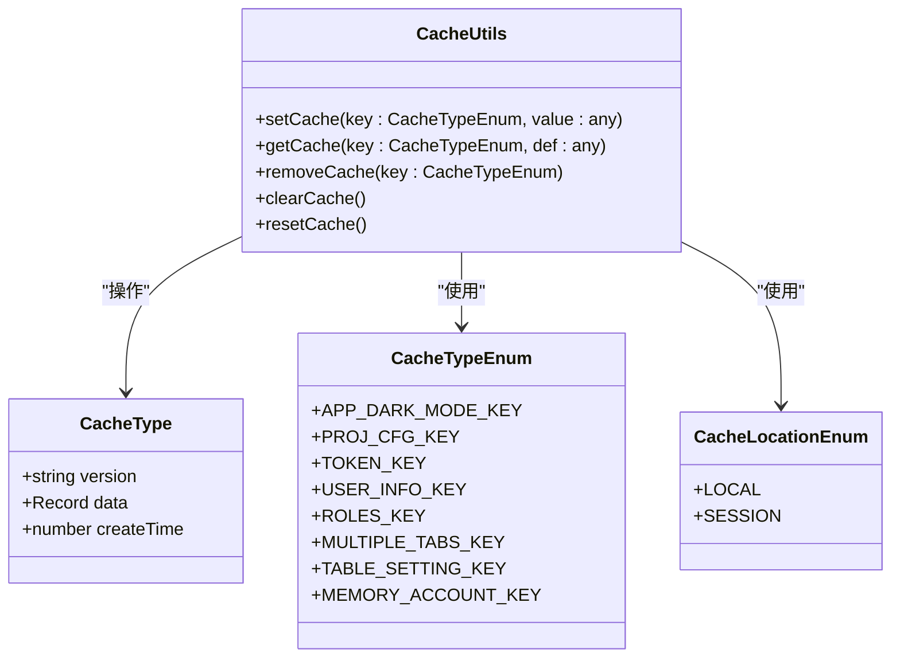
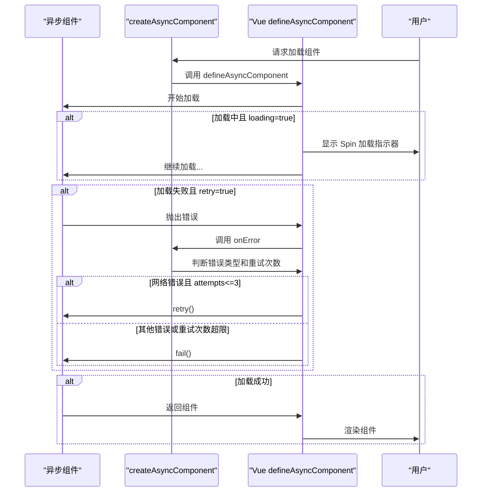

# 工具函数

<cite>
**本文档引用文件**   
- [cache.ts](file://src/utils/cache.ts)
- [treeHelper.ts](file://src/utils/treeHelper.ts)
- [createAsyncComponent.tsx](file://src/utils/createAsyncComponent.tsx)
- [cacheEnum.ts](file://src/enums/cacheEnum.ts)
- [project.ts](file://src/config/project.ts)
- [menuHelper.ts](file://src/router/menuHelper.ts)
- [SimpleMenu.vue](file://src/layouts/sider/components/SimpleMenu.vue)
- [useMenuSearch.ts](file://src/layouts/header/components/search/useMenuSearch.ts)
</cite>

## 目录
1. [缓存工具函数](#缓存工具函数)
2. [树形结构操作工具](#树形结构操作工具)
3. [异步组件创建工具](#异步组件创建工具)
4. [综合应用示例](#综合应用示例)
5. [常见陷阱与最佳实践](#常见陷阱与最佳实践)

## 缓存工具函数

`cache.ts` 文件提供了一套完整的本地缓存管理工具，基于 `localStorage` 或 `sessionStorage` 封装了带版本控制和创建时间的统一缓存系统。该系统通过 `CacheTypeEnum` 枚举实现类型化键管理，确保缓存键的统一性和可维护性。



**图示来源**
- [cache.ts](file://src/utils/cache.ts#L13-L17)
- [cacheEnum.ts](file://src/enums/cacheEnum.ts#L2-L16)
- [cache.ts](file://src/utils/cache.ts#L52-L81)

**缓存键生成机制**：通过 `generateCaheKey()` 函数生成唯一的缓存键，该键由项目前缀（来自 `project.ts` 的 `PREFIX_CLS`）、系统版本号（来自 `package.json`）和 `_CACHE` 后缀组成，格式为 `PREFIX_VERSION_CACHE`。这种设计确保了不同项目和版本之间的缓存隔离。

**缓存数据结构**：缓存数据采用统一的包装结构 `CacheType`，包含三个核心字段：`version`（系统版本号，用于版本控制）、`data`（实际缓存数据对象）和 `createTime`（缓存创建时间戳）。所有缓存数据都存储在 `data` 字段下，通过 `CacheTypeEnum` 枚举作为键进行管理。

**缓存位置配置**：通过 `project.ts` 中的 `CACHE_LOCATION` 配置项决定使用 `localStorage` 还是 `sessionStorage`。默认配置为 `CacheLocationEnum.LOCAL`，即使用 `localStorage` 进行持久化存储。

**核心方法实现**：
- `setCache`：设置指定键的缓存值，内部调用 `_setCache` 方法，先检查缓存是否存在，若不存在则调用 `generateCahe` 初始化缓存结构。
- `getCache`：获取指定键的缓存值，支持提供默认值。内部调用 `_getCache` 方法，若缓存不存在则返回默认值。
- `removeCache`：移除指定键的缓存项，内部调用 `_removeCache` 方法，从 `data` 对象中删除对应属性。
- `clearCache`：清空所有缓存数据，但保留缓存结构和版本信息，重新初始化 `data` 为空对象。
- `resetCache`：重置缓存的创建时间戳，用于刷新缓存生命周期。

**Section sources**
- [cache.ts](file://src/utils/cache.ts#L1-L137)
- [cacheEnum.ts](file://src/enums/cacheEnum.ts#L1-L17)
- [project.ts](file://src/config/project.ts#L24)

## 树形结构操作工具

`treeHelper.ts` 文件提供了一组通用的树形结构操作函数，包括 `filter`、`treeMap` 和 `findPath`，通过配置化的字段映射（`id`/`children`/`pid`）实现了对任意结构树形数据的处理能力，特别适用于菜单树、分类树等场景。

```mermaid
classDiagram
class TreeHelperConfig {
+string id
+string children
+string pid
}
class TreeHelperFunctions {
+filter(tree : T[], func : (n : T) => boolean, config : Partial<TreeHelperConfig>)
+treeMap(tree : T[], opt : { children? : string; childrenKey? : string; conversion : ConversionFunction<T> })
+findPath(tree : T[], func : Function, config : Partial<TreeHelperConfig>)
}
class ConversionFunction {
<<type>>
(node : T) => T
}
TreeHelperFunctions --> TreeHelperConfig : "使用"
TreeHelperFunctions --> ConversionFunction : "使用"
```

**图示来源**
- [treeHelper.ts](file://src/utils/treeHelper.ts#L5-L9)
- [treeHelper.ts](file://src/utils/treeHelper.ts#L24-L95)

**配置化字段映射**：通过 `TreeHelperConfig` 接口定义了树形结构的三个关键字段：`id`（节点唯一标识）、`children`（子节点数组字段名）和 `pid`（父节点标识）。`DEFAULT_CONFIG` 常量提供了默认映射 `{ id: "id", children: "children", pid: "pid" }`，用户可通过 `config` 参数覆盖默认配置，实现对不同数据结构的兼容。

**filter 函数**：实现了树形结构的过滤功能，类似于 `Array.prototype.filter`，但保留了树的层级关系。其核心逻辑是递归过滤：先递归处理当前节点的子节点，然后判断当前节点是否满足过滤条件或其子节点中有满足条件的节点，从而决定是否保留当前节点。这确保了即使父节点不满足条件，只要其某个后代节点满足条件，整个路径上的节点都会被保留。

**treeMap 函数**：实现了树形结构的映射转换功能，通过 `conversion` 函数对每个节点进行转换，并支持将子节点数组从一个字段名映射到另一个字段名（通过 `children` 和 `childrenKey` 参数）。`treeMapEach` 是其内部递归实现，负责处理单个节点及其子树的转换。

**findPath 函数**：实现了树形结构的路径查找功能，返回从根节点到满足条件节点的完整路径数组。采用广度优先搜索（BFS）算法，通过 `visitedSet` 避免重复访问，`list` 数组作为待访问节点队列，`path` 数组记录当前搜索路径。当找到满足 `func` 条件的节点时，立即返回当前 `path`。

**实际应用**：在 `SimpleMenu.vue` 中，`findPath` 被用于菜单导航；在 `menuHelper.ts` 中，`treeMap` 被用于将路由数据转换为菜单数据结构。

**Section sources**
- [treeHelper.ts](file://src/utils/treeHelper.ts#L1-L96)
- [SimpleMenu.vue](file://src/layouts/sider/components/SimpleMenu.vue#L28)
- [menuHelper.ts](file://src/router/menuHelper.ts#L7)

## 异步组件创建工具

`createAsyncComponent.tsx` 文件提供了一个高级的异步组件包装器，基于 Vue 的 `defineAsyncComponent` API 创建具备加载延迟、重试机制和 Spin 加载指示器的异步组件，对于路由懒加载和性能优化至关重要。



**图示来源**
- [createAsyncComponent.tsx](file://src/utils/createAsyncComponent.tsx#L41-L62)

**核心功能**：
- **加载延迟（delay）**：通过 `delay` 选项设置加载指示器显示前的延迟时间（默认200ms），避免在快速加载时出现闪烁的加载状态。
- **加载指示器（loadingComponent）**：通过 `loading` 选项控制是否显示 `Spin` 组件作为加载指示器，并可通过 `size` 选项调整其大小（默认small）。
- **错误重试机制（onError）**：通过 `retry` 选项启用重试机制。当加载失败时，`onError` 回调会检查错误信息是否包含 "fetch"（网络请求错误）且重试次数不超过3次，则自动调用 `retry()` 重新尝试加载，否则调用 `fail()` 终止加载。

**类型安全**：函数使用泛型 `T extends Component` 确保返回的异步组件类型与传入的加载器类型一致，提供良好的类型推断和开发体验。

**实际应用**：该工具主要用于路由配置中的组件懒加载，例如 `() => createAsyncComponent(() => import('./views/dashboard/Dashboard.vue'))`，既能提升首屏加载速度，又能提供良好的用户体验。

**Section sources**
- [createAsyncComponent.tsx](file://src/utils/createAsyncComponent.tsx#L1-L63)

## 综合应用示例

以下展示了核心工具函数的实际使用代码示例：

**缓存用户令牌**：
```typescript
// 设置用户令牌
setCache(CacheTypeEnum.TOKEN_KEY, 'your-jwt-token');

// 获取用户令牌
const token = getCache(CacheTypeEnum.TOKEN_KEY);

// 移除用户令牌（登出时）
removeCache(CacheTypeEnum.TOKEN_KEY);
```

**处理动态菜单树**：
```typescript
// 从API获取的菜单数据
const menuData = [
  { id: 1, name: 'Dashboard', path: '/dashboard', children: [...] },
  { id: 2, name: 'System', path: '/system', children: [...] }
];

// 过滤出可见菜单
const visibleMenus = filter(menuData, (item) => !item.hideMenu);

// 查找用户当前位置的菜单路径
const currentPath = findPath(menuData, (item) => item.path === currentRoutePath);
```

**异步加载复杂页面组件**：
```typescript
// 在路由配置中使用
const routes = [
  {
    path: '/dashboard',
    component: createAsyncComponent(
      () => import('./views/dashboard/Dashboard.vue'),
      { 
        loading: true, 
        delay: 300,
        retry: true 
      }
    )
  }
];
```

**Section sources**
- [cache.ts](file://src/utils/cache.ts#L52-L76)
- [treeHelper.ts](file://src/utils/treeHelper.ts#L24-L95)
- [createAsyncComponent.tsx](file://src/utils/createAsyncComponent.tsx#L41-L62)

## 常见陷阱与最佳实践

**缓存陷阱**：
- **缓存过期处理**：当前系统未内置过期机制，需手动管理。最佳实践是在 `resetCache` 或版本升级时清除旧缓存，或在 `getCache` 后检查 `createTime` 并根据业务需求决定是否刷新。
- **敏感信息存储**：避免在 `localStorage` 中存储敏感信息（如完整用户信息），建议仅存储令牌等非敏感数据。

**树形操作陷阱**：
- **节点引用丢失**：`treeMap` 和 `filter` 返回的是新对象，原始引用会被丢失。若需保持引用一致性，应在转换后重新建立引用关系。
- **性能问题**：对于超大树形结构，递归操作可能导致栈溢出。建议对深度过大的树进行分页或懒加载处理。

**异步组件陷阱**：
- **加载状态滥用**：过度使用 `loading` 指示器可能导致界面闪烁。应合理设置 `delay` 时间，并考虑用户体验。
- **无限重试风险**：虽然重试机制提高了健壮性，但在网络完全不可用时可能导致无限循环。当前实现限制了3次重试，是合理的平衡。

**最佳实践**：
- **统一缓存管理**：始终使用 `CacheTypeEnum` 枚举作为键，避免硬编码字符串。
- **配置化树操作**：当处理非标准字段名的树形数据时，明确传入 `config` 参数。
- **合理配置异步组件**：根据组件大小和网络环境调整 `delay` 和 `size` 参数，提供流畅的用户体验。

**Section sources**
- [cache.ts](file://src/utils/cache.ts#L73-L81)
- [treeHelper.ts](file://src/utils/treeHelper.ts#L24-L34)
- [createAsyncComponent.tsx](file://src/utils/createAsyncComponent.tsx#L52-L59)