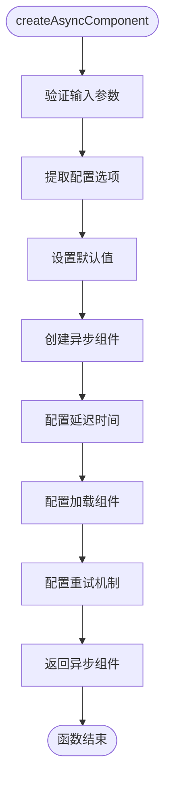
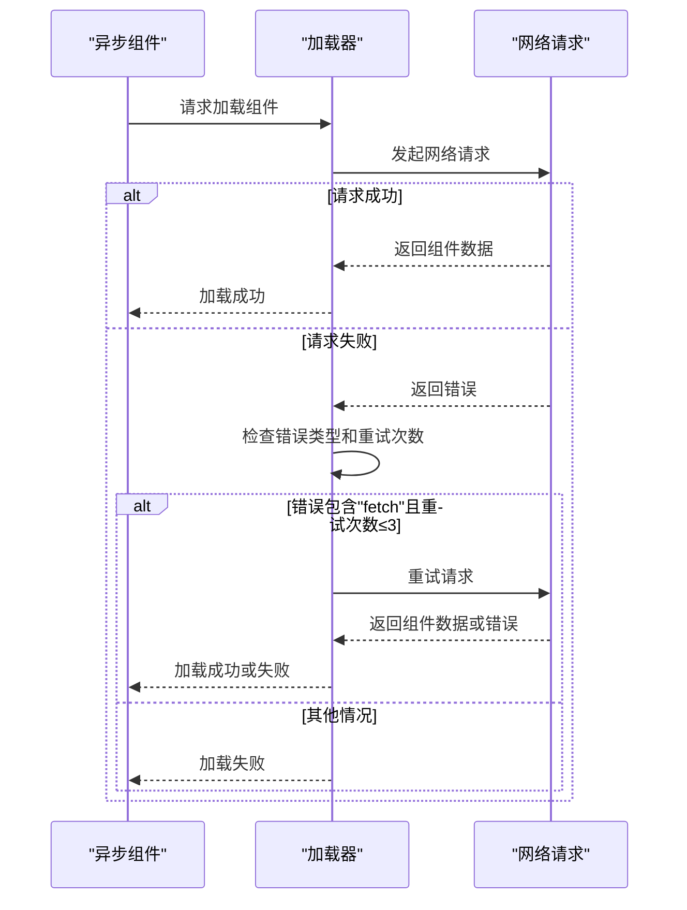
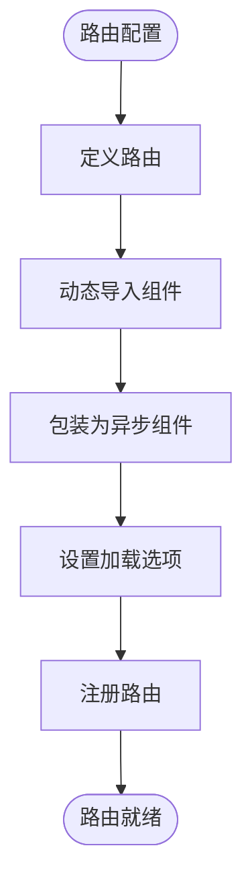
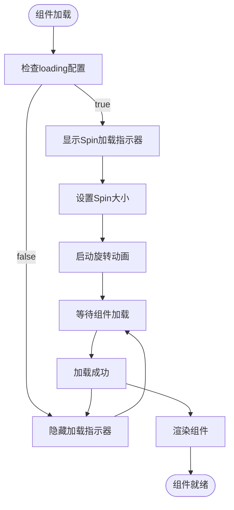

# 异步组件加载

<cite>
**本文档引用的文件**
- [createAsyncComponent.tsx](file://src/utils/createAsyncComponent.tsx)
- [header/index.vue](file://src/layouts/header/index.vue)
- [Login.vue](file://src/views/system/login/Login.vue)
- [commodity.ts](file://src/router/modules/commodity.ts)
- [dashboard.ts](file://src/router/modules/dashboard.ts)
- [constant.ts](file://src/router/constant.ts)
</cite>

## 目录
1. [简介](#简介)
2. [核心功能分析](#核心功能分析)
3. [配置选项详解](#配置选项详解)
4. [路由懒加载应用](#路由懒加载应用)
5. [实际使用示例](#实际使用示例)
6. [常见陷阱与最佳实践](#常见陷阱与最佳实践)
7. [结论](#结论)

## 简介
`createAsyncComponent` 是一个用于创建异步组件加载器的工具函数，它封装了 Vue 的 `defineAsyncComponent` 功能，为异步组件提供了加载延迟、重试机制和 Spin 加载指示器等增强功能。该工具在项目中被广泛应用于优化首屏性能，通过懒加载减少初始加载时间，并在组件加载过程中提供良好的用户体验。

**Section sources**
- [createAsyncComponent.tsx](file://src/utils/createAsyncComponent.tsx)

## 核心功能分析

`createAsyncComponent` 函数通过封装 Vue 的 `defineAsyncComponent` API，为异步组件提供了增强的加载控制功能。该函数接收一个组件加载器函数和一个配置选项对象，返回一个经过包装的异步组件。

函数的核心功能包括：
- **加载延迟控制**：通过 `delay` 参数避免短暂的加载闪烁
- **重试机制**：在网络请求失败时自动重试最多3次
- **加载指示器**：集成 Ant Design Vue 的 Spin 组件提供视觉反馈



**Diagram sources**
- [createAsyncComponent.tsx](file://src/utils/createAsyncComponent.tsx#L41-L61)

**Section sources**
- [createAsyncComponent.tsx](file://src/utils/createAsyncComponent.tsx#L41-L61)

## 配置选项详解

### Options 接口定义
`Options` 接口定义了异步组件加载器的配置选项，包括大小、延迟、加载状态和重试机制等参数。

```mermaid
classDiagram
class Options {
+size : "default" | "small" | "large"
+delay : number
+loading : boolean
+retry : boolean
}
Options : size : loading 大小，默认 small
Options : delay : 组件加载延迟时间，默认 200ms
Options : loading : 是否显示加载指示器，默认 true
Options : retry : 是否启用重试机制，默认 true
```

**Diagram sources**
- [createAsyncComponent.tsx](file://src/utils/createAsyncComponent.tsx#L12-L33)

### size 参数
`size` 参数控制加载指示器的大小，支持三种尺寸：`small`、`default` 和 `large`。默认值为 `small`，适用于大多数场景。在需要更明显视觉反馈的场景中，可以使用 `large` 尺寸。

### delay 参数
`delay` 参数设置组件加载的延迟时间（毫秒），默认值为 200ms。这个参数的主要作用是避免短暂的加载闪烁。当组件加载时间很短时，用户可能只会看到一瞬间的加载状态，这会影响用户体验。通过设置适当的延迟时间，只有当加载时间超过阈值时才会显示加载指示器，从而避免了短暂的闪烁。

### loading 参数
`loading` 参数控制是否在组件加载成功前显示加载指示器，默认值为 `true`。当设置为 `false` 时，不会显示任何加载指示器，适用于不需要视觉反馈的场景。

### retry 参数
`retry` 参数控制是否启用重试机制，默认值为 `true`。当网络请求失败时，系统会自动重试最多3次。重试机制通过 `onError` 回调实现，当错误信息包含 "fetch" 关键字且重试次数不超过3次时，会调用 `retry()` 函数进行重试；否则调用 `fail()` 函数终止加载。



**Diagram sources**
- [createAsyncComponent.tsx](file://src/utils/createAsyncComponent.tsx#L52-L59)

**Section sources**
- [createAsyncComponent.tsx](file://src/utils/createAsyncComponent.tsx#L12-L33)

## 路由懒加载应用

`createAsyncComponent` 工具在路由配置中被用于实现页面的懒加载，从而优化首屏性能。通过将路由组件包装在 `createAsyncComponent` 中，只有当用户访问特定路由时才会加载相应的组件，减少了初始加载的资源量。

在路由模块中，组件通常通过动态导入的方式进行懒加载：



**Diagram sources**
- [commodity.ts](file://src/router/modules/commodity.ts#L13-L19)
- [dashboard.ts](file://src/router/modules/dashboard.ts#L14-L15)

### 商品管理路由
在商品管理模块中，产品分类和产品列表组件都采用了懒加载：

```typescript
const commodity: MergedRoute = {
  path: "/commodity",
  name: "Commodity",
  component: LAYOUT,
  meta: { orderNo: 4, title: "产品管理", icon: "icon-park-outline:commodity" },
  children: [
    {
      path: "pro-category",
      name: "ProCategory",
      component: () => import("/@/views/commodity/ProCategory/ProCategory.vue"),
      meta: { orderNo: 1, title: "产品分类" },
    },
    {
      path: "product",
      name: "Product",
      component: () => import("/@/views/commodity/Product/Product.vue"),
      meta: { orderNo: 2, title: "产品列表" },
    },
  ],
}
```

### 仪表盘路由
在仪表盘模块中，工作台组件也采用了懒加载：

```typescript
const dashboard: MergedRoute = {
  path: "/dashboard",
  name: "Dashboard",
  component: LAYOUT,
  redirect: "/dashboard/analysis",
  meta: { orderNo: 1, icon: "icon-park-outline:workbench", title: "工作台", hideChildrenInMenu: true },
  children: [
    {
      path: "analysis",
      name: "Analysis",
      component: () => import("/@/views/dashboard/Dashboard.vue"),
      meta: { title: "工作台", hideMenu: true, hideBreadcrumb: true },
    },
  ],
}
```

**Section sources**
- [commodity.ts](file://src/router/modules/commodity.ts)
- [dashboard.ts](file://src/router/modules/dashboard.ts)
- [constant.ts](file://src/router/constant.ts)

## 实际使用示例

### 布局组件中的使用
在布局组件中，`createAsyncComponent` 被用于异步加载头部的各种功能组件，如通知、用户信息和搜索功能：

```typescript
// 异步导入组件
const NotifyCmp = createAsyncComponent(() => import("./components/notify/Notify.vue"))
const UserCmp = createAsyncComponent(() => import("./components/user/User.vue"))
const SearchCmp = createAsyncComponent(() => import("./components/search/Search.vue"))
```

这种用法可以将非关键路径的组件延迟加载，进一步优化首屏性能。

### 登录页面中的使用
在登录页面中，`createAsyncComponent` 被用于加载不同的登录方式组件，并且禁用了加载指示器：

```typescript
const RegisterForm = createAsyncComponent(() => import("./components/RegisterForm.vue"), { loading: false })
const ForgetPasswordForm = createAsyncComponent(() => import("./components/ForgetPasswordForm.vue"), { loading: false })
const MobileForm = createAsyncComponent(() => import("./components/MobileForm.vue"), { loading: false })
const QrCodeForm = createAsyncComponent(() => import("./components/QrCodeForm.vue"), { loading: false })
```

通过设置 `loading: false`，这些表单组件在加载时不会显示 Spin 加载指示器，因为它们是页面的一部分，而不是独立的页面。

### loadingComponent 集成
`createAsyncComponent` 集成了 Ant Design Vue 的 Spin 组件作为加载指示器：

```typescript
loadingComponent: loading ? <Spin spinning={true} size={size} /> : undefined
```

Spin 组件提供了流畅的旋转动画，`spinning={true}` 确保加载指示器持续旋转，`size={size}` 根据配置选项调整大小。这种集成提供了统一的视觉反馈，增强了用户体验。



**Diagram sources**
- [createAsyncComponent.tsx](file://src/utils/createAsyncComponent.tsx#L50-L51)
- [header/index.vue](file://src/layouts/header/index.vue#L23-L26)

**Section sources**
- [header/index.vue](file://src/layouts/header/index.vue#L23-L26)
- [Login.vue](file://src/views/system/login/Login.vue#L50-L54)

## 常见陷阱与最佳实践

### 重试次数过多导致的网络拥塞
虽然重试机制可以提高组件加载的成功率，但过多的重试次数可能导致网络拥塞。当网络状况不佳时，连续的重试请求会加重服务器负担，可能导致更严重的性能问题。

**最佳实践**：
- 合理设置重试次数，通常3次是合理的上限
- 在重试之间添加指数退避策略，避免短时间内大量请求
- 监控网络状况，根据实际情况动态调整重试策略

### 加载延迟设置不当影响用户体验
`delay` 参数的设置需要权衡用户体验。如果设置过短，可能无法有效避免短暂的加载闪烁；如果设置过长，用户可能会感觉页面响应迟缓。

**最佳实践**：
- 根据组件的平均加载时间设置 `delay` 值
- 对于关键路径组件，可以设置较短的延迟或禁用延迟
- 对于非关键路径组件，可以设置较长的延迟以避免不必要的加载指示器显示

### 加载指示器的合理使用
虽然加载指示器可以提供良好的用户体验，但在某些场景下可能不需要或不适合。

**最佳实践**：
- 对于快速加载的组件，考虑禁用加载指示器
- 对于页面级别的组件，使用加载指示器提供明确的反馈
- 对于布局内的组件，根据具体情况决定是否显示加载指示器
- 确保加载指示器的样式与整体设计风格一致

### 性能监控与优化
使用异步组件加载时，应建立相应的性能监控机制，及时发现和解决性能问题。

**最佳实践**：
- 监控组件的加载时间，识别性能瓶颈
- 分析重试机制的触发频率，优化网络请求
- 定期审查异步组件的使用情况，确保符合性能优化目标

**Section sources**
- [createAsyncComponent.tsx](file://src/utils/createAsyncComponent.tsx)

## 结论
`createAsyncComponent` 是一个功能强大的异步组件加载工具，通过封装 Vue 的 `defineAsyncComponent` API，为异步组件提供了加载延迟、重试机制和 Spin 加载指示器等增强功能。该工具在项目中被广泛应用于路由懒加载和布局组件的异步加载，有效优化了首屏性能。

通过合理配置 `size`、`delay`、`loading` 和 `retry` 等参数，可以为不同场景提供最佳的用户体验。在实际使用中，需要注意避免重试次数过多导致的网络拥塞和加载延迟设置不当影响用户体验等常见陷阱。

总体而言，`createAsyncComponent` 是一个优秀的性能优化工具，通过合理的使用和配置，可以在保证功能完整性的同时，显著提升应用的加载速度和用户体验。