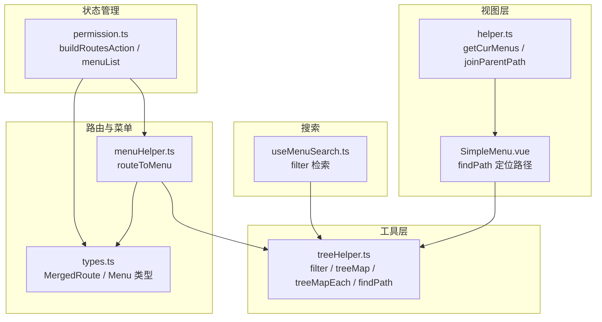
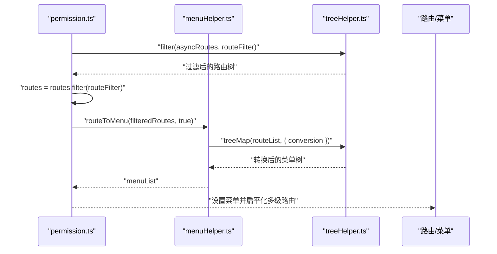
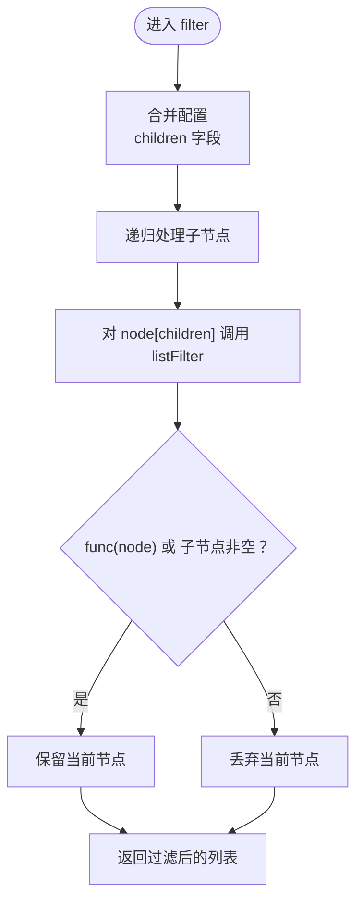
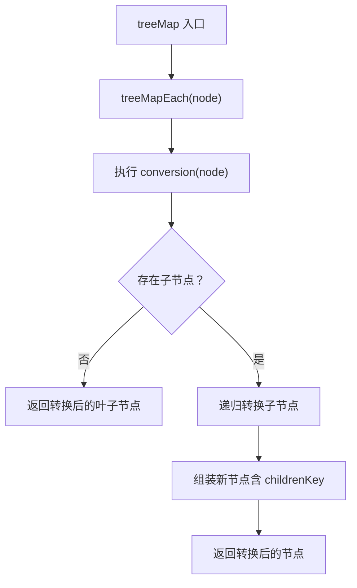
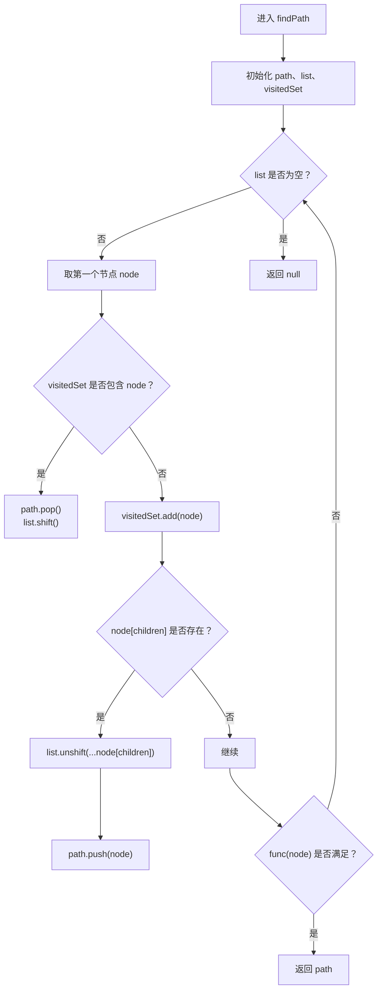
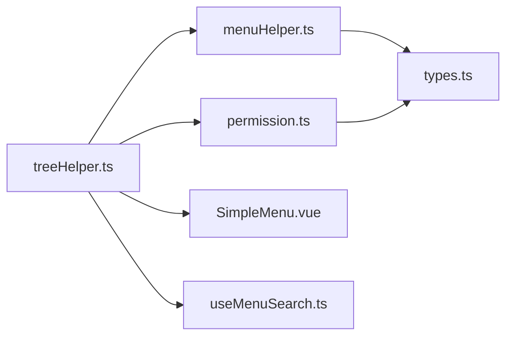

# 树形结构操作

<cite>
**本文引用的文件**
- [src/utils/treeHelper.ts](file://src/utils/treeHelper.ts)
- [src/router/menuHelper.ts](file://src/router/menuHelper.ts)
- [src/stores/modules/permission.ts](file://src/stores/modules/permission.ts)
- [src/layouts/sider/components/SimpleMenu.vue](file://src/layouts/sider/components/SimpleMenu.vue)
- [src/layouts/sider/helper.ts](file://src/layouts/sider/helper.ts)
- [src/router/types.ts](file://src/router/types.ts)
- [src/layouts/header/components/search/useMenuSearch.ts](file://src/layouts/header/components/search/useMenuSearch.ts)
</cite>

## 目录
1. [简介](#简介)
2. [项目结构](#项目结构)
3. [核心组件](#核心组件)
4. [架构总览](#架构总览)
5. [详细组件分析](#详细组件分析)
6. [依赖关系分析](#依赖关系分析)
7. [性能考量](#性能考量)
8. [故障排查指南](#故障排查指南)
9. [结论](#结论)
10. [附录](#附录)

## 简介
本文件系统性地文档化了树形结构操作工具集，重点覆盖以下能力：
- filter：递归过滤树，保留匹配节点及其所有子节点，适用于菜单权限过滤场景。
- treeMap 与 treeMapEach：通过配置化的字段映射（id/children/pid），实现通用的树节点转换，支持字段重命名与数据结构重组。
- findPath：基于 visitedSet 防止循环引用，结合 list.unshift 实现深度优先搜索，用于查找菜单项路径、定位分类层级等。

同时，本文给出在项目中的典型用法与最佳实践，包括将后端返回的菜单树转换为 Ant Design Vue 所需格式、按权限过滤菜单树，以及常见问题的规避策略。

## 项目结构
该工具位于 utils 目录，被多个模块复用：
- 路由与菜单：menuHelper 负责将路由转换为菜单；permission store 在构建菜单时使用 filter 做权限过滤。
- 视图层：SimpleMenu 使用 findPath 定位当前选中路径并控制展开状态。
- 搜索：useMenuSearch 使用 filter 对菜单进行检索过滤。

图表来源
- [src/utils/treeHelper.ts](file://src/utils/treeHelper.ts#L1-L96)
- [src/router/menuHelper.ts](file://src/router/menuHelper.ts#L1-L40)
- [src/stores/modules/permission.ts](file://src/stores/modules/permission.ts#L33-L60)
- [src/layouts/sider/components/SimpleMenu.vue](file://src/layouts/sider/components/SimpleMenu.vue#L18-L62)
- [src/layouts/sider/helper.ts](file://src/layouts/sider/helper.ts#L1-L35)
- [src/router/types.ts](file://src/router/types.ts#L1-L73)
- [src/layouts/header/components/search/useMenuSearch.ts](file://src/layouts/header/components/search/useMenuSearch.ts#L43-L142)

章节来源
- [src/utils/treeHelper.ts](file://src/utils/treeHelper.ts#L1-L96)
- [src/router/menuHelper.ts](file://src/router/menuHelper.ts#L1-L40)
- [src/stores/modules/permission.ts](file://src/stores/modules/permission.ts#L33-L60)
- [src/layouts/sider/components/SimpleMenu.vue](file://src/layouts/sider/components/SimpleMenu.vue#L18-L62)
- [src/layouts/sider/helper.ts](file://src/layouts/sider/helper.ts#L1-L35)
- [src/router/types.ts](file://src/router/types.ts#L1-L73)
- [src/layouts/header/components/search/useMenuSearch.ts](file://src/layouts/header/components/search/useMenuSearch.ts#L43-L142)

## 核心组件
- TreeHelperConfig：树形字段映射接口，包含 id、children、pid 三个键，默认值来自 DEFAULT_CONFIG。
- filter：对树进行递归过滤，保留匹配节点及所有子节点，适合权限过滤与菜单筛选。
- treeMap / treeMapEach：对树进行结构化转换，支持自定义子节点字段名与节点转换函数。
- findPath：在树中查找满足条件的节点路径，使用 visitedSet 防止循环引用，通过 list.unshift 实现 DFS。

章节来源
- [src/utils/treeHelper.ts](file://src/utils/treeHelper.ts#L5-L16)
- [src/utils/treeHelper.ts](file://src/utils/treeHelper.ts#L24-L34)
- [src/utils/treeHelper.ts](file://src/utils/treeHelper.ts#L44-L65)
- [src/utils/treeHelper.ts](file://src/utils/treeHelper.ts#L74-L95)

## 架构总览
下面的序列图展示了“权限过滤 + 菜单转换”的典型流程，体现 filter 与 treeMap 的协作。

图表来源
- [src/stores/modules/permission.ts](file://src/stores/modules/permission.ts#L33-L60)
- [src/router/menuHelper.ts](file://src/router/menuHelper.ts#L15-L40)
- [src/utils/treeHelper.ts](file://src/utils/treeHelper.ts#L24-L34)
- [src/utils/treeHelper.ts](file://src/utils/treeHelper.ts#L44-L65)

## 详细组件分析

### filter：树形递归过滤
- 设计要点
  - 通过配置化字段映射（默认 children），在递归过程中对每个节点调用过滤函数。
  - 递归先处理子节点，再判断当前节点是否保留；若子节点非空，则当前节点必保留。
- 典型用途
  - 权限过滤：仅保留用户具备访问权限的路由节点及其子树。
  - 菜单筛选：按关键字或状态筛选菜单树。
- 复杂度
  - 时间复杂度：O(N)，N 为节点总数。
  - 空间复杂度：O(H)，H 为树高（递归栈）。
- 注意事项
  - 若传入的树节点存在循环引用，建议在调用前进行去环处理或确保数据源无环。
  - 过滤函数应避免副作用，保证可预测性。

图表来源
- [src/utils/treeHelper.ts](file://src/utils/treeHelper.ts#L24-L34)

章节来源
- [src/utils/treeHelper.ts](file://src/utils/treeHelper.ts#L24-L34)
- [src/stores/modules/permission.ts](file://src/stores/modules/permission.ts#L33-L60)

### treeMap 与 treeMapEach：树节点转换与重组
- 设计要点
  - treeMap：对外暴露的入口，遍历根节点数组，逐个委托给 treeMapEach。
  - treeMapEach：对单个节点执行 conversion 函数，得到转换后的节点数据；若有子节点则递归转换子树，并可指定新的子节点字段名（childrenKey）。
  - 支持字段映射：通过 children 与 childrenKey 控制父子关系字段名，便于适配不同数据模型。
- 典型用途
  - 将后端返回的路由树转换为 Ant Design Vue 所需的菜单结构（例如提取 meta、name、path 等字段）。
  - 重命名字段、裁剪冗余字段、统一结构。
- 复杂度
  - 时间复杂度：O(N)，N 为节点总数。
  - 空间复杂度：O(H)，H 为树高（递归栈）。
- 注意事项
  - conversion 返回值应为对象，否则会被视为无有效转换数据。
  - 若 children 字段不存在或为空数组，不会递归处理子节点。

图表来源
- [src/utils/treeHelper.ts](file://src/utils/treeHelper.ts#L44-L65)
- [src/router/menuHelper.ts](file://src/router/menuHelper.ts#L15-L40)

章节来源
- [src/utils/treeHelper.ts](file://src/utils/treeHelper.ts#L44-L65)
- [src/router/menuHelper.ts](file://src/router/menuHelper.ts#L15-L40)

### findPath：树中查找路径
- 设计要点
  - 使用 visitedSet 记录已访问节点，防止循环引用导致死循环。
  - 使用 list（数组）模拟栈/队列，通过 list.unshift 将子节点插入到头部，实现深度优先搜索。
  - 当遇到满足条件的节点时，返回当前 path（即从根到该节点的路径）。
- 典型用途
  - 在菜单树中定位当前路由对应的路径，用于设置选中与展开状态。
  - 查找分类层级、定位父节点链路等。
- 复杂度
  - 时间复杂度：O(N)，N 为节点总数。
  - 空间复杂度：O(N)，最坏情况下 path 与 list 同时存储整棵树。
- 注意事项
  - 若树存在循环引用，visitedSet 可有效避免无限循环。
  - 若目标节点不存在，返回 null。

图表来源
- [src/utils/treeHelper.ts](file://src/utils/treeHelper.ts#L74-L95)
- [src/layouts/sider/components/SimpleMenu.vue](file://src/layouts/sider/components/SimpleMenu.vue#L33-L49)

章节来源
- [src/utils/treeHelper.ts](file://src/utils/treeHelper.ts#L74-L95)
- [src/layouts/sider/components/SimpleMenu.vue](file://src/layouts/sider/components/SimpleMenu.vue#L33-L49)

## 依赖关系分析
- 工具函数依赖
  - treeHelper.ts 为纯工具函数，不依赖外部框架，便于跨模块复用。
- 模块耦合
  - permission.ts 依赖 treeHelper 的 filter 与 menuHelper 的 routeToMenu，形成“过滤 + 转换”的闭环。
  - SimpleMenu.vue 依赖 treeHelper 的 findPath，用于定位当前选中路径。
  - useMenuSearch.ts 依赖 treeHelper 的 filter，用于菜单检索。
- 类型约束
  - MergedRoute 与 Menu 类型定义明确了树节点字段结构，保证工具函数在类型层面的安全性。

图表来源
- [src/utils/treeHelper.ts](file://src/utils/treeHelper.ts#L1-L96)
- [src/router/menuHelper.ts](file://src/router/menuHelper.ts#L1-L40)
- [src/stores/modules/permission.ts](file://src/stores/modules/permission.ts#L33-L60)
- [src/layouts/sider/components/SimpleMenu.vue](file://src/layouts/sider/components/SimpleMenu.vue#L18-L62)
- [src/layouts/header/components/search/useMenuSearch.ts](file://src/layouts/header/components/search/useMenuSearch.ts#L43-L142)
- [src/router/types.ts](file://src/router/types.ts#L1-L73)

章节来源
- [src/utils/treeHelper.ts](file://src/utils/treeHelper.ts#L1-L96)
- [src/router/menuHelper.ts](file://src/router/menuHelper.ts#L1-L40)
- [src/stores/modules/permission.ts](file://src/stores/modules/permission.ts#L33-L60)
- [src/layouts/sider/components/SimpleMenu.vue](file://src/layouts/sider/components/SimpleMenu.vue#L18-L62)
- [src/layouts/header/components/search/useMenuSearch.ts](file://src/layouts/header/components/search/useMenuSearch.ts#L43-L142)
- [src/router/types.ts](file://src/router/types.ts#L1-L73)

## 性能考量
- 时间复杂度
  - filter、treeMap、findPath 均为线性时间复杂度，适合大规模树形数据。
- 空间复杂度
  - 递归深度受树高影响；在极端情况下（退化为链表），空间复杂度接近 O(N)。
- 实践建议
  - 对超大菜单树，建议在前端分页或懒加载子节点。
  - 避免在过滤/转换函数中执行昂贵操作（如网络请求、复杂计算）。
  - 对频繁查询的菜单树，可考虑缓存中间结果。

[本节为通用指导，无需具体文件来源]

## 故障排查指南
- 常见问题与对策
  - 树节点引用丢失
    - 现象：转换后子节点字段名不正确或缺失。
    - 对策：在 treeMapEach 中明确设置 childrenKey，并确保 conversion 返回包含必要字段的对象。
    - 参考路径
      - [src/utils/treeHelper.ts](file://src/utils/treeHelper.ts#L44-L65)
      - [src/router/menuHelper.ts](file://src/router/menuHelper.ts#L15-L40)
  - 无限递归/死循环
    - 现象：findPath 卡死或内存占用异常。
    - 对策：确认数据源无循环引用；若无法保证，可在上游去环或在调用前对节点做去环处理。
    - 参考路径
      - [src/utils/treeHelper.ts](file://src/utils/treeHelper.ts#L74-L95)
  - 权限过滤不生效
    - 现象：某些路由仍出现在菜单中。
    - 对策：检查 routeFilter 的判断逻辑；注意 filter 会先递归处理子节点，再处理顶层节点。
    - 参考路径
      - [src/stores/modules/permission.ts](file://src/stores/modules/permission.ts#L33-L60)
  - 菜单路径定位错误
    - 现象：selectedKeys/openKeys 不正确。
    - 对策：确认 items 的构造与 path 匹配规则；findPath 返回的是从根到目标节点的路径数组。
    - 参考路径
      - [src/layouts/sider/components/SimpleMenu.vue](file://src/layouts/sider/components/SimpleMenu.vue#L33-L49)
      - [src/layouts/sider/helper.ts](file://src/layouts/sider/helper.ts#L1-L35)

章节来源
- [src/utils/treeHelper.ts](file://src/utils/treeHelper.ts#L44-L65)
- [src/router/menuHelper.ts](file://src/router/menuHelper.ts#L15-L40)
- [src/stores/modules/permission.ts](file://src/stores/modules/permission.ts#L33-L60)
- [src/layouts/sider/components/SimpleMenu.vue](file://src/layouts/sider/components/SimpleMenu.vue#L33-L49)
- [src/layouts/sider/helper.ts](file://src/layouts/sider/helper.ts#L1-L35)

## 结论
treeHelper 提供了三类关键能力：递归过滤、结构转换与路径查找。它们在权限过滤、菜单转换与视图交互中发挥重要作用。通过配置化的字段映射与清晰的递归设计，工具函数既通用又易用。建议在实际项目中：
- 明确树节点字段约定，统一使用 children 作为子节点字段名。
- 在权限过滤时先处理子节点，再处理顶层节点，确保父子一致性。
- 在菜单转换时使用 treeMap 的 conversion 与 childrenKey，快速适配不同 UI 框架的数据结构。
- 在路径查找时配合 visitedSet 与 DFS，确保稳定与高效。

[本节为总结，无需具体文件来源]

## 附录

### 实际用法示例（路径指引）
- 将后端返回的菜单树转换为 Ant Design Vue 所需格式
  - 使用 treeMap 的 conversion 将路由节点转换为菜单节点，提取所需字段并设置 childrenKey。
  - 参考路径
    - [src/router/menuHelper.ts](file://src/router/menuHelper.ts#L15-L40)
    - [src/utils/treeHelper.ts](file://src/utils/treeHelper.ts#L44-L65)
- 根据权限过滤菜单树
  - 使用 filter 对路由树进行权限过滤，再进行菜单转换与排序。
  - 参考路径
    - [src/stores/modules/permission.ts](file://src/stores/modules/permission.ts#L33-L60)
    - [src/utils/treeHelper.ts](file://src/utils/treeHelper.ts#L24-L34)
- 查找菜单项路径并控制展开
  - 使用 findPath 获取从根到当前路由的路径，设置 selectedKeys 与 openKeys。
  - 参考路径
    - [src/layouts/sider/components/SimpleMenu.vue](file://src/layouts/sider/components/SimpleMenu.vue#L33-L49)
    - [src/utils/treeHelper.ts](file://src/utils/treeHelper.ts#L74-L95)

### 类型与字段约定
- MergedRoute 与 Menu 类型定义了树节点的字段结构，便于工具函数在类型层面安全使用。
- 参考路径
  - [src/router/types.ts](file://src/router/types.ts#L1-L73)