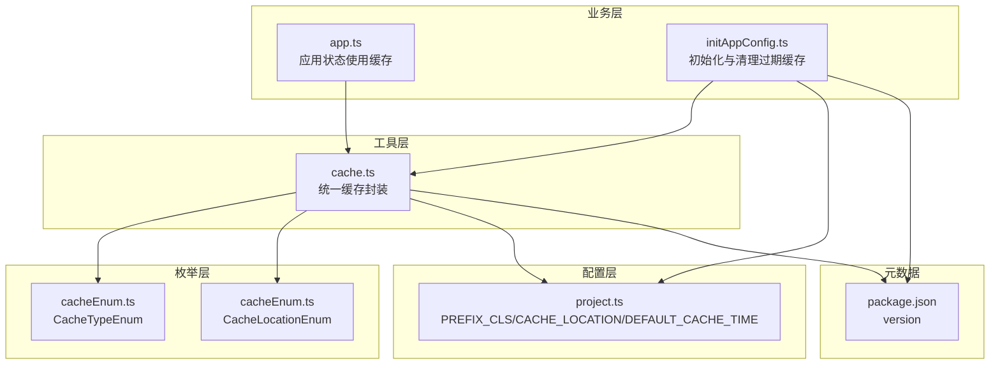
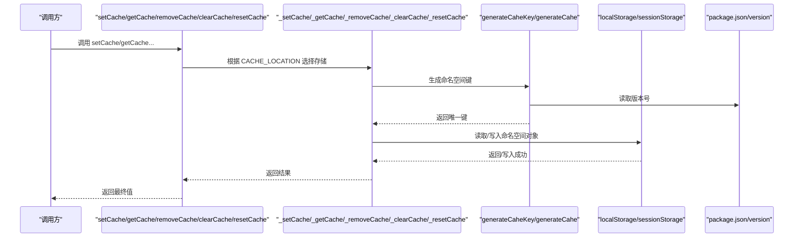
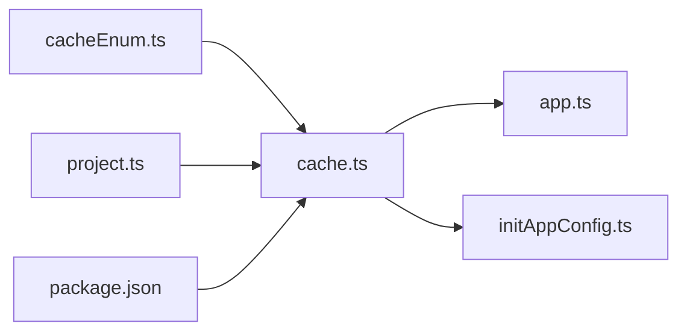
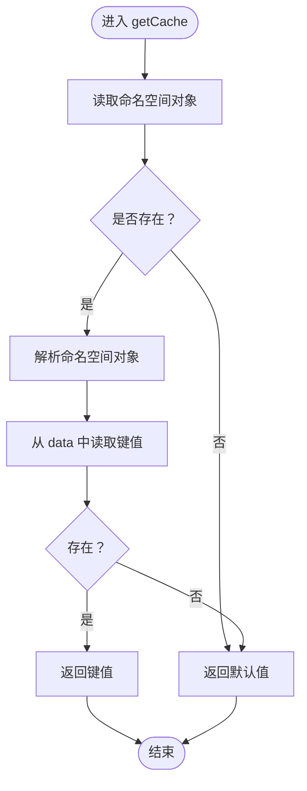

# 缓存工具

<cite>
**本文引用的文件**
- [src/utils/cache.ts](file://src/utils/cache.ts)
- [src/enums/cacheEnum.ts](file://src/enums/cacheEnum.ts)
- [src/config/project.ts](file://src/config/project.ts)
- [src/logics/initAppConfig.ts](file://src/logics/initAppConfig.ts)
- [src/stores/modules/app.ts](file://src/stores/modules/app.ts)
- [package.json](file://package.json)
</cite>

## 目录
1. [简介](#简介)
2. [项目结构](#项目结构)
3. [核心组件](#核心组件)
4. [架构总览](#架构总览)
5. [详细组件分析](#详细组件分析)
6. [依赖关系分析](#依赖关系分析)
7. [性能考量](#性能考量)
8. [故障排查指南](#故障排查指南)
9. [结论](#结论)
10. [附录](#附录)

## 简介
本文件面向“缓存工具”模块，系统性解析 src/utils/cache.ts 中的统一缓存封装，包括：
- setCache/getCache/removeCache/clearCache/resetCache 的工作机制
- generateCaheKey 如何结合项目前缀与版本号生成唯一缓存键
- _setCache/_getCache 等内部方法如何通过 CacheTypeEnum 实现类型化键管理
- 使用示例：使用 CacheTypeEnum.TOKEN 存储认证令牌、使用 CacheTypeEnum.ROUTES 存储动态路由配置（概念性说明）
- 版本升级时 resetCache 重置创建时间的作用
- 常见陷阱与规避建议：过期策略缺失、跨域缓存共享、localStorage 与 sessionStorage 的切换

## 项目结构
该缓存工具位于 src/utils/cache.ts，配合枚举与项目配置共同工作：
- 枚举定义：CacheTypeEnum（键名）、CacheLocationEnum（存储位置）
- 项目配置：PREFIX_CLS（项目前缀）、CACHE_LOCATION（默认存储位置）、DEFAULT_CACHE_TIME（默认过期时间）
- 初始化逻辑：initAppConfig.ts 提供清理过期缓存的辅助能力

图表来源
- [src/utils/cache.ts](file://src/utils/cache.ts#L1-L138)
- [src/enums/cacheEnum.ts](file://src/enums/cacheEnum.ts#L1-L17)
- [src/config/project.ts](file://src/config/project.ts#L1-L39)
- [src/logics/initAppConfig.ts](file://src/logics/initAppConfig.ts#L1-L54)
- [src/stores/modules/app.ts](file://src/stores/modules/app.ts#L1-L76)
- [package.json](file://package.json#L1-L65)

章节来源
- [src/utils/cache.ts](file://src/utils/cache.ts#L1-L138)
- [src/enums/cacheEnum.ts](file://src/enums/cacheEnum.ts#L1-L17)
- [src/config/project.ts](file://src/config/project.ts#L1-L39)
- [src/logics/initAppConfig.ts](file://src/logics/initAppConfig.ts#L1-L54)
- [src/stores/modules/app.ts](file://src/stores/modules/app.ts#L1-L76)
- [package.json](file://package.json#L1-L65)

## 核心组件
- 统一缓存接口
  - setCache(key, value)：设置缓存项
  - getCache(key, def?)：读取缓存项，支持默认值
  - removeCache(key)：删除指定键
  - clearCache()：清空当前命名空间下的所有缓存数据
  - resetCache()：重置当前命名空间的创建时间
- 内部实现
  - generateCaheKey()：生成唯一缓存键（由项目前缀与版本号组成）
  - generateCahe(storage)：初始化命名空间缓存对象（含版本、数据、创建时间）
  - _setCache/_getCache/_removeCache/_clearCache/_resetCache：对命名空间内的数据进行增删改查与重置
- 类型化键管理
  - CacheTypeEnum：集中定义可识别的键名集合
  - CacheLocationEnum：LOCAL/SESSION 两种存储位置枚举
- 配置与元数据
  - PREFIX_CLS：项目前缀
  - CACHE_LOCATION：默认存储位置
  - DEFAULT_CACHE_TIME：默认过期时间（秒）
  - package.json.version：用于生成唯一键与版本校验

章节来源
- [src/utils/cache.ts](file://src/utils/cache.ts#L1-L138)
- [src/enums/cacheEnum.ts](file://src/enums/cacheEnum.ts#L1-L17)
- [src/config/project.ts](file://src/config/project.ts#L1-L39)
- [package.json](file://package.json#L1-L65)

## 架构总览
统一缓存以“命名空间”的形式组织，每个命名空间由 generateCaheKey 生成的键标识，内部包含：
- version：版本号
- data：键值对存储
- createTime：创建/重置时间戳

对外暴露的方法通过 CACHE_LOCATION 决定使用 localStorage 或 sessionStorage；内部通过 generateCaheKey 保证不同版本或不同前缀不会互相污染。

图表来源
- [src/utils/cache.ts](file://src/utils/cache.ts#L1-L138)
- [src/config/project.ts](file://src/config/project.ts#L1-L39)
- [package.json](file://package.json#L1-L65)

## 详细组件分析

### 键生成与命名空间
- generateCaheKey
  - 作用：将项目前缀与版本号拼接为唯一键，避免多版本或多项目冲突
  - 影响因素：PREFIX_CLS（来自项目配置）、package.json.version
- generateCahe
  - 作用：在目标存储中初始化命名空间对象，包含 version、data、createTime
  - 触发时机：当命名空间不存在时自动创建

章节来源
- [src/utils/cache.ts](file://src/utils/cache.ts#L1-L138)
- [src/config/project.ts](file://src/config/project.ts#L1-L39)
- [package.json](file://package.json#L1-L65)

### 类型化键管理（CacheTypeEnum）
- CacheTypeEnum 定义了常用键名，便于统一管理与 IDE 提示
- setCache/getCache/removeCache 等方法均以枚举作为键参数，确保键名一致性
- 常用键示例（来源于枚举）：
  - APP_DARK_MODE_KEY：主题模式
  - PROJ_CFG_KEY：项目配置
  - TOKEN_KEY：认证令牌
  - USER_INFO_KEY：用户信息
  - ROLES_KEY：角色信息
  - MULTIPLE_TABS_KEY：多页签状态
  - TABLE_SETTING_KEY：表格设置
  - MEMORY_ACCOUNT_KEY：记忆账号

章节来源
- [src/enums/cacheEnum.ts](file://src/enums/cacheEnum.ts#L1-L17)

### 存储位置与切换（localStorage/sessionStorage）
- 默认位置：CACHE_LOCATION（来自项目配置），可选 LOCAL 或 SESSION
- setCache/getCache/removeCache/clearCache/resetCache 在入口处根据 CACHE_LOCATION 选择存储对象
- 适用场景：
  - localStorage：持久化、跨会话保留
  - sessionStorage：会话内有效、关闭标签页后清除

章节来源
- [src/config/project.ts](file://src/config/project.ts#L1-L39)
- [src/utils/cache.ts](file://src/utils/cache.ts#L1-L138)

### 方法工作机制

#### setCache(key, value)
- 流程要点
  - 通过 _setCache 写入命名空间 data 对象
  - 若命名空间不存在则先 generateCahe 初始化
  - 写入后整体回写命名空间对象
- 典型用途
  - setCache(CacheTypeEnum.APP_DARK_MODE_KEY, mode)
  - setCache(CacheTypeEnum.PROJ_CFG_KEY, config)

章节来源
- [src/utils/cache.ts](file://src/utils/cache.ts#L1-L138)
- [src/stores/modules/app.ts](file://src/stores/modules/app.ts#L1-L76)

#### getCache(key, def?)
- 流程要点
  - 读取命名空间对象，若不存在返回默认值
  - 从 data 中按键读取，不存在也返回默认值
- 典型用途
  - getCache(CacheTypeEnum.APP_DARK_MODE_KEY, DEFAULT_THEME_MODE)

章节来源
- [src/utils/cache.ts](file://src/utils/cache.ts#L1-L138)
- [src/stores/modules/app.ts](file://src/stores/modules/app.ts#L1-L76)

#### removeCache(key)
- 流程要点
  - 读取命名空间对象，删除 data 中对应键
  - 回写命名空间对象
- 典型用途
  - 登出时移除 TOKEN_KEY

章节来源
- [src/utils/cache.ts](file://src/utils/cache.ts#L1-L138)

#### clearCache()
- 流程要点
  - 重置命名空间对象的 data 为空对象，version 不变，createTime 更新为当前时间
- 典型用途
  - 清理当前命名空间下的所有数据

章节来源
- [src/utils/cache.ts](file://src/utils/cache.ts#L1-L138)

#### resetCache()
- 流程要点
  - 读取命名空间对象，仅更新 createTime 为当前时间
- 典型用途
  - 版本升级后重置创建时间，避免旧时间戳导致误判过期

章节来源
- [src/utils/cache.ts](file://src/utils/cache.ts#L1-L138)

### 过期清理与版本升级处理

#### 过期清理（initAppConfig.clearObsoleteStorage）
- 逻辑概述
  - 遍历 localStorage 与 sessionStorage 中以项目前缀开头的键
  - 按版本号不匹配直接删除
  - 对同版本键检查 createTime 与 DEFAULT_CACHE_TIME 的关系，超时则删除
- 关键点
  - 使用 DEFAULT_CACHE_TIME（来自项目配置）作为过期阈值
  - 读取命名空间对象的 createTime 字段进行判断

章节来源
- [src/logics/initAppConfig.ts](file://src/logics/initAppConfig.ts#L1-L54)
- [src/config/project.ts](file://src/config/project.ts#L1-L39)

#### 版本升级与 resetCache
- 场景说明
  - 当项目版本变更时，命名空间键会随之变化（因为版本号参与生成）
  - 但若仍需保留旧命名空间的数据，可通过 resetCache 将 createTime 重置为新时间，从而避免被过期清理逻辑删除
- 注意
  - resetCache 仅重置时间，不改变命名空间键本身

章节来源
- [src/utils/cache.ts](file://src/utils/cache.ts#L1-L138)
- [src/logics/initAppConfig.ts](file://src/logics/initAppConfig.ts#L1-L54)

### 使用示例（概念性说明）
- 存储认证令牌（TOKEN_KEY）
  - setCache(CacheTypeEnum.TOKEN_KEY, token)
  - 登出时 removeCache(CacheTypeEnum.TOKEN_KEY)
- 存储动态路由配置（ROUTES_KEY）
  - setCache(CacheTypeEnum.ROUTES_KEY, routes)
  - 应用启动时通过 getCache(CacheTypeEnum.ROUTES_KEY, []) 读取并注入
- 主题与项目配置
  - setCache(CacheTypeEnum.APP_DARK_MODE_KEY, mode)
  - setCache(CacheTypeEnum.PROJ_CFG_KEY, config)

章节来源
- [src/enums/cacheEnum.ts](file://src/enums/cacheEnum.ts#L1-L17)
- [src/stores/modules/app.ts](file://src/stores/modules/app.ts#L1-L76)

## 依赖关系分析
- 模块耦合
  - cache.ts 依赖枚举与项目配置，耦合度低且职责清晰
  - 业务层通过枚举键与缓存工具交互，避免硬编码键名
- 外部依赖
  - lodash-es 的 isNull 用于判空
  - package.json 的 version 用于生成唯一键与版本校验
- 可能的循环依赖
  - cache.ts 与业务模块解耦良好，无循环依赖迹象

图表来源
- [src/utils/cache.ts](file://src/utils/cache.ts#L1-L138)
- [src/enums/cacheEnum.ts](file://src/enums/cacheEnum.ts#L1-L17)
- [src/config/project.ts](file://src/config/project.ts#L1-L39)
- [src/logics/initAppConfig.ts](file://src/logics/initAppConfig.ts#L1-L54)
- [src/stores/modules/app.ts](file://src/stores/modules/app.ts#L1-L76)
- [package.json](file://package.json#L1-L65)

## 性能考量
- 命名空间读写
  - 每次操作都会整体序列化/反序列化命名空间对象，建议避免频繁写入大对象
- 过期清理成本
  - clearObsoleteStorage 会对两个存储各遍历一次，键数量较多时可能产生开销
- 建议
  - 合理拆分命名空间，减少单个命名空间体积
  - 控制 DEFAULT_CACHE_TIME，避免过长导致存储膨胀

[本节为通用指导，无需列出具体文件来源]

## 故障排查指南
- 常见问题
  - 读取不到缓存：确认是否使用了正确的 CacheTypeEnum 键
  - 缓存被清理：检查 DEFAULT_CACHE_TIME 与 createTime 的关系
  - 跨版本缓存丢失：确认是否正确使用 resetCache 或版本升级策略
  - 跨域/跨站点共享：localStorage 默认不可跨域共享，需注意部署环境
- 定位步骤
  - 检查 generateCaheKey 生成的键是否符合预期（项目前缀与版本号）
  - 检查 CACHE_LOCATION 是否与期望一致
  - 使用浏览器开发者工具查看对应命名空间对象的 createTime 与 data

章节来源
- [src/utils/cache.ts](file://src/utils/cache.ts#L1-L138)
- [src/logics/initAppConfig.ts](file://src/logics/initAppConfig.ts#L1-L54)
- [src/config/project.ts](file://src/config/project.ts#L1-L39)

## 结论
该缓存工具通过“命名空间 + 版本号 + 创建时间”的组合，提供了统一、可扩展、可清理的前端缓存方案。借助枚举化的键管理与可配置的存储位置，既能满足日常开发需求，也能在版本升级与过期清理方面提供稳健保障。建议在团队内统一约定键名与使用规范，并结合 DEFAULT_CACHE_TIME 合理规划缓存生命周期。

[本节为总结性内容，无需列出具体文件来源]

## 附录

### API 定义与行为摘要
- setCache(key: CacheTypeEnum, value: any)
  - 行为：写入命名空间 data
  - 返回：void
- getCache(key: CacheTypeEnum, def?: any)
  - 行为：读取命名空间 data，不存在返回默认值
  - 返回：任意类型
- removeCache(key: CacheTypeEnum)
  - 行为：删除命名空间 data 中的键
  - 返回：void
- clearCache()
  - 行为：清空命名空间 data，保留 version 并更新 createTime
  - 返回：void
- resetCache()
  - 行为：仅重置 createTime
  - 返回：void

章节来源
- [src/utils/cache.ts](file://src/utils/cache.ts#L1-L138)

### 关键流程图：getCache 工作流

图表来源
- [src/utils/cache.ts](file://src/utils/cache.ts#L1-L138)