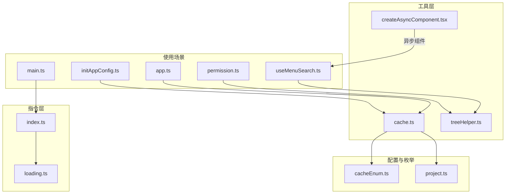
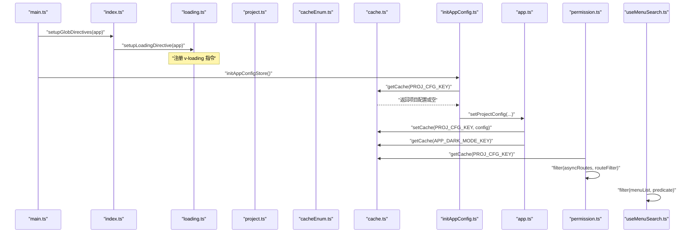
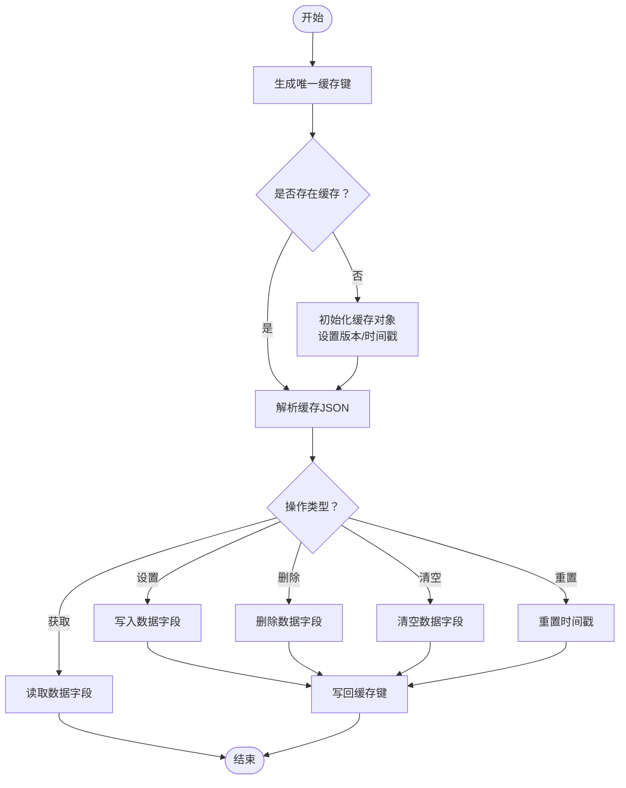
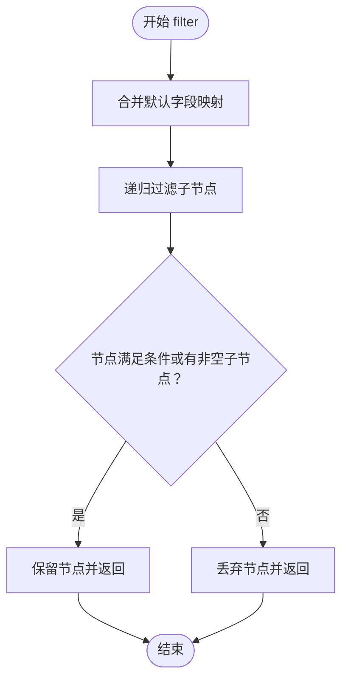
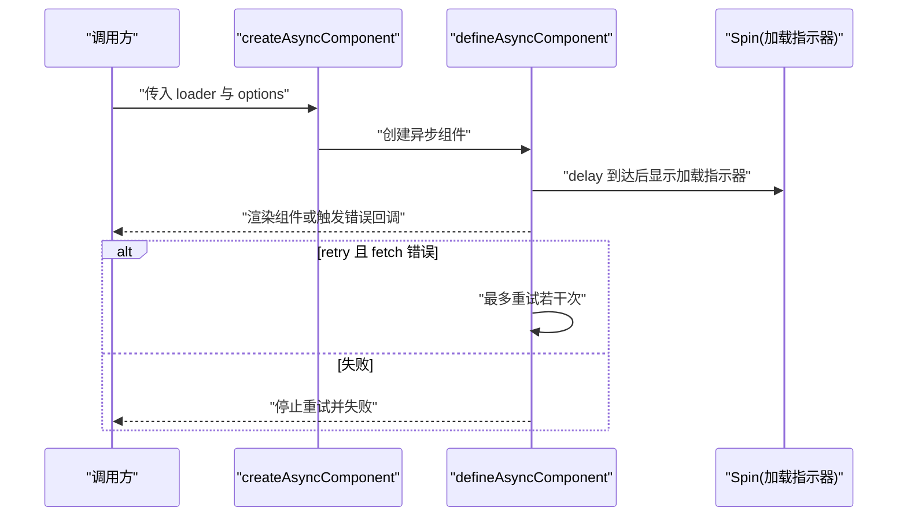
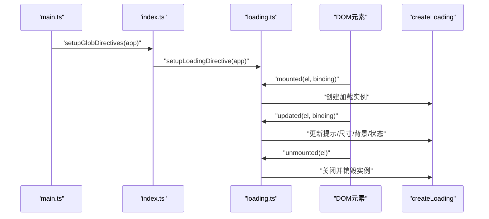
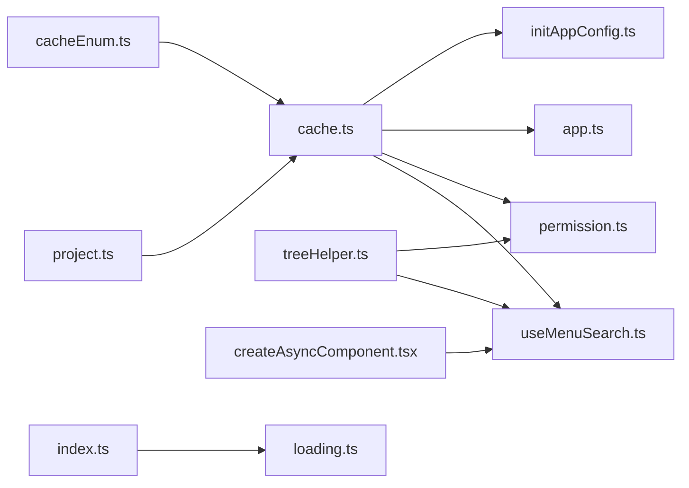

# 开发工具与辅助

<cite>
**本文引用的文件列表**
- [cache.ts](file://src/utils/cache.ts)
- [treeHelper.ts](file://src/utils/treeHelper.ts)
- [createAsyncComponent.tsx](file://src/utils/createAsyncComponent.tsx)
- [loading.ts](file://src/directives/loading.ts)
- [index.ts（指令入口）](file://src/directives/index.ts)
- [cacheEnum.ts](file://src/enums/cacheEnum.ts)
- [project.ts](file://src/config/project.ts)
- [initAppConfig.ts](file://src/logics/initAppConfig.ts)
- [app.ts（应用状态仓库）](file://src/stores/modules/app.ts)
- [useMenuSearch.ts](file://src/layouts/header/components/search/useMenuSearch.ts)
- [permission.ts（权限仓库）](file://src/stores/modules/permission.ts)
- [main.ts](file://src/main.ts)
</cite>

## 目录
1. [引言](#引言)
2. [项目结构](#项目结构)
3. [核心组件](#核心组件)
4. [架构总览](#架构总览)
5. [详细组件分析](#详细组件分析)
6. [依赖关系分析](#依赖关系分析)
7. [性能考量](#性能考量)
8. [故障排查指南](#故障排查指南)
9. [结论](#结论)

## 引言
本文件聚焦于项目中的开发辅助工具与自定义指令，系统性地解析以下能力：
- 缓存工具：封装 localStorage/sessionStorage 并提供统一键空间、版本隔离与过期清理策略
- 树结构工具：对菜单/分类等树形数据进行过滤、映射与路径查找
- 异步组件加载：通过 defineAsyncComponent 提升首屏性能与错误重试体验
- 自定义指令：v-loading 在全局范围内提供一致的加载态管理

这些工具显著提升了开发效率与代码质量，降低重复劳动，增强可维护性与一致性。

## 项目结构
围绕“工具与指令”的相关文件组织如下：
- 工具层：src/utils 下的 cache.ts、treeHelper.ts、createAsyncComponent.tsx
- 指令层：src/directives 下的 loading.ts 与 index.ts
- 枚举与配置：src/enums/cacheEnum.ts、src/config/project.ts
- 使用场景：src/logics/initAppConfig.ts、src/stores/modules/app.ts、src/stores/modules/permission.ts、src/layouts/header/components/search/useMenuSearch.ts、src/main.ts

图表来源
- [cache.ts](file://src/utils/cache.ts#L1-L138)
- [treeHelper.ts](file://src/utils/treeHelper.ts#L1-L96)
- [createAsyncComponent.tsx](file://src/utils/createAsyncComponent.tsx#L1-L63)
- [loading.ts](file://src/directives/loading.ts#L1-L46)
- [index.ts（指令入口）](file://src/directives/index.ts#L1-L11)
- [cacheEnum.ts](file://src/enums/cacheEnum.ts#L1-L17)
- [project.ts](file://src/config/project.ts#L1-L39)
- [initAppConfig.ts](file://src/logics/initAppConfig.ts#L1-L53)
- [app.ts（应用状态仓库）](file://src/stores/modules/app.ts#L1-L76)
- [useMenuSearch.ts](file://src/layouts/header/components/search/useMenuSearch.ts#L100-L142)
- [permission.ts（权限仓库）](file://src/stores/modules/permission.ts#L40-L67)
- [main.ts](file://src/main.ts#L1-L29)

章节来源
- [main.ts](file://src/main.ts#L1-L29)

## 核心组件
- 缓存工具：提供 setCache/getCache/removeCache/clearCache/resetCache 等统一接口，基于项目前缀与版本号生成唯一缓存键，支持本地/会话两种存储位置，并内置过期清理逻辑
- 树结构工具：提供 filter、treeMap、findPath 等函数，便于对菜单树、分类树等进行过滤、转换与路径检索
- 异步组件加载：通过 createAsyncComponent 封装 defineAsyncComponent，支持延迟显示、加载提示与错误重试
- v-loading 指令：在挂载/更新/卸载生命周期中创建/更新/销毁加载遮罩，支持全屏/绝对定位、提示文案、背景色与尺寸控制

章节来源
- [cache.ts](file://src/utils/cache.ts#L47-L81)
- [treeHelper.ts](file://src/utils/treeHelper.ts#L18-L95)
- [createAsyncComponent.tsx](file://src/utils/createAsyncComponent.tsx#L35-L63)
- [loading.ts](file://src/directives/loading.ts#L8-L39)

## 架构总览
下图展示了“缓存工具—配置/枚举—初始化逻辑—应用/权限/菜单搜索”的调用链路，以及“指令注册—v-loading—加载组件”的指令体系。

图表来源
- [main.ts](file://src/main.ts#L1-L29)
- [index.ts（指令入口）](file://src/directives/index.ts#L1-L11)
- [loading.ts](file://src/directives/loading.ts#L41-L46)
- [project.ts](file://src/config/project.ts#L1-L39)
- [cacheEnum.ts](file://src/enums/cacheEnum.ts#L1-L17)
- [cache.ts](file://src/utils/cache.ts#L47-L81)
- [initAppConfig.ts](file://src/logics/initAppConfig.ts#L1-L53)
- [app.ts（应用状态仓库）](file://src/stores/modules/app.ts#L1-L76)
- [permission.ts（权限仓库）](file://src/stores/modules/permission.ts#L40-L67)
- [useMenuSearch.ts](file://src/layouts/header/components/search/useMenuSearch.ts#L100-L142)

## 详细组件分析

### 缓存工具：cache.ts
- 设计要点
  - 统一键空间：通过项目前缀与版本号生成唯一键，避免跨版本污染
  - 存储位置：根据配置选择 localStorage 或 sessionStorage
  - 数据结构：以对象形式保存版本、时间戳与用户数据，便于扩展
  - 生命周期：提供 clear/reset 等操作；初始化时确保键存在
- 关键函数
  - setCache/getCache/removeCache/clearCache/resetCache：对外暴露的高层 API
  - _setCache/_getCache/_removeCache/_clearCache/_resetCache：底层实现，按存储位置执行
- 过期策略
  - 初始化时记录 createTime
  - 清理逻辑遍历存储，按版本或时间判断是否过期并删除
- 使用场景
  - 应用主题、项目配置等持久化
  - 首次启动时从缓存恢复配置
- 复杂度
  - 单次读写为 O(1)，清理时对存储键集合线性扫描 O(n)

图表来源
- [cache.ts](file://src/utils/cache.ts#L19-L45)
- [cache.ts](file://src/utils/cache.ts#L83-L138)
- [initAppConfig.ts](file://src/logics/initAppConfig.ts#L29-L53)
- [project.ts](file://src/config/project.ts#L1-L39)
- [cacheEnum.ts](file://src/enums/cacheEnum.ts#L1-L17)

章节来源
- [cache.ts](file://src/utils/cache.ts#L47-L81)
- [cache.ts](file://src/utils/cache.ts#L83-L138)
- [initAppConfig.ts](file://src/logics/initAppConfig.ts#L1-L53)
- [app.ts（应用状态仓库）](file://src/stores/modules/app.ts#L1-L76)
- [cacheEnum.ts](file://src/enums/cacheEnum.ts#L1-L17)
- [project.ts](file://src/config/project.ts#L1-L39)

### 树结构工具：treeHelper.ts
- 设计要点
  - 支持自定义字段映射（id/children/pid），适配不同数据模型
  - 提供 filter、treeMap、findPath 等常用操作
- 关键函数
  - filter：对树进行过滤，保留满足条件的节点及其祖先路径
  - treeMap/treeMapEach：对树进行转换，支持子节点字段名重命名
  - findPath：深度优先搜索，返回从根到目标节点的路径数组
- 使用场景
  - 菜单搜索：对菜单树进行过滤，再拍平结果
  - 权限路由：对路由树进行过滤，生成可用菜单
- 复杂度
  - filter/treeMap：O(n)，n 为节点总数
  - findPath：最坏 O(n)，可能遍历整棵树

图表来源
- [treeHelper.ts](file://src/utils/treeHelper.ts#L18-L34)
- [useMenuSearch.ts](file://src/layouts/header/components/search/useMenuSearch.ts#L100-L142)
- [permission.ts（权限仓库）](file://src/stores/modules/permission.ts#L40-L67)

章节来源
- [treeHelper.ts](file://src/utils/treeHelper.ts#L18-L95)
- [useMenuSearch.ts](file://src/layouts/header/components/search/useMenuSearch.ts#L100-L142)
- [permission.ts（权限仓库）](file://src/stores/modules/permission.ts#L40-L67)

### 异步组件加载：createAsyncComponent.tsx
- 设计要点
  - 基于 defineAsyncComponent 实现懒加载
  - 支持 loading 提示、延迟显示、错误重试与失败回调
  - 类型安全：泛型约束 loader 返回的组件实例
- 关键参数
  - size：加载指示器大小
  - delay：延迟显示时间
  - loading：是否显示 loading
  - retry：是否启用重试
- 使用建议
  - 对首屏体积较大的页面组件使用异步加载
  - 结合路由懒加载，进一步优化性能

图表来源
- [createAsyncComponent.tsx](file://src/utils/createAsyncComponent.tsx#L35-L63)

章节来源
- [createAsyncComponent.tsx](file://src/utils/createAsyncComponent.tsx#L1-L63)

### 自定义指令：v-loading
- 设计要点
  - 指令钩子：mounted/updated/unmounted 分别负责创建、更新与销毁
  - 属性绑定：支持 loading-tips、loading-background、loading-size、loading-absolute 等
  - 行为控制：根据 binding.value 控制显示/隐藏；支持全屏/绝对定位
- 注册流程
  - 在应用入口注册全局指令
  - 指令内部通过 createLoading 创建遮罩实例
- 使用建议
  - 在需要显示全局加载态的容器上使用 v-loading
  - 通过修饰符或属性灵活控制样式与行为

图表来源
- [main.ts](file://src/main.ts#L1-L29)
- [index.ts（指令入口）](file://src/directives/index.ts#L1-L11)
- [loading.ts](file://src/directives/loading.ts#L8-L39)

章节来源
- [loading.ts](file://src/directives/loading.ts#L8-L39)
- [index.ts（指令入口）](file://src/directives/index.ts#L1-L11)
- [main.ts](file://src/main.ts#L1-L29)

## 依赖关系分析
- cache.ts 依赖
  - 枚举：CacheTypeEnum、CacheLocationEnum
  - 配置：PREFIX_CLS、DEFAULT_CACHE_TIME、CACHE_LOCATION
  - 使用：initAppConfig.ts、app.ts、permission.ts、useMenuSearch.ts
- treeHelper.ts 依赖
  - 无外部依赖，纯函数式工具
  - 使用：permission.ts、useMenuSearch.ts
- createAsyncComponent.tsx 依赖
  - Vue 异步组件 API
  - ant-design-vue 的 Spin 组件
- v-loading 指令依赖
  - 指令注册入口 index.ts
  - 加载组件 createLoading

图表来源
- [cacheEnum.ts](file://src/enums/cacheEnum.ts#L1-L17)
- [project.ts](file://src/config/project.ts#L1-L39)
- [cache.ts](file://src/utils/cache.ts#L47-L81)
- [initAppConfig.ts](file://src/logics/initAppConfig.ts#L1-L53)
- [app.ts（应用状态仓库）](file://src/stores/modules/app.ts#L1-L76)
- [treeHelper.ts](file://src/utils/treeHelper.ts#L18-L95)
- [permission.ts（权限仓库）](file://src/stores/modules/permission.ts#L40-L67)
- [useMenuSearch.ts](file://src/layouts/header/components/search/useMenuSearch.ts#L100-L142)
- [createAsyncComponent.tsx](file://src/utils/createAsyncComponent.tsx#L1-L63)
- [index.ts（指令入口）](file://src/directives/index.ts#L1-L11)
- [loading.ts](file://src/directives/loading.ts#L8-L39)

章节来源
- [cache.ts](file://src/utils/cache.ts#L47-L81)
- [treeHelper.ts](file://src/utils/treeHelper.ts#L18-L95)
- [createAsyncComponent.tsx](file://src/utils/createAsyncComponent.tsx#L1-L63)
- [loading.ts](file://src/directives/loading.ts#L8-L39)
- [index.ts（指令入口）](file://src/directives/index.ts#L1-L11)

## 性能考量
- 缓存工具
  - 通过版本隔离与过期清理，避免长期占用存储空间
  - 单次读写为常数时间，适合频繁访问的小型配置数据
- 树结构工具
  - filter/treeMap 为 O(n)，在大型菜单树上应避免重复计算
  - 可结合 memoization 或缓存中间结果减少重复遍历
- 异步组件加载
  - 合理设置 delay，避免短时闪烁
  - 错误重试次数与间隔需权衡用户体验与网络状况
- v-loading 指令
  - 在大量并发请求时，建议统一管理加载态，避免多个遮罩叠加
  - 全屏模式会阻断交互，仅在必要时使用

## 故障排查指南
- 缓存异常
  - 现象：getCache 返回默认值或为空
  - 排查：确认键是否正确、存储位置是否与配置一致、版本是否变化导致被清理
  - 参考：缓存初始化、过期清理逻辑
- 树结构问题
  - 现象：filter 后子节点丢失或路径不完整
  - 排查：检查字段映射配置（id/children/pid）、过滤函数逻辑
- 异步组件加载失败
  - 现象：组件长时间不显示或报错
  - 排查：检查 loader 是否正确、网络状况、重试策略是否生效
- v-loading 不生效
  - 现象：指令未创建遮罩或状态不更新
  - 排查：确认指令已注册、绑定值变化、属性是否正确传递

章节来源
- [cache.ts](file://src/utils/cache.ts#L83-L138)
- [initAppConfig.ts](file://src/logics/initAppConfig.ts#L29-L53)
- [treeHelper.ts](file://src/utils/treeHelper.ts#L18-L95)
- [createAsyncComponent.tsx](file://src/utils/createAsyncComponent.tsx#L35-L63)
- [loading.ts](file://src/directives/loading.ts#L8-L39)

## 结论
上述工具与指令通过标准化的数据访问、树形数据处理、异步加载与全局加载态管理，有效提升了开发效率与代码质量。它们在以下方面尤为突出：
- 统一缓存访问与版本治理，保障配置与主题等关键状态的一致性与可恢复性
- 树结构工具简化了菜单/路由的过滤与转换，使业务逻辑更清晰
- 异步组件加载优化首屏性能，改善用户体验
- v-loading 指令提供一致的全局加载态，降低重复实现成本

这些能力共同构成了项目前端开发的基础设施，值得在后续迭代中持续演进与完善。