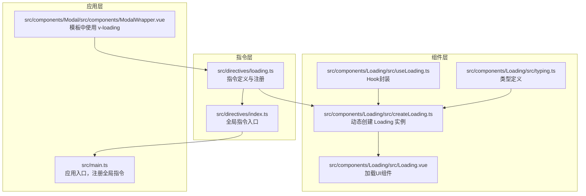
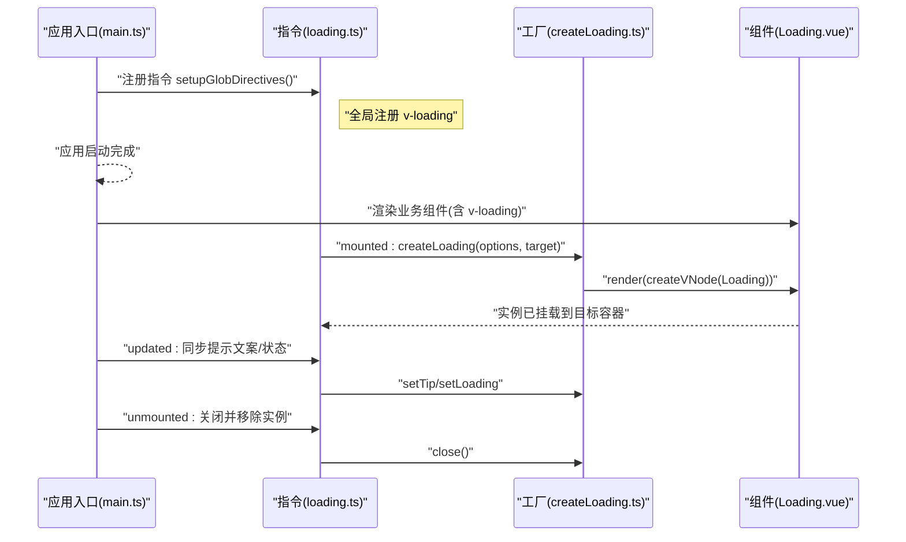
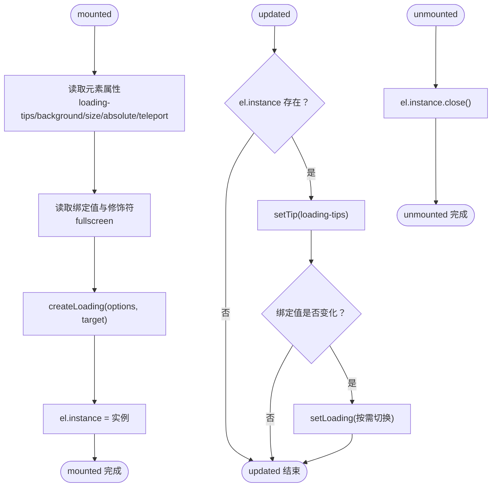
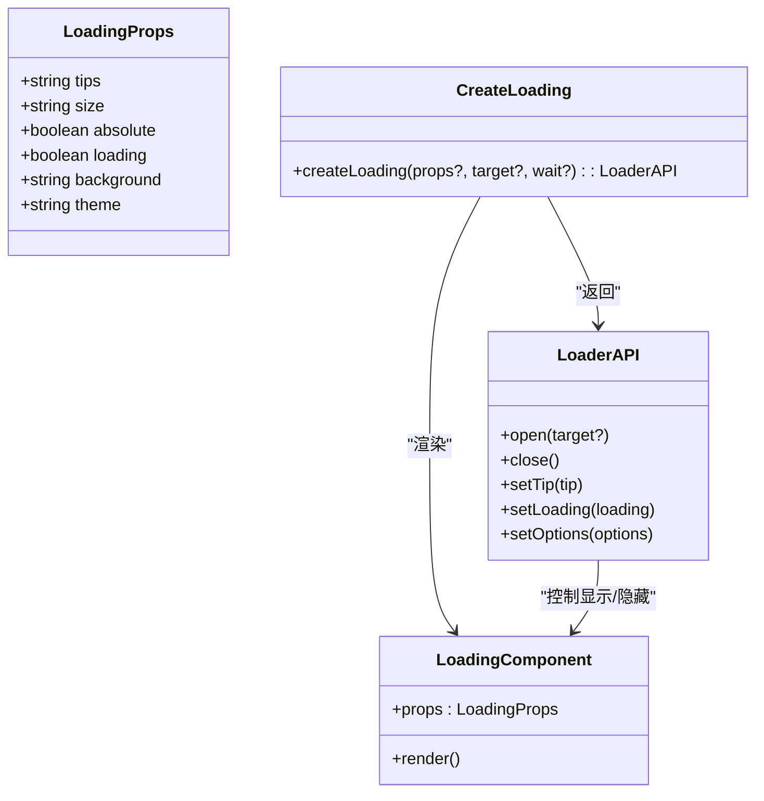
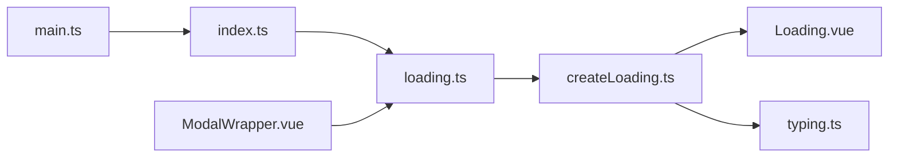

# 自定义指令

<cite>
**本文引用的文件**
- [src/directives/loading.ts](file://src/directives/loading.ts)
- [src/directives/index.ts](file://src/directives/index.ts)
- [src/components/Loading/src/createLoading.ts](file://src/components/Loading/src/createLoading.ts)
- [src/components/Loading/src/useLoading.ts](file://src/components/Loading/src/useLoading.ts)
- [src/components/Loading/src/Loading.vue](file://src/components/Loading/src/Loading.vue)
- [src/components/Loading/src/typing.ts](file://src/components/Loading/src/typing.ts)
- [src/components/Modal/src/components/ModalWrapper.vue](file://src/components/Modal/src/components/ModalWrapper.vue)
- [src/main.ts](file://src/main.ts)
- [src/router/guard/index.ts](file://src/router/guard/index.ts)
- [src/router/guard/permissionGuard.ts](file://src/router/guard/permissionGuard.ts)
</cite>

## 目录
1. [简介](#简介)
2. [项目结构](#项目结构)
3. [核心组件](#核心组件)
4. [架构总览](#架构总览)
5. [详细组件分析](#详细组件分析)
6. [依赖关系分析](#依赖关系分析)
7. [性能考量](#性能考量)
8. [故障排查指南](#故障排查指南)
9. [结论](#结论)
10. [附录](#附录)

## 简介
本文件系统性地文档化了项目中的 v-loading 自定义指令，包括其生命周期钩子 mounted、updated、unmounted 的行为，以及如何通过 createLoading 工厂函数动态创建加载实例。文档还解释了指令如何读取元素属性（loading-tips、loading-background、loading-size）与绑定值控制加载状态；如何在应用启动时全局注册该指令；以及在模板中如何结合 loading-absolute、fullscreen 修饰符实现局部或全屏加载效果。最后，文档给出在表格、表单、自定义组件上的使用示例，并说明与全局加载状态（如路由守卫）的集成方式，强调该指令如何提升用户体验并简化加载逻辑的代码复用。

## 项目结构
v-loading 指令位于 src/directives 目录，配套的 Loading 组件与工厂函数位于 src/components/Loading 目录。应用启动时通过 src/main.ts 注册全局指令，部分业务组件（如 ModalWrapper）在模板中直接使用该指令。

图表来源
- [src/directives/loading.ts](file://src/directives/loading.ts#L1-L46)
- [src/directives/index.ts](file://src/directives/index.ts#L1-L11)
- [src/components/Loading/src/createLoading.ts](file://src/components/Loading/src/createLoading.ts#L1-L76)
- [src/components/Loading/src/useLoading.ts](file://src/components/Loading/src/useLoading.ts#L1-L32)
- [src/components/Loading/src/Loading.vue](file://src/components/Loading/src/Loading.vue#L1-L59)
- [src/components/Loading/src/typing.ts](file://src/components/Loading/src/typing.ts#L1-L11)
- [src/main.ts](file://src/main.ts#L1-L29)
- [src/components/Modal/src/components/ModalWrapper.vue](file://src/components/Modal/src/components/ModalWrapper.vue#L1-L128)

章节来源
- [src/directives/loading.ts](file://src/directives/loading.ts#L1-L46)
- [src/directives/index.ts](file://src/directives/index.ts#L1-L11)
- [src/components/Loading/src/createLoading.ts](file://src/components/Loading/src/createLoading.ts#L1-L76)
- [src/components/Loading/src/useLoading.ts](file://src/components/Loading/src/useLoading.ts#L1-L32)
- [src/components/Loading/src/Loading.vue](file://src/components/Loading/src/Loading.vue#L1-L59)
- [src/components/Loading/src/typing.ts](file://src/components/Loading/src/typing.ts#L1-L11)
- [src/main.ts](file://src/main.ts#L1-L29)
- [src/components/Modal/src/components/ModalWrapper.vue](file://src/components/Modal/src/components/ModalWrapper.vue#L1-L128)

## 核心组件
- v-loading 指令：负责在元素挂载时创建加载实例，在更新时同步提示文案与加载状态，在卸载时清理实例。
- createLoading 工厂：动态渲染 Loading 组件，返回 open/close/setTip/setLoading/setOptions 等方法，支持可选的等待模式（wait）。
- useLoading Hook：对 createLoading 的轻量封装，便于在组合式 API 中使用。
- Loading 组件：承载加载 UI，支持主题、背景、尺寸、绝对定位等配置。
- 类型定义：统一 LoadingProps 接口，约束属性类型与默认值。

章节来源
- [src/directives/loading.ts](file://src/directives/loading.ts#L1-L46)
- [src/components/Loading/src/createLoading.ts](file://src/components/Loading/src/createLoading.ts#L1-L76)
- [src/components/Loading/src/useLoading.ts](file://src/components/Loading/src/useLoading.ts#L1-L32)
- [src/components/Loading/src/Loading.vue](file://src/components/Loading/src/Loading.vue#L1-L59)
- [src/components/Loading/src/typing.ts](file://src/components/Loading/src/typing.ts#L1-L11)

## 架构总览
v-loading 指令通过 DOM 属性与绑定值驱动 createLoading 工厂创建 Loading 实例，并将其挂载到指定容器（元素内或 body）。指令生命周期与 Loading 实例的状态管理形成清晰的数据流。

图表来源
- [src/main.ts](file://src/main.ts#L1-L29)
- [src/directives/index.ts](file://src/directives/index.ts#L1-L11)
- [src/directives/loading.ts](file://src/directives/loading.ts#L1-L46)
- [src/components/Loading/src/createLoading.ts](file://src/components/Loading/src/createLoading.ts#L1-L76)
- [src/components/Loading/src/Loading.vue](file://src/components/Loading/src/Loading.vue#L1-L59)

## 详细组件分析

### 指令生命周期与状态流转
- mounted
  - 从元素属性读取 loading-tips、loading-background、loading-size、loading-absolute、loading-teleport。
  - 从绑定值读取初始加载状态，并根据 fullscreen 修饰符决定绝对定位策略。
  - 调用 createLoading 创建实例并保存到 el.instance，选择目标容器（body 或元素本身）。
- updated
  - 若实例存在，优先更新提示文案；当绑定值发生变化时，仅在需要时切换加载状态，避免不必要的重绘。
- unmounted
  - 清理实例，确保 DOM 节点被移除，防止内存泄漏。

图表来源
- [src/directives/loading.ts](file://src/directives/loading.ts#L1-L46)

章节来源
- [src/directives/loading.ts](file://src/directives/loading.ts#L1-L46)

### 工厂函数 createLoading 的实现与接口
- 输入
  - props：可选的 LoadingProps 配置（tips、size、absolute、loading、background、theme）。
  - target：挂载目标容器，默认 document.body。
  - wait：是否延迟渲染（用于 setup 环境），默认 false。
- 输出
  - 返回对象包含 open、close、setTip、setLoading、setOptions 方法。
- 内部机制
  - 使用响应式数据 data 统一管理 LoadingProps 默认值与用户传入值。
  - 通过 defineComponent + createVNode 渲染 Loading 组件。
  - 支持 open(target) 将实例挂载到指定容器；close() 移除实例。
  - setOptions 可合并新配置，实现动态更新。

图表来源
- [src/components/Loading/src/createLoading.ts](file://src/components/Loading/src/createLoading.ts#L1-L76)
- [src/components/Loading/src/typing.ts](file://src/components/Loading/src/typing.ts#L1-L11)
- [src/components/Loading/src/Loading.vue](file://src/components/Loading/src/Loading.vue#L1-L59)

章节来源
- [src/components/Loading/src/createLoading.ts](file://src/components/Loading/src/createLoading.ts#L1-L76)
- [src/components/Loading/src/typing.ts](file://src/components/Loading/src/typing.ts#L1-L11)
- [src/components/Loading/src/Loading.vue](file://src/components/Loading/src/Loading.vue#L1-L59)

### Hook useLoading 的封装
- 作用
  - 在组合式 API 中便捷地打开/关闭加载与更新提示文案。
- 特点
  - 基于 createLoading，wait 设为 true，适合在 setup 中使用。
  - 返回 [open, close, setTip] 三元组，调用简单。

章节来源
- [src/components/Loading/src/useLoading.ts](file://src/components/Loading/src/useLoading.ts#L1-L32)

### 模板中的使用示例
- 在 ModalWrapper 中，通过 v-loading 控制容器内的加载状态，并使用 loading-tips 动态提示文案。
- 通过 loading-absolute 与 fullscreen 修饰符控制加载覆盖范围（局部 vs 全屏）。
- 通过 loading-teleport 可将加载节点传送至 body，避免定位上下文影响布局。

章节来源
- [src/components/Modal/src/components/ModalWrapper.vue](file://src/components/Modal/src/components/ModalWrapper.vue#L1-L128)
- [src/directives/loading.ts](file://src/directives/loading.ts#L1-L46)

### 全局注册与应用启动流程
- 应用入口 main.ts 调用 setupGlobDirectives(app)，后者调用 setupLoadingDirective(app) 完成全局注册。
- 注册后，所有模板均可直接使用 v-loading 指令。

章节来源
- [src/main.ts](file://src/main.ts#L1-L29)
- [src/directives/index.ts](file://src/directives/index.ts#L1-L11)
- [src/directives/loading.ts](file://src/directives/loading.ts#L1-L46)

### 与路由守卫的集成
- 路由守卫主要负责页面跳转时的消息清理与滚动复位，未直接集成 v-loading。
- 若需在路由切换时显示全局加载，可在导航守卫中结合全局状态或 Hook 方案进行扩展（例如在 beforeEach 中开启全局加载，在 afterEach 中关闭）。

章节来源
- [src/router/guard/index.ts](file://src/router/guard/index.ts#L1-L63)
- [src/router/guard/permissionGuard.ts](file://src/router/guard/permissionGuard.ts#L1-L60)

## 依赖关系分析
- 指令依赖
  - 依赖 createLoading 工厂创建实例。
  - 依赖 Loading 组件作为渲染载体。
- 工厂依赖
  - 依赖 Loading.vue 组件。
  - 依赖 LoadingProps 类型定义。
- 应用依赖
  - main.ts 通过 setupGlobDirectives 注册指令。
  - ModalWrapper 等业务组件在模板中直接使用 v-loading。

图表来源
- [src/directives/loading.ts](file://src/directives/loading.ts#L1-L46)
- [src/components/Loading/src/createLoading.ts](file://src/components/Loading/src/createLoading.ts#L1-L76)
- [src/components/Loading/src/Loading.vue](file://src/components/Loading/src/Loading.vue#L1-L59)
- [src/components/Loading/src/typing.ts](file://src/components/Loading/src/typing.ts#L1-L11)
- [src/main.ts](file://src/main.ts#L1-L29)
- [src/directives/index.ts](file://src/directives/index.ts#L1-L11)
- [src/components/Modal/src/components/ModalWrapper.vue](file://src/components/Modal/src/components/ModalWrapper.vue#L1-L128)

章节来源
- [src/directives/loading.ts](file://src/directives/loading.ts#L1-L46)
- [src/components/Loading/src/createLoading.ts](file://src/components/Loading/src/createLoading.ts#L1-L76)
- [src/components/Loading/src/Loading.vue](file://src/components/Loading/src/Loading.vue#L1-L59)
- [src/components/Loading/src/typing.ts](file://src/components/Loading/src/typing.ts#L1-L11)
- [src/main.ts](file://src/main.ts#L1-L29)
- [src/directives/index.ts](file://src/directives/index.ts#L1-L11)
- [src/components/Modal/src/components/ModalWrapper.vue](file://src/components/Modal/src/components/ModalWrapper.vue#L1-L128)

## 性能考量
- 仅在绑定值变化时切换加载状态，减少不必要的渲染与 DOM 操作。
- 通过 loading-teleport 将加载节点传送至 body，避免复杂定位上下文带来的重排。
- 使用响应式数据集中管理 LoadingProps，setOptions 可增量更新，降低重复创建成本。
- 在 setup 环境中使用 useLoading 时启用 wait，避免在组件尚未挂载时渲染造成的开销。

章节来源
- [src/directives/loading.ts](file://src/directives/loading.ts#L1-L46)
- [src/components/Loading/src/createLoading.ts](file://src/components/Loading/src/createLoading.ts#L1-L76)
- [src/components/Loading/src/useLoading.ts](file://src/components/Loading/src/useLoading.ts#L1-L32)

## 故障排查指南
- 指令未生效
  - 确认已在应用入口注册全局指令。
  - 检查模板中是否正确使用 v-loading 指令与属性。
- 加载状态不更新
  - 确保绑定值在 updated 生命周期前后发生变化，否则不会触发状态切换。
  - 检查 loading-tips 属性是否正确传递。
- 全屏/局部加载不符合预期
  - fullscreen 修饰符与 loading-absolute 属性共同决定绝对定位策略，请确认二者的组合使用。
  - 如需将加载节点传送至 body，使用 loading-teleport。
- 卸载后残留
  - 确保 unmounted 生命周期执行了 close()，避免 DOM 泄漏。

章节来源
- [src/main.ts](file://src/main.ts#L1-L29)
- [src/directives/index.ts](file://src/directives/index.ts#L1-L11)
- [src/directives/loading.ts](file://src/directives/loading.ts#L1-L46)

## 结论
v-loading 自定义指令通过简洁的生命周期钩子与 createLoading 工厂函数，实现了对加载状态的统一管理与灵活控制。它既能在局部容器内提供精准的加载反馈，也能通过修饰符与属性实现全屏覆盖。配合全局注册与 Hook 封装，开发者可以在模板与组合式 API 中快速复用加载逻辑，显著提升开发效率与用户体验。

## 附录
- 指令属性与修饰符
  - 属性：loading-tips、loading-background、loading-size、loading-absolute、loading-teleport
  - 修饰符：fullscreen
- 使用建议
  - 在复杂容器中优先使用 loading-absolute 与 loading-teleport，保证加载覆盖准确。
  - 在路由切换场景中，可结合全局状态或 Hook 扩展全局加载提示。
  - 对于频繁切换的加载状态，尽量保持绑定值稳定，减少不必要的状态变更。