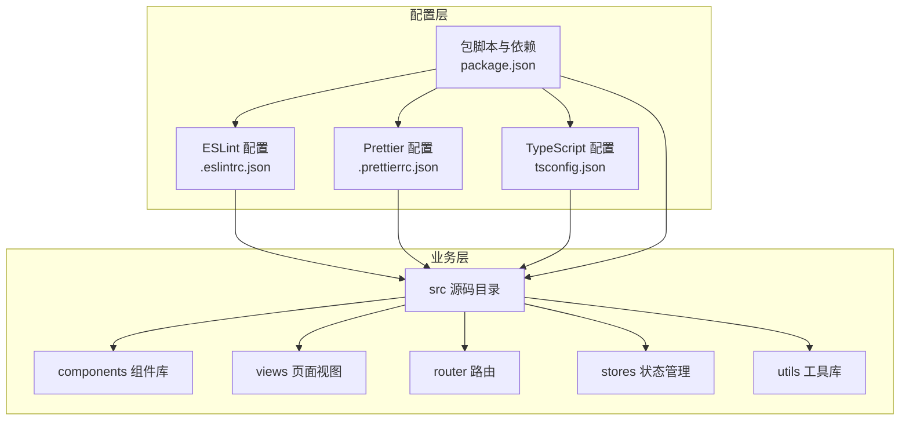
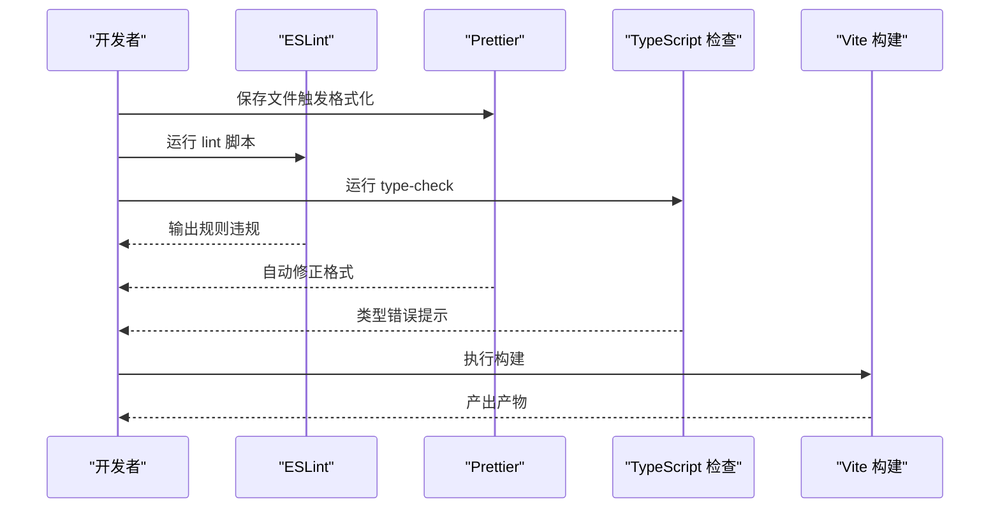
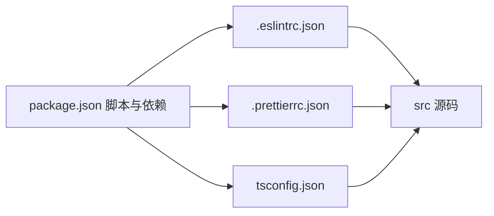

# 开发规范

<cite>
**本文引用的文件**
- [.eslintrc.json](file://.eslintrc.json)
- [.prettierrc.json](file://.prettierrc.json)
- [tsconfig.json](file://tsconfig.json)
- [package.json](file://package.json)
- [src/components/Countdown/src/CountButton.vue](file://src/components/Countdown/src/CountButton.vue)
- [src/components/Form/src/BasicForm.vue](file://src/components/Form/src/BasicForm.vue)
- [src/components/Modal/src/BasicModal.vue](file://src/components/Modal/src/BasicModal.vue)
- [src/utils/treeHelper.ts](file://src/utils/treeHelper.ts)
- [src/router/index.ts](file://src/router/index.ts)
</cite>

## 目录
1. [简介](#简介)
2. [项目结构](#项目结构)
3. [核心规范](#核心规范)
4. [架构总览](#架构总览)
5. [详细组件分析](#详细组件分析)
6. [依赖关系分析](#依赖关系分析)
7. [性能考量](#性能考量)
8. [故障排查指南](#故障排查指南)
9. [结论](#结论)
10. [附录](#附录)

## 简介
本文件旨在制定并文档化项目的统一开发规范，围绕以下关键配置展开：
- ESLint 规则：代码风格、潜在错误与最佳实践
- Prettier 格式化规则：缩进、引号、行尾等一致性
- TypeScript 编译选项：target、module、strict 等对质量与兼容性的影响
- 组件命名与文件组织约定：提升可读性与可维护性
- Git 提交信息约定：便于追溯与自动化流程

通过这些规范，确保团队成员在风格、质量与协作上保持一致。

## 项目结构
项目采用基于功能域的分层组织方式，前端主体位于 src 目录，核心配置集中在根目录的 ESLint、Prettier 与 TypeScript 配置文件中。组件按功能划分为 Application、Basic、Countdown、Form、Icon、Loading、Modal、Scrollbar、Table/types 等目录，配合 hooks、stores、router、utils 等支撑模块，形成清晰的职责边界。

图表来源
- [package.json](file://package.json#L1-L65)
- [.eslintrc.json](file://.eslintrc.json#L1-L67)
- [.prettierrc.json](file://.prettierrc.json#L1-L14)
- [tsconfig.json](file://tsconfig.json#L1-L126)

章节来源
- [package.json](file://package.json#L1-L65)

## 核心规范

### 一、ESLint 规则与最佳实践
- 扩展与解析
  - 扩展了 Vue 3 基础规则集、TypeScript 推荐规则与 Prettier 集成（跳过格式化），确保风格统一且避免重复格式化冲突。
  - 解析器选项设置为最新语法版本，支持现代 JavaScript/TypeScript 特性。
- 关键规则说明
  - 禁止未使用变量：对带前缀下划线的忽略模式生效，鼓励显式命名与清理无用变量。
  - 关闭部分严格规则：如 ban-ts-ignore、no-explicit-any、ban-types、no-non-null-assertion、explicit-module-boundary-types 等，降低初期开发摩擦，但需在关键模块谨慎使用并逐步收紧。
  - Vue 属性顺序、多字组件名、保留组件名等规则关闭，以提升开发效率；建议团队在 PR 审查中通过静态检查与代码评审补充约束。
  - 自闭合标签策略：HTML 空元素强制自闭合，SVG/Math 强制自闭合，普通 HTML 组件不强制，保持灵活性。
- 建议
  - 在团队内约定：新增或重构模块时，逐步收紧上述关闭规则，优先保证类型安全与可读性。
  - 对于复杂逻辑与公共库，建议开启更严格的规则（如 no-unused-vars 的严格模式）。

章节来源
- [.eslintrc.json](file://.eslintrc.json#L1-L67)

### 二、Prettier 格式化规则
- 行宽与分号：行宽较大、不加分号，适合现代前端生态与 Vue 单文件组件的可读性。
- 缩进与样式缩进：使用 2 空格缩进，并对 script/style 区域进行整体缩进，提升嵌套结构清晰度。
- 引号策略：单引号与 JSX 单引号均关闭，遵循团队偏好；建议在团队内统一选择一种并在 CI 中校验。
- 尾逗号：启用“全部”尾逗号，减少合并冲突与 diff 体积。
- HTML 白空敏感度：严格模式，避免因空白导致的渲染差异。
- 结束符：自动识别平台换行，避免跨平台差异。
- 建议
  - 在 IDE 中启用保存即格式化，结合 pre-commit 钩子统一格式化，确保提交内容一致。

章节来源
- [.prettierrc.json](file://.prettierrc.json#L1-L14)

### 三、TypeScript 编译选项与质量控制
- 目标与模块
  - target/module 设为 ESNext，确保使用现代语法与特性，同时由构建工具进一步降级与打包。
  - moduleResolution 采用 bundler，适配现代打包器（Vite/Webpack），提升模块解析效率与兼容性。
- 路径别名
  - 通过 paths 定义 /@/*、/#/*、/&/* 别名，简化导入路径，提升可读性与迁移便利性。
- 类型与严格性
  - strict 启用，提升整体类型安全；noImplicitAny 关闭，允许过渡期的隐式 any，建议逐步收敛。
  - skipLibCheck 启用，加速编译过程，尤其在引入大量第三方库时。
- 互操作与文件名一致性
  - esModuleInterop 启用，增强 CommonJS 与 ESM 的互操作；forceConsistentCasingInFileNames 保证大小写一致，避免跨平台差异。
- 建议
  - 在 CI 中运行 type-check，确保类型安全；对新增模块逐步收紧 noImplicitAny 等规则。

章节来源
- [tsconfig.json](file://tsconfig.json#L1-L126)

### 四、组件命名与文件组织约定
- 组件命名
  - 采用帕斯卡命名法（如 BasicForm、BasicModal），与 Vue 组件注册与模板使用保持一致。
  - 复杂组件拆分为多文件（如 Modal/src 下的组件、hooks、props、typing 等），并通过 index.ts 汇总导出，便于消费与维护。
- 文件组织
  - 功能域内按 src/components/<Feature>/index.ts 与 src/components/<Feature>/src/ 的结构组织，减少深层嵌套。
  - 类型定义集中于 types 目录，避免分散在各处。
- 导出与别名
  - 通过路径别名 /@/* 指向 src，简化导入路径；在组件入口 index.ts 中统一导出，减少消费者心智负担。
- 建议
  - 新增组件时，先设计 props/typing，再实现逻辑，最后完善样式与测试；保持单一职责与高内聚。

章节来源
- [src/components/Countdown/src/CountButton.vue](file://src/components/Countdown/src/CountButton.vue#L1-L55)
- [src/components/Form/src/BasicForm.vue](file://src/components/Form/src/BasicForm.vue#L1-L54)
- [src/components/Modal/src/BasicModal.vue](file://src/components/Modal/src/BasicModal.vue#L1-L168)
- [tsconfig.json](file://tsconfig.json#L1-L126)

### 五、Git 提交信息约定
- 类型与格式
  - 类型：feat、fix、docs、style、refactor、perf、test、build、ci、chore、revert
  - 格式：type(scope): subject
- 示例
  - feat(components): 新增倒计时按钮组件
  - fix(router): 修复路由重置逻辑
  - refactor(utils): 优化树工具函数
- 建议
  - 在提交前执行 lint 与 format，确保变更符合规范；在 PR 描述中简述改动动机与影响范围。

## 架构总览
下图展示从开发到构建的关键流程，以及配置文件在其中的作用：

图表来源
- [package.json](file://package.json#L1-L65)
- [.eslintrc.json](file://.eslintrc.json#L1-L67)
- [.prettierrc.json](file://.prettierrc.json#L1-L14)
- [tsconfig.json](file://tsconfig.json#L1-L126)

## 详细组件分析

### 组件 A：Countdown/CountButton
- 设计要点
  - Props 明确：倒计时时长、禁用状态、参数、异步发送接口等，便于复用与测试。
  - 状态管理：内部使用 useCountdown 管理倒计时状态，计算属性组合文案与禁用态。
  - 交互逻辑：watch 参数变化重置倒计时；调用 api 成功后启动倒计时；异常捕获与 loading 控制。
- 规范契合点
  - 使用 TypeScript Props 类型约束，体现严格类型检查的价值。
  - 通过 $attrs 透传，保持组件可扩展性。
- 建议
  - 对外暴露的 API 应在 index.ts 中统一导出，便于消费者按需引入。

章节来源
- [src/components/Countdown/src/CountButton.vue](file://src/components/Countdown/src/CountButton.vue#L1-L55)

### 组件 B：Form/BasicForm
- 设计要点
  - 通过 schema 驱动渲染，支持插槽扩展头部与底部，满足多样化表单场景。
  - 计算属性组合 Ant Design Vue 的 Form Props，避免冗余传递。
  - 使用 buildClass 生成前缀类名，统一样式体系。
- 规范契合点
  - 组件命名与文件组织清晰，props/typing 分离，利于维护。
- 建议
  - 对复杂表单场景，建议在 index.ts 中导出常用组合（如 BasicForm + FormItem），减少样板代码。

章节来源
- [src/components/Form/src/BasicForm.vue](file://src/components/Form/src/BasicForm.vue#L1-L54)

### 组件 C：Modal/BasicModal
- 设计要点
  - 通过插槽与组合组件（Header/Footer/Wrapper/Close）实现高可定制性。
  - 支持全屏、拖拽、高度调整、loading 等能力，统一对外 API。
  - 使用 merge 与 watchEffect 管理属性合并与响应式更新。
- 规范契合点
  - 通过 hooks 与 typing 将复杂逻辑解耦，提升可测试性与可维护性。
- 建议
  - 在 index.ts 中导出常用方法（如 register、redoModalHeight），便于外部调用。

章节来源
- [src/components/Modal/src/BasicModal.vue](file://src/components/Modal/src/BasicModal.vue#L1-L168)

### 工具模块：treeHelper
- 设计要点
  - 提供 filter、treeMap、treeMapEach、findPath 等树形结构常用操作，支持自定义字段映射。
  - 使用泛型与可选配置，兼顾通用性与易用性。
- 规范契合点
  - 通过明确的接口与注释，降低使用成本，提升可读性。
- 建议
  - 在大型项目中，建议为高频使用的树操作建立单元测试，保障稳定性。

章节来源
- [src/utils/treeHelper.ts](file://src/utils/treeHelper.ts#L1-L96)

### 路由模块：router
- 设计要点
  - 白名单机制与动态路由重置，便于权限与菜单联动。
  - 严格模式与滚动行为统一，提升用户体验。
- 规范契合点
  - 通过类型约束与导出函数，确保路由初始化与重置流程清晰可控。
- 建议
  - 在权限变更时，结合 resetRouter 与动态导入，确保路由状态一致。

章节来源
- [src/router/index.ts](file://src/router/index.ts#L1-L39)

## 依赖关系分析
- 配置与脚本
  - package.json 中 scripts 定义了 dev、build、type-check、lint、format、test 等命令，分别对应开发、构建、类型检查、代码质量与测试。
  - 依赖中包含 ESLint、Prettier、TypeScript、Vue 生态相关插件，确保工具链一致。
- 配置文件之间的耦合
  - ESLint 与 Prettier 通过集成包协同工作，避免格式化冲突。
  - tsconfig.json 的 paths 与 moduleResolution 与构建工具（Vite）共同决定模块解析与别名解析行为。
- 建议
  - 在 CI 中统一执行 lint 与 type-check，确保提交质量；在本地 IDE 中启用保存即格式化与 ESLint 实时检查。

图表来源
- [package.json](file://package.json#L1-L65)
- [.eslintrc.json](file://.eslintrc.json#L1-L67)
- [.prettierrc.json](file://.prettierrc.json#L1-L14)
- [tsconfig.json](file://tsconfig.json#L1-L126)

章节来源
- [package.json](file://package.json#L1-L65)

## 性能考量
- 编译与类型检查
  - 启用 skipLibCheck 可显著缩短编译时间，尤其在依赖众多时；建议在 CI 中仍保留 type-check 以保证质量。
- 模块解析
  - 使用 bundler 模式解析模块，配合路径别名，减少解析开销与路径层级。
- 格式化与检查
  - 在本地启用保存即格式化与实时 ESLint，减少提交阶段的失败与重试成本。

## 故障排查指南
- ESLint 报错
  - 若出现“未使用变量”或“未定义”，请检查变量命名是否符合忽略模式或是否应删除。
  - 对于 Vue 属性顺序或组件命名规则，可在团队内统一约定并通过审查补足。
- Prettier 格式化冲突
  - 确保编辑器已启用保存即格式化；若与 ESLint 冲突，请确认已正确安装并启用 Prettier 集成规则。
- TypeScript 类型错误
  - 在 CI 中运行 type-check，定位具体文件与行号；逐步收敛 noImplicitAny 等规则。
- 构建失败
  - 检查 tsconfig.json 的 paths 与 moduleResolution 设置是否与构建工具一致；确认依赖版本兼容。

章节来源
- [.eslintrc.json](file://.eslintrc.json#L1-L67)
- [.prettierrc.json](file://.prettierrc.json#L1-L14)
- [tsconfig.json](file://tsconfig.json#L1-L126)
- [package.json](file://package.json#L1-L65)

## 结论
通过统一的 ESLint、Prettier 与 TypeScript 配置，结合组件命名与文件组织约定，以及 Git 提交信息规范，能够有效提升团队协作效率与代码质量。建议在团队内定期回顾与迭代这些规范，逐步收紧规则以获得更高的类型安全与可维护性。

## 附录

### A. 常用脚本与用途
- dev：启动开发服务器
- build：构建生产包
- preview：预览构建结果
- build-only：仅构建
- type-check：类型检查
- lint：代码质量检查并自动修复
- format：格式化指定目录
- test/test:preview：运行测试与 UI

章节来源
- [package.json](file://package.json#L1-L65)

### B. 组件导出与别名使用示例
- 通过 /@/* 别名导入组件，例如：import BasicForm from "/@/components/Form/src/BasicForm.vue"
- 在 index.ts 中统一导出，便于按需引入与 Tree-shaking

章节来源
- [tsconfig.json](file://tsconfig.json#L1-L126)
- [src/components/Form/src/BasicForm.vue](file://src/components/Form/src/BasicForm.vue#L1-L54)