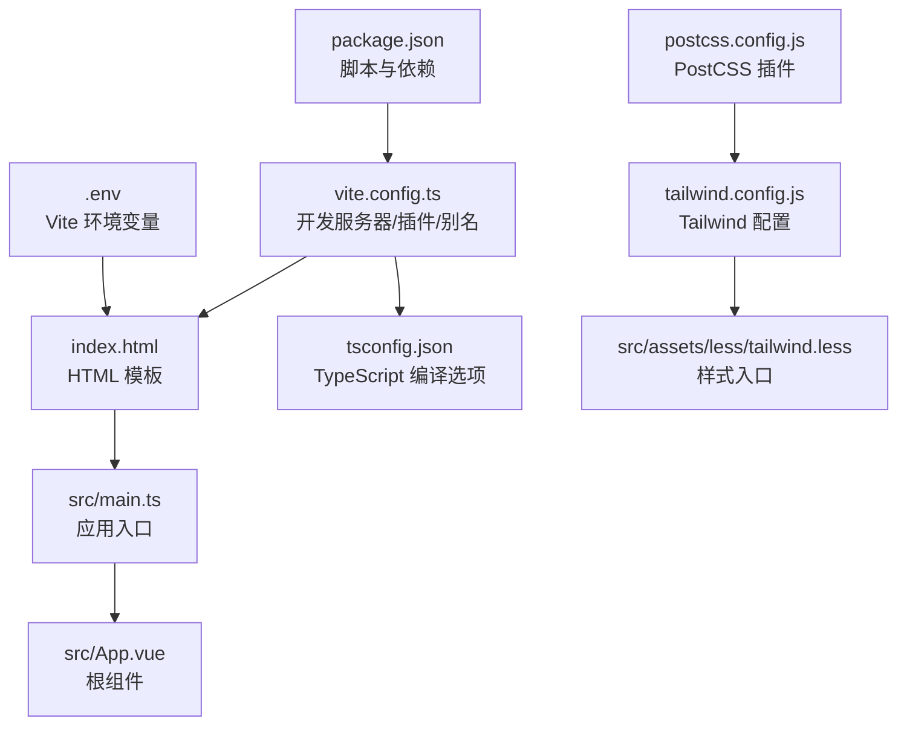
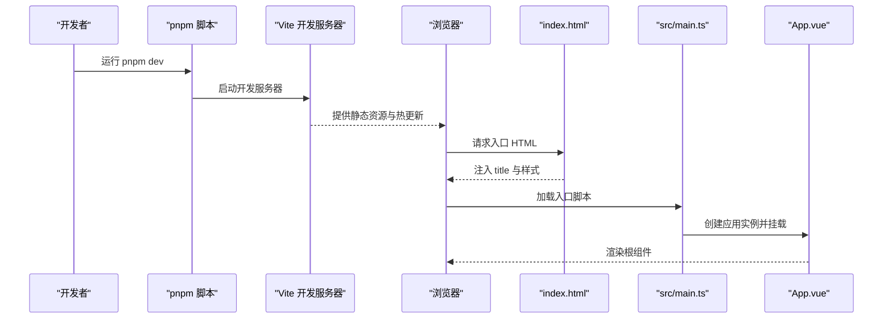
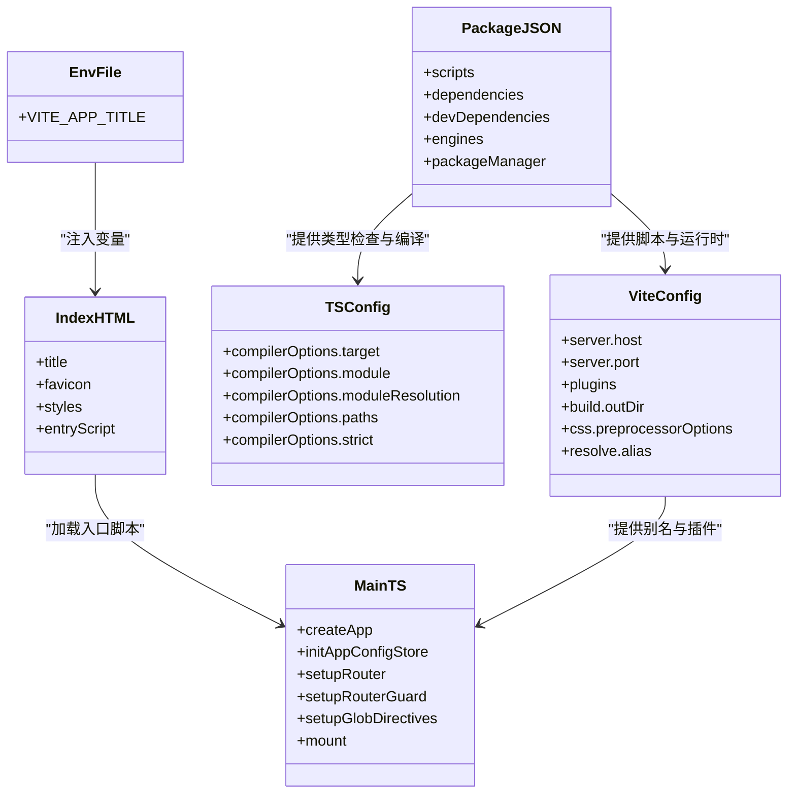

# 快速开始

<cite>
**本文引用的文件**
- [package.json](file://package.json)
- [vite.config.ts](file://vite.config.ts)
- [tsconfig.json](file://tsconfig.json)
- [.env](file://.env)
- [index.html](file://index.html)
- [src/main.ts](file://src/main.ts)
- [src/config/project.ts](file://src/config/project.ts)
- [postcss.config.js](file://postcss.config.js)
- [tailwind.config.js](file://tailwind.config.js)
- [env.d.ts](file://env.d.ts)
</cite>

## 更新摘要
**已更新内容**
- 更新了“环境与依赖准备”部分，将 Node.js 版本要求从“18+”精确为“>=18 且 <=24”，并明确指出 `package.json` 中的 `engines` 字段和 `packageManager` 字段用于确保环境一致性。
- 在“核心组件”和“故障排查指南”中同步更新了 Node.js 版本范围。
- 更新了“项目结构”和“架构总览”中的相关图表，以反映最新的依赖管理实践。

## 目录
1. [简介](#简介)
2. [项目结构](#项目结构)
3. [核心组件](#核心组件)
4. [架构总览](#架构总览)
5. [详细组件分析](#详细组件分析)
6. [依赖关系分析](#依赖关系分析)
7. [性能注意事项](#性能注意事项)
8. [故障排查指南](#故障排查指南)
9. [结论](#结论)
10. [附录](#附录)

## 简介
本指南面向首次接触 voir-ui 的开发者，帮助你在本地环境中快速完成环境准备、依赖安装、开发启动、构建与预览，并解释关键配置项的作用。你将学会：
- 准备最低环境要求（Node.js >=18 且 <=24、pnpm 包管理器）
- 通过 pnpm 安装依赖、启动开发服务器、构建生产包、预览构建结果
- 结合 vite.config.ts 了解开发服务器端口、插件与别名等配置
- 基于 tsconfig.json 理解 TypeScript 编译选项
- 使用 .env 配置应用标题、API 基础路径等环境变量
- 排查常见初始化问题（依赖安装失败、端口冲突等）

**Section sources**
- [package.json](file://package.json#L1-L65)
- [vite.config.ts](file://vite.config.ts#L1-L72)
- [tsconfig.json](file://tsconfig.json#L1-L126)
- [.env](file://.env#L1-L1)
- [index.html](file://index.html#L1-L27)
- [src/main.ts](file://src/main.ts#L1-L29)

## 项目结构
voir-ui 是一个基于 Vue 3 + Vite 的前端工程，采用现代打包工具与 TypeScript 编译配置，配合 Tailwind CSS 实现样式体系。项目主要由以下部分组成：
- 根目录脚本与依赖：通过 package.json 提供开发、构建、预览与格式化等脚本
- 构建配置：vite.config.ts 定义开发服务器、插件、别名与构建输出
- 类型配置：tsconfig.json 控制 TypeScript 编译行为与模块解析策略
- 环境变量：.env 提供前端可访问的 Vite 环境变量
- 入口与模板：index.html 作为 HTML 模板，src/main.ts 作为应用入口
- 样式与工具链：postcss.config.js 与 tailwind.config.js 配置样式处理流程

**Diagram sources**
- [package.json](file://package.json#L1-L65)
- [vite.config.ts](file://vite.config.ts#L1-L72)
- [index.html](file://index.html#L1-L27)
- [src/main.ts](file://src/main.ts#L1-L29)
- [tsconfig.json](file://tsconfig.json#L1-L126)
- [.env](file://.env#L1-L1)
- [postcss.config.js](file://postcss.config.js#L1-L14)
- [tailwind.config.js](file://tailwind.config.js#L1-L21)

**Section sources**
- [package.json](file://package.json#L1-L65)
- [vite.config.ts](file://vite.config.ts#L1-L72)
- [tsconfig.json](file://tsconfig.json#L1-L126)
- [.env](file://.env#L1-L1)
- [index.html](file://index.html#L1-L27)
- [src/main.ts](file://src/main.ts#L1-L29)
- [postcss.config.js](file://postcss.config.js#L1-L14)
- [tailwind.config.js](file://tailwind.config.js#L1-L21)

## 核心组件
- 开发脚本与依赖管理
  - 使用 pnpm 作为包管理器，确保版本满足 engines 要求（Node.js >=18 且 <=24）
  - 常用脚本：dev、build、preview、type-check、lint、format、test 等
- 开发服务器与构建
  - Vite 提供热更新开发服务器，默认监听端口可在 vite.config.ts 中查看
  - 构建产物输出到 dist 目录，Rollup 打包策略在 vite.config.ts 中配置
- TypeScript 编译
  - tsconfig.json 控制目标语言、模块解析、路径别名、严格模式等
- 环境变量
  - .env 中的 VITE_* 变量在前端可直接访问，例如应用标题
- 样式与工具链
  - Tailwind CSS 与 PostCSS 集成，按需启用 cssnano 生产优化

**Section sources**
- [package.json](file://package.json#L1-L65)
- [vite.config.ts](file://vite.config.ts#L1-L72)
- [tsconfig.json](file://tsconfig.json#L1-L126)
- [.env](file://.env#L1-L1)
- [postcss.config.js](file://postcss.config.js#L1-L14)
- [tailwind.config.js](file://tailwind.config.js#L1-L21)

## 架构总览
下面的序列图展示了从启动到页面渲染的关键流程，包括开发服务器启动、HTML 模板注入、入口脚本挂载与组件渲染。

**Diagram sources**
- [package.json](file://package.json#L1-L65)
- [vite.config.ts](file://vite.config.ts#L1-L72)
- [index.html](file://index.html#L1-L27)
- [src/main.ts](file://src/main.ts#L1-L29)

**Section sources**
- [package.json](file://package.json#L1-L65)
- [vite.config.ts](file://vite.config.ts#L1-L72)
- [index.html](file://index.html#L1-L27)
- [src/main.ts](file://src/main.ts#L1-L29)

## 详细组件分析

### 环境与依赖准备
- 最低环境要求
  - **Node.js 版本范围**：根据 `package.json` 中的 `engines` 字段，要求 Node.js 版本必须满足 `>=18 且 <=24`。这比之前的 `18+` 更加严格，确保了在 Node.js 25 等未来版本发布时，项目仍能保持稳定。
  - **包管理器**：项目强制使用 pnpm，`package.json` 中的 `packageManager` 字段明确指定为 `pnpm@9.15.0`，以保证所有开发者使用完全一致的包管理器版本，避免因包管理器差异导致的依赖问题。
- 安装依赖
  - 在项目根目录执行 `pnpm install` 命令，等待依赖下载完成。
- 启动开发服务器
  - 运行 `pnpm dev` 脚本，Vite 将启动本地开发服务器并自动打开浏览器。
- 生产构建
  - 执行 `pnpm build` 脚本，生成 dist 目录中的静态资源。
- 预览构建结果
  - 使用 `pnpm preview` 脚本在本地查看构建产物。

**Section sources**
- [package.json](file://package.json#L1-L65)

### Vite 配置详解（vite.config.ts）
- 开发服务器
  - 主机与端口：开发服务器对外可访问，端口在配置中设定为 `4075`。
- 插件生态
  - Vue 插件与 Vue JSX 支持
  - 组件自动导入与 Ant Design Vue 解析器集成
- 构建输出
  - 输出目录、压缩策略、Rollup 分包策略预留
- CSS 预处理
  - Less 变量注入，Ant Design Vue 前缀映射
- 路径别名
  - /@ 指向 src、/# 指向 types、/& 指向 build，便于模块导入
- esbuild 优化
  - 生产环境下对 console 等纯函数进行剔除（取决于配置）

**Section sources**
- [vite.config.ts](file://vite.config.ts#L1-L72)
- [src/config/project.ts](file://src/config/project.ts#L1-L39)

### TypeScript 编译选项（tsconfig.json）
- 目标与模块
  - 目标语言与模块系统，影响最终代码形态与运行时兼容性
- 模块解析策略
  - 使用 bundler 解析，适配现代打包工具（如 Vite）
- 路径别名
  - 与 Vite 别名保持一致，提升导入体验
- 严格模式与类型检查
  - 严格类型检查、跳过库类型检查等选项，平衡性能与安全性
- include/exclude
  - 明确纳入与排除的文件范围，避免无关文件参与编译

**Section sources**
- [tsconfig.json](file://tsconfig.json#L1-L126)

### 环境变量与模板注入（.env 与 index.html）
- 环境变量
  - .env 中的 VITE_* 变量在前端可直接访问
  - 应用标题示例：VITE_APP_TITLE
- 模板注入
  - index.html 中的 title 与页面内容会替换为 Vite 注入的变量
  - 入口脚本在模板中加载，随后由 main.ts 挂载应用

**Section sources**
- [.env](file://.env#L1-L1)
- [index.html](file://index.html#L1-L27)
- [src/main.ts](file://src/main.ts#L1-L29)

### 样式与工具链（postcss.config.js 与 tailwind.config.js）
- PostCSS 插件
  - Tailwind CSS、Autoprefixer、生产环境 cssnano
- Tailwind 配置
  - 内容扫描范围、深色模式选择器、主题扩展等
- 样式入口
  - main.ts 引入 tailwind.less，确保样式体系生效

**Section sources**
- [postcss.config.js](file://postcss.config.js#L1-L14)
- [tailwind.config.js](file://tailwind.config.js#L1-L21)
- [src/main.ts](file://src/main.ts#L1-L29)

## 依赖关系分析
下面的类图展示了关键配置与入口之间的依赖关系，帮助你理解各文件如何协同工作。

**Diagram sources**
- [package.json](file://package.json#L1-L65)
- [vite.config.ts](file://vite.config.ts#L1-L72)
- [tsconfig.json](file://tsconfig.json#L1-L126)
- [.env](file://.env#L1-L1)
- [index.html](file://index.html#L1-L27)
- [src/main.ts](file://src/main.ts#L1-L29)

**Section sources**
- [package.json](file://package.json#L1-L65)
- [vite.config.ts](file://vite.config.ts#L1-L72)
- [tsconfig.json](file://tsconfig.json#L1-L126)
- [.env](file://.env#L1-L1)
- [index.html](file://index.html#L1-L27)
- [src/main.ts](file://src/main.ts#L1-L29)

## 性能注意事项
- 构建优化
  - 生产环境启用压缩与体积报告，合理设置 chunkSizeWarningLimit
  - 可根据业务拆分大依赖，减少首屏体积
- 样式优化
  - Tailwind 按需扫描内容，避免无用样式进入产物
  - 生产环境启用 cssnano 以减小 CSS 体积
- 编译效率
  - 跳过库类型检查可加速编译，但需确保类型声明完整
  - 使用 bundler 模块解析，减少 Node 风格解析开销

**Section sources**
- [vite.config.ts](file://vite.config.ts#L1-L72)
- [postcss.config.js](file://postcss.config.js#L1-L14)
- [tailwind.config.js](file://tailwind.config.js#L1-L21)
- [tsconfig.json](file://tsconfig.json#L1-L126)

## 故障排查指南
- 依赖安装失败
  - **确认 Node.js 版本满足 engines 要求（>=18 且 <=24）**。这是本次更新的重点，确保使用符合范围的 Node.js 版本是成功安装依赖的前提。
  - 确保使用 pnpm 作为包管理器，版本在 package.json 中声明
  - 若网络受限，建议配置 pnpm 源或使用代理
- 端口冲突
  - 开发服务器默认端口可在 vite.config.ts 中查看与修改
  - 如端口被占用，调整配置后重启开发服务器
- 环境变量不生效
  - 确认变量键名以 VITE_ 前缀开头
  - 修改 .env 后需重启开发服务器以重新注入
- 样式异常
  - 检查 Tailwind 配置的内容扫描范围与深色模式选择器
  - 确认 main.ts 已引入 tailwind.less
- 构建产物异常
  - 检查构建输出目录与 Rollup 分包策略
  - 生产环境样式优化可能影响调试，可临时关闭 cssnano 进行对比

**Section sources**
- [package.json](file://package.json#L1-L65)
- [vite.config.ts](file://vite.config.ts#L1-L72)
- [.env](file://.env#L1-L1)
- [postcss.config.js](file://postcss.config.js#L1-L14)
- [tailwind.config.js](file://tailwind.config.js#L1-L21)
- [src/main.ts](file://src/main.ts#L1-L29)

## 结论
通过本指南，你可以快速在本地搭建 voir-ui 开发环境，理解关键配置项的作用，并掌握日常开发与构建流程。遇到问题时，可依据“故障排查指南”逐项定位与解决。随着项目演进，建议持续关注 Vite、TypeScript 与 Tailwind 的最佳实践，以获得更佳的开发体验与构建性能。

## 附录
- 常用命令
  - 安装依赖：`pnpm install`
  - 启动开发服务器：`pnpm dev`
  - 生产构建：`pnpm build`
  - 预览构建结果：`pnpm preview`
- 关键配置参考
  - 开发服务器端口与主机：参见 vite.config.ts
  - TypeScript 编译选项：参见 tsconfig.json
  - 环境变量：参见 .env 与 index.html
  - 样式工具链：参见 postcss.config.js 与 tailwind.config.js

**Section sources**
- [package.json](file://package.json#L1-L65)
- [vite.config.ts](file://vite.config.ts#L1-L72)
- [tsconfig.json](file://tsconfig.json#L1-L126)
- [.env](file://.env#L1-L1)
- [index.html](file://index.html#L1-L27)
- [postcss.config.js](file://postcss.config.js#L1-L14)
- [tailwind.config.js](file://tailwind.config.js#L1-L21)