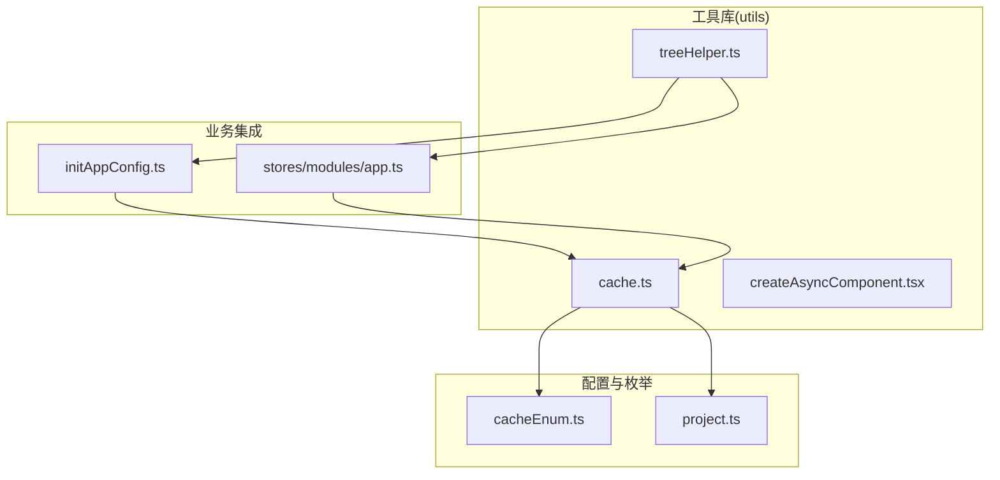
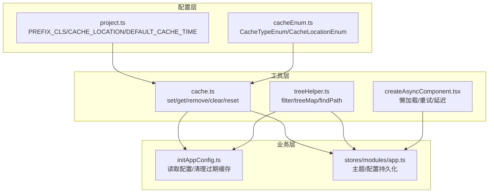
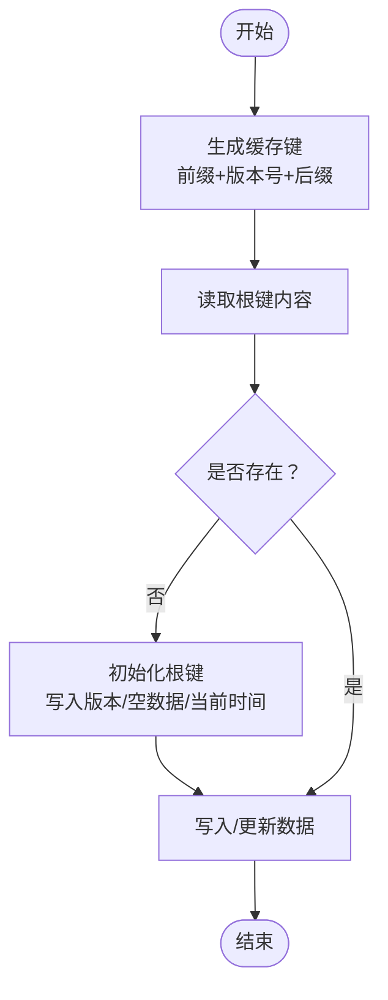
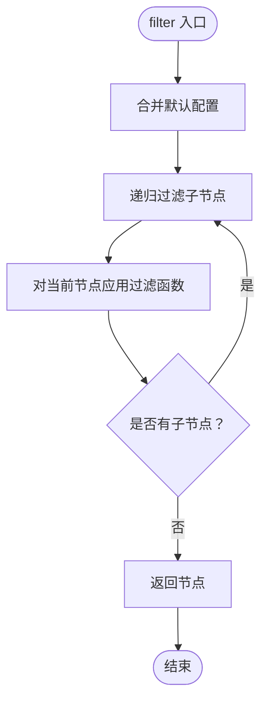
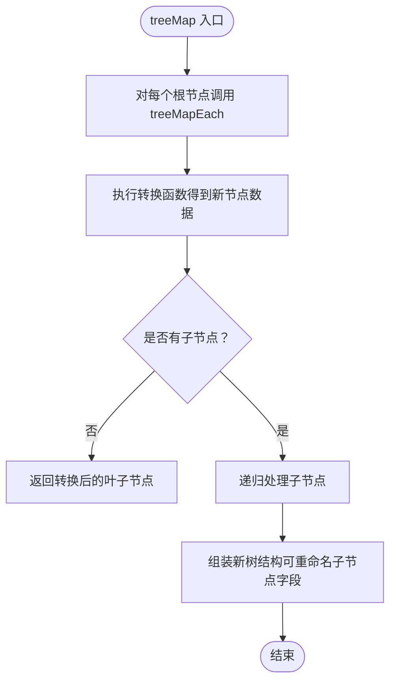
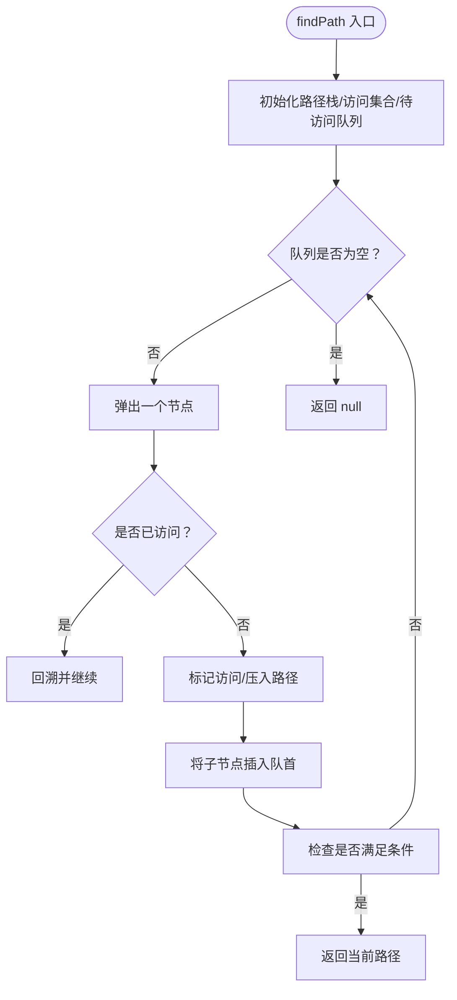
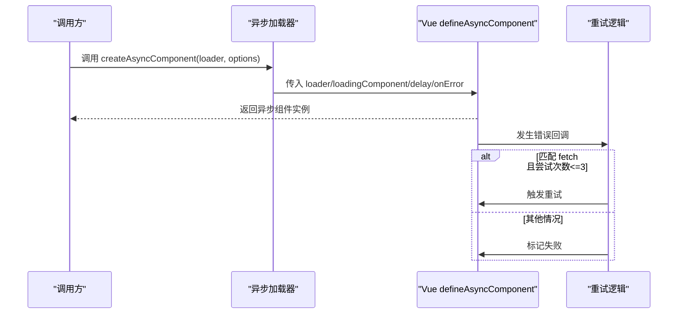
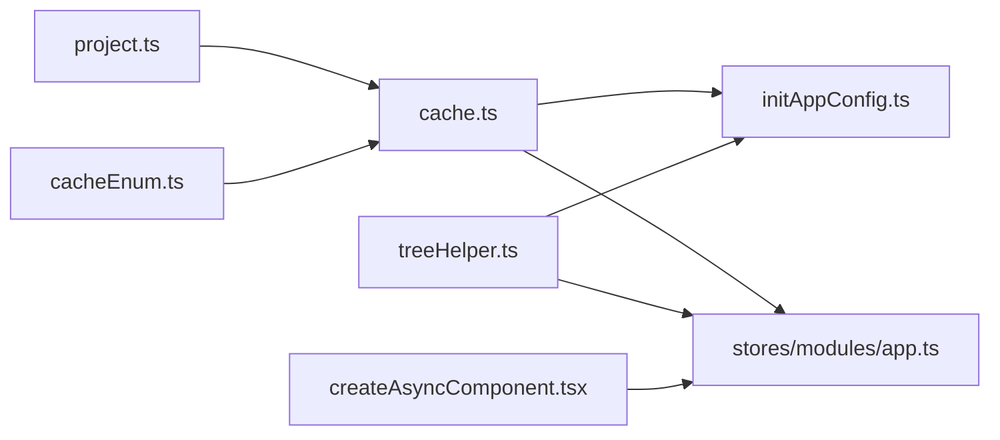

# 工具库

<cite>
**本文引用的文件**
- [cache.ts](file://src/utils/cache.ts)
- [treeHelper.ts](file://src/utils/treeHelper.ts)
- [createAsyncComponent.tsx](file://src/utils/createAsyncComponent.tsx)
- [cacheEnum.ts](file://src/enums/cacheEnum.ts)
- [project.ts](file://src/config/project.ts)
- [initAppConfig.ts](file://src/logics/initAppConfig.ts)
- [app.ts](file://src/stores/modules/app.ts)
</cite>

## 目录
1. [简介](#简介)
2. [项目结构](#项目结构)
3. [核心组件](#核心组件)
4. [架构总览](#架构总览)
5. [详细组件分析](#详细组件分析)
6. [依赖关系分析](#依赖关系分析)
7. [性能考量](#性能考量)
8. [故障排查指南](#故障排查指南)
9. [结论](#结论)
10. [附录](#附录)

## 简介
本文件系统化梳理并文档化项目中的三类关键工具库：
- 缓存工具：封装基于 localStorage/sessionStorage 的多层级缓存，提供统一的键空间、版本控制与过期清理能力。
- 树形结构工具：提供树形数据的过滤、映射与路径查找等高阶函数，支持灵活的字段映射配置。
- 异步组件加载器：基于 Vue 的 defineAsyncComponent 实现懒加载、延迟显示与自动重试的加载状态管理。

目标是帮助开发者快速理解这些工具的设计思想、使用方式与最佳实践，并为后续扩展提供清晰的参考路径。

## 项目结构
工具库位于 src/utils 下，分别对应三个文件：
- cache.ts：缓存系统核心实现
- treeHelper.ts：树形结构处理工具
- createAsyncComponent.tsx：异步组件懒加载与加载状态管理

图表来源
- [cache.ts](file://src/utils/cache.ts#L1-L138)
- [treeHelper.ts](file://src/utils/treeHelper.ts#L1-L96)
- [createAsyncComponent.tsx](file://src/utils/createAsyncComponent.tsx#L1-L63)
- [cacheEnum.ts](file://src/enums/cacheEnum.ts#L1-L17)
- [project.ts](file://src/config/project.ts#L1-L39)
- [initAppConfig.ts](file://src/logics/initAppConfig.ts#L1-L53)
- [app.ts](file://src/stores/modules/app.ts#L1-L80)

章节来源
- [cache.ts](file://src/utils/cache.ts#L1-L138)
- [treeHelper.ts](file://src/utils/treeHelper.ts#L1-L96)
- [createAsyncComponent.tsx](file://src/utils/createAsyncComponent.tsx#L1-L63)
- [cacheEnum.ts](file://src/enums/cacheEnum.ts#L1-L17)
- [project.ts](file://src/config/project.ts#L1-L39)

## 核心组件
- 缓存系统（cache.ts）
  - 提供 setCache/getCache/removeCache/clearCache/resetCache 等 API，统一管理键空间与存储位置。
  - 基于项目前缀与版本号生成唯一缓存键，避免跨版本污染。
  - 支持 localStorage 与 sessionStorage 双通道，由配置决定默认位置。
  - 提供过期清理逻辑（initAppConfig.ts 中的 clearObsoleteStorage）。
- 树形结构工具（treeHelper.ts）
  - filter：对树进行过滤，保留满足条件的节点及其祖先链路。
  - treeMap/treeMapEach：对树进行转换映射，支持自定义子节点字段名。
  - findPath：深度优先遍历查找满足条件的路径。
- 异步组件加载器（createAsyncComponent.tsx）
  - 基于 defineAsyncComponent 封装，支持延迟显示、加载大小、是否重试等配置。
  - 自动处理网络错误重试与失败降级。

章节来源
- [cache.ts](file://src/utils/cache.ts#L1-L138)
- [treeHelper.ts](file://src/utils/treeHelper.ts#L1-L96)
- [createAsyncComponent.tsx](file://src/utils/createAsyncComponent.tsx#L1-L63)
- [initAppConfig.ts](file://src/logics/initAppConfig.ts#L1-L53)

## 架构总览
下图展示工具库与配置、业务模块之间的交互关系：

图表来源
- [project.ts](file://src/config/project.ts#L1-L39)
- [cacheEnum.ts](file://src/enums/cacheEnum.ts#L1-L17)
- [cache.ts](file://src/utils/cache.ts#L1-L138)
- [treeHelper.ts](file://src/utils/treeHelper.ts#L1-L96)
- [createAsyncComponent.tsx](file://src/utils/createAsyncComponent.tsx#L1-L63)
- [initAppConfig.ts](file://src/logics/initAppConfig.ts#L1-L53)
- [app.ts](file://src/stores/modules/app.ts#L1-L80)

## 详细组件分析

### 缓存系统（cache.ts）
- 设计要点
  - 单一键空间：以“项目前缀_版本号_CACHE”作为根键，所有缓存项均保存在该键对应的对象中，包含版本、数据与创建时间。
  - 版本控制：键名包含项目版本号，配合过期清理逻辑可自动淘汰旧版本缓存。
  - 存储位置：通过配置决定使用 localStorage 或 sessionStorage，默认使用配置项。
  - 数据结构（CacheType）：包含版本号、数据对象、创建时间戳。
- 关键 API
  - setCache(key, value)：设置指定键的缓存值。
  - getCache(key, def?)：获取指定键的缓存值，不存在时返回默认值。
  - removeCache(key)：删除指定键。
  - clearCache()：清空当前键空间下的所有数据。
  - resetCache()：更新当前键空间的创建时间为当前时间。
- 使用场景
  - 主题模式、用户配置、权限信息等的持久化。
  - 应用初始化时从缓存恢复配置。
- 调用示例（路径）
  - 设置主题模式：[app.ts](file://src/stores/modules/app.ts#L50-L60)
  - 获取主题模式：[app.ts](file://src/stores/modules/app.ts#L25-L35)
  - 设置/获取项目配置：[app.ts](file://src/stores/modules/app.ts#L65-L75)
  - 初始化配置并合并缓存：[initAppConfig.ts](file://src/logics/initAppConfig.ts#L14-L24)
- 键生成与版本控制
  - 键生成：项目前缀（来自配置）+ 版本号 + 后缀，确保跨版本隔离。
  - 过期清理：遍历存储空间，按版本或创建时间判断是否过期并删除。
- 错误处理
  - 读取不到缓存时返回默认值；删除/清空时若无缓存则安全退出。
- 性能与复杂度
  - set/get/remove 操作均为 O(1) 读写；clear/reset 为 O(1) 写入；过期清理为 O(n) 遍历。
- 扩展建议
  - 新增缓存键：在枚举中添加新键，保持命名规范。
  - 新增存储位置：通过配置切换；如需临时覆盖可在调用处传入不同 storage。
  - 新增策略：可增加 TTL 参数与定时清理任务。

图表来源
- [cache.ts](file://src/utils/cache.ts#L19-L45)
- [cache.ts](file://src/utils/cache.ts#L84-L104)
- [cache.ts](file://src/utils/cache.ts#L116-L137)

章节来源
- [cache.ts](file://src/utils/cache.ts#L1-L138)
- [cacheEnum.ts](file://src/enums/cacheEnum.ts#L1-L17)
- [project.ts](file://src/config/project.ts#L1-L39)
- [initAppConfig.ts](file://src/logics/initAppConfig.ts#L29-L53)
- [app.ts](file://src/stores/modules/app.ts#L20-L75)

### 树形结构工具（treeHelper.ts）
- 设计要点
  - 默认字段映射：id、children、pid，可通过配置覆盖。
  - 递归处理：filter 与 treeMapEach 采用递归实现，保证树结构完整性。
  - findPath：使用栈式 DFS，记录路径并在命中时返回。
- 关键 API
  - filter(tree, func, config?)：过滤树，保留满足条件的节点及祖先链。
  - treeMap(tree, opt) / treeMapEach(node, opt)：对树进行转换映射，支持自定义子节点字段名。
  - findPath(tree, func, config?)：返回从根到首个满足条件节点的路径数组，未找到返回 null。
- 使用场景
  - 菜单搜索与过滤、路由权限树构建、树形数据的可视化转换。
- 调用示例（路径）
  - 菜单搜索过滤：[useMenuSearch.ts](file://src/layouts/header/components/search/useMenuSearch.ts#L100-L120)
  - 权限路由过滤：[permission.ts](file://src/stores/modules/permission.ts#L40-L55)
  - 路由菜单映射：[menuHelper.ts](file://src/router/menuHelper.ts#L1-L30)

图表来源
- [treeHelper.ts](file://src/utils/treeHelper.ts#L18-L34)

图表来源
- [treeHelper.ts](file://src/utils/treeHelper.ts#L36-L65)

图表来源
- [treeHelper.ts](file://src/utils/treeHelper.ts#L67-L96)

章节来源
- [treeHelper.ts](file://src/utils/treeHelper.ts#L1-L96)
- [useMenuSearch.ts](file://src/layouts/header/components/search/useMenuSearch.ts#L100-L120)
- [permission.ts](file://src/stores/modules/permission.ts#L40-L55)
- [menuHelper.ts](file://src/router/menuHelper.ts#L1-L30)

### 异步组件加载器（createAsyncComponent.tsx）
- 设计要点
  - 基于 defineAsyncComponent，支持延迟显示、加载大小、是否重试等配置。
  - 自动重试：当捕获到 fetch 相关错误且尝试次数不超过阈值时自动重试。
  - 加载状态：通过 Spin 组件展示加载指示，支持不同尺寸。
- 关键 API
  - createAsyncComponent(loader, options?)：返回一个可渲染的异步组件。
  - options.size/delay/loading/retry：分别控制加载尺寸、延迟、是否显示 loading、是否启用重试。
- 使用场景
  - 页面或模块级大组件的懒加载，改善首屏性能与用户体验。
- 调用示例（路径）
  - 在路由或视图中使用：结合具体业务组件导入路径进行懒加载封装。

图表来源
- [createAsyncComponent.tsx](file://src/utils/createAsyncComponent.tsx#L1-L63)

章节来源
- [createAsyncComponent.tsx](file://src/utils/createAsyncComponent.tsx#L1-L63)

## 依赖关系分析
- 缓存系统依赖
  - 项目前缀与默认缓存位置：来自配置文件。
  - 缓存键枚举：统一键名，避免魔法字符串。
  - 过期清理：在应用初始化阶段执行，清理旧版本与过期缓存。
- 树形工具依赖
  - 与业务模块（菜单、权限、路由）紧密耦合，提供通用的数据处理能力。
- 异步组件依赖
  - 依赖 Vue 的异步组件机制与 UI 组件库的加载指示器。

图表来源
- [project.ts](file://src/config/project.ts#L1-L39)
- [cacheEnum.ts](file://src/enums/cacheEnum.ts#L1-L17)
- [cache.ts](file://src/utils/cache.ts#L1-L138)
- [initAppConfig.ts](file://src/logics/initAppConfig.ts#L1-L53)
- [app.ts](file://src/stores/modules/app.ts#L1-L80)
- [treeHelper.ts](file://src/utils/treeHelper.ts#L1-L96)
- [createAsyncComponent.tsx](file://src/utils/createAsyncComponent.tsx#L1-L63)

章节来源
- [project.ts](file://src/config/project.ts#L1-L39)
- [cacheEnum.ts](file://src/enums/cacheEnum.ts#L1-L17)
- [cache.ts](file://src/utils/cache.ts#L1-L138)
- [initAppConfig.ts](file://src/logics/initAppConfig.ts#L1-L53)
- [app.ts](file://src/stores/modules/app.ts#L1-L80)
- [treeHelper.ts](file://src/utils/treeHelper.ts#L1-L96)
- [createAsyncComponent.tsx](file://src/utils/createAsyncComponent.tsx#L1-L63)

## 性能考量
- 缓存系统
  - set/get/remove 为 O(1)，适合频繁读写的场景；clear/reset 为 O(1) 写入。
  - 过期清理为 O(n) 遍历，建议在应用启动时执行一次，避免在运行时频繁触发。
- 树形工具
  - filter/treeMapEach 为 O(n) 遍历整棵树；findPath 为 O(n) 最坏情况。
  - 对于超大树，建议分页或分批处理，或在服务端预处理。
- 异步组件
  - 合理设置 delay 可减少闪烁；重试次数与阈值应根据网络环境调整。

## 故障排查指南
- 缓存相关
  - 现象：getCache 返回默认值
    - 排查：确认键是否正确、存储位置是否匹配、是否被过期清理。
    - 参考：[cache.ts](file://src/utils/cache.ts#L98-L104)
  - 现象：clearObsoleteStorage 未清理预期缓存
    - 排查：确认项目前缀与版本号是否一致、是否在正确存储位置。
    - 参考：[initAppConfig.ts](file://src/logics/initAppConfig.ts#L29-L53)
- 树形工具相关
  - 现象：filter 结果为空
    - 排查：确认过滤函数逻辑、字段映射配置是否正确。
    - 参考：[treeHelper.ts](file://src/utils/treeHelper.ts#L18-L34)
  - 现象：findPath 返回 null
    - 排查：确认条件函数是否可达、字段映射是否正确。
    - 参考：[treeHelper.ts](file://src/utils/treeHelper.ts#L67-L96)
- 异步组件相关
  - 现象：加载失败不重试
    - 排查：确认 retry 开关、错误类型是否匹配 fetch、尝试次数阈值。
    - 参考：[createAsyncComponent.tsx](file://src/utils/createAsyncComponent.tsx#L41-L63)

章节来源
- [cache.ts](file://src/utils/cache.ts#L84-L137)
- [initAppConfig.ts](file://src/logics/initAppConfig.ts#L29-L53)
- [treeHelper.ts](file://src/utils/treeHelper.ts#L18-L96)
- [createAsyncComponent.tsx](file://src/utils/createAsyncComponent.tsx#L41-L63)

## 结论
本工具库围绕“缓存、树形数据、异步组件”三大维度提供了简洁而强大的能力：
- 缓存系统通过统一键空间与版本控制，兼顾易用性与可维护性；
- 树形工具提供通用的过滤、映射与路径查找能力，适配多种业务场景；
- 异步组件加载器简化了懒加载与加载状态管理，提升用户体验。

建议在新增功能时遵循现有命名与配置风格，确保一致性与可扩展性。

## 附录
- 如何添加新的缓存键
  - 在枚举中新增键：[cacheEnum.ts](file://src/enums/cacheEnum.ts#L1-L17)
  - 在业务中使用 setCache/getCache/removeCache：[app.ts](file://src/stores/modules/app.ts#L20-L75)
- 如何添加新的树形处理函数
  - 参考现有 filter/treeMap/treeMapEach/findPath 的实现风格：[treeHelper.ts](file://src/utils/treeHelper.ts#L1-L96)
- 如何添加异步组件懒加载
  - 使用 createAsyncComponent 并传入合适的 options：[createAsyncComponent.tsx](file://src/utils/createAsyncComponent.tsx#L1-L63)