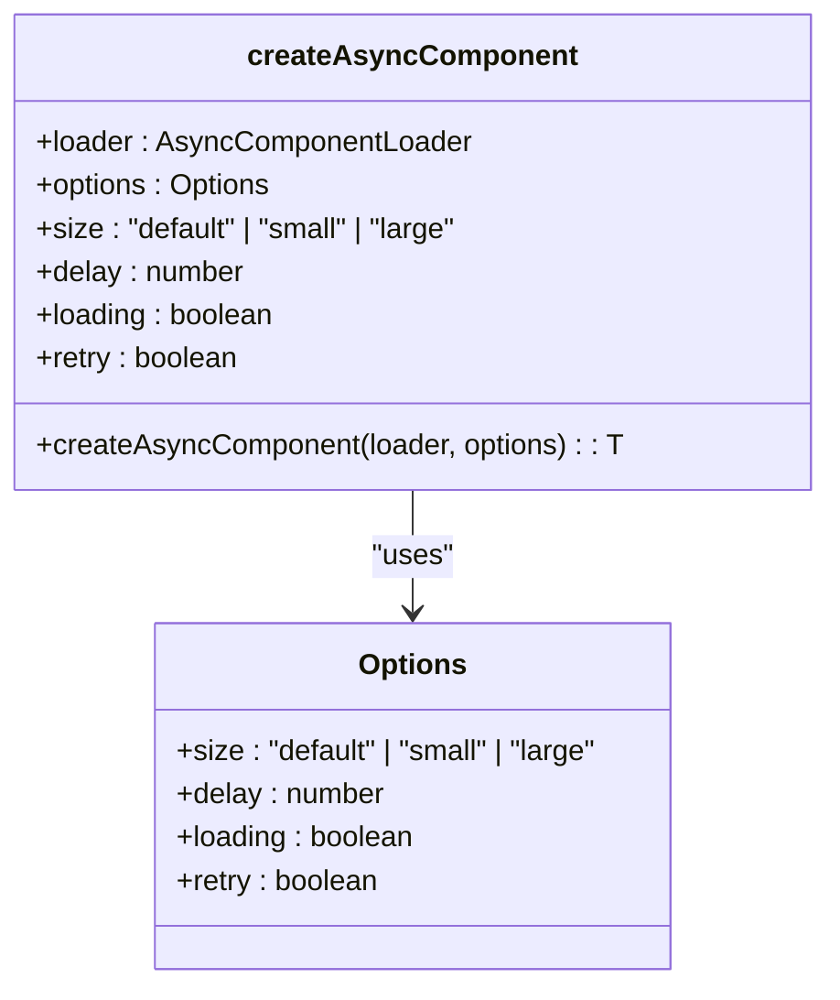
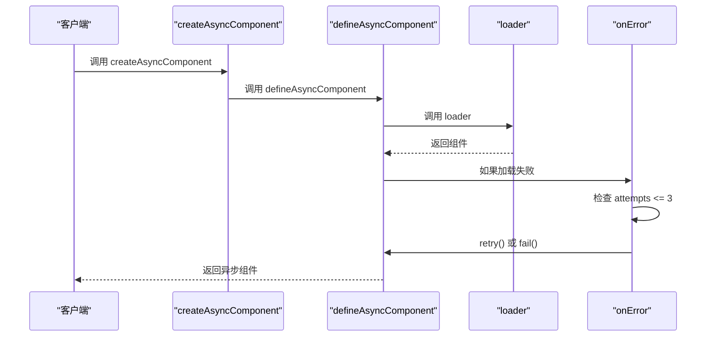
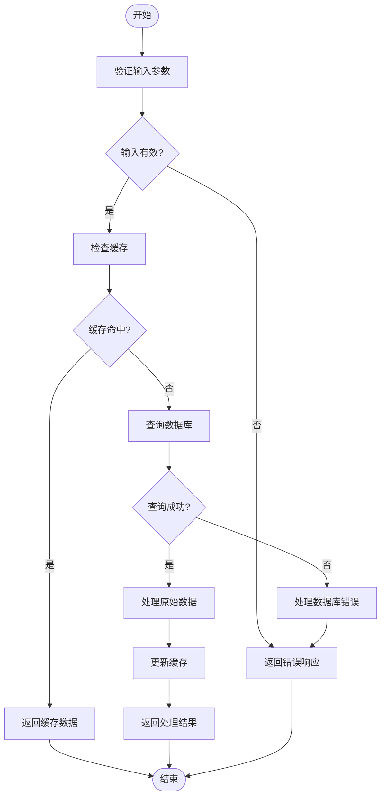
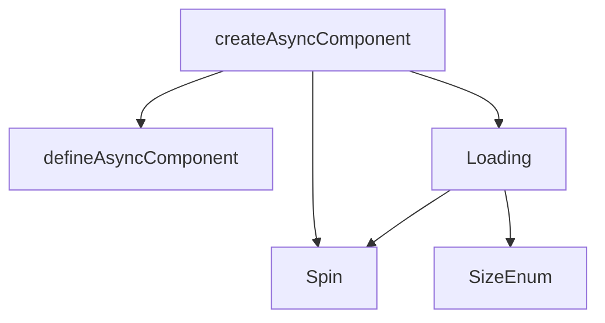

# 异步组件加载器

<cite>
**本文档引用的文件**   
- [createAsyncComponent.tsx](file://src/utils/createAsyncComponent.tsx)
- [Loading.vue](file://src/components/Loading/src/Loading.vue)
- [createLoading.ts](file://src/components/Loading/src/createLoading.ts)
- [useLoading.ts](file://src/components/Loading/src/useLoading.ts)
- [Login.vue](file://src/views/system/login/Login.vue)
- [index.vue](file://src/layouts/header/index.vue)
- [dashboard.ts](file://src/router/modules/dashboard.ts)
</cite>

## 目录
1. [简介](#简介)
2. [核心组件](#核心组件)
3. [架构概述](#架构概述)
4. [详细组件分析](#详细组件分析)
5. [依赖分析](#依赖分析)
6. [性能考虑](#性能考虑)
7. [故障排除指南](#故障排除指南)
8. [结论](#结论)

## 简介
`createAsyncComponent` 是一个用于封装 Vue 3 `defineAsyncComponent` 的工具函数，旨在简化异步组件的加载过程。它不仅支持组件的懒加载，还统一管理加载状态、错误边界和占位内容。通过配置项，开发者可以控制超时、重试机制和加载动画，从而提升用户体验和首屏加载性能。该工具在路由懒加载、复杂表单组件按需加载等场景下表现出色，并与 Vue 3 组合式 API 兼容。

## 核心组件
`createAsyncComponent` 函数通过封装 `defineAsyncComponent` 提供了更高级的异步组件加载功能。它允许开发者通过配置项来控制加载行为，如延迟时间、加载状态显示、重试机制等。此函数返回一个异步组件，该组件在加载过程中会显示指定的加载动画，并在加载失败时尝试重试。

**Section sources**
- [createAsyncComponent.tsx](file://src/utils/createAsyncComponent.tsx#L41-L62)

## 架构概述
`createAsyncComponent` 的设计基于 Vue 3 的 `defineAsyncComponent`，通过添加额外的配置选项来增强其功能。它利用 `defineAsyncComponent` 的 `loadingComponent` 选项来显示加载状态，并通过 `onError` 回调来处理加载失败的情况。此外，它还集成了全局加载组件（如 `Loading`），以提供一致的用户体验。

```mermaid
graph TB
A[createAsyncComponent] --> B[defineAsyncComponent]
B --> C[loader]
B --> D[loadingComponent]
B --> E[delay]
B --> F[onError]
D --> G[Spin]
F --> H[retry]
H --> I[attempts <= 3]
I --> J[retry()]
I --> K[fail()]
```

**Diagram sources **
- [createAsyncComponent.tsx](file://src/utils/createAsyncComponent.tsx#L48-L61)

## 详细组件分析

### createAsyncComponent 分析
`createAsyncComponent` 函数接收一个加载器函数和一个配置对象作为参数。加载器函数负责动态导入组件，而配置对象则包含加载过程中的各种设置，如加载动画的大小、延迟时间、是否显示加载状态以及是否启用重试机制。

#### 对象导向组件


**Diagram sources **
- [createAsyncComponent.tsx](file://src/utils/createAsyncComponent.tsx#L12-L33)

#### API/服务组件


**Diagram sources **
- [createAsyncComponent.tsx](file://src/utils/createAsyncComponent.tsx#L48-L61)

### Loading 组件分析
`Loading` 组件是全局加载指示器，用于在异步操作期间显示加载状态。它可以通过 `createLoading` 和 `useLoading` 函数动态创建和管理。

#### 复杂逻辑组件


**Diagram sources**
- [createLoading.ts](file://src/components/Loading/src/createLoading.ts#L11-L75)
- [useLoading.ts](file://src/components/Loading/src/useLoading.ts#L9-L31)

**Section sources**
- [createLoading.ts](file://src/components/Loading/src/createLoading.ts#L1-L75)
- [useLoading.ts](file://src/components/Loading/src/useLoading.ts#L1-L31)

## 依赖分析
`createAsyncComponent` 依赖于 Vue 3 的 `defineAsyncComponent` 和 `Spin` 组件（来自 ant-design-vue）。它还与 `Loading` 组件集成，以提供一致的加载体验。`Loading` 组件本身依赖于 `Spin` 组件和一些枚举值（如 `SizeEnum`）。



**Diagram sources **
- [createAsyncComponent.tsx](file://src/utils/createAsyncComponent.tsx#L8-L10)
- [Loading.vue](file://src/components/Loading/src/Loading.vue#L13-L14)

**Section sources**
- [createAsyncComponent.tsx](file://src/utils/createAsyncComponent.tsx#L1-L62)
- [Loading.vue](file://src/components/Loading/src/Loading.vue#L1-L59)

## 性能考虑
`createAsyncComponent` 通过延迟加载和重试机制提高了应用的性能。延迟加载可以减少初始加载时间，而重试机制可以在网络不稳定的情况下提高加载成功率。此外，通过配置 `loading` 选项，开发者可以选择是否在组件加载成功前显示加载状态，从而优化用户体验。

## 故障排除指南
当使用 `createAsyncComponent` 时，可能会遇到加载失败或重试机制不工作的问题。确保 `loader` 函数正确返回组件，并且 `onError` 回调中的重试逻辑正确实现。如果问题仍然存在，检查网络连接和组件路径是否正确。

**Section sources**
- [createAsyncComponent.tsx](file://src/utils/createAsyncComponent.tsx#L52-L60)

## 结论
`createAsyncComponent` 是一个强大的工具，用于封装 Vue 3 的 `defineAsyncComponent`，提供更高级的异步组件加载功能。它不仅简化了懒加载的实现，还统一管理加载状态、错误边界和占位内容。通过与全局加载组件的集成，它可以提供一致的用户体验。在路由懒加载和复杂表单组件按需加载等场景下，`createAsyncComponent` 显著提升了首屏加载性能。尽管目前尚未通过测试用例，但其设计和实现为未来的改进提供了坚实的基础。