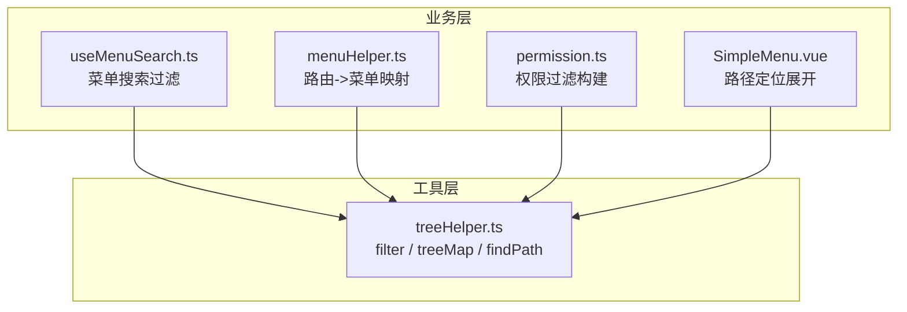
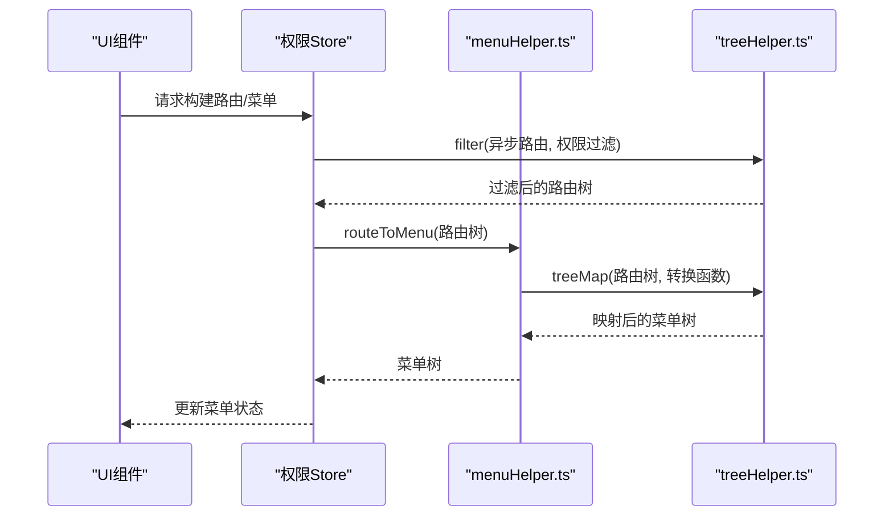
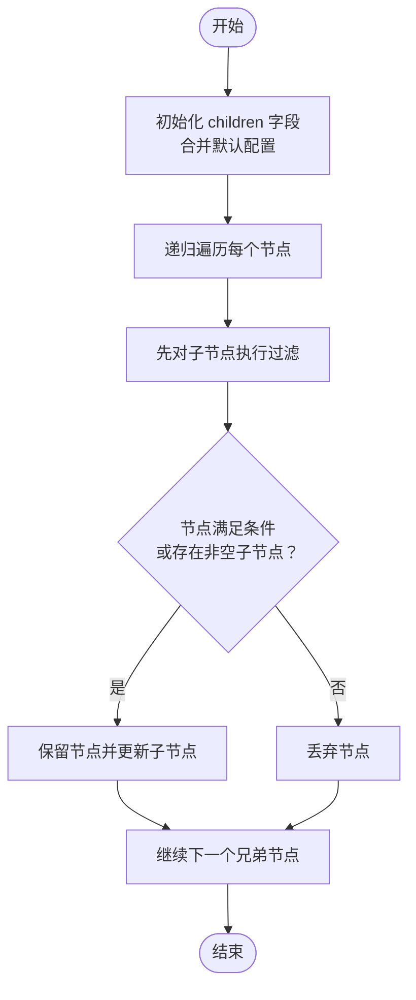
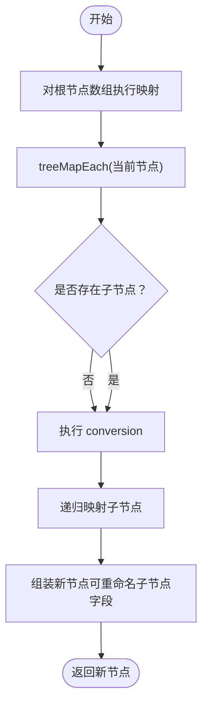
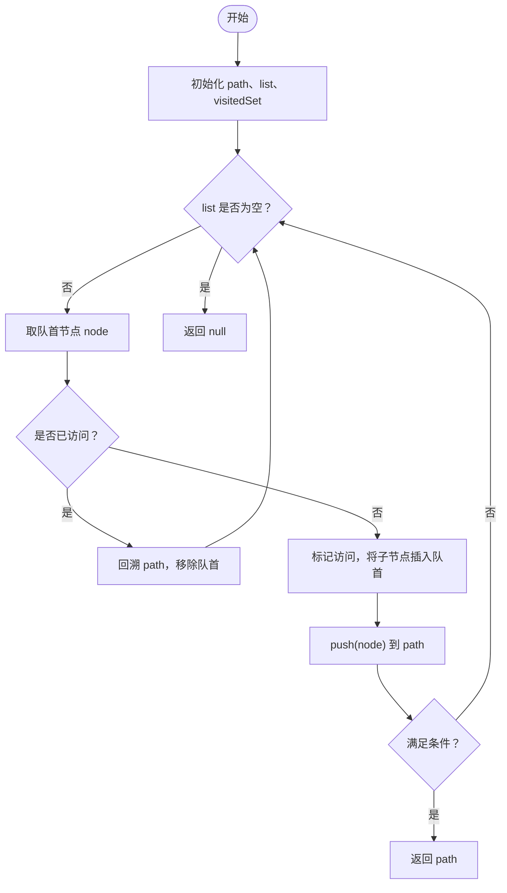
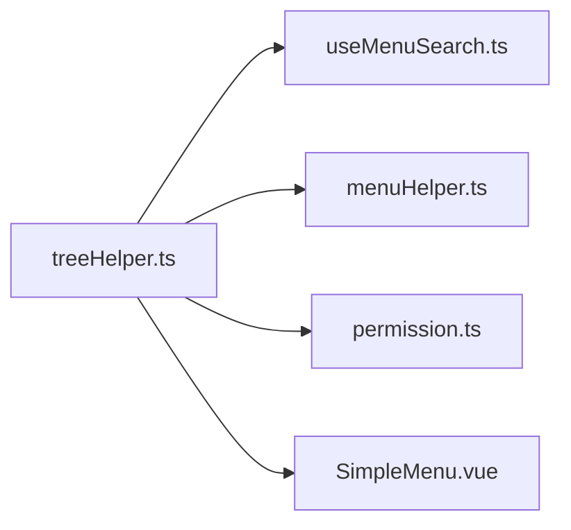

# 树形结构处理工具

<cite>
**本文引用的文件**
- [treeHelper.ts](file://src/utils/treeHelper.ts)
- [useMenuSearch.ts](file://src/layouts/header/components/search/useMenuSearch.ts)
- [menuHelper.ts](file://src/router/menuHelper.ts)
- [permission.ts](file://src/stores/modules/permission.ts)
- [SimpleMenu.vue](file://src/layouts/sider/components/SimpleMenu.vue)
- [types.ts](file://src/router/types.ts)
</cite>

## 目录
1. [简介](#简介)
2. [项目结构](#项目结构)
3. [核心组件](#核心组件)
4. [架构总览](#架构总览)
5. [详细组件分析](#详细组件分析)
6. [依赖分析](#依赖分析)
7. [性能考虑](#性能考虑)
8. [故障排查指南](#故障排查指南)
9. [结论](#结论)
10. [附录：类型与调用示例](#附录类型与调用示例)

## 简介
本文件系统性解析树形结构处理工具集，聚焦于以下能力：
- filter：基于条件过滤树节点并保持层级结构
- treeMap/treeMapEach：递归映射节点数据
- findPath：查找从根到目标节点的完整路径
- 典型业务场景：菜单树、组织架构树、分类树
- 类型安全调用示例：参数定义、返回值类型、错误处理
- 复杂度与性能表现，以及大规模树结构优化建议

## 项目结构
该工具位于通用工具模块中，被多个业务模块复用：
- 菜单搜索：使用 filter 对菜单树进行条件过滤
- 路由到菜单转换：使用 treeMap 对路由树进行字段裁剪与映射
- 权限构建：使用 filter 对异步路由进行权限过滤
- 菜单展开定位：使用 findPath 基于当前路由路径定位选中与展开状态

图表来源
- [treeHelper.ts](file://src/utils/treeHelper.ts#L1-L96)
- [useMenuSearch.ts](file://src/layouts/header/components/search/useMenuSearch.ts#L1-L240)
- [menuHelper.ts](file://src/router/menuHelper.ts#L1-L123)
- [permission.ts](file://src/stores/modules/permission.ts#L1-L67)
- [SimpleMenu.vue](file://src/layouts/sider/components/SimpleMenu.vue#L1-L63)

章节来源
- [treeHelper.ts](file://src/utils/treeHelper.ts#L1-L96)
- [useMenuSearch.ts](file://src/layouts/header/components/search/useMenuSearch.ts#L1-L240)
- [menuHelper.ts](file://src/router/menuHelper.ts#L1-L123)
- [permission.ts](file://src/stores/modules/permission.ts#L1-L67)
- [SimpleMenu.vue](file://src/layouts/sider/components/SimpleMenu.vue#L1-L63)

## 核心组件
- TreeHelperConfig：树字段映射配置接口，包含 id、children、pid
- ConversionFunction<T>：节点转换函数类型
- DEFAULT_CONFIG：默认字段映射
- getConfig：合并用户配置与默认配置
- filter：树形结构过滤，返回满足条件的节点及其祖先链路
- treeMap：树形结构映射，支持自定义子节点字段名与转换逻辑
- treeMapEach：treeMap 的递归实现
- findPath：广度优先搜索路径，返回从根到目标节点的路径数组或 null

章节来源
- [treeHelper.ts](file://src/utils/treeHelper.ts#L1-L96)

## 架构总览
工具层提供通用的树遍历与变换能力；业务层通过组合这些工具完成菜单、路由、权限等树形数据的加工与呈现。

图表来源
- [permission.ts](file://src/stores/modules/permission.ts#L1-L67)
- [menuHelper.ts](file://src/router/menuHelper.ts#L1-L123)
- [treeHelper.ts](file://src/utils/treeHelper.ts#L1-L96)

## 详细组件分析

### filter（树形过滤）
- 功能要点
  - 递归遍历树，先对子节点进行过滤，再根据当前节点是否满足条件或是否存在非空子节点决定保留与否
  - 通过配置可自定义 children 字段名，默认使用 "children"
- 返回值
  - 返回过滤后的树，保持层级关系
- 使用示例（来自业务）
  - 菜单搜索：对菜单树按名称正则与隐藏标志进行过滤
  - 权限构建：对异步路由按用户权限进行过滤
- 复杂度
  - 时间复杂度：O(N)，N 为节点总数
  - 空间复杂度：O(H)，H 为树高（递归栈）

图表来源
- [treeHelper.ts](file://src/utils/treeHelper.ts#L24-L34)
- [useMenuSearch.ts](file://src/layouts/header/components/search/useMenuSearch.ts#L100-L116)
- [permission.ts](file://src/stores/modules/permission.ts#L42-L51)

章节来源
- [treeHelper.ts](file://src/utils/treeHelper.ts#L24-L34)
- [useMenuSearch.ts](file://src/layouts/header/components/search/useMenuSearch.ts#L100-L116)
- [permission.ts](file://src/stores/modules/permission.ts#L42-L51)

### treeMap 与 treeMapEach（树形映射）
- 功能要点
  - treeMap：对外暴露的入口，对根节点数组逐个调用 treeMapEach
  - treeMapEach：递归映射，支持自定义 children 字段名与转换后子节点字段名
  - conversion 回调用于裁剪/重命名字段，如仅保留菜单所需字段
- 返回值
  - 返回映射后的树，结构与原树一致
- 使用示例（来自业务）
  - 路由到菜单：将路由树转换为菜单树，仅保留必要字段并处理隐藏菜单
- 复杂度
  - 时间复杂度：O(N)，N 为节点总数
  - 空间复杂度：O(H)，H 为树高（递归栈）

图表来源
- [treeHelper.ts](file://src/utils/treeHelper.ts#L44-L65)
- [menuHelper.ts](file://src/router/menuHelper.ts#L26-L37)

章节来源
- [treeHelper.ts](file://src/utils/treeHelper.ts#L44-L65)
- [menuHelper.ts](file://src/router/menuHelper.ts#L26-L37)

### findPath（路径查找）
- 功能要点
  - 使用广度优先搜索（队列 + 访问集合）查找从根到满足条件节点的路径
  - 返回从根到目标节点的节点数组，若未找到返回 null
- 返回值
  - 成功：路径数组；失败：null
- 使用示例（来自业务）
  - 菜单展开：根据当前路由路径定位选中项与展开项
- 复杂度
  - 时间复杂度：O(N)，N 为节点总数
  - 空间复杂度：O(N)，最坏情况下队列与访问集合占用空间

图表来源
- [treeHelper.ts](file://src/utils/treeHelper.ts#L74-L95)
- [SimpleMenu.vue](file://src/layouts/sider/components/SimpleMenu.vue#L39-L49)

章节来源
- [treeHelper.ts](file://src/utils/treeHelper.ts#L74-L95)
- [SimpleMenu.vue](file://src/layouts/sider/components/SimpleMenu.vue#L39-L49)

### forEach、map、reduce（高阶函数）
- 现状
  - 当前工具集中未提供 forEach、map、reduce 的树形版本
  - 可通过现有工具组合实现类似效果：
    - forEach：使用 treeMapEach 的递归遍历思想，不返回新结构
    - map：使用 treeMap
    - reduce：使用 treeMapEach 后再对结果进行 reduce
- 建议
  - 如需高频使用，可在工具集中新增对应函数，保持与数组 API 语义一致

章节来源
- [treeHelper.ts](file://src/utils/treeHelper.ts#L1-L96)

## 依赖分析
- 内部依赖
  - treeHelper.ts 作为纯工具函数，无外部依赖
- 外部依赖
  - 在业务层被广泛使用：菜单搜索、路由到菜单转换、权限过滤、菜单展开定位
- 耦合与内聚
  - 工具函数职责单一、内聚度高；业务层通过组合使用实现复杂流程

图表来源
- [treeHelper.ts](file://src/utils/treeHelper.ts#L1-L96)
- [useMenuSearch.ts](file://src/layouts/header/components/search/useMenuSearch.ts#L1-L240)
- [menuHelper.ts](file://src/router/menuHelper.ts#L1-L123)
- [permission.ts](file://src/stores/modules/permission.ts#L1-L67)
- [SimpleMenu.vue](file://src/layouts/sider/components/SimpleMenu.vue#L1-L63)

章节来源
- [treeHelper.ts](file://src/utils/treeHelper.ts#L1-L96)
- [useMenuSearch.ts](file://src/layouts/header/components/search/useMenuSearch.ts#L1-L240)
- [menuHelper.ts](file://src/router/menuHelper.ts#L1-L123)
- [permission.ts](file://src/stores/modules/permission.ts#L1-L67)
- [SimpleMenu.vue](file://src/layouts/sider/components/SimpleMenu.vue#L1-L63)

## 性能考虑
- 时间复杂度
  - filter、treeMap、findPath 均为 O(N)，N 为节点总数
- 空间复杂度
  - 递归实现：O(H)，H 为树高（递归栈）
  - findPath：O(N)，队列与访问集合
- 大规模树优化建议
  - 使用迭代替代递归，避免过深树导致栈溢出
  - 对超大树采用分页/懒加载策略，仅加载可见分支
  - 缓存中间结果，减少重复计算
  - 使用更高效的数据结构（如邻接表）以降低查找成本
  - 在业务层限制树深度或节点数量

[本节为通用性能指导，无需特定文件引用]

## 故障排查指南
- 常见问题
  - 子节点字段名不一致：确保配置中 children 字段与数据结构一致
  - 条件函数误判：确认过滤/查找条件覆盖边界情况（空节点、隐藏节点）
  - 路径为空：findPath 返回 null 表示未找到，需检查条件与数据一致性
- 定位手段
  - 在业务层打印中间结果（如过滤后的树、映射后的树）
  - 使用断点调试工具函数的输入输出
- 修复建议
  - 统一字段命名规范，避免跨模块差异
  - 为条件函数增加日志或断言，便于快速定位问题

章节来源
- [treeHelper.ts](file://src/utils/treeHelper.ts#L1-L96)
- [useMenuSearch.ts](file://src/layouts/header/components/search/useMenuSearch.ts#L100-L116)
- [SimpleMenu.vue](file://src/layouts/sider/components/SimpleMenu.vue#L39-L49)

## 结论
treeHelper.ts 提供了树形数据处理的核心能力，具备良好的类型安全性与可扩展性。通过 filter、treeMap、findPath 的组合，能够高效地支撑菜单树、路由树、权限树等常见业务场景。对于大规模树结构，建议结合迭代实现、缓存与懒加载等策略进一步优化性能。

[本节为总结性内容，无需特定文件引用]

## 附录：类型与调用示例

### 类型定义
- TreeHelperConfig：id、children、pid 字段映射
- ConversionFunction<T>：节点转换函数
- MergedRoute：路由树节点类型
- Menu：菜单树节点类型

章节来源
- [treeHelper.ts](file://src/utils/treeHelper.ts#L5-L12)
- [types.ts](file://src/router/types.ts#L1-L73)

### 调用示例（路径引用）
- 菜单搜索过滤
  - 调用位置：[useMenuSearch.ts](file://src/layouts/header/components/search/useMenuSearch.ts#L100-L116)
  - 参数：菜单树、正则条件、隐藏标志
  - 返回：过滤后的菜单树
- 路由到菜单映射
  - 调用位置：[menuHelper.ts](file://src/router/menuHelper.ts#L26-L37)
  - 参数：路由树、转换函数（裁剪字段）
  - 返回：菜单树
- 权限过滤构建
  - 调用位置：[permission.ts](file://src/stores/modules/permission.ts#L42-L51)
  - 参数：异步路由、权限条件
  - 返回：过滤后的路由树
- 菜单路径定位
  - 调用位置：[SimpleMenu.vue](file://src/layouts/sider/components/SimpleMenu.vue#L39-L49)
  - 参数：菜单树、路径匹配条件
  - 返回：路径数组或 null

章节来源
- [useMenuSearch.ts](file://src/layouts/header/components/search/useMenuSearch.ts#L100-L116)
- [menuHelper.ts](file://src/router/menuHelper.ts#L26-L37)
- [permission.ts](file://src/stores/modules/permission.ts#L42-L51)
- [SimpleMenu.vue](file://src/layouts/sider/components/SimpleMenu.vue#L39-L49)