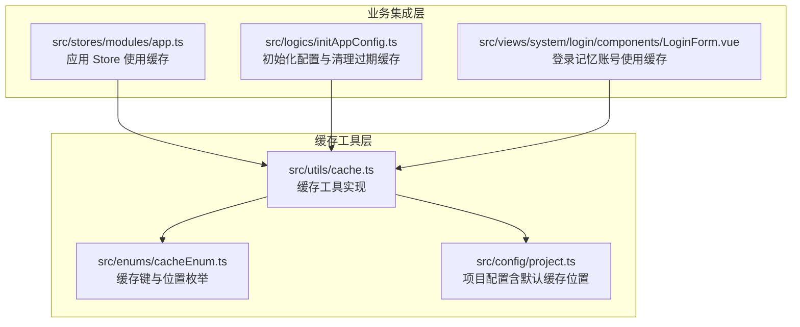
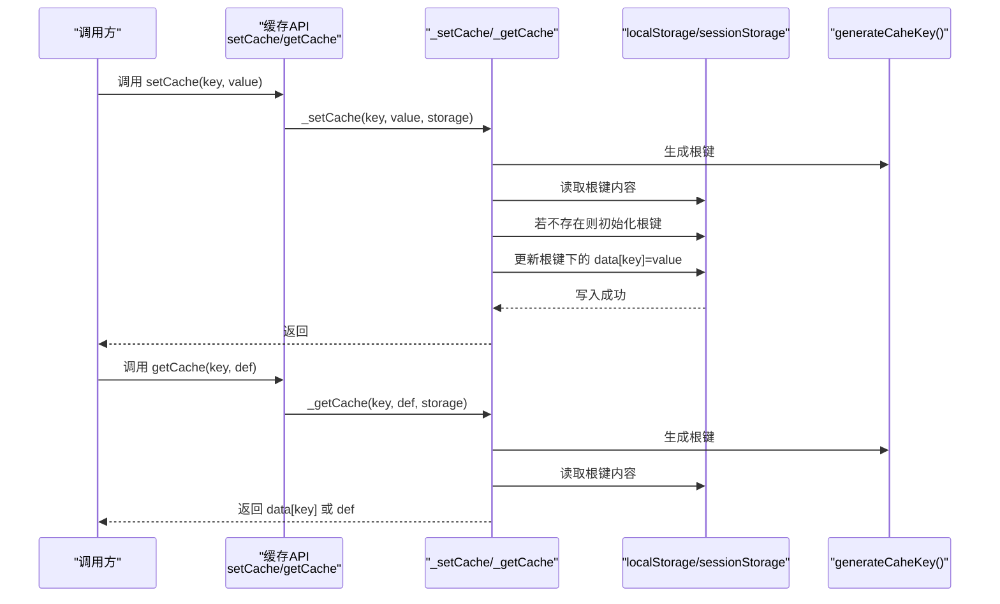
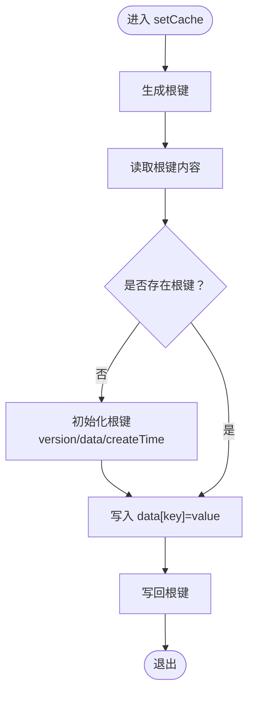
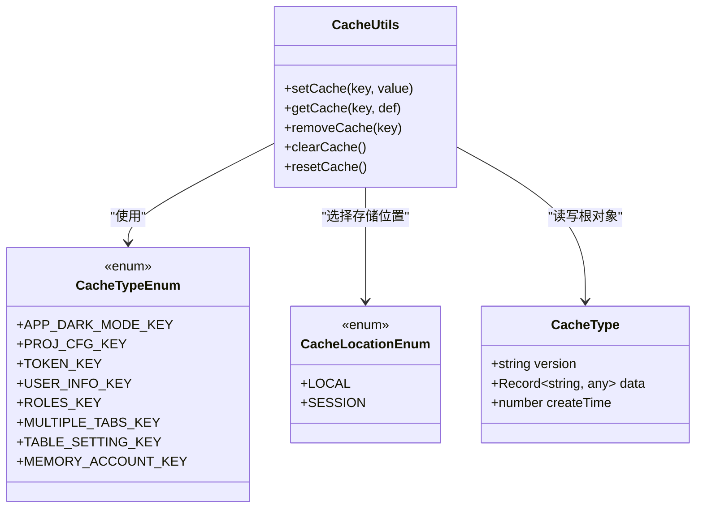

# 缓存工具

<cite>
**本文引用的文件**
- [src/utils/cache.ts](file://src/utils/cache.ts)
- [src/enums/cacheEnum.ts](file://src/enums/cacheEnum.ts)
- [src/config/project.ts](file://src/config/project.ts)
- [src/logics/initAppConfig.ts](file://src/logics/initAppConfig.ts)
- [src/stores/modules/app.ts](file://src/stores/modules/app.ts)
- [src/views/system/login/components/LoginForm.vue](file://src/views/system/login/components/LoginForm.vue)
</cite>

## 目录
1. [简介](#简介)
2. [项目结构](#项目结构)
3. [核心组件](#核心组件)
4. [架构总览](#架构总览)
5. [详细组件分析](#详细组件分析)
6. [依赖关系分析](#依赖关系分析)
7. [性能考量](#性能考量)
8. [故障排查指南](#故障排查指南)
9. [结论](#结论)
10. [附录](#附录)

## 简介
本文件系统性地文档化了前端缓存工具的实现与使用，重点覆盖：
- CacheType 数据结构设计：版本控制、创建时间戳、数据存储机制
- 核心 API 内部逻辑：setCache、getCache、removeCache、clearCache、resetCache
- 多层级缓存策略：基于 localStorage 与 sessionStorage 的选择与落地
- 缓存键命名规范与生成方式
- 过期处理与异常捕获机制
- 在应用状态持久化、用户配置缓存、接口数据缓存等场景中的调用示例
- 安全性、存储容量限制与性能优化建议
- 如何扩展自定义缓存策略

## 项目结构
缓存工具位于 utils 层，配合枚举、配置与业务 Store/视图组件共同构成完整的缓存体系。

图表来源
- [src/utils/cache.ts](file://src/utils/cache.ts#L1-L138)
- [src/enums/cacheEnum.ts](file://src/enums/cacheEnum.ts#L1-L17)
- [src/config/project.ts](file://src/config/project.ts#L1-L39)
- [src/stores/modules/app.ts](file://src/stores/modules/app.ts#L1-L76)
- [src/logics/initAppConfig.ts](file://src/logics/initAppConfig.ts#L1-L53)
- [src/views/system/login/components/LoginForm.vue](file://src/views/system/login/components/LoginForm.vue#L34-L80)

章节来源
- [src/utils/cache.ts](file://src/utils/cache.ts#L1-L138)
- [src/enums/cacheEnum.ts](file://src/enums/cacheEnum.ts#L1-L17)
- [src/config/project.ts](file://src/config/project.ts#L1-L39)

## 核心组件
- CacheType 数据结构：用于封装版本号、数据字典与创建时间戳，作为单个缓存容器的根对象。
- 缓存键生成：由项目前缀与版本号组合而成，确保跨版本隔离。
- 缓存 API：setCache/getCache/removeCache/clearCache/resetCache，分别负责写入、读取、删除、清空与刷新时间。
- 存储位置：通过配置项决定使用 localStorage 或 sessionStorage，默认使用 localStorage。

章节来源
- [src/utils/cache.ts](file://src/utils/cache.ts#L13-L17)
- [src/utils/cache.ts](file://src/utils/cache.ts#L19-L27)
- [src/utils/cache.ts](file://src/utils/cache.ts#L52-L81)
- [src/config/project.ts](file://src/config/project.ts#L20-L24)

## 架构总览
缓存工具采用“单键多值”的结构，每个应用实例只维护一个根键，根键下挂载多个业务键值对。通过统一的键生成器与配置项，实现跨模块、跨组件的一致性访问。

图表来源
- [src/utils/cache.ts](file://src/utils/cache.ts#L52-L104)
- [src/utils/cache.ts](file://src/utils/cache.ts#L85-L104)

## 详细组件分析

### CacheType 数据结构
- 字段
  - version：字符串，用于版本隔离
  - data：任意键值对集合，承载各业务键值
  - createTime：时间戳，用于过期判断与刷新
- 设计要点
  - 单根键承载多业务键值，降低存储碎片
  - 版本字段便于跨版本清理与迁移
  - createTime 支持过期清理与刷新

章节来源
- [src/utils/cache.ts](file://src/utils/cache.ts#L13-L17)

### 缓存键命名规范与生成
- 生成规则：项目前缀（大写）+ 版本号 + 固定后缀
- 作用：保证同一项目不同版本之间的键空间隔离；避免跨版本污染
- 生成函数：generateCaheKey()

章节来源
- [src/utils/cache.ts](file://src/utils/cache.ts#L19-L27)
- [src/config/project.ts](file://src/config/project.ts#L11-L12)

### 多层级缓存策略（localStorage 与 sessionStorage）
- 默认位置：项目配置提供默认缓存位置（LOCAL），可通过枚举切换
- 选择逻辑：API 入口根据配置项选择 localStorage 或 sessionStorage
- 生命周期差异：localStorage 持久保存；sessionStorage 仅会话有效

章节来源
- [src/config/project.ts](file://src/config/project.ts#L20-L24)
- [src/enums/cacheEnum.ts](file://src/enums/cacheEnum.ts#L12-L17)
- [src/utils/cache.ts](file://src/utils/cache.ts#L52-L81)

### 核心 API 内部逻辑

#### setCache(key, value)
- 流程
  - 生成根键
  - 读取根键内容；若不存在则初始化根键
  - 将 value 写入根键 data 中的指定 key
  - 写回根键
- 异常处理
  - 读取不到根键时自动初始化
  - JSON 解析失败时不会抛出异常，但后续写入可能失败

图表来源
- [src/utils/cache.ts](file://src/utils/cache.ts#L52-L96)

章节来源
- [src/utils/cache.ts](file://src/utils/cache.ts#L52-L96)

#### getCache(key, def)
- 流程
  - 生成根键
  - 读取根键内容；若不存在返回默认值
  - 从根键 data 中读取指定 key，不存在则返回默认值
- 异常处理
  - 无显式 try/catch，JSON 解析失败将导致后续读取异常

章节来源
- [src/utils/cache.ts](file://src/utils/cache.ts#L61-L104)

#### removeCache(key)
- 流程
  - 生成根键并读取根键内容
  - 若存在则删除 data 中的指定 key 并写回
- 异常处理
  - 无显式 try/catch，JSON 解析失败将导致删除失败

章节来源
- [src/utils/cache.ts](file://src/utils/cache.ts#L69-L114)

#### clearCache()
- 流程
  - 生成根键并写入空 data，保留 version 与 createTime
- 异常处理
  - 无显式 try/catch，JSON 解析失败将导致写入失败

章节来源
- [src/utils/cache.ts](file://src/utils/cache.ts#L73-L125)

#### resetCache()
- 流程
  - 生成根键并读取根键内容
  - 若存在则更新 createTime 为当前时间并写回
- 异常处理
  - 无显式 try/catch，JSON 解析失败将导致写入失败

章节来源
- [src/utils/cache.ts](file://src/utils/cache.ts#L78-L137)

### 过期处理与异常捕获机制
- 过期策略
  - 由初始化逻辑负责清理过期缓存：遍历当前项目前缀的所有键，按版本号或创建时间判断是否过期并删除
  - 默认过期时间来自项目配置
- 异常捕获
  - 缓存 API 未包裹 try/catch，解析与写入异常需调用方自行处理
  - 建议在业务侧增加 try/catch 包裹关键缓存操作

章节来源
- [src/logics/initAppConfig.ts](file://src/logics/initAppConfig.ts#L30-L53)
- [src/config/project.ts](file://src/config/project.ts#L20-L21)
- [src/utils/cache.ts](file://src/utils/cache.ts#L85-L137)

### 实际调用示例

#### 应用状态持久化（主题模式）
- 场景：在应用 Store 中读取/写入主题模式
- 关键点：getCache 读取默认值，setCache 写入持久化
- 示例路径
  - [读取主题模式](file://src/stores/modules/app.ts#L30-L33)
  - [写入主题模式](file://src/stores/modules/app.ts#L54-L57)

章节来源
- [src/stores/modules/app.ts](file://src/stores/modules/app.ts#L30-L33)
- [src/stores/modules/app.ts](file://src/stores/modules/app.ts#L54-L57)

#### 用户配置缓存（项目配置）
- 场景：初始化项目配置时合并本地缓存
- 关键点：getCache 读取缓存配置，setCache 写入更新后的配置
- 示例路径
  - [初始化配置合并](file://src/logics/initAppConfig.ts#L16-L20)
  - [写入项目配置](file://src/stores/modules/app.ts#L69-L73)

章节来源
- [src/logics/initAppConfig.ts](file://src/logics/initAppConfig.ts#L16-L20)
- [src/stores/modules/app.ts](file://src/stores/modules/app.ts#L69-L73)

#### 接口数据缓存（示例：登录记忆账号）
- 场景：登录表单记忆账号，支持勾选“记住账号”
- 关键点：getCache 读取记忆账号，setCache 写入，removeCache 清除
- 示例路径
  - [读取记忆账号](file://src/views/system/login/components/LoginForm.vue#L56-L66)
  - [写入/清除记忆账号](file://src/views/system/login/components/LoginForm.vue#L72-L73)

章节来源
- [src/views/system/login/components/LoginForm.vue](file://src/views/system/login/components/LoginForm.vue#L56-L66)
- [src/views/system/login/components/LoginForm.vue](file://src/views/system/login/components/LoginForm.vue#L72-L73)

## 依赖关系分析

图表来源
- [src/enums/cacheEnum.ts](file://src/enums/cacheEnum.ts#L1-L17)
- [src/utils/cache.ts](file://src/utils/cache.ts#L13-L17)
- [src/utils/cache.ts](file://src/utils/cache.ts#L52-L81)

章节来源
- [src/enums/cacheEnum.ts](file://src/enums/cacheEnum.ts#L1-L17)
- [src/utils/cache.ts](file://src/utils/cache.ts#L13-L17)
- [src/utils/cache.ts](file://src/utils/cache.ts#L52-L81)

## 性能考量
- 单键写入与读取：每次操作都会完整读取/写回根键，适合键数量较少的场景
- JSON 序列化开销：频繁写入会产生序列化成本，建议批量更新或减少写入频率
- 存储容量限制：localStorage/sessionStorage 容量有限，建议控制单键大小与键数量
- 过期清理：初始化阶段进行过期清理，避免长期累积造成性能下降
- 建议
  - 对热键进行去抖/节流写入
  - 对大对象拆分存储，避免单键过大
  - 使用 resetCache 触发时间刷新，避免过期判断复杂度

[本节为通用性能建议，无需特定文件来源]

## 故障排查指南
- 症状：getCache 返回默认值
  - 可能原因：根键不存在或 JSON 解析失败
  - 处理：确认 setCache 已执行且未发生异常；检查根键是否被外部清理
- 症状：removeCache 无效
  - 可能原因：根键不存在或 JSON 解析失败
  - 处理：先 setCache 再 removeCache；确保键名一致
- 症状：clearCache 后仍残留旧数据
  - 可能原因：根键未正确写入或被其他逻辑覆盖
  - 处理：确认 clearCache 执行路径；检查业务侧是否在写入新值
- 症状：resetCache 未生效
  - 可能原因：根键不存在
  - 处理：先 setCache 产生根键，再 resetCache
- 症状：跨版本缓存冲突
  - 可能原因：版本号变化导致键空间隔离
  - 处理：依赖初始化阶段的过期清理；必要时手动迁移键

章节来源
- [src/utils/cache.ts](file://src/utils/cache.ts#L85-L137)
- [src/logics/initAppConfig.ts](file://src/logics/initAppConfig.ts#L30-L53)

## 结论
该缓存工具通过“单键多值”结构与版本隔离策略，提供了简洁而实用的本地持久化能力。结合项目配置与业务 Store/视图组件，能够覆盖主题模式、项目配置、登录记忆等常见场景。建议在业务侧补充异常捕获与性能优化措施，并通过过期清理保障长期稳定性。

[本节为总结性内容，无需特定文件来源]

## 附录

### 缓存键与位置枚举
- CacheTypeEnum：定义了常用业务键（如主题、项目配置、用户信息、表格设置、登录记忆等）
- CacheLocationEnum：定义了缓存位置（LOCAL/SESSION）

章节来源
- [src/enums/cacheEnum.ts](file://src/enums/cacheEnum.ts#L1-L17)

### 项目配置要点
- PREFIX_CLS：项目前缀，用于键生成
- DEFAULT_CACHE_TIME：默认过期时间
- CACHE_LOCATION：默认缓存位置（LOCAL）

章节来源
- [src/config/project.ts](file://src/config/project.ts#L11-L24)

### 初始化与过期清理流程
- 初始化：读取缓存配置并合并默认配置
- 过期清理：按版本号或创建时间判断并删除过期键

章节来源
- [src/logics/initAppConfig.ts](file://src/logics/initAppConfig.ts#L14-L20)
- [src/logics/initAppConfig.ts](file://src/logics/initAppConfig.ts#L30-L53)