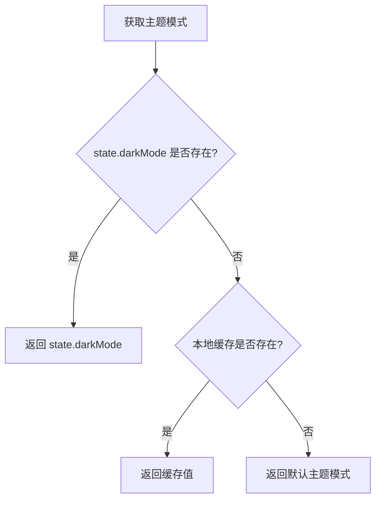
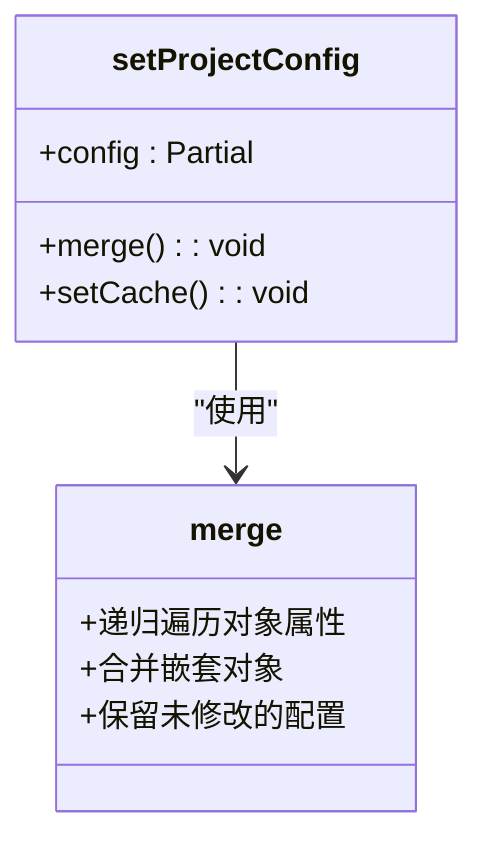
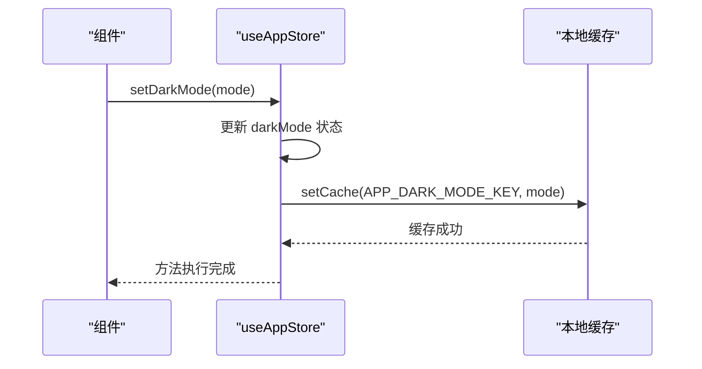
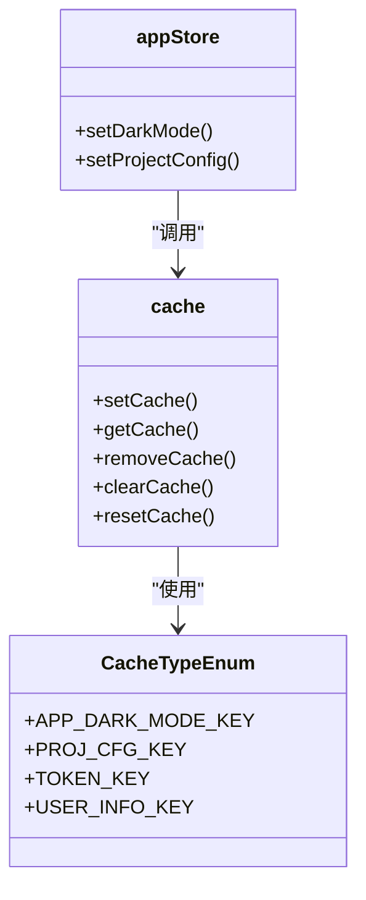
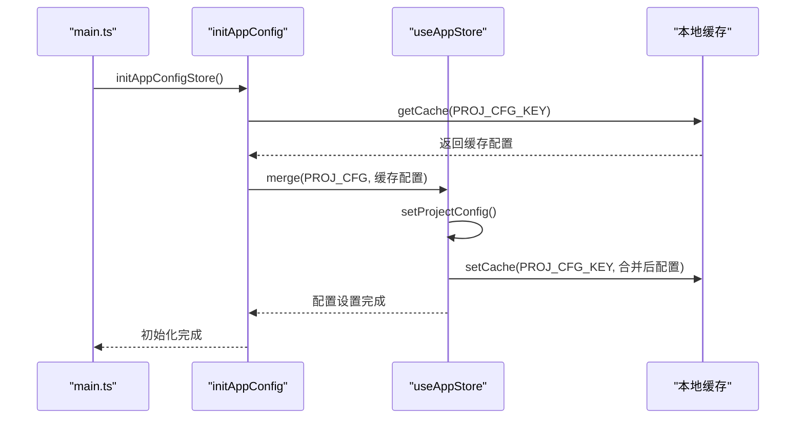

# 应用状态管理 (App Store)

<cite>
**本文档引用的文件**
- [app.ts](file://src/stores/modules/app.ts)
- [cache.ts](file://src/utils/cache.ts)
- [cacheEnum.ts](file://src/enums/cacheEnum.ts)
- [project.ts](file://src/config/project.ts)
- [appEnum.ts](file://src/enums/appEnum.ts)
- [initAppConfig.ts](file://src/logics/initAppConfig.ts)
- [AppProvider.vue](file://src/components/Application/AppProvider.vue)
- [AppDarkModeToggle.vue](file://src/components/Application/AppDarkModeToggle.vue)
- [App.vue](file://src/App.vue)
- [store.d.ts](file://types/store.d.ts)
- [config.d.ts](file://types/config.d.ts)
</cite>

## 目录
1. [应用状态管理概述](#应用状态管理概述)
2. [AppState 接口字段详解](#appstate-接口字段详解)
3. [核心 getters 方法分析](#核心-getters-方法分析)
4. [状态修改与深度合并机制](#状态修改与深度合并机制)
5. [组件中使用 useAppStore](#组件中使用-useappstore)
6. [状态持久化实现](#状态持久化实现)
7. [常见问题排查](#常见问题排查)

## 应用状态管理概述

`useAppStore` 是基于 Pinia 实现的全局状态管理模块，位于 `src/stores/modules/app.ts` 文件中。该模块负责管理应用的核心状态，包括主题模式、页面加载状态、项目配置等全局共享数据。通过定义清晰的 `AppState` 接口和相应的 getters 与 actions，实现了状态的集中管理和响应式访问。

该状态管理模块在应用启动时通过 `setupStore` 函数注册到 Vue 应用实例中，并在 `main.ts` 中通过 `initAppConfigStore` 函数初始化项目配置，确保应用启动时能够正确恢复用户上次的配置状态。

**Section sources**
- [app.ts](file://src/stores/modules/app.ts#L1-L76)
- [index.ts](file://src/stores/index.ts#L1-L11)
- [main.ts](file://src/main.ts#L1-L29)

## AppState 接口字段详解

`AppState` 接口定义了应用的核心状态字段，每个字段都有明确的业务含义和使用场景：

- **darkMode**: 主题模式状态，用于控制应用的浅色/暗色主题切换。类型为 `ThemeEnum` 枚举，可选值为 `LIGHT` 或 `DARK`。
- **pageLoading**: 页面加载状态，布尔值，用于控制全局加载指示器的显示与隐藏。
- **projectConfig**: 项目配置对象，包含应用的各种可配置选项，如头部设置、菜单设置、过渡动画设置等。
- **beforeMiniInfo**: 迷你状态前置信息，记录在切换到迷你布局前的菜单状态，用于状态恢复。
- **siteInfo**: 站点信息，包含站点 logo、名称等基本信息。

这些状态字段通过 Pinia 的响应式系统进行管理，任何组件都可以通过 `useAppStore` 获取到最新的状态值，并在状态变化时自动更新视图。

**Section sources**
- [app.ts](file://src/stores/modules/app.ts#L11-L17)
- [store.d.ts](file://types/store.d.ts#L10-L38)

## 核心 getters 方法分析

### getDarkMode 方法

`getDarkMode` getter 提供了主题模式的访问逻辑，其核心特点是实现了多层级的默认值处理策略：



该方法首先检查当前状态中的 `darkMode` 值，如果不存在则查询本地缓存，最后返回默认主题模式（由 `DEFAULT_THEME_MODE` 常量定义）。这种设计确保了用户主题偏好能够在页面刷新后得以保留。

**Diagram sources**
- [app.ts](file://src/stores/modules/app.ts#L31)

**Section sources**
- [app.ts](file://src/stores/modules/app.ts#L30-L32)
- [project.ts](file://src/config/project.ts#L18)
- [cacheEnum.ts](file://src/enums/cacheEnum.ts#L3)

### 其他 getters 方法

除了 `getDarkMode`，还提供了多个便捷的 getters 方法：

- **getPageLoading**: 直接返回页面加载状态
- **getProjectConfig**: 返回完整的项目配置对象
- **getHeaderSetting**: 返回头部设置，如果不存在则返回空对象
- **getMenuSetting**: 返回菜单设置，如果不存在则返回空对象
- **getTransitionSetting**: 返回过渡动画设置
- **getMultiTabsSetting**: 返回多标签页设置

这些 getters 方法都采用了类似的空值处理策略，确保在配置项不存在时返回安全的默认值，避免了潜在的运行时错误。

**Section sources**
- [app.ts](file://src/stores/modules/app.ts#L28-L41)

## 状态修改与深度合并机制

### setProjectConfig 方法实现原理

`setProjectConfig` 方法使用 `lodash-es` 的 `merge` 函数实现深度合并，其核心优势在于能够递归地合并对象属性，而不是简单地覆盖：



当调用 `setProjectConfig` 时，新配置会与现有配置进行深度合并，这意味着只有被明确修改的属性会被更新，其他未涉及的配置项将保持不变。这种方法避免了配置丢失的风险，特别适合处理复杂的嵌套配置对象。

**Diagram sources**
- [app.ts](file://src/stores/modules/app.ts#L69-L72)

**Section sources**
- [app.ts](file://src/stores/modules/app.ts#L66-L73)
- [initAppConfig.ts](file://src/logics/initAppConfig.ts#L18)

### setDarkMode 方法

`setDarkMode` 方法不仅更新状态，还同步将主题模式保存到本地缓存中，确保用户偏好能够持久化：



这种设计确保了状态变更与持久化操作的原子性，避免了状态与缓存不一致的问题。

**Diagram sources**
- [app.ts](file://src/stores/modules/app.ts#L54-L57)
- [cache.ts](file://src/utils/cache.ts#L52)

**Section sources**
- [app.ts](file://src/stores/modules/app.ts#L54-L57)

## 组件中使用 useAppStore

### 主题模式切换

在 `AppDarkModeToggle.vue` 组件中，通过 `useAppStore` 实现了主题切换功能：

```mermaid
flowchart TD
A[AppDarkModeToggle] --> B[useAppStore()]
B --> C[getDarkMode 计算属性]
C --> D[Switch 组件绑定]
D --> E[点击事件触发]
E --> F[toggleDarkMode]
F --> G[updateDarkTheme]
G --> H[setDarkMode]
```

该组件使用计算属性 `getDarkMode` 绑定到 Switch 组件的 `checked` 属性，并在点击时调用 `setDarkMode` 方法更新状态。

**Diagram sources**
- [AppDarkModeToggle.vue](file://src/components/Application/AppDarkModeToggle.vue#L28)
- [app.ts](file://src/stores/modules/app.ts#L54)

**Section sources**
- [AppDarkModeToggle.vue](file://src/components/Application/AppDarkModeToggle.vue#L1-L35)

### 全局配置应用

在 `App.vue` 中，`useAppStore` 被用于动态配置 Ant Design Vue 的主题：

```mermaid
flowchart TD
A[App.vue] --> B[useAppStore()]
B --> C[getDarkMode 计算属性]
C --> D[getThemeColor 计算属性]
D --> E[themeConfig 计算属性]
E --> F[ConfigProvider 组件]
F --> G[动态主题配置]
```

通过计算属性链，实现了根据 store 状态动态生成主题配置对象，从而实现主题的实时切换。

**Diagram sources**
- [App.vue](file://src/App.vue#L26-L40)

**Section sources**
- [App.vue](file://src/App.vue#L1-L42)

## 状态持久化实现

### 缓存机制

状态持久化通过 `CacheTypeEnum` 枚举和 `cache.ts` 工具类实现：



`CacheTypeEnum` 定义了各种缓存键的常量，确保缓存键的统一管理和避免硬编码。

**Diagram sources**
- [cacheEnum.ts](file://src/enums/cacheEnum.ts#L2-L11)
- [cache.ts](file://src/utils/cache.ts#L7-L138)
- [app.ts](file://src/stores/modules/app.ts#L7-L9)

### 初始化流程

应用启动时的状态初始化流程如下：



该流程确保了应用启动时能够正确恢复用户上次的配置状态。

**Diagram sources**
- [initAppConfig.ts](file://src/logics/initAppConfig.ts#L15-L21)
- [app.ts](file://src/stores/modules/app.ts#L69-L72)

**Section sources**
- [initAppConfig.ts](file://src/logics/initAppConfig.ts#L1-L54)

## 常见问题排查

### 状态未持久化

**问题现象**：页面刷新后主题模式或配置未保持

**排查步骤**：
1. 检查 `setDarkMode` 或 `setProjectConfig` 是否被正确调用
2. 确认 `CacheTypeEnum` 常量是否正确
3. 检查浏览器本地存储中是否存在对应的缓存键
4. 验证 `CACHE_LOCATION` 配置是否正确

**解决方案**：确保在修改状态的同时调用相应的缓存设置方法。

### 配置合并异常

**问题现象**：部分配置项丢失或被意外覆盖

**排查步骤**：
1. 检查传入 `setProjectConfig` 的配置对象结构
2. 验证 `merge` 函数是否正确导入
3. 检查是否有其他代码直接修改了 `projectConfig` 对象

**解决方案**：始终通过 `setProjectConfig` 方法更新配置，避免直接修改状态。

**Section sources**
- [app.ts](file://src/stores/modules/app.ts#L69-L72)
- [cacheEnum.ts](file://src/enums/cacheEnum.ts#L4)
- [project.ts](file://src/config/project.ts#L24)