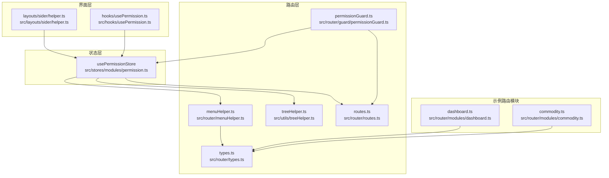
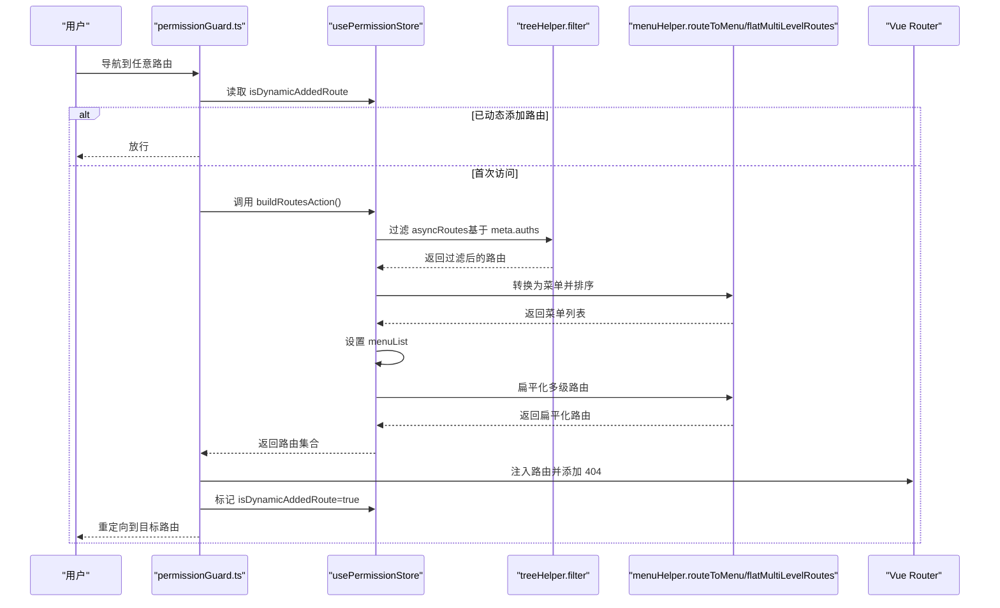
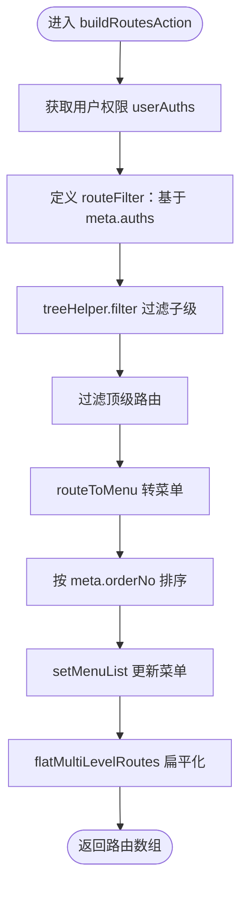
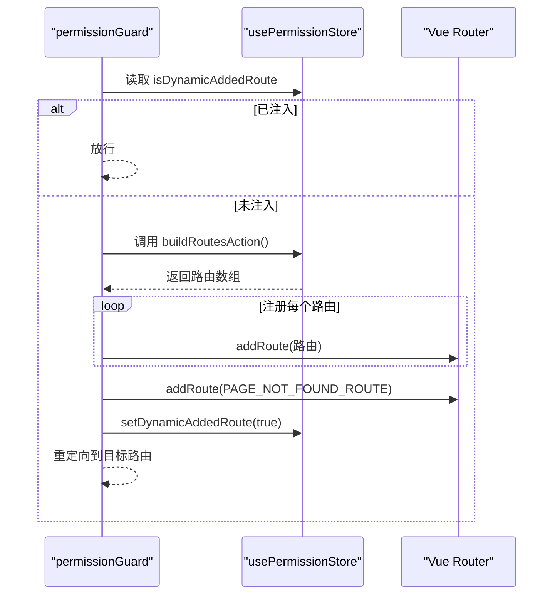
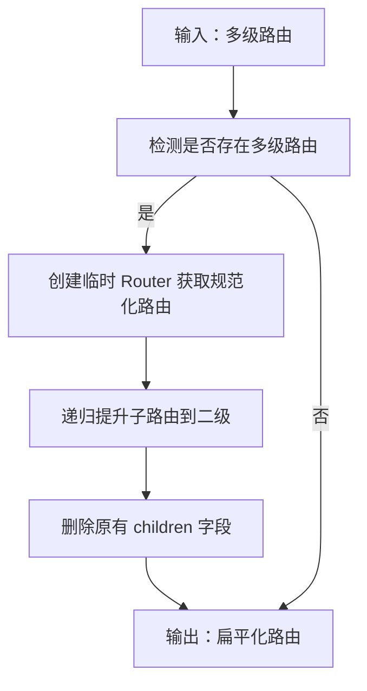
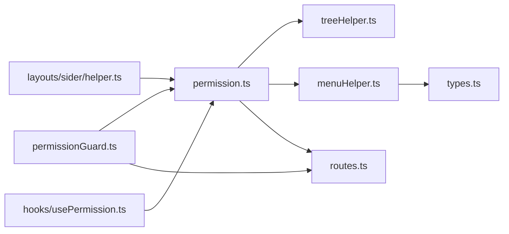

# 权限状态管理 (Permission Store)

<cite>
**本文引用的文件**
- [src/stores/modules/permission.ts](file://src/stores/modules/permission.ts)
- [src/router/guard/permissionGuard.ts](file://src/router/guard/permissionGuard.ts)
- [src/router/menuHelper.ts](file://src/router/menuHelper.ts)
- [src/utils/treeHelper.ts](file://src/utils/treeHelper.ts)
- [src/router/routes.ts](file://src/router/routes.ts)
- [src/router/types.ts](file://src/router/types.ts)
- [src/layouts/sider/helper.ts](file://src/layouts/sider/helper.ts)
- [src/hooks/usePermission.ts](file://src/hooks/usePermission.ts)
- [src/router/modules/dashboard.ts](file://src/router/modules/dashboard.ts)
- [src/router/modules/commodity.ts](file://src/router/modules/commodity.ts)
</cite>

## 目录
1. [简介](#简介)
2. [项目结构](#项目结构)
3. [核心组件](#核心组件)
4. [架构总览](#架构总览)
5. [详细组件分析](#详细组件分析)
6. [依赖关系分析](#依赖关系分析)
7. [性能考量](#性能考量)
8. [故障排查指南](#故障排查指南)
9. [结论](#结论)
10. [附录](#附录)

## 简介
本文件系统性讲解 usePermissionStore 在动态权限控制中的核心作用，重点剖析 buildRoutesAction 的完整执行流程：从获取用户权限 userAuths 开始，通过 routeFilter 函数利用 meta.auths 字段进行路由过滤，使用 treeHelper.filter 处理多级路由的权限校验，最后通过 flatMultiLevelRoutes 生成可注册的扁平化路由表；同时说明 menuList 状态如何通过 routeToMenu 工具函数从路由数据生成侧边栏菜单，并解释 orderNo 排序机制；结合 permissionGuard.ts 守卫，说明 isDynamicAddedRoute 标志位如何防止路由重复添加。文档还提供一个完整的权限数据流示例，展示用户登录后如何触发此 action 并更新全局菜单和路由；并对权限粒度（按钮级 vs 路由级）的实现方式与性能优化建议（如权限数据缓存策略）进行讨论。

## 项目结构
围绕权限控制的关键文件分布如下：
- 状态层：src/stores/modules/permission.ts 提供权限状态与动作
- 路由守卫：src/router/guard/permissionGuard.ts 实现动态路由注入与防重复
- 菜单工具：src/router/menuHelper.ts 提供路由转菜单与多级路由扁平化
- 树工具：src/utils/treeHelper.ts 提供通用树形结构过滤与映射
- 路由聚合：src/router/routes.ts 聚合异步路由模块
- 类型定义：src/router/types.ts 定义 MergedRoute 与菜单类型
- 侧边栏辅助：src/layouts/sider/helper.ts 使用菜单列表渲染
- 页面权限 Hook：src/hooks/usePermission.ts 提供按钮级权限判断能力
- 示例路由模块：src/router/modules/dashboard.ts、src/router/modules/commodity.ts 展示 meta.auths 与 orderNo 的使用

图表来源
- [src/stores/modules/permission.ts](file://src/stores/modules/permission.ts#L1-L66)
- [src/router/guard/permissionGuard.ts](file://src/router/guard/permissionGuard.ts#L1-L59)
- [src/router/menuHelper.ts](file://src/router/menuHelper.ts#L1-L123)
- [src/utils/treeHelper.ts](file://src/utils/treeHelper.ts#L1-L96)
- [src/router/routes.ts](file://src/router/routes.ts#L1-L27)
- [src/router/types.ts](file://src/router/types.ts#L1-L73)
- [src/layouts/sider/helper.ts](file://src/layouts/sider/helper.ts#L1-L34)
- [src/hooks/usePermission.ts](file://src/hooks/usePermission.ts#L1-L31)
- [src/router/modules/dashboard.ts](file://src/router/modules/dashboard.ts#L1-L21)
- [src/router/modules/commodity.ts](file://src/router/modules/commodity.ts#L1-L27)

章节来源
- [src/stores/modules/permission.ts](file://src/stores/modules/permission.ts#L1-L66)
- [src/router/guard/permissionGuard.ts](file://src/router/guard/permissionGuard.ts#L1-L59)
- [src/router/menuHelper.ts](file://src/router/menuHelper.ts#L1-L123)
- [src/utils/treeHelper.ts](file://src/utils/treeHelper.ts#L1-L96)
- [src/router/routes.ts](file://src/router/routes.ts#L1-L27)
- [src/router/types.ts](file://src/router/types.ts#L1-L73)
- [src/layouts/sider/helper.ts](file://src/layouts/sider/helper.ts#L1-L34)
- [src/hooks/usePermission.ts](file://src/hooks/usePermission.ts#L1-L31)
- [src/router/modules/dashboard.ts](file://src/router/modules/dashboard.ts#L1-L21)
- [src/router/modules/commodity.ts](file://src/router/modules/commodity.ts#L1-L27)

## 核心组件
- usePermissionStore：维护 menuList 与 isDynamicAddedRoute 两个关键状态，提供 buildRoutesAction 动作完成权限路由构建与菜单生成。
- permissionGuard：在路由导航前根据 isDynamicAddedRoute 决定是否构建并注入动态路由，避免重复添加。
- menuHelper：负责将路由转换为菜单结构、对多级路由进行扁平化处理。
- treeHelper：提供树形结构的 filter、treeMap 等通用工具，支撑权限过滤与菜单转换。
- routes：聚合异步路由模块，作为权限过滤的输入集合。
- types：定义 MergedRoute 与菜单类型，统一 meta 字段（含 auths、orderNo 等）。
- layouts/sider/helper：消费权限菜单列表，过滤隐藏菜单并拼接父路径。
- hooks/usePermission：提供页面级按钮权限判断能力（基于字符串表达式与取反逻辑）。

章节来源
- [src/stores/modules/permission.ts](file://src/stores/modules/permission.ts#L1-L66)
- [src/router/guard/permissionGuard.ts](file://src/router/guard/permissionGuard.ts#L1-L59)
- [src/router/menuHelper.ts](file://src/router/menuHelper.ts#L1-L123)
- [src/utils/treeHelper.ts](file://src/utils/treeHelper.ts#L1-L96)
- [src/router/routes.ts](file://src/router/routes.ts#L1-L27)
- [src/router/types.ts](file://src/router/types.ts#L1-L73)
- [src/layouts/sider/helper.ts](file://src/layouts/sider/helper.ts#L1-L34)
- [src/hooks/usePermission.ts](file://src/hooks/usePermission.ts#L1-L31)

## 架构总览
动态权限控制的整体流程如下：
- 用户登录成功后，调用 permissionStore.buildRoutesAction 获取可用路由集合；
- 通过 treeHelper.filter 基于 meta.auths 对路由进行递归过滤；
- 使用 routeToMenu 将路由转换为菜单结构，并按 meta.orderNo 排序；
- 将生成的菜单保存到 menuList；
- 使用 flatMultiLevelRoutes 将多级路由扁平化，便于注册；
- permissionGuard 在首次访问时注入路由并标记 isDynamicAddedRoute；
- 后续刷新或再次访问时直接放行，避免重复注入；
- 侧边栏通过 getCurMenus 过滤隐藏菜单并拼接父路径。

图表来源
- [src/router/guard/permissionGuard.ts](file://src/router/guard/permissionGuard.ts#L1-L59)
- [src/stores/modules/permission.ts](file://src/stores/modules/permission.ts#L1-L66)
- [src/utils/treeHelper.ts](file://src/utils/treeHelper.ts#L1-L96)
- [src/router/menuHelper.ts](file://src/router/menuHelper.ts#L1-L123)

## 详细组件分析

### usePermissionStore：动态权限路由构建与菜单生成
- 状态
  - menuList：当前用户的菜单列表（MergedRoute[]），用于侧边栏渲染。
  - isDynamicAddedRoute：布尔标志，指示动态路由是否已注入，防止重复添加。
- 动作 buildRoutesAction
  - 输入：asyncRoutes（来自 routes.ts 聚合的异步路由集合）
  - 步骤
    1) 获取用户权限 userAuths（当前实现为占位，后续应从 userStore 获取）
    2) 定义 routeFilter：若路由 meta.auths 存在且非空，则要求 userAuths 至少包含 auths 中的一个；否则默认通过
    3) 使用 treeHelper.filter 对子级进行递归过滤
    4) 再对顶级路由进行一次过滤，确保顶层也满足权限条件
    5) 使用 routeToMenu 将路由转换为菜单结构（保留 meta、name、path、redirect 等）
    6) 按 meta.orderNo 升序排序
    7) setMenuList 更新全局菜单
    8) 使用 flatMultiLevelRoutes 将多级路由提升为二级，便于注册
    9) 返回扁平化后的路由集合
- 输出
  - 返回可用于 router.addRoute 注入的路由数组
  - 更新全局 menuList，供侧边栏渲染

图表来源
- [src/stores/modules/permission.ts](file://src/stores/modules/permission.ts#L1-L66)
- [src/utils/treeHelper.ts](file://src/utils/treeHelper.ts#L1-L96)
- [src/router/menuHelper.ts](file://src/router/menuHelper.ts#L1-L123)

章节来源
- [src/stores/modules/permission.ts](file://src/stores/modules/permission.ts#L1-L66)

### permissionGuard.ts：路由守卫与重复注入防护
- 关键点
  - 若 isDynamicAddedRoute 为 true，直接放行（常见于刷新页面场景）
  - 首次访问时调用 permissionStore.buildRoutesAction 获取路由集合
  - 遍历返回的路由逐个注入 router.addRoute
  - 最后注入 PAGE_NOT_FOUND_ROUTE，保证 404 处理
  - 标记 isDynamicAddedRoute 为 true，防止后续重复注入
  - 重新计算并跳转到目标路由，避免进入 404
- 与 buildRoutesAction 的协作
  - 依赖 isDynamicAddedRoute 防止重复注入
  - 依赖 buildRoutesAction 的返回值进行路由注册

图表来源
- [src/router/guard/permissionGuard.ts](file://src/router/guard/permissionGuard.ts#L1-L59)
- [src/stores/modules/permission.ts](file://src/stores/modules/permission.ts#L1-L66)

章节来源
- [src/router/guard/permissionGuard.ts](file://src/router/guard/permissionGuard.ts#L1-L59)

### menuHelper.ts：路由转菜单与多级路由扁平化
- routeToMenu
  - 克隆路由列表，支持 routerMapping（当 hideChildrenInMenu 且存在 redirect 时，将 path 替换为 redirect）
  - 使用 treeMap 转换节点，保留 meta、name、path、redirect 等字段，便于菜单渲染
- flatMultiLevelRoutes
  - 判断是否存在多级路由（子节点存在子节点）
  - 通过创建临时 Router 获取规范化路由，再将深层子路由“提升”到二级
  - 递归处理，最终删除原有 children 字段，得到扁平化结果

图表来源
- [src/router/menuHelper.ts](file://src/router/menuHelper.ts#L1-L123)

章节来源
- [src/router/menuHelper.ts](file://src/router/menuHelper.ts#L1-L123)

### treeHelper.ts：树形结构通用工具
- filter：对树形结构进行过滤，递归保留满足条件的节点及其祖先
- treeMap：对树形结构进行映射转换，支持自定义 conversion 方法
- 本项目中用于权限过滤与菜单转换

章节来源
- [src/utils/treeHelper.ts](file://src/utils/treeHelper.ts#L1-L96)

### 菜单生成与排序：menuList 与 orderNo
- 菜单生成
  - routeToMenu 将路由转换为菜单结构，保留必要的 meta 字段
  - layouts/sider/helper.ts 通过 getCurMenus 过滤 hideMenu 的菜单项
- 排序
  - menuList.sort((a, b) => (a.meta.orderNo || 0) - (b.meta.orderNo || 0))
  - orderNo 仅影响当前层级的排序，适合侧边栏顺序控制

章节来源
- [src/router/menuHelper.ts](file://src/router/menuHelper.ts#L1-L123)
- [src/layouts/sider/helper.ts](file://src/layouts/sider/helper.ts#L1-L34)
- [src/router/types.ts](file://src/router/types.ts#L1-L73)

### 示例路由模块：meta.auths 与 orderNo
- dashboard.ts：定义了工作台路由，meta 中包含 orderNo、icon、title 等
- commodity.ts：定义了产品管理路由，包含子路由与 orderNo
- 这些路由在权限过滤时会依据 meta.auths 决定是否可见

章节来源
- [src/router/modules/dashboard.ts](file://src/router/modules/dashboard.ts#L1-L21)
- [src/router/modules/commodity.ts](file://src/router/modules/commodity.ts#L1-L27)
- [src/router/types.ts](file://src/router/types.ts#L1-L73)

### 按钮级权限与路由级权限
- 路由级权限
  - 通过 meta.auths 与 buildRoutesAction 的 routeFilter 实现
  - 未授权路由不会被注入，也不会出现在菜单中
- 按钮级权限
  - 通过 hooks/usePermission 提供 hasPermission 能力，支持字符串表达式与取反逻辑
  - 可用于控制按钮、操作项的显隐与交互

章节来源
- [src/stores/modules/permission.ts](file://src/stores/modules/permission.ts#L1-L66)
- [src/hooks/usePermission.ts](file://src/hooks/usePermission.ts#L1-L31)

## 依赖关系分析
- usePermissionStore 依赖
  - treeHelper.filter：用于权限过滤
  - menuHelper.routeToMenu/flatMultiLevelRoutes：用于菜单生成与路由扁平化
  - routes.asyncRoutes：异步路由集合的输入源
- permissionGuard 依赖
  - usePermissionStore：构建与注入路由、标记 isDynamicAddedRoute
  - routes.baseRoutes/PAGE_NOT_FOUND_ROUTE：确保基础路由与 404 路由存在
- menuHelper 依赖
  - types.MergedRoute：统一路由结构
  - lodash-es.cloneDeep/omit：深拷贝与字段剔除
- layouts/sider/helper 依赖
  - usePermissionStore.getMenuList：获取菜单列表
  - joinParentPath：拼接父路径

图表来源
- [src/stores/modules/permission.ts](file://src/stores/modules/permission.ts#L1-L66)
- [src/router/guard/permissionGuard.ts](file://src/router/guard/permissionGuard.ts#L1-L59)
- [src/router/menuHelper.ts](file://src/router/menuHelper.ts#L1-L123)
- [src/utils/treeHelper.ts](file://src/utils/treeHelper.ts#L1-L96)
- [src/router/routes.ts](file://src/router/routes.ts#L1-L27)
- [src/router/types.ts](file://src/router/types.ts#L1-L73)
- [src/layouts/sider/helper.ts](file://src/layouts/sider/helper.ts#L1-L34)
- [src/hooks/usePermission.ts](file://src/hooks/usePermission.ts#L1-L31)

章节来源
- [src/stores/modules/permission.ts](file://src/stores/modules/permission.ts#L1-L66)
- [src/router/guard/permissionGuard.ts](file://src/router/guard/permissionGuard.ts#L1-L59)
- [src/router/menuHelper.ts](file://src/router/menuHelper.ts#L1-L123)
- [src/utils/treeHelper.ts](file://src/utils/treeHelper.ts#L1-L96)
- [src/router/routes.ts](file://src/router/routes.ts#L1-L27)
- [src/router/types.ts](file://src/router/types.ts#L1-L73)
- [src/layouts/sider/helper.ts](file://src/layouts/sider/helper.ts#L1-L34)
- [src/hooks/usePermission.ts](file://src/hooks/usePermission.ts#L1-L31)

## 性能考量
- 权限过滤复杂度
  - treeHelper.filter 对树形结构进行递归过滤，时间复杂度近似 O(N)，N 为路由节点总数
  - routeToMenu 与 flatMultiLevelRoutes 亦为线性复杂度，整体开销可控
- 缓存策略建议
  - 用户权限 userAuths 变更时才重建路由与菜单，避免频繁全量过滤
  - 可考虑对 asyncRoutes 的过滤结果进行缓存，结合用户角色/权限标识作为 key
  - 菜单排序与扁平化仅在路由变更时执行，减少重复计算
- 路由注入优化
  - 通过 isDynamicAddedRoute 防止重复注入，避免 addRoute 的重复调用
  - 一次性批量注入路由后再添加 404，降低路由表碎片化风险

[本节为通用性能建议，不直接分析具体文件]

## 故障排查指南
- 路由未生效或 404
  - 检查 permissionGuard 是否正确注入路由并标记 isDynamicAddedRoute
  - 确认 buildRoutesAction 返回的路由数组非空
- 菜单不显示或顺序异常
  - 检查 meta.auths 是否与用户权限匹配
  - 确认 meta.orderNo 是否正确设置，以及排序逻辑是否执行
- 重复注入问题
  - 确保 permissionGuard 在首次访问时构建并注入，后续直接放行
  - 避免手动多次调用 addRoute

章节来源
- [src/router/guard/permissionGuard.ts](file://src/router/guard/permissionGuard.ts#L1-L59)
- [src/stores/modules/permission.ts](file://src/stores/modules/permission.ts#L1-L66)
- [src/router/menuHelper.ts](file://src/router/menuHelper.ts#L1-L123)

## 结论
usePermissionStore 通过 buildRoutesAction 将权限控制从“页面级”下沉到“路由级”，配合 permissionGuard 的守卫机制，实现了动态、细粒度的权限路由体系。treeHelper 的树形过滤与 menuHelper 的菜单转换、扁平化处理共同保证了权限数据的高效生成与稳定渲染。结合 meta.auths 与 meta.orderNo，既能实现路由级权限控制，也能通过 hooks/usePermission 实现按钮级权限控制，形成完整的权限闭环。通过合理的缓存与注入策略，可在保证安全性的前提下获得良好的性能表现。

[本节为总结性内容，不直接分析具体文件]

## 附录

### 完整权限数据流示例（用户登录后）
- 登录成功后
  - 调用 permissionStore.buildRoutesAction
  - 从 userStore 获取 userAuths（当前实现为占位）
  - 基于 meta.auths 递归过滤 asyncRoutes
  - 转换为菜单并按 orderNo 排序
  - setMenuList 更新全局菜单
  - 扁平化多级路由
  - permissionGuard 注入路由并添加 404
  - 标记 isDynamicAddedRoute 为 true
  - 重定向到目标路由
- 侧边栏渲染
  - layouts/sider/helper.ts 读取 menuList，过滤 hideMenu
  - joinParentPath 拼接父路径，生成最终菜单

章节来源
- [src/stores/modules/permission.ts](file://src/stores/modules/permission.ts#L1-L66)
- [src/router/guard/permissionGuard.ts](file://src/router/guard/permissionGuard.ts#L1-L59)
- [src/router/menuHelper.ts](file://src/router/menuHelper.ts#L1-L123)
- [src/layouts/sider/helper.ts](file://src/layouts/sider/helper.ts#L1-L34)