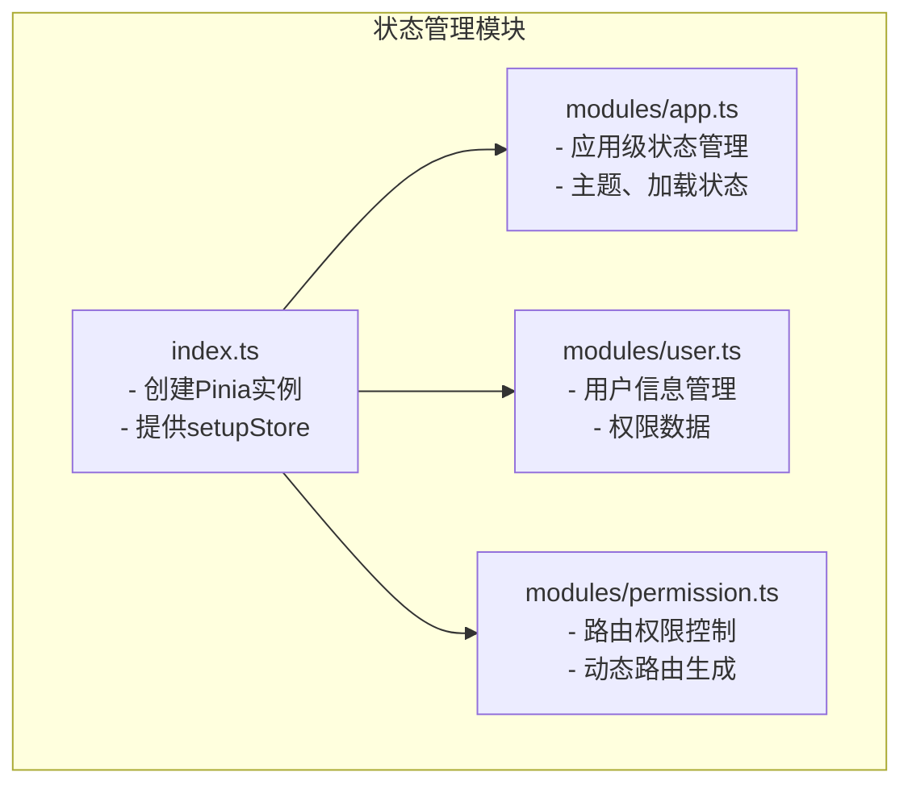
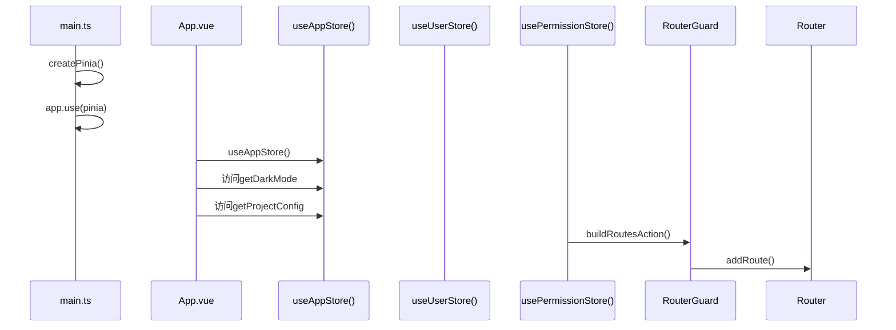
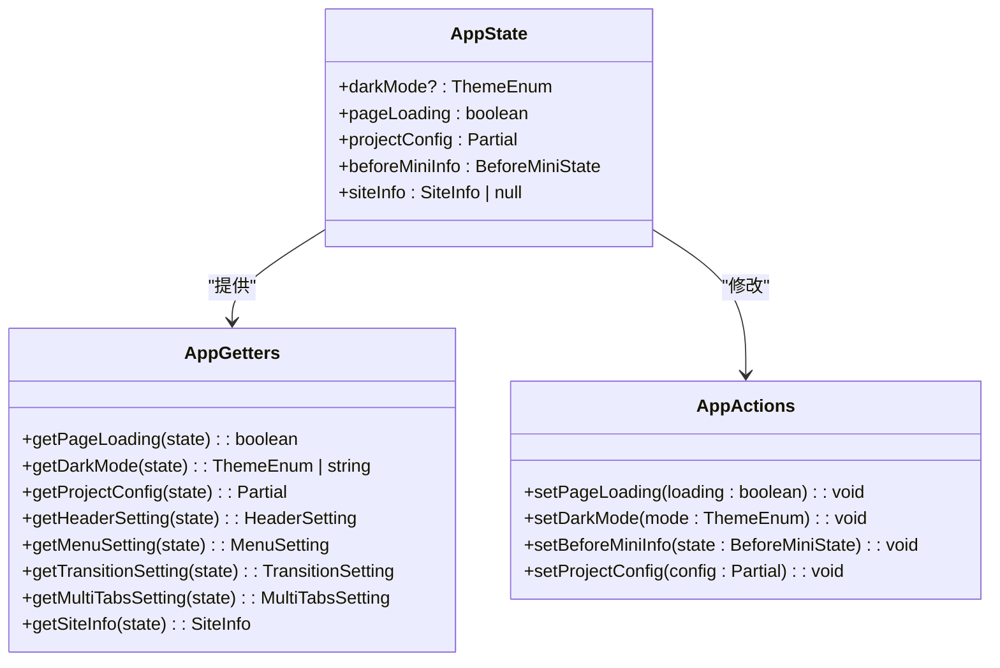
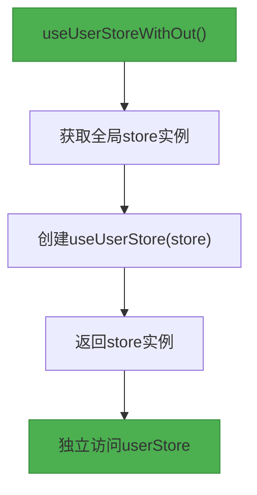
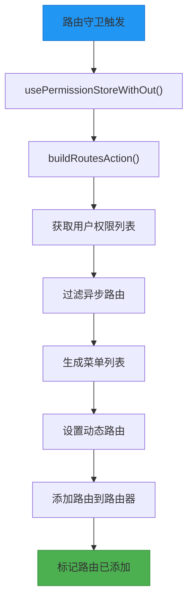
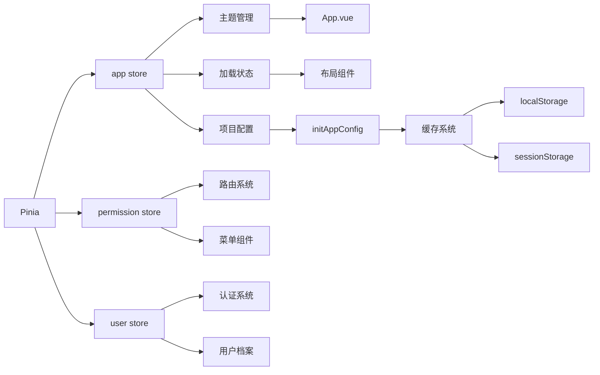
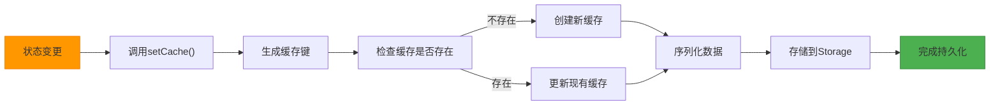

# 状态管理

<cite>
**本文档引用的文件**
- [app.ts](file://src/stores/modules/app.ts)
- [user.ts](file://src/stores/modules/user.ts)
- [permission.ts](file://src/stores/modules/permission.ts)
- [index.ts](file://src/stores/index.ts)
- [main.ts](file://src/main.ts)
- [initAppConfig.ts](file://src/logics/initAppConfig.ts)
- [cache.ts](file://src/utils/cache.ts)
- [project.ts](file://src/config/project.ts)
- [appEnum.ts](file://src/enums/appEnum.ts)
- [cacheEnum.ts](file://src/enums/cacheEnum.ts)
- [store.d.ts](file://types/store.d.ts)
- [config.d.ts](file://types/config.d.ts)
- [App.vue](file://src/App.vue)
- [permissionGuard.ts](file://src/router/guard/permissionGuard.ts)
- [helper.ts](file://src/layouts/sider/helper.ts)
- [usePermission.ts](file://src/hooks/usePermission.ts)
</cite>

## 目录
1. [简介](#简介)
2. [项目结构](#项目结构)
3. [核心组件](#核心组件)
4. [架构概述](#架构概述)
5. [详细组件分析](#详细组件分析)
6. [依赖分析](#依赖分析)
7. [性能考虑](#性能考虑)
8. [故障排除指南](#故障排除指南)
9. [结论](#结论)

## 简介
本文档系统性地阐述了基于Pinia的状态管理架构，详细说明了store的模块化设计，包括app、user、permission三个核心模块的职责划分。文档解释了`defineStore`的使用方式，以及如何通过`setupStore`在应用启动时注册store。重点描述了`useAppStore`、`useUserStore`和`usePermissionStore`等Hook的实现原理，以及`useStoreWithOut`模式如何实现store的独立访问。结合代码示例展示了状态、getters和actions的定义与调用方式，说明了模块间状态的依赖关系和数据流。提供了状态持久化、模块热重载等高级特性的配置方法，并列举了常见问题如状态未更新、模块未注册等的排查方案。

## 项目结构
项目中的状态管理模块位于`src/stores/`目录下，采用模块化设计，将不同的业务状态分离到独立的模块中。主入口文件`index.ts`负责创建Pinia实例并提供应用级别的store注册机制。`modules/`目录下包含了`app.ts`、`user.ts`和`permission.ts`三个核心模块，分别管理应用级状态、用户信息和权限路由。

**图示来源**
- [index.ts](file://src/stores/index.ts#L1-L10)
- [app.ts](file://src/stores/modules/app.ts#L1-L75)
- [user.ts](file://src/stores/modules/user.ts#L1-L28)
- [permission.ts](file://src/stores/modules/permission.ts#L1-L66)

**本节来源**
- [src/stores/](file://src/stores/)

## 核心组件
状态管理架构的核心组件包括三个store模块：app、user和permission。每个模块都使用`defineStore`函数定义，具有独立的状态(state)、计算属性(getters)和动作(actions)。`app`模块负责管理应用级别的状态，如主题模式、页面加载状态和项目配置；`user`模块用于存储用户相关信息；`permission`模块则处理路由权限和动态路由生成。

**本节来源**
- [app.ts](file://src/stores/modules/app.ts#L19-L75)
- [user.ts](file://src/stores/modules/user.ts#L20-L24)
- [permission.ts](file://src/stores/modules/permission.ts#L13-L62)

## 架构概述
整个状态管理架构基于Pinia实现，采用模块化设计思想。应用启动时通过`main.ts`中的`createPinia()`创建store实例，并在`App.vue`中通过`useAppStore()`访问应用级状态。各模块之间通过明确的职责划分保持低耦合，同时通过类型定义确保类型安全。

**图示来源**
- [main.ts](file://src/main.ts#L1-L28)
- [App.vue](file://src/App.vue#L1-L42)
- [app.ts](file://src/stores/modules/app.ts#L19-L75)
- [permissionGuard.ts](file://src/router/guard/permissionGuard.ts#L1-L60)

## 详细组件分析

### app模块分析
app模块是应用的核心状态管理器，负责维护应用级别的全局状态。它定义了应用主题模式、页面加载状态、项目配置等关键状态，并通过getters提供便捷的访问接口。

#### 状态与计算属性

**图示来源**
- [app.ts](file://src/stores/modules/app.ts#L11-L41)
- [store.d.ts](file://types/store.d.ts#L10-L37)
- [config.d.ts](file://types/config.d.ts#L11-L28)

**本节来源**
- [app.ts](file://src/stores/modules/app.ts#L1-L75)
- [store.d.ts](file://types/store.d.ts#L1-L38)
- [config.d.ts](file://types/config.d.ts#L1-L28)

### user模块分析
user模块负责管理用户相关的信息和权限数据。虽然当前实现中状态为空，但其设计模式为未来扩展提供了清晰的框架。

#### Hook实现原理

**图示来源**
- [user.ts](file://src/stores/modules/user.ts#L26-L28)

**本节来源**
- [user.ts](file://src/stores/modules/user.ts#L1-L28)

### permission模块分析
permission模块负责处理应用的权限控制和动态路由生成，是实现基于角色的访问控制(RBAC)的关键组件。

#### 权限控制流程

**图示来源**
- [permission.ts](file://src/stores/modules/permission.ts#L34-L60)
- [permissionGuard.ts](file://src/router/guard/permissionGuard.ts#L9-L60)

**本节来源**
- [permission.ts](file://src/stores/modules/permission.ts#L1-L66)
- [permissionGuard.ts](file://src/router/guard/permissionGuard.ts#L1-L60)

## 依赖分析
状态管理模块与其他系统组件存在明确的依赖关系，这些关系确保了状态的正确传播和应用的一致性。

**图示来源**
- [index.ts](file://src/stores/index.ts#L1-L10)
- [app.ts](file://src/stores/modules/app.ts#L1-L75)
- [permission.ts](file://src/stores/modules/permission.ts#L1-L66)
- [initAppConfig.ts](file://src/logics/initAppConfig.ts#L1-L53)
- [cache.ts](file://src/utils/cache.ts#L1-L138)

**本节来源**
- [src/stores/](file://src/stores/)
- [src/logics/initAppConfig.ts](file://src/logics/initAppConfig.ts#L1-L53)
- [src/utils/cache.ts](file://src/utils/cache.ts#L1-L138)

## 性能考虑
状态管理架构在设计时考虑了多个性能优化点，包括状态持久化、缓存策略和按需加载等。

### 状态持久化机制
状态持久化通过`cache.ts`工具实现，将关键状态存储在浏览器的`localStorage`或`sessionStorage`中，确保页面刷新后状态不丢失。

**图示来源**
- [cache.ts](file://src/utils/cache.ts#L52-L96)
- [app.ts](file://src/stores/modules/app.ts#L54-L57)
- [app.ts](file://src/stores/modules/app.ts#L70-L72)

**本节来源**
- [cache.ts](file://src/utils/cache.ts#L1-L138)
- [app.ts](file://src/stores/modules/app.ts#L1-L75)
- [project.ts](file://src/config/project.ts#L23-L24)

## 故障排除指南
在使用状态管理架构时可能会遇到一些常见问题，以下是这些问题的排查方案。

### 常见问题及解决方案
| 问题现象 | 可能原因 | 解决方案 |
|---------|--------|---------|
| 状态未更新 | 组件未正确订阅store变化 | 确保使用`computed`或`watch`监听store状态 |
| 模块未注册 | Pinia实例未正确安装 | 检查`main.ts`中是否调用了`app.use(pinia)` |
| 持久化失效 | 缓存键生成错误 | 检查`PREFIX_CLS`和版本号是否正确 |
| 主题不生效 | getDarkMode逻辑问题 | 确认`getCache`返回值和默认值处理 |
| 路由无法加载 | 动态路由未正确添加 | 检查`buildRoutesAction`返回的路由是否有效 |

**本节来源**
- [app.ts](file://src/stores/modules/app.ts#L31-L32)
- [main.ts](file://src/main.ts#L15-L16)
- [cache.ts](file://src/utils/cache.ts#L20-L27)
- [permission.ts](file://src/stores/modules/permission.ts#L34-L60)

## 结论
本文档详细阐述了基于Pinia的状态管理架构，展示了如何通过模块化设计实现清晰的状态管理。app、user和permission三个核心模块各司其职，通过`defineStore`定义状态，`useStore`系列Hook提供访问接口，`useStoreWithOut`模式支持独立访问。状态持久化机制确保了用户体验的连续性，而明确的依赖关系和类型定义保证了系统的可维护性。该架构为大型Vue应用提供了可靠的状态管理解决方案，具有良好的扩展性和可测试性。