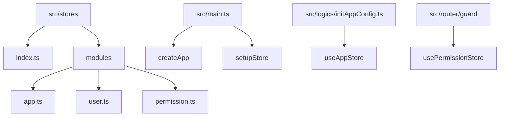
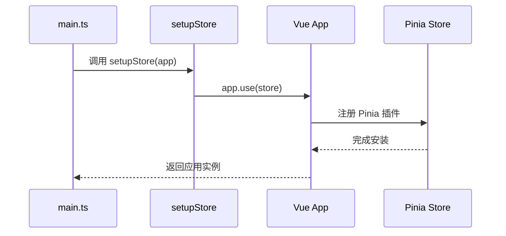
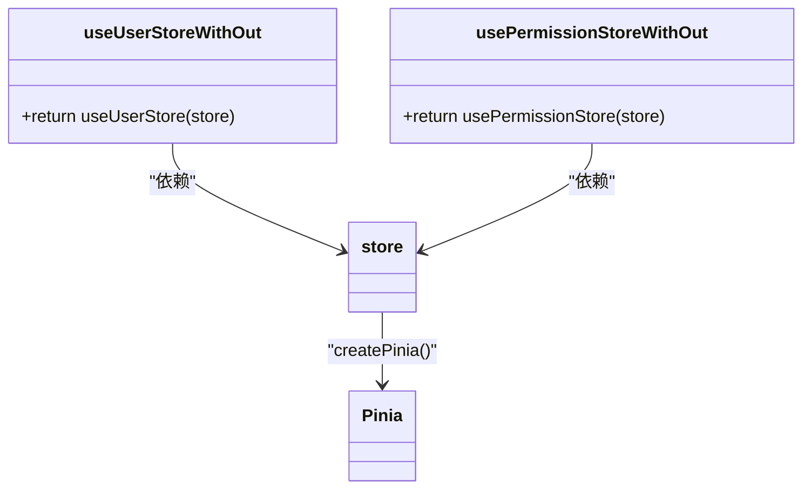
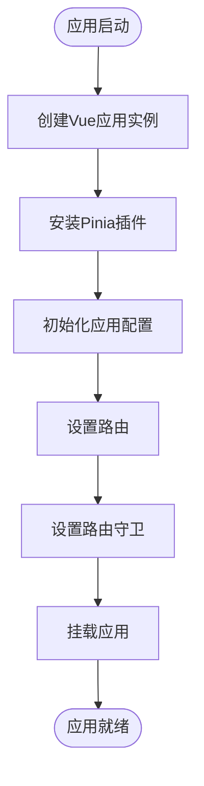
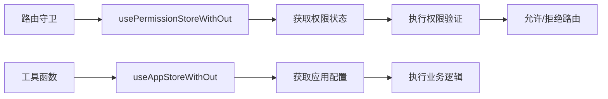

# 状态管理初始化

<cite>
**本文档中引用的文件**  
- [src/stores/index.ts](file://src/stores/index.ts)
- [src/main.ts](file://src/main.ts)
- [src/stores/modules/user.ts](file://src/stores/modules/user.ts)
- [src/stores/modules/app.ts](file://src/stores/modules/app.ts)
- [src/stores/modules/permission.ts](file://src/stores/modules/permission.ts)
- [src/logics/initAppConfig.ts](file://src/logics/initAppConfig.ts)
- [src/router/index.ts](file://src/router/index.ts)
</cite>

## 目录
1. [项目结构](#项目结构)
2. [Pinia全局初始化流程](#pinia全局初始化流程)
3. [Store实例的创建与安装](#store实例的创建与安装)
4. [useStoreWithOut模式详解](#usestorewithout模式详解)
5. [启动流程中的调用时机](#启动流程中的调用时机)
6. [非组件环境下的最佳实践](#非组件环境下的最佳实践)
7. [Pinia插件机制与应用](#pinia插件机制与应用)

## 项目结构

本项目采用模块化架构设计，状态管理模块位于`src/stores/`目录下，遵循清晰的分层结构。核心状态管理逻辑通过Pinia实现，模块化组织便于维护和扩展。

**图示来源**  
- [src/stores/index.ts](file://src/stores/index.ts#L1-L10)
- [src/stores/modules/user.ts](file://src/stores/modules/user.ts#L1-L28)
- [src/main.ts](file://src/main.ts#L1-L28)

**本节来源**  
- [src/stores/index.ts](file://src/stores/index.ts#L1-L10)
- [src/main.ts](file://src/main.ts#L1-L28)

## Pinia全局初始化流程

Pinia状态管理系统的初始化流程是整个应用启动的关键环节。该流程确保了全局store实例的正确创建和安装，为后续的状态管理奠定了基础。系统通过`src/stores/index.ts`文件统一管理store的创建和导出，实现了依赖注入的标准化。

**本节来源**  
- [src/stores/index.ts](file://src/stores/index.ts#L1-L10)

## Store实例的创建与安装

在`src/stores/index.ts`文件中，通过`createPinia()`函数调用创建了全局的store实例。该实例被赋值给常量`store`，并通过`setupStore`函数使用`app.use(store)`方法安装到Vue应用实例上。这一过程确保了所有组件都能通过依赖注入访问到全局store。

**图示来源**  
- [src/stores/index.ts](file://src/stores/index.ts#L4-L8)
- [src/main.ts](file://src/main.ts#L15)

**本节来源**  
- [src/stores/index.ts](file://src/stores/index.ts#L4-L10)
- [src/main.ts](file://src/main.ts#L15)

## useStoreWithOut模式详解

`store`常量的导出为`useStoreWithOut`模式提供了依赖注入的实例基础。这种模式允许在组件的setup函数外部（如路由守卫、工具函数）安全地使用store。以`useUserStoreWithOut`为例，它通过`useUserStore(store)`显式传入store实例，避免了在非组件环境中使用`useStore()`可能引发的错误。

**图示来源**  
- [src/stores/modules/user.ts](file://src/stores/modules/user.ts#L26-L28)
- [src/stores/modules/permission.ts](file://src/stores/modules/permission.ts#L64-L66)
- [src/stores/index.ts](file://src/stores/index.ts#L4)

**本节来源**  
- [src/stores/modules/user.ts](file://src/stores/modules/user.ts#L26-L28)
- [src/stores/modules/permission.ts](file://src/stores/modules/permission.ts#L64-L66)

## 启动流程中的调用时机

结合`main.ts`的启动流程，`setupStore`的调用时机和顺序至关重要。在`main()`函数中，首先创建Vue应用实例，然后立即调用`app.use(createPinia())`进行store安装。这一操作必须在其他依赖store的初始化逻辑（如`initAppConfigStore`）之前完成，以确保这些逻辑能够正确访问store。

**图示来源**  
- [src/main.ts](file://src/main.ts#L13-L25)
- [src/logics/initAppConfig.ts](file://src/logics/initAppConfig.ts#L15)
- [src/router/index.ts](file://src/router/index.ts#L36)

**本节来源**  
- [src/main.ts](file://src/main.ts#L12-L28)
- [src/logics/initAppConfig.ts](file://src/logics/initAppConfig.ts#L15)

## 非组件环境下的最佳实践

在Vite插件或非Vue组件中使用`useStoreWithOut`的最佳实践是确保store实例已正确初始化。例如，在路由守卫中，通过`usePermissionStoreWithOut()`获取权限store实例，可以在路由跳转前进行权限验证。这种模式避免了在非响应式环境中直接使用组合式API可能带来的问题。

**图示来源**  
- [src/router/guard/index.ts](file://src/router/guard/index.ts#L11)
- [src/stores/modules/permission.ts](file://src/stores/modules/permission.ts#L64-L66)

**本节来源**  
- [src/router/guard/index.ts](file://src/router/guard/index.ts#L11)
- [src/stores/modules/permission.ts](file://src/stores/modules/permission.ts#L64-L66)

## Pinia插件机制与应用

Pinia插件机制为状态管理提供了强大的扩展能力。通过注册插件，可以实现日志记录、状态持久化等高级功能。插件可以在store创建时通过`pinia.use()`方法注册，或者在应用初始化时作为插件链的一部分进行安装。常见的应用场景包括开发环境下的状态变更日志记录，以及生产环境中的localStorage持久化存储。

**本节来源**  
- [src/stores/index.ts](file://src/stores/index.ts#L4)
- [src/main.ts](file://src/main.ts#L15)