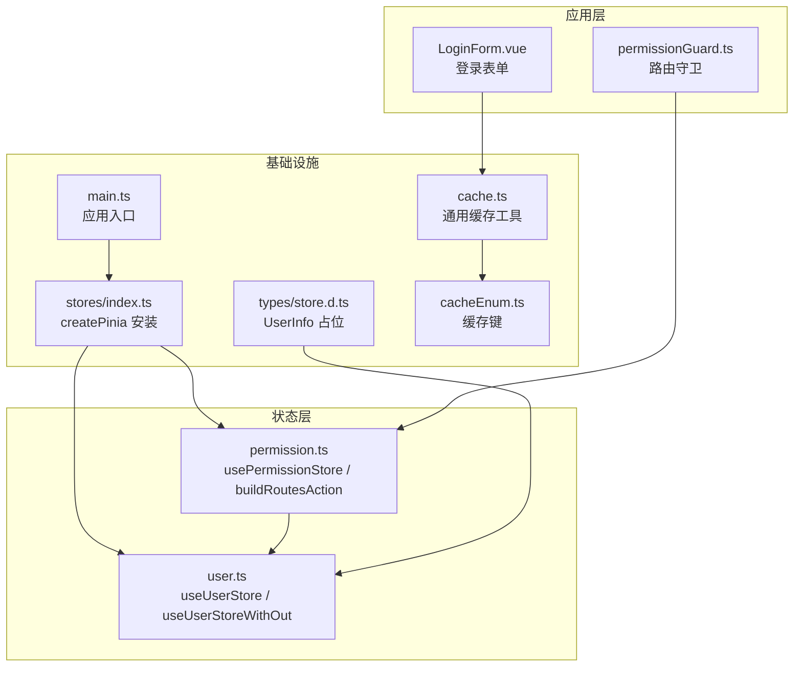
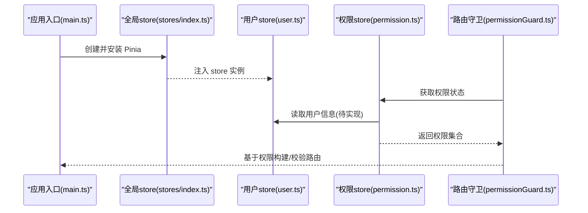
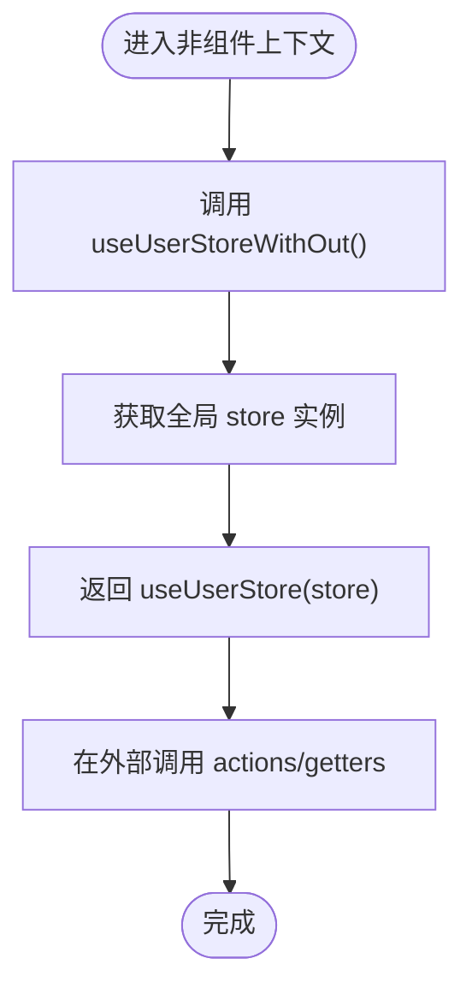
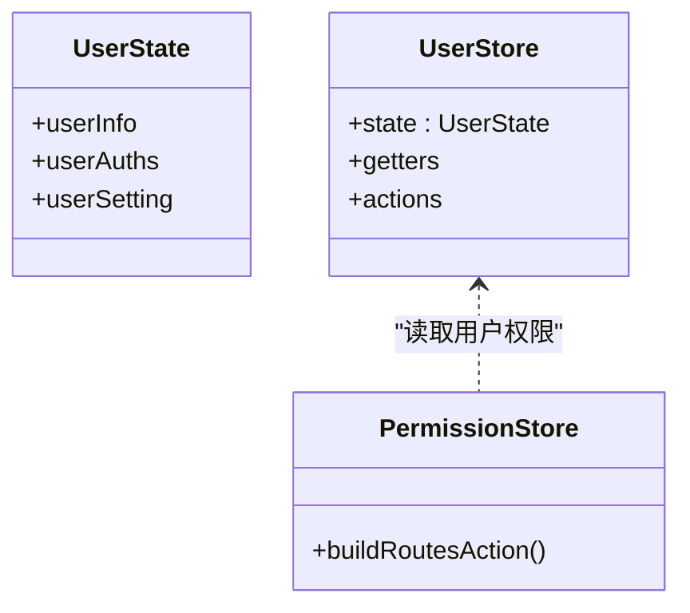
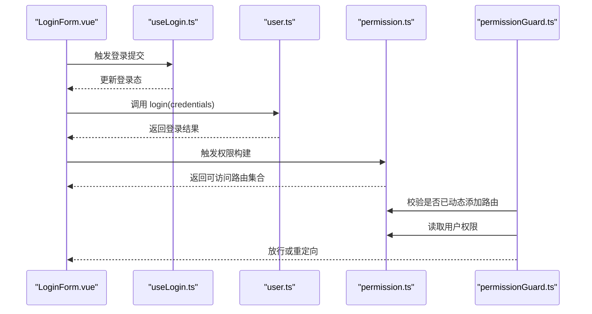
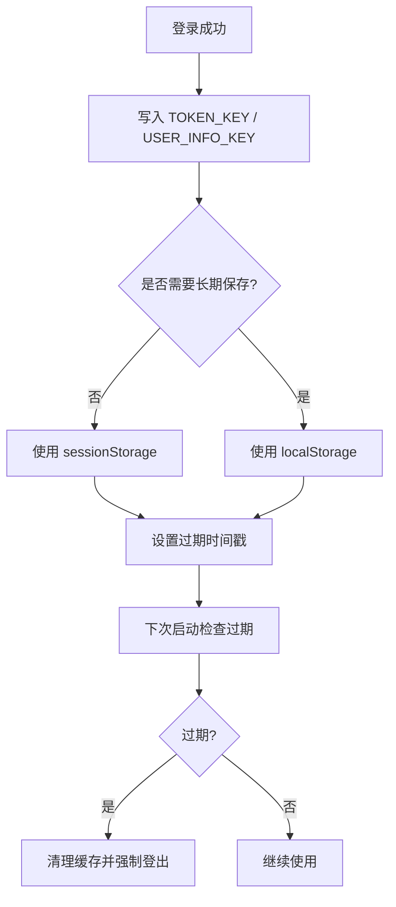
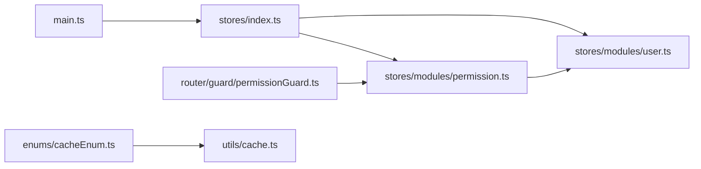

# 用户状态管理 (User Store)

<cite>
**本文引用的文件**
- [src/stores/modules/user.ts](file://src/stores/modules/user.ts)
- [src/stores/index.ts](file://src/stores/index.ts)
- [types/store.d.ts](file://types/store.d.ts)
- [src/enums/cacheEnum.ts](file://src/enums/cacheEnum.ts)
- [src/utils/cache.ts](file://src/utils/cache.ts)
- [src/router/guard/permissionGuard.ts](file://src/router/guard/permissionGuard.ts)
- [src/stores/modules/permission.ts](file://src/stores/modules/permission.ts)
- [src/views/system/login/useLogin.ts](file://src/views/system/login/useLogin.ts)
- [src/views/system/login/components/LoginForm.vue](file://src/views/system/login/components/LoginForm.vue)
- [src/main.ts](file://src/main.ts)
</cite>

## 目录
1. [简介](#简介)
2. [项目结构](#项目结构)
3. [核心组件](#核心组件)
4. [架构总览](#架构总览)
5. [详细组件分析](#详细组件分析)
6. [依赖关系分析](#依赖关系分析)
7. [性能考量](#性能考量)
8. [故障排查指南](#故障排查指南)
9. [结论](#结论)
10. [附录](#附录)

## 简介
本文件围绕“用户状态管理”模块进行系统性设计与实现说明，尽管当前实现为空，但基于项目现有架构与约定，明确该模块在未来应承担的核心职责：统一存储与管理用户信息（userInfo）、权限列表（userAuths）与用户个性化设置（userSetting），并提供在非组件上下文（如路由守卫、工具函数）中安全访问 store 的模式。同时，结合项目现状，给出与登录流程的集成路径、安全存储建议与过期处理策略，并提供可落地的实现示例与流程图。

## 项目结构
用户状态模块位于 stores/modules 目录下，采用与项目其他 store 类似的分层组织方式：
- 模块入口：src/stores/modules/user.ts 定义 useUserStore 与 useUserStoreWithOut 工具函数
- 全局 store 初始化：src/stores/index.ts 提供 createPinia 实例与安装入口
- 类型定义：types/store.d.ts 中包含 UserInfo 等类型占位，便于后续扩展
- 缓存与密钥：src/enums/cacheEnum.ts 定义了 USER_INFO_KEY 等缓存键，src/utils/cache.ts 提供通用缓存读写能力
- 路由守卫：src/router/guard/permissionGuard.ts 与 src/stores/modules/permission.ts 展示了权限与路由构建的协作关系，为用户状态与权限联动提供参考

图表来源
- [src/stores/modules/user.ts](file://src/stores/modules/user.ts#L1-L29)
- [src/stores/modules/permission.ts](file://src/stores/modules/permission.ts#L1-L67)
- [src/router/guard/permissionGuard.ts](file://src/router/guard/permissionGuard.ts#L1-L60)
- [src/stores/index.ts](file://src/stores/index.ts#L1-L11)
- [types/store.d.ts](file://types/store.d.ts#L1-L38)
- [src/enums/cacheEnum.ts](file://src/enums/cacheEnum.ts#L1-L17)
- [src/utils/cache.ts](file://src/utils/cache.ts#L1-L138)
- [src/main.ts](file://src/main.ts#L1-L29)

章节来源
- [src/stores/modules/user.ts](file://src/stores/modules/user.ts#L1-L29)
- [src/stores/index.ts](file://src/stores/index.ts#L1-L11)
- [types/store.d.ts](file://types/store.d.ts#L1-L38)
- [src/enums/cacheEnum.ts](file://src/enums/cacheEnum.ts#L1-L17)
- [src/utils/cache.ts](file://src/utils/cache.ts#L1-L138)
- [src/router/guard/permissionGuard.ts](file://src/router/guard/permissionGuard.ts#L1-L60)
- [src/stores/modules/permission.ts](file://src/stores/modules/permission.ts#L1-L67)
- [src/main.ts](file://src/main.ts#L1-L29)

## 核心组件
- useUserStore：当前为空实现，预留用于承载用户信息、权限与设置的状态与行为
- useUserStoreWithOut：提供在非组件上下文安全访问 store 的工厂函数，与 usePermissionStoreWithOut 的模式一致
- 类型占位：types/store.d.ts 中的 UserInfo 为后续扩展留白
- 缓存键与工具：cacheEnum.ts 与 cache.ts 为用户信息与令牌等敏感数据提供安全落盘与清理机制

章节来源
- [src/stores/modules/user.ts](file://src/stores/modules/user.ts#L1-L29)
- [types/store.d.ts](file://types/store.d.ts#L1-L38)
- [src/enums/cacheEnum.ts](file://src/enums/cacheEnum.ts#L1-L17)
- [src/utils/cache.ts](file://src/utils/cache.ts#L1-L138)

## 架构总览
用户状态模块在整体架构中的定位如下：
- 在应用启动时，main.ts 通过 createPinia 安装全局 store；stores/index.ts 提供统一安装入口
- user.ts 作为用户域 store，向外暴露 useUserStore 与 useUserStoreWithOut
- permission.ts 与 permissionGuard.ts 体现“权限驱动路由”的思路：权限来源于用户状态，路由根据权限动态构建
- cacheEnum.ts 与 cache.ts 为用户信息、令牌等敏感数据提供安全存储与生命周期管理

图表来源
- [src/main.ts](file://src/main.ts#L1-L29)
- [src/stores/index.ts](file://src/stores/index.ts#L1-L11)
- [src/stores/modules/user.ts](file://src/stores/modules/user.ts#L1-L29)
- [src/stores/modules/permission.ts](file://src/stores/modules/permission.ts#L1-L67)
- [src/router/guard/permissionGuard.ts](file://src/router/guard/permissionGuard.ts#L1-L60)

## 详细组件分析

### useUserStoreWithOut 设计目的与使用场景
- 设计目的：解决在 Vue setup 外部（如路由守卫、工具函数、服务层）无法直接使用 useUserStore 的问题，通过传入全局 store 实例，实现跨上下文访问
- 使用模式：与 permission.ts 中的 usePermissionStoreWithOut 保持一致，确保在非组件环境中也能安全获取 store 实例
- 适用场景举例：
  - 路由守卫中判断用户是否具备访问某路由的权限
  - 工具函数中读取用户信息以决定业务逻辑分支
  - 服务层在发起请求前注入用户上下文

图表来源
- [src/stores/modules/user.ts](file://src/stores/modules/user.ts#L20-L29)
- [src/stores/modules/permission.ts](file://src/stores/modules/permission.ts#L64-L67)

章节来源
- [src/stores/modules/user.ts](file://src/stores/modules/user.ts#L20-L29)
- [src/stores/modules/permission.ts](file://src/stores/modules/permission.ts#L64-L67)

### 用户状态模型与职责边界
- 用户信息中心（userInfo）：承载登录用户的基本信息，作为权限与个性化设置的来源
- 权限列表（userAuths）：用于路由与功能权限控制，与 permission.ts 的 buildRoutesAction 协作
- 用户个性化设置（userSetting）：站点主题、语言、菜单布局等偏好项，可与 app.ts 的项目配置协同

图表来源
- [src/stores/modules/user.ts](file://src/stores/modules/user.ts#L1-L29)
- [src/stores/modules/permission.ts](file://src/stores/modules/permission.ts#L1-L67)

章节来源
- [src/stores/modules/user.ts](file://src/stores/modules/user.ts#L1-L29)
- [src/stores/modules/permission.ts](file://src/stores/modules/permission.ts#L1-L67)

### 与登录流程的集成路径
- 登录视图：LoginForm.vue 负责收集账户与密码，触发登录流程
- 登录逻辑：useLogin.ts 提供登录态切换与状态管理，登录成功后应调用 user.ts 的 login action 持久化用户数据
- 权限构建：permission.ts 的 buildRoutesAction 会根据用户权限过滤路由，当前注释提示需要从 userStore 获取用户信息
- 路由守卫：permissionGuard.ts 在 beforeEach 中根据权限决定放行或重定向

图表来源
- [src/views/system/login/components/LoginForm.vue](file://src/views/system/login/components/LoginForm.vue#L1-L81)
- [src/views/system/login/useLogin.ts](file://src/views/system/login/useLogin.ts#L1-L41)
- [src/stores/modules/user.ts](file://src/stores/modules/user.ts#L1-L29)
- [src/stores/modules/permission.ts](file://src/stores/modules/permission.ts#L1-L67)
- [src/router/guard/permissionGuard.ts](file://src/router/guard/permissionGuard.ts#L1-L60)

章节来源
- [src/views/system/login/components/LoginForm.vue](file://src/views/system/login/components/LoginForm.vue#L1-L81)
- [src/views/system/login/useLogin.ts](file://src/views/system/login/useLogin.ts#L1-L41)
- [src/stores/modules/permission.ts](file://src/stores/modules/permission.ts#L1-L67)
- [src/router/guard/permissionGuard.ts](file://src/router/guard/permissionGuard.ts#L1-L60)

### 安全存储与过期处理策略
- 缓存键规划：使用 cacheEnum.ts 中的 USER_INFO_KEY、TOKEN_KEY 等键名，区分用户信息与令牌等敏感数据
- 存储位置：通过 cache.ts 的 setCache/getCache/removeCache/clearCache 等方法，支持本地与会话两种存储位置
- 过期策略：可结合缓存时间戳与版本号，在 cache.ts 中实现统一的过期检测与清理逻辑
- 最佳实践：
  - 敏感字段不落盘明文，必要时进行加密存储
  - 登出时主动清除 USER_INFO_KEY、TOKEN_KEY 等键
  - 在路由守卫中增加令牌有效性校验，无效则强制登出并重定向

图表来源
- [src/enums/cacheEnum.ts](file://src/enums/cacheEnum.ts#L1-L17)
- [src/utils/cache.ts](file://src/utils/cache.ts#L1-L138)

章节来源
- [src/enums/cacheEnum.ts](file://src/enums/cacheEnum.ts#L1-L17)
- [src/utils/cache.ts](file://src/utils/cache.ts#L1-L138)

### 未来实现示例（不含具体代码）
- 定义 UserState 接口：包含 userInfo、userAuths、userSetting 字段，参考 types/store.d.ts 中的 UserInfo 占位
- 添加 login action：接收登录凭据，调用后端接口获取用户信息与令牌，写入缓存与 store
- 添加 logout action：清理缓存与 store，重置路由守卫中的动态路由标记
- 添加 getUserInfo getter：对外暴露只读的用户信息快照
- 权限联动：在 permission.ts 的 buildRoutesAction 中读取 userStore 的用户权限，完成路由过滤与菜单构建

章节来源
- [types/store.d.ts](file://types/store.d.ts#L1-L38)
- [src/stores/modules/user.ts](file://src/stores/modules/user.ts#L1-L29)
- [src/stores/modules/permission.ts](file://src/stores/modules/permission.ts#L1-L67)

## 依赖关系分析
- user.ts 与 stores/index.ts：通过 store 实例注入，确保在非组件上下文也能访问
- permission.ts 与 permissionGuard.ts：permissionGuard.ts 依赖 permission.ts 的权限状态，permission.ts 依赖 userStore 的用户权限
- cacheEnum.ts 与 cache.ts：为用户信息与令牌提供统一的缓存键与操作方法
- main.ts：应用启动时安装 Pinia，保证 store 可用

图表来源
- [src/main.ts](file://src/main.ts#L1-L29)
- [src/stores/index.ts](file://src/stores/index.ts#L1-L11)
- [src/stores/modules/user.ts](file://src/stores/modules/user.ts#L1-L29)
- [src/stores/modules/permission.ts](file://src/stores/modules/permission.ts#L1-L67)
- [src/router/guard/permissionGuard.ts](file://src/router/guard/permissionGuard.ts#L1-L60)
- [src/enums/cacheEnum.ts](file://src/enums/cacheEnum.ts#L1-L17)
- [src/utils/cache.ts](file://src/utils/cache.ts#L1-L138)

章节来源
- [src/main.ts](file://src/main.ts#L1-L29)
- [src/stores/index.ts](file://src/stores/index.ts#L1-L11)
- [src/stores/modules/user.ts](file://src/stores/modules/user.ts#L1-L29)
- [src/stores/modules/permission.ts](file://src/stores/modules/permission.ts#L1-L67)
- [src/router/guard/permissionGuard.ts](file://src/router/guard/permissionGuard.ts#L1-L60)
- [src/enums/cacheEnum.ts](file://src/enums/cacheEnum.ts#L1-L17)
- [src/utils/cache.ts](file://src/utils/cache.ts#L1-L138)

## 性能考量
- 状态粒度：将 userInfo、userAuths、userSetting 分离存储，避免不必要的响应式更新
- 缓存命中：合理选择 localStorage 与 sessionStorage，减少频繁 IO
- 权限计算：在 permission.ts 中对路由进行一次性过滤与扁平化，降低运行时开销
- 登录流程：在登录成功后批量写入缓存与 store，避免多次同步写入

## 故障排查指南
- 非组件上下文无法访问 store：确认使用 useUserStoreWithOut 并传入全局 store 实例
- 登录后权限未生效：检查 permission.ts 的 buildRoutesAction 是否正确读取 userStore 的用户权限
- 缓存异常：核对 cacheEnum.ts 的键名与 cache.ts 的读写方法是否匹配
- 登出后仍可访问受控路由：检查路由守卫中是否正确清理动态路由标记与缓存

章节来源
- [src/stores/modules/user.ts](file://src/stores/modules/user.ts#L20-L29)
- [src/stores/modules/permission.ts](file://src/stores/modules/permission.ts#L1-L67)
- [src/router/guard/permissionGuard.ts](file://src/router/guard/permissionGuard.ts#L1-L60)
- [src/enums/cacheEnum.ts](file://src/enums/cacheEnum.ts#L1-L17)
- [src/utils/cache.ts](file://src/utils/cache.ts#L1-L138)

## 结论
当前 user.ts 为空实现，但其设计已为后续用户状态中心奠定基础。通过 useUserStoreWithOut 模式，可在非组件上下文中安全访问 store；结合 permission.ts 与 permissionGuard.ts 的权限驱动路由思路，用户状态将成为权限与路由构建的核心数据源。配合 cacheEnum.ts 与 cache.ts 的安全存储策略，可实现用户信息与令牌的可靠持久化与生命周期管理。建议尽快补齐 login、logout 与 getUserInfo 等关键动作与 getter，并在登录流程中完成与 userStore 的集成。

## 附录
- 关键文件路径参考
  - [src/stores/modules/user.ts](file://src/stores/modules/user.ts#L1-L29)
  - [src/stores/index.ts](file://src/stores/index.ts#L1-L11)
  - [types/store.d.ts](file://types/store.d.ts#L1-L38)
  - [src/enums/cacheEnum.ts](file://src/enums/cacheEnum.ts#L1-L17)
  - [src/utils/cache.ts](file://src/utils/cache.ts#L1-L138)
  - [src/router/guard/permissionGuard.ts](file://src/router/guard/permissionGuard.ts#L1-L60)
  - [src/stores/modules/permission.ts](file://src/stores/modules/permission.ts#L1-L67)
  - [src/views/system/login/useLogin.ts](file://src/views/system/login/useLogin.ts#L1-L41)
  - [src/views/system/login/components/LoginForm.vue](file://src/views/system/login/components/LoginForm.vue#L1-L81)
  - [src/main.ts](file://src/main.ts#L1-L29)