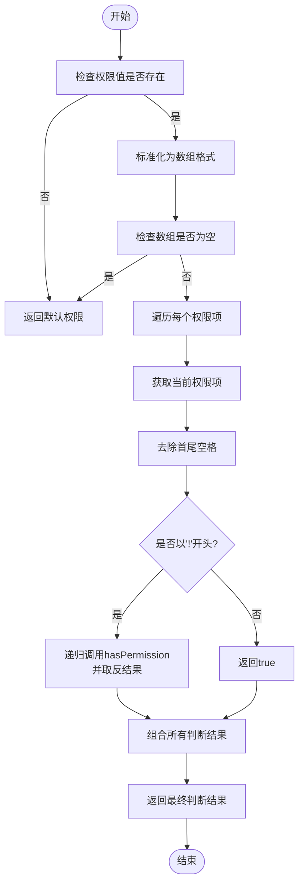
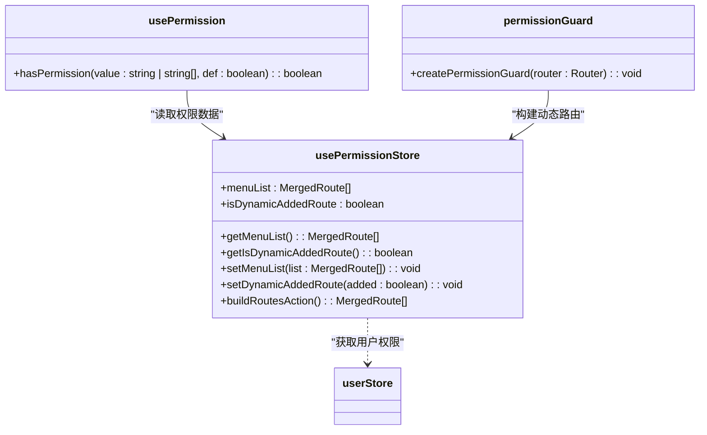

# 权限组合式函数 (usePermission)

<cite>
**本文档引用的文件**
- [usePermission.ts](file://src/hooks/usePermission.ts)
- [permission.ts](file://src/stores/modules/permission.ts)
- [user.ts](file://src/stores/modules/user.ts)
- [permissionGuard.ts](file://src/router/guard/permissionGuard.ts)
- [store.d.ts](file://types/store.d.ts)
</cite>

## 目录
1. [简介](#简介)
2. [核心组件](#核心组件)
3. [权限判断逻辑分析](#权限判断逻辑分析)
4. [与Pinia Store的集成](#与pinia-store的集成)
5. [实际使用场景](#实际使用场景)
6. [响应式系统集成](#响应式系统集成)
7. [性能优化建议](#性能优化建议)

## 简介
`usePermission` 是一个Vue 3组合式函数，用于在前端应用中实现细粒度的权限控制。该函数提供了一套灵活的权限校验机制，支持字符串精确匹配、数组形式的多权限'或'判断以及取反权限规则。通过与Pinia状态管理库的集成，实现了用户权限的集中管理和动态校验。

## 核心组件

该权限系统由多个核心组件构成，包括权限组合式函数、权限状态存储和路由守卫等。这些组件协同工作，确保应用的各个层面都能进行有效的权限控制。

**本节来源**
- [usePermission.ts](file://src/hooks/usePermission.ts#L7-L31)
- [permission.ts](file://src/stores/modules/permission.ts#L13-L66)

## 权限判断逻辑分析

`usePermission` 函数的核心是 `hasPermission` 方法，它实现了复杂的权限判断逻辑：

1. **基础校验**：当传入的权限值为空时，返回默认权限值
2. **数组标准化**：将字符串或字符串数组统一转换为数组格式进行处理
3. **空数组处理**：当权限数组为空时，返回默认权限值
4. **递归取反机制**：支持以'!'开头的取反权限规则，通过递归调用实现嵌套取反逻辑
5. **多权限'或'判断**：使用 `some` 方法实现数组中任意一个权限满足即通过的逻辑

该实现采用了函数式编程的思想，通过递归方式处理取反权限，使得权限规则的表达更加灵活和强大。



**图表来源**
- [usePermission.ts](file://src/hooks/usePermission.ts#L14-L28)

**本节来源**
- [usePermission.ts](file://src/hooks/usePermission.ts#L14-L28)

## 与Pinia Store的集成

权限系统与Pinia状态管理库深度集成，通过 `permission` store 管理应用的权限状态。`usePermissionStore` 定义了菜单列表和动态路由添加状态等核心状态，并提供了相应的getter和actions。

在应用启动时，`permissionGuard` 路由守卫会调用 `buildRoutesAction` 方法，根据用户权限动态构建路由。该过程包括：
- 从用户信息中获取权限列表
- 使用权限过滤器筛选异步路由
- 构建菜单列表并进行排序
- 扁平化多级路由结构

这种设计实现了基于用户权限的动态路由生成功能，确保用户只能访问其被授权的页面。



**图表来源**
- [permission.ts](file://src/stores/modules/permission.ts#L13-L66)
- [permissionGuard.ts](file://src/router/guard/permissionGuard.ts#L9-L59)

**本节来源**
- [permission.ts](file://src/stores/modules/permission.ts#L13-L66)
- [permissionGuard.ts](file://src/router/guard/permissionGuard.ts#L9-L59)

## 实际使用场景

虽然在当前代码库中未找到直接使用 `usePermission` 的组件示例，但根据其设计，典型的使用场景包括：

1. **菜单渲染控制**：在侧边栏菜单组件中，根据用户权限决定是否显示特定菜单项
2. **按钮级权限控制**：在操作按钮（如编辑、删除）上，根据权限决定是否显示或启用
3. **页面元素显示控制**：对页面中的特定区域或功能模块进行权限控制

使用方式通常是在Vue组件的 `setup` 函数中引入并解构 `hasPermission` 方法：

```typescript
import { usePermission } from '/@/hooks/usePermission'

export default defineComponent({
  setup() {
    const { hasPermission } = usePermission()
    
    // 在模板中使用
    return { hasPermission }
  }
})
```

在模板中可以通过 `v-if` 指令进行权限控制：

```vue
<a-button v-if="hasPermission('user:edit')">编辑</a-button>
```

**本节来源**
- [usePermission.ts](file://src/hooks/usePermission.ts#L7-L31)

## 响应式系统集成

`usePermission` 函数充分利用了Vue 3的响应式系统特性。虽然当前实现中没有显式使用 `computed`，但其设计天然支持响应式更新：

1. 当用户权限发生变化时，Pinia store中的状态会自动更新
2. 由于 `hasPermission` 方法直接读取store中的权限数据，任何权限变更都会触发相关组件的重新渲染
3. 组合式函数的返回值是响应式的，确保在权限变化时视图能够自动更新

这种设计模式符合Vue 3的响应式哲学，通过状态驱动视图更新，简化了权限控制的实现。

**本节来源**
- [usePermission.ts](file://src/hooks/usePermission.ts#L7-L31)
- [permission.ts](file://src/stores/modules/permission.ts#L13-L66)

## 性能优化建议

基于当前实现，可以考虑以下性能优化点：

1. **权限缓存**：对于频繁调用的权限校验，可以引入缓存机制，避免重复计算
2. **批量校验**：提供批量权限校验方法，减少函数调用开销
3. **权限预编译**：在应用初始化时预处理复杂的权限规则，提高运行时校验效率
4. **惰性计算**：使用 `computed` 包装权限校验结果，避免不必要的重复计算

这些优化措施可以在不影响功能的前提下，提升权限校验的性能表现，特别是在复杂应用中具有重要意义。

**本节来源**
- [usePermission.ts](file://src/hooks/usePermission.ts#L14-L28)