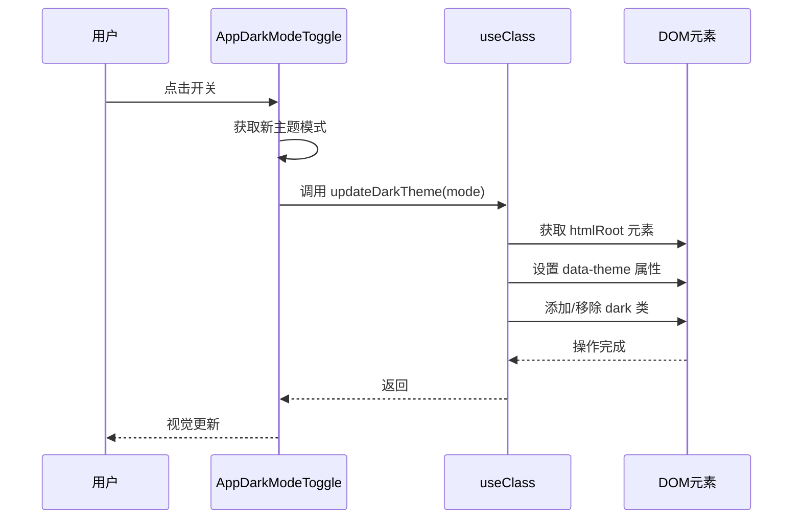

# 类名处理组合式函数 (useClass)

<cite>
**本文档引用的文件**   
- [useClass.ts](file://src/hooks/useClass.ts)
- [AppDarkModeToggle.vue](file://src/components/Application/AppDarkModeToggle.vue)
- [App.vue](file://src/App.vue)
- [Main.vue](file://src/layouts/Main.vue)
- [BasicForm.vue](file://src/components/Form/src/BasicForm.vue)
- [CountdownInput.vue](file://src/components/Countdown/src/CountdownInput.vue)
- [project.ts](file://src/config/project.ts)
- [appEnum.ts](file://src/enums/appEnum.ts)
- [tailwind.config.js](file://tailwind.config.js)
</cite>

## 目录
1. [简介](#简介)
2. [核心功能与设计目的](#核心功能与设计目的)
3. [核心实现分析](#核心实现分析)
4. [实际应用案例](#实际应用案例)
5. [与Tailwind CSS的协同工作](#与tailwind-css的协同工作)
6. [结论](#结论)

## 简介
`useClass.ts` 文件是项目中一个核心的工具模块，它提供了一系列用于处理CSS类名的实用函数。尽管文件名暗示了`useClass`组合式函数的存在，但根据代码分析，该文件实际导出了多个独立但功能相关的函数，如`buildClass`、`updateDarkTheme`等。这些函数共同构成了一个强大的类名管理系统，用于动态生成、组合和操作DOM元素的类名，特别是在处理主题切换和组件状态管理方面。

**Section sources**
- [useClass.ts](file://src/hooks/useClass.ts#L1-L110)

## 核心功能与设计目的
`useClass.ts` 模块的设计目的是为了解决在Vue应用中动态、响应式地管理CSS类名的复杂性。其主要功能包括：

1.  **类名前缀化**: 通过`buildClass`函数，将项目定义的统一前缀（如`voir`）自动添加到传入的类名上，确保了类名的唯一性和可维护性，避免了全局样式冲突。
2.  **主题切换**: `updateDarkTheme`函数提供了一种集中式的方法来切换应用的明暗主题。它通过修改根元素的`data-theme`属性和`class`列表来实现，确保了整个应用的视觉一致性。
3.  **DOM类名操作**: 提供了`addClass`、`removeClass`和`hasClass`等底层函数，用于直接操作DOM元素的类名，这些函数具有良好的浏览器兼容性，并作为上层功能的基础。

该模块的设计体现了关注点分离的原则，将类名处理的逻辑从具体的组件中抽离出来，提高了代码的复用性和可测试性。

**Section sources**
- [useClass.ts](file://src/hooks/useClass.ts#L8-L110)
- [project.ts](file://src/config/project.ts#L12)
- [appEnum.ts](file://src/enums/appEnum.ts#L2-L5)

## 核心实现分析
### `buildClass` 函数
`buildClass` 是该模块的核心函数，负责构建带有项目前缀的完整类名。

- **参数结构**: 接收一个可空的字符串`cls`作为参数。
- **实现逻辑**:
    1.  对输入进行严格的空值和类型检查。
    2.  如果输入为空或无效，则返回仅包含前缀的基础类名（如`voir`）。
    3.  如果输入包含空格，表示传入了多个类名，则将其分割，为每个类名单独添加前缀，然后重新组合。
    4.  如果输入是单个类名，则直接在前面添加前缀并返回。

该函数的实现确保了无论传入何种格式的类名，都能生成符合项目规范的、安全的类名字符串。

### `updateDarkTheme` 函数
此函数专门用于处理应用的主题切换。

- **参数结构**: 接收一个表示主题模式的字符串`mode`，默认值为`ThemeEnum.LIGHT`。
- **实现逻辑**:
    1.  首先获取ID为`htmlRoot`的根元素。
    2.  检查该元素是否已包含`dark`类。
    3.  根据传入的`mode`值，设置`data-theme`属性，并相应地添加或移除`dark`类。
    4.  这种双重机制（属性和类名）使得CSS和JavaScript都可以方便地检测当前主题。

```mermaid
flowchart TD
A[调用 updateDarkTheme] --> B{mode === DARK?}
B --> |是| C[设置 data-theme="dark"]
B --> |否| D[设置 data-theme="light"]
C --> E{已包含 dark 类?}
D --> F{已包含 dark 类?}
E --> |否| G[添加 dark 类]
F --> |是| H[移除 dark 类]
G --> I[完成]
H --> I
E --> |是| I
F --> |否| I
```

**Diagram sources **
- [useClass.ts](file://src/hooks/useClass.ts#L48-L59)

**Section sources**
- [useClass.ts](file://src/hooks/useClass.ts#L48-L59)
- [AppDarkModeToggle.vue](file://src/components/Application/AppDarkModeToggle.vue#L30-L33)

## 实际应用案例
### 在 `AppDarkModeToggle.vue` 中的应用
`AppDarkModeToggle.vue` 组件是`useClass`模块功能的典型应用示例。

- **类名生成**: 使用`buildClass("dark-switch")`生成了`voir-dark-switch`类名，并将其绑定到组件的根`div`元素上。这确保了该组件的样式具有唯一的命名空间。
- **主题切换**: 当用户点击切换开关时，会调用`toggleDarkMode`函数，该函数内部调用了`updateDarkTheme(mode)`。这触发了全局主题的切换，整个应用的视觉风格会随之改变。



**Diagram sources **
- [AppDarkModeToggle.vue](file://src/components/Application/AppDarkModeToggle.vue#L25-L33)

**Section sources**
- [AppDarkModeToggle.vue](file://src/components/Application/AppDarkModeToggle.vue#L15-L34)

### 在 `BasicForm.vue` 中的应用
`BasicForm.vue` 组件展示了如何利用`buildClass`和响应式计算来动态生成复杂的类名。

- **响应式类名计算**: 该组件定义了一个`getFormClass`计算属性。
    ```ts
    const getFormClass = computed(() => [prefixCls, { [`${prefixCls}-compact`]: unref(props).compact }])
    ```
- **实现逻辑**:
    1.  `prefixCls` 通过 `buildClass("basic-form")` 生成，如 `voir-basic-form`。
    2.  计算属性返回一个数组，其中包含基础类名和一个条件对象。
    3.  条件对象 `{ [`${prefixCls}-compact`]: unref(props).compact }` 会根据`props.compact`的布尔值来决定是否包含`voir-basic-form-compact`这个类。
- **简化模板**: 在模板中，只需将`getFormClass`绑定到`class`属性上，即可实现根据`compact`属性动态添加或移除类名，极大地简化了模板逻辑。

**Section sources**
- [BasicForm.vue](file://src/components/Form/src/BasicForm.vue#L29-L44)

### 在 `CountdownInput.vue` 中的应用
`CountdownInput.vue` 组件同样使用了`buildClass`来生成其根元素的类名。

- **类名生成**: `const prefixCls = buildClass("count-down-input")` 生成了 `voir-count-down-input` 类名。
- **样式隔离**: 该组件的`<style>`标签使用了`scoped`属性，并通过`@prefix-cls: @ant-prefix;`定义了Less变量。在样式中，它使用`.@{prefix-cls}-count-down-input`来精确地定位和样式化其内部的Ant Design Vue组件（如`.ant-input-group-addon`），实现了样式的作用域隔离，避免了对全局样式的影响。

**Section sources**
- [CountdownInput.vue](file://src/components/Countdown/src/CountdownInput.vue#L36-L37)

## 与Tailwind CSS的协同工作
该项目同时使用了自定义的CSS类名系统和Tailwind CSS实用类。

- **Tailwind配置**: `tailwind.config.js`文件中配置了`darkMode: ["selector", '[data-theme="dark"]']`。这表示Tailwind的暗黑模式是通过选择器`[data-theme="dark"]`来触发的。
- **协同机制**: `useClass.ts`中的`updateDarkTheme`函数完美地与Tailwind的这一机制协同工作。当`updateDarkTheme`被调用时，它不仅添加了`dark`类，还设置了`data-theme="dark"`属性。这双重操作确保了：
    1.  项目自定义的CSS可以通过`.dark`类来应用暗黑主题样式。
    2.  Tailwind CSS的`dark:*`实用类也能被正确激活，从而可以使用`dark:bg-gray-800`等类名来定义暗黑模式下的样式。
- **避免冲突**: 通过`buildClass`函数生成的带前缀的类名（如`voir-dark-switch`）与Tailwind的实用类（如`bg-blue-500`, `p-4`）在命名空间上是完全独立的。开发者可以在同一个元素上同时使用这两种类名，而不会产生冲突。`buildClass`负责组件级的、结构性的样式，而Tailwind的实用类则负责原子化的、细节的样式。

**Section sources**
- [useClass.ts](file://src/hooks/useClass.ts#L48-L59)
- [tailwind.config.js](file://tailwind.config.js#L9)

## 结论
虽然`useClass.ts`文件并未导出名为`useClass`的组合式函数，但它通过`buildClass`、`updateDarkTheme`等一系列精心设计的工具函数，有效地解决了项目中类名管理和主题切换的核心需求。`buildClass`函数通过自动添加项目前缀，保证了类名的唯一性和可维护性；`updateDarkTheme`函数则提供了一个简洁的API来实现全局主题切换，并与Tailwind CSS的暗黑模式无缝集成。在`AppDarkModeToggle`、`BasicForm`等组件中的实际应用表明，该模块能够显著简化模板中的`class`绑定逻辑，利用Vue的响应式系统实现动态类名计算，并通过合理的命名空间避免了样式冲突。整体而言，`useClass.ts`模块是该项目前端架构中一个关键的、设计良好的基础设施组件。

**Section sources**
- [useClass.ts](file://src/hooks/useClass.ts#L1-L110)
- [AppDarkModeToggle.vue](file://src/components/Application/AppDarkModeToggle.vue#L1-L35)
- [BasicForm.vue](file://src/components/Form/src/BasicForm.vue#L1-L54)
- [tailwind.config.js](file://tailwind.config.js#L1-L21)