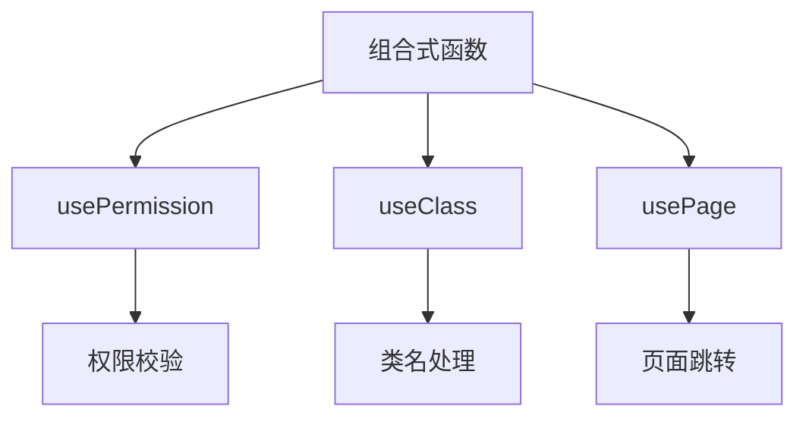
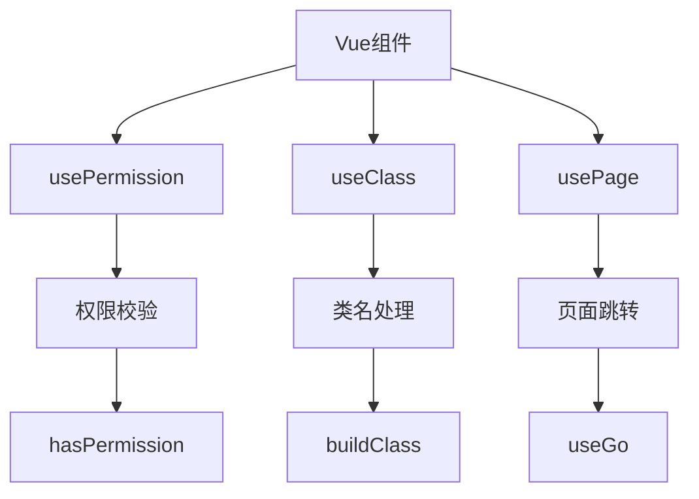
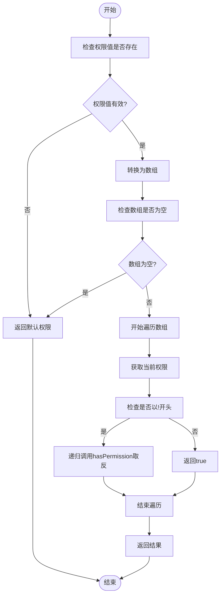
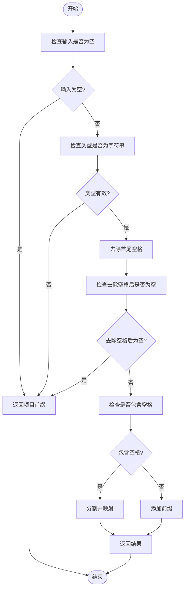
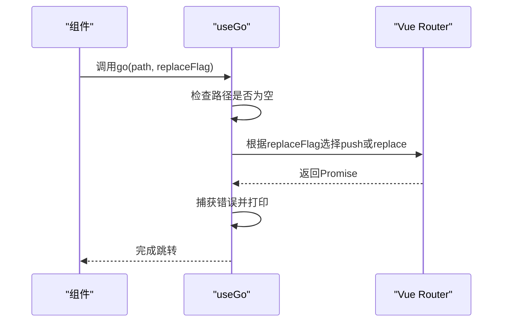
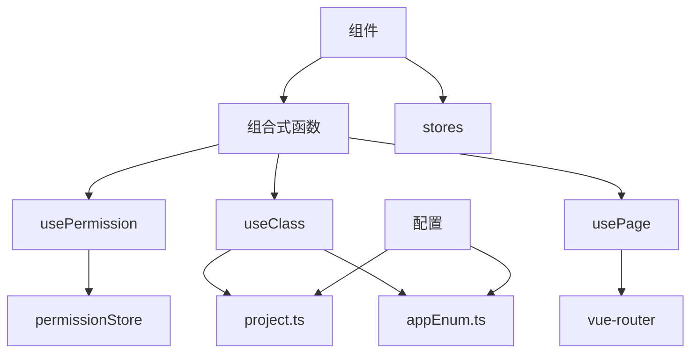

# 组合式函数

<cite>
**本文档引用的文件**   
- [usePermission.ts](file://src/hooks/usePermission.ts)
- [useClass.ts](file://src/hooks/useClass.ts)
- [usePage.ts](file://src/hooks/usePage.ts)
- [AppDarkModeToggle.vue](file://src/components/Application/AppDarkModeToggle.vue)
- [AppLogo.vue](file://src/components/Application/AppLogo.vue)
- [AppProvider.vue](file://src/components/Application/AppProvider.vue)
- [project.ts](file://src/config/project.ts)
- [appEnum.ts](file://src/enums/appEnum.ts)
</cite>

## 目录
1. [引言](#引言)
2. [项目结构](#项目结构)
3. [核心组件](#核心组件)
4. [架构概述](#架构概述)
5. [详细组件分析](#详细组件分析)
6. [依赖分析](#依赖分析)
7. [性能考虑](#性能考虑)
8. [故障排除指南](#故障排除指南)
9. [结论](#结论)
10. [附录](#附录) (如有必要)

## 引言
本文档深入讲解组合式函数（Composable Functions）的设计理念与实现。以`usePermission.ts`中的`usePermission`函数为例，展示如何将可复用的业务逻辑封装成自定义Hook。详细分析`hasPermission`方法的权限校验算法，包括对数组权限的处理、取反权限(!开头)的递归判断逻辑。说明`useClass`和`usePage`等其他Hook的用途和实现方式。阐述组合式函数如何通过`ref`、`computed`等响应式API封装状态和逻辑，并在组件中通过解构方式使用。提供创建自定义Hook的最佳实践，包括命名规范、错误处理、类型定义等。列举在使用组合式函数时常见的陷阱，如响应式数据丢失、生命周期管理等问题的解决方案。

## 项目结构
该项目是一个基于Vue 3的前端项目，采用组合式API（Composition API）设计模式。项目结构清晰，主要分为以下几个部分：
- `public/`: 静态资源文件
- `src/`: 源代码目录
  - `assets/`: 资源文件
  - `components/`: 可复用的UI组件
  - `config/`: 项目配置
  - `directives/`: 自定义指令
  - `enums/`: 枚举类型
  - `hooks/`: 组合式函数（自定义Hook）
  - `layouts/`: 布局组件
  - `router/`: 路由配置
  - `stores/`: 状态管理
  - `utils/`: 工具函数
  - `views/`: 页面视图
- `types/`: 类型定义

组合式函数主要存放在`src/hooks/`目录下，包括`usePermission.ts`、`useClass.ts`和`usePage.ts`等文件。

**图表来源**
- [usePermission.ts](file://src/hooks/usePermission.ts)
- [useClass.ts](file://src/hooks/useClass.ts)
- [usePage.ts](file://src/hooks/usePage.ts)

**章节来源**
- [usePermission.ts](file://src/hooks/usePermission.ts)
- [useClass.ts](file://src/hooks/useClass.ts)
- [usePage.ts](file://src/hooks/usePage.ts)

## 核心组件
本项目的核心组件是各种组合式函数（Composable Functions），它们封装了可复用的业务逻辑，可以在不同的组件中通过解构方式使用。这些函数主要存放在`src/hooks/`目录下，包括`usePermission`、`useClass`和`usePage`等。

**章节来源**
- [usePermission.ts](file://src/hooks/usePermission.ts)
- [useClass.ts](file://src/hooks/useClass.ts)
- [usePage.ts](file://src/hooks/usePage.ts)

## 架构概述
该项目采用Vue 3的组合式API架构，通过自定义Hook（组合式函数）来封装和复用业务逻辑。主要的组合式函数包括：
1. `usePermission`: 处理权限校验逻辑
2. `useClass`: 处理类名构建和DOM操作
3. `usePage`: 处理页面跳转逻辑

这些函数通过`ref`、`computed`等响应式API封装状态和逻辑，并在组件中通过解构方式使用，实现了逻辑与UI的分离。

**图表来源**
- [usePermission.ts](file://src/hooks/usePermission.ts)
- [useClass.ts](file://src/hooks/useClass.ts)
- [usePage.ts](file://src/hooks/usePage.ts)

## 详细组件分析

### usePermission分析
`usePermission`函数是处理权限校验的核心组合式函数。它提供了一个`hasPermission`方法，用于动态判定当前用户是否有权限。

#### 权限校验算法
`hasPermission`方法的权限校验算法如下：
1. 如果没有提供权限值，则返回默认权限
2. 将权限值转换为数组形式
3. 如果权限数组为空，则返回默认权限
4. 使用`some`方法遍历权限数组，只要有一个权限通过校验就返回true
5. 对于以`!`开头的权限，进行递归取反判断

**图表来源**
- [usePermission.ts](file://src/hooks/usePermission.ts#L14-L28)

**章节来源**
- [usePermission.ts](file://src/hooks/usePermission.ts#L7-L31)

### useClass分析
`useClass`函数提供了一系列处理类名的工具函数，包括`buildClass`、`hasClass`、`updateDarkTheme`、`addClass`和`removeClass`。

#### 类名处理逻辑
`buildClass`函数用于根据传入的类名构建完整的类名，它会添加项目前缀。

**图表来源**
- [useClass.ts](file://src/hooks/useClass.ts#L13-L26)

**章节来源**
- [useClass.ts](file://src/hooks/useClass.ts#L5-L110)

### usePage分析
`usePage`函数提供了页面跳转相关的功能，包括`useGo`和`openWindow`。

#### 页面跳转逻辑
`useGo`函数用于内部路由跳转，它封装了`vue-router`的`push`和`replace`方法。

**图表来源**
- [usePage.ts](file://src/hooks/usePage.ts#L14-L28)

**章节来源**
- [usePage.ts](file://src/hooks/usePage.ts#L7-L29)

## 依赖分析
组合式函数之间存在一定的依赖关系，同时也依赖于项目的其他部分。

**图表来源**
- [usePermission.ts](file://src/hooks/usePermission.ts)
- [useClass.ts](file://src/hooks/useClass.ts)
- [usePage.ts](file://src/hooks/usePage.ts)
- [project.ts](file://src/config/project.ts)
- [appEnum.ts](file://src/enums/appEnum.ts)

**章节来源**
- [usePermission.ts](file://src/hooks/usePermission.ts)
- [useClass.ts](file://src/hooks/useClass.ts)
- [usePage.ts](file://src/hooks/usePage.ts)

## 性能考虑
在使用组合式函数时，需要注意以下性能问题：
1. 避免在组合式函数中进行不必要的计算
2. 合理使用`computed`和`ref`来管理响应式数据
3. 注意递归调用的深度，避免栈溢出
4. 在适当的时机清理定时器和事件监听器

## 故障排除指南
在使用组合式函数时，可能会遇到以下常见问题：

### 响应式数据丢失
当从组合式函数返回的对象被解构时，可能会导致响应式数据丢失。解决方案是保持对象的引用，或使用`toRefs`来保持响应性。

### 生命周期管理
组合式函数中的副作用（如定时器、事件监听器）需要在组件卸载时正确清理。可以使用`onUnmounted`钩子来清理资源。

### 类型定义
为组合式函数提供清晰的类型定义，可以提高代码的可维护性和开发体验。

**章节来源**
- [usePermission.ts](file://src/hooks/usePermission.ts)
- [useClass.ts](file://src/hooks/useClass.ts)
- [usePage.ts](file://src/hooks/usePage.ts)

## 结论
组合式函数是Vue 3中一种强大的代码组织方式，它允许我们将可复用的逻辑封装成独立的函数。通过`usePermission`、`useClass`和`usePage`等示例，我们看到了如何将权限校验、类名处理和页面跳转等业务逻辑封装成自定义Hook。这些函数通过响应式API封装状态和逻辑，并在组件中通过解构方式使用，实现了逻辑与UI的分离。遵循最佳实践，如合理的命名规范、错误处理和类型定义，可以创建出高质量、可维护的组合式函数。