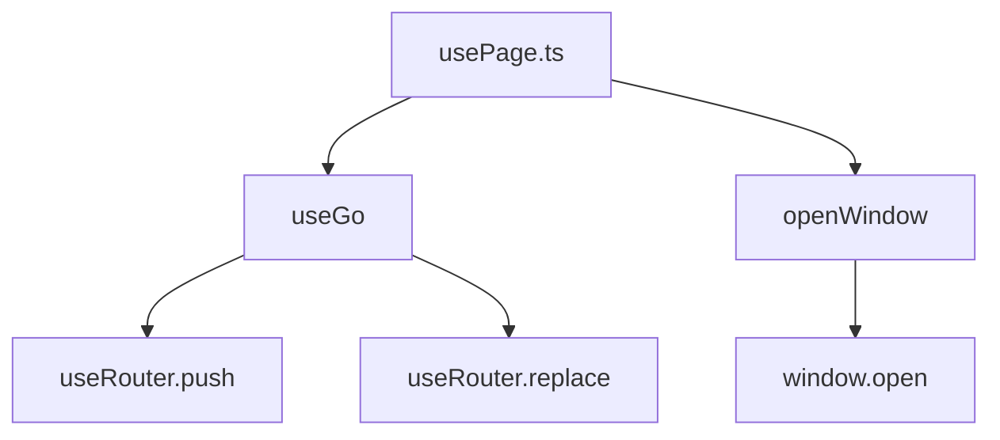
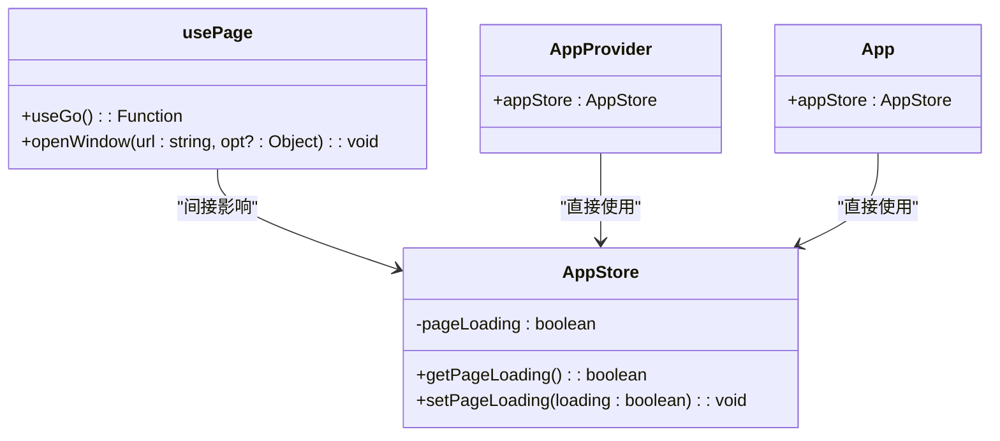
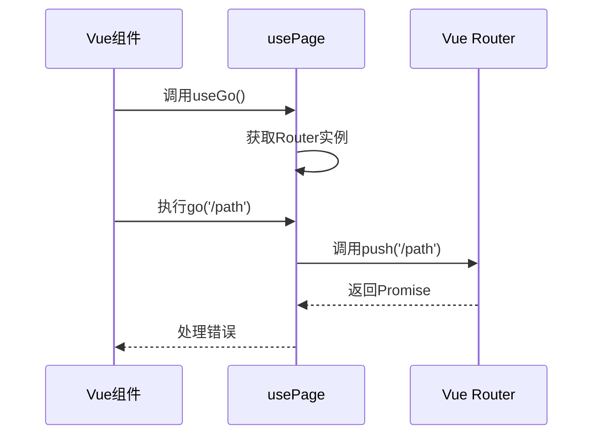
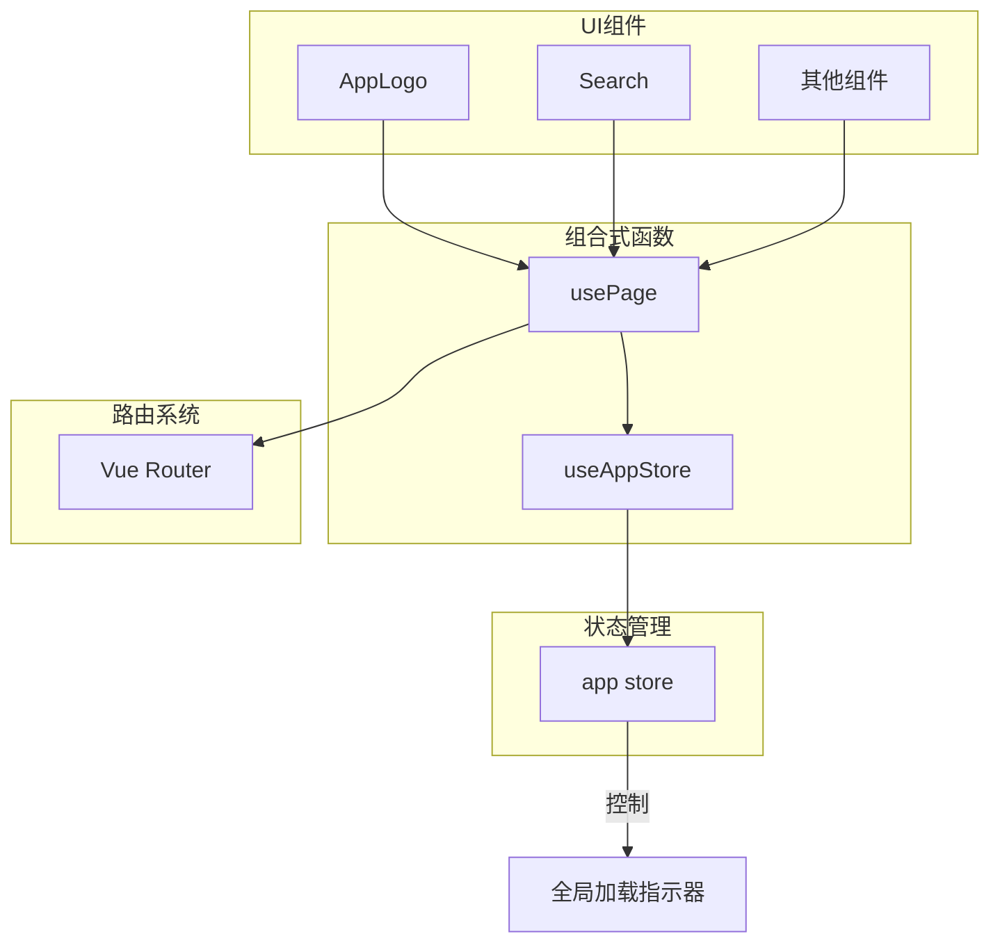

# 页面状态组合式函数 (usePage)

<cite>
**本文档引用的文件**
- [usePage.ts](file://src/hooks/usePage.ts)
- [app.ts](file://src/stores/modules/app.ts)
- [App.vue](file://src/App.vue)
- [AppProvider.vue](file://src/components/Application/AppProvider.vue)
- [AppLogo.vue](file://src/components/Application/AppLogo.vue)
- [useMenuSearch.ts](file://src/layouts/header/components/search/useMenuSearch.ts)
- [main.ts](file://src/main.ts)
</cite>

## 目录
1. [简介](#简介)
2. [核心功能分析](#核心功能分析)
3. [与应用状态的交互](#与应用状态的交互)
4. [API设计与使用方法](#api设计与使用方法)
5. [实际使用场景](#实际使用场景)
6. [架构关系图](#架构关系图)
7. [最佳实践与优势](#最佳实践与优势)

## 简介
`usePage` 是一个位于 `src/hooks/usePage.ts` 的组合式函数，主要负责页面级别的状态管理和导航控制。尽管其文件名为 `usePage`，但从代码实现来看，它主要提供了页面导航相关的功能，如内部路由跳转和打开新窗口。该函数通过与 `app` store 的协同工作，实现了全局页面状态的统一管理，特别是在页面加载状态的控制方面发挥了重要作用。

**Section sources**
- [usePage.ts](file://src/hooks/usePage.ts#L1-L48)

## 核心功能分析
`usePage` 组合式函数主要封装了两种核心功能：内部路由跳转和新窗口打开。`useGo` 函数利用 Vue Router 提供的 `push` 和 `replace` 方法，实现了灵活的页面导航控制。`openWindow` 函数则封装了浏览器原生的 `window.open` 方法，提供了更安全和可控的新窗口打开方式。



**Diagram sources**
- [usePage.ts](file://src/hooks/usePage.ts#L7-L47)

**Section sources**
- [usePage.ts](file://src/hooks/usePage.ts#L7-L47)

## 与应用状态的交互
虽然 `usePage` 本身不直接管理页面加载状态，但它与 `app` store 紧密协作，共同构成了完整的页面状态管理体系。`app` store 中的 `pageLoading` 状态由 `setPageLoading` 方法控制，这个状态可以在应用的任何地方被访问和修改。`App.vue` 组件通过 `useAppStore` 获取这个状态，并可能在路由跳转等操作中使用 `useGo` 来触发页面状态的变化。



**Diagram sources**
- [usePage.ts](file://src/hooks/usePage.ts#L7-L47)
- [app.ts](file://src/stores/modules/app.ts#L1-L75)
- [App.vue](file://src/App.vue#L1-L42)
- [AppProvider.vue](file://src/components/Application/AppProvider.vue#L1-L20)

**Section sources**
- [app.ts](file://src/stores/modules/app.ts#L1-L75)
- [App.vue](file://src/App.vue#L1-L42)

## API设计与使用方法
`usePage` 提供了简洁而实用的 API 设计。`useGo` 函数返回一个可调用的导航函数，支持普通跳转和替换跳转两种模式。`openWindow` 函数则提供了对新窗口打开行为的细粒度控制，包括目标窗口、是否启用 `noopener` 和 `noreferrer` 等安全选项。



**Diagram sources**
- [usePage.ts](file://src/hooks/usePage.ts#L14-L29)
- [useMenuSearch.ts](file://src/layouts/header/components/search/useMenuSearch.ts#L82-L83)

**Section sources**
- [usePage.ts](file://src/hooks/usePage.ts#L14-L29)
- [useMenuSearch.ts](file://src/layouts/header/components/search/useMenuSearch.ts#L82-L83)

## 实际使用场景
在实际应用中，`usePage` 的功能被广泛应用于各种导航场景。例如，在 `AppLogo.vue` 组件中，点击 logo 会使用 `useGo` 导航到首页。在 `useMenuSearch.ts` 中，搜索结果的选中操作也会使用 `useGo` 进行页面跳转。当进入数据密集型视图（如商品列表）时，通常会先通过 `app` store 的 `setPageLoading(true)` 设置加载状态，然后在数据加载完成后调用 `setPageLoading(false)` 关闭加载状态。

```mermaid
flowchart LR
A[用户操作] --> B{操作类型}
B --> |页面跳转| C[调用useGo]
B --> |打开新窗口| D[调用openWindow]
C --> E[触发路由变化]
D --> F[打开新浏览器窗口]
E --> G[可能触发setPageLoading]
G --> H[显示全局加载指示器]
H --> I[数据加载完成]
I --> J[setPageLoading(false)]
J --> K[隐藏加载指示器]
```

**Diagram sources**
- [AppLogo.vue](file://src/components/Application/AppLogo.vue#L2-L3)
- [useMenuSearch.ts](file://src/layouts/header/components/search/useMenuSearch.ts#L169-L171)
- [app.ts](file://src/stores/modules/app.ts#L47-L49)

**Section sources**
- [AppLogo.vue](file://src/components/Application/AppLogo.vue#L2-L3)
- [useMenuSearch.ts](file://src/layouts/header/components/search/useMenuSearch.ts#L169-L171)

## 架构关系图
以下图表展示了 `usePage` 及其相关组件在整个应用架构中的位置和关系。



**Diagram sources**
- [usePage.ts](file://src/hooks/usePage.ts#L7-L47)
- [app.ts](file://src/stores/modules/app.ts#L1-L75)
- [AppLogo.vue](file://src/components/Application/AppLogo.vue#L1-L46)
- [useMenuSearch.ts](file://src/layouts/header/components/search/useMenuSearch.ts#L1-L240)

## 最佳实践与优势
`usePage` 组合式函数的设计体现了 Vue 3 组合式 API 的最佳实践。通过将导航逻辑封装在独立的函数中，实现了代码的高复用性和低耦合性。与 `app` store 的分离设计使得状态管理和业务逻辑清晰分离，便于维护和测试。这种设计模式不仅提升了代码的可读性和可维护性，还确保了全局状态的一致性，避免了在多个组件中重复实现相同的导航逻辑。

**Section sources**
- [usePage.ts](file://src/hooks/usePage.ts#L1-L48)
- [app.ts](file://src/stores/modules/app.ts#L1-L75)