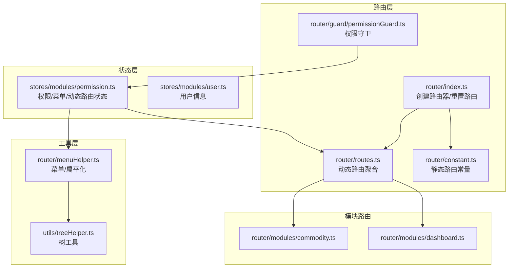
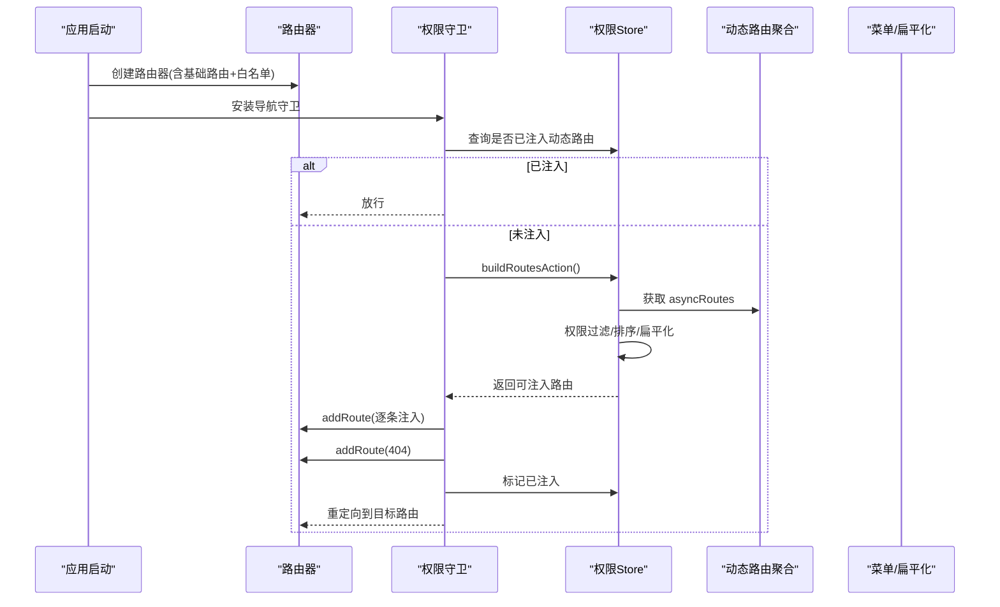
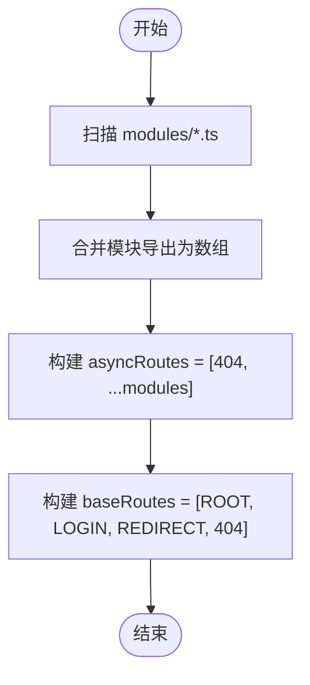
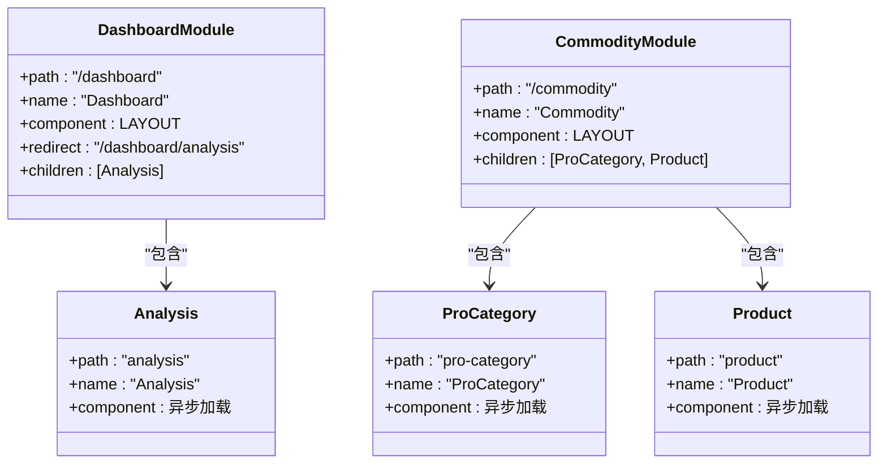
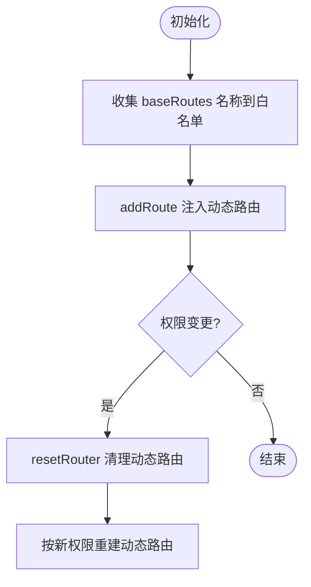
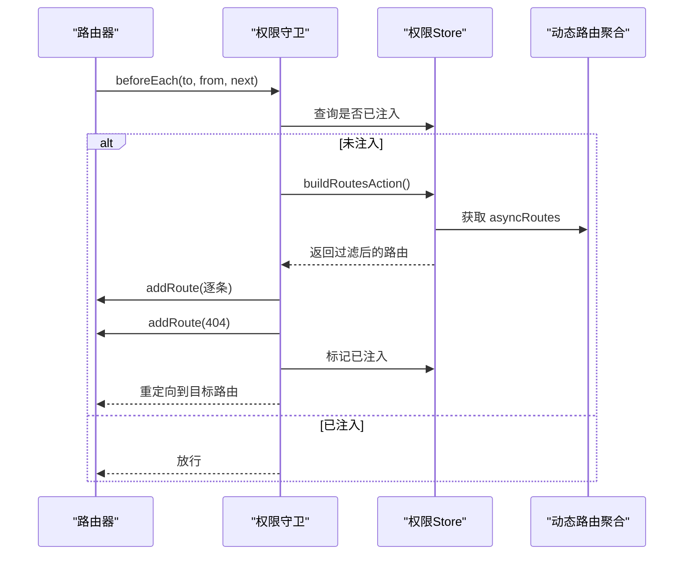
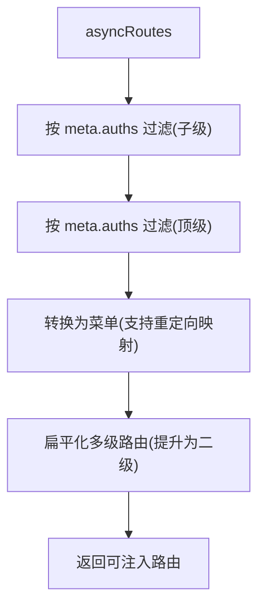
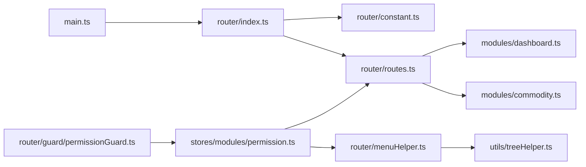

# 动态路由管理

<cite>
**本文引用的文件**
- [src/router/routes.ts](file://src/router/routes.ts)
- [src/router/modules/dashboard.ts](file://src/router/modules/dashboard.ts)
- [src/router/modules/commodity.ts](file://src/router/modules/commodity.ts)
- [src/router/index.ts](file://src/router/index.ts)
- [src/router/constant.ts](file://src/router/constant.ts)
- [src/router/menuHelper.ts](file://src/router/menuHelper.ts)
- [src/router/guard/permissionGuard.ts](file://src/router/guard/permissionGuard.ts)
- [src/router/types.ts](file://src/router/types.ts)
- [src/stores/modules/permission.ts](file://src/stores/modules/permission.ts)
- [src/stores/modules/user.ts](file://src/stores/modules/user.ts)
- [src/utils/treeHelper.ts](file://src/utils/treeHelper.ts)
- [src/main.ts](file://src/main.ts)
</cite>

## 目录
1. [引言](#引言)
2. [项目结构](#项目结构)
3. [核心组件](#核心组件)
4. [架构总览](#架构总览)
5. [详细组件分析](#详细组件分析)
6. [依赖关系分析](#依赖关系分析)
7. [性能考量](#性能考量)
8. [故障排查指南](#故障排查指南)
9. [结论](#结论)
10. [附录](#附录)

## 引言
本文件系统性讲解本项目的动态路由设计与实现，重点围绕以下主题：
- 使用 import.meta.glob 自动扫描并聚合 modules 目录下的路由模块，形成 asyncRoutes。
- asyncRoutes 如何整合 404 页面与业务模块路由，形成完整的异步路由集合。
- 结合 dashboard.ts 与 commodity.ts 展示模块化路由的组织结构与异步加载模式。
- resetRouter 函数如何基于“路由白名单”机制清理动态添加的路由，以支持权限变更后的路由重置。
- 提供动态路由添加规范、权限关联方式以及常见问题（如路由重复注册）的解决方案。

## 项目结构
本项目采用“静态基础路由 + 动态业务路由”的分层结构：
- 静态基础路由：包含根路径、登录页、重定向、404 等固定路由，定义在常量文件中。
- 动态业务路由：按功能模块拆分至 modules 目录，使用 import.meta.glob 在构建期批量导入。
- 路由守卫：在导航时根据权限动态注入路由，并在必要时添加 404。
- 状态管理：通过权限 Store 维护菜单与动态路由状态。

图表来源
- [src/router/index.ts](file://src/router/index.ts#L1-L39)
- [src/router/constant.ts](file://src/router/constant.ts#L1-L53)
- [src/router/routes.ts](file://src/router/routes.ts#L1-L27)
- [src/router/guard/permissionGuard.ts](file://src/router/guard/permissionGuard.ts#L1-L60)
- [src/router/modules/dashboard.ts](file://src/router/modules/dashboard.ts#L1-L21)
- [src/router/modules/commodity.ts](file://src/router/modules/commodity.ts#L1-L27)
- [src/stores/modules/permission.ts](file://src/stores/modules/permission.ts#L1-L67)
- [src/utils/treeHelper.ts](file://src/utils/treeHelper.ts#L1-L96)

章节来源
- [src/router/index.ts](file://src/router/index.ts#L1-L39)
- [src/router/constant.ts](file://src/router/constant.ts#L1-L53)
- [src/router/routes.ts](file://src/router/routes.ts#L1-L27)
- [src/router/guard/permissionGuard.ts](file://src/router/guard/permissionGuard.ts#L1-L60)
- [src/router/modules/dashboard.ts](file://src/router/modules/dashboard.ts#L1-L21)
- [src/router/modules/commodity.ts](file://src/router/modules/commodity.ts#L1-L27)
- [src/stores/modules/permission.ts](file://src/stores/modules/permission.ts#L1-L67)
- [src/utils/treeHelper.ts](file://src/utils/treeHelper.ts#L1-L96)

## 核心组件
- 动态路由聚合器：通过 import.meta.glob 扫描 modules 下的路由模块，统一合并为 asyncRoutes，并与 404 路由组合为异步路由集合。
- 路由白名单与重置：在初始化时收集基础路由名称作为白名单；resetRouter 按白名单保留，删除其余动态路由。
- 权限守卫：在首次访问或刷新页面时，根据权限过滤 asyncRoutes，逐条 addRoute 注入，最后添加 404 并标记动态路由已注入。
- 菜单与扁平化：将路由转换为菜单，同时进行多级路由扁平化处理，便于前端渲染与权限控制。
- 类型系统：MergedRoute 定义了路由名称、元信息、组件与子路由等字段，确保类型安全。

章节来源
- [src/router/routes.ts](file://src/router/routes.ts#L1-L27)
- [src/router/index.ts](file://src/router/index.ts#L1-L39)
- [src/router/guard/permissionGuard.ts](file://src/router/guard/permissionGuard.ts#L1-L60)
- [src/router/menuHelper.ts](file://src/router/menuHelper.ts#L1-L123)
- [src/router/types.ts](file://src/router/types.ts#L1-L73)

## 架构总览
动态路由的生命周期如下：
- 初始化阶段：创建基础路由集合并建立白名单。
- 导航阶段：权限守卫检查是否已注入动态路由；若未注入，则从 asyncRoutes 中过滤出可用路由，逐条注入，最后注入 404。
- 权限变更阶段：调用 resetRouter 清理动态路由，再按新权限重新注入。
- 菜单渲染阶段：将路由转换为菜单并扁平化，保证菜单层级与路由一致。

图表来源
- [src/router/index.ts](file://src/router/index.ts#L1-L39)
- [src/router/guard/permissionGuard.ts](file://src/router/guard/permissionGuard.ts#L1-L60)
- [src/stores/modules/permission.ts](file://src/stores/modules/permission.ts#L1-L67)
- [src/router/routes.ts](file://src/router/routes.ts#L1-L27)

## 详细组件分析

### 动态路由聚合器（routes.ts）
- import.meta.glob 的作用：在构建期扫描 modules 目录下的 .ts 文件，将每个模块导出的默认路由对象或数组合并为一个数组。
- 合并策略：遍历模块结果，将每个模块导出的默认值解析为数组，然后展平到 routeModuleList。
- asyncRoutes 的组成：将 404 路由与业务模块路由拼接，形成异步路由集合；baseRoutes 则包含根、登录、重定向与 404 的静态集合。

图表来源
- [src/router/routes.ts](file://src/router/routes.ts#L1-L27)
- [src/router/constant.ts](file://src/router/constant.ts#L1-L53)

章节来源
- [src/router/routes.ts](file://src/router/routes.ts#L1-L27)
- [src/router/constant.ts](file://src/router/constant.ts#L1-L53)

### 模块化路由示例（dashboard.ts 与 commodity.ts）
- dashboard.ts：定义工作台主路由，包含嵌套路由分析页；分析页采用异步组件加载。
- commodity.ts：定义产品管理主路由，包含产品分类与产品列表两个子路由，均采用异步组件加载。
- 共同点：均以 LAYOUT 作为父级容器，子路由通过懒加载组件提升首屏性能。

图表来源
- [src/router/modules/dashboard.ts](file://src/router/modules/dashboard.ts#L1-L21)
- [src/router/modules/commodity.ts](file://src/router/modules/commodity.ts#L1-L27)

章节来源
- [src/router/modules/dashboard.ts](file://src/router/modules/dashboard.ts#L1-L21)
- [src/router/modules/commodity.ts](file://src/router/modules/commodity.ts#L1-L27)

### 路由白名单与重置（index.ts）
- 白名单构建：递归遍历 baseRoutes，收集所有路由名称，形成 WHITE_NAME_LIST。
- resetRouter 逻辑：遍历当前所有路由，若路由名称不在白名单中则删除该路由；此机制确保仅保留基础路由，动态路由可被安全清理。

图表来源
- [src/router/index.ts](file://src/router/index.ts#L1-L39)

章节来源
- [src/router/index.ts](file://src/router/index.ts#L1-L39)

### 权限守卫与动态注入（permissionGuard.ts）
- 首次访问：若未注入动态路由，调用权限 Store 的 buildRoutesAction，得到过滤后的路由列表，逐条 addRoute 注入。
- 最终注入：将 404 路由追加到最后，确保兜底。
- 重定向：在注入完成后，根据来源与目标路径决定是否替换或重定向，避免误入 404。
- 状态标记：注入完成后标记 isDynamicAddedRoute 为 true，避免重复注入。

图表来源
- [src/router/guard/permissionGuard.ts](file://src/router/guard/permissionGuard.ts#L1-L60)
- [src/stores/modules/permission.ts](file://src/stores/modules/permission.ts#L1-L67)
- [src/router/routes.ts](file://src/router/routes.ts#L1-L27)

章节来源
- [src/router/guard/permissionGuard.ts](file://src/router/guard/permissionGuard.ts#L1-L60)
- [src/stores/modules/permission.ts](file://src/stores/modules/permission.ts#L1-L67)

### 权限过滤与菜单/扁平化（permission.ts 与 menuHelper.ts）
- 权限过滤：从 asyncRoutes 中按路由 meta.auths 与用户权限集合进行匹配过滤，支持顶级与子级两轮过滤。
- 菜单转换：将路由转换为菜单结构，支持重定向映射与隐藏菜单处理。
- 多级路由扁平化：检测是否存在三级及以上路由，若是则提升为二级路由，避免深层嵌套导致的渲染与权限复杂度。

图表来源
- [src/stores/modules/permission.ts](file://src/stores/modules/permission.ts#L1-L67)
- [src/router/menuHelper.ts](file://src/router/menuHelper.ts#L1-L123)
- [src/utils/treeHelper.ts](file://src/utils/treeHelper.ts#L1-L96)

章节来源
- [src/stores/modules/permission.ts](file://src/stores/modules/permission.ts#L1-L67)
- [src/router/menuHelper.ts](file://src/router/menuHelper.ts#L1-L123)
- [src/utils/treeHelper.ts](file://src/utils/treeHelper.ts#L1-L96)

### 类型系统（types.ts）
- MergedRoute：扩展自 RouteRecordRaw，新增 name、meta、component、children 等字段，确保路由对象具备统一结构。
- Menu：用于菜单渲染的数据结构，包含图标、排序、权限标识等字段。

章节来源
- [src/router/types.ts](file://src/router/types.ts#L1-L73)

## 依赖关系分析
- 路由层依赖：index.ts 依赖 constant.ts 与 routes.ts；guard/permissionGuard.ts 依赖 permission.ts 与 constant.ts。
- 模块层依赖：modules 下各模块依赖 constant.ts 的 LAYOUT 与类型定义。
- 状态层依赖：permission.ts 依赖 menuHelper.ts 与 treeHelper.ts；menuHelper.ts 依赖 treeHelper.ts。
- 应用入口：main.ts 负责安装路由器与守卫。

图表来源
- [src/main.ts](file://src/main.ts#L1-L29)
- [src/router/index.ts](file://src/router/index.ts#L1-L39)
- [src/router/constant.ts](file://src/router/constant.ts#L1-L53)
- [src/router/routes.ts](file://src/router/routes.ts#L1-L27)
- [src/router/guard/permissionGuard.ts](file://src/router/guard/permissionGuard.ts#L1-L60)
- [src/stores/modules/permission.ts](file://src/stores/modules/permission.ts#L1-L67)
- [src/router/menuHelper.ts](file://src/router/menuHelper.ts#L1-L123)
- [src/utils/treeHelper.ts](file://src/utils/treeHelper.ts#L1-L96)
- [src/router/modules/dashboard.ts](file://src/router/modules/dashboard.ts#L1-L21)
- [src/router/modules/commodity.ts](file://src/router/modules/commodity.ts#L1-L27)

章节来源
- [src/main.ts](file://src/main.ts#L1-L29)
- [src/router/index.ts](file://src/router/index.ts#L1-L39)
- [src/router/routes.ts](file://src/router/routes.ts#L1-L27)
- [src/router/guard/permissionGuard.ts](file://src/router/guard/permissionGuard.ts#L1-L60)
- [src/stores/modules/permission.ts](file://src/stores/modules/permission.ts#L1-L67)
- [src/router/menuHelper.ts](file://src/router/menuHelper.ts#L1-L123)
- [src/utils/treeHelper.ts](file://src/utils/treeHelper.ts#L1-L96)
- [src/router/modules/dashboard.ts](file://src/router/modules/dashboard.ts#L1-L21)
- [src/router/modules/commodity.ts](file://src/router/modules/commodity.ts#L1-L27)

## 性能考量
- 懒加载组件：模块路由中的子路由均采用异步组件加载，减少初始包体积，提升首屏性能。
- 多级路由扁平化：通过扁平化处理降低渲染复杂度，避免深层嵌套带来的计算与内存开销。
- 白名单重置：resetRouter 仅删除动态路由，保留基础路由，避免频繁重建路由器带来的性能损耗。

## 故障排查指南
- 路由重复注册
  - 现象：刷新页面或权限切换后出现重复路由。
  - 原因：未调用 resetRouter 清理旧动态路由，再次注入导致重复。
  - 解决：在权限变更或登出时调用 resetRouter，再按新权限重建动态路由。
  章节来源
  - [src/router/index.ts](file://src/router/index.ts#L24-L35)
  - [src/router/guard/permissionGuard.ts](file://src/router/guard/permissionGuard.ts#L36-L48)

- 404 无法正常显示
  - 现象：访问不存在路径时未跳转到 404。
  - 原因：404 未在注入动态路由后追加。
  - 解决：确保在注入完动态路由后，再 addRoute 404。
  章节来源
  - [src/router/guard/permissionGuard.ts](file://src/router/guard/permissionGuard.ts#L43-L45)

- 权限不生效
  - 现象：某些路由未按权限过滤。
  - 原因：路由 meta.auths 未正确配置或用户权限集合为空。
  - 解决：在路由 meta 中配置 auths，并确保从用户 Store 获取真实权限集合。
  章节来源
  - [src/stores/modules/permission.ts](file://src/stores/modules/permission.ts#L34-L60)
  - [src/router/types.ts](file://src/router/types.ts#L1-L73)

- 菜单层级异常
  - 现象：菜单显示层级过深或缺失。
  - 原因：多级路由未扁平化或重定向映射未处理。
  - 解决：使用扁平化工具处理多级路由，并启用重定向映射。
  章节来源
  - [src/router/menuHelper.ts](file://src/router/menuHelper.ts#L47-L123)

## 结论
本项目通过 import.meta.glob 实现模块化动态路由的自动化聚合，配合权限守卫与白名单机制，实现了“按需注入 + 可重置”的动态路由体系。模块路由采用懒加载组件与扁平化策略，在保证功能完整性的同时兼顾性能与可维护性。通过 resetRouter 与权限过滤，能够灵活应对权限变更场景，确保路由与菜单的一致性与安全性。

## 附录

### 动态路由添加规范
- 路由命名：确保每个路由具有唯一 name，以便白名单识别与重置清理。
- 元信息：在 meta 中配置权限标识、排序号、图标、标题等，便于菜单渲染与权限控制。
- 组件加载：优先使用异步组件加载，减少首屏体积。
- 子路由：合理规划层级，必要时使用扁平化工具提升渲染效率。

### 权限关联方式
- 在路由 meta 中声明 auths 数组，表示该路由所需的权限标识。
- 在权限 Store 中读取用户权限集合，与路由 meta.auths 进行包含匹配，过滤出可用路由。
- 将过滤后的路由注入路由器，并转换为菜单用于前端展示。

### 常见问题与建议
- 路由重复注册：每次权限变更前先 resetRouter，再按新权限注入。
- 404 兜底：务必在动态路由注入完成后追加 404。
- 菜单一致性：使用扁平化与重定向映射，确保菜单与路由层级一致。
- 性能优化：保持懒加载与扁平化策略，避免深层嵌套与大体积组件。