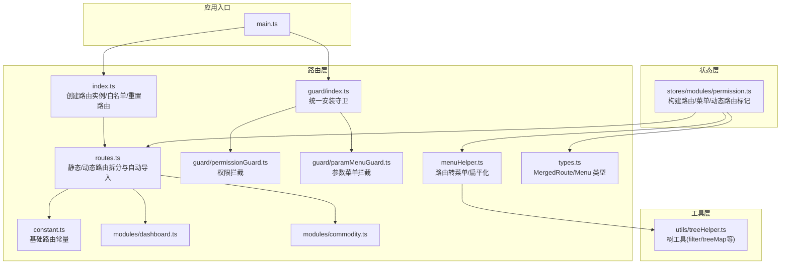
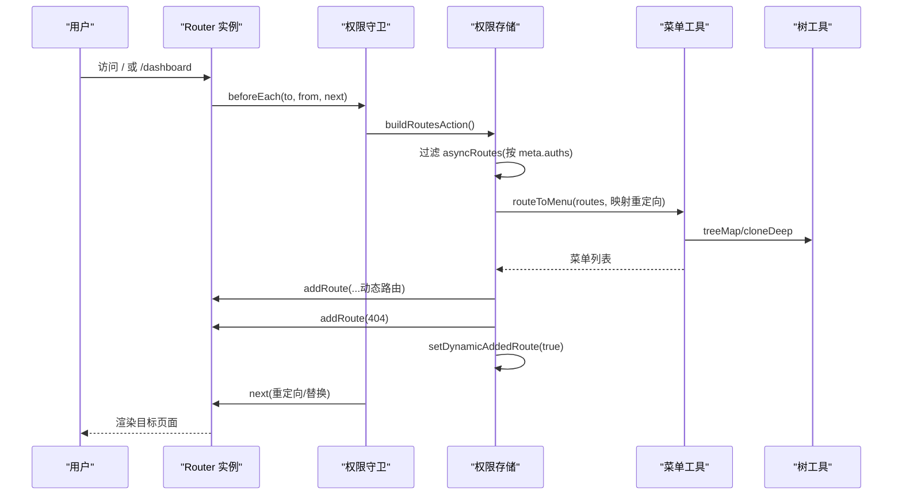
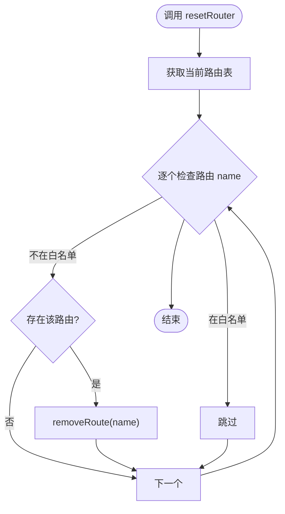
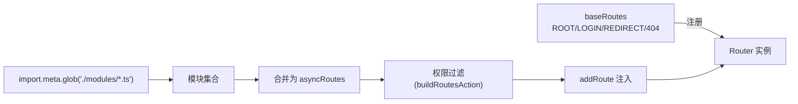
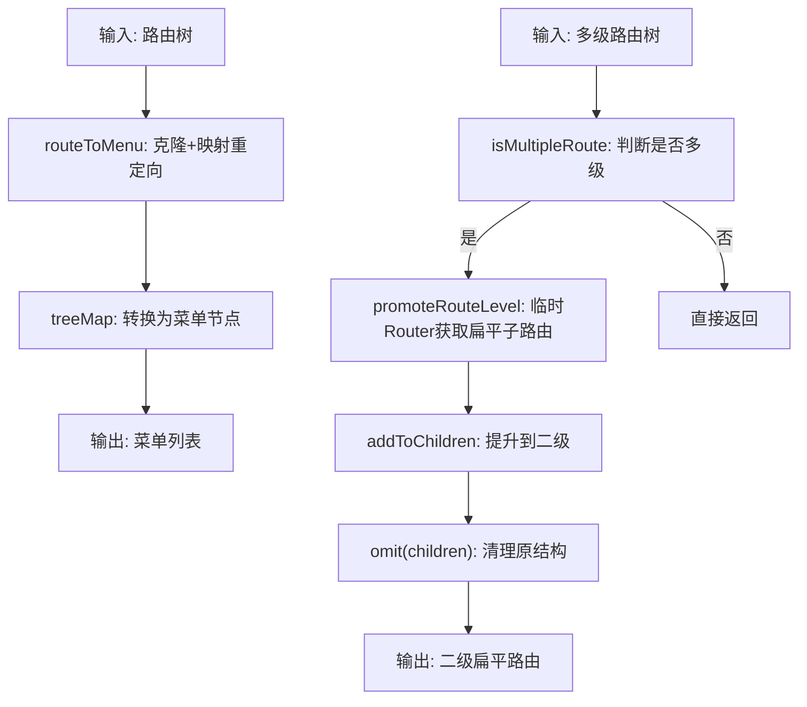
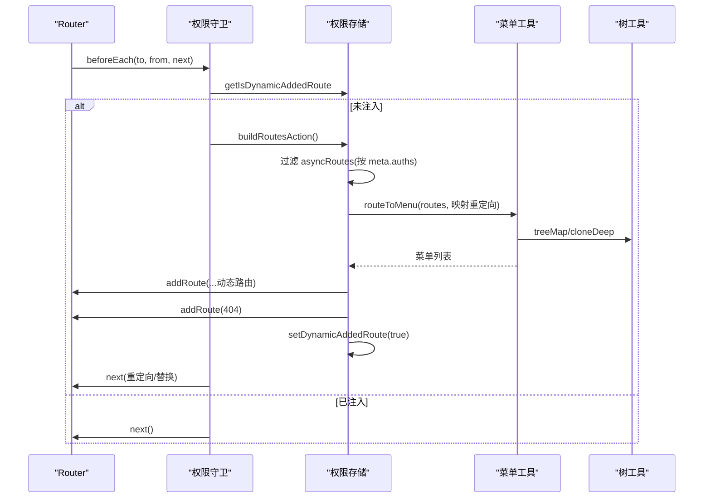
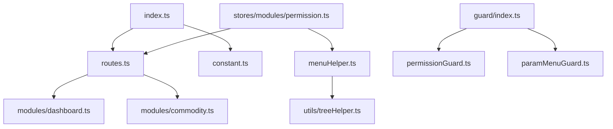

# 路由系统

<cite>
**本文引用的文件**
- [src/router/index.ts](file://src/router/index.ts)
- [src/router/routes.ts](file://src/router/routes.ts)
- [src/router/constant.ts](file://src/router/constant.ts)
- [src/router/menuHelper.ts](file://src/router/menuHelper.ts)
- [src/router/types.ts](file://src/router/types.ts)
- [src/router/modules/dashboard.ts](file://src/router/modules/dashboard.ts)
- [src/router/modules/commodity.ts](file://src/router/modules/commodity.ts)
- [src/router/guard/index.ts](file://src/router/guard/index.ts)
- [src/router/guard/permissionGuard.ts](file://src/router/guard/permissionGuard.ts)
- [src/router/guard/paramMenuGuard.ts](file://src/router/guard/paramMenuGuard.ts)
- [src/stores/modules/permission.ts](file://src/stores/modules/permission.ts)
- [src/utils/treeHelper.ts](file://src/utils/treeHelper.ts)
- [src/main.ts](file://src/main.ts)
</cite>

## 目录
1. [简介](#简介)
2. [项目结构](#项目结构)
3. [核心组件](#核心组件)
4. [架构总览](#架构总览)
5. [详细组件分析](#详细组件分析)
6. [依赖关系分析](#依赖关系分析)
7. [性能考量](#性能考量)
8. [故障排查指南](#故障排查指南)
9. [结论](#结论)
10. [附录](#附录)

## 简介
本文件围绕 Vue Router 4 在项目中的集成与配置进行系统性解析，重点覆盖：
- 基于 createWebHashHistory 的路由实例创建流程
- 静态路由（baseRoutes）与动态路由（asyncRoutes）的分离设计
- routes.ts 中通过 import.meta.glob 实现的模块化路由自动导入机制
- constant.ts 中 ROOT、LOGIN、REDIRECT 等基础路由的结构与作用
- menuHelper.ts 中 routeToMenu 与 flatMultiLevelRoutes 等工具函数如何将路由转换为菜单结构
- 路由懒加载、路由白名单（WHITE_NAME_LIST）与 resetRouter 机制的实现原理
- 路由嵌套、参数传递、路由元信息（meta）使用等常见场景实践指南
- 路由调试与性能优化技巧

## 项目结构
路由系统位于 src/router 目录，采用“静态路由 + 动态路由 + 守卫 + 工具函数”的分层组织方式：
- 路由入口与实例：index.ts
- 路由定义与拆分：routes.ts、constant.ts
- 模块化路由：modules 下的 dashboard.ts、commodity.ts 等
- 路由守卫：guard 下的 index.ts、permissionGuard.ts、paramMenuGuard.ts
- 菜单工具：menuHelper.ts
- 类型定义：types.ts
- 权限存储：stores/modules/permission.ts
- 树工具：utils/treeHelper.ts
- 应用入口：main.ts

图表来源
- [src/main.ts](file://src/main.ts#L1-L29)
- [src/router/index.ts](file://src/router/index.ts#L1-L39)
- [src/router/routes.ts](file://src/router/routes.ts#L1-L27)
- [src/router/constant.ts](file://src/router/constant.ts#L1-L53)
- [src/router/modules/dashboard.ts](file://src/router/modules/dashboard.ts#L1-L21)
- [src/router/modules/commodity.ts](file://src/router/modules/commodity.ts#L1-L27)
- [src/router/guard/index.ts](file://src/router/guard/index.ts#L1-L63)
- [src/router/guard/permissionGuard.ts](file://src/router/guard/permissionGuard.ts#L1-L60)
- [src/router/guard/paramMenuGuard.ts](file://src/router/guard/paramMenuGuard.ts#L1-L9)
- [src/router/menuHelper.ts](file://src/router/menuHelper.ts#L1-L123)
- [src/router/types.ts](file://src/router/types.ts#L1-L73)
- [src/stores/modules/permission.ts](file://src/stores/modules/permission.ts#L1-L67)
- [src/utils/treeHelper.ts](file://src/utils/treeHelper.ts#L1-L96)

章节来源
- [src/main.ts](file://src/main.ts#L1-L29)
- [src/router/index.ts](file://src/router/index.ts#L1-L39)
- [src/router/routes.ts](file://src/router/routes.ts#L1-L27)
- [src/router/constant.ts](file://src/router/constant.ts#L1-L53)
- [src/router/menuHelper.ts](file://src/router/menuHelper.ts#L1-L123)
- [src/router/types.ts](file://src/router/types.ts#L1-L73)
- [src/router/guard/index.ts](file://src/router/guard/index.ts#L1-L63)
- [src/router/guard/permissionGuard.ts](file://src/router/guard/permissionGuard.ts#L1-L60)
- [src/router/guard/paramMenuGuard.ts](file://src/router/guard/paramMenuGuard.ts#L1-L9)
- [src/stores/modules/permission.ts](file://src/stores/modules/permission.ts#L1-L67)
- [src/utils/treeHelper.ts](file://src/utils/treeHelper.ts#L1-L96)

## 核心组件
- 路由实例与白名单
  - 使用 createWebHashHistory 创建带哈希的路由历史，避免部署在非根路径时的 404 问题
  - 通过递归收集 baseRoutes 的所有路由名称形成 WHITE_NAME_LIST，作为 resetRouter 的白名单
  - 提供 resetRouter 方法，移除所有非白名单动态路由，便于登出或切换用户后清理
- 静态路由与动态路由
  - baseRoutes：包含 ROOT、LOGIN、REDIRECT、404 等基础路由，固定不变
  - asyncRoutes：通过 import.meta.glob 自动扫描 modules 下的路由模块，合并为异步路由
- 路由守卫
  - setupRouterGuard 统一注册多个守卫：HTTP 关闭、滚动回顶、消息清理、状态重置
  - createPermissionGuard 在首次访问时根据权限构建动态路由并注入，处理重定向与 404
- 菜单工具
  - routeToMenu：将路由转换为菜单结构，支持重定向映射与隐藏菜单控制
  - flatMultiLevelRoutes：将多级路由扁平化为二级路由，适配菜单渲染
- 权限存储
  - buildRoutesAction：读取 asyncRoutes，按 meta.auths 进行权限过滤，生成菜单与扁平化路由

章节来源
- [src/router/index.ts](file://src/router/index.ts#L1-L39)
- [src/router/routes.ts](file://src/router/routes.ts#L1-L27)
- [src/router/constant.ts](file://src/router/constant.ts#L1-L53)
- [src/router/guard/index.ts](file://src/router/guard/index.ts#L1-L63)
- [src/router/guard/permissionGuard.ts](file://src/router/guard/permissionGuard.ts#L1-L60)
- [src/router/menuHelper.ts](file://src/router/menuHelper.ts#L1-L123)
- [src/stores/modules/permission.ts](file://src/stores/modules/permission.ts#L1-L67)

## 架构总览
下面以序列图展示“首次访问 -> 权限守卫 -> 动态路由注入 -> 重定向 -> 菜单生成”的关键流程。

图表来源
- [src/router/guard/permissionGuard.ts](file://src/router/guard/permissionGuard.ts#L1-L60)
- [src/stores/modules/permission.ts](file://src/stores/modules/permission.ts#L1-L67)
- [src/router/menuHelper.ts](file://src/router/menuHelper.ts#L1-L123)
- [src/utils/treeHelper.ts](file://src/utils/treeHelper.ts#L1-L96)

## 详细组件分析

### 路由实例创建与重置机制
- createWebHashHistory
  - 使用 import.meta.env.BASE_URL 作为基础路径，确保在子路径部署时正常工作
  - 严格模式与滚动行为设置保证导航体验一致性
- 白名单与重置
  - WHITE_NAME_LIST 通过递归遍历 baseRoutes 收集所有路由名称
  - resetRouter 遍历当前路由表，仅移除非白名单的动态路由，避免影响基础路由

图表来源
- [src/router/index.ts](file://src/router/index.ts#L1-L39)

章节来源
- [src/router/index.ts](file://src/router/index.ts#L1-L39)

### 静态路由与动态路由的分离设计
- 静态路由（baseRoutes）
  - 包含 ROOT、LOGIN、REDIRECT、404 等基础路由，固定不变，随应用启动即注册
- 动态路由（asyncRoutes）
  - 通过 import.meta.glob("./modules/*.ts", { eager: true }) 批量导入模块
  - 将每个模块导出的路由对象（可能为数组或单对象）展开并合并
  - 最终与 404 路由组合为 asyncRoutes，供权限过滤与注入

图表来源
- [src/router/routes.ts](file://src/router/routes.ts#L1-L27)
- [src/router/constant.ts](file://src/router/constant.ts#L1-L53)
- [src/router/modules/dashboard.ts](file://src/router/modules/dashboard.ts#L1-L21)
- [src/router/modules/commodity.ts](file://src/router/modules/commodity.ts#L1-L27)

章节来源
- [src/router/routes.ts](file://src/router/routes.ts#L1-L27)
- [src/router/constant.ts](file://src/router/constant.ts#L1-L53)
- [src/router/modules/dashboard.ts](file://src/router/modules/dashboard.ts#L1-L21)
- [src/router/modules/commodity.ts](file://src/router/modules/commodity.ts#L1-L27)

### 基础路由常量（ROOT、LOGIN、REDIRECT、404）
- ROOT_ROUTE：根路径重定向至 /dashboard
- LOGIN_ROUTE：登录页组件懒加载，meta 标题为“登录页”
- REDIRECT_ROUTE：布局容器，子路由 /redirect/:path(.*) 重定向到 Redirect.vue，meta 控制菜单与面包屑隐藏
- PAGE_NOT_FOUND_ROUTE：通配符 404，子路由 /:path(.*)* 渲染异常页，meta 控制菜单与面包屑隐藏

章节来源
- [src/router/constant.ts](file://src/router/constant.ts#L1-L53)

### 路由懒加载与模块化导入
- import.meta.glob 的使用
  - 通过 import.meta.glob("./modules/*.ts", { eager: true }) 实现静态扫描与批量导入
  - 每个模块默认导出一个 MergedRoute 或路由数组，统一展开并加入 asyncRoutes
- 组件懒加载
  - 基础路由组件通过 () => import(...) 实现按需加载，减少首屏体积
  - 模块内子组件同样采用懒加载策略

章节来源
- [src/router/routes.ts](file://src/router/routes.ts#L1-L27)
- [src/router/constant.ts](file://src/router/constant.ts#L1-L53)
- [src/router/modules/dashboard.ts](file://src/router/modules/dashboard.ts#L1-L21)
- [src/router/modules/commodity.ts](file://src/router/modules/commodity.ts#L1-L27)

### 路由转菜单与多级路由扁平化
- routeToMenu
  - 克隆路由列表，支持 routerMapping 参数处理重定向映射
  - 使用 treeMap 将路由节点转换为菜单节点，保留 name、path、meta、redirect 等字段
  - 可根据 meta.hideMenu 控制菜单显示
- flatMultiLevelRoutes
  - 判断是否存在多级子路由
  - 通过临时 Router 获取扁平后的子路由，将深层子路由提升到二级
  - 使用 treeHelper 的 cloneDeep/omit 保持原结构安全修改

图表来源
- [src/router/menuHelper.ts](file://src/router/menuHelper.ts#L1-L123)
- [src/utils/treeHelper.ts](file://src/utils/treeHelper.ts#L1-L96)

章节来源
- [src/router/menuHelper.ts](file://src/router/menuHelper.ts#L1-L123)
- [src/utils/treeHelper.ts](file://src/utils/treeHelper.ts#L1-L96)

### 权限守卫与动态路由注入
- createPermissionGuard
  - 首次访问时，从权限存储获取 isDynamicAddedRoute 标记
  - 若未注入，则调用 buildRoutesAction 构建路由与菜单，逐条 addRoute 注入
  - 注入 404 路由并标记动态注入完成
  - 处理 404 重定向与重放目标路由，避免进入 404
- 权限存储
  - buildRoutesAction 内部使用 treeHelper.filter 对 asyncRoutes 进行权限过滤
  - 生成菜单列表并排序，扁平化多级路由，返回可注入的路由数组

图表来源
- [src/router/guard/permissionGuard.ts](file://src/router/guard/permissionGuard.ts#L1-L60)
- [src/stores/modules/permission.ts](file://src/stores/modules/permission.ts#L1-L67)
- [src/router/menuHelper.ts](file://src/router/menuHelper.ts#L1-L123)
- [src/utils/treeHelper.ts](file://src/utils/treeHelper.ts#L1-L96)

章节来源
- [src/router/guard/permissionGuard.ts](file://src/router/guard/permissionGuard.ts#L1-L60)
- [src/stores/modules/permission.ts](file://src/stores/modules/permission.ts#L1-L67)

### 路由嵌套、参数传递与元信息（meta）使用
- 路由嵌套
  - 通过 LAYOUT 容器与 redirect 实现层级嵌套，子路由在容器内渲染
  - 多级路由通过 flatMultiLevelRoutes 扁平化，适配菜单与导航
- 参数传递
  - 重定向路由使用 /redirect/:path(.*) 捕获路径参数，配合 Redirect.vue 展示
  - 路由跳转时可通过 query 传递参数，守卫中处理 redirect 重放
- 元信息（meta）
  - 常用字段：title、orderNo、icon、hideMenu、hideBreadcrumb、hideChildrenInMenu、auths
  - 用于菜单标题、排序、图标、隐藏控制、权限过滤与重定向映射

章节来源
- [src/router/constant.ts](file://src/router/constant.ts#L1-L53)
- [src/router/modules/dashboard.ts](file://src/router/modules/dashboard.ts#L1-L21)
- [src/router/modules/commodity.ts](file://src/router/modules/commodity.ts#L1-L27)
- [src/router/menuHelper.ts](file://src/router/menuHelper.ts#L1-L123)
- [src/stores/modules/permission.ts](file://src/stores/modules/permission.ts#L1-L67)

## 依赖关系分析
- 路由入口依赖
  - index.ts 依赖 routes.ts（baseRoutes/asyncRoutes）、constant.ts（基础路由常量）
- 路由模块依赖
  - routes.ts 依赖 modules 下的路由模块，形成动态路由集合
- 菜单与树工具
  - menuHelper.ts 依赖 utils/treeHelper.ts 的 treeMap/cloneDeep/omit
- 权限存储依赖
  - permission.ts 依赖 routes.ts（asyncRoutes）、menuHelper.ts（routeToMenu/flatMultiLevelRoutes）、treeHelper.ts（filter）

图表来源
- [src/router/index.ts](file://src/router/index.ts#L1-L39)
- [src/router/routes.ts](file://src/router/routes.ts#L1-L27)
- [src/router/constant.ts](file://src/router/constant.ts#L1-L53)
- [src/router/modules/dashboard.ts](file://src/router/modules/dashboard.ts#L1-L21)
- [src/router/modules/commodity.ts](file://src/router/modules/commodity.ts#L1-L27)
- [src/router/menuHelper.ts](file://src/router/menuHelper.ts#L1-L123)
- [src/router/guard/index.ts](file://src/router/guard/index.ts#L1-L63)
- [src/router/guard/permissionGuard.ts](file://src/router/guard/permissionGuard.ts#L1-L60)
- [src/router/guard/paramMenuGuard.ts](file://src/router/guard/paramMenuGuard.ts#L1-L9)
- [src/stores/modules/permission.ts](file://src/stores/modules/permission.ts#L1-L67)
- [src/utils/treeHelper.ts](file://src/utils/treeHelper.ts#L1-L96)

章节来源
- [src/router/index.ts](file://src/router/index.ts#L1-L39)
- [src/router/routes.ts](file://src/router/routes.ts#L1-L27)
- [src/router/constant.ts](file://src/router/constant.ts#L1-L53)
- [src/router/menuHelper.ts](file://src/router/menuHelper.ts#L1-L123)
- [src/router/guard/index.ts](file://src/router/guard/index.ts#L1-L63)
- [src/router/guard/permissionGuard.ts](file://src/router/guard/permissionGuard.ts#L1-L60)
- [src/router/guard/paramMenuGuard.ts](file://src/router/guard/paramMenuGuard.ts#L1-L9)
- [src/stores/modules/permission.ts](file://src/stores/modules/permission.ts#L1-L67)
- [src/utils/treeHelper.ts](file://src/utils/treeHelper.ts#L1-L96)

## 性能考量
- 路由懒加载
  - 基础路由组件与模块子组件均采用懒加载，降低首屏包体
- 动态注入时机
  - 首次访问才构建并注入动态路由，避免不必要的初始化开销
- 白名单与重置
  - resetRouter 仅移除非白名单动态路由，避免影响基础路由
- 菜单扁平化
  - 多级路由扁平化减少渲染层级，提高菜单渲染效率
- 树工具优化
  - treeHelper 的 filter/treeMap 为纯函数式操作，避免副作用，利于缓存与复用

[本节为通用性能建议，无需特定文件引用]

## 故障排查指南
- 登录后无法进入目标页面
  - 检查权限守卫是否正确注入动态路由并标记 isDynamicAddedRoute
  - 确认目标路由名称未被 resetRouter 移除（应属于白名单）
- 404 页面频繁出现
  - 确认权限守卫在注入 404 后是否正确处理重定向
  - 检查 asyncRoutes 是否包含目标路由
- 菜单不显示或显示异常
  - 检查 meta.hideMenu 与 meta.hideChildrenInMenu 的设置
  - 确认 routeToMenu 的 routerMapping 参数是否按需启用
- 多级菜单渲染错乱
  - 确认 flatMultiLevelRoutes 是否正确执行，避免深层 children 未提升

章节来源
- [src/router/guard/permissionGuard.ts](file://src/router/guard/permissionGuard.ts#L1-L60)
- [src/router/index.ts](file://src/router/index.ts#L1-L39)
- [src/router/menuHelper.ts](file://src/router/menuHelper.ts#L1-L123)
- [src/stores/modules/permission.ts](file://src/stores/modules/permission.ts#L1-L67)

## 结论
本项目采用“静态路由 + 动态路由 + 权限守卫 + 菜单工具”的清晰分层架构，结合 import.meta.glob 的模块化导入与懒加载策略，实现了可扩展、可维护、可优化的路由体系。通过 WHITE_NAME_LIST 与 resetRouter 保障路由生命周期管理；通过 menuHelper 的路由转菜单与扁平化，满足复杂菜单渲染需求；通过权限守卫与权限存储，实现细粒度的路由与菜单控制。

[本节为总结性内容，无需特定文件引用]

## 附录
- 常见实践清单
  - 路由嵌套：使用 LAYOUT 容器与 redirect 实现层级结构
  - 参数传递：利用 /redirect/:path(.*) 与 query 重放
  - 元信息（meta）：合理使用 title/orderNo/icon/hideMenu/hideChildrenInMenu/auths
  - 调试技巧：开启严格模式、记录 beforeEach/afterEach、使用浏览器开发者工具断点
  - 性能优化：按需懒加载、避免重复注入、及时清理动态路由

[本节为通用实践建议，无需特定文件引用]