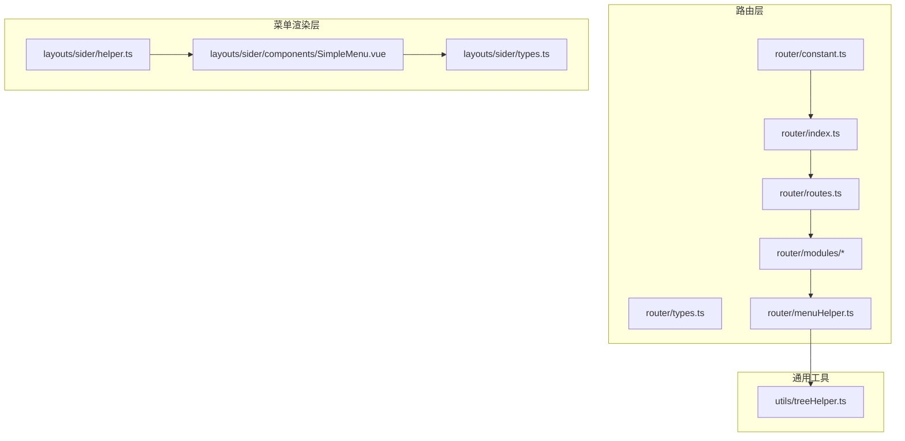
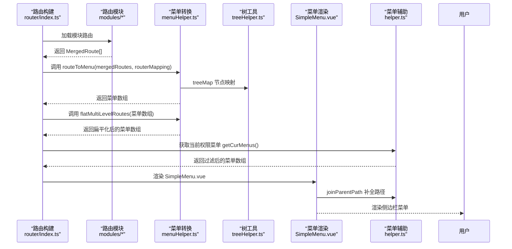
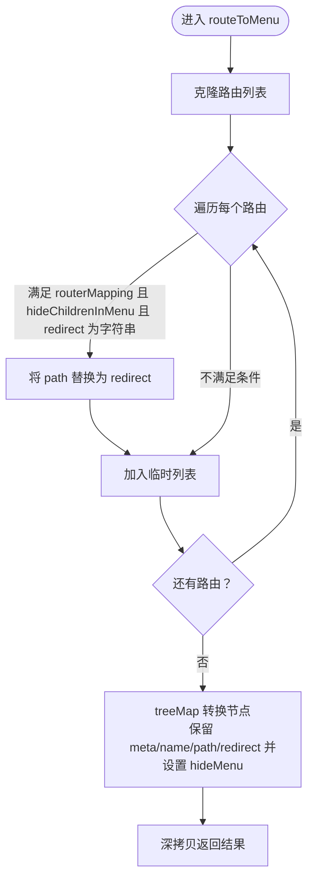
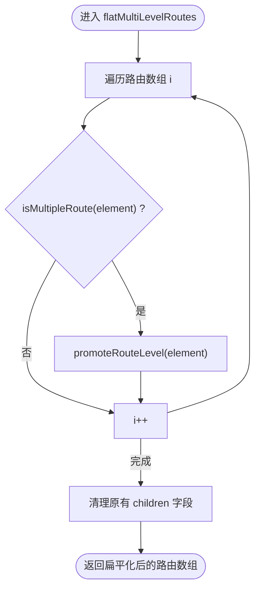
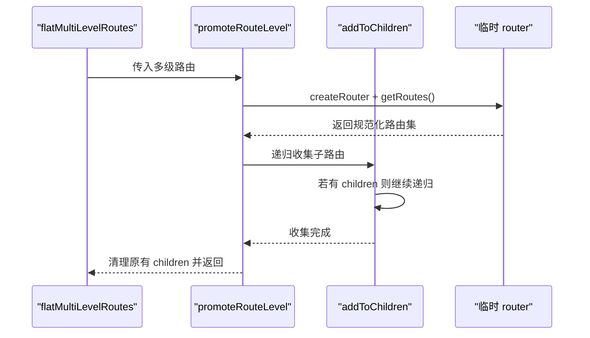
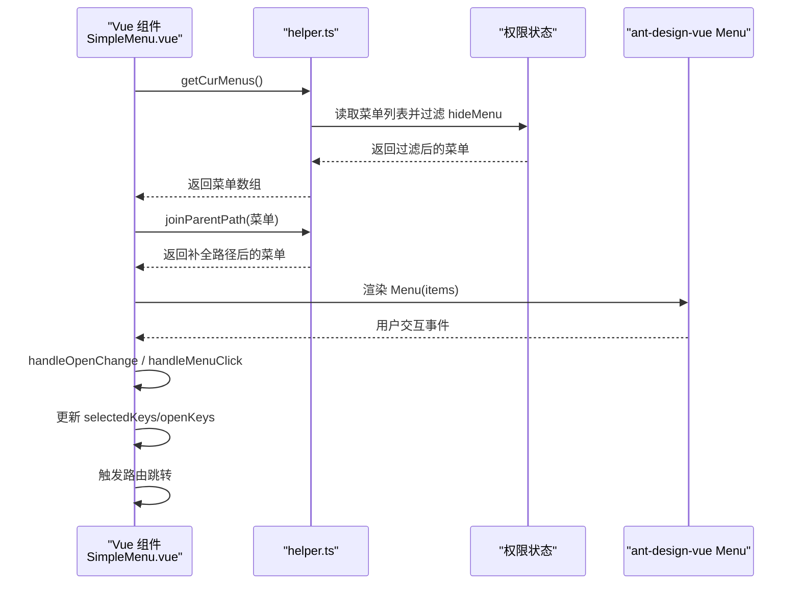
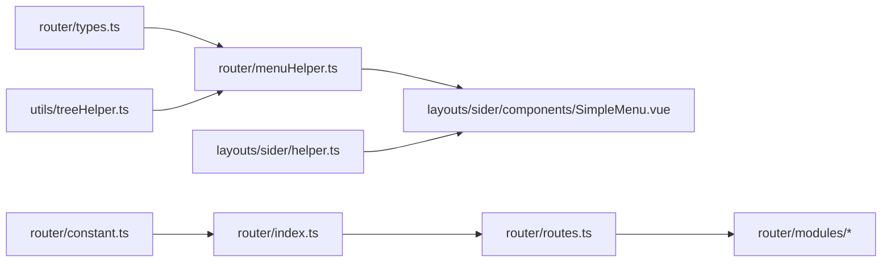

# 路由转菜单机制

<cite>
**本文引用的文件**
- [menuHelper.ts](file://src/router/menuHelper.ts)
- [types.ts](file://src/router/types.ts)
- [index.ts](file://src/router/index.ts)
- [routes.ts](file://src/router/routes.ts)
- [constant.ts](file://src/router/constant.ts)
- [dashboard.ts](file://src/router/modules/dashboard.ts)
- [commodity.ts](file://src/router/modules/commodity.ts)
- [treeHelper.ts](file://src/utils/treeHelper.ts)
- [SimpleMenu.vue](file://src/layouts/sider/components/SimpleMenu.vue)
- [helper.ts](file://src/layouts/sider/helper.ts)
- [types.ts](file://src/layouts/sider/types.ts)
</cite>

## 目录
1. [简介](#简介)
2. [项目结构](#项目结构)
3. [核心组件](#核心组件)
4. [架构总览](#架构总览)
5. [详细组件分析](#详细组件分析)
6. [依赖关系分析](#依赖关系分析)
7. [性能考量](#性能考量)
8. [故障排查指南](#故障排查指南)
9. [结论](#结论)
10. [附录](#附录)

## 简介
本文件围绕“路由到菜单”的转换机制进行系统性解析，重点覆盖以下内容：
- routeToMenu 函数如何依据路由的 meta.hideMenu 等元字段进行过滤与映射，并说明 routerMapping 参数在处理重定向路由时的作用。
- flatMultiLevelRoutes 如何对多级嵌套路由进行扁平化处理，解释 promoteRouteLevel 与 addToChildren 的协作，将三级及以上路由提升为二级结构以适配菜单展示。
- 结合 SimpleMenu.vue 组件说明转换后的菜单数据如何驱动侧边栏渲染。
- 提供自定义菜单转换规则的扩展方法与性能优化建议。

## 项目结构
与“路由转菜单”直接相关的模块分布如下：
- 路由与菜单工具：src/router/menuHelper.ts、src/router/types.ts、src/router/index.ts、src/router/routes.ts、src/router/constant.ts
- 示例路由模块：src/router/modules/dashboard.ts、src/router/modules/commodity.ts
- 菜单渲染组件：src/layouts/sider/components/SimpleMenu.vue
- 菜单辅助逻辑：src/layouts/sider/helper.ts、src/layouts/sider/types.ts
- 树工具：src/utils/treeHelper.ts

图表来源
- [index.ts](file://src/router/index.ts#L1-L39)
- [routes.ts](file://src/router/routes.ts#L1-L27)
- [constant.ts](file://src/router/constant.ts#L1-L53)
- [dashboard.ts](file://src/router/modules/dashboard.ts#L1-L21)
- [commodity.ts](file://src/router/modules/commodity.ts#L1-L27)
- [menuHelper.ts](file://src/router/menuHelper.ts#L1-L123)
- [treeHelper.ts](file://src/utils/treeHelper.ts#L1-L96)
- [SimpleMenu.vue](file://src/layouts/sider/components/SimpleMenu.vue#L1-L63)
- [helper.ts](file://src/layouts/sider/helper.ts#L1-L35)

章节来源
- [index.ts](file://src/router/index.ts#L1-L39)
- [routes.ts](file://src/router/routes.ts#L1-L27)
- [constant.ts](file://src/router/constant.ts#L1-L53)
- [menuHelper.ts](file://src/router/menuHelper.ts#L1-L123)
- [treeHelper.ts](file://src/utils/treeHelper.ts#L1-L96)
- [SimpleMenu.vue](file://src/layouts/sider/components/SimpleMenu.vue#L1-L63)
- [helper.ts](file://src/layouts/sider/helper.ts#L1-L35)

## 核心组件
- 路由类型与菜单类型
  - MergedRoute：在 RouteRecordRaw 基础上补充 name、meta、component、children 等字段，用于统一路由与菜单的数据形态。
  - Menu：菜单模型，包含 name、icon、path、orderNo、auths、hideMenu、children、meta 等字段，便于菜单渲染与权限控制。
- 菜单转换工具
  - routeToMenu：将路由列表转换为菜单列表，支持根据 routerMapping 处理重定向场景，并通过 treeMap 对节点进行映射，同时保留 redirect 字段。
  - flatMultiLevelRoutes：检测并扁平化三级及以上路由，使菜单仅显示二级结构。
  - isMultipleRoute、promoteRouteLevel、addToChildren：内部辅助函数，分别判断多级路由、创建临时 router 获取规范化路由、递归将子路由提升到二级。
- 菜单渲染与辅助
  - SimpleMenu.vue：基于 ant-design-vue Menu 组件渲染侧边栏菜单，使用 getCurMenus 与 joinParentPath 生成最终菜单数据。
  - helper.ts：getCurMenus 过滤掉 meta.hideMenu 的路由；joinParentPath 为菜单路径补全父路径。
  - types.ts：定义菜单状态类型 MenuState（selectedKeys、openKeys）。

章节来源
- [types.ts](file://src/router/types.ts#L1-L73)
- [menuHelper.ts](file://src/router/menuHelper.ts#L1-L123)
- [SimpleMenu.vue](file://src/layouts/sider/components/SimpleMenu.vue#L1-L63)
- [helper.ts](file://src/layouts/sider/helper.ts#L1-L35)
- [types.ts](file://src/layouts/sider/types.ts#L1-L7)

## 架构总览
从路由到菜单的整体流程如下：
- 路由构建：基础路由与异步模块路由合并后形成完整的路由表。
- 菜单转换：
  - 使用 routeToMenu 进行基本映射与过滤（依据 meta.hideMenu），并在 routerMapping 为真时处理重定向场景。
  - 使用 flatMultiLevelRoutes 将三级及以上路由提升为二级，保证菜单层级合理。
- 菜单渲染：SimpleMenu.vue 读取当前权限下的菜单列表，通过 joinParentPath 补全路径，再交由 ant-design-vue 的 Menu 组件渲染。

图表来源
- [index.ts](file://src/router/index.ts#L1-L39)
- [routes.ts](file://src/router/routes.ts#L1-L27)
- [dashboard.ts](file://src/router/modules/dashboard.ts#L1-L21)
- [commodity.ts](file://src/router/modules/commodity.ts#L1-L27)
- [menuHelper.ts](file://src/router/menuHelper.ts#L1-L123)
- [treeHelper.ts](file://src/utils/treeHelper.ts#L1-L96)
- [SimpleMenu.vue](file://src/layouts/sider/components/SimpleMenu.vue#L1-L63)
- [helper.ts](file://src/layouts/sider/helper.ts#L1-L35)

## 详细组件分析

### routeToMenu：路由到菜单的映射与过滤
- 功能要点
  - 克隆输入的路由列表，避免污染原数据。
  - 在 routerMapping 为真且当前路由 meta.hideChildrenInMenu 为真、同时存在字符串类型的 redirect 时，将该路由的 path 替换为 redirect，从而让菜单指向重定向目标而非容器路由。
  - 使用 treeMap 对每个节点执行 conversion，提取并保留必要的字段（如 meta、name、path、redirect），并将 hideMenu 作为布尔值写入映射结果，用于后续过滤。
  - 最终返回深拷贝后的映射结果，确保外部不共享同一引用。
- 关键实现位置
  - 重定向处理与映射：参见 [routeToMenu](file://src/router/menuHelper.ts#L15-L40)。
  - treeMap 转换：参见 [treeMap](file://src/utils/treeHelper.ts#L44-L65)。
- 与示例路由的对应
  - dashboard 模块中，容器路由设置了 meta.hideChildrenInMenu，配合 routerMapping 可将菜单指向子路由 analysis 的实际页面，避免在菜单中出现“占位”的容器路由。
  - 参考 [dashboard.ts](file://src/router/modules/dashboard.ts#L1-L21)。

图表来源
- [menuHelper.ts](file://src/router/menuHelper.ts#L15-L40)
- [treeHelper.ts](file://src/utils/treeHelper.ts#L44-L65)

章节来源
- [menuHelper.ts](file://src/router/menuHelper.ts#L15-L40)
- [treeHelper.ts](file://src/utils/treeHelper.ts#L44-L65)
- [dashboard.ts](file://src/router/modules/dashboard.ts#L1-L21)

### flatMultiLevelRoutes：多级路由扁平化
- 功能要点
  - 遍历路由数组，识别是否存在三级及以上嵌套（通过 isMultipleRoute 判断）。
  - 对于多级路由，调用 promoteRouteLevel：创建一个临时 router，利用其 getRoutes 获取规范化后的路由结构，再通过 addToChildren 将所有子路由提升到二级。
  - 为避免重复，最后会清理原有 children 字段，仅保留扁平化的子项。
- 关键实现位置
  - 扁平化入口与循环：参见 [flatMultiLevelRoutes](file://src/router/menuHelper.ts#L47-L57)。
  - 多级判断：参见 [isMultipleRoute](file://src/router/menuHelper.ts#L64-L81)。
  - 等级提升与递归提升：参见 [promoteRouteLevel](file://src/router/menuHelper.ts#L83-L101)、[addToChildren](file://src/router/menuHelper.ts#L108-L122)。
- 与示例路由的对应
  - commodity 模块中，存在三级嵌套（容器 -> 分类 -> 产品），经过扁平化后，菜单仅显示二级结构，避免过深的层级导致 UI 不友好。
  - 参考 [commodity.ts](file://src/router/modules/commodity.ts#L1-L27)。

图表来源
- [menuHelper.ts](file://src/router/menuHelper.ts#L47-L101)

章节来源
- [menuHelper.ts](file://src/router/menuHelper.ts#L47-L122)
- [commodity.ts](file://src/router/modules/commodity.ts#L1-L27)

### promoteRouteLevel 与 addToChildren：提升与递归收集
- promoteRouteLevel
  - 作用：为多级路由创建一个临时 router，借助其 getRoutes 获取规范化后的路由集合，再通过 addToChildren 将所有子路由收集到二级。
  - 注意：在完成收集后会将临时 router 置空，避免内存泄漏。
- addToChildren
  - 作用：递归地将 element.children 下的所有子路由，按名称匹配到规范化路由集中，收集到 routeModule.children 中，保证最终输出为二级结构。
  - 递归终止条件：当 element.children 为空时停止。
- 复杂度分析
  - 时间复杂度：O(N + E)，其中 N 为节点数，E 为边数（子路由数量）。由于是树形结构，E ≈ N - 1，整体近似 O(N)。
  - 空间复杂度：O(N)，用于存储扁平化后的 children 与临时 router。

图表来源
- [menuHelper.ts](file://src/router/menuHelper.ts#L83-L122)

章节来源
- [menuHelper.ts](file://src/router/menuHelper.ts#L83-L122)

### 菜单渲染：SimpleMenu.vue 如何消费转换后的菜单数据
- 数据来源
  - getCurMenus：从权限状态中取出菜单列表，并过滤掉 meta.hideMenu 的项，确保不会出现在菜单中。
  - joinParentPath：为菜单路径补全父路径，保证最终渲染的 path 是完整路径。
- 渲染行为
  - 使用 ant-design-vue 的 Menu 组件，设置 mode="inline"、theme="dark"，并绑定 selectedKeys/openKeys 实现选中与展开状态管理。
  - 通过 handleOpenChange 与 handleMenuClick 更新 openKeys 与 selectedKeys，并触发跳转。
- 关键实现位置
  - 菜单渲染与事件处理：参见 [SimpleMenu.vue](file://src/layouts/sider/components/SimpleMenu.vue#L1-L63)。
  - 菜单过滤与路径拼接：参见 [helper.ts](file://src/layouts/sider/helper.ts#L1-L35)。

图表来源
- [SimpleMenu.vue](file://src/layouts/sider/components/SimpleMenu.vue#L1-L63)
- [helper.ts](file://src/layouts/sider/helper.ts#L1-L35)

章节来源
- [SimpleMenu.vue](file://src/layouts/sider/components/SimpleMenu.vue#L1-L63)
- [helper.ts](file://src/layouts/sider/helper.ts#L1-L35)

## 依赖关系分析
- 路由与菜单工具
  - menuHelper.ts 依赖 treeHelper.ts 的 treeMap，用于节点映射与树形转换。
  - menuHelper.ts 依赖 MergedRoute 类型，来自 router/types.ts。
- 菜单渲染
  - SimpleMenu.vue 依赖 helper.ts 的 getCurMenus 与 joinParentPath，用于生成最终渲染数据。
  - SimpleMenu.vue 依赖 layouts/sider/types.ts 定义的 MenuState。
- 路由构建
  - router/index.ts 负责创建 router 并导出 resetRouter 等工具。
  - routes.ts 动态聚合 modules 下的路由模块，形成完整路由表。
  - constant.ts 定义静态路由常量（如 ROOT_ROUTE、LOGIN_ROUTE、REDIRECT_ROUTE、PAGE_NOT_FOUND_ROUTE）。

图表来源
- [types.ts](file://src/router/types.ts#L1-L73)
- [menuHelper.ts](file://src/router/menuHelper.ts#L1-L123)
- [treeHelper.ts](file://src/utils/treeHelper.ts#L1-L96)
- [SimpleMenu.vue](file://src/layouts/sider/components/SimpleMenu.vue#L1-L63)
- [helper.ts](file://src/layouts/sider/helper.ts#L1-L35)
- [index.ts](file://src/router/index.ts#L1-L39)
- [routes.ts](file://src/router/routes.ts#L1-L27)
- [constant.ts](file://src/router/constant.ts#L1-L53)

章节来源
- [types.ts](file://src/router/types.ts#L1-L73)
- [menuHelper.ts](file://src/router/menuHelper.ts#L1-L123)
- [treeHelper.ts](file://src/utils/treeHelper.ts#L1-L96)
- [SimpleMenu.vue](file://src/layouts/sider/components/SimpleMenu.vue#L1-L63)
- [helper.ts](file://src/layouts/sider/helper.ts#L1-L35)
- [index.ts](file://src/router/index.ts#L1-L39)
- [routes.ts](file://src/router/routes.ts#L1-L27)
- [constant.ts](file://src/router/constant.ts#L1-L53)

## 性能考量
- treeMap 的时间复杂度为 O(N)，适合大规模路由树的映射与过滤。
- flatMultiLevelRoutes 的时间复杂度近似 O(N)，但涉及创建临时 router 与递归收集，建议：
  - 控制路由层级深度，避免过多三级及以上嵌套。
  - 在菜单构建阶段一次性完成扁平化，避免重复计算。
  - 对于大型项目，可考虑缓存中间结果或分批处理，减少不必要的深拷贝与重复遍历。
- 渲染层面：
  - SimpleMenu.vue 已通过浅层克隆与路径拼接减少重复计算。
  - 建议在权限变更时批量更新菜单，避免频繁触发渲染。

[本节为通用性能建议，无需特定文件引用]

## 故障排查指南
- 菜单未显示
  - 检查 meta.hideMenu 是否被错误设置为 true。
  - 参考 [helper.ts](file://src/layouts/sider/helper.ts#L1-L11) 的过滤逻辑。
- 重定向导致菜单不正确
  - 确认是否传入 routerMapping=true，以便将容器路由的 path 替换为 redirect。
  - 参考 [menuHelper.ts](file://src/router/menuHelper.ts#L15-L40) 的重定向处理。
- 多级菜单层级过深
  - 确认 flatMultiLevelRoutes 是否生效，检查 isMultipleRoute 的判断逻辑。
  - 参考 [menuHelper.ts](file://src/router/menuHelper.ts#L47-L122)。
- 路径不完整导致点击无响应
  - 确认 joinParentPath 是否正确执行，确保 path 以 "/" 开头。
  - 参考 [helper.ts](file://src/layouts/sider/helper.ts#L19-L35)。

章节来源
- [helper.ts](file://src/layouts/sider/helper.ts#L1-L35)
- [menuHelper.ts](file://src/router/menuHelper.ts#L15-L122)

## 结论
- routeToMenu 通过 treeMap 与 meta 字段实现了灵活的菜单映射与过滤，routerMapping 专门用于处理重定向场景，确保菜单指向实际页面。
- flatMultiLevelRoutes 将三级及以上路由提升为二级，配合 SimpleMenu.vue 的渲染逻辑，有效避免了菜单层级过深的问题。
- 通过 getCurMenus 与 joinParentPath 的组合，最终输出的菜单数据既符合权限要求，又具备正确的路径结构，能够稳定驱动侧边栏渲染。

[本节为总结性内容，无需特定文件引用]

## 附录

### 自定义菜单转换规则的扩展方法
- 在 routeToMenu 中增加自定义字段映射
  - 可在 conversion 中扩展更多字段（如 icon、auths、orderNo），以满足业务定制需求。
  - 参考 [menuHelper.ts](file://src/router/menuHelper.ts#L26-L37) 的 conversion 配置。
- 增强过滤策略
  - 可在 getCurMenus 中增加更复杂的过滤逻辑（如按角色或权限集合过滤）。
  - 参考 [helper.ts](file://src/layouts/sider/helper.ts#L1-L11)。
- 路由到菜单的额外处理
  - 可在 flatMultiLevelRoutes 前后插入钩子，对特定路由进行特殊处理（如隐藏某些子路由、合并同类项等）。
  - 参考 [menuHelper.ts](file://src/router/menuHelper.ts#L47-L122)。

### 示例：dashboard 与 commodity 的菜单行为
- dashboard
  - 容器路由设置 meta.hideChildrenInMenu，配合 routerMapping 可将菜单指向 analysis 子路由。
  - 参考 [dashboard.ts](file://src/router/modules/dashboard.ts#L1-L21)。
- commodity
  - 存在三级嵌套，经 flatMultiLevelRoutes 后在菜单中仅显示二级结构。
  - 参考 [commodity.ts](file://src/router/modules/commodity.ts#L1-L27)。

章节来源
- [dashboard.ts](file://src/router/modules/dashboard.ts#L1-L21)
- [commodity.ts](file://src/router/modules/commodity.ts#L1-L27)
- [menuHelper.ts](file://src/router/menuHelper.ts#L15-L122)
- [helper.ts](file://src/layouts/sider/helper.ts#L1-L35)