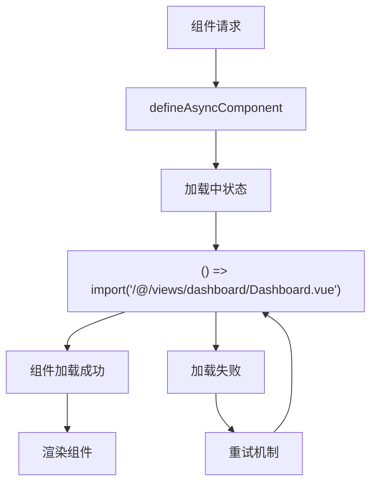
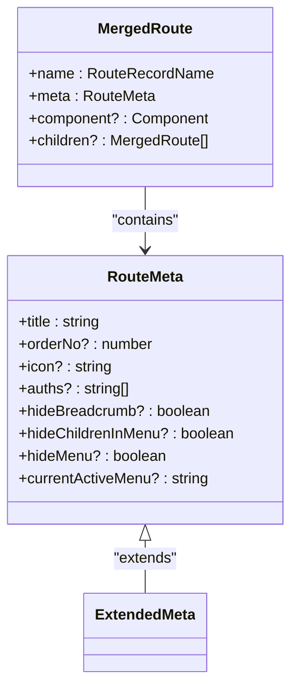
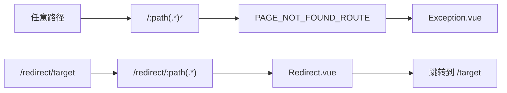
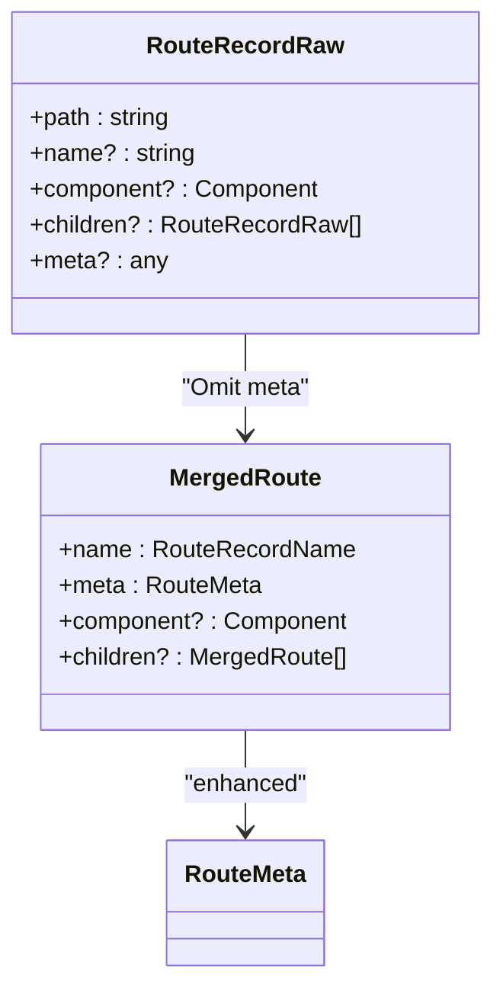
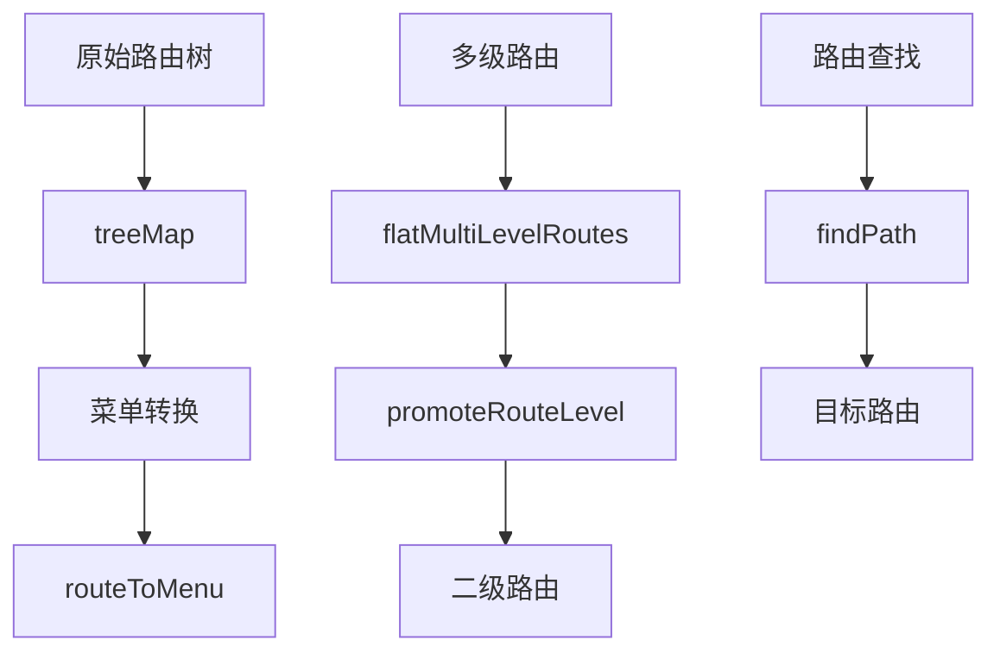
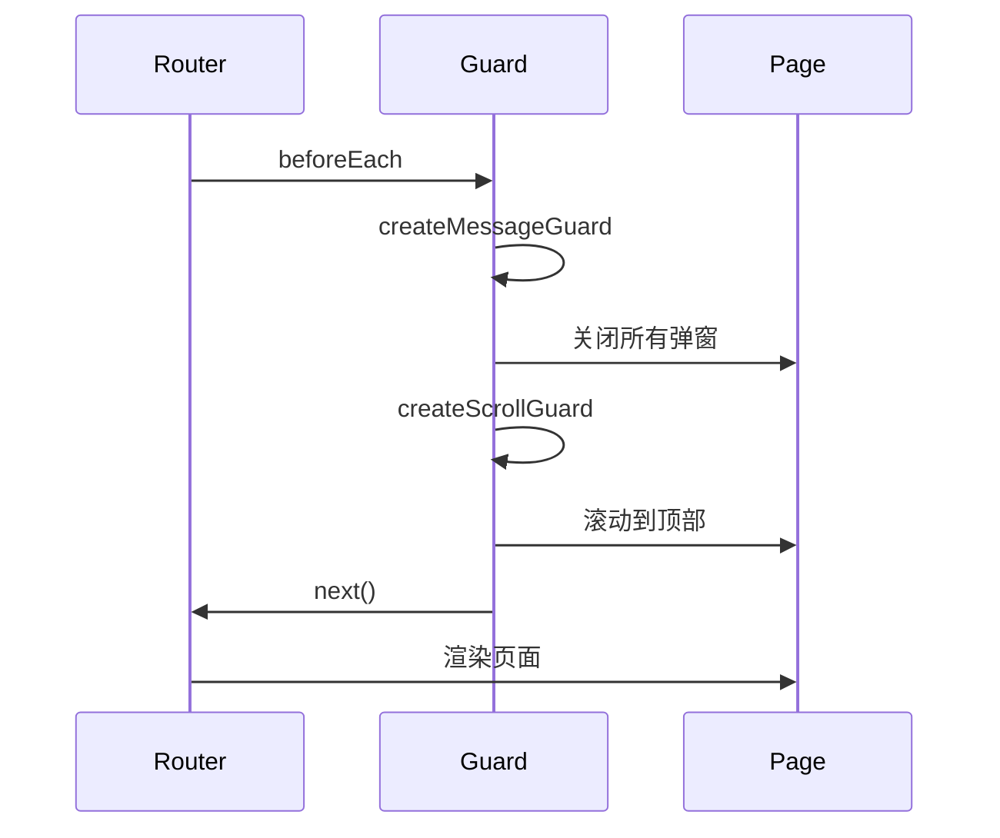
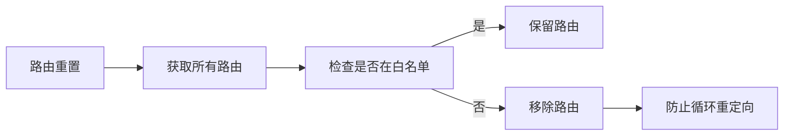

# 路由高级用法

<cite>
**本文档引用的文件**  
- [index.ts](file://src/router/index.ts)
- [types.ts](file://src/router/types.ts)
- [routes.ts](file://src/router/routes.ts)
- [constant.ts](file://src/router/constant.ts)
- [menuHelper.ts](file://src/router/menuHelper.ts)
- [guard/index.ts](file://src/router/guard/index.ts)
- [guard/permissionGuard.ts](file://src/router/guard/permissionGuard.ts)
- [guard/paramMenuGuard.ts](file://src/router/guard/paramMenuGuard.ts)
- [createAsyncComponent.tsx](file://src/utils/createAsyncComponent.tsx)
- [treeHelper.ts](file://src/utils/treeHelper.ts)
- [Exception.vue](file://src/views/system/Exception.vue)
- [Redirect.vue](file://src/views/system/Redirect.vue)
- [vue-router.d.ts](file://types/vue-router.d.ts)
</cite>

## 目录
1. [引言](#引言)
2. [路由懒加载实现原理](#路由懒加载实现原理)
3. [路由元信息综合应用](#路由元信息综合应用)
4. [通配符与重定向路由机制](#通配符与重定向路由机制)
5. [MergedRoute类型融合机制](#mergedroute类型融合机制)
6. [树结构操作在路由中的辅助作用](#树结构操作在路由中的辅助作用)
7. [路由性能监控与嵌套路由布局](#路由性能监控与嵌套路由布局)
8. [常见陷阱规避策略](#常见陷阱规避策略)
9. [总结](#总结)

## 引言
本文系统性介绍Vue Router在项目中的高级应用场景与最佳实践。通过分析项目中的路由配置、类型定义、守卫机制和工具函数，深入探讨路由懒加载、元信息应用、通配符匹配、重定向参数传递等核心机制。同时，结合`MergedRoute`类型定义和`treeHelper`工具，说明如何实现类型安全的路由系统和高效的树形结构操作。

**Section sources**
- [index.ts](file://src/router/index.ts#L1-L39)
- [types.ts](file://src/router/types.ts#L1-L73)

## 路由懒加载实现原理
路由懒加载通过`() => import()`语法实现组件的按需加载，有效减少初始包体积。在项目中，`createAsyncComponent`工具函数封装了异步组件加载逻辑，支持自定义加载状态、延迟时间和重试机制。

**Diagram sources**
- [createAsyncComponent.tsx](file://src/utils/createAsyncComponent.tsx#L41-L62)
- [dashboard.ts](file://src/router/modules/dashboard.ts#L14)

**Section sources**
- [createAsyncComponent.tsx](file://src/utils/createAsyncComponent.tsx#L1-L63)
- [dashboard.ts](file://src/router/modules/dashboard.ts#L1-L21)

## 路由元信息综合应用
路由元信息（meta）在权限控制和页面标题管理中发挥关键作用。项目通过扩展`RouteMeta`接口，添加了`title`、`icon`、`auths`、`hideMenu`等自定义字段，实现统一的路由配置管理。

**Diagram sources**
- [vue-router.d.ts](file://types/vue-router.d.ts#L10-L51)
- [types.ts](file://src/router/types.ts#L55-L72)

**Section sources**
- [vue-router.d.ts](file://types/vue-router.d.ts#L1-L52)
- [types.ts](file://src/router/types.ts#L1-L73)

## 通配符与重定向路由机制
通配符路由`/:path(.*)*`用于404页面处理，能够匹配任意路径。重定向路由`/redirect/:path(.*)`则通过动态参数传递目标路径，实现灵活的路由跳转。

**Diagram sources**
- [constant.ts](file://src/router/constant.ts#L39-L53)
- [Exception.vue](file://src/views/system/Exception.vue#L1-L6)
- [Redirect.vue](file://src/views/system/Redirect.vue#L1-L6)

**Section sources**
- [constant.ts](file://src/router/constant.ts#L1-L53)
- [Exception.vue](file://src/views/system/Exception.vue#L1-L6)
- [Redirect.vue](file://src/views/system/Redirect.vue#L1-L6)

## MergedRoute类型融合机制
`MergedRoute`类型通过继承和扩展Vue Router原生类型，融合了项目自定义字段。它基于`RouteRecordRaw`进行改造，确保类型安全的同时支持项目特定需求。

**Diagram sources**
- [types.ts](file://src/router/types.ts#L55-L72)
- [routes.ts](file://src/router/routes.ts#L5)

**Section sources**
- [types.ts](file://src/router/types.ts#L1-L73)
- [routes.ts](file://src/router/routes.ts#L1-L27)

## 树结构操作在路由中的辅助作用
`treeHelper.ts`提供了树形结构操作的通用工具函数，如`treeMap`、`filter`和`findPath`，在路由处理中用于菜单转换、多级路由扁平化等场景。

**Diagram sources**
- [treeHelper.ts](file://src/utils/treeHelper.ts#L44-L65)
- [menuHelper.ts](file://src/router/menuHelper.ts#L15-L40)

**Section sources**
- [treeHelper.ts](file://src/utils/treeHelper.ts#L1-L96)
- [menuHelper.ts](file://src/router/menuHelper.ts#L1-L123)

## 路由性能监控与嵌套路由布局
路由守卫机制实现了性能监控和页面状态管理。通过`setupRouterGuard`注册多个守卫函数，处理HTTP请求清理、滚动位置重置、消息关闭等任务。

**Diagram sources**
- [guard/index.ts](file://src/router/guard/index.ts#L11-L20)
- [guard/permissionGuard.ts](file://src/router/guard/permissionGuard.ts#L9-L59)

**Section sources**
- [guard/index.ts](file://src/router/guard/index.ts#L1-L63)
- [guard/permissionGuard.ts](file://src/router/guard/permissionGuard.ts#L1-L60)
- [guard/paramMenuGuard.ts](file://src/router/guard/paramMenuGuard.ts#L1-L9)

## 常见陷阱规避策略
项目通过路由白名单机制避免循环重定向问题。在`resetRouter`函数中，仅移除非白名单的动态路由，确保基础路由的稳定性。

**Diagram sources**
- [index.ts](file://src/router/index.ts#L7-L34)
- [routes.ts](file://src/router/routes.ts#L26)

**Section sources**
- [index.ts](file://src/router/index.ts#L1-L39)
- [routes.ts](file://src/router/routes.ts#L1-L27)

## 总结
本文深入分析了项目中路由系统的高级应用场景与最佳实践。通过懒加载、元信息扩展、通配符路由、类型融合和树结构操作等技术，构建了一个高效、安全且易于维护的路由架构。这些实践不仅提升了应用性能，也为复杂路由场景提供了可靠的解决方案。