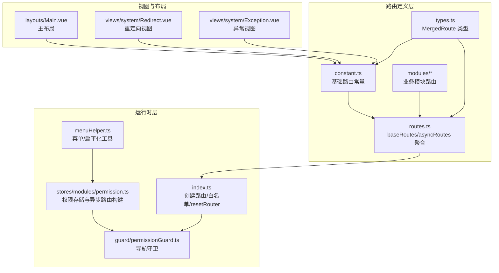
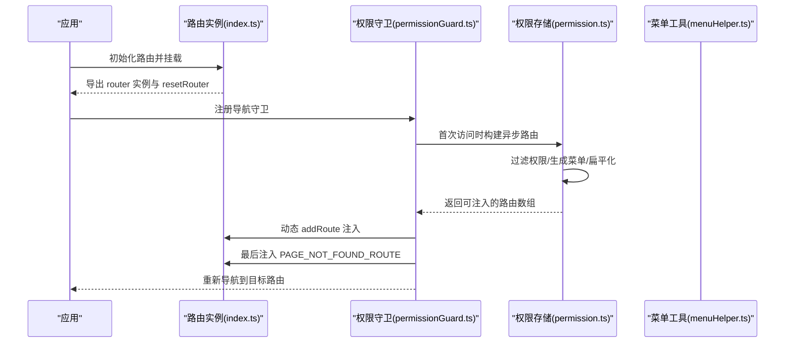
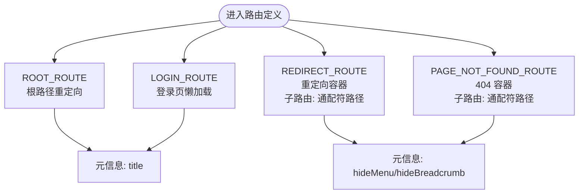
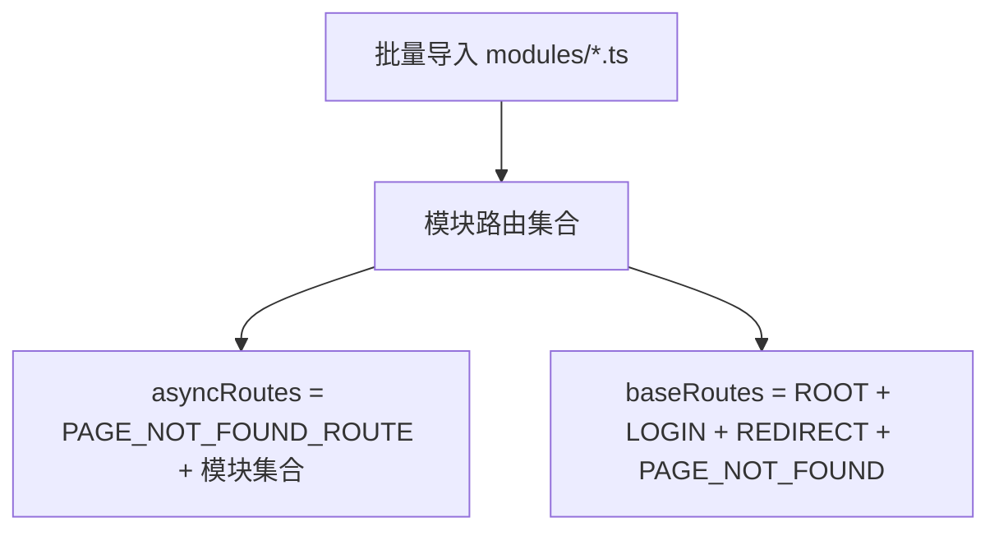
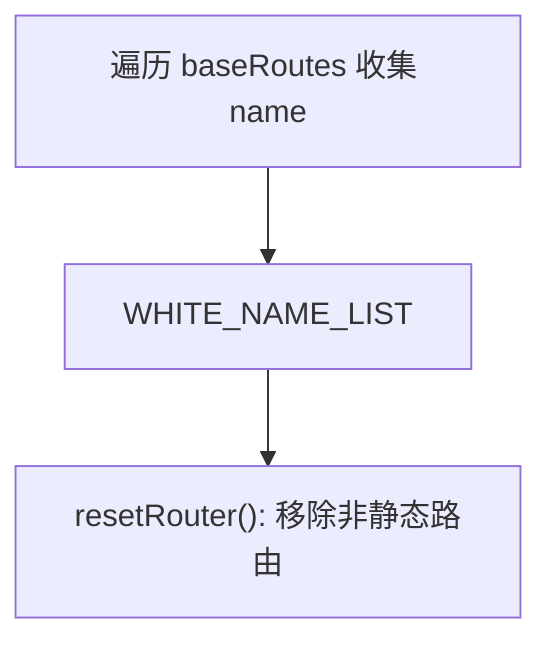
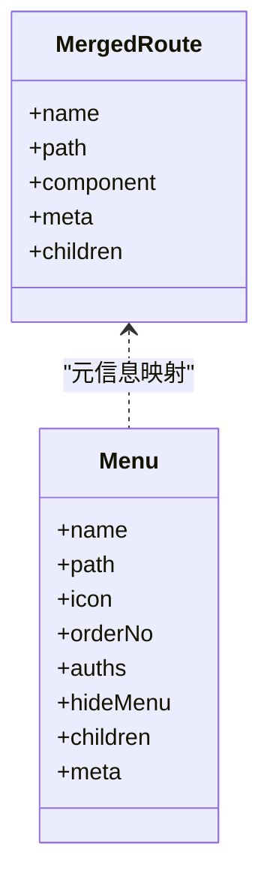
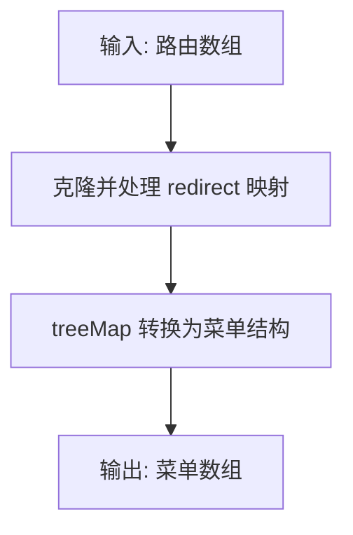
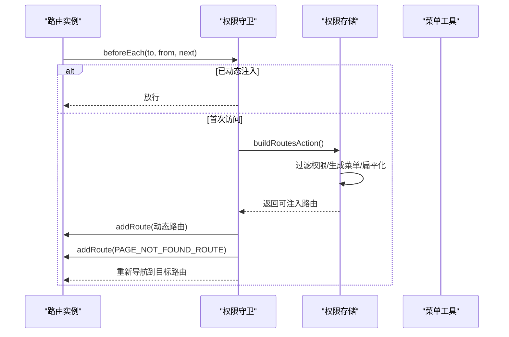
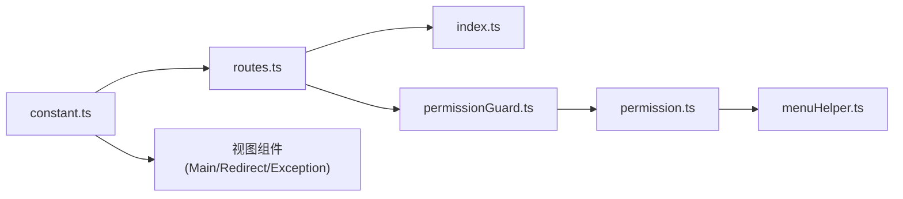

# 静态路由配置

<cite>
**本文引用的文件**
- [src/router/constant.ts](file://src/router/constant.ts)
- [src/router/routes.ts](file://src/router/routes.ts)
- [src/router/index.ts](file://src/router/index.ts)
- [src/router/types.ts](file://src/router/types.ts)
- [src/router/menuHelper.ts](file://src/router/menuHelper.ts)
- [src/router/modules/dashboard.ts](file://src/router/modules/dashboard.ts)
- [src/router/guard/permissionGuard.ts](file://src/router/guard/permissionGuard.ts)
- [src/stores/modules/permission.ts](file://src/stores/modules/permission.ts)
- [src/layouts/Main.vue](file://src/layouts/Main.vue)
- [src/views/system/Redirect.vue](file://src/views/system/Redirect.vue)
- [src/views/system/Exception.vue](file://src/views/system/Exception.vue)
</cite>

## 目录
1. [引言](#引言)
2. [项目结构](#项目结构)
3. [核心组件](#核心组件)
4. [架构总览](#架构总览)
5. [详细组件分析](#详细组件分析)
6. [依赖关系分析](#依赖关系分析)
7. [性能考量](#性能考量)
8. [故障排查指南](#故障排查指南)
9. [结论](#结论)
10. [附录：扩展与最佳实践](#附录扩展与最佳实践)

## 引言
本文件聚焦于项目中“静态路由”的定义与实现机制，围绕以下目标展开：
- 解析基础路由常量（ROOT、LOGIN、REDIRECT、PAGE_NOT_FOUND_ROUTE）的结构设计与元信息（meta）用途，特别是 hideMenu、hideBreadcrumb 的控制逻辑。
- 阐述 baseRoutes 如何整合这些基础路由形成应用的初始路由表。
- 结合代码展示 createWebHashHistory 在入口文件中的使用方式，以及路由白名单（WHITE_NAME_LIST）的生成过程。
- 提供静态路由的扩展方法，包括新增基础路由的规范与注意事项，并说明其在应用启动时的加载流程。

## 项目结构
静态路由相关的核心文件位于 src/router 目录，配合菜单工具、权限存储与守卫共同构成路由体系：
- 常量与类型：constant.ts 定义基础路由；types.ts 定义 MergedRoute 类型；modules/*.ts 定义业务模块路由。
- 路由聚合：routes.ts 汇总基础路由与模块路由，导出 baseRoutes 与 asyncRoutes。
- 入口与历史模式：index.ts 创建路由实例、生成白名单、导出 resetRouter。
- 菜单与扁平化：menuHelper.ts 提供路由转菜单、多级路由扁平化等工具。
- 权限与守卫：permission.ts 构建异步路由；permissionGuard.ts 在导航时动态注入路由并处理 404。
- 视图与布局：Main.vue 作为布局容器；Redirect.vue、Exception.vue 作为重定向与 404 页面组件。

图表来源
- [src/router/constant.ts](file://src/router/constant.ts#L1-L53)
- [src/router/routes.ts](file://src/router/routes.ts#L1-L27)
- [src/router/index.ts](file://src/router/index.ts#L1-L39)
- [src/router/types.ts](file://src/router/types.ts#L1-L73)
- [src/router/menuHelper.ts](file://src/router/menuHelper.ts#L1-L123)
- [src/router/guard/permissionGuard.ts](file://src/router/guard/permissionGuard.ts#L1-L60)
- [src/stores/modules/permission.ts](file://src/stores/modules/permission.ts#L1-L67)
- [src/layouts/Main.vue](file://src/layouts/Main.vue#L1-L44)
- [src/views/system/Redirect.vue](file://src/views/system/Redirect.vue#L1-L6)
- [src/views/system/Exception.vue](file://src/views/system/Exception.vue#L1-L6)

章节来源
- [src/router/constant.ts](file://src/router/constant.ts#L1-L53)
- [src/router/routes.ts](file://src/router/routes.ts#L1-L27)
- [src/router/index.ts](file://src/router/index.ts#L1-L39)
- [src/router/types.ts](file://src/router/types.ts#L1-L73)
- [src/router/menuHelper.ts](file://src/router/menuHelper.ts#L1-L123)
- [src/router/guard/permissionGuard.ts](file://src/router/guard/permissionGuard.ts#L1-L60)
- [src/stores/modules/permission.ts](file://src/stores/modules/permission.ts#L1-L67)
- [src/layouts/Main.vue](file://src/layouts/Main.vue#L1-L44)
- [src/views/system/Redirect.vue](file://src/views/system/Redirect.vue#L1-L6)
- [src/views/system/Exception.vue](file://src/views/system/Exception.vue#L1-L6)

## 核心组件
- 基础路由常量（constant.ts）
  - ROOT_ROUTE：根路径重定向至仪表盘，用于统一入口。
  - LOGIN_ROUTE：登录页路由，懒加载登录视图组件。
  - REDIRECT_ROUTE：重定向容器路由，内部包含带通配符的子路由，用于安全地进行页面跳转。
  - PAGE_NOT_FOUND_ROUTE：兜底 404 路由，包含通配符子路由，确保未知路径指向统一错误页。
- 路由聚合（routes.ts）
  - baseRoutes：由上述基础路由组成初始路由表。
  - asyncRoutes：包含 PAGE_NOT_FOUND_ROUTE 与模块路由集合，用于权限过滤与动态注入。
- 路由实例与白名单（index.ts）
  - 使用 createWebHashHistory 创建哈希历史记录。
  - 通过递归遍历 baseRoutes 生成 WHITE_NAME_LIST，用于 resetRouter 移除非静态路由。
- 类型定义（types.ts）
  - MergedRoute：对 RouteRecordRaw 的增强，补充 name、meta、component、children 字段，确保类型安全。
- 菜单与扁平化（menuHelper.ts）
  - routeToMenu：将路由转换为菜单结构，支持根据 meta.hideMenu 控制菜单显示。
  - flatMultiLevelRoutes：将多级路由扁平化为二级路由，便于菜单渲染。
- 权限与守卫（permission.ts、permissionGuard.ts）
  - permission.ts：构建异步路由，过滤权限，生成菜单列表并扁平化。
  - permissionGuard.ts：在首次访问或刷新时动态注入异步路由，并处理 404 重定向。

章节来源
- [src/router/constant.ts](file://src/router/constant.ts#L1-L53)
- [src/router/routes.ts](file://src/router/routes.ts#L1-L27)
- [src/router/index.ts](file://src/router/index.ts#L1-L39)
- [src/router/types.ts](file://src/router/types.ts#L1-L73)
- [src/router/menuHelper.ts](file://src/router/menuHelper.ts#L1-L123)
- [src/stores/modules/permission.ts](file://src/stores/modules/permission.ts#L1-L67)
- [src/router/guard/permissionGuard.ts](file://src/router/guard/permissionGuard.ts#L1-L60)

## 架构总览
静态路由在应用启动时即被注册，随后在权限守卫触发时动态注入异步路由。整体流程如下：

图表来源
- [src/router/index.ts](file://src/router/index.ts#L1-L39)
- [src/router/guard/permissionGuard.ts](file://src/router/guard/permissionGuard.ts#L1-L60)
- [src/stores/modules/permission.ts](file://src/stores/modules/permission.ts#L1-L67)
- [src/router/menuHelper.ts](file://src/router/menuHelper.ts#L1-L123)

## 详细组件分析

### 基础路由常量（constant.ts）
- ROOT_ROUTE
  - 路径与重定向：根路径重定向至仪表盘，保证首次访问的统一入口。
  - 元信息：title 用于标题与面包屑显示。
- LOGIN_ROUTE
  - 组件：懒加载登录视图组件，减少首屏体积。
  - 元信息：title 用于页面标题。
- REDIRECT_ROUTE
  - 容器：使用主布局组件作为容器。
  - 子路由：带通配符的路径，用于接收重定向参数并渲染重定向视图。
  - 元信息：hideMenu 与 hideBreadcrumb 控制菜单与面包屑不显示该路由。
- PAGE_NOT_FOUND_ROUTE
  - 容器：同样使用主布局组件作为容器。
  - 子路由：带通配符的路径，渲染统一的异常视图。
  - 元信息：hideMenu 与 hideBreadcrumb 控制菜单与面包屑不显示该路由。

图表来源
- [src/router/constant.ts](file://src/router/constant.ts#L1-L53)

章节来源
- [src/router/constant.ts](file://src/router/constant.ts#L1-L53)

### 路由聚合（routes.ts）
- baseRoutes：由 ROOT、LOGIN、REDIRECT、PAGE_NOT_FOUND 四个基础路由组成初始路由表。
- asyncRoutes：包含 PAGE_NOT_FOUND_ROUTE 与模块路由集合，用于权限过滤与动态注入。
- 模块路由：通过 import.meta.glob 按模块批量导入，支持数组或对象形式导出。

图表来源
- [src/router/routes.ts](file://src/router/routes.ts#L1-L27)

章节来源
- [src/router/routes.ts](file://src/router/routes.ts#L1-L27)

### 路由实例与白名单（index.ts）
- 历史模式：使用 createWebHashHistory，基于 URL hash 的路由模式，利于部署与兼容性。
- 白名单生成：递归遍历 baseRoutes 收集所有路由 name，形成 WHITE_NAME_LIST。
- resetRouter：移除不在白名单内的动态路由，保留静态基础路由，便于重新构建权限路由。

图表来源
- [src/router/index.ts](file://src/router/index.ts#L1-L39)

章节来源
- [src/router/index.ts](file://src/router/index.ts#L1-L39)

### 类型系统（types.ts）
- MergedRoute：在 RouteRecordRaw 基础上增加 name、meta、component、children 字段，确保路由定义的类型安全。
- Menu：菜单结构定义，包含 hideMenu、orderNo、auths 等字段，与路由元信息对应。

图表来源
- [src/router/types.ts](file://src/router/types.ts#L1-L73)

章节来源
- [src/router/types.ts](file://src/router/types.ts#L1-L73)

### 菜单与扁平化（menuHelper.ts）
- routeToMenu：将路由转换为菜单结构，支持根据 meta.hideMenu 控制菜单显示；当存在 redirect 且需要映射时，会将路径替换为重定向目标。
- flatMultiLevelRoutes：检测多级路由并将其提升为二级路由，避免菜单层级过深导致渲染复杂度上升。

图表来源
- [src/router/menuHelper.ts](file://src/router/menuHelper.ts#L1-L123)

章节来源
- [src/router/menuHelper.ts](file://src/router/menuHelper.ts#L1-L123)

### 权限与守卫（permission.ts、permissionGuard.ts）
- permission.ts：构建异步路由，按权限过滤，生成菜单列表并进行扁平化处理。
- permissionGuard.ts：在导航前执行权限校验，若尚未动态注入路由，则调用权限存储构建并注入；最后注入 PAGE_NOT_FOUND_ROUTE 并处理 404 场景下的重定向。

图表来源
- [src/router/guard/permissionGuard.ts](file://src/router/guard/permissionGuard.ts#L1-L60)
- [src/stores/modules/permission.ts](file://src/stores/modules/permission.ts#L1-L67)
- [src/router/menuHelper.ts](file://src/router/menuHelper.ts#L1-L123)

章节来源
- [src/router/guard/permissionGuard.ts](file://src/router/guard/permissionGuard.ts#L1-L60)
- [src/stores/modules/permission.ts](file://src/stores/modules/permission.ts#L1-L67)
- [src/router/menuHelper.ts](file://src/router/menuHelper.ts#L1-L123)

### 示例：仪表盘模块路由（modules/dashboard.ts）
- 使用 LAYOUT 作为容器，设置 redirect 与 meta（含 orderNo、icon、title、hideChildrenInMenu），子路由中通过 hideMenu 与 hideBreadcrumb 控制菜单与面包屑显示。

章节来源
- [src/router/modules/dashboard.ts](file://src/router/modules/dashboard.ts#L1-L21)

## 依赖关系分析
- constant.ts 与 routes.ts：constant.ts 定义基础路由，routes.ts 通过 import 导入并组合为 baseRoutes 与 asyncRoutes。
- index.ts：依赖 routes.ts 的 baseRoutes 创建路由实例，并生成 WHITE_NAME_LIST 供 resetRouter 使用。
- permissionGuard.ts：依赖 permission.ts 构建异步路由，并在导航时动态注入。
- menuHelper.ts：被 permission.ts 调用，用于菜单转换与多级路由扁平化。
- 视图与布局：Main.vue 作为容器组件被多个基础路由复用；Redirect.vue、Exception.vue 分别作为重定向与 404 页面组件。

图表来源
- [src/router/constant.ts](file://src/router/constant.ts#L1-L53)
- [src/router/routes.ts](file://src/router/routes.ts#L1-L27)
- [src/router/index.ts](file://src/router/index.ts#L1-L39)
- [src/router/guard/permissionGuard.ts](file://src/router/guard/permissionGuard.ts#L1-L60)
- [src/stores/modules/permission.ts](file://src/stores/modules/permission.ts#L1-L67)
- [src/router/menuHelper.ts](file://src/router/menuHelper.ts#L1-L123)
- [src/layouts/Main.vue](file://src/layouts/Main.vue#L1-L44)
- [src/views/system/Redirect.vue](file://src/views/system/Redirect.vue#L1-L6)
- [src/views/system/Exception.vue](file://src/views/system/Exception.vue#L1-L6)

章节来源
- [src/router/constant.ts](file://src/router/constant.ts#L1-L53)
- [src/router/routes.ts](file://src/router/routes.ts#L1-L27)
- [src/router/index.ts](file://src/router/index.ts#L1-L39)
- [src/router/guard/permissionGuard.ts](file://src/router/guard/permissionGuard.ts#L1-L60)
- [src/stores/modules/permission.ts](file://src/stores/modules/permission.ts#L1-L67)
- [src/router/menuHelper.ts](file://src/router/menuHelper.ts#L1-L123)
- [src/layouts/Main.vue](file://src/layouts/Main.vue#L1-L44)
- [src/views/system/Redirect.vue](file://src/views/system/Redirect.vue#L1-L6)
- [src/views/system/Exception.vue](file://src/views/system/Exception.vue#L1-L6)

## 性能考量
- 懒加载组件：LOGIN_ROUTE、REDIRECT_ROUTE、PAGE_NOT_FOUND_ROUTE 的子路由均采用懒加载，降低首屏资源压力。
- 白名单与 resetRouter：通过 WHITE_NAME_LIST 仅保留静态基础路由，便于在用户登出或切换角色后快速重置路由。
- 多级路由扁平化：menuHelper.ts 的扁平化处理有助于简化菜单渲染与导航逻辑，减少不必要的层级遍历。
- 哈希历史模式：createWebHashHistory 无需服务器端配置，部署简单，但 SEO 不友好；适合后台管理类应用。

## 故障排查指南
- 404 页面未生效
  - 检查 permissionGuard.ts 是否在导航完成后注入了 PAGE_NOT_FOUND_ROUTE。
  - 确认 asyncRoutes 中包含 PAGE_NOT_FOUND_ROUTE。
- 路由重定向异常
  - 检查 REDIRECT_ROUTE 的子路由通配符路径是否正确匹配目标路径。
  - 确认 Redirect.vue 组件存在且无循环重定向。
- 菜单不显示或面包屑异常
  - 检查路由 meta 中 hideMenu 与 hideBreadcrumb 的设置是否符合预期。
  - 若使用 redirect，确认 routeToMenu 的 routerMapping 参数是否启用。
- 白名单导致路由无法移除
  - 确认 WHITE_NAME_LIST 是否包含所有基础路由 name。
  - 检查 resetRouter 的调用时机与条件。

章节来源
- [src/router/guard/permissionGuard.ts](file://src/router/guard/permissionGuard.ts#L1-L60)
- [src/router/routes.ts](file://src/router/routes.ts#L1-L27)
- [src/router/menuHelper.ts](file://src/router/menuHelper.ts#L1-L123)
- [src/router/index.ts](file://src/router/index.ts#L1-L39)

## 结论
本项目通过“基础路由常量 + 路由聚合 + 哈希历史 + 权限守卫”的组合，实现了清晰、可扩展的静态路由与动态路由协同机制。基础路由负责应用的初始入口与兜底场景，权限守卫在首次访问时动态注入业务路由并统一处理 404。通过类型系统与菜单工具，进一步提升了路由与菜单的一致性与可维护性。

## 附录：扩展与最佳实践

### 新增基础路由的规范与注意事项
- 路由命名
  - 使用语义化 name，避免与模块路由冲突；确保 WHITE_NAME_LIST 包含该 name 以便 resetRouter 保留。
- 路由路径
  - 根路径建议使用 ROOT_ROUTE 重定向，避免直接暴露首页路径。
  - 通配符路径（如重定向与 404）应保持唯一性，避免与其他路由冲突。
- 元信息（meta）
  - hideMenu：用于控制菜单是否显示该路由。
  - hideBreadcrumb：用于控制面包屑是否显示该路由。
  - orderNo/icon/title：用于菜单排序与展示。
  - redirect：用于容器路由的子路由重定向。
- 组件懒加载
  - 优先使用懒加载组件，减少首屏体积。
- 布局容器
  - 基础路由尽量复用主布局组件，保持一致的页面骨架。

章节来源
- [src/router/constant.ts](file://src/router/constant.ts#L1-L53)
- [src/router/types.ts](file://src/router/types.ts#L1-L73)
- [src/router/index.ts](file://src/router/index.ts#L1-L39)

### 应用启动时的加载流程
- 初始化阶段
  - routes.ts 导入 modules/*.ts，聚合为 asyncRoutes。
  - index.ts 创建 router 实例，注册 baseRoutes，生成 WHITE_NAME_LIST。
- 首次访问或刷新
  - permissionGuard.ts 触发，调用 permission.ts 构建异步路由并注入。
  - 最后注入 PAGE_NOT_FOUND_ROUTE，处理 404 场景。
  - 重新导航到目标路由，避免进入 404 页面。

章节来源
- [src/router/routes.ts](file://src/router/routes.ts#L1-L27)
- [src/router/index.ts](file://src/router/index.ts#L1-L39)
- [src/router/guard/permissionGuard.ts](file://src/router/guard/permissionGuard.ts#L1-L60)
- [src/stores/modules/permission.ts](file://src/stores/modules/permission.ts#L1-L67)