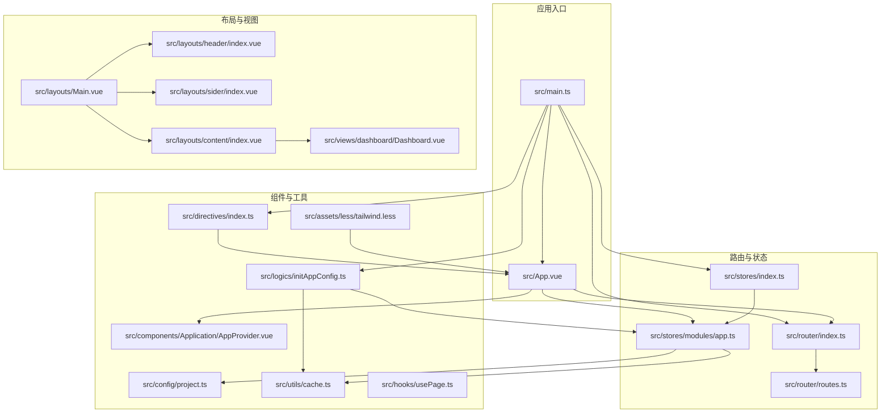
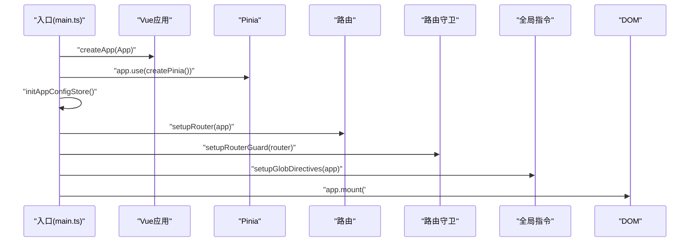
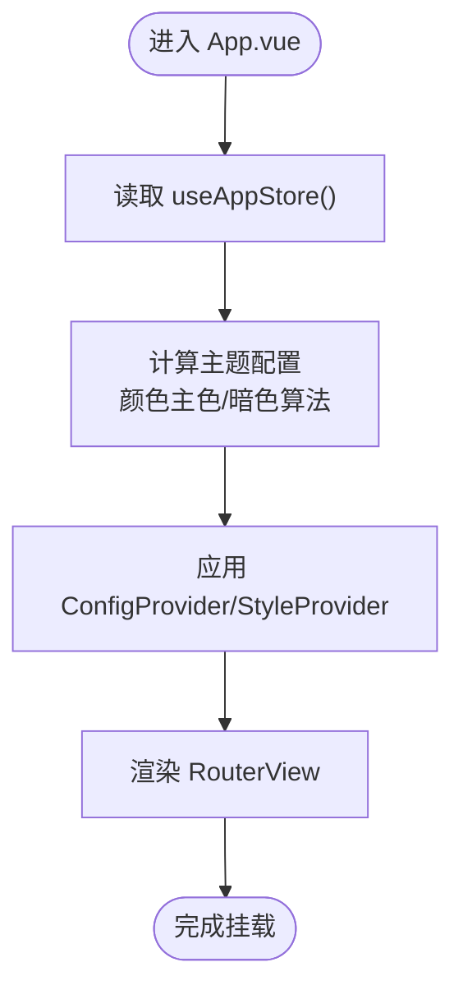
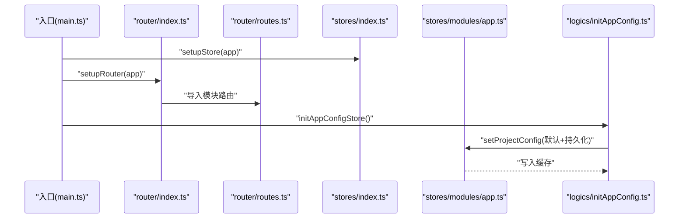
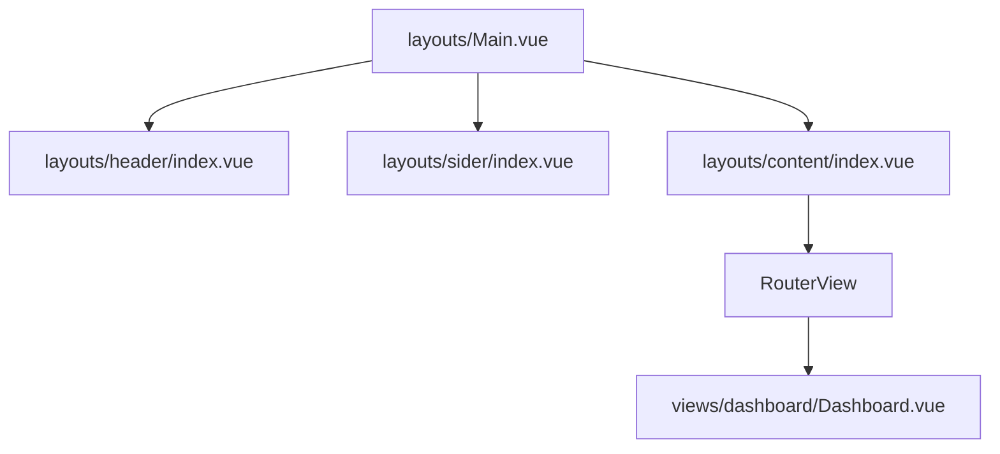
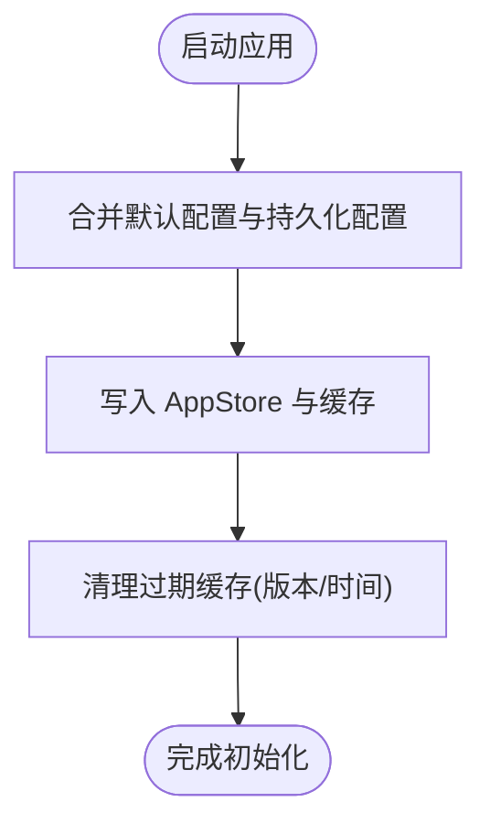

# 目录结构

<cite>
**本文引用的文件**
- [main.ts](file://src/main.ts)
- [App.vue](file://src/App.vue)
- [router/index.ts](file://src/router/index.ts)
- [router/routes.ts](file://src/router/routes.ts)
- [stores/index.ts](file://src/stores/index.ts)
- [stores/modules/app.ts](file://src/stores/modules/app.ts)
- [layouts/Main.vue](file://src/layouts/Main.vue)
- [layouts/header/index.vue](file://src/layouts/header/index.vue)
- [layouts/sider/index.vue](file://src/layouts/sider/index.vue)
- [layouts/content/index.vue](file://src/layouts/content/index.vue)
- [views/dashboard/Dashboard.vue](file://src/views/dashboard/Dashboard.vue)
- [components/Application/AppProvider.vue](file://src/components/Application/AppProvider.vue)
- [directives/index.ts](file://src/directives/index.ts)
- [logics/initAppConfig.ts](file://src/logics/initAppConfig.ts)
- [config/project.ts](file://src/config/project.ts)
- [assets/less/tailwind.less](file://src/assets/less/tailwind.less)
- [utils/cache.ts](file://src/utils/cache.ts)
- [hooks/usePage.ts](file://src/hooks/usePage.ts)
</cite>

## 目录总览

本项目采用“功能域+层次化”的目录组织方式，围绕 Vue 3 + Vite + Pinia + Ant Design Vue 构建，强调模块内聚、职责清晰与可扩展性。核心目录与职责如下：

- src/assets/less：统一引入 Tailwind CSS 原子样式，确保全局样式一致性与可维护性。
- src/components：按功能域拆分（如 Application、Basic、Form、Modal、Table 等），提供可复用 UI 组件与组合式逻辑封装。
- src/views：页面级视图，承载具体业务页面，与路由一一对应。
- src/layouts：应用布局骨架，包含头部、侧边栏、内容区等，统一应用视觉与交互体验。
- src/stores：基于 Pinia 的全局状态管理，按模块拆分（app、permission、user）。
- src/router：路由定义与守卫，支持静态/异步路由、白名单与动态重置。
- src/hooks：组合式逻辑封装，如页面跳转、权限、类名等。
- src/utils：通用工具函数，如缓存、异步组件加载、树形结构辅助等。
- src/logics：应用初始化逻辑，如项目配置注入与缓存清理。
- src/config：项目基础配置，如主题色、前缀、默认配置等。
- src/enums：枚举类型定义，如主题模式、缓存位置、菜单尺寸等。
- src/directives：全局指令注册，如加载指令。

该分层架构有助于：
- 团队协作：按功能域划分职责，降低耦合度。
- 可维护性：组件、状态、路由、布局解耦，便于独立演进。
- 可扩展性：新增页面、组件、状态模块时，遵循既有约定即可快速落地。

图表来源
- [main.ts](file://src/main.ts#L1-L29)
- [App.vue](file://src/App.vue#L1-L42)
- [router/index.ts](file://src/router/index.ts#L1-L39)
- [router/routes.ts](file://src/router/routes.ts#L1-L27)
- [stores/index.ts](file://src/stores/index.ts#L1-L11)
- [stores/modules/app.ts](file://src/stores/modules/app.ts#L1-L76)
- [layouts/Main.vue](file://src/layouts/Main.vue#L1-L44)
- [layouts/header/index.vue](file://src/layouts/header/index.vue#L1-L42)
- [layouts/sider/index.vue](file://src/layouts/sider/index.vue#L1-L18)
- [layouts/content/index.vue](file://src/layouts/content/index.vue#L1-L54)
- [views/dashboard/Dashboard.vue](file://src/views/dashboard/Dashboard.vue#L1-L12)
- [components/Application/AppProvider.vue](file://src/components/Application/AppProvider.vue#L1-L21)
- [directives/index.ts](file://src/directives/index.ts#L1-L11)
- [logics/initAppConfig.ts](file://src/logics/initAppConfig.ts#L1-L54)
- [config/project.ts](file://src/config/project.ts#L1-L39)
- [assets/less/tailwind.less](file://src/assets/less/tailwind.less#L1-L5)
- [utils/cache.ts](file://src/utils/cache.ts#L1-L138)
- [hooks/usePage.ts](file://src/hooks/usePage.ts#L1-L48)

章节来源
- [main.ts](file://src/main.ts#L1-L29)
- [App.vue](file://src/App.vue#L1-L42)
- [router/index.ts](file://src/router/index.ts#L1-L39)
- [router/routes.ts](file://src/router/routes.ts#L1-L27)
- [stores/index.ts](file://src/stores/index.ts#L1-L11)
- [stores/modules/app.ts](file://src/stores/modules/app.ts#L1-L76)
- [layouts/Main.vue](file://src/layouts/Main.vue#L1-L44)
- [layouts/header/index.vue](file://src/layouts/header/index.vue#L1-L42)
- [layouts/sider/index.vue](file://src/layouts/sider/index.vue#L1-L18)
- [layouts/content/index.vue](file://src/layouts/content/index.vue#L1-L54)
- [views/dashboard/Dashboard.vue](file://src/views/dashboard/Dashboard.vue#L1-L12)
- [components/Application/AppProvider.vue](file://src/components/Application/AppProvider.vue#L1-L21)
- [directives/index.ts](file://src/directives/index.ts#L1-L11)
- [logics/initAppConfig.ts](file://src/logics/initAppConfig.ts#L1-L54)
- [config/project.ts](file://src/config/project.ts#L1-L39)
- [assets/less/tailwind.less](file://src/assets/less/tailwind.less#L1-L5)
- [utils/cache.ts](file://src/utils/cache.ts#L1-L138)
- [hooks/usePage.ts](file://src/hooks/usePage.ts#L1-L48)

## 核心目录设计意图与职责划分

- src/assets/less
  - 设计意图：集中引入 Tailwind 原子样式，统一基础样式与变体，避免重复定义，提升样式一致性与可维护性。
  - 职责：提供全局样式入口，供入口文件在应用启动时一次性加载。

- src/components
  - 设计意图：按功能域拆分组件库，形成可复用的 UI 基元与业务组件，降低页面复杂度。
  - 职责：提供基础组件（如标题、帮助提示）、表单组件、模态框、滚动条、倒计时等，并通过 index.ts 暴露聚合导出，便于按需引入。

- src/views
  - 设计意图：承载页面级视图，与路由一一对应，体现业务场景。
  - 职责：以页面为单位组织业务逻辑与模板，例如仪表盘、商品管理、系统登录等。

- src/layouts
  - 设计意图：定义应用布局骨架，统一头部、侧边栏、内容区的结构与交互。
  - 职责：Main.vue 作为主布局容器，header/sider/content 子布局分别负责导航、菜单与内容渲染；通过 Props/Events 实现折叠状态同步。

- src/stores
  - 设计意图：基于 Pinia 的模块化状态管理，将全局状态与配置解耦。
  - 职责：app 模块管理主题、项目配置、页面加载状态等；permission/user 模块用于权限与用户信息管理；index.ts 提供安装器。

- src/router
  - 设计意图：集中管理路由定义、白名单与守卫，支持静态/异步路由与动态重置。
  - 职责：index.ts 创建路由实例与安装器；routes.ts 动态批量导入模块路由；guard 提供权限与参数守卫。

- src/hooks
  - 设计意图：封装可复用的组合式逻辑，减少重复代码。
  - 职责：如 usePage 封装内部跳转与新开窗口逻辑，useClass/usePermission 等提供通用能力。

- src/utils
  - 设计意图：提供通用工具函数，如缓存、异步组件加载、树形结构辅助等。
  - 职责：cache.ts 提供统一的本地/会话缓存接口与版本化清理；createAsyncComponent 支持懒加载组件。

- src/logics
  - 设计意图：应用初始化逻辑，负责注入项目配置与清理过期缓存。
  - 职责：initAppConfig.ts 合并默认配置与持久化配置，设置主题色与暗色模式，并在启动后清理过期缓存。

- src/config
  - 设计意图：集中管理项目基础配置，如主题色、前缀、默认主题与缓存策略。
  - 职责：project.ts 定义全局常量与默认配置对象，供 App.vue 与 stores 使用。

- src/enums
  - 设计意图：统一枚举类型，保证配置与状态的一致性。
  - 职责：如主题模式、缓存位置、菜单尺寸等，避免魔法字符串。

- src/directives
  - 设计意图：集中注册全局指令，提升可维护性。
  - 职责：index.ts 汇总并导出安装器，如加载指令。

章节来源
- [assets/less/tailwind.less](file://src/assets/less/tailwind.less#L1-L5)
- [components/Application/AppProvider.vue](file://src/components/Application/AppProvider.vue#L1-L21)
- [views/dashboard/Dashboard.vue](file://src/views/dashboard/Dashboard.vue#L1-L12)
- [layouts/Main.vue](file://src/layouts/Main.vue#L1-L44)
- [stores/modules/app.ts](file://src/stores/modules/app.ts#L1-L76)
- [router/routes.ts](file://src/router/routes.ts#L1-L27)
- [hooks/usePage.ts](file://src/hooks/usePage.ts#L1-L48)
- [utils/cache.ts](file://src/utils/cache.ts#L1-L138)
- [logics/initAppConfig.ts](file://src/logics/initAppConfig.ts#L1-L54)
- [config/project.ts](file://src/config/project.ts#L1-L39)
- [directives/index.ts](file://src/directives/index.ts#L1-L11)

## 应用初始化与挂载流程（main.ts）

应用从入口文件开始，依次完成以下步骤：
1) 创建 Vue 应用实例。
2) 安装 Pinia 全局状态管理。
3) 初始化项目配置（合并默认配置与持久化配置，设置主题色与暗色模式）。
4) 安装路由并创建路由实例。
5) 注册路由守卫（权限与参数守卫）。
6) 注册全局指令（如加载指令）。
7) 挂载到 DOM。

图表来源
- [main.ts](file://src/main.ts#L1-L29)
- [router/index.ts](file://src/router/index.ts#L1-L39)
- [stores/index.ts](file://src/stores/index.ts#L1-L11)
- [logics/initAppConfig.ts](file://src/logics/initAppConfig.ts#L1-L54)
- [directives/index.ts](file://src/directives/index.ts#L1-L11)

章节来源
- [main.ts](file://src/main.ts#L1-L29)

## 根组件结构与集成（App.vue）

根组件 App.vue 作为应用的顶层容器，承担以下职责：
- 使用 Ant Design Vue 的 ConfigProvider 与 StyleProvider 进行主题与样式注入。
- 读取项目配置（主题色、暗色模式算法）并动态生成主题配置。
- 通过 useAppStore 获取全局配置，驱动 ConfigProvider 的 token 与算法。
- 通过 RouterView 渲染当前路由视图。

图表来源
- [App.vue](file://src/App.vue#L1-L42)
- [stores/modules/app.ts](file://src/stores/modules/app.ts#L1-L76)
- [config/project.ts](file://src/config/project.ts#L1-L39)

章节来源
- [App.vue](file://src/App.vue#L1-L42)
- [stores/modules/app.ts](file://src/stores/modules/app.ts#L1-L76)
- [config/project.ts](file://src/config/project.ts#L1-L39)

## 路由与状态管理集成

- 路由集成
  - 在入口中调用 setupRouter(app) 安装路由插件。
  - 路由实例通过 createRouter 创建，history 使用 Hash 模式，scrollBehavior 控制滚动行为。
  - 白名单通过遍历 baseRoutes 收集，用于 resetRouter 时保留静态路由。
  - routes.ts 使用 import.meta.glob 动态批量导入模块路由，形成 asyncRoutes 与 baseRoutes。

- 状态管理集成
  - 在入口中调用 setupStore(app) 安装 Pinia。
  - App.vue 通过 useAppStore 访问全局配置，驱动主题与样式。
  - initAppConfig.ts 在应用启动时合并默认配置与持久化配置，并写入缓存。

图表来源
- [main.ts](file://src/main.ts#L1-L29)
- [router/index.ts](file://src/router/index.ts#L1-L39)
- [router/routes.ts](file://src/router/routes.ts#L1-L27)
- [stores/index.ts](file://src/stores/index.ts#L1-L11)
- [stores/modules/app.ts](file://src/stores/modules/app.ts#L1-L76)
- [logics/initAppConfig.ts](file://src/logics/initAppConfig.ts#L1-L54)

章节来源
- [router/index.ts](file://src/router/index.ts#L1-L39)
- [router/routes.ts](file://src/router/routes.ts#L1-L27)
- [stores/index.ts](file://src/stores/index.ts#L1-L11)
- [stores/modules/app.ts](file://src/stores/modules/app.ts#L1-L76)
- [logics/initAppConfig.ts](file://src/logics/initAppConfig.ts#L1-L54)

## 布局与视图组织

- 布局结构
  - Main.vue 作为主布局容器，包含 Sider、Header、Content 三部分。
  - Header 通过事件与 Main.vue 同步折叠状态，渲染面包屑、搜索、通知与用户信息。
  - Sider 包含 Logo 与菜单组件，支持折叠状态。
  - Content 区域通过 RouterView 渲染当前路由视图，并预留 KeepAlive 缓存开关与缓存列表。

- 视图示例
  - Dashboard.vue 作为示例页面，使用 BasicForm 组件进行表单渲染。

图表来源
- [layouts/Main.vue](file://src/layouts/Main.vue#L1-L44)
- [layouts/header/index.vue](file://src/layouts/header/index.vue#L1-L42)
- [layouts/sider/index.vue](file://src/layouts/sider/index.vue#L1-L18)
- [layouts/content/index.vue](file://src/layouts/content/index.vue#L1-L54)
- [views/dashboard/Dashboard.vue](file://src/views/dashboard/Dashboard.vue#L1-L12)

章节来源
- [layouts/Main.vue](file://src/layouts/Main.vue#L1-L44)
- [layouts/header/index.vue](file://src/layouts/header/index.vue#L1-L42)
- [layouts/sider/index.vue](file://src/layouts/sider/index.vue#L1-L18)
- [layouts/content/index.vue](file://src/layouts/content/index.vue#L1-L54)
- [views/dashboard/Dashboard.vue](file://src/views/dashboard/Dashboard.vue#L1-L12)

## 项目配置与缓存策略

- 项目配置
  - config/project.ts 定义全局前缀、主题色、默认主题模式、默认缓存时间与缓存位置，并提供默认配置对象。
  - App.vue 读取配置并动态生成主题配置，驱动 Ant Design Vue 的 ConfigProvider。

- 缓存策略
  - utils/cache.ts 提供统一的本地/会话缓存接口，支持版本化键生成、设置/获取/移除/清空/重置缓存。
  - logics/initAppConfig.ts 在应用启动时合并默认配置与持久化配置，并在启动后清理过期缓存（按版本与时间）。

图表来源
- [config/project.ts](file://src/config/project.ts#L1-L39)
- [stores/modules/app.ts](file://src/stores/modules/app.ts#L1-L76)
- [utils/cache.ts](file://src/utils/cache.ts#L1-L138)
- [logics/initAppConfig.ts](file://src/logics/initAppConfig.ts#L1-L54)

章节来源
- [config/project.ts](file://src/config/project.ts#L1-L39)
- [utils/cache.ts](file://src/utils/cache.ts#L1-L138)
- [logics/initAppConfig.ts](file://src/logics/initAppConfig.ts#L1-L54)

## 性能与可维护性建议

- 组件懒加载：通过 createAsyncComponent 对头部组件进行异步加载，减少首屏体积。
- KeepAlive 缓存：content/index.vue 预留缓存开关与缓存列表，可在性能与内存之间权衡。
- 路由白名单：通过白名单保留静态路由，resetRouter 可安全移除动态路由，便于权限变更后的路由重建。
- 全局指令：统一注册全局指令，减少重复逻辑，提升可维护性。
- 样式入口：统一引入 Tailwind 原子样式，避免重复定义，提升样式一致性。

章节来源
- [layouts/content/index.vue](file://src/layouts/content/index.vue#L1-L54)
- [layouts/header/index.vue](file://src/layouts/header/index.vue#L1-L42)
- [router/index.ts](file://src/router/index.ts#L1-L39)
- [directives/index.ts](file://src/directives/index.ts#L1-L11)
- [assets/less/tailwind.less](file://src/assets/less/tailwind.less#L1-L5)

## 结论

该目录结构通过“功能域+层次化”组织，实现了组件、布局、路由、状态、工具与配置的清晰分离。入口文件 main.ts 以流水线方式完成应用初始化与挂载，App.vue 作为根组件集成路由与状态管理，配合布局与视图模块，形成高内聚、低耦合的前端架构。此设计有利于团队协作与长期维护，同时具备良好的扩展性与性能优化空间。