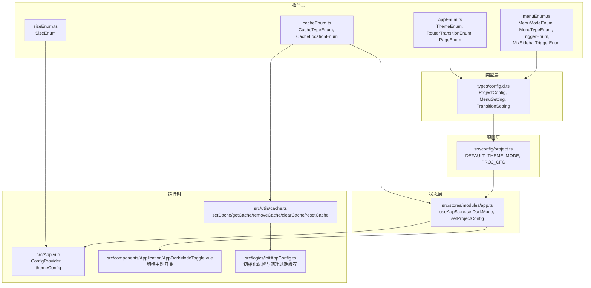
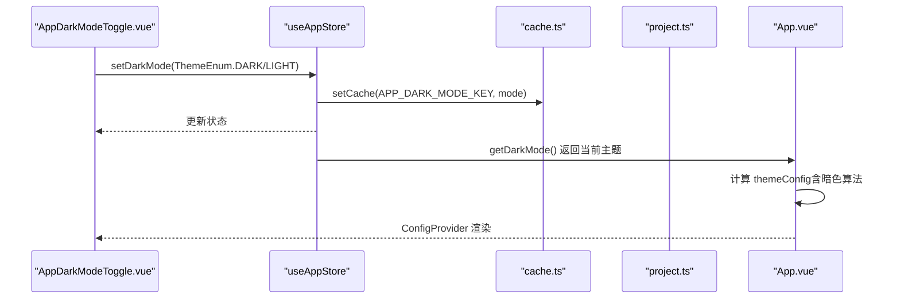
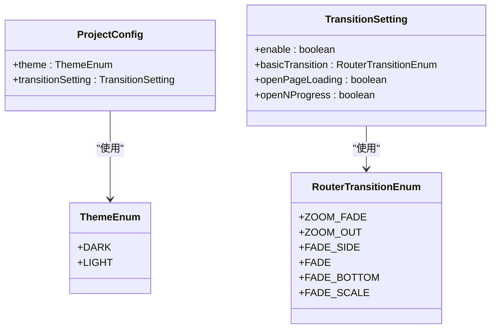
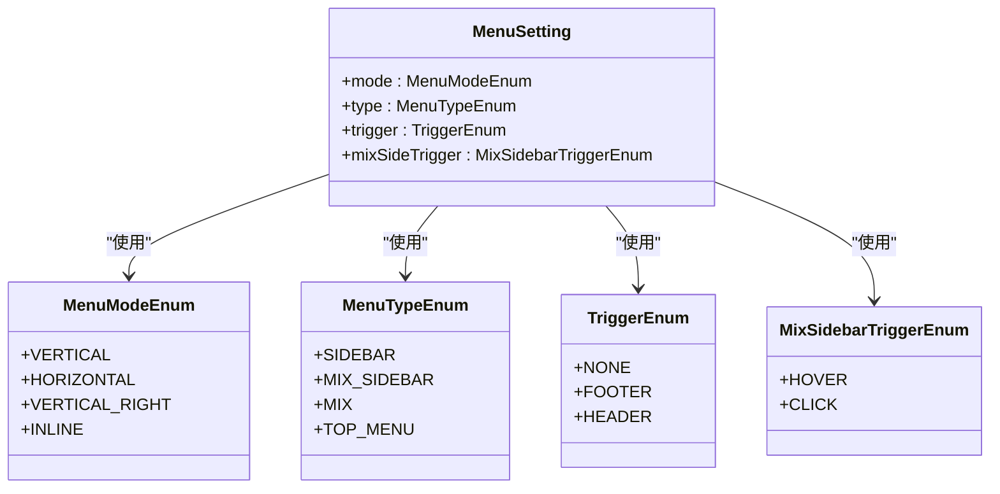
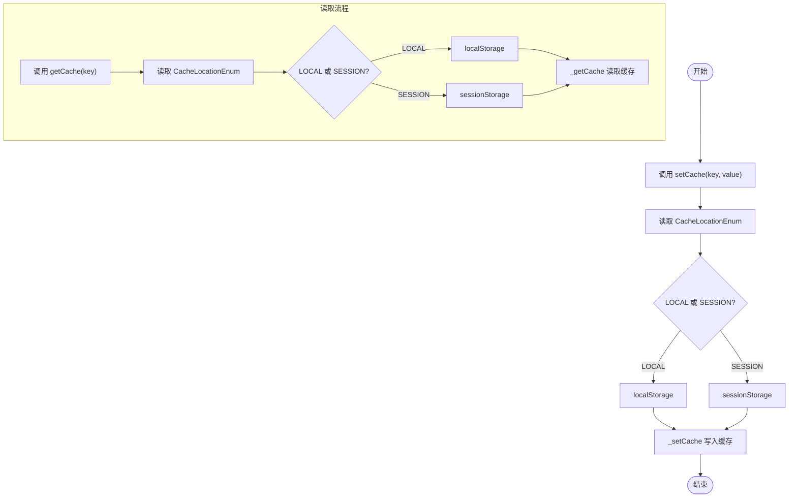
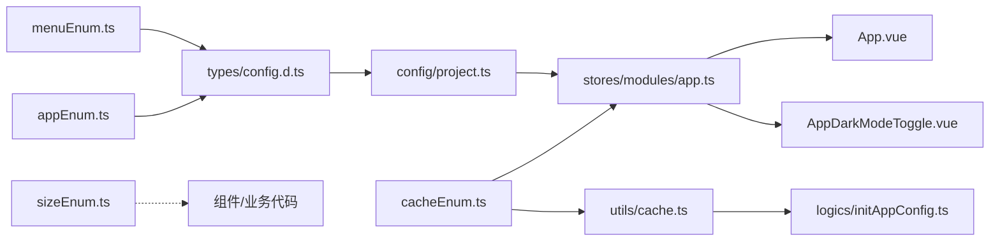

# 枚举类型

<cite>
**本文引用的文件**
- [src/enums/appEnum.ts](file://src/enums/appEnum.ts)
- [src/enums/menuEnum.ts](file://src/enums/menuEnum.ts)
- [src/enums/cacheEnum.ts](file://src/enums/cacheEnum.ts)
- [src/enums/sizeEnum.ts](file://src/enums/sizeEnum.ts)
- [types/config.d.ts](file://types/config.d.ts)
- [src/config/project.ts](file://src/config/project.ts)
- [src/stores/modules/app.ts](file://src/stores/modules/app.ts)
- [src/App.vue](file://src/App.vue)
- [src/components/Application/AppDarkModeToggle.vue](file://src/components/Application/AppDarkModeToggle.vue)
- [src/utils/cache.ts](file://src/utils/cache.ts)
- [src/logics/initAppConfig.ts](file://src/logics/initAppConfig.ts)
</cite>

## 目录
1. [简介](#简介)
2. [项目结构](#项目结构)
3. [核心组件](#核心组件)
4. [架构总览](#架构总览)
5. [详细组件分析](#详细组件分析)
6. [依赖关系分析](#依赖关系分析)
7. [性能考量](#性能考量)
8. [故障排查指南](#故障排查指南)
9. [结论](#结论)
10. [附录](#附录)

## 简介
本文件系统性梳理并讲解 src/enums/ 目录下的全部枚举类型，包括：
- 主题与路由动画：ThemeEnum、RouterTransitionEnum
- 菜单相关：MenuModeEnum、MenuTypeEnum、TriggerEnum、MixSidebarTriggerEnum
- 缓存相关：CacheTypeEnum、CacheLocationEnum
- 尺寸：SizeEnum

重点说明这些枚举如何在类型系统与运行时中协同工作，如何通过 Pinia Store 与全局配置进行类型安全的配置管理，并给出在组件中使用枚举的最佳实践与注意事项。

## 项目结构
- 枚举文件集中于 src/enums/，提供类型安全的常量集合。
- 类型定义位于 types/config.d.ts，用于约束 ProjectConfig 及其子配置项（如 MenuSetting、TransitionSetting）。
- 默认配置与主题常量位于 src/config/project.ts。
- 应用状态与主题切换逻辑位于 src/stores/modules/app.ts。
- 主题在运行时通过 App.vue 的 ConfigProvider 与 Ant Design Vue 主题算法生效。
- 缓存键与位置通过 src/utils/cache.ts 统一管理，配合 src/logics/initAppConfig.ts 完成初始化与持久化。

图表来源
- [src/enums/appEnum.ts](file://src/enums/appEnum.ts#L1-L23)
- [src/enums/menuEnum.ts](file://src/enums/menuEnum.ts#L1-L40)
- [src/enums/cacheEnum.ts](file://src/enums/cacheEnum.ts#L1-L17)
- [src/enums/sizeEnum.ts](file://src/enums/sizeEnum.ts#L1-L6)
- [types/config.d.ts](file://types/config.d.ts#L1-L102)
- [src/config/project.ts](file://src/config/project.ts#L1-L38)
- [src/stores/modules/app.ts](file://src/stores/modules/app.ts#L1-L75)
- [src/App.vue](file://src/App.vue#L1-L41)
- [src/components/Application/AppDarkModeToggle.vue](file://src/components/Application/AppDarkModeToggle.vue#L1-L35)
- [src/utils/cache.ts](file://src/utils/cache.ts#L1-L137)
- [src/logics/initAppConfig.ts](file://src/logics/initAppConfig.ts#L1-L53)

章节来源
- [src/enums/appEnum.ts](file://src/enums/appEnum.ts#L1-L23)
- [src/enums/menuEnum.ts](file://src/enums/menuEnum.ts#L1-L40)
- [src/enums/cacheEnum.ts](file://src/enums/cacheEnum.ts#L1-L17)
- [src/enums/sizeEnum.ts](file://src/enums/sizeEnum.ts#L1-L6)
- [types/config.d.ts](file://types/config.d.ts#L1-L102)
- [src/config/project.ts](file://src/config/project.ts#L1-L38)
- [src/stores/modules/app.ts](file://src/stores/modules/app.ts#L1-L75)
- [src/App.vue](file://src/App.vue#L1-L41)
- [src/components/Application/AppDarkModeToggle.vue](file://src/components/Application/AppDarkModeToggle.vue#L1-L35)
- [src/utils/cache.ts](file://src/utils/cache.ts#L1-L137)
- [src/logics/initAppConfig.ts](file://src/logics/initAppConfig.ts#L1-L53)

## 核心组件
- ThemeEnum：定义主题模式（暗/亮），用于 Pinia Store 的暗色模式状态与 ConfigProvider 的主题算法选择。
- RouterTransitionEnum：定义路由切换动画类型，用于 TransitionSetting.basicTransition。
- MenuModeEnum、MenuTypeEnum、TriggerEnum、MixSidebarTriggerEnum：构成 MenuSetting 的关键字段，决定菜单布局、样式、触发行为等。
- CacheTypeEnum、CacheLocationEnum：统一管理缓存键与缓存位置（本地/会话）。
- SizeEnum：通用尺寸枚举，可用于组件尺寸风格的一致性控制。

章节来源
- [src/enums/appEnum.ts](file://src/enums/appEnum.ts#L1-L23)
- [src/enums/menuEnum.ts](file://src/enums/menuEnum.ts#L1-L40)
- [src/enums/cacheEnum.ts](file://src/enums/cacheEnum.ts#L1-L17)
- [src/enums/sizeEnum.ts](file://src/enums/sizeEnum.ts#L1-L6)

## 架构总览
枚举在系统中的作用链路如下：
- 类型层（types/config.d.ts）通过导入枚举，将枚举值作为强类型约束注入到 ProjectConfig 及其子配置项。
- 配置层（src/config/project.ts）提供默认值与默认配置对象，确保应用启动时具备合理的初始状态。
- 状态层（src/stores/modules/app.ts）通过 Pinia Store 暴露 setDarkMode、setProjectConfig 等动作，将枚举值持久化到缓存并更新全局配置。
- 运行时（src/App.vue）根据 Store 中的主题状态动态构建 ConfigProvider 的 themeConfig，结合 Ant Design Vue 的主题算法实现明暗主题切换。
- 缓存层（src/utils/cache.ts）统一管理缓存键与位置，initAppConfig.ts 在启动时合并持久化配置并清理过期缓存。

图表来源
- [src/components/Application/AppDarkModeToggle.vue](file://src/components/Application/AppDarkModeToggle.vue#L1-L35)
- [src/stores/modules/app.ts](file://src/stores/modules/app.ts#L1-L75)
- [src/utils/cache.ts](file://src/utils/cache.ts#L1-L137)
- [src/config/project.ts](file://src/config/project.ts#L1-L38)
- [src/App.vue](file://src/App.vue#L1-L41)

## 详细组件分析

### 主题枚举 ThemeEnum 与路由动画枚举 RouterTransitionEnum
- ThemeEnum
  - 用途：表示应用主题模式（暗/亮），用于 Pinia Store 的暗色模式状态与 ConfigProvider 的主题算法选择。
  - 在类型层：ProjectConfig.theme 与 HeaderSetting.theme 使用 ThemeEnum。
  - 在配置层：DEFAULT_THEME_MODE 与 PROJ_CFG.theme 使用 ThemeEnum。
  - 在运行时：App.vue 基于 getDarkMode 的值决定是否启用暗色算法。
  - 在状态层：useAppStore.setDarkMode 接收 ThemeEnum 并持久化到缓存。
- RouterTransitionEnum
  - 用途：定义路由切换动画类型，用于 TransitionSetting.basicTransition。
  - 在类型层：TransitionSetting.basicTransition 使用 RouterTransitionEnum。
  - 在配置层：PROJ_CFG.transitionSetting.basicTransition 可设置默认动画。

图表来源
- [src/enums/appEnum.ts](file://src/enums/appEnum.ts#L1-L23)
- [types/config.d.ts](file://types/config.d.ts#L62-L71)
- [types/config.d.ts](file://types/config.d.ts#L92-L102)
- [src/config/project.ts](file://src/config/project.ts#L1-L38)

章节来源
- [src/enums/appEnum.ts](file://src/enums/appEnum.ts#L1-L23)
- [types/config.d.ts](file://types/config.d.ts#L62-L71)
- [types/config.d.ts](file://types/config.d.ts#L92-L102)
- [src/config/project.ts](file://src/config/project.ts#L1-L38)

### 菜单枚举 MenuModeEnum、MenuTypeEnum、TriggerEnum、MixSidebarTriggerEnum
- MenuModeEnum：定义菜单显示模式（垂直、水平、垂直靠右、内嵌）。
- MenuTypeEnum：定义菜单样式类型（左侧菜单、顶部混合、左侧不到顶、顶部菜单）。
- TriggerEnum：定义菜单展开按钮显示位置（不显示、菜单底部、头部）。
- MixSidebarTriggerEnum：定义混合侧边栏触发方式（悬停、点击）。
- 在类型层：MenuSetting.mode、MenuSetting.type、MenuSetting.trigger、MenuSetting.mixSideTrigger 使用上述枚举。
- 在配置层：PROJ_CFG.menuSetting 可设置默认菜单模式与类型。

图表来源
- [src/enums/menuEnum.ts](file://src/enums/menuEnum.ts#L1-L40)
- [types/config.d.ts](file://types/config.d.ts#L30-L60)

章节来源
- [src/enums/menuEnum.ts](file://src/enums/menuEnum.ts#L1-L40)
- [types/config.d.ts](file://types/config.d.ts#L30-L60)
- [src/config/project.ts](file://src/config/project.ts#L1-L38)

### 缓存枚举 CacheTypeEnum、CacheLocationEnum
- CacheTypeEnum：统一管理缓存键（如 APP_DARK_MODE_KEY、PROJ_CFG_KEY、TOKEN_KEY 等）。
- CacheLocationEnum：统一管理缓存位置（LOCAL、SESSION）。
- 在运行时：src/utils/cache.ts 提供 setCache/getCache/removeCache/clearCache/resetCache，内部使用 CacheLocationEnum 决定存储位置；使用 CacheTypeEnum 作为键。
- 在初始化：src/logics/initAppConfig.ts 合并持久化配置到 Store，并在启动后清理过期缓存。

图表来源
- [src/enums/cacheEnum.ts](file://src/enums/cacheEnum.ts#L1-L17)
- [src/utils/cache.ts](file://src/utils/cache.ts#L1-L137)
- [src/logics/initAppConfig.ts](file://src/logics/initAppConfig.ts#L1-L53)

章节来源
- [src/enums/cacheEnum.ts](file://src/enums/cacheEnum.ts#L1-L17)
- [src/utils/cache.ts](file://src/utils/cache.ts#L1-L137)
- [src/logics/initAppConfig.ts](file://src/logics/initAppConfig.ts#L1-L53)

### 尺寸枚举 SizeEnum
- SizeEnum：提供默认、小、大三种尺寸标识，可用于组件尺寸风格的一致性控制。
- 当前仓库中未发现直接使用 SizeEnum 的组件示例，但建议在组件库或业务组件中统一使用该枚举，以避免魔法字符串并提升一致性。

章节来源
- [src/enums/sizeEnum.ts](file://src/enums/sizeEnum.ts#L1-L6)

## 依赖关系分析
- 枚举到类型的依赖：types/config.d.ts 导入 appEnum.ts 与 menuEnum.ts，将枚举类型注入到 ProjectConfig、MenuSetting、TransitionSetting 等接口中。
- 枚举到配置的依赖：src/config/project.ts 使用 ThemeEnum 与 CacheLocationEnum 作为默认值与默认配置的一部分。
- 枚举到状态的依赖：src/stores/modules/app.ts 使用 ThemeEnum 与 CacheTypeEnum，通过 setDarkMode 与 setProjectConfig 将枚举值持久化。
- 枚举到运行时的依赖：src/App.vue 使用 ThemeEnum 决定是否启用暗色算法；组件 AppDarkModeToggle.vue 通过 Switch 的 checkedValue/unCheckedValue 使用 ThemeEnum 实现主题切换。
- 枚举到缓存的依赖：src/utils/cache.ts 使用 CacheTypeEnum 作为键，CacheLocationEnum 决定存储位置。

图表来源
- [src/enums/appEnum.ts](file://src/enums/appEnum.ts#L1-L23)
- [src/enums/menuEnum.ts](file://src/enums/menuEnum.ts#L1-L40)
- [src/enums/cacheEnum.ts](file://src/enums/cacheEnum.ts#L1-L17)
- [src/enums/sizeEnum.ts](file://src/enums/sizeEnum.ts#L1-L6)
- [types/config.d.ts](file://types/config.d.ts#L1-L102)
- [src/config/project.ts](file://src/config/project.ts#L1-L38)
- [src/stores/modules/app.ts](file://src/stores/modules/app.ts#L1-L75)
- [src/App.vue](file://src/App.vue#L1-L41)
- [src/components/Application/AppDarkModeToggle.vue](file://src/components/Application/AppDarkModeToggle.vue#L1-L35)
- [src/utils/cache.ts](file://src/utils/cache.ts#L1-L137)
- [src/logics/initAppConfig.ts](file://src/logics/initAppConfig.ts#L1-L53)

章节来源
- [types/config.d.ts](file://types/config.d.ts#L1-L102)
- [src/config/project.ts](file://src/config/project.ts#L1-L38)
- [src/stores/modules/app.ts](file://src/stores/modules/app.ts#L1-L75)
- [src/App.vue](file://src/App.vue#L1-L41)
- [src/components/Application/AppDarkModeToggle.vue](file://src/components/Application/AppDarkModeToggle.vue#L1-L35)
- [src/utils/cache.ts](file://src/utils/cache.ts#L1-L137)
- [src/logics/initAppConfig.ts](file://src/logics/initAppConfig.ts#L1-L53)

## 性能考量
- 枚举本身无性能开销，但类型检查与配置合并会影响启动阶段的初始化成本。建议：
  - 将默认配置集中在 PROJ_CFG 中，减少运行时拼装成本。
  - 缓存键与位置统一管理，避免重复判断与分支。
  - 在组件中尽量使用 computed 与响应式数据，减少不必要的渲染。

## 故障排查指南
- 主题切换无效
  - 检查 App.vue 中的 themeConfig 计算逻辑是否基于 getDarkMode。
  - 确认 useAppStore.getDarkMode 是否正确从缓存读取 APP_DARK_MODE_KEY。
  - 确认 AppDarkModeToggle.vue 的 Switch checkedValue/unCheckedValue 使用的是 ThemeEnum 的值。
- 配置未持久化
  - 检查 setCache/ getCache 的调用是否传入正确的 CacheTypeEnum 键。
  - 确认 CacheLocationEnum 与默认存储位置一致。
- 启动配置未生效
  - 检查 initAppConfig.ts 是否成功合并 PROJ_CFG 与缓存中的 PROJ_CFG_KEY。
  - 留意清理过期缓存逻辑是否误删了有效配置。

章节来源
- [src/App.vue](file://src/App.vue#L1-L41)
- [src/stores/modules/app.ts](file://src/stores/modules/app.ts#L1-L75)
- [src/components/Application/AppDarkModeToggle.vue](file://src/components/Application/AppDarkModeToggle.vue#L1-L35)
- [src/utils/cache.ts](file://src/utils/cache.ts#L1-L137)
- [src/logics/initAppConfig.ts](file://src/logics/initAppConfig.ts#L1-L53)

## 结论
- 枚举在本项目中承担“类型安全常量”的角色，贯穿类型定义、配置、状态与运行时。
- 通过 Pinia Store 与缓存工具，主题与配置得以持久化并在重启后恢复。
- 建议在组件与业务逻辑中广泛使用枚举，避免魔法字符串，提升可维护性与可读性。
- 对于尚未使用的 SizeEnum，可在组件库或业务组件中推广使用，形成统一的尺寸规范。

## 附录
- 在组件中使用枚举的参考路径
  - 切换主题：[src/components/Application/AppDarkModeToggle.vue](file://src/components/Application/AppDarkModeToggle.vue#L1-L35)
  - 读取与设置主题：[src/stores/modules/app.ts](file://src/stores/modules/app.ts#L1-L75)
  - 运行时主题生效：[src/App.vue](file://src/App.vue#L1-L41)
  - 默认主题与配置：[src/config/project.ts](file://src/config/project.ts#L1-L38)
  - 缓存键与位置：[src/enums/cacheEnum.ts](file://src/enums/cacheEnum.ts#L1-L17)
  - 缓存工具：[src/utils/cache.ts](file://src/utils/cache.ts#L1-L137)
  - 初始化配置：[src/logics/initAppConfig.ts](file://src/logics/initAppConfig.ts#L1-L53)
  - 类型约束：[types/config.d.ts](file://types/config.d.ts#L1-L102)