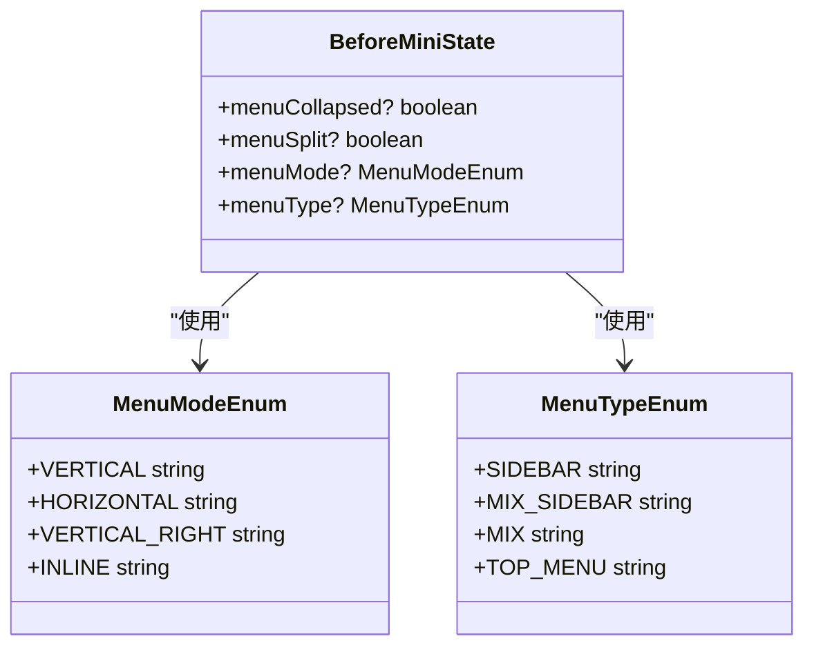
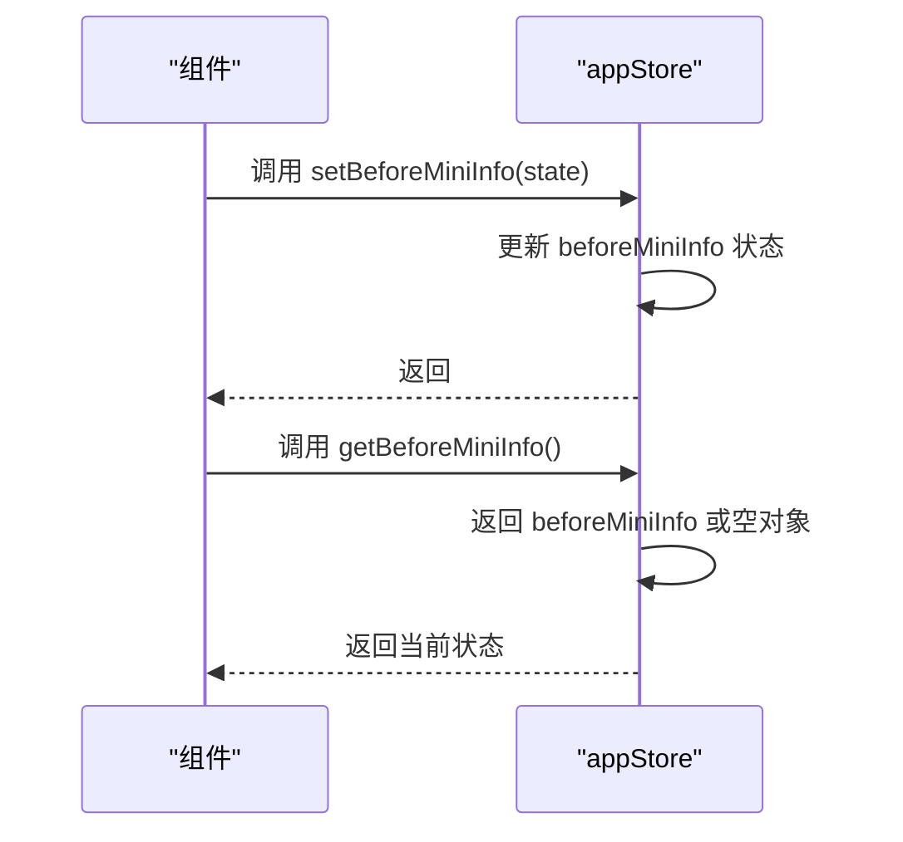

# 状态管理类型

<cite>
**本文档引用的文件**   
- [types/store.d.ts](file://types/store.d.ts)
- [src/stores/modules/app.ts](file://src/stores/modules/app.ts)
- [src/stores/modules/user.ts](file://src/stores/modules/user.ts)
- [src/components/Application/AppLogo.vue](file://src/components/Application/AppLogo.vue)
- [src/enums/menuEnum.ts](file://src/enums/menuEnum.ts)
- [types/config.d.ts](file://types/config.d.ts)
</cite>

## 目录
1. [简介](#简介)
2. [核心类型定义](#核心类型定义)
3. [BeforeMiniState 接口](#beforeministate-接口)
4. [UserInfo 接口](#userinfo-接口)
5. [SiteInfo 接口](#siteinfo-接口)
6. [类型在 Store 中的实际应用](#类型在-store-中的实际应用)
7. [总结](#总结)

## 简介
本文档详细阐述了 `types/store.d.ts` 文件中为 Pinia 状态管理定义的类型。这些类型为应用的全局状态提供了类型安全，确保了开发过程中的代码提示和运行时的稳定性。文档将重点分析 `BeforeMiniState`、`UserInfo` 和 `SiteInfo` 三个核心接口的设计意图和实际应用。

## 核心类型定义
`types/store.d.ts` 文件是项目中所有全局状态模型的类型定义中心。它通过 TypeScript 接口（Interface）为 Pinia Store 中的状态对象提供了精确的类型描述。这种类型定义方式不仅提升了代码的可读性和可维护性，更重要的是为开发者提供了强大的类型安全和智能提示，有效防止了因拼写错误或结构不匹配导致的运行时错误。

## BeforeMiniState 接口
`BeforeMiniState` 接口用于记录菜单在折叠为迷你状态前的原始配置。当用户将侧边栏菜单折叠时，应用会将当前的菜单状态保存到此对象中，以便在用户再次展开菜单时，能够恢复到折叠前的样式和布局。



**Diagram sources**
- [types/store.d.ts](file://types/store.d.ts#L10-L16)
- [src/enums/menuEnum.ts](file://src/enums/menuEnum.ts#L2-L23)

**Section sources**
- [types/store.d.ts](file://types/store.d.ts#L10-L16)

### 设计与交互连贯性
该接口的设计确保了用户交互的连贯性。例如，如果用户将菜单设置为“混合侧边栏”模式并进行了折叠，那么当用户再次展开菜单时，系统会自动恢复到“混合侧边栏”模式，而不是一个默认的、可能不符合用户预期的模式。这极大地提升了用户体验。

### 在 Store 中的应用
在 `app.ts` Store 模块中，`BeforeMiniState` 被用作 `beforeMiniInfo` 状态的类型。Store 提供了 `setBeforeMiniInfo` 动作来更新此状态，并通过 `getBeforeMiniInfo` 计算属性来安全地获取其值。



**Diagram sources**
- [src/stores/modules/app.ts](file://src/stores/modules/app.ts#L15-L16)
- [src/stores/modules/app.ts](file://src/stores/modules/app.ts#L33-L34)
- [src/stores/modules/app.ts](file://src/stores/modules/app.ts#L61-L64)

**Section sources**
- [src/stores/modules/app.ts](file://src/stores/modules/app.ts#L15-L16)
- [src/stores/modules/app.ts](file://src/stores/modules/app.ts#L33-L34)
- [src/stores/modules/app.ts](file://src/stores/modules/app.ts#L61-L64)

## UserInfo 接口
`UserInfo` 接口被定义为空接口（`export interface UserInfo {}`）。这种设计并非疏忽，而是一种深思熟虑的策略。

```mermaid
classDiagram
class UserInfo {
}
class UserStore {
-state : {}
+getters : {}
+actions : {}
}
UserStore --> UserInfo : "预留扩展"
```

**Diagram sources**
- [types/store.d.ts](file://types/store.d.ts#L22)
- [src/stores/modules/user.ts](file://src/stores/modules/user.ts#L20-L24)

**Section sources**
- [types/store.d.ts](file://types/store.d.ts#L22)
- [src/stores/modules/user.ts](file://src/stores/modules/user.ts#L20-L24)

### 设计意图
其设计意图是让开发者根据后端 API 返回的实际用户数据进行灵活扩展。后端返回的用户信息可能包含 `id`、`name`、`email`、`avatar`、`roles` 等多种字段，且这些字段可能随项目迭代而变化。通过定义一个空接口，开发者可以在项目的其他地方（如 `types/user.d.ts`）通过接口合并（Interface Merging）的方式，为 `UserInfo` 添加具体的属性，而无需修改核心的 `store.d.ts` 文件。这保证了核心类型定义的稳定性和项目的可扩展性。

## SiteInfo 接口
`SiteInfo` 接口用于定义站点的基本信息，目前包含站点的 logo 和名称。

```mermaid
classDiagram
class SiteInfo {
+logo string
+siteName string
}
class AppLogo as "AppLogo.vue"
class Login as "Login.vue"
AppLogo --> SiteInfo : "读取"
Login --> SiteInfo : "读取"
```

**Diagram sources**
- [types/store.d.ts](file://types/store.d.ts#L25-L29)
- [src/components/Application/AppLogo.vue](file://src/components/Application/AppLogo.vue#L30-L33)
- [src/stores/modules/app.ts](file://src/stores/modules/app.ts#L16-L17)

**Section sources**
- [types/store.d.ts](file://types/store.d.ts#L25-L29)
- [src/components/Application/AppLogo.vue](file://src/components/Application/AppLogo.vue#L30-L33)
- [src/stores/modules/app.ts](file://src/stores/modules/app.ts#L16-L17)

### 接口定义
```typescript
export interface SiteInfo {
  logo: string;
  siteName: string;
}
```

### 实际应用
`SiteInfo` 类型在 `app.ts` Store 中被用作 `siteInfo` 状态的类型。多个组件通过 `useAppStore` 获取该信息并进行展示。例如，`AppLogo.vue` 组件会优先从 Store 的 `getSiteInfo` 中获取 logo 和站点名称，如果 Store 中没有，则使用默认值。

## 类型在 Store 中的实际应用
这些类型定义与 Pinia Store 的结合，为应用提供了强大的类型安全保障。

### 类型安全与代码提示
在 `app.ts` 文件中，通过 `import type { BeforeMiniState, SiteInfo } from "/#/store"` 导入这些类型，并在 `AppState` 接口中使用它们。这使得 TypeScript 编译器能够对状态对象的结构进行严格检查。任何对 `beforeMiniInfo` 或 `siteInfo` 的非法赋值都会在编译阶段被发现。同时，开发者在编写代码时，IDE 能够提供精确的属性名提示，极大地提高了开发效率。

### 防止运行时错误
通过为 Store 的 `getters` 和 `actions` 参数提供类型注解，可以有效防止运行时错误。例如，`setBeforeMiniInfo(state: BeforeMiniState)` 明确规定了传入参数必须符合 `BeforeMiniState` 的结构，避免了因传递错误对象而导致的潜在 bug。

## 总结
`types/store.d.ts` 中定义的类型是整个应用状态管理的基石。`BeforeMiniState` 接口通过记录菜单状态，保障了用户交互的连贯性；`UserInfo` 接口的空定义设计，为未来根据后端数据进行扩展提供了极大的灵活性；`SiteInfo` 接口则清晰地定义了站点基本信息的结构。这些类型与 Pinia Store 的紧密结合，不仅为开发者提供了卓越的代码提示体验，更重要的是通过编译时检查，从根本上防止了大量潜在的运行时错误，是构建健壮、可维护的前端应用的关键实践。