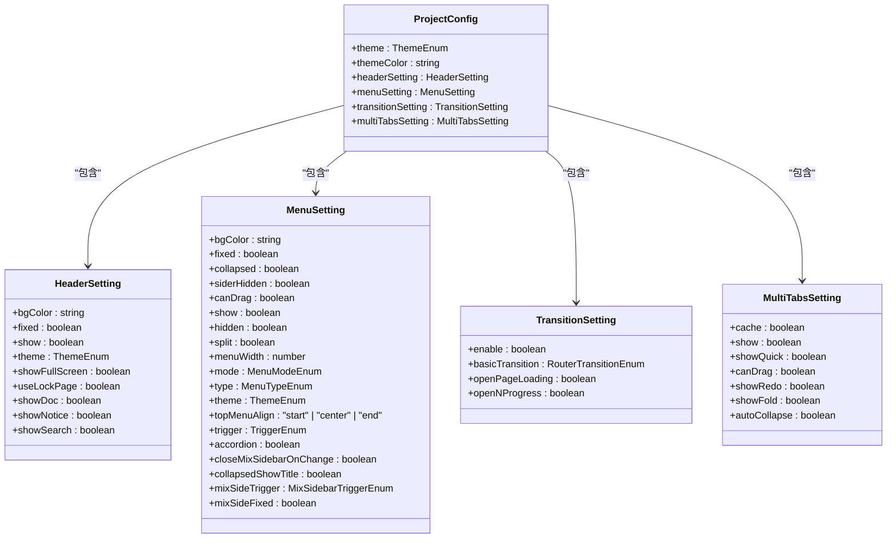
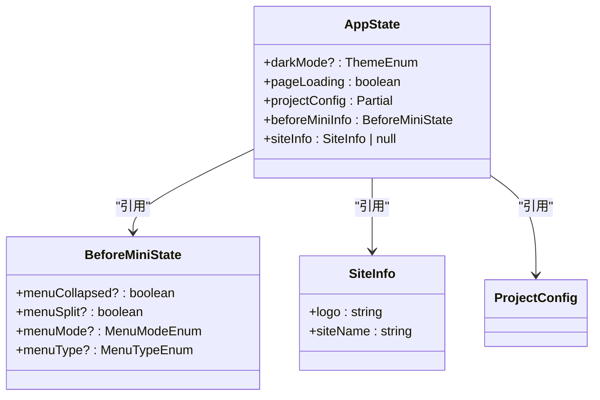
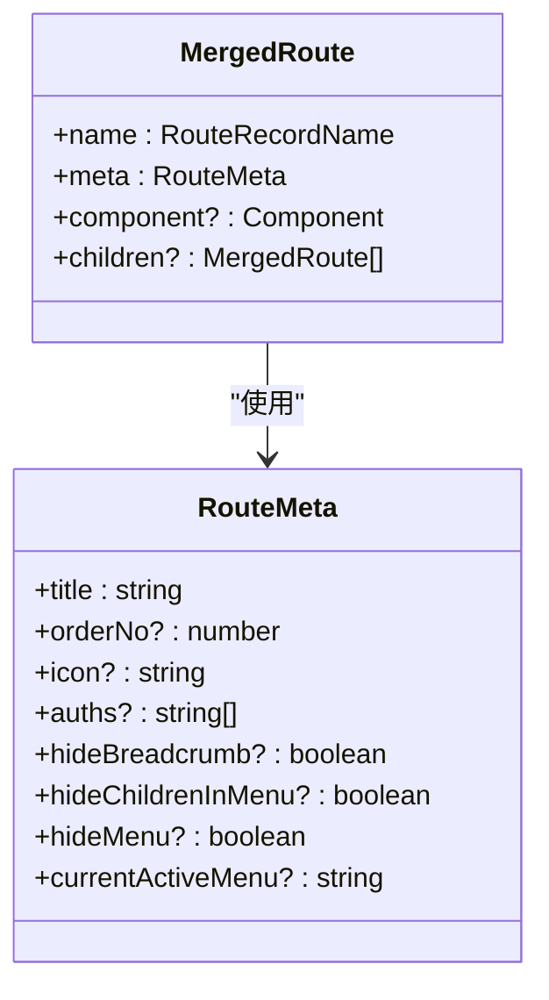
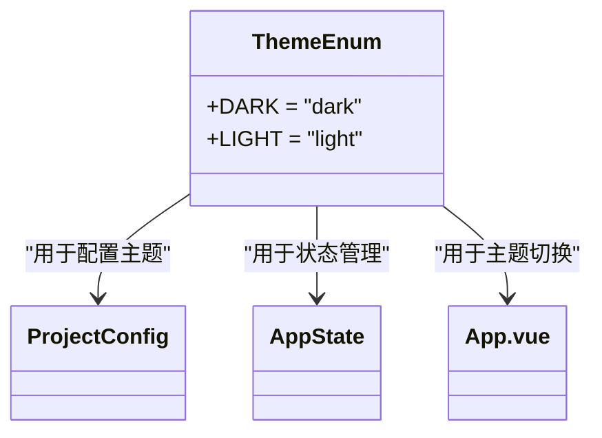

# 类型定义

<cite>
**本文档中引用的文件**   
- [config.d.ts](file://types/config.d.ts)
- [store.d.ts](file://types/store.d.ts)
- [vue-router.d.ts](file://types/vue-router.d.ts)
- [appEnum.ts](file://src/enums/appEnum.ts)
- [menuEnum.ts](file://src/enums/menuEnum.ts)
- [app.ts](file://src/stores/modules/app.ts)
- [project.ts](file://src/config/project.ts)
- [global.d.ts](file://types/global.d.ts)
</cite>

## 目录
1. [项目类型系统概述](#项目类型系统概述)
2. [全局类型文件分析](#全局类型文件分析)
3. [ProjectConfig 接口结构详解](#projectconfig-接口结构详解)
4. [Pinia Store 类型安全机制](#pinia-store-类型安全机制)
5. [Vue Router 类型扩展](#vue-router-类型扩展)
6. [枚举类型设计与应用](#枚举类型设计与应用)
7. [TypeScript 类型在项目中的核心作用](#typescript-类型在项目中的核心作用)

## 项目类型系统概述

本项目采用 TypeScript 构建完整的类型系统，通过集中式类型定义文件确保代码的类型安全性和可维护性。类型系统覆盖项目配置、状态管理、路由元信息及业务枚举等多个维度，为开发提供静态检查和智能提示支持，有效减少运行时错误。

**Section sources**
- [config.d.ts](file://types/config.d.ts#L1-L106)
- [store.d.ts](file://types/store.d.ts#L1-L38)
- [vue-router.d.ts](file://types/vue-router.d.ts#L1-L52)

## 全局类型文件分析

项目在 `types/` 目录下定义了多个全局类型声明文件，形成统一的类型基础设施：

- `config.d.ts`：定义项目配置的完整类型模型
- `store.d.ts`：为 Pinia 状态管理提供类型支持
- `vue-router.d.ts`：扩展 Vue Router 的 RouteMeta 接口
- `global.d.ts`：定义全局通用类型别名
- `module.d.ts`：声明模块导入类型

这些文件通过 TypeScript 的模块声明机制，实现了跨文件的类型共享和自动推导。

**Section sources**
- [global.d.ts](file://types/global.d.ts#L1-L34)
- [module.d.ts](file://types/module.d.ts#L1-L12)

## ProjectConfig 接口结构详解

`ProjectConfig` 接口在 `config.d.ts` 中定义，作为项目配置的核心类型，包含多个嵌套配置对象：

**Diagram sources**
- [config.d.ts](file://types/config.d.ts#L93-L102)

**Section sources**
- [config.d.ts](file://types/config.d.ts#L11-L102)
- [project.ts](file://src/config/project.ts#L27-L38)

## Pinia Store 类型安全机制

`store.d.ts` 文件为 Pinia 状态管理提供了类型声明支持，确保状态访问的安全性。通过定义 `BeforeMiniState`、`UserInfo` 和 `SiteInfo` 等接口，实现了对应用状态的精确类型描述。

在 `app.ts` store 模块中，`AppState` 接口直接引用这些类型定义，结合 `ProjectConfig` 实现了项目配置的持久化管理。`getters` 中的类型推导确保了配置项的默认值处理和缓存读取的类型安全。

**Diagram sources**
- [store.d.ts](file://types/store.d.ts#L11-L37)
- [app.ts](file://src/stores/modules/app.ts#L11-L17)

**Section sources**
- [store.d.ts](file://types/store.d.ts#L1-L38)
- [app.ts](file://src/stores/modules/app.ts#L1-L76)

## Vue Router 类型扩展

通过 `vue-router.d.ts` 文件，项目扩展了 Vue Router 的 `RouteMeta` 接口，添加了业务所需的自定义元信息字段：

这些扩展字段在路由配置中被广泛使用，如 `title` 用于页面标题，`auths` 用于权限控制，`hideMenu` 用于菜单显示控制等，为路由系统提供了丰富的元数据支持。

**Diagram sources**
- [vue-router.d.ts](file://types/vue-router.d.ts#L9-L51)
- [types.ts](file://src/router/types.ts#L55-L72)

**Section sources**
- [vue-router.d.ts](file://types/vue-router.d.ts#L1-L52)
- [types.ts](file://src/router/types.ts#L1-L72)

## 枚举类型设计与应用

项目在 `enums/` 目录下定义了多个枚举类型，用于规范常量值的使用：

### 主题枚举 (ThemeEnum)

`appEnum.ts` 中定义的 `ThemeEnum` 枚举用于管理应用的主题模式：

该枚举在多个场景中应用：
- 项目配置中的默认主题设置
- 应用状态中的暗色模式管理
- UI 组件的主题切换功能

### 菜单相关枚举

`menuEnum.ts` 文件定义了菜单相关的多个枚举：
- `MenuModeEnum`：菜单显示模式
- `MenuTypeEnum`：菜单样式类型
- `TriggerEnum`：展开按钮位置
- `MixSidebarTriggerEnum`：混合侧边栏触发方式

这些枚举确保了菜单配置的类型安全，避免了字符串字面量的错误使用。

**Diagram sources**
- [appEnum.ts](file://src/enums/appEnum.ts#L2-L5)
- [menuEnum.ts](file://src/enums/menuEnum.ts#L2-L39)

**Section sources**
- [appEnum.ts](file://src/enums/appEnum.ts#L1-L22)
- [menuEnum.ts](file://src/enums/menuEnum.ts#L1-L40)
- [useClass.ts](file://src/hooks/useClass.ts#L6-L7)

## TypeScript 类型在项目中的核心作用

TypeScript 类型系统在本项目中发挥了关键作用：

1. **减少运行时错误**：通过静态类型检查，在编译阶段捕获类型相关错误
2. **提升开发体验**：提供准确的代码补全和文档提示
3. **增强代码可维护性**：清晰的类型定义使代码意图更加明确
4. **促进团队协作**：统一的类型规范降低了沟通成本

类型系统与 Pinia、Vue Router 等核心库的深度集成，构建了一个类型安全的应用架构，为项目的长期维护和发展奠定了坚实基础。

**Section sources**
- [config.d.ts](file://types/config.d.ts#L1-L106)
- [store.d.ts](file://types/store.d.ts#L1-L38)
- [vue-router.d.ts](file://types/vue-router.d.ts#L1-L52)
- [global.d.ts](file://types/global.d.ts#L1-L34)