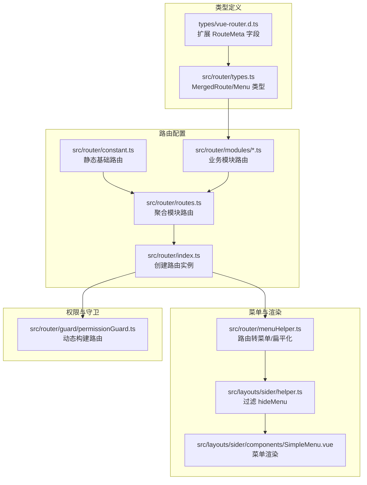
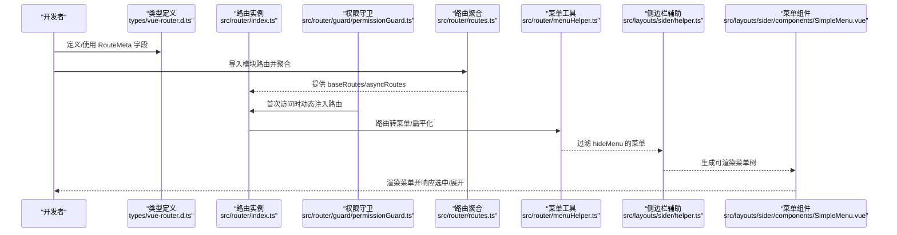
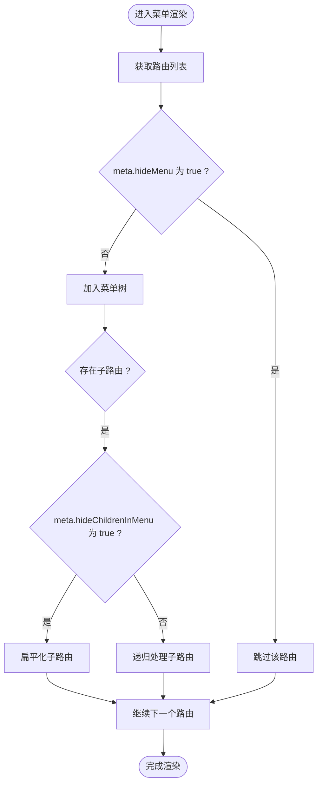
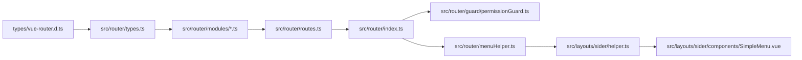

# 路由元信息类型

<cite>
**本文引用的文件**
- [types/vue-router.d.ts](file://types/vue-router.d.ts)
- [src/router/types.ts](file://src/router/types.ts)
- [src/router/modules/dashboard.ts](file://src/router/modules/dashboard.ts)
- [src/router/constant.ts](file://src/router/constant.ts)
- [src/router/routes.ts](file://src/router/routes.ts)
- [src/router/index.ts](file://src/router/index.ts)
- [src/router/menuHelper.ts](file://src/router/menuHelper.ts)
- [src/layouts/sider/helper.ts](file://src/layouts/sider/helper.ts)
- [src/layouts/sider/components/SimpleMenu.vue](file://src/layouts/sider/components/SimpleMenu.vue)
- [src/router/guard/permissionGuard.ts](file://src/router/guard/permissionGuard.ts)
</cite>

## 目录
1. [引言](#引言)
2. [项目结构](#项目结构)
3. [核心组件](#核心组件)
4. [架构总览](#架构总览)
5. [详细组件分析](#详细组件分析)
6. [依赖关系分析](#依赖关系分析)
7. [性能考量](#性能考量)
8. [故障排查指南](#故障排查指南)
9. [结论](#结论)

## 引言
本文件围绕 types/vue-router.d.ts 对 Vue Router 的类型扩展进行系统性解析，重点阐述 RouteMeta 接口通过“声明合并”为路由元信息注入丰富语义字段：title、icon、auths、hideMenu、hideChildrenInMenu、hideBreadcrumb、orderNo、currentActiveMenu 等。文档将结合 src/router/modules/dashboard.ts 等路由配置文件，说明这些元信息在实际路由定义中的用法；解释在 hideMenu 场景下 currentActiveMenu 如何指定高亮项；并给出一个完整的路由配置示例，展示这些类型的实际作用与协作流程。

## 项目结构
本项目的路由与菜单体系由“类型定义 + 路由模块 + 菜单工具 + 菜单渲染组件 + 权限守卫”共同构成：
- 类型层：types/vue-router.d.ts 通过模块声明合并扩展 RouteMeta 字段；src/router/types.ts 定义 MergedRoute 与 Menu 等业务类型。
- 路由层：src/router/constant.ts 定义静态基础路由；src/router/modules/*.ts 定义业务模块路由；src/router/routes.ts 动态聚合模块路由；src/router/index.ts 创建并导出路由实例。
- 菜单层：src/router/menuHelper.ts 提供路由转菜单、多级路由扁平化等工具；src/layouts/sider/helper.ts 过滤隐藏菜单；src/layouts/sider/components/SimpleMenu.vue 渲染菜单并与路由联动。
- 权限层：src/router/guard/permissionGuard.ts 在首次访问或刷新时按权限构建动态路由并注入。

图表来源
- [types/vue-router.d.ts](file://types/vue-router.d.ts#L1-L52)
- [src/router/types.ts](file://src/router/types.ts#L1-L73)
- [src/router/constant.ts](file://src/router/constant.ts#L1-L53)
- [src/router/modules/dashboard.ts](file://src/router/modules/dashboard.ts#L1-L21)
- [src/router/routes.ts](file://src/router/routes.ts#L1-L27)
- [src/router/index.ts](file://src/router/index.ts#L1-L39)
- [src/router/menuHelper.ts](file://src/router/menuHelper.ts#L1-L123)
- [src/layouts/sider/helper.ts](file://src/layouts/sider/helper.ts#L1-L35)
- [src/layouts/sider/components/SimpleMenu.vue](file://src/layouts/sider/components/SimpleMenu.vue#L1-L63)
- [src/router/guard/permissionGuard.ts](file://src/router/guard/permissionGuard.ts#L1-L60)

章节来源
- [types/vue-router.d.ts](file://types/vue-router.d.ts#L1-L52)
- [src/router/types.ts](file://src/router/types.ts#L1-L73)
- [src/router/constant.ts](file://src/router/constant.ts#L1-L53)
- [src/router/modules/dashboard.ts](file://src/router/modules/dashboard.ts#L1-L21)
- [src/router/routes.ts](file://src/router/routes.ts#L1-L27)
- [src/router/index.ts](file://src/router/index.ts#L1-L39)
- [src/router/menuHelper.ts](file://src/router/menuHelper.ts#L1-L123)
- [src/layouts/sider/helper.ts](file://src/layouts/sider/helper.ts#L1-L35)
- [src/layouts/sider/components/SimpleMenu.vue](file://src/layouts/sider/components/SimpleMenu.vue#L1-L63)
- [src/router/guard/permissionGuard.ts](file://src/router/guard/permissionGuard.ts#L1-L60)

## 核心组件
- RouteMeta 类型扩展：通过模块声明合并，在 vue-router 的 RouteMeta 基础上新增 title、icon、auths、hideMenu、hideChildrenInMenu、hideBreadcrumb、orderNo、currentActiveMenu 等字段，使路由具备“页面标题、图标、权限、菜单可见性、排序、面包屑可见性、当前激活菜单高亮”等语义能力。
- MergedRoute 类型：在 RouteRecordRaw 的基础上，强制 name、meta 使用 RouteMeta，约束路由配置的结构与类型安全。
- Menu 类型：用于菜单渲染的数据模型，包含 name、path、icon、orderNo、auths、hideMenu、children 及 meta 字段，便于菜单树构建与过滤。
- 路由模块与聚合：通过 import.meta.glob 动态导入 modules 下的路由模块，统一聚合为 asyncRoutes/baseRoutes，供权限守卫与菜单工具使用。
- 菜单工具：提供 routeToMenu、flatMultiLevelRoutes 等方法，支持将路由转换为菜单、处理多级路由扁平化；配合 hideMenu、hideChildrenInMenu、currentActiveMenu 实现灵活的菜单展示与高亮逻辑。

章节来源
- [types/vue-router.d.ts](file://types/vue-router.d.ts#L1-L52)
- [src/router/types.ts](file://src/router/types.ts#L1-L73)
- [src/router/routes.ts](file://src/router/routes.ts#L1-L27)

## 架构总览
下面的序列图展示了从路由配置到菜单渲染的关键流程，体现 RouteMeta 各字段在不同阶段的作用：

图表来源
- [types/vue-router.d.ts](file://types/vue-router.d.ts#L1-L52)
- [src/router/index.ts](file://src/router/index.ts#L1-L39)
- [src/router/guard/permissionGuard.ts](file://src/router/guard/permissionGuard.ts#L1-L60)
- [src/router/routes.ts](file://src/router/routes.ts#L1-L27)
- [src/router/menuHelper.ts](file://src/router/menuHelper.ts#L1-L123)
- [src/layouts/sider/helper.ts](file://src/layouts/sider/helper.ts#L1-L35)
- [src/layouts/sider/components/SimpleMenu.vue](file://src/layouts/sider/components/SimpleMenu.vue#L1-L63)

## 详细组件分析

### RouteMeta 字段详解与声明合并
- 声明合并机制：types/vue-router.d.ts 通过模块声明合并扩展 RouteMeta，使得所有路由的 meta 字段具备统一的类型约束与可选字段集合，避免运行期类型不一致带来的问题。
- 关键字段语义：
  - title：页面标题，用于面包屑、标签页标题、菜单名称等。
  - icon：菜单图标，用于菜单项的视觉标识。
  - auths：权限数组，用于权限校验与菜单过滤。
  - hideMenu：是否在菜单中隐藏该路由，默认 false。
  - hideChildrenInMenu：是否在菜单中隐藏子路由，默认 false。
  - hideBreadcrumb：是否在面包屑中隐藏该路由，默认 false。
  - orderNo：同级排序号，用于菜单排序。
  - currentActiveMenu：当 hideMenu=true 时，指定当前激活的菜单高亮项，确保面包屑与高亮状态正确。
- 类型约束：MergedRoute 将 RouteRecordRaw 的 meta 强制为 RouteMeta，保证所有路由配置均符合该约束。

章节来源
- [types/vue-router.d.ts](file://types/vue-router.d.ts#L1-L52)
- [src/router/types.ts](file://src/router/types.ts#L1-L73)

### 路由模块中的元信息应用示例
以下示例来自工作台模块，展示 RouteMeta 字段在实际路由定义中的使用：
- 父路由：设置 orderNo、icon、title、hideChildrenInMenu 等，实现“工作台”作为容器路由，子路由在菜单中隐藏但可通过面包屑导航。
- 子路由：设置 title、hideMenu、hideBreadcrumb，实现“工作台”页面本身在菜单中隐藏，仅保留面包屑入口。

章节来源
- [src/router/modules/dashboard.ts](file://src/router/modules/dashboard.ts#L1-L21)

### 菜单过滤与高亮逻辑
- 菜单过滤：src/layouts/sider/helper.ts 会过滤 meta.hideMenu 为 true 的菜单，确保隐藏路由不会出现在菜单树中。
- 多级路由扁平化：src/router/menuHelper.ts 提供扁平化能力，将多级路由提升为二级，便于菜单渲染与交互。
- 高亮策略：当某路由被 hideMenu=true 时，通常需要通过 currentActiveMenu 指向父级或某个可见路由，使菜单高亮与面包屑保持一致。

图表来源
- [src/layouts/sider/helper.ts](file://src/layouts/sider/helper.ts#L1-L35)
- [src/router/menuHelper.ts](file://src/router/menuHelper.ts#L1-L123)

章节来源
- [src/layouts/sider/helper.ts](file://src/layouts/sider/helper.ts#L1-L35)
- [src/router/menuHelper.ts](file://src/router/menuHelper.ts#L1-L123)

### 菜单组件与路由联动
- 菜单组件通过 getCurMenus 获取当前权限下的菜单列表，并调用 joinParentPath 生成完整路径，最终渲染 Ant Design Vue 的 Menu 组件。
- 选中与展开：SimpleMenu.vue 基于当前路由 path 设置 selectedKeys/openKeys，实现菜单高亮与展开；当路由被 hideMenu=true 时，currentActiveMenu 可用于指定父级高亮项，确保视觉一致性。

章节来源
- [src/layouts/sider/components/SimpleMenu.vue](file://src/layouts/sider/components/SimpleMenu.vue#L1-L63)

### 权限守卫与动态路由注入
- 首次访问或刷新页面时，权限守卫会根据用户权限构建动态路由并注入；完成后会将目标路由重定向回原路径，避免 404。
- 路由注入顺序：先注入基础路由，再注入动态路由，最后注入 404 路由，确保兜底页面始终可用。

章节来源
- [src/router/guard/permissionGuard.ts](file://src/router/guard/permissionGuard.ts#L1-L60)
- [src/router/index.ts](file://src/router/index.ts#L1-L39)

### 完整路由配置示例（字段说明）
以下示例展示如何在一个路由模块中合理使用 RouteMeta 字段，帮助理解各字段的作用与搭配：
- 父路由：title、icon、orderNo、hideChildrenInMenu
- 子路由：title、hideMenu、hideBreadcrumb、currentActiveMenu（当父路由 hideChildrenInMenu 为 true 时，建议设置 currentActiveMenu 指向父路由 path，确保菜单高亮）

章节来源
- [src/router/modules/dashboard.ts](file://src/router/modules/dashboard.ts#L1-L21)
- [types/vue-router.d.ts](file://types/vue-router.d.ts#L1-L52)

## 依赖关系分析
- 类型依赖：MergedRoute 依赖 RouteMeta；Menu 依赖 RouteMeta 的部分字段；二者共同支撑菜单渲染与权限过滤。
- 路由依赖：路由模块通过 import.meta.glob 聚合，最终由路由实例统一管理；权限守卫在首次访问时注入动态路由。
- 菜单依赖：菜单工具依赖 MergedRoute；侧边栏辅助依赖菜单过滤；菜单组件依赖菜单数据与路由状态。

图表来源
- [types/vue-router.d.ts](file://types/vue-router.d.ts#L1-L52)
- [src/router/types.ts](file://src/router/types.ts#L1-L73)
- [src/router/modules/dashboard.ts](file://src/router/modules/dashboard.ts#L1-L21)
- [src/router/routes.ts](file://src/router/routes.ts#L1-L27)
- [src/router/index.ts](file://src/router/index.ts#L1-L39)
- [src/router/menuHelper.ts](file://src/router/menuHelper.ts#L1-L123)
- [src/layouts/sider/helper.ts](file://src/layouts/sider/helper.ts#L1-L35)
- [src/layouts/sider/components/SimpleMenu.vue](file://src/layouts/sider/components/SimpleMenu.vue#L1-L63)
- [src/router/guard/permissionGuard.ts](file://src/router/guard/permissionGuard.ts#L1-L60)

章节来源
- [src/router/types.ts](file://src/router/types.ts#L1-L73)
- [src/router/modules/dashboard.ts](file://src/router/modules/dashboard.ts#L1-L21)
- [src/router/routes.ts](file://src/router/routes.ts#L1-L27)
- [src/router/index.ts](file://src/router/index.ts#L1-L39)
- [src/router/menuHelper.ts](file://src/router/menuHelper.ts#L1-L123)
- [src/layouts/sider/helper.ts](file://src/layouts/sider/helper.ts#L1-L35)
- [src/layouts/sider/components/SimpleMenu.vue](file://src/layouts/sider/components/SimpleMenu.vue#L1-L63)
- [src/router/guard/permissionGuard.ts](file://src/router/guard/permissionGuard.ts#L1-L60)

## 性能考量
- 路由聚合：通过 import.meta.glob 一次性加载模块路由，减少运行时动态导入次数，提高启动速度。
- 菜单扁平化：多级路由扁平化可降低渲染复杂度，提升菜单组件的渲染性能。
- 菜单过滤：在渲染前过滤 hideMenu 的节点，减少不必要的 DOM 结点与事件绑定。
- 高亮计算：SimpleMenu.vue 基于当前路由 path 快速定位高亮项，避免深度遍历带来的性能损耗。

## 故障排查指南
- 元信息缺失：若出现菜单不显示或高亮异常，检查对应路由 meta 是否包含 title、icon、hideMenu、hideChildrenInMenu、currentActiveMenu 等字段。
- 高亮不生效：当 hideMenu=true 时，确认是否设置了 currentActiveMenu 指向父级可见路由。
- 菜单重复或错位：检查多级路由扁平化逻辑与父路径拼接逻辑，确保 joinParentPath 正确执行。
- 权限导致的 404：刷新页面后可能因动态路由未注入而跳转 404，确认权限守卫已成功注入动态路由并重定向回原路径。

章节来源
- [src/router/guard/permissionGuard.ts](file://src/router/guard/permissionGuard.ts#L1-L60)
- [src/layouts/sider/helper.ts](file://src/layouts/sider/helper.ts#L1-L35)
- [src/layouts/sider/components/SimpleMenu.vue](file://src/layouts/sider/components/SimpleMenu.vue#L1-L63)

## 结论
types/vue-router.d.ts 通过对 RouteMeta 的声明合并扩展，为路由元信息赋予了统一且丰富的类型约束，涵盖页面标题、图标、权限、菜单可见性、排序、面包屑可见性与高亮控制等关键语义。结合 MergedRoute、Menu 等类型，以及路由模块、菜单工具与菜单组件的协同，实现了从路由配置到菜单渲染的端到端类型安全与行为可控。在 hideMenu 场景下，currentActiveMenu 的合理使用能够确保菜单高亮与面包屑的一致性，提升用户体验与开发效率。