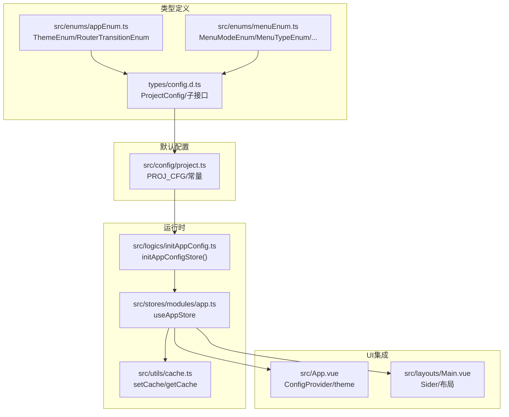
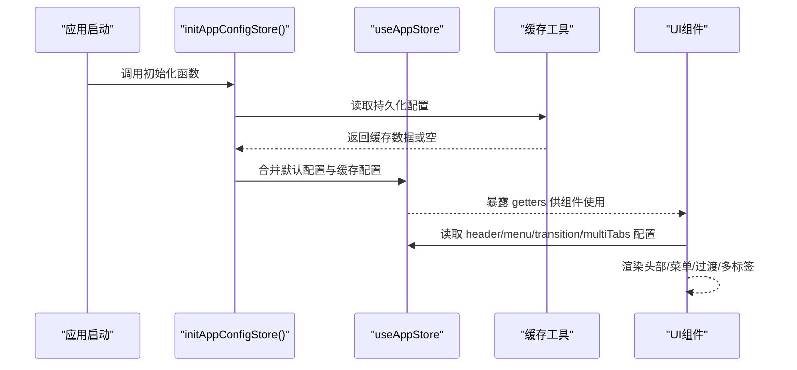
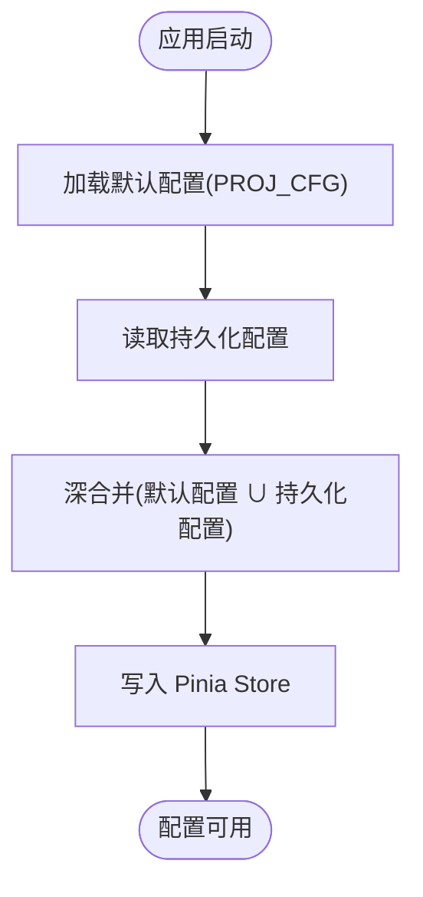
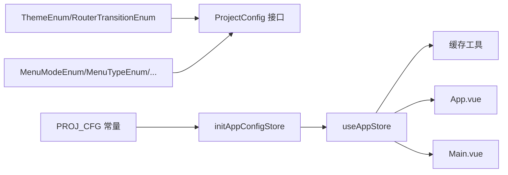

# 项目配置类型

<cite>
**本文引用的文件**
- [types/config.d.ts](file://types/config.d.ts)
- [src/config/project.ts](file://src/config/project.ts)
- [src/logics/initAppConfig.ts](file://src/logics/initAppConfig.ts)
- [src/stores/modules/app.ts](file://src/stores/modules/app.ts)
- [src/enums/appEnum.ts](file://src/enums/appEnum.ts)
- [src/enums/menuEnum.ts](file://src/enums/menuEnum.ts)
- [src/utils/cache.ts](file://src/utils/cache.ts)
- [src/App.vue](file://src/App.vue)
- [src/layouts/Main.vue](file://src/layouts/Main.vue)
</cite>

## 目录
1. [简介](#简介)
2. [项目结构](#项目结构)
3. [核心组件](#核心组件)
4. [架构总览](#架构总览)
5. [详细组件分析](#详细组件分析)
6. [依赖关系分析](#依赖关系分析)
7. [性能考量](#性能考量)
8. [故障排查指南](#故障排查指南)
9. [结论](#结论)
10. [附录](#附录)

## 简介
本文件围绕项目配置类型系统进行深入解析，重点聚焦于 types/config.d.ts 中定义的 ProjectConfig 接口及其嵌套的 HeaderSetting、MenuSetting、TransitionSetting、MultiTabsSetting 子接口。文档将从类型设计、数据流、运行时集成、错误处理与性能等方面进行全面阐述，并结合 src/config/project.ts 的实际配置示例，说明类型如何确保配置的正确性；同时给出类型安全的配置修改建议，并指出代码中标注为“待办”的潜在废弃字段（如 openNProgress）及其迁移指引。

## 项目结构
项目采用“类型定义 + 默认配置 + 运行时初始化 + 状态管理”的分层组织方式：
- 类型定义：集中于 types/config.d.ts，明确 ProjectConfig 及其子接口的字段与取值范围。
- 默认配置：位于 src/config/project.ts，提供默认配置常量与默认配置对象。
- 运行时初始化：src/logics/initAppConfig.ts 在应用启动时合并默认配置与持久化配置。
- 状态管理：src/stores/modules/app.ts 提供 Pinia Store，暴露 getters/actions 访问与更新配置。
- 枚举与缓存：src/enums/* 定义枚举值，src/utils/cache.ts 提供缓存读写能力。

图表来源
- [types/config.d.ts](file://types/config.d.ts#L1-L106)
- [src/config/project.ts](file://src/config/project.ts#L1-L39)
- [src/logics/initAppConfig.ts](file://src/logics/initAppConfig.ts#L1-L54)
- [src/stores/modules/app.ts](file://src/stores/modules/app.ts#L1-L76)
- [src/enums/appEnum.ts](file://src/enums/appEnum.ts#L1-L23)
- [src/enums/menuEnum.ts](file://src/enums/menuEnum.ts#L1-L40)
- [src/utils/cache.ts](file://src/utils/cache.ts#L1-L138)
- [src/App.vue](file://src/App.vue#L1-L42)
- [src/layouts/Main.vue](file://src/layouts/Main.vue#L1-L44)

章节来源
- [types/config.d.ts](file://types/config.d.ts#L1-L106)
- [src/config/project.ts](file://src/config/project.ts#L1-L39)
- [src/logics/initAppConfig.ts](file://src/logics/initAppConfig.ts#L1-L54)
- [src/stores/modules/app.ts](file://src/stores/modules/app.ts#L1-L76)
- [src/enums/appEnum.ts](file://src/enums/appEnum.ts#L1-L23)
- [src/enums/menuEnum.ts](file://src/enums/menuEnum.ts#L1-L40)
- [src/utils/cache.ts](file://src/utils/cache.ts#L1-L138)
- [src/App.vue](file://src/App.vue#L1-L42)
- [src/layouts/Main.vue](file://src/layouts/Main.vue#L1-L44)

## 核心组件
本节对 ProjectConfig 及其四个子接口进行逐项解读，说明每个字段的用途与约束，并结合枚举类型限定取值范围。

- ProjectConfig
  - theme: ThemeEnum，用于全局主题设置（浅色/深色）。
  - themeColor: string，项目主题色。
  - headerSetting: HeaderSetting，头部区域相关配置。
  - menuSetting: MenuSetting，菜单区域相关配置。
  - transitionSetting: TransitionSetting，页面切换动画与 loading 配置。
  - multiTabsSetting: MultiTabsSetting，多标签页相关配置。

- HeaderSetting
  - bgColor: string，头部背景色。
  - fixed: boolean，是否固定头部。
  - show: boolean，是否显示头部。
  - theme: ThemeEnum，头部主题。
  - showFullScreen: boolean，是否显示全屏按钮。
  - useLockPage: boolean，是否显示锁定按钮。
  - showDoc: boolean，是否显示帮助中心按钮。
  - showNotice: boolean，是否显示消息中心按钮。
  - showSearch: boolean，是否显示菜单搜索按钮。

- MenuSetting
  - bgColor: string，菜单背景色。
  - fixed: boolean，是否固定菜单。
  - collapsed: boolean，是否折叠菜单。
  - siderHidden: boolean，sidebar 模式下小屏菜单是否隐藏（受程序控制，非配置控制）。
  - canDrag: boolean，拖拽开关（标注为废弃功能）。
  - show: boolean，是否显示菜单。
  - hidden: boolean，隐藏开关（标注为无用）。
  - split: boolean，分类菜单（仅 mix-sidebar 模式生效）。
  - menuWidth: number，菜单宽度。
  - mode: MenuModeEnum，菜单显示模式（垂直/水平/内嵌等）。
  - type: MenuTypeEnum，菜单样式类型（sidebar/top-menu/mix/mix-sidebar）。
  - theme: ThemeEnum，菜单主题。
  - topMenuAlign: "start"|"center"|"end"，顶部菜单对齐方式（标注为无意义，建议移除）。
  - trigger: TriggerEnum，展开按钮显示位置。
  - accordion: boolean，侧边栏菜单手风琴效果。
  - closeMixSidebarOnChange: boolean，切换页面是否关闭混合菜单展开。
  - collapsedShowTitle: boolean，菜单收缩状态下是否显示标题。
  - mixSideTrigger: MixSidebarTriggerEnum，混合侧边栏触发方式。
  - mixSideFixed: boolean，混合侧边栏固定（标注为未知实现，需确认逻辑）。

- TransitionSetting
  - enable: boolean，是否开启切换动画。
  - basicTransition: RouterTransitionEnum，基础路由切换动画类型。
  - openPageLoading: boolean，是否打开页面切换 loading 动画。
  - openNProgress: boolean，是否打开顶部进度条（标注为建议移除，无必要）。

- MultiTabsSetting
  - cache: boolean，是否开启多标签缓存。
  - show: boolean，是否显示多标签。
  - showQuick: boolean，是否显示快速操作下拉列表。
  - canDrag: boolean，标签页是否可拖拽。
  - showRedo: boolean，是否显示刷新按钮。
  - showFold: boolean，是否显示折叠按钮（标注为未知实现，需补逻辑）。
  - autoCollapse: boolean，自动折叠（标注为未实现，需补逻辑）。

章节来源
- [types/config.d.ts](file://types/config.d.ts#L1-L106)
- [src/enums/appEnum.ts](file://src/enums/appEnum.ts#L1-L23)
- [src/enums/menuEnum.ts](file://src/enums/menuEnum.ts#L1-L40)

## 架构总览
下面的序列图展示了从应用启动到配置生效的关键流程：默认配置与持久化配置合并，注入 Pinia Store，并在 UI 中消费。

图表来源
- [src/logics/initAppConfig.ts](file://src/logics/initAppConfig.ts#L1-L54)
- [src/stores/modules/app.ts](file://src/stores/modules/app.ts#L1-L76)
- [src/utils/cache.ts](file://src/utils/cache.ts#L1-L138)
- [src/App.vue](file://src/App.vue#L1-L42)

## 详细组件分析

### ProjectConfig 类型与默认配置
- 类型约束：通过枚举与字面量联合类型严格限制取值范围，避免非法值进入运行时。
- 默认配置：src/config/project.ts 提供默认主题、主题色、默认配置对象等常量与默认配置。
- 运行时合并：initAppConfig.ts 使用深合并策略将默认配置与持久化配置合并，确保用户自定义优先级更高。

图表来源
- [src/config/project.ts](file://src/config/project.ts#L1-L39)
- [src/logics/initAppConfig.ts](file://src/logics/initAppConfig.ts#L1-L54)
- [src/stores/modules/app.ts](file://src/stores/modules/app.ts#L1-L76)

章节来源
- [src/config/project.ts](file://src/config/project.ts#L1-L39)
- [src/logics/initAppConfig.ts](file://src/logics/initAppConfig.ts#L1-L54)
- [src/stores/modules/app.ts](file://src/stores/modules/app.ts#L1-L76)

### HeaderSetting 配置项详解
- 用途：控制头部区域的外观与交互行为，如固定、主题、按钮显隐等。
- 关键点：
  - bgColor/fixed/theme 控制头部外观与定位。
  - showFullScreen/useLockPage/showDoc/showNotice/showSearch 控制头部按钮集合。
- 实际影响：这些配置直接影响头部组件的渲染与交互，例如搜索、通知、用户信息等模块的可见性。

章节来源
- [types/config.d.ts](file://types/config.d.ts#L12-L28)

### MenuSetting 配置项详解
- 用途：控制菜单区域的外观、行为与交互，包括宽度、模式、类型、对齐方式、展开方式等。
- 关键点：
  - menuWidth 控制侧边栏宽度。
  - mode/type/trigger 等决定菜单的显示形态与交互方式。
  - accordion/collapsed/closeMixSidebarOnChange 等控制菜单行为细节。
- 废弃/待完善字段：
  - canDrag/hidden：标注为废弃或无用。
  - topMenuAlign：标注为无意义，建议移除。
  - mixSideFixed：标注为未知实现，需确认逻辑。
- 实际影响：这些配置会影响布局组件（如 Main.vue）的 Sider 宽度与折叠行为，以及头部菜单按钮的显隐。

章节来源
- [types/config.d.ts](file://types/config.d.ts#L30-L60)
- [src/enums/menuEnum.ts](file://src/enums/menuEnum.ts#L1-L40)
- [src/layouts/Main.vue](file://src/layouts/Main.vue#L1-L44)

### TransitionSetting 配置项详解
- 用途：控制页面切换动画与 loading 行为。
- 关键点：
  - enable/basicTransition 控制切换动画类型。
  - openPageLoading 控制页面切换 loading 动画。
  - openNProgress：标注为建议移除，无必要。
- 实际影响：这些配置会影响路由切换时的视觉反馈与用户体验。

章节来源
- [types/config.d.ts](file://types/config.d.ts#L62-L71)
- [src/enums/appEnum.ts](file://src/enums/appEnum.ts#L1-L23)

### MultiTabsSetting 配置项详解
- 用途：控制多标签页的显示、拖拽、刷新、折叠等行为。
- 关键点：
  - cache/show/showQuick/canDrag/showRedo 控制标签页的外观与交互。
  - showFold/autoCollapse：标注为未知实现或未完成，需补充逻辑。
- 实际影响：这些配置会影响标签页容器的渲染与交互，例如刷新按钮、折叠按钮等。

章节来源
- [types/config.d.ts](file://types/config.d.ts#L73-L89)

### 类型安全的配置修改示例
- 修改头部配置（类型安全）
  - 步骤：通过 Pinia Store 的 setProjectConfig 动作传入部分配置对象，内部使用深合并策略与缓存持久化。
  - 示例路径：[setProjectConfig 动作](file://src/stores/modules/app.ts#L69-L73)
- 修改菜单宽度（类型安全）
  - 步骤：传入包含 menuWidth 的部分配置对象，确保类型检查通过。
  - 示例路径：[menuSetting 字段定义](file://types/config.d.ts#L44-L46)
- 修改页面切换 loading（类型安全）
  - 步骤：传入包含 transitionSetting.openPageLoading 的部分配置对象。
  - 示例路径：[transitionSetting 字段定义](file://types/config.d.ts#L67-L69)

章节来源
- [src/stores/modules/app.ts](file://src/stores/modules/app.ts#L69-L73)
- [types/config.d.ts](file://types/config.d.ts#L44-L46)
- [types/config.d.ts](file://types/config.d.ts#L67-L69)

### 废弃与待完善字段的迁移指引
- openNProgress：标注为建议移除，无必要。迁移建议：
  - 若仍需顶部进度条，可考虑使用替代方案或自定义实现，但不在当前类型体系内。
  - 示例路径：[废弃字段标注](file://types/config.d.ts#L70-L71)
- canDrag/hidden：标注为废弃或无用。迁移建议：
  - 删除相关配置，避免误导。
  - 示例路径：[废弃字段标注](file://types/config.d.ts#L39-L41)
- topMenuAlign：标注为无意义，建议移除。迁移建议：
  - 统一左对齐策略，减少配置歧义。
  - 示例路径：[废弃字段标注](file://types/config.d.ts#L49-L50)
- mixSideFixed/showFold/autoCollapse：标注为未知实现或未完成。迁移建议：
  - 明确需求后补充逻辑，或删除无效配置。
  - 示例路径：[待完善字段标注](file://types/config.d.ts#L59-L60)
  - 示例路径：[待完善字段标注](file://types/config.d.ts#L86-L89)

章节来源
- [types/config.d.ts](file://types/config.d.ts#L39-L41)
- [types/config.d.ts](file://types/config.d.ts#L49-L50)
- [types/config.d.ts](file://types/config.d.ts#L59-L60)
- [types/config.d.ts](file://types/config.d.ts#L70-L71)
- [types/config.d.ts](file://types/config.d.ts#L86-L89)

## 依赖关系分析
- 类型依赖：ProjectConfig 依赖多个枚举类型（ThemeEnum、RouterTransitionEnum、MenuModeEnum、MenuTypeEnum、TriggerEnum、MixSidebarTriggerEnum），保证取值合法。
- 默认配置依赖：PROJ_CFG 依赖 ThemeEnum、PRIMARY_COLOR 等常量。
- 运行时依赖：initAppConfigStore 依赖 PROJ_CFG 与缓存工具；useAppStore 依赖枚举与缓存工具。
- UI 依赖：App.vue 通过 ConfigProvider 与主题配置联动；Main.vue 通过 Sider 宽度与折叠状态消费菜单配置。

图表来源
- [types/config.d.ts](file://types/config.d.ts#L1-L106)
- [src/config/project.ts](file://src/config/project.ts#L1-L39)
- [src/logics/initAppConfig.ts](file://src/logics/initAppConfig.ts#L1-L54)
- [src/stores/modules/app.ts](file://src/stores/modules/app.ts#L1-L76)
- [src/enums/appEnum.ts](file://src/enums/appEnum.ts#L1-L23)
- [src/enums/menuEnum.ts](file://src/enums/menuEnum.ts#L1-L40)
- [src/utils/cache.ts](file://src/utils/cache.ts#L1-L138)
- [src/App.vue](file://src/App.vue#L1-L42)
- [src/layouts/Main.vue](file://src/layouts/Main.vue#L1-L44)

章节来源
- [types/config.d.ts](file://types/config.d.ts#L1-L106)
- [src/config/project.ts](file://src/config/project.ts#L1-L39)
- [src/logics/initAppConfig.ts](file://src/logics/initAppConfig.ts#L1-L54)
- [src/stores/modules/app.ts](file://src/stores/modules/app.ts#L1-L76)
- [src/enums/appEnum.ts](file://src/enums/appEnum.ts#L1-L23)
- [src/enums/menuEnum.ts](file://src/enums/menuEnum.ts#L1-L40)
- [src/utils/cache.ts](file://src/utils/cache.ts#L1-L138)
- [src/App.vue](file://src/App.vue#L1-L42)
- [src/layouts/Main.vue](file://src/layouts/Main.vue#L1-L44)

## 性能考量
- 深合并策略：initAppConfig.ts 与 useAppStore 的 setProjectConfig 均采用深合并，避免重复覆盖，提升配置合并效率。
- 缓存持久化：通过缓存工具将配置持久化至 localStorage/sessionStorage，减少每次启动的计算成本。
- 枚举约束：严格的枚举取值减少运行时分支判断与异常处理成本，提高稳定性。

[本节为通用性能讨论，无需特定文件引用]

## 故障排查指南
- 配置未生效
  - 检查是否调用了初始化函数与 setProjectConfig 动作。
  - 确认缓存键与版本号一致，避免旧缓存覆盖新配置。
  - 示例路径：[初始化与合并](file://src/logics/initAppConfig.ts#L1-L54)，[缓存工具](file://src/utils/cache.ts#L1-L138)
- 配置类型报错
  - 确保传入的配置对象符合 ProjectConfig/子接口定义，避免拼写错误或类型不匹配。
  - 示例路径：[类型定义](file://types/config.d.ts#L1-L106)
- 废弃字段导致困惑
  - 删除或忽略标注为废弃/待完善的字段，避免误用。
  - 示例路径：[废弃字段标注](file://types/config.d.ts#L39-L41)，[topMenuAlign](file://types/config.d.ts#L49-L50)，[openNProgress](file://types/config.d.ts#L70-L71)，[mixSideFixed](file://types/config.d.ts#L59-L60)，[showFold/autoCollapse](file://types/config.d.ts#L86-L89)

章节来源
- [src/logics/initAppConfig.ts](file://src/logics/initAppConfig.ts#L1-L54)
- [src/stores/modules/app.ts](file://src/stores/modules/app.ts#L69-L73)
- [src/utils/cache.ts](file://src/utils/cache.ts#L1-L138)
- [types/config.d.ts](file://types/config.d.ts#L39-L41)
- [types/config.d.ts](file://types/config.d.ts#L49-L50)
- [types/config.d.ts](file://types/config.d.ts#L70-L71)
- [types/config.d.ts](file://types/config.d.ts#L59-L60)
- [types/config.d.ts](file://types/config.d.ts#L86-L89)

## 结论
ProjectConfig 类型系统通过严格的接口与枚举约束，确保了配置的类型安全与一致性；默认配置与持久化配置的合并机制保障了用户体验与个性化设置的持久化。对于标注为废弃或待完善的字段，建议逐步清理或补齐逻辑，以维持配置体系的简洁与清晰。通过 Pinia Store 的 getters/actions，UI 组件可以安全、高效地消费与更新配置。

[本节为总结性内容，无需特定文件引用]

## 附录
- UI 集成要点
  - App.vue 通过 ConfigProvider 与主题配置联动，体现 theme 与 themeColor 的作用。
  - Main.vue 通过 Sider 的宽度与折叠状态消费 menuSetting 的相关配置。
  - 示例路径：[App.vue](file://src/App.vue#L1-L42)，[Main.vue](file://src/layouts/Main.vue#L1-L44)

章节来源
- [src/App.vue](file://src/App.vue#L1-L42)
- [src/layouts/Main.vue](file://src/layouts/Main.vue#L1-L44)