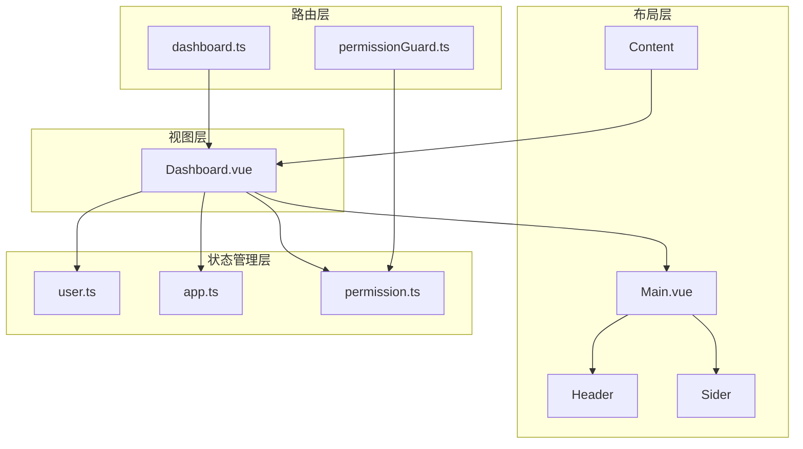
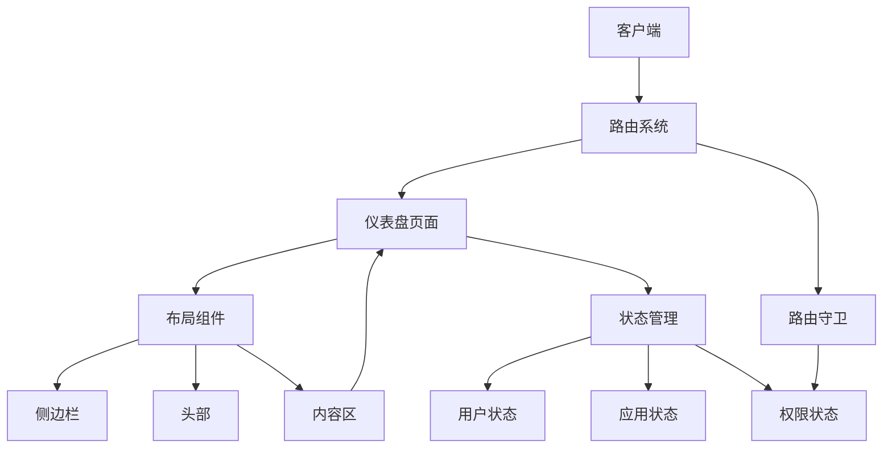
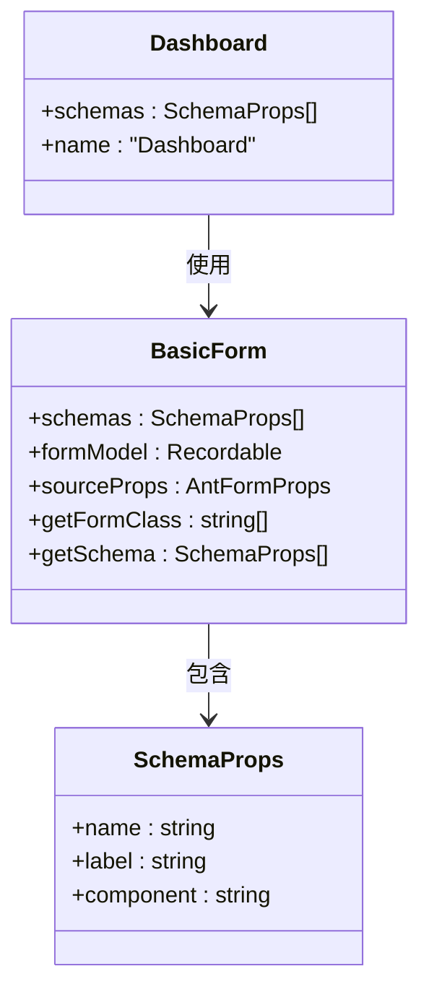
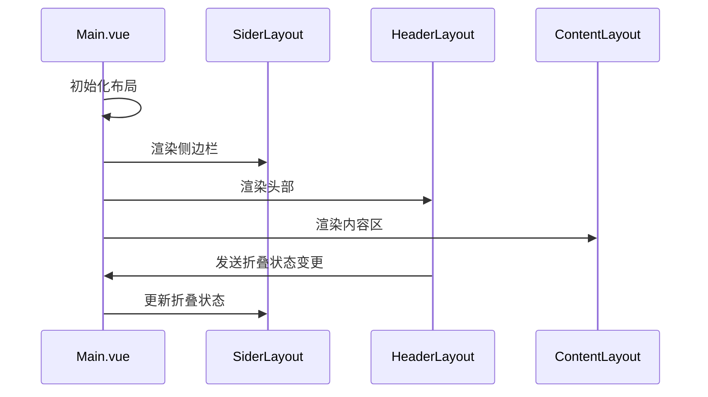
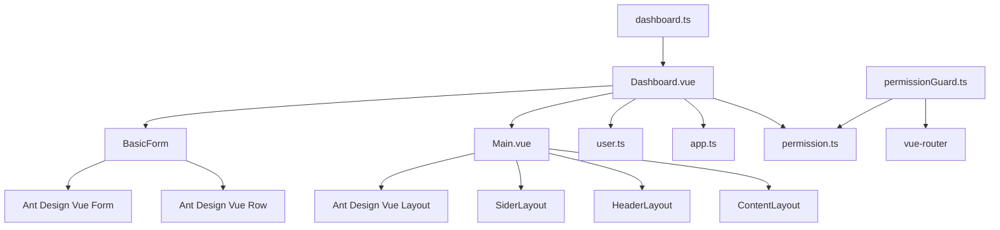

# 仪表盘页面

<cite>
**本文档中引用的文件**   
- [Dashboard.vue](file://src/views/dashboard/Dashboard.vue)
- [Main.vue](file://src/layouts/Main.vue)
- [user.ts](file://src/stores/modules/user.ts)
- [app.ts](file://src/stores/modules/app.ts)
- [permission.ts](file://src/stores/modules/permission.ts)
- [permissionGuard.ts](file://src/router/guard/permissionGuard.ts)
- [dashboard.ts](file://src/router/modules/dashboard.ts)
- [BasicForm.vue](file://src/components/Form/src/BasicForm.vue)
</cite>

## 目录
1. [简介](#简介)
2. [项目结构](#项目结构)
3. [核心组件](#核心组件)
4. [架构概述](#架构概述)
5. [详细组件分析](#详细组件分析)
6. [依赖分析](#依赖分析)
7. [性能考虑](#性能考虑)
8. [故障排除指南](#故障排除指南)
9. [结论](#结论)

## 简介
仪表盘页面（Dashboard.vue）作为系统首页，目前实现为一个基于表单的界面，用于展示和收集用户输入。该页面通过路由配置集成到应用的整体导航结构中，并利用布局组件构建用户界面。尽管当前实现主要关注表单功能，但其架构设计为未来扩展数据可视化功能提供了基础。

## 项目结构
仪表盘页面位于`src/views/dashboard/`目录下，作为应用视图层的一部分。该页面通过路由模块`dashboard.ts`进行配置，并与全局状态管理、布局组件和UI库组件进行交互。整体结构遵循Vue 3的组合式API设计模式，使用TypeScript进行类型定义。



**Diagram sources**
- [Dashboard.vue](file://src/views/dashboard/Dashboard.vue)
- [Main.vue](file://src/layouts/Main.vue)
- [user.ts](file://src/stores/modules/user.ts)
- [app.ts](file://src/stores/modules/app.ts)
- [permission.ts](file://src/stores/modules/permission.ts)
- [permissionGuard.ts](file://src/router/guard/permissionGuard.ts)
- [dashboard.ts](file://src/router/modules/dashboard.ts)

**Section sources**
- [Dashboard.vue](file://src/views/dashboard/Dashboard.vue)
- [Main.vue](file://src/layouts/Main.vue)
- [dashboard.ts](file://src/router/modules/dashboard.ts)

## 核心组件
仪表盘页面的核心功能基于`BasicForm`组件实现，该组件接收`schemas`属性来定义表单结构。页面通过导入`BasicForm`和`SchemaProps`类型，创建了一个包含输入字段的简单表单。当前实现中，表单仅包含一个姓名输入字段，展示了基本的表单构建能力。

**Section sources**
- [Dashboard.vue](file://src/views/dashboard/Dashboard.vue#L1-L11)
- [BasicForm.vue](file://src/components/Form/src/BasicForm.vue#L1-L54)

## 架构概述
仪表盘页面的架构基于Ant Design Vue的布局组件，通过`Main.vue`中的`Layout`、`Sider`、`Header`和`Content`组件构建整体界面结构。页面通过路由系统集成到应用中，并利用Pinia进行状态管理。权限控制通过路由守卫实现，确保页面访问的安全性。



**Diagram sources**
- [Main.vue](file://src/layouts/Main.vue#L1-L44)
- [dashboard.ts](file://src/router/modules/dashboard.ts#L1-L20)
- [permissionGuard.ts](file://src/router/guard/permissionGuard.ts#L1-L60)

## 详细组件分析

### 仪表盘页面分析
仪表盘页面作为系统首页，当前实现为一个简单的表单界面。该页面使用Vue 3的`<script setup>`语法糖，通过导入`BasicForm`组件并定义表单模式（schemas）来构建用户界面。



**Diagram sources**
- [Dashboard.vue](file://src/views/dashboard/Dashboard.vue#L1-L11)
- [BasicForm.vue](file://src/components/Form/src/BasicForm.vue#L1-L54)

### 布局组件分析
布局组件`Main.vue`定义了应用的整体结构，使用Ant Design Vue的`Layout`组件构建响应式界面。该组件包含侧边栏（Sider）、头部（Header）和内容区（Content），通过响应式设计适应不同屏幕尺寸。



**Diagram sources**
- [Main.vue](file://src/layouts/Main.vue#L1-L44)
- [header/index.vue](file://src/layouts/header/index.vue#L1-L42)
- [sider/index.vue](file://src/layouts/sider/index.vue#L1-L18)
- [content/index.vue](file://src/layouts/content/index.vue#L1-L54)

### 状态管理分析
状态管理模块通过Pinia实现，包含用户状态、应用状态和权限状态。仪表盘页面可以通过这些状态管理模块获取用户信息和系统配置。

```mermaid
classDiagram
class UserStore {
+state : {}
+getters : {}
+actions : {}
}
class AppStore {
+darkMode : ThemeEnum
+pageLoading : boolean
+projectConfig : Partial<ProjectConfig>
+beforeMiniInfo : BeforeMiniState
+siteInfo : SiteInfo | null
+getPageLoading() : boolean
+getDarkMode() : ThemeEnum | string
+setPageLoading(loading : boolean) : void
+setDarkMode(mode : ThemeEnum) : void
+setProjectConfig(config : Partial<ProjectConfig>) : void
}
class PermissionStore {
+menuList : MergedRoute[]
+isDynamicAddedRoute : boolean
+getMenuList() : MergedRoute[]
+getIsDynamicAddedRoute() : boolean
+setMenuList(list : MergedRoute[]) : void
+setDynamicAddedRoute(added : boolean) : void
+buildRoutesAction() : MergedRoute[]
}
AppStore --> UserStore : 依赖
PermissionStore --> UserStore : 依赖
```

**Diagram sources**
- [user.ts](file://src/stores/modules/user.ts#L1-L28)
- [app.ts](file://src/stores/modules/app.ts#L1-L76)
- [permission.ts](file://src/stores/modules/permission.ts#L1-L67)

## 依赖分析
仪表盘页面及其相关组件依赖于多个核心模块，包括路由系统、状态管理、UI组件库和工具函数。这些依赖关系确保了页面功能的完整性和可维护性。



**Diagram sources**
- [go.mod](file://package.json)
- [Dashboard.vue](file://src/views/dashboard/Dashboard.vue)
- [Main.vue](file://src/layouts/Main.vue)
- [user.ts](file://src/stores/modules/user.ts)
- [app.ts](file://src/stores/modules/app.ts)
- [permission.ts](file://src/stores/modules/permission.ts)
- [permissionGuard.ts](file://src/router/guard/permissionGuard.ts)
- [dashboard.ts](file://src/router/modules/dashboard.ts)

**Section sources**
- [package.json](file://package.json)
- [Dashboard.vue](file://src/views/dashboard/Dashboard.vue)
- [Main.vue](file://src/layouts/Main.vue)
- [user.ts](file://src/stores/modules/user.ts)
- [app.ts](file://src/stores/modules/app.ts)
- [permission.ts](file://src/stores/modules/permission.ts)
- [permissionGuard.ts](file://src/router/guard/permissionGuard.ts)
- [dashboard.ts](file://src/router/modules/dashboard.ts)

## 性能考虑
当前仪表盘页面的性能表现良好，由于其简单的表单结构，渲染开销较小。布局组件使用了异步组件加载（如`createAsyncComponent`），有助于减少初始加载时间。状态管理通过Pinia实现，提供了高效的响应式数据绑定。

## 故障排除指南
当仪表盘页面出现问题时，可以检查以下常见问题：

1. **表单不显示**：检查`BasicForm`组件是否正确导入，以及`schemas`属性是否正确配置。
2. **布局错乱**：检查CSS类名是否正确应用，以及响应式断点设置是否合理。
3. **状态无法获取**：检查Pinia store是否正确初始化，以及状态获取方法是否正确调用。
4. **路由无法访问**：检查路由配置是否正确，以及权限守卫是否阻止了访问。

**Section sources**
- [Dashboard.vue](file://src/views/dashboard/Dashboard.vue#L1-L11)
- [Main.vue](file://src/layouts/Main.vue#L1-L44)
- [user.ts](file://src/stores/modules/user.ts#L1-L28)
- [app.ts](file://src/stores/modules/app.ts#L1-L76)
- [permissionGuard.ts](file://src/router/guard/permissionGuard.ts#L1-L60)

## 结论
当前的仪表盘页面实现了一个基本的表单界面，展示了应用的核心架构和组件交互模式。虽然缺少数据可视化功能，但其基于`BasicForm`的实现方式为未来扩展提供了良好的基础。通过布局组件、状态管理和路由系统的集成，该页面展示了现代化Vue应用的典型架构特征。建议在未来版本中扩展数据可视化功能，以实现完整的仪表盘功能。