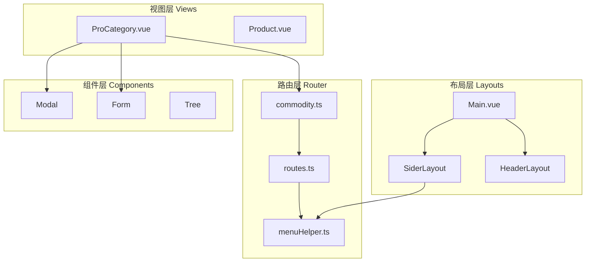
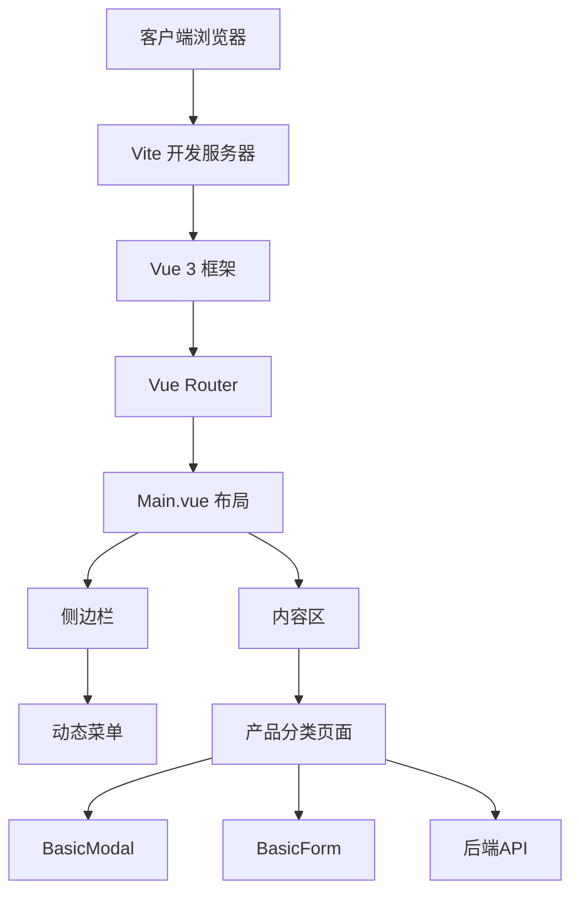
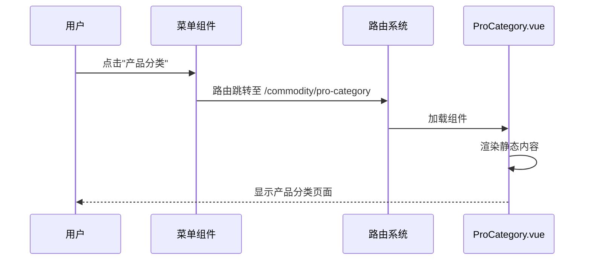
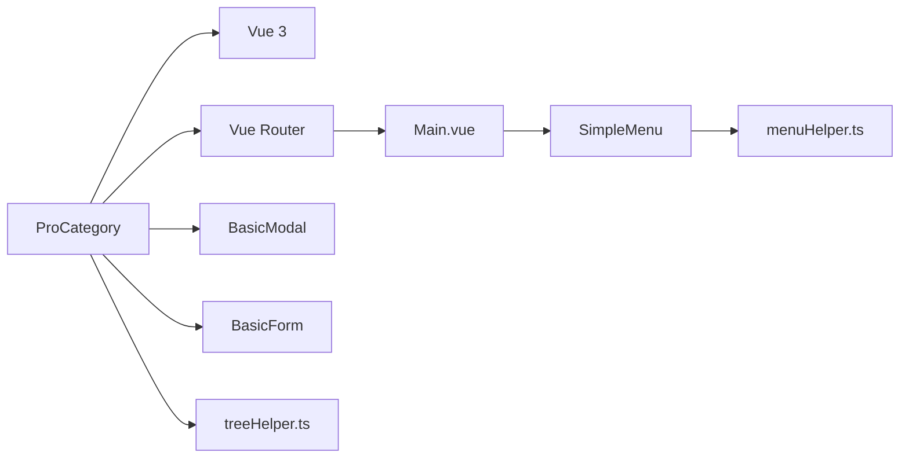

# 产品分类

<cite>
**本文档引用的文件**   
- [ProCategory.vue](file://src/views/commodity/ProCategory/ProCategory.vue)
- [commodity.ts](file://src/router/modules/commodity.ts)
- [Main.vue](file://src/layouts/Main.vue)
- [SimpleMenu.vue](file://src/layouts/sider/components/SimpleMenu.vue)
- [BasicSubMenuItem.vue](file://src/layouts/sider/components/BasicSubMenuItem.vue)
- [MenuItemContent.vue](file://src/layouts/sider/components/MenuItemContent.vue)
- [menuHelper.ts](file://src/router/menuHelper.ts)
- [treeHelper.ts](file://src/utils/treeHelper.ts)
- [BasicModal.vue](file://src/components/Modal/src/BasicModal.vue)
- [BasicForm.vue](file://src/components/Form/src/BasicForm.vue)
</cite>

## 目录
1. [介绍](#介绍)
2. [项目结构](#项目结构)
3. [核心组件](#核心组件)
4. [架构概述](#架构概述)
5. [详细组件分析](#详细组件分析)
6. [依赖分析](#依赖分析)
7. [性能考虑](#性能考虑)
8. [故障排除指南](#故障排除指南)
9. [结论](#结论)

## 介绍
本文档深入分析了产品分类页面（ProCategory.vue）的设计意图与功能定位。该组件作为商品管理体系中的关键部分，目前实现了静态结构展示，并具备未来扩展为树形结构、分类排序和层级编辑的潜力。通过 `defineOptions` 设置组件名称并与路由系统集成，实现了菜单导航功能。结合项目整体架构，该组件可进一步集成动态数据加载、表单编辑功能，并与 Modal、Form 等通用组件协作，提升可维护性和扩展性。

## 项目结构
项目采用模块化设计，视图层位于 `src/views` 目录下，按业务领域划分（如商品管理、仪表盘、系统管理）。产品分类页面位于 `commodity/ProCategory/ProCategory.vue`，属于商品管理模块。路由配置通过 `src/router/modules/commodity.ts` 定义，使用懒加载方式引入组件。整体布局由 `Main.vue` 提供，包含侧边栏、头部和内容区域，菜单导航通过递归组件实现。

**Diagram sources**
- [ProCategory.vue](file://src/views/commodity/ProCategory/ProCategory.vue)
- [commodity.ts](file://src/router/modules/commodity.ts)
- [Main.vue](file://src/layouts/Main.vue)
- [menuHelper.ts](file://src/router/menuHelper.ts)

**Section sources**
- [ProCategory.vue](file://src/views/commodity/ProCategory/ProCategory.vue)
- [commodity.ts](file://src/router/modules/commodity.ts)
- [Main.vue](file://src/layouts/Main.vue)

## 核心组件
`ProCategory.vue` 组件当前为一个简单的静态页面，展示“产品分类”标题及两个图像资源。其设计意图是作为未来功能扩展的基础模板。通过 `defineOptions({ name: "ProCategory" })` 显式设置组件名称，便于在开发工具中识别和调试。该名称也与路由配置中的 `name: "ProCategory"` 保持一致，确保路由跳转和菜单激活的正确性。

**Section sources**
- [ProCategory.vue](file://src/views/commodity/ProCategory/ProCategory.vue)

## 架构概述
系统采用 Vue 3 + TypeScript + Vite 技术栈，结合 Ant Design Vue 组件库构建。路由系统基于 Vue Router 4，使用模块化方式组织路由配置。菜单导航通过 `SimpleMenu` 及其子组件递归渲染路由元数据生成。`treeHelper.ts` 提供了树形结构处理能力，为未来实现分类的树形展示和层级编辑奠定了基础。Modal 和 Form 组件封装了通用交互逻辑，支持在 ProCategory 中弹出编辑表单。

**Diagram sources**
- [Main.vue](file://src/layouts/Main.vue)
- [commodity.ts](file://src/router/modules/commodity.ts)
- [BasicModal.vue](file://src/components/Modal/src/BasicModal.vue)
- [BasicForm.vue](file://src/components/Form/src/BasicForm.vue)

## 详细组件分析

### ProCategory 组件分析
该组件目前仅包含静态模板，未来可扩展为动态管理界面。其核心价值在于与路由系统的无缝集成。通过路由配置中的 `meta: { orderNo: 1, title: "产品分类" }`，实现了菜单项的排序和标题显示。`MenuItemContent.vue` 组件读取此元数据渲染菜单文本和图标。

#### 对于 API/Service 组件：

**Diagram sources**
- [commodity.ts](file://src/router/modules/commodity.ts)
- [SimpleMenu.vue](file://src/layouts/sider/components/SimpleMenu.vue)
- [ProCategory.vue](file://src/views/commodity/ProCategory/ProCategory.vue)

**Section sources**
- [ProCategory.vue](file://src/views/commodity/ProCategory/ProCategory.vue)
- [commodity.ts](file://src/router/modules/commodity.ts)
- [SimpleMenu.vue](file://src/layouts/sider/components/SimpleMenu.vue)

### 可扩展性设计建议
1. **树形结构展示**：利用 `treeHelper.ts` 的 `treeMap` 和 `filter` 方法处理分类数据，结合 Ant Design Vue 的 Tree 组件实现可视化。
2. **分类排序**：在表单中添加排序字段，通过拖拽或数字输入调整顺序，数据持久化至后端。
3. **层级编辑**：集成 `BasicModal` 和 `BasicForm`，在模态框中提供分类的增删改查功能，支持设置父级分类。
4. **动态数据加载**：在 `onMounted` 钩子中调用 API 获取分类数据，替代当前的静态内容。
5. **权限控制**：结合 `usePermission.ts` 钩子，根据用户角色控制编辑功能的可见性。

## 依赖分析
`ProCategory.vue` 直接依赖于 Vue 3 的 `defineOptions` 宏。它通过路由系统间接依赖 `Main.vue` 布局组件和 `SimpleMenu` 导航组件。菜单渲染依赖于 `menuHelper.ts` 对路由数据的处理。未来若实现树形功能，将依赖 `treeHelper.ts` 工具函数。与 Modal 和 Form 组件的协作将增强其交互能力。

**Diagram sources**
- [ProCategory.vue](file://src/views/commodity/ProCategory/ProCategory.vue)
- [Main.vue](file://src/layouts/Main.vue)
- [SimpleMenu.vue](file://src/layouts/sider/components/SimpleMenu.vue)
- [menuHelper.ts](file://src/router/menuHelper.ts)
- [treeHelper.ts](file://src/utils/treeHelper.ts)

**Section sources**
- [ProCategory.vue](file://src/views/commodity/ProCategory/ProCategory.vue)
- [Main.vue](file://src/layouts/Main.vue)
- [menuHelper.ts](file://src/router/menuHelper.ts)

## 性能考虑
当前组件为静态页面，性能表现优异。未来集成动态数据时，应注意：
- 使用懒加载避免初始加载过多数据
- 对树形结构进行虚拟滚动优化
- 合理使用 `computed` 和 `ref` 避免不必要的重渲染
- 在 `BasicModal` 中启用 `destroyOnClose` 以释放内存

## 故障排除指南
常见问题及解决方案：
- **菜单不显示**：检查路由模块是否正确导入，`meta.hideMenu` 是否为 `true`
- **页面空白**：确认路由路径拼写正确，组件路径是否可解析
- **名称未定义**：确保 `defineOptions` 正确设置 `name` 属性
- **图标不显示**：验证 `meta.icon` 值是否符合图标库规范

**Section sources**
- [commodity.ts](file://src/router/modules/commodity.ts)
- [ProCategory.vue](file://src/views/commodity/ProCategory/ProCategory.vue)

## 结论
`ProCategory.vue` 组件虽当前功能简单，但已构建在完善的架构基础之上。通过标准化的路由集成和组件命名，为未来的功能扩展提供了清晰路径。建议优先实现动态数据加载和基础的增删改查功能，再逐步引入树形结构和高级排序能力，最终打造一个高效易用的产品分类管理系统。